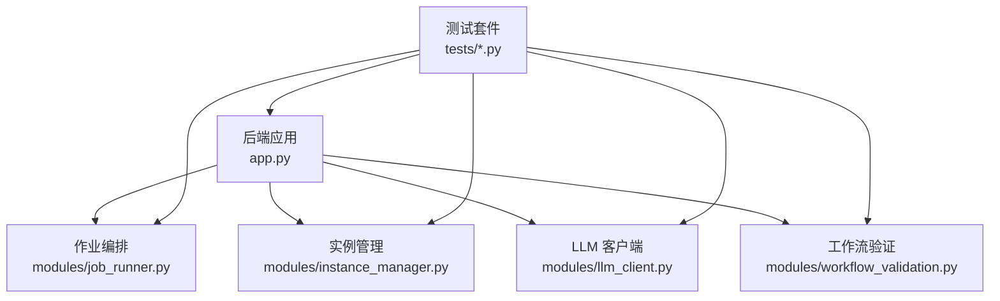
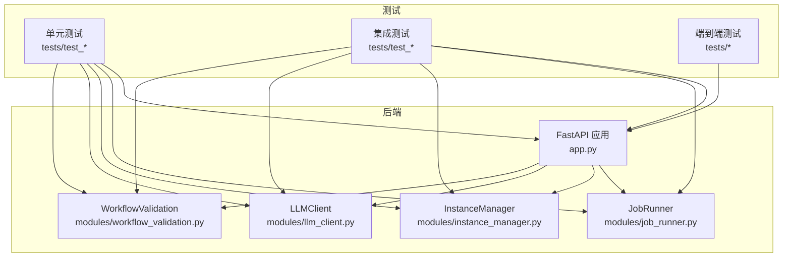
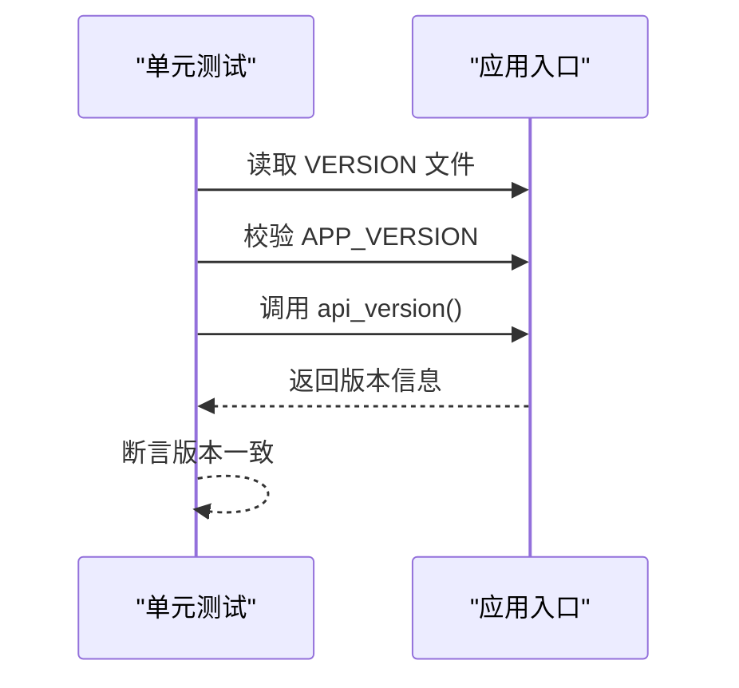
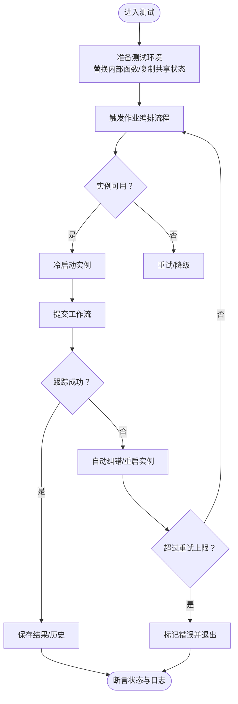
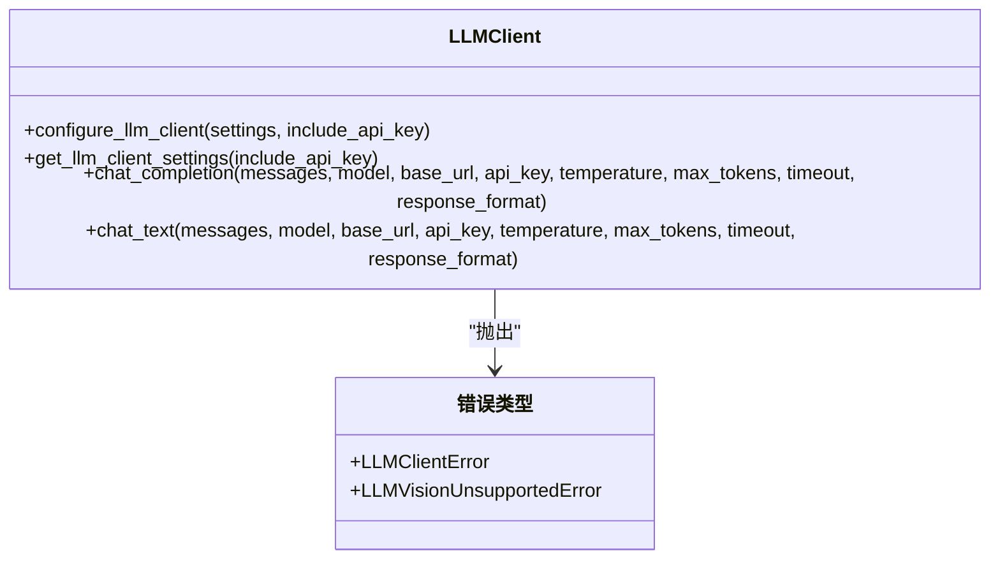
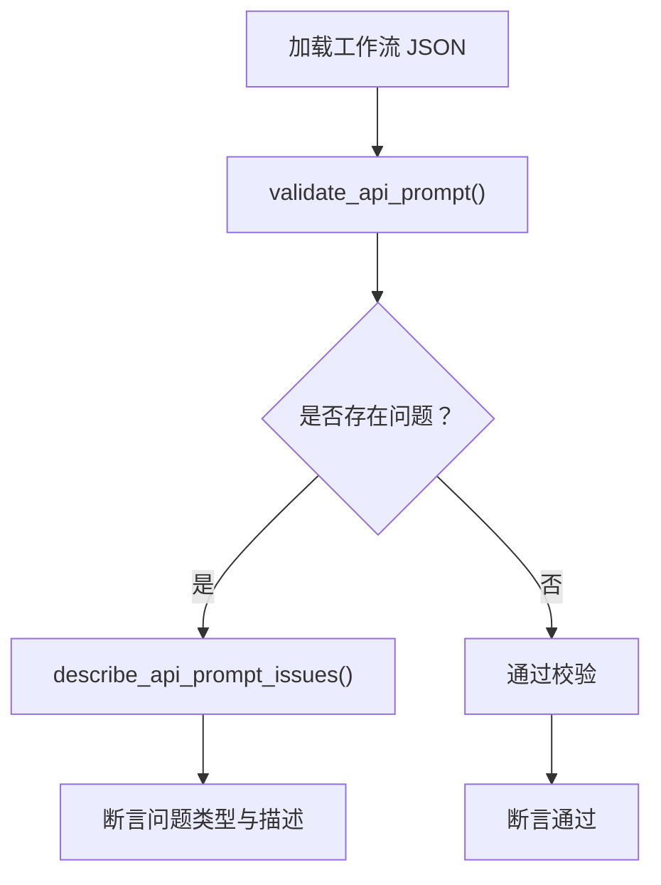
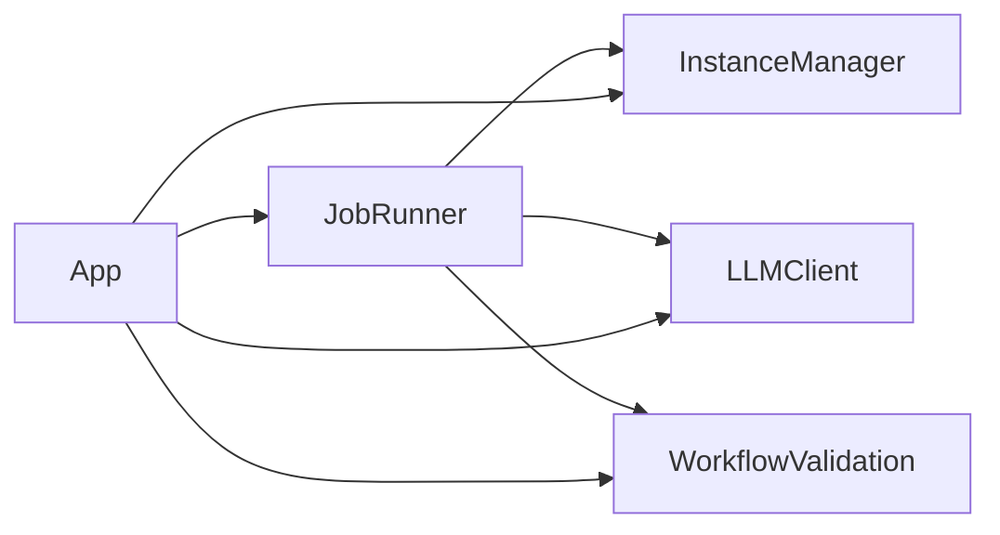

# 测试策略与质量保证

<cite>
**本文引用的文件**
- [README.md](file://README.md)
- [PROJECT_STANDARDS.md](file://PROJECT_STANDARDS.md)
- [app.py](file://app.py)
- [modules/job_runner.py](file://modules/job_runner.py)
- [modules/instance_manager.py](file://modules/instance_manager.py)
- [modules/llm_client.py](file://modules/llm_client.py)
- [modules/workflow_validation.py](file://modules/workflow_validation.py)
- [tests/test_app_version.py](file://tests/test_app_version.py)
- [tests/test_jobs_api.py](file://tests/test_jobs_api.py)
- [tests/test_workflow_validation.py](file://tests/test_workflow_validation.py)
- [tests/test_comfyui_upload.py](file://tests/test_comfyui_upload.py)
- [tests/test_workflow_meta_api.py](file://tests/test_workflow_meta_api.py)
</cite>

## 目录
1. [引言](#引言)
2. [项目结构](#项目结构)
3. [核心组件](#核心组件)
4. [架构总览](#架构总览)
5. [详细组件分析](#详细组件分析)
6. [依赖分析](#依赖分析)
7. [性能考虑](#性能考虑)
8. [故障排查指南](#故障排查指南)
9. [结论](#结论)
10. [附录](#附录)

## 引言
本文件面向 Ez ComfyUI Showcase 项目，制定系统化的测试策略与质量保证方案，覆盖测试金字塔的三个层级：单元测试、集成测试与端到端测试；明确测试编写指南、Mock 使用、断言策略；给出集成测试实施方法与自动化配置建议；总结代码质量保障措施与测试数据管理策略，并提炼测试最佳实践。

## 项目结构
项目采用前后端分离的典型结构：
- 后端：FastAPI 应用入口与业务模块，包含作业编排、实例管理、LLM 客户端、工作流验证等模块。
- 前端：静态资源与模块化 JS，负责 UI 与交互。
- 测试：Python unittest 测试套件，覆盖版本、API、工作流、上传、元数据等多个方面。

**图示来源**
- [app.py:1-200](file://app.py#L1-L200)
- [modules/job_runner.py:1-120](file://modules/job_runner.py#L1-L120)
- [modules/instance_manager.py:1-120](file://modules/instance_manager.py#L1-L120)
- [modules/llm_client.py:1-60](file://modules/llm_client.py#L1-L60)
- [modules/workflow_validation.py:1-42](file://modules/workflow_validation.py#L1-L42)

**章节来源**
- [README.md:40-76](file://README.md#L40-L76)

## 核心组件
- 应用入口与 API：提供版本查询、作业管理、工作流管理、状态查询等接口。
- 作业编排器：负责实例选择、冷启动、进度跟踪、结果保存与错误恢复。
- 实例管理器：负责实例健康检查、冷启动、空闲回收与死实例检测。
- LLM 客户端：封装本地 LLM API 调用，处理错误与兼容性问题。
- 工作流验证：对 ComfyUI API Prompt 进行合法性与完整性检查。

**章节来源**
- [app.py:1-200](file://app.py#L1-L200)
- [modules/job_runner.py:1-200](file://modules/job_runner.py#L1-L200)
- [modules/instance_manager.py:1-120](file://modules/instance_manager.py#L1-L120)
- [modules/llm_client.py:1-120](file://modules/llm_client.py#L1-L120)
- [modules/workflow_validation.py:1-42](file://modules/workflow_validation.py#L1-L42)

## 架构总览
后端以 FastAPI 为核心，通过模块化设计实现职责分离。测试策略围绕该架构展开，分别在单元、集成与端到端层面进行覆盖。

**图示来源**
- [app.py:1-200](file://app.py#L1-L200)
- [modules/job_runner.py:1-200](file://modules/job_runner.py#L1-L200)
- [modules/instance_manager.py:1-200](file://modules/instance_manager.py#L1-L200)
- [modules/llm_client.py:1-200](file://modules/llm_client.py#L1-L200)
- [modules/workflow_validation.py:1-42](file://modules/workflow_validation.py#L1-L42)

## 详细组件分析

### 版本与 API 测试
- 目标：验证版本一致性与 API 行为。
- 方法：使用 unittest 断言版本文件、应用版本与接口返回一致；在作业 API 测试中通过替换全局状态模拟并发与访问控制场景。
- 关键点：测试隔离与状态恢复（setUp/tearDown）；对内部函数进行临时替换以验证边界条件。

**图示来源**
- [tests/test_app_version.py:1-22](file://tests/test_app_version.py#L1-L22)
- [app.py:64-76](file://app.py#L64-L76)

**章节来源**
- [tests/test_app_version.py:1-22](file://tests/test_app_version.py#L1-L22)
- [tests/test_jobs_api.py:1-55](file://tests/test_jobs_api.py#L1-L55)

### 作业编排与实例管理测试
- 目标：验证作业调度、实例选择、冷启动、错误恢复与并发控制。
- 方法：通过替换内部函数与共享状态，模拟实例不可用、提交停滞、队列变化等场景；断言状态流转与错误消息。
- 关键点：对内部可注入函数进行 Mock；对共享容器（jobs）进行快照与恢复；对异常路径进行断言。

**图示来源**
- [modules/job_runner.py:234-715](file://modules/job_runner.py#L234-L715)
- [modules/instance_manager.py:93-151](file://modules/instance_manager.py#L93-L151)

**章节来源**
- [modules/job_runner.py:1-800](file://modules/job_runner.py#L1-L800)
- [modules/instance_manager.py:1-532](file://modules/instance_manager.py#L1-L532)

### LLM 客户端测试
- 目标：验证 LLM API 配置、请求发送、错误处理与兼容性降级。
- 方法：通过 Mock HTTP 响应与异常，覆盖不同错误类型与参数组合；断言错误类型与降级行为。
- 关键点：区分“不支持视觉”与“未知参数”等特定错误；对响应格式进行健壮性校验。

**图示来源**
- [modules/llm_client.py:1-272](file://modules/llm_client.py#L1-L272)

**章节来源**
- [modules/llm_client.py:1-272](file://modules/llm_client.py#L1-L272)

### 工作流验证测试
- 目标：验证工作流 API Prompt 的合法性与占位符检测。
- 方法：构造非法工作流与合法工作流，断言问题检测与描述信息；加载真实工作流文件进行正向校验。
- 关键点：关注缺失节点与占位符两类问题；确保描述信息可读且准确。

**图示来源**
- [modules/workflow_validation.py:1-42](file://modules/workflow_validation.py#L1-L42)
- [tests/test_workflow_validation.py:1-42](file://tests/test_workflow_validation.py#L1-L42)

**章节来源**
- [tests/test_workflow_validation.py:1-42](file://tests/test_workflow_validation.py#L1-L42)

### 上传与元数据测试
- 目标：验证上传逻辑与工作流元数据 API 的行为。
- 方法：通过临时目录与文件模拟输入输出；断言排序持久化、权限控制与缓存策略。
- 关键点：测试排序持久化与权限拒绝；验证数据库连接指向正确路径；断言缩略图响应禁用缓存。

**章节来源**
- [tests/test_comfyui_upload.py:133-150](file://tests/test_comfyui_upload.py#L133-L150)
- [tests/test_workflow_meta_api.py:40-87](file://tests/test_workflow_meta_api.py#L40-L87)

## 依赖分析
- 组件耦合：JobRunner 通过依赖注入与外部函数解耦，便于测试；InstanceManager 与 LLMClient 作为独立模块被应用与测试共同依赖。
- 外部依赖：HTTP 请求、子进程调用、文件系统与数据库；测试中通过 Mock 与临时目录隔离外部副作用。
- 循环依赖：模块间通过函数注入避免循环导入，测试中通过替换函数实现可控依赖。

**图示来源**
- [modules/job_runner.py:1-120](file://modules/job_runner.py#L1-L120)
- [modules/instance_manager.py:1-120](file://modules/instance_manager.py#L1-L120)
- [modules/llm_client.py:1-120](file://modules/llm_client.py#L1-L120)
- [modules/workflow_validation.py:1-42](file://modules/workflow_validation.py#L1-L42)
- [app.py:1-200](file://app.py#L1-L200)

## 性能考虑
- 单元测试：优先使用内存 Mock 与小数据集，避免 IO 与网络延迟影响。
- 集成测试：对关键路径（实例健康检查、作业提交、下载）进行超时与重试策略验证。
- 端到端测试：聚焦高频用户路径（生成、历史、工作流管理），控制并发与资源占用。
- 基准测试：建议引入微基准（如 timeit）评估关键函数（如进度计算、实例选择）性能回归。

## 故障排查指南
- 版本不一致：核对 VERSION 文件与应用版本导出，确保发布流程一致。
- 作业卡住：检查提交停滞重试逻辑与实例重启流程；确认队列状态与实例健康。
- LLM 错误：区分“未知参数”与“响应格式不支持”等场景，必要时降级参数；对“不支持视觉”进行特殊处理。
- 工作流校验失败：定位缺失节点与占位符，完善工作流模板与占位符替换逻辑。

**章节来源**
- [tests/test_app_version.py:1-22](file://tests/test_app_version.py#L1-L22)
- [modules/job_runner.py:576-715](file://modules/job_runner.py#L576-L715)
- [modules/llm_client.py:131-198](file://modules/llm_client.py#L131-L198)
- [modules/workflow_validation.py:16-32](file://modules/workflow_validation.py#L16-L32)

## 结论
通过分层测试策略与模块化设计，Ez ComfyUI Showcase 能够在单元、集成与端到端层面有效保障质量。建议持续完善测试覆盖、引入自动化与基准测试，并坚持代码审查与静态检查，确保系统稳定性与可维护性。

## 附录

### 测试金字塔与范围
- 单元测试：模块内部函数与类（如 JobRunner、InstanceManager、LLMClient、WorkflowValidation）的边界行为与异常路径。
- 集成测试：模块间协作（如作业编排与实例管理）、API 接口（如作业查询、工作流元数据）与外部依赖（HTTP、子进程、文件系统）。
- 端到端测试：用户关键路径（生成、历史、工作流管理）与 UI 行为验证。

### 单元测试编写指南
- 测试用例设计原则：覆盖正常、边界与异常；使用参数化与数据驱动；关注状态不变性与副作用隔离。
- Mock 对象使用：对 HTTP、子进程、文件系统与共享容器进行 Mock；对内部函数进行临时替换。
- 断言策略：优先断言状态与日志；对异常类型与消息进行精确断言；对不可变输出（如版本）进行恒等断言。

### 集成测试实施方法
- 模块间交互测试：通过依赖注入与 Mock，验证 JobRunner 与 InstanceManager 的协作；断言状态流转与错误恢复。
- API 接口测试：针对作业查询、工作流元数据等接口，断言权限控制、排序持久化与缓存策略。
- 数据库操作测试：断言数据库连接路径、事务与持久化行为；在测试结束后恢复配置。

### 测试自动化配置
- CI/CD 集成：在流水线中执行 unittest；对关键模块增加覆盖率阈值；对端到端场景使用无头浏览器或 API 验证。
- 测试覆盖率统计：结合覆盖率工具（如 coverage.py）生成报告，定期审查低覆盖率模块。
- 性能基准测试：对关键函数与路径进行微基准测试，纳入 CI 报告。

### 代码质量保证措施
- 代码审查流程：变更必须通过同行评审；审查重点包括测试覆盖、错误处理与可维护性。
- 静态代码分析：引入 linter（如 flake8、pylint）与格式化工具（如 black），统一风格。
- 代码格式检查：在 CI 中强制执行格式化与静态检查，减少风格分歧。

### 测试数据管理
- 测试数据准备：使用临时目录与最小化数据集；对上传与工作流文件进行模拟。
- 数据库重置：在 setUp/tearDown 中备份与恢复数据库路径与配置。
- 模拟环境配置：通过环境变量与 Mock 控制外部依赖（如 LLM、实例健康检查）。

### 测试最佳实践
- 测试命名规范：以被测功能与场景命名，避免模糊描述；使用清晰的断言注释。
- 测试隔离：避免共享状态污染；对全局容器进行快照与恢复。
- 测试维护策略：定期重构测试；对频繁变更的模块增加回归测试；对边界条件补充用例。