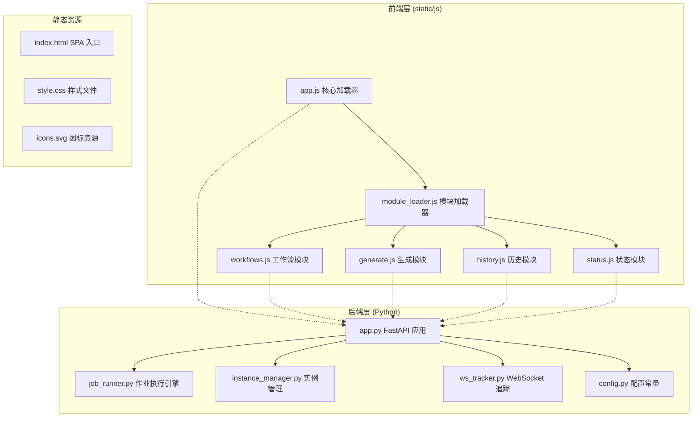
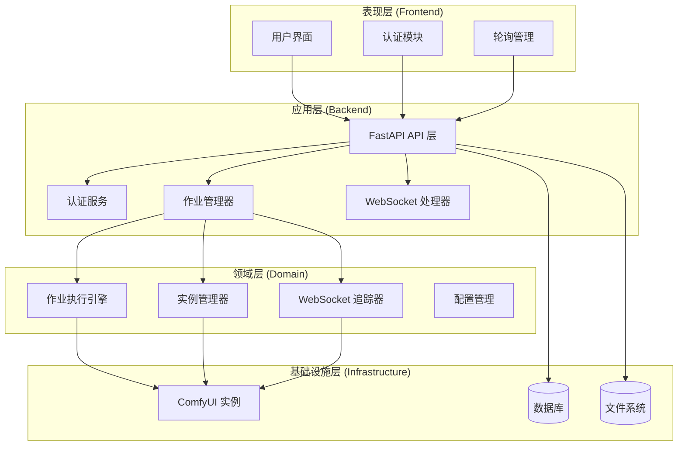
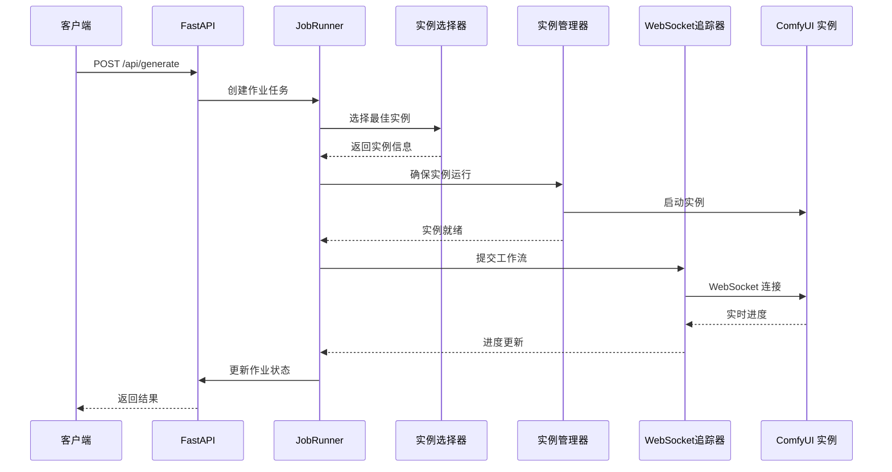
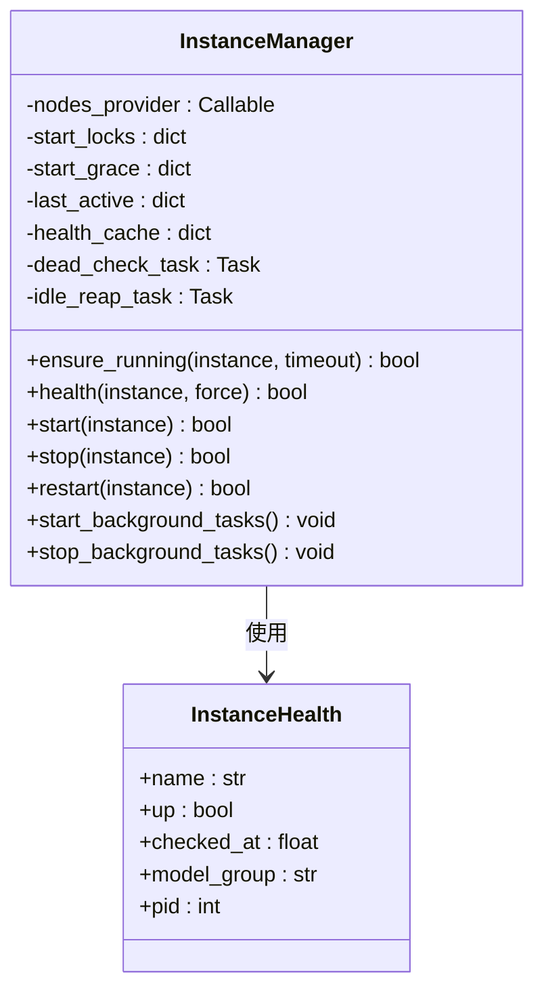
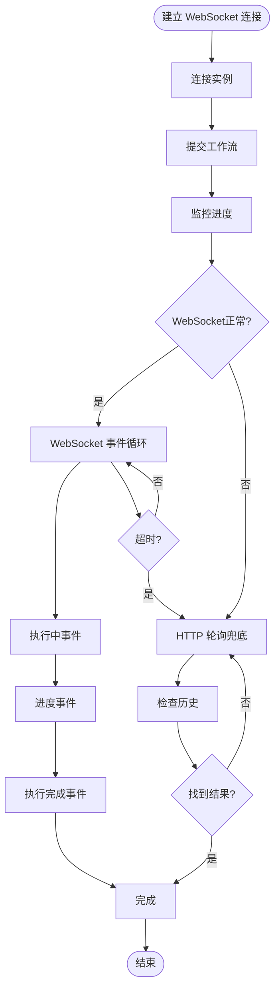
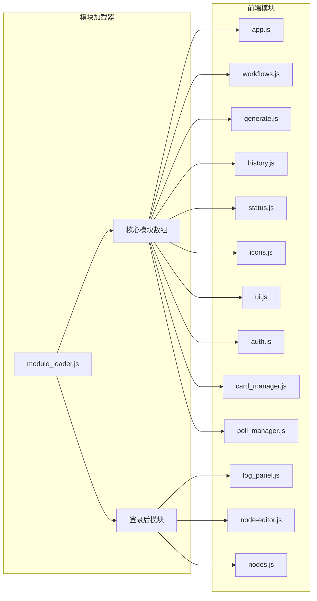
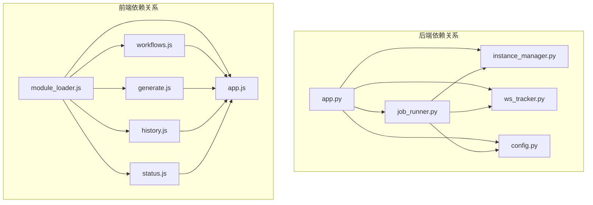

# 项目架构设计

<cite>
**本文档引用的文件**
- [app.py](file://app.py)
- [README.md](file://README.md)
- [module_loader.js](file://static/js/module_loader.js)
- [app.js](file://static/js/app.js)
- [workflows.js](file://static/js/modules/workflows.js)
- [generate.js](file://static/js/modules/generate.js)
- [history.js](file://static/js/modules/history.js)
- [status.js](file://static/js/modules/status.js)
- [job_runner.py](file://modules/job_runner.py)
- [instance_manager.py](file://modules/instance_manager.py)
- [ws_tracker.py](file://modules/ws_tracker.py)
- [config.py](file://modules/config.py)
</cite>

## 目录
1. [引言](#引言)
2. [项目结构](#项目结构)
3. [核心组件](#核心组件)
4. [架构概览](#架构概览)
5. [详细组件分析](#详细组件分析)
6. [依赖分析](#依赖分析)
7. [性能考虑](#性能考虑)
8. [故障排除指南](#故障排除指南)
9. [结论](#结论)

## 引言

Ez ComfyUI Showcase 是一个基于 FastAPI 和纯 JavaScript 的多实例 ComfyUI Web 管理与生成平台。该项目采用模块化架构设计，实现了前后端分离的现代化 Web 应用程序。

**主要特性：**
- 多实例生成调度：支持两个 ComfyUI 实例的智能调度
- 三段式 UI：工作流管理、生成面板、历史画廊一体化操作
- GPU 监控：实时显存/功耗/温度仪表盘
- 服务管理：浏览器内一键启动/停止 ComfyUI 实例
- 节点编辑器：可视化修改 workflow 参数
- 画廊系统：按标签/日期/模型筛选，无限滚动懒加载

## 项目结构

项目采用清晰的分层架构，将前端和后端代码分离：

**图表来源**
- [app.py](file://app.py)
- [module_loader.js](file://static/js/module_loader.js)
- [app.js](file://static/js/app.js)

**章节来源**
- [README.md](file://README.md)
- [app.py](file://app.py)

## 核心组件

### 后端核心组件

#### App 主应用 (FastAPI)
- **职责**：提供 RESTful API 接口，管理作业队列，处理 WebSocket 通信
- **技术栈**：FastAPI + uvicorn + asyncio
- **核心功能**：用户认证、作业调度、实例管理、文件上传下载

#### JobRunner 作业执行引擎
- **职责**：协调整个出图流程，管理实例选择、进度追踪、结果保存
- **设计模式**：编排器模式，串联多个模块完成复杂业务流程
- **关键特性**：支持重试机制、超时处理、GPU 卡顿检测

#### InstanceManager 实例管理器
- **职责**：管理 ComfyUI 实例的生命周期，包括启动、停止、健康检查
- **设计模式**：单例模式，集中管理实例状态
- **关键特性**：自动重启、空闲回收、死实例检测

#### WSManager WebSocket 管理
- **职责**：处理 WebSocket 连接，实现实时进度追踪
- **设计模式**：观察者模式，支持断线重连和退化机制

### 前端核心组件

#### 模块化前端系统
- **职责**：采用 ES6 模块化设计，实现功能解耦
- **加载机制**：统一的模块加载器，支持动态加载和延迟加载
- **核心模块**：
  - workflows.js：工作流管理 CRUD 操作
  - generate.js：生成面板和快速出图
  - history.js：画廊系统和懒加载
  - status.js：GPU 实时监控和实例状态

**章节来源**
- [app.py](file://app.py)
- [job_runner.py](file://modules/job_runner.py)
- [instance_manager.py](file://modules/instance_manager.py)
- [ws_tracker.py](file://modules/ws_tracker.py)
- [module_loader.js](file://static/js/module_loader.js)

## 架构概览

项目采用经典的三层架构模式，结合事件驱动架构实现异步处理：

**图表来源**
- [app.py](file://app.py)
- [job_runner.py](file://modules/job_runner.py)
- [instance_manager.py](file://modules/instance_manager.py)
- [ws_tracker.py](file://modules/ws_tracker.py)

**章节来源**
- [app.py](file://app.py)
- [README.md](file://README.md)

## 详细组件分析

### JobRunner 作业执行引擎

JobRunner 采用编排器模式，负责协调整个出图流程：

**图表来源**
- [job_runner.py](file://modules/job_runner.py)
- [ws_tracker.py](file://modules/ws_tracker.py)
- [instance_manager.py](file://modules/instance_manager.py)

**章节来源**
- [job_runner.py](file://modules/job_runner.py)

### InstanceManager 实例管理器

实例管理器采用单例模式，集中管理 ComfyUI 实例的生命周期：

**图表来源**
- [instance_manager.py](file://modules/instance_manager.py)

**章节来源**
- [instance_manager.py](file://modules/instance_manager.py)

### WebSocket 实时通信架构

WebSocket 追踪器实现了断线退化机制，确保通信可靠性：

**图表来源**
- [ws_tracker.py](file://modules/ws_tracker.py)

**章节来源**
- [ws_tracker.py](file://modules/ws_tracker.py)

### 前端模块化架构

前端采用统一的模块加载器，实现模块间的松耦合：

**图表来源**
- [module_loader.js](file://static/js/module_loader.js)
- [app.js](file://static/js/app.js)

**章节来源**
- [module_loader.js](file://static/js/module_loader.js)
- [app.js](file://static/js/app.js)

## 依赖分析

项目采用模块化依赖管理，各组件间通过接口进行通信：

**图表来源**
- [app.py](file://app.py)
- [job_runner.py](file://modules/job_runner.py)
- [instance_manager.py](file://modules/instance_manager.py)
- [ws_tracker.py](file://modules/ws_tracker.py)
- [module_loader.js](file://static/js/module_loader.js)

**章节来源**
- [app.py](file://app.py)
- [job_runner.py](file://modules/job_runner.py)
- [instance_manager.py](file://modules/instance_manager.py)
- [ws_tracker.py](file://modules/ws_tracker.py)
- [module_loader.js](file://static/js/module_loader.js)

## 性能考虑

### 异步处理优化
- 使用 asyncio 实现非阻塞 I/O 操作
- WebSocket 连接池管理，减少连接开销
- 实例信号量控制，避免资源竞争

### 缓存策略
- 健康状态缓存，减少重复检查
- 工作流元数据缓存
- 前端模块缓存和版本控制

### 资源管理
- 实例空闲回收机制
- 死实例自动检测和重启
- GPU 卡顿检测和自动恢复

## 故障排除指南

### 常见问题及解决方案

#### WebSocket 连接失败
- 检查 ComfyUI 实例状态
- 验证网络连接和防火墙设置
- 查看 WebSocket 错误日志

#### 实例启动失败
- 检查 systemd 服务状态
- 验证实例配置文件
- 查看启动日志和错误信息

#### 作业执行超时
- 检查 GPU 内存使用情况
- 验证工作流配置正确性
- 查看实例健康状态

**章节来源**
- [app.py](file://app.py)
- [ws_tracker.py](file://modules/ws_tracker.py)
- [instance_manager.py](file://modules/instance_manager.py)

## 结论

Ez ComfyUI Showcase 项目展现了现代 Web 应用程序的优秀架构实践。通过采用模块化设计、事件驱动架构和前后端分离模式，项目实现了高可维护性、高性能和良好的用户体验。

**技术优势：**
- 清晰的分层架构，职责分离明确
- 模块化设计，便于功能扩展和维护
- 异步处理机制，提升系统性能
- 实时通信支持，增强用户体验
- 自动化运维，降低维护成本

**未来发展方向：**
- 微服务架构演进
- 容器化部署支持
- 更丰富的监控和告警机制
- AI 辅助的智能调度算法