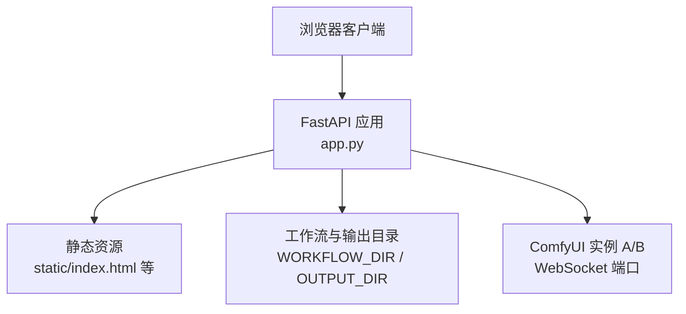
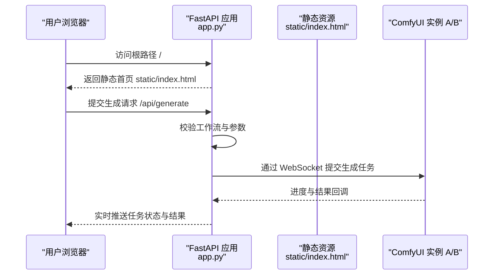
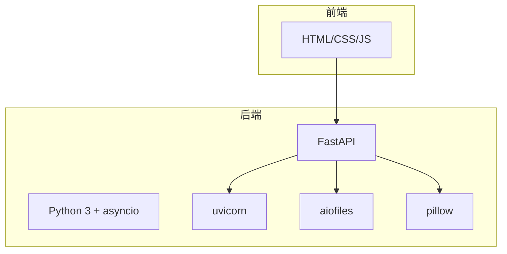

# 快速开始

<cite>
**本文引用的文件**
- [README.md](file://README.md)
- [app.py](file://app.py)
- [quick-start.sh](file://quick-start.sh)
- [static/index.html](file://static/index.html)
- [modules/config.py](file://modules/config.py)
</cite>

## 目录
1. [简介](#简介)
2. [项目结构](#项目结构)
3. [核心组件](#核心组件)
4. [架构总览](#架构总览)
5. [详细组件分析](#详细组件分析)
6. [依赖分析](#依赖分析)
7. [性能注意事项](#性能注意事项)
8. [故障排查指南](#故障排查指南)
9. [结论](#结论)
10. [附录](#附录)

## 简介
本指南面向首次接触 Ez ComfyUI Showcase 的用户，帮助你在最短时间内完成安装、配置与启动，顺利访问 Web 界面并进行基础生成任务。你将获得：
- 系统环境要求与依赖安装步骤
- 仓库克隆与 Python 依赖安装命令
- 默认与自定义端口启动方式
- 关键环境变量说明与设置建议
- 常见问题排查与首次运行验证步骤

## 项目结构
该项目采用前后端分离的单页应用（SPA）架构：后端基于 FastAPI 提供 API 与静态资源托管，前端通过静态页面与模块化 JS 提供交互界面。

图表来源
- [app.py:1306-1320](file://app.py#L1306-L1320)
- [README.md:40-59](file://README.md#L40-L59)

章节来源
- [README.md:40-59](file://README.md#L40-L59)

## 核心组件
- 后端服务：基于 FastAPI 的 Web 服务器，负责路由、任务调度、与 ComfyUI 实例通信、静态资源托管等。
- 前端界面：单页应用入口为 static/index.html，配合 modules 下的模块化 JS 实现工作流管理、生成面板、历史画廊等功能。
- 配置与常量：modules/config.py 提供节点分类、模型分组与状态映射等常量，支撑进度计算与 UI 展示。

章节来源
- [app.py:18-31](file://app.py#L18-L31)
- [modules/config.py:11-151](file://modules/config.py#L11-L151)

## 架构总览
下面的序列图展示了从浏览器访问到后端处理的关键流程：

图表来源
- [app.py:1306-1320](file://app.py#L1306-L1320)
- [static/index.html](file://static/index.html)

## 详细组件分析

### 安装与启动步骤
- 克隆仓库
  - 使用 Git 克隆项目至本地目录。
- 安装 Python 依赖
  - 通过 pip 安装以下包：fastapi、uvicorn、aiofiles、pillow。
- 启动服务
  - 默认端口：9091
  - 自定义端口：通过命令行参数指定端口
- 验证访问
  - 在浏览器打开 http://localhost:端口号 查看首页与功能模块

章节来源
- [README.md:61-76](file://README.md#L61-L76)

### 环境变量配置
以下为关键环境变量及其作用与默认值（来自项目文档与源码）：

- EZ_COMFYUI_PORT
  - 作用：后端服务监听端口
  - 默认值：9091
  - 设置方式：启动时通过环境变量或命令行参数传入
- WORKFLOW_DIR
  - 作用：工作流 JSON 文件所在目录
  - 默认值：基于应用根目录下的 data/workflows
  - 设置方式：通过环境变量覆盖
- OUTPUT_DIR
  - 作用：生成结果输出目录
  - 默认值：基于应用根目录下的 data/outputs
  - 设置方式：通过环境变量覆盖
- COMFYUI_URL
  - 作用：默认 ComfyUI 实例访问地址
  - 默认值：http://127.0.0.1:8190
  - 设置方式：通过环境变量覆盖
- JWT_SECRET_KEY
  - 作用：JWT 密钥，用于认证
  - 默认行为：若未设置，系统会在本地生成并存储密钥文件
  - 设置方式：通过环境变量提供固定密钥
- EZ_COMFYUI_LOG_FILE
  - 作用：持久化日志文件路径
  - 默认值：基于应用根目录下的 data/logs/recent.jsonl
  - 设置方式：通过环境变量覆盖

章节来源
- [README.md:78-86](file://README.md#L78-L86)
- [app.py:1306-1320](file://app.py#L1306-L1320)
- [app.py:82-102](file://app.py#L82-L102)
- [app.py:120-123](file://app.py#L120-L123)

### 端口与实例配置
- 默认端口
  - 后端服务默认监听 9091
- ComfyUI 实例端口
  - 实例 A：默认 8190
  - 实例 B：默认 8189
- 端口自定义
  - 通过环境变量 COMFYUI_A_PORT、COMFYUI_B_PORT 覆盖实例端口
  - 通过 EZ_COMFYUI_PORT 覆盖后端服务端口

章节来源
- [README.md:78-86](file://README.md#L78-L86)
- [app.py:1308-1309](file://app.py#L1308-L1309)

### 启动命令示例
- 克隆与安装
  - 克隆仓库
  - 安装依赖：fastapi、uvicorn、aiofiles、pillow
- 默认端口启动
  - 运行后端服务，默认监听 9091
- 自定义端口启动
  - 通过命令行参数指定端口

章节来源
- [README.md:61-76](file://README.md#L61-L76)

### 首次运行验证
- 打开浏览器访问 http://localhost:端口号
- 首页应正常加载，包含工作流管理、生成面板、历史画廊等模块
- 若出现静态资源加载异常，确认 static 目录存在且可读
- 如需访问 API，可参考文档列出的端点进行验证

章节来源
- [README.md:87-95](file://README.md#L87-L95)
- [static/index.html](file://static/index.html)

## 依赖分析
后端依赖主要由 FastAPI 生态与异步运行时组成，前端为纯静态资源，便于部署与分发。

图表来源
- [README.md:30-38](file://README.md#L30-L38)
- [README.md:69](file://README.md#L69)

章节来源
- [README.md:30-38](file://README.md#L30-L38)
- [README.md:69](file://README.md#L69)

## 性能注意事项
- 合理设置输出目录与工作流目录，避免频繁 IO 抖动
- 在生产环境中建议使用反向代理（如 Nginx）并启用 HTTPS
- 对于大体积生成任务，注意磁盘空间与网络带宽

## 故障排查指南
- 无法访问页面
  - 检查后端服务是否在指定端口运行
  - 确认防火墙未拦截端口
- 静态资源 404
  - 确认 static 目录存在且权限可读
- ComfyUI 连接失败
  - 检查 COMFYUI_URL 与实例端口是否正确
  - 确认实例 A/B 已启动并可访问
- 日志定位
  - 查看 EZ_COMFYUI_LOG_FILE 指定的日志文件，或使用 quick-start.sh 的 logs 子命令查看标准输出与错误输出

章节来源
- [app.py:120-123](file://app.py#L120-L123)
- [quick-start.sh:98-104](file://quick-start.sh#L98-L104)

## 结论
按照本指南完成克隆、依赖安装与启动后，你将可以访问 Ez ComfyUI Showcase 的 Web 界面，并使用工作流管理、生成面板与历史画廊等核心功能。如遇问题，可依据故障排查章节逐步定位并解决。

## 附录
- API 端点概览（供验证使用）
  - /api/generate：提交生成任务
  - /api/jobs/{id}：查询任务状态
  - /api/workflows：获取工作流列表
  - /api/status：实例健康与 GPU 状态

章节来源
- [README.md:87-95](file://README.md#L87-L95)