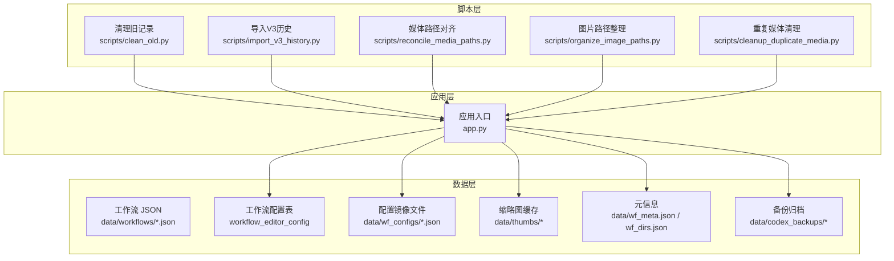
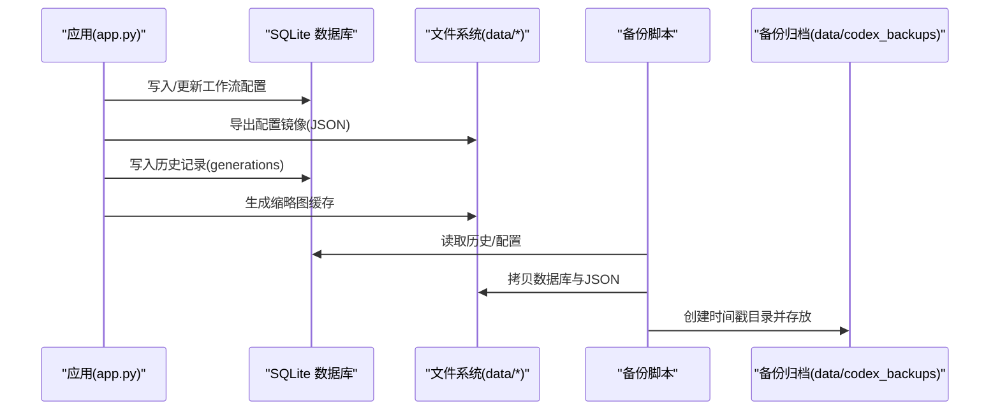
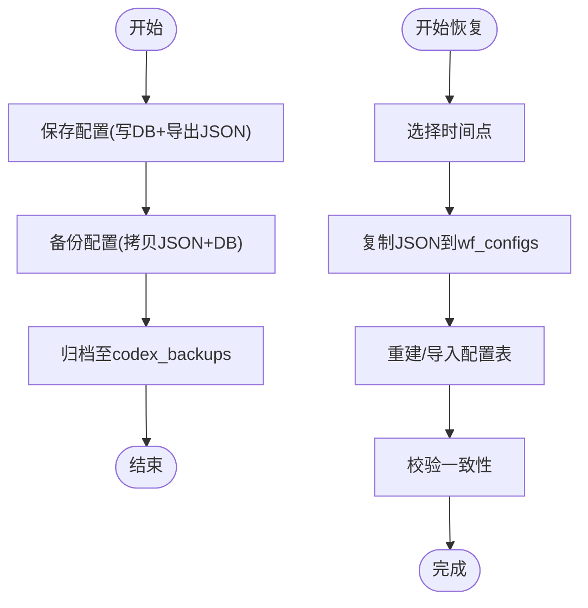
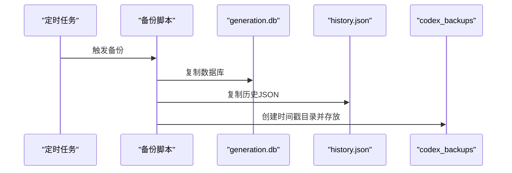
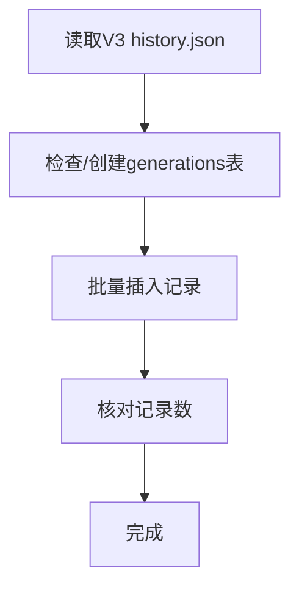
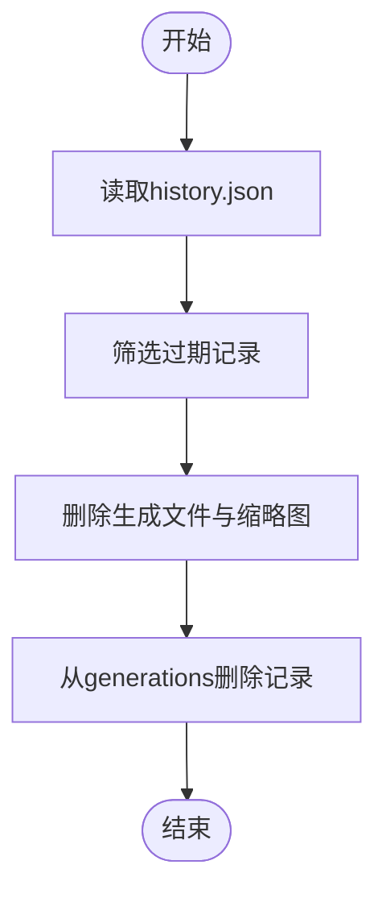
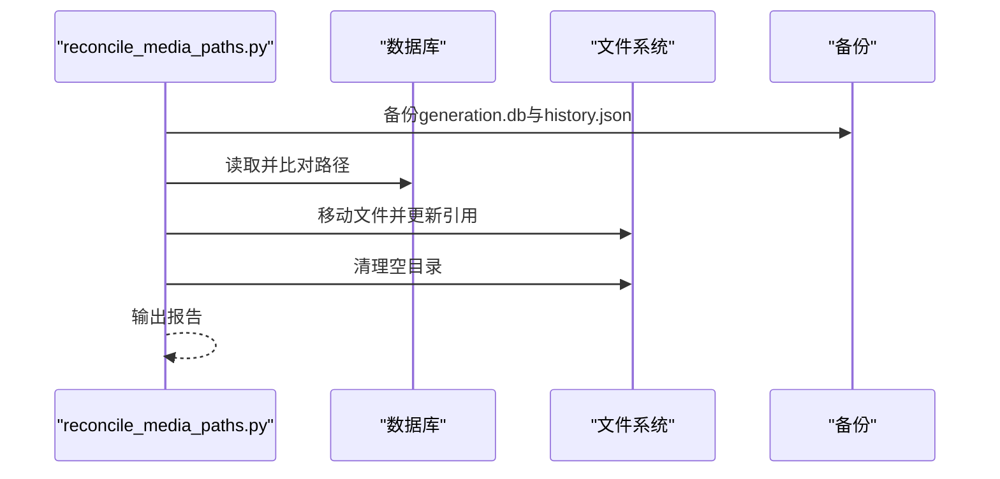
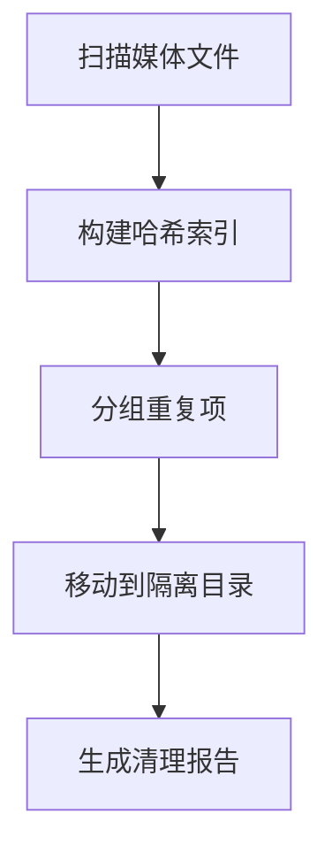
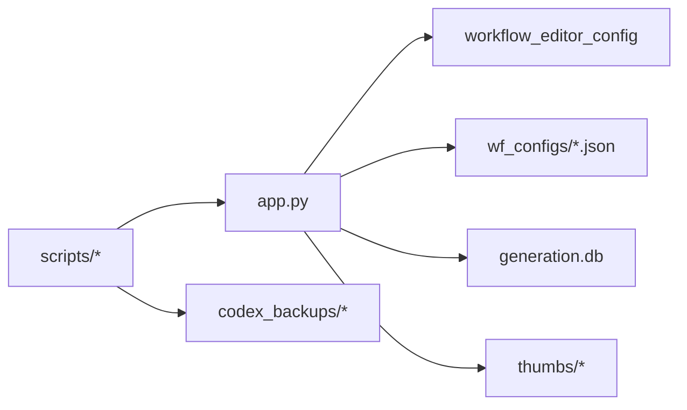

# 备份与恢复

<cite>
**本文引用的文件**
- [app.py](file://app.py)
- [clean_old.py](file://scripts/clean_old.py)
- [import_v3_history.py](file://scripts/import_v3_history.py)
- [reconcile_media_paths.py](file://scripts/reconcile_media_paths.py)
- [organize_image_paths.py](file://scripts/organize_image_paths.py)
- [cleanup_duplicate_media.py](file://scripts/cleanup_duplicate_media.py)
</cite>

## 目录
1. [简介](#简介)
2. [项目结构](#项目结构)
3. [核心组件](#核心组件)
4. [架构总览](#架构总览)
5. [详细组件分析](#详细组件分析)
6. [依赖关系分析](#依赖关系分析)
7. [性能考量](#性能考量)
8. [故障排查指南](#故障排查指南)
9. [结论](#结论)
10. [附录](#附录)

## 简介
本文件面向 Ez ComfyUI Showcase 的备份与恢复实践，围绕数据库、文件系统与配置三类对象，给出可落地的备份策略、自动备份机制、增量与全量备份差异、完整性验证、恢复流程、灾难恢复计划、监控与告警以及备份脚本的使用与定制方法。文档以仓库中现有脚本与应用代码为依据，结合实际可执行流程进行说明。

## 项目结构
- 数据与工作流相关路径
  - data/workflows：工作流 JSON 存放位置
  - data/wf_configs：工作流配置镜像（由数据库导出）
  - data/thumbs：缩略图缓存
  - data/wf_meta.json、data/wf_dirs.json：元信息与目录索引
  - data/codex_backups：备份归档目录
- 脚本目录 scripts：包含备份、清理、路径整理、历史导入等工具
- 应用入口 app.py：包含工作流配置的数据库持久化与文件镜像逻辑

图表来源
- [app.py](file://app.py)
- [clean_old.py](file://scripts/clean_old.py)
- [import_v3_history.py](file://scripts/import_v3_history.py)
- [reconcile_media_paths.py](file://scripts/reconcile_media_paths.py)
- [organize_image_paths.py](file://scripts/organize_image_paths.py)
- [cleanup_duplicate_media.py](file://scripts/cleanup_duplicate_media.py)

章节来源
- [app.py](file://app.py)
- [clean_old.py](file://scripts/clean_old.py)
- [import_v3_history.py](file://scripts/import_v3_history.py)
- [reconcile_media_paths.py](file://scripts/reconcile_media_paths.py)
- [organize_image_paths.py](file://scripts/organize_image_paths.py)
- [cleanup_duplicate_media.py](file://scripts/cleanup_duplicate_media.py)

## 核心组件
- 工作流配置的数据库与文件镜像
  - 应用在保存工作流配置时，同时写入 SQLite 表并导出到 data/wf_configs 下的同名 JSON 文件，形成“数据库+文件”的双写与镜像，便于快速恢复与版本对比。
- 历史生成数据的 SQLite 存储
  - 历史记录与生成产物路径（含缩略图）均落盘于 SQLite 表 generations 中，配合 data/thumbs 缓存目录，构成生成数据的完整视图。
- 备份归档目录
  - data/codex_backups 作为统一的备份输出根目录，按时间戳子目录组织，包含数据库与历史 JSON 的拷贝，便于离线归档与跨环境迁移。

章节来源
- [app.py](file://app.py)

## 架构总览
下图展示备份与恢复的关键交互：应用侧负责配置与历史数据的持久化；脚本侧负责备份归档、历史导入、路径整理与清理。

图表来源
- [app.py](file://app.py)
- [reconcile_media_paths.py](file://scripts/reconcile_media_paths.py)

## 详细组件分析

### 组件A：工作流配置的备份与恢复
- 设计要点
  - 双写策略：保存配置时同时写入数据库表与导出到 data/wf_configs 下的 JSON 文件，确保任一介质损坏时可从另一介质恢复。
  - 镜像一致性：导出函数会读取数据库行并序列化为 JSON，若数据库不可用则回退至本地文件读取。
- 自动备份机制
  - 建议在定时任务中调用备份脚本，按需对 data/wf_configs 与数据库进行打包归档。
- 恢复流程
  - 恢复配置：将目标时间点的 JSON 文件复制回 data/wf_configs 对应名称；或通过数据库导入工具重建表数据。
- 注意事项
  - 恢复前先停止应用写入，避免并发写导致镜像不一致。
  - 恢复后校验配置文件与数据库条目数量一致。

图表来源
- [app.py](file://app.py)

章节来源
- [app.py](file://app.py)

### 组件B：历史生成数据的备份与恢复
- 设计要点
  - 历史数据以 SQLite 表 generations 为核心，包含 id、workflow、image_path、thumb_path、params 等字段；缩略图缓存位于 data/thumbs。
  - 备份脚本会将 generation.db 与 history.json 拷贝到归档目录，形成“数据库+历史JSON”的全量备份。
- 自动备份机制
  - 建议每日定时执行备份脚本，生成带时间戳的子目录，保留最近 N 个版本。
- 恢复流程
  - 恢复数据库：将 generation.db 替换为备份版本，并确保应用重启后能正确连接。
  - 恢复缩略图：将 data/thumbs 下对应文件恢复到原位。
  - 恢复历史 JSON：替换 data/history/history.json（如存在），并根据需要重建 generations 表。
- 注意事项
  - 恢复前停止应用写入，避免覆盖未备份的数据。
  - 恢复后核对 generations 表记录数与历史 JSON 条目数一致。

图表来源
- [reconcile_media_paths.py](file://scripts/reconcile_media_paths.py)

章节来源
- [reconcile_media_paths.py](file://scripts/reconcile_media_paths.py)

### 组件C：历史导入与版本迁移
- 功能概述
  - 将 V3 历史 JSON 导入到 V4 SQLite 表 generations，支持批量写入与表结构初始化。
- 使用场景
  - 从旧版本迁移历史数据到新数据库结构，便于统一查询与统计。
- 注意事项
  - 迁移前备份当前 generations 表，避免覆盖。
  - 迁移后核对记录总数与历史 JSON 条目数一致。

图表来源
- [import_v3_history.py](file://scripts/import_v3_history.py)

章节来源
- [import_v3_history.py](file://scripts/import_v3_history.py)

### 组件D：旧数据清理与存储优化
- 功能概述
  - 清理超过阈值的历史记录，删除对应的生成文件与缩略图，并同步删除 SQLite 中的记录，释放磁盘空间。
- 使用场景
  - 定期清理过期生成物，控制存储占用。
- 注意事项
  - 执行前建议先 Dry Run，确认将要删除的记录与文件列表。
  - 删除操作不可逆，建议先备份 generation.db。

图表来源
- [clean_old.py](file://scripts/clean_old.py)

章节来源
- [clean_old.py](file://scripts/clean_old.py)

### 组件E：媒体路径对齐与备份
- 功能概述
  - 在文件系统与数据库之间进行路径一致性校验与修复，备份关键数据后再执行移动与更新，最后清理空目录。
- 使用场景
  - 文件重命名、目录结构调整后的路径对齐与数据迁移。
- 注意事项
  - 建议先 Dry Run，确认映射与变更范围。
  - 备份后再执行 --apply，避免误操作造成数据丢失。

图表来源
- [reconcile_media_paths.py](file://scripts/reconcile_media_paths.py)

章节来源
- [reconcile_media_paths.py](file://scripts/reconcile_media_paths.py)

### 组件F：重复媒体清理与隔离
- 功能概述
  - 识别重复媒体文件，生成清理清单并可将待删除文件移动到隔离目录，便于审计与二次确认。
- 使用场景
  - 降低存储冗余，提升空间利用率。
- 注意事项
  - 建议先生成清单并审阅，再执行 --apply。
  - 隔离目录按时间戳命名，便于后续处理。

图表来源
- [cleanup_duplicate_media.py](file://scripts/cleanup_duplicate_media.py)

章节来源
- [cleanup_duplicate_media.py](file://scripts/cleanup_duplicate_media.py)

## 依赖关系分析
- 应用与脚本的耦合
  - app.py 提供工作流配置的数据库与文件镜像能力，是备份与恢复的基础数据源。
  - 备份脚本依赖 data 目录下的数据库与 JSON 文件，形成“应用写入—脚本备份—归档留存”的闭环。
- 外部依赖
  - SQLite：用于历史记录与配置的持久化。
  - 文件系统：缩略图、工作流 JSON、备份归档等。
- 潜在风险
  - 并发写入可能导致镜像不一致，应在备份窗口内暂停应用写入。
  - 路径迁移过程中若中断，可能造成引用与文件不匹配，应先备份再迁移。

图表来源
- [app.py](file://app.py)
- [reconcile_media_paths.py](file://scripts/reconcile_media_paths.py)

章节来源
- [app.py](file://app.py)
- [reconcile_media_paths.py](file://scripts/reconcile_media_paths.py)

## 性能考量
- 备份窗口与停机时间
  - 全量备份涉及数据库与大文件拷贝，建议在业务低峰期执行，尽量缩短停机窗口。
- I/O 优化
  - 备份脚本采用复制方式，建议使用 SSD 或高速磁盘，减少等待时间。
- 清理策略
  - 定期运行 clean_old.py 与 cleanup_duplicate_media.py，避免碎片化与空间浪费。
- 并发控制
  - 备份与恢复期间禁止应用写入，避免锁竞争与数据不一致。

## 故障排查指南
- 备份失败
  - 检查 codex_backups 目录权限与磁盘空间；确认 generation.db 与 history.json 是否存在且可读。
- 恢复后数据不一致
  - 对照 generations 表记录数与历史 JSON 条目数；核对缩略图路径是否正确。
- 路径迁移异常
  - 使用 reconcile_media_paths.py 的 Dry Run 模式预演，确认映射无误后再执行 --apply。
- 重复清理误删
  - 查看 cleanup_duplicate_media.py 生成的隔离目录，确认文件归属后再决定删除或恢复。

章节来源
- [reconcile_media_paths.py](file://scripts/reconcile_media_paths.py)
- [cleanup_duplicate_media.py](file://scripts/cleanup_duplicate_media.py)
- [clean_old.py](file://scripts/clean_old.py)

## 结论
通过“数据库+文件镜像”的双写策略与脚本化的备份、清理、迁移工具，Ez ComfyUI Showcase 形成了覆盖配置、历史与文件系统的完整备份与恢复体系。建议结合定时任务与监控告警，持续优化备份窗口与存储成本，确保在发生故障时能够快速、可靠地恢复服务。

## 附录

### 自动备份机制设计
- 触发条件
  - 固定时间点（如每日凌晨）或事件驱动（如配置变更后）。
- 存储位置
  - data/codex_backups/<YYYYMMDD_HHMMSS>/generation.db 与 history.json。
- 命名规则
  - 采用时间戳命名，便于排序与检索；每个备份包含数据库与历史 JSON。

章节来源
- [reconcile_media_paths.py](file://scripts/reconcile_media_paths.py)

### 增量备份与全量备份
- 全量备份
  - 每次备份包含 generation.db 与 history.json 的完整副本，适合长期归档与跨环境迁移。
- 增量备份
  - 可基于文件层面的差异检测（如 mtime/大小）或数据库事务日志进行增量提取，但当前脚本未实现该能力。
- 存储优化
  - 建议定期清理旧版本备份，结合 clean_old.py 与重复媒体清理工具降低冗余。

章节来源
- [reconcile_media_paths.py](file://scripts/reconcile_media_paths.py)
- [clean_old.py](file://scripts/clean_old.py)
- [cleanup_duplicate_media.py](file://scripts/cleanup_duplicate_media.py)

### 备份完整性验证
- 校验和与一致性
  - 建议在备份完成后对 generation.db 与 history.json 计算校验和并记录；恢复后再次校验。
- 备份质量评估
  - 统计备份周期内的成功率、耗时与存储增长趋势，及时发现异常。

### 恢复流程清单
- 数据库恢复
  - 停止应用，替换 generation.db，启动应用并核对记录数。
- 文件系统恢复
  - 恢复 data/thumbs 与工作流 JSON；必要时重建索引。
- 配置恢复
  - 恢复 data/wf_configs 下的 JSON 文件或重建配置表。

### 灾难恢复计划
- 场景分析
  - 磁盘损坏：依赖 codex_backups 中的最近版本恢复。
  - 数据库损坏：优先恢复 generation.db，再根据历史 JSON 重建缺失记录。
- 恢复优先级
  - 业务可用性优先，先恢复数据库与关键文件，再逐步补齐其他内容。
- RTO/RPO
  - RPO 受限于备份频率；RTO 受限于恢复脚本执行效率与停机窗口。

### 备份监控与告警
- 监控指标
  - 备份成功率、耗时、存储用量、失败次数。
- 告警策略
  - 失败立即告警；存储空间低于阈值提前预警；长时间未备份触发提醒。

### 备份脚本使用与定制
- clean_old.py
  - 支持按时间阈值清理旧记录，先 Dry Run 再 --apply。
- import_v3_history.py
  - 将历史 JSON 导入到 generations 表，适合版本迁移。
- reconcile_media_paths.py
  - 备份后执行路径对齐与迁移，先 Dry Run 再 --apply。
- organize_image_paths.py
  - 统一输入/输出路径结构，配合备份与迁移使用。
- cleanup_duplicate_media.py
  - 生成清理清单并隔离重复文件，便于审计与二次确认。

章节来源
- [clean_old.py](file://scripts/clean_old.py)
- [import_v3_history.py](file://scripts/import_v3_history.py)
- [reconcile_media_paths.py](file://scripts/reconcile_media_paths.py)
- [organize_image_paths.py](file://scripts/organize_image_paths.py)
- [cleanup_duplicate_media.py](file://scripts/cleanup_duplicate_media.py)