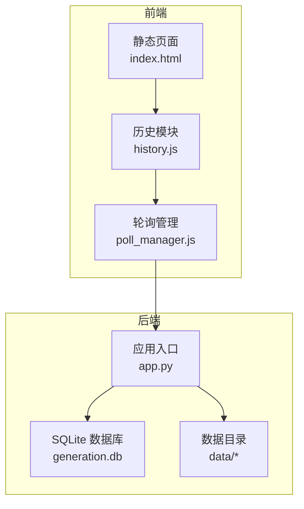
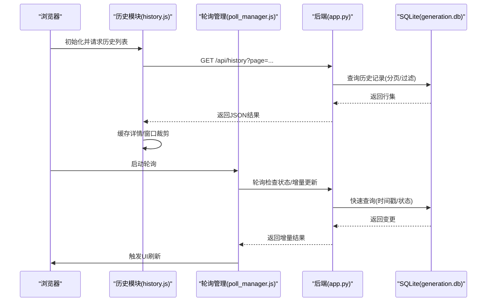
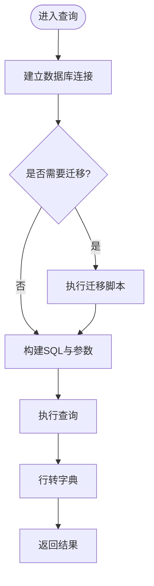
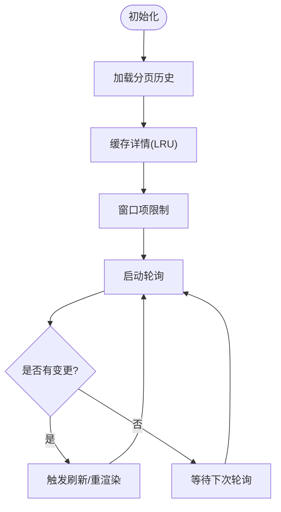
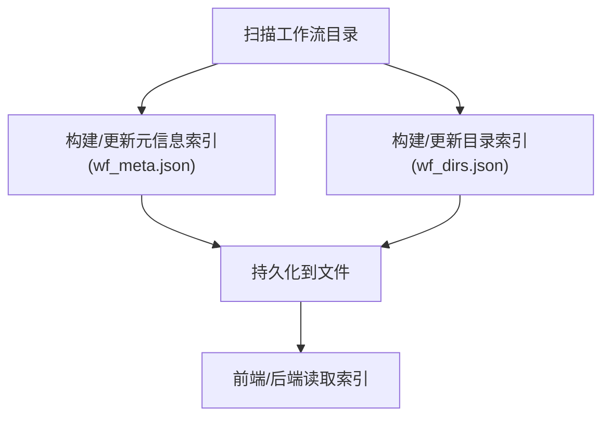
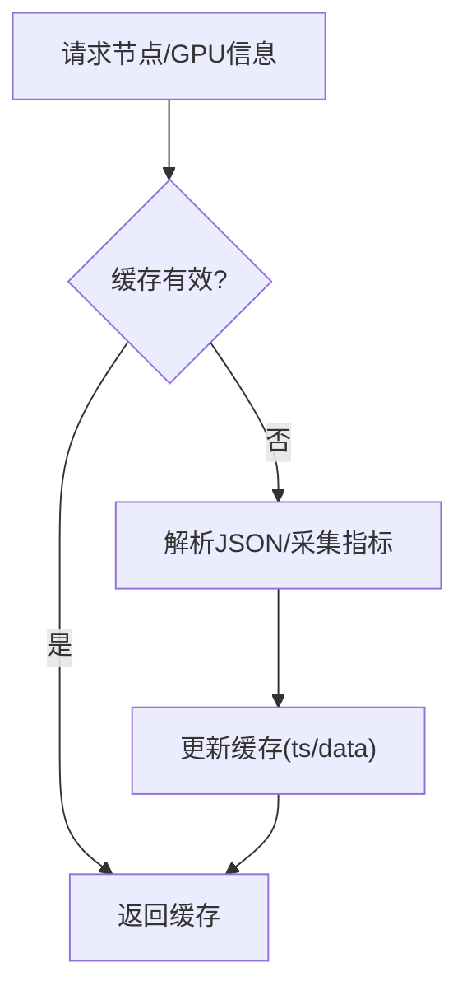
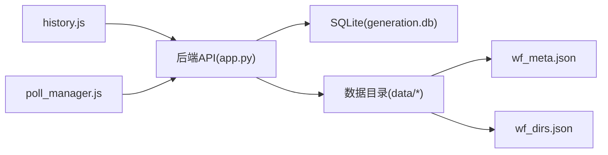

# 性能优化

<cite>
**本文引用的文件**
- [app.py](file://app.py)
- [history.js](file://static/js/modules/history.js)
- [poll_manager.js](file://static/js/modules/poll_manager.js)
- [test_startup_load_dedup_ui.py](file://tests/test_startup_load_dedup_ui.py)
- [test_poll_manager_resume.py](file://tests/test_poll_manager_resume.py)
- [wf_meta.json](file://data/wf_meta.json)
- [wf_dirs.json](file://data/wf_dirs.json)
- [README.md](file://README.md)
</cite>

## 目录
1. [简介](#简介)
2. [项目结构](#项目结构)
3. [核心组件](#核心组件)
4. [架构总览](#架构总览)
5. [详细组件分析](#详细组件分析)
6. [依赖分析](#依赖分析)
7. [性能考量](#性能考量)
8. [故障排查指南](#故障排查指南)
9. [结论](#结论)
10. [附录](#附录)

## 简介
本文件面向 Ez ComfyUI Showcase 的性能优化目标，围绕数据访问模式与瓶颈进行系统性分析，覆盖数据库查询优化、文件系统访问优化、缓存策略优化；同时给出数据结构优化（wf_meta.json、wf_dirs.json）与监控诊断、容量规划、扩展策略、缓存设计以及调优建议。文档以仓库现有实现为依据，结合前端缓存与后端数据库、文件系统访问行为，提出可落地的优化方向。

## 项目结构
项目采用前后端分离的静态页面+后端服务模式：前端通过静态 JS 模块与后端 API 交互；后端基于 Python 提供工作流元数据、历史记录、图像等接口，并使用 SQLite 存储生成历史与元信息；数据目录包含大量工作流 JSON 与缩略图等媒体资源。

图表来源
- [app.py:1372-1377](file://app.py#L1372-L1377)
- [history.js:51-176](file://static/js/modules/history.js#L51-L176)
- [poll_manager.js](file://static/js/modules/poll_manager.js)

章节来源
- [README.md](file://README.md)

## 核心组件
- 后端数据库层：使用 SQLite 作为生成历史与元信息存储，提供连接、迁移与查询封装。
- 前端缓存层：历史详情缓存、轮询刷新与窗口限制、乐观更新与本地缓存失效策略。
- 文件系统层：工作流 JSON、缩略图与媒体输出路径管理，支持按目录扫描与索引维护。
- 元数据索引：wf_meta.json/wf_dirs.json 用于快速定位工作流与配置，支撑前端展示与后端检索。

章节来源
- [app.py:1372-1377](file://app.py#L1372-L1377)
- [app.py:1623-1666](file://app.py#L1623-L1666)
- [history.js:134-176](file://static/js/modules/history.js#L134-L176)
- [wf_meta.json](file://data/wf_meta.json)
- [wf_dirs.json](file://data/wf_dirs.json)

## 架构总览
后端通过 SQLite 维护生成历史与元数据，前端通过历史模块与轮询模块拉取增量数据并进行本地缓存与去重。文件系统中工作流与配置以 JSON 形式组织，配合索引文件实现快速检索。

图表来源
- [history.js:51-176](file://static/js/modules/history.js#L51-L176)
- [poll_manager.js](file://static/js/modules/poll_manager.js)
- [app.py:1372-1377](file://app.py#L1372-L1377)

## 详细组件分析

### 数据库层（SQLite）
- 连接与初始化
  - 使用统一连接工厂创建连接，设置行工厂便于字典式访问。
  - 初始化时执行多步迁移，确保表结构与列存在性（如 user_id），失败时捕获操作异常。
- 查询与返回
  - 将数据库行转换为字典条目，便于前端消费。
- 性能要点
  - 当前未见显式索引创建逻辑，建议对高频查询字段建立索引（如时间戳、状态、用户ID）。
  - 对大结果集采用分页与 LIMIT/OFFSET，避免一次性加载过多数据。
  - 使用参数化查询防止 SQL 注入并提升计划复用。

图表来源
- [app.py:1372-1377](file://app.py#L1372-L1377)
- [app.py:1623-1666](file://app.py#L1623-L1666)

章节来源
- [app.py:1372-1377](file://app.py#L1372-L1377)
- [app.py:1623-1666](file://app.py#L1623-L1666)

### 前端缓存与轮询（history.js 与 poll_manager.js）
- 历史详情缓存
  - 维护固定大小的详情缓存队列，LRU 驱逐超出上限的条目，减少重复请求。
  - 支持乐观更新删除与缓存失效，保证 UI 一致性。
- 轮询与窗口限制
  - 限制可见项窗口大小，避免一次性渲染过多节点。
  - 轮询过程中统计刷新次数与重渲染次数，保障交互流畅。
- 性能要点
  - 缓存 TTL 与容量需根据历史规模与内存占用权衡。
  - 轮询间隔与增量策略应结合后端变更频率调整。

图表来源
- [history.js:134-176](file://static/js/modules/history.js#L134-L176)
- [poll_manager.js](file://static/js/modules/poll_manager.js)

章节来源
- [history.js:51-176](file://static/js/modules/history.js#L51-L176)
- [test_startup_load_dedup_ui.py:179-199](file://tests/test_startup_load_dedup_ui.py#L179-L199)
- [test_poll_manager_resume.py:43-83](file://tests/test_poll_manager_resume.py#L43-L83)

### 文件系统与数据结构（wf_meta.json / wf_dirs.json）
- wf_meta.json
  - 作为工作流元信息索引，建议对常用查询键（如类别、标签、创建时间）建立二级索引或派生映射，加速前端筛选与排序。
- wf_dirs.json
  - 记录工作流与配置的目录结构，建议：
    - 仅在必要时重建索引，避免每次启动全量扫描。
    - 对目录树做版本化标记，增量更新受影响子树。
- 序列化与压缩
  - JSON 文件较大时可考虑启用压缩（如 gzip）并按需解压；或拆分为更细粒度的片段以降低单文件体积。
- 并发访问控制
  - 多进程/多线程写入同一索引文件时需加锁或原子替换，避免竞态。

图表来源
- [wf_meta.json](file://data/wf_meta.json)
- [wf_dirs.json](file://data/wf_dirs.json)

章节来源
- [wf_meta.json](file://data/wf_meta.json)
- [wf_dirs.json](file://data/wf_dirs.json)

### GPU/节点缓存（后端）
- 节点缓存
  - 后端维护节点列表的短期缓存，带过期时间，避免频繁解析 JSON。
- GPU 指标缓存
  - 统一缓存 GPU 内存/利用率/温度等指标，设定较短 TTL，平衡实时性与开销。

图表来源
- [app.py:752-777](file://app.py#L752-L777)
- [app.py:2855-2857](file://app.py#L2855-L2857)
- [app.py:3384-3386](file://app.py#L3384-L3386)

章节来源
- [app.py:752-777](file://app.py#L752-L777)
- [app.py:2855-2857](file://app.py#L2855-L2857)
- [app.py:3384-3386](file://app.py#L3384-L3386)

## 依赖分析
- 前端模块依赖
  - 历史模块依赖认证上下文与 API 地址，负责缓存与窗口管理。
  - 轮询模块依赖历史模块状态，驱动后台刷新。
- 后端依赖
  - SQLite 连接工厂与迁移脚本，确保数据库结构稳定。
  - 文件系统索引（wf_meta.json/wf_dirs.json）被前后端共同依赖。

图表来源
- [history.js:51-176](file://static/js/modules/history.js#L51-L176)
- [poll_manager.js](file://static/js/modules/poll_manager.js)
- [app.py:1372-1377](file://app.py#L1372-L1377)
- [wf_meta.json](file://data/wf_meta.json)
- [wf_dirs.json](file://data/wf_dirs.json)

章节来源
- [history.js:51-176](file://static/js/modules/history.js#L51-L176)
- [poll_manager.js](file://static/js/modules/poll_manager.js)
- [app.py:1372-1377](file://app.py#L1372-L1377)
- [wf_meta.json](file://data/wf_meta.json)
- [wf_dirs.json](file://data/wf_dirs.json)

## 性能考量

### 数据库查询优化
- 索引设计原则
  - 对高频过滤字段（如用户ID、状态、时间戳）建立复合索引，减少全表扫描。
  - 对排序字段（如创建时间）单独建立索引，避免排序开销。
- 查询语句优化
  - 使用 LIMIT/OFFSET 实现分页，避免一次性返回大结果集。
  - 参数化查询，避免字符串拼接导致的计划抖动。
- 连接池与事务
  - SQLite 默认无连接池，可通过连接复用与短事务降低锁竞争。
  - 批量写入使用事务包裹，减少 WAL 刷新频率。
- 监控与诊断
  - 开启 SQLite 的 EXPLAIN QUERY PLAN 分析慢查询。
  - 定期统计表大小与索引碎片，必要时重建索引。

### 文件系统访问优化
- 访问模式
  - 工作流 JSON 与缩略图按需加载，避免一次性读取全部文件。
  - 使用目录索引（wf_dirs.json）快速定位文件，减少递归扫描。
- 缓存机制
  - 前端对已加载的详情与缩略图进行缓存，减少重复请求。
  - 后端对节点/GPU信息设置短期缓存，降低解析与采集成本。
- 磁盘 I/O 优化
  - 将热点文件置于 SSD，非热点文件置于 HDD。
  - 合理设置文件系统块大小与预读参数（视操作系统而定）。
- 并发访问控制
  - 多进程写入索引文件时采用原子替换或互斥锁，避免损坏。

### 数据结构优化
- wf_meta.json
  - 建立按类别/标签/时间的二级索引，前端筛选时直接命中索引。
  - 对大型 JSON 采用分片存储，按需合并读取。
- wf_dirs.json
  - 仅在目录变更时增量更新，避免全量重建。
  - 引入版本号或哈希校验，检测索引一致性。
- 序列化与压缩
  - 对 JSON 文件启用压缩，读取时按需解压。
  - 使用二进制格式（如 MessagePack）降低体积与解析开销。

### 缓存策略设计
- 内存缓存
  - 后端短期缓存节点/GPU信息；前端 LRU 缓存历史详情。
- 文件缓存
  - 将热点缩略图与配置缓存至本地临时目录，设置 TTL。
- 数据库查询缓存
  - 对稳定查询（如分类统计）引入查询结果缓存，结合版本化索引。
- 失效策略
  - 基于时间（TTL）、基于事件（索引重建）、基于容量（LRU）组合使用。

### 监控与诊断
- 指标收集
  - 后端：数据库查询耗时、缓存命中率、文件读取延迟。
  - 前端：轮询间隔、渲染帧率、缓存命中/驱逐统计。
- 慢查询分析
  - 对 SQLite 使用 EXPLAIN QUERY PLAN，定位全表扫描与缺失索引。
- 资源使用监控
  - 监控 CPU、内存、磁盘 I/O、网络带宽，识别瓶颈阶段。
- 瓶颈识别
  - 通过火焰图与时间线分析，区分 I/O、CPU、网络三类瓶颈。

### 容量规划与扩展
- 存储空间规划
  - 评估工作流 JSON、缩略图与媒体输出的平均大小与增长趋势，预留 20%-30% 空间。
- 数据库大小控制
  - 定期清理过期记录与归档历史，控制 generation.db 规模。
- 文件数量管理
  - 采用分桶/分区策略（按日期/类别），降低单目录文件数。
- 扩展策略
  - 前端：虚拟滚动与懒加载，减少 DOM 节点数量。
  - 后端：读写分离、只读副本、异步任务队列。

### 性能调优建议
- 硬件配置
  - 使用 NVMe SSD 存放 generation.db 与热点数据；GPU 与 CPU 占用高的场景优先选择高主频与多核。
- 操作系统优化
  - 调整文件描述符限制、内核参数（如 dirty_ratio、dirty_background_ratio）以优化 I/O 行为。
- 网络优化
  - 前端与后端部署在同一局域网内，减少跨网段延迟；对静态资源启用 CDN 与 Gzip。

## 故障排查指南
- 前端缓存问题
  - 症状：历史详情重复请求、UI 不一致。
  - 排查：确认缓存上限与 LRU 驱逐逻辑；检查乐观删除与缓存失效流程。
- 轮询异常
  - 症状：轮询不生效、刷新次数异常。
  - 排查：验证轮询间隔与增量策略；检查后端变更检测逻辑。
- 数据库性能下降
  - 症状：查询变慢、锁等待。
  - 排查：分析 EXPLAIN QUERY PLAN，补充缺失索引；检查事务大小与频率。
- 文件系统瓶颈
  - 症状：读取缓慢、目录过大。
  - 排查：检查索引完整性与版本号；评估分桶策略与磁盘布局。

章节来源
- [history.js:134-176](file://static/js/modules/history.js#L134-L176)
- [test_startup_load_dedup_ui.py:179-199](file://tests/test_startup_load_dedup_ui.py#L179-L199)
- [test_poll_manager_resume.py:43-83](file://tests/test_poll_manager_resume.py#L43-L83)
- [app.py:1372-1377](file://app.py#L1372-L1377)

## 结论
通过对数据库、文件系统与前端缓存的协同优化，可在不改变业务逻辑的前提下显著提升系统响应速度与稳定性。建议优先补齐数据库索引、完善文件索引增量更新、强化前端缓存与轮询策略，并建立完善的监控与容量规划体系，持续迭代性能表现。

## 附录
- 关键实现位置参考
  - 数据库连接与迁移：[app.py:1372-1377](file://app.py#L1372-L1377)、[app.py:1623-1666](file://app.py#L1623-L1666)
  - 历史详情缓存与轮询：[history.js:134-176](file://static/js/modules/history.js#L134-L176)、[poll_manager.js](file://static/js/modules/poll_manager.js)
  - 节点/GPU缓存：[app.py:752-777](file://app.py#L752-L777)、[app.py:2855-2857](file://app.py#L2855-L2857)、[app.py:3384-3386](file://app.py#L3384-L3386)
  - 索引文件：[wf_meta.json](file://data/wf_meta.json)、[wf_dirs.json](file://data/wf_dirs.json)