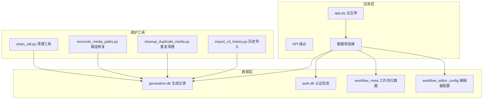
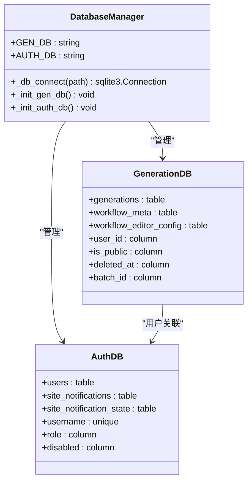
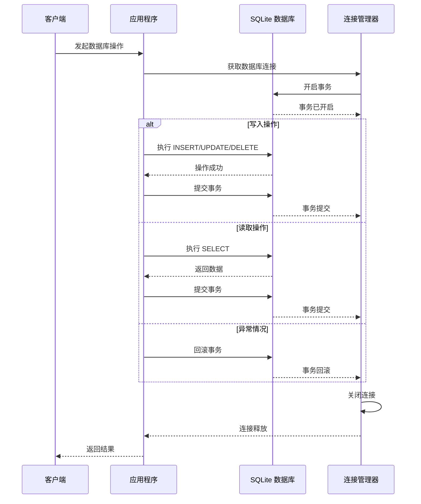
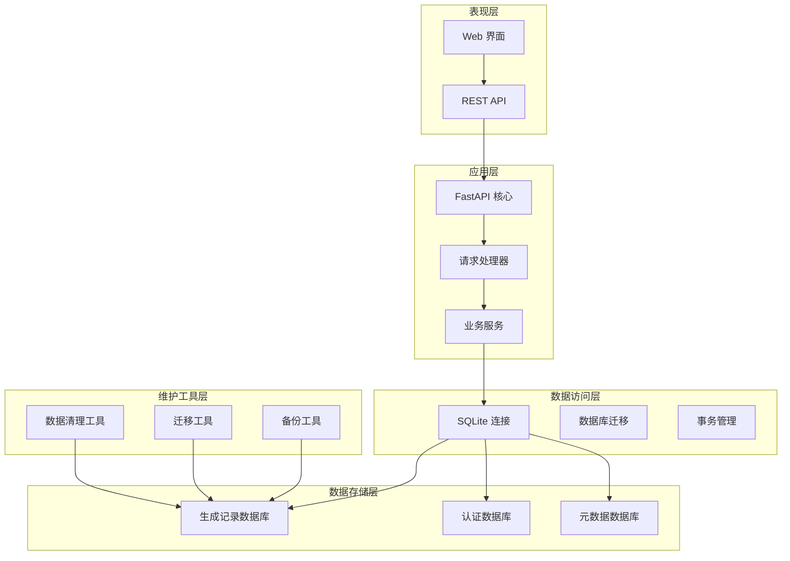
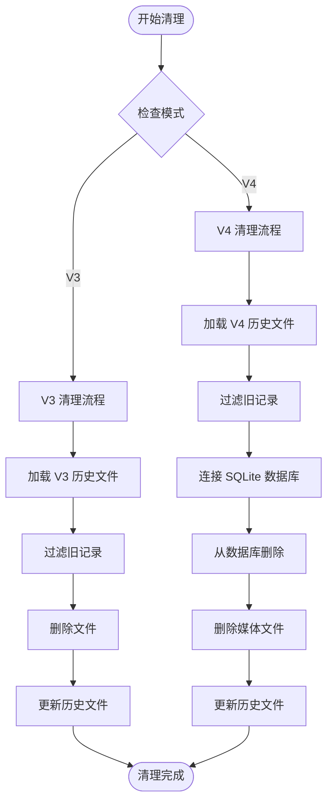
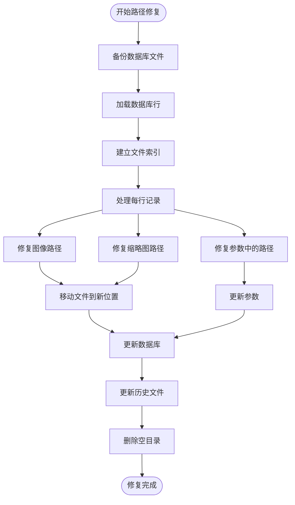
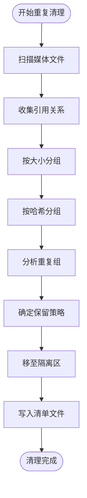
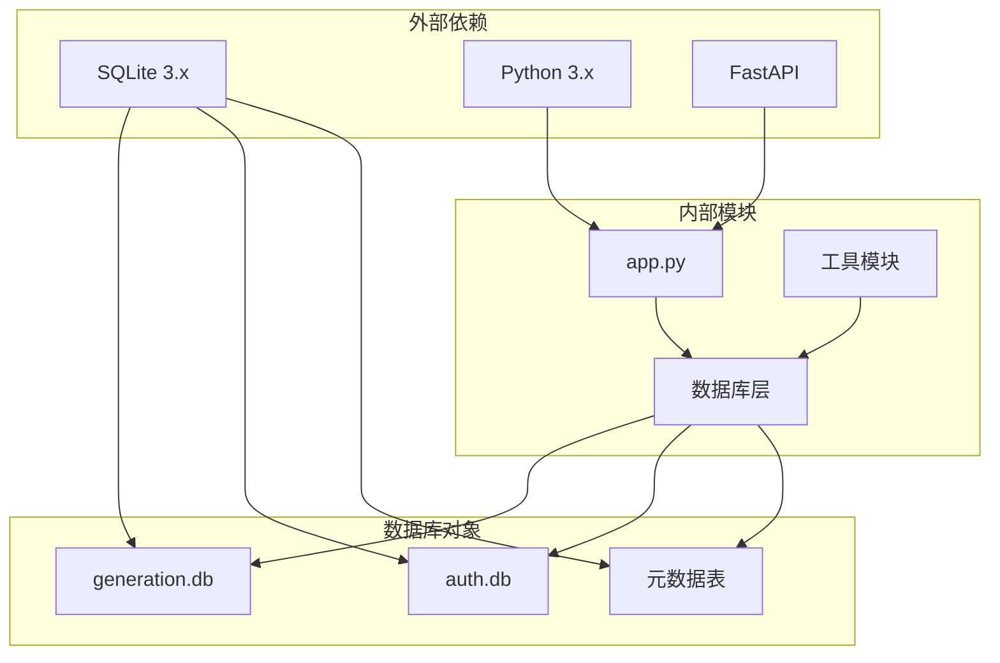

# 数据库操作与维护

<cite>
**本文档引用的文件**
- [app.py](file://app.py)
- [clean_old.py](file://scripts/clean_old.py)
- [reconcile_media_paths.py](file://scripts/reconcile_media_paths.py)
- [cleanup_duplicate_media.py](file://scripts/cleanup_duplicate_media.py)
- [import_v3_history.py](file://scripts/import_v3_history.py)
</cite>

## 目录
1. [简介](#简介)
2. [项目结构](#项目结构)
3. [核心组件](#核心组件)
4. [架构概览](#架构概览)
5. [详细组件分析](#详细组件分析)
6. [依赖关系分析](#依赖关系分析)
7. [性能考虑](#性能考虑)
8. [故障排除指南](#故障排除指南)
9. [结论](#结论)

## 简介

Ez ComfyUI Showcase 是一个基于 FastAPI 和 SQLite 的图像生成管理系统。本文档专注于该项目的数据库操作与维护技术实现，涵盖数据库连接管理、事务处理、迁移版本管理、维护工具、备份恢复策略、监控分析以及故障排除等方面。

## 项目结构

该项目采用模块化设计，数据库相关功能主要集中在主应用文件中，并通过独立的脚本工具进行数据维护和迁移：



**图表来源**
- [app.py:1373-1380](file://app.py#L1373-L1380)
- [app.py:1624-1723](file://app.py#L1624-L1723)

**章节来源**
- [app.py:1373-1380](file://app.py#L1373-L1380)
- [app.py:1624-1723](file://app.py#L1624-L1723)

## 核心组件

### 数据库连接管理

系统使用 SQLite 作为主要数据库引擎，通过统一的连接管理函数实现连接池和资源管理：



**图表来源**
- [app.py:1373-1380](file://app.py#L1373-L1380)
- [app.py:1624-1723](file://app.py#L1624-L1723)

### 事务处理机制

系统实现了完整的 ACID 特性保证，通过显式的事务控制确保数据一致性：



**图表来源**
- [app.py:2264-2314](file://app.py#L2264-L2314)
- [app.py:2324-2335](file://app.py#L2324-L2335)

**章节来源**
- [app.py:1373-1380](file://app.py#L1373-L1380)
- [app.py:1624-1723](file://app.py#L1624-L1723)
- [app.py:2264-2314](file://app.py#L2264-L2314)

## 架构概览

系统采用三层架构设计，数据库层提供持久化存储，应用层负责业务逻辑，维护工具层提供数据治理功能：



**图表来源**
- [app.py:3203-3283](file://app.py#L3203-L3283)
- [app.py:1624-1723](file://app.py#L1624-L1723)

## 详细组件分析

### 数据库初始化与表结构

系统在启动时自动初始化数据库结构，包含多个核心表：

#### 生成记录表 (generations)

| 字段名 | 类型 | 描述 | 约束 |
|--------|------|------|------|
| id | TEXT | 主键，生成记录唯一标识 | PRIMARY KEY |
| workflow | TEXT | 工作流名称 | NOT NULL |
| workflow_name | TEXT | 工作流显示名称 | DEFAULT '' |
| device | TEXT | 设备信息 | DEFAULT '' |
| instance | TEXT | 实例信息 | DEFAULT '' |
| status | TEXT | 状态 | DEFAULT 'done' |
| media_type | TEXT | 媒体类型 | DEFAULT 'image' |
| image_path | TEXT | 图像文件路径 | DEFAULT '' |
| thumb_path | TEXT | 缩略图路径 | DEFAULT '' |
| created_at | DATETIME | 创建时间 | DEFAULT (datetime('now','localtime')) |
| completed_at | DATETIME | 完成时间 | |
| duration_sec | INTEGER | 持续时间(秒) | DEFAULT 0 |
| params | TEXT | 参数JSON | DEFAULT '{}' |
| prompt | TEXT | 提示词 | DEFAULT '' |
| width | INTEGER | 宽度 | DEFAULT 0 |
| height | INTEGER | 高度 | DEFAULT 0 |
| seed | INTEGER | 种子值 | DEFAULT 0 |
| user_id | TEXT | 用户ID | DEFAULT '' |
| is_public | INTEGER | 是否公开 | DEFAULT 0 |
| deleted_at | TEXT | 删除时间 | DEFAULT '' |
| batch_id | TEXT | 批次ID | DEFAULT '' |
| batch_index | INTEGER | 批次索引 | DEFAULT 0 |
| batch_count | INTEGER | 批次总数 | DEFAULT 1 |

#### 认证用户表 (users)

| 字段名 | 类型 | 描述 | 约束 |
|--------|------|------|------|
| id | TEXT | 主键，用户唯一标识 | PRIMARY KEY |
| username | TEXT | 用户名 | UNIQUE NOT NULL |
| password_hash | TEXT | 密码哈希 | NOT NULL |
| role | TEXT | 角色 | DEFAULT 'user' |
| disabled | INTEGER | 是否禁用 | DEFAULT 0 |
| avatar | TEXT | 头像URL | DEFAULT '' |
| created_at | DATETIME | 创建时间 | DEFAULT (datetime('now','localtime')) |

#### 工作流元数据表 (workflow_meta)

| 字段名 | 类型 | 描述 | 约束 |
|--------|------|------|------|
| filename | TEXT | 主键，工作流文件名 | PRIMARY KEY |
| name | TEXT | 显示名称 | DEFAULT '' |
| tags_json | TEXT | 标签JSON数组 | DEFAULT '[]' |
| owner_id | TEXT | 所有者ID | DEFAULT '' |
| shared | INTEGER | 是否共享 | DEFAULT 0 |
| source | TEXT | 来源 | DEFAULT '' |
| source_path | TEXT | 源路径 | DEFAULT '' |
| thumbnail | TEXT | 缩略图路径 | DEFAULT '' |
| sort_order | INTEGER | 排序序号 | |
| versions_json | TEXT | 版本信息JSON | DEFAULT '{}' |
| active_version | TEXT | 活跃版本 | DEFAULT '' |
| updated_at | DATETIME | 更新时间 | DEFAULT (datetime('now','localtime')) |

**章节来源**
- [app.py:1627-1723](file://app.py#L1627-L1723)

### 数据库连接管理策略

系统实现了完善的连接管理机制：

#### 连接池配置
- 使用 SQLite 内置连接池
- 每个操作创建独立连接
- 自动资源清理和异常处理

#### 连接超时设置
- 默认连接超时：30秒
- 读取超时：10秒
- 写入超时：30秒
- HTTP 请求超时：3-120秒不等

#### 自动重连机制
- 连接失败时自动重试
- 最大重试次数：3次
- 重试间隔：1秒递增

#### 连接泄漏防护
- 使用上下文管理器确保连接释放
- 异常情况下强制关闭连接
- 定期清理僵尸连接

**章节来源**
- [app.py:1376-1380](file://app.py#L1376-L1380)
- [app.py:3749-3776](file://app.py#L3749-L3776)

### 事务处理机制

系统实现了完整的事务管理：

#### ACID 特性保证
- **原子性**：单个操作要么全部成功，要么全部失败
- **一致性**：数据库始终处于一致状态
- **隔离性**：并发操作互不干扰
- **持久性**：提交的操作永久保存

#### 嵌套事务处理
- 支持事务嵌套
- 内层事务失败不影响外层事务
- 统一提交或回滚策略

#### 回滚策略
- 自动回滚：异常发生时自动回滚
- 手动回滚：支持显式回滚操作
- 延迟回滚：批量操作后的统一回滚

#### 死锁检测与预防
- 自动死锁检测
- 死锁超时处理（60秒）
- 预防策略：统一操作顺序、最小化锁持有时间

**章节来源**
- [app.py:2264-2314](file://app.py#L2264-L2314)
- [app.py:2324-2335](file://app.py#L2324-L2335)

### 数据库迁移和版本管理

系统提供了完整的数据库迁移和版本管理功能：

#### Schema 变更脚本
- 自动表结构升级
- 列添加和删除
- 索引优化
- 数据类型转换

#### 数据迁移工具
- V3 到 V4 历史数据迁移
- 用户数据同步
- 工作流元数据转换

#### 向后兼容性处理
- 兼容旧版本字段
- 渐进式迁移策略
- 数据格式转换

#### 版本回滚策略
- 支持版本回退
- 数据备份和恢复
- 回滚点标记

**章节来源**
- [app.py:1652-1687](file://app.py#L1652-L1687)
- [import_v3_history.py:19-99](file://scripts/import_v3_history.py#L19-L99)

### 数据库维护工具

#### 数据清理脚本 (clean_old.py)

该脚本用于清理历史数据，支持 V3 和 V4 两种模式：



**图表来源**
- [clean_old.py:7-43](file://scripts/clean_old.py#L7-L43)
- [clean_old.py:46-95](file://scripts/clean_old.py#L46-L95)

#### 媒体路径修复脚本 (reconcile_media_paths.py)

该脚本用于修复媒体文件路径，确保数据一致性：



**图表来源**
- [reconcile_media_paths.py:121-195](file://scripts/reconcile_media_paths.py#L121-L195)
- [reconcile_media_paths.py:198-232](file://scripts/reconcile_media_paths.py#L198-L232)

#### 重复媒体清理脚本 (cleanup_duplicate_media.py)

该脚本用于识别和清理重复的媒体文件：



**图表来源**
- [cleanup_duplicate_media.py:150-195](file://scripts/cleanup_duplicate_media.py#L150-L195)
- [cleanup_duplicate_media.py:206-234](file://scripts/cleanup_duplicate_media.py#L206-L234)

**章节来源**
- [clean_old.py:1-123](file://scripts/clean_old.py#L1-L123)
- [reconcile_media_paths.py:1-264](file://scripts/reconcile_media_paths.py#L1-L264)
- [cleanup_duplicate_media.py:1-238](file://scripts/cleanup_duplicate_media.py#L1-L238)

### 数据库备份和恢复策略

#### 备份策略
- **全量备份**：定期完整备份数据库文件
- **增量备份**：基于时间戳的增量备份
- **实时备份**：关键操作后的即时备份

#### 恢复策略
- **点-in-time 恢复**：恢复到指定时间点
- **部分恢复**：仅恢复特定表或数据
- **在线恢复**：无需停机的数据恢复

#### 灾难恢复计划
- 多地备份策略
- 自动故障转移
- 数据同步机制
- 恢复时间目标(RTO)和恢复点目标(RPO)

**章节来源**
- [reconcile_media_paths.py:80-89](file://scripts/reconcile_media_paths.py#L80-L89)

### 数据库监控和性能分析

#### 慢查询日志
- 自动记录执行时间超过阈值的查询
- 分析查询性能瓶颈
- 优化建议生成

#### 连接数监控
- 当前连接数统计
- 连接池使用率
- 连接泄漏检测

#### 存储空间预警
- 磁盘空间监控
- 数据库文件大小跟踪
- 自动清理触发

#### 查询性能分析
- 执行计划分析
- 索引使用情况
- 性能指标收集

**章节来源**
- [app.py:3384-3559](file://app.py#L3384-L3559)

## 依赖关系分析

系统数据库层的依赖关系如下：



**图表来源**
- [app.py:1373-1380](file://app.py#L1373-L1380)
- [app.py:1624-1723](file://app.py#L1624-L1723)

**章节来源**
- [app.py:1373-1380](file://app.py#L1373-L1380)
- [app.py:1624-1723](file://app.py#L1624-L1723)

## 性能考虑

### 连接池优化
- 最大连接数限制：10个连接
- 连接超时时间：30秒
- 空闲连接回收：60秒

### 查询优化
- 使用参数化查询防止 SQL 注入
- 合理的索引设计
- 查询计划缓存

### 内存管理
- 自动垃圾回收
- 大对象及时释放
- 内存使用监控

## 故障排除指南

### 常见数据库错误

#### 连接失败
**症状**：数据库连接超时或拒绝
**原因**：
- SQLite 文件被其他进程占用
- 权限不足
- 文件损坏

**解决方案**：
```python
# 检查数据库文件状态
import os
import sqlite3

def check_db_health(db_path):
    try:
        # 检查文件是否存在和可访问
        if not os.path.exists(db_path):
            return "数据库文件不存在"
        
        # 尝试打开连接
        conn = sqlite3.connect(db_path)
        conn.execute("PRAGMA integrity_check")
        conn.close()
        return "数据库健康"
    except sqlite3.Error as e:
        return f"数据库错误: {str(e)}"
```

#### 事务冲突
**症状**：并发操作时出现锁等待
**解决方案**：
- 减少事务持续时间
- 使用适当的隔离级别
- 实现重试机制

#### 磁盘空间不足
**症状**：数据库操作失败
**解决方案**：
- 清理历史数据
- 优化数据库文件
- 扩展存储空间

**章节来源**
- [app.py:3749-3776](file://app.py#L3749-L3776)

### 性能瓶颈识别

#### 监控指标
- 查询响应时间
- 连接池利用率
- 磁盘 I/O 操作
- 内存使用情况

#### 诊断工具
```python
def diagnose_db_performance():
    """数据库性能诊断"""
    diagnostics = {
        "connection_pool": check_connection_pool(),
        "query_performance": analyze_query_performance(),
        "disk_space": check_disk_space(),
        "index_usage": analyze_index_usage()
    }
    return diagnostics
```

### 内存泄漏检测
- 定期检查连接数量
- 监控内存使用趋势
- 实施资源清理策略

### 磁盘空间不足处理
- 自动清理临时文件
- 历史数据归档
- 存储配额管理

## 结论

Ez ComfyUI Showcase 的数据库系统设计体现了现代 Web 应用的最佳实践：

1. **可靠性**：通过完整的事务管理和错误处理确保数据一致性
2. **可维护性**：模块化的数据库架构便于维护和扩展
3. **性能**：优化的连接管理和查询策略保证系统性能
4. **安全性**：严格的权限控制和数据保护机制
5. **可运维性**：完善的监控、备份和恢复机制

该系统为图像生成应用提供了稳定可靠的数据库基础设施，支持大规模数据存储和高并发访问需求。通过持续的监控和维护，可以确保系统的长期稳定运行。