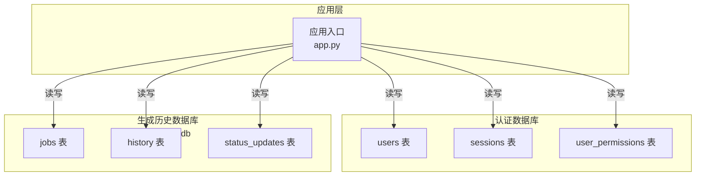
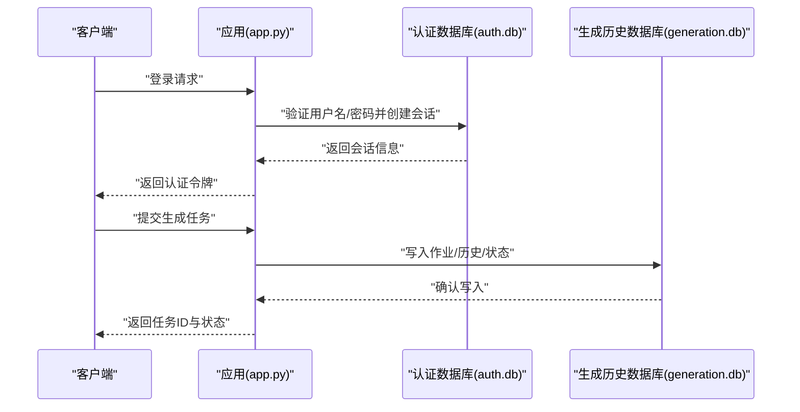
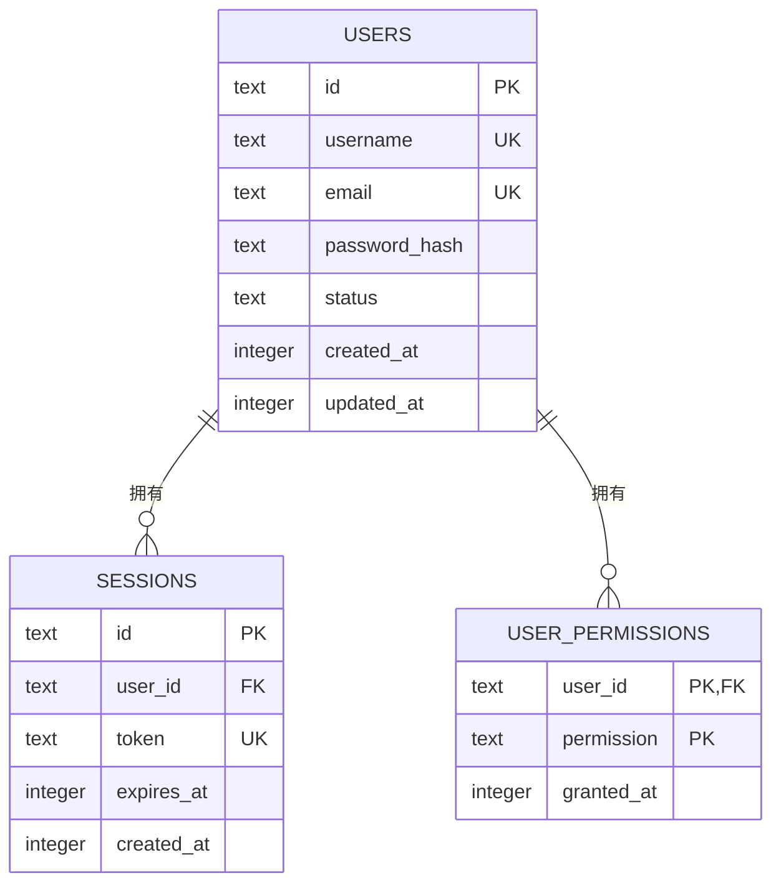
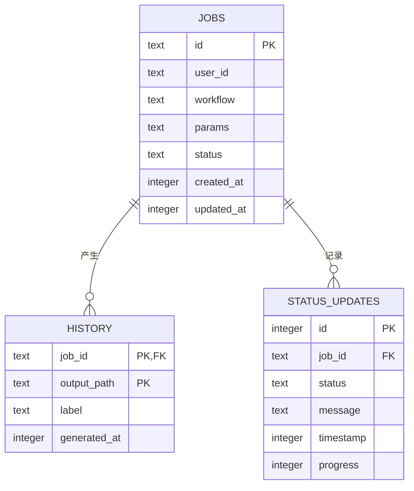
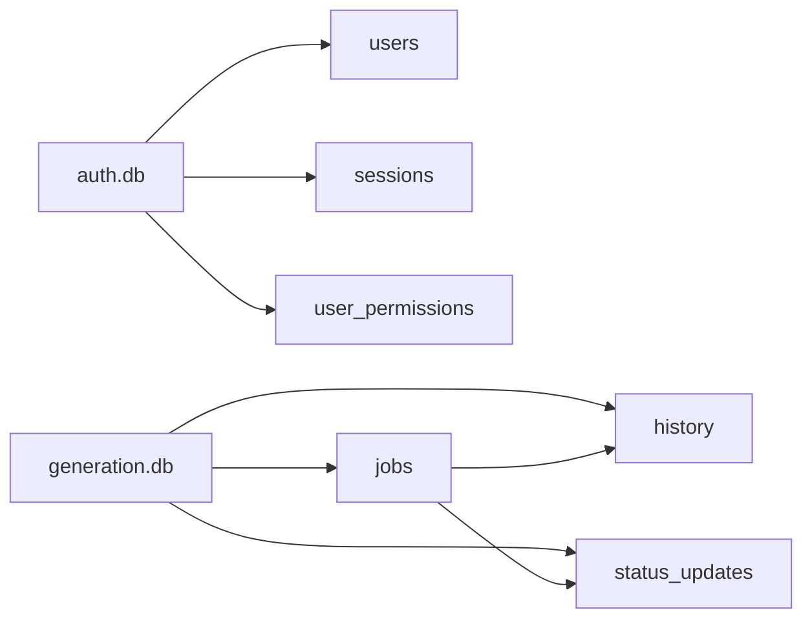

# 数据库设计

<cite>
**本文引用的文件**
- [app.py](file://app.py)
- [import_v3_history.py](file://scripts/import_v3_history.py)
- [4.0-beta-PHASE2.md](file://docs/archive/root-md-2026-06-03/4.0-beta-PHASE2.md)
- [V4_PHASE1_IMPLEMENTATION.md](file://docs/archive/root-md-2026-06-03/V4_PHASE1_IMPLEMENTATION.md)
</cite>

## 目录
1. [简介](#简介)
2. [项目结构](#项目结构)
3. [核心组件](#核心组件)
4. [架构总览](#架构总览)
5. [详细组件分析](#详细组件分析)
6. [依赖分析](#依赖分析)
7. [性能考虑](#性能考虑)
8. [故障排查指南](#故障排查指南)
9. [结论](#结论)
10. [附录](#附录)

## 简介
本文件系统化梳理 Ez ComfyUI Showcase 的数据库设计与实现，重点覆盖以下方面：
- 两大 SQLite 数据库文件的角色与关系：认证数据库（auth.db）与生成历史数据库（generation.db）
- 认证数据库（auth.db）的表结构与关系：用户表（users）、会话表（sessions）、权限表（user_permissions）
- 生成历史数据库（generation.db）的表结构与关系：作业表（jobs）、历史记录表（history）、状态跟踪表（status_updates）
- 数据库连接管理、事务与并发控制策略
- 查询优化与索引设计原则、缓存策略
- 数据库迁移与版本管理、向后兼容与数据转换脚本
- 安全措施：SQL 注入防护、数据加密、访问控制

## 项目结构
本项目采用“双数据库”架构：
- 认证数据库（auth.db）：集中存储用户账户、会话与权限信息，支撑登录鉴权与访问控制
- 生成历史数据库（generation.db）：集中存储生成作业、历史记录与状态变更，支撑作业生命周期管理与可视化

图表来源
- [app.py:1373-1376](file://app.py#L1373-L1376)
- [app.py:1626-1690](file://app.py#L1626-L1690)
- [app.py:1728-1761](file://app.py#L1728-L1761)

章节来源
- [app.py:77-110](file://app.py#L77-L110)
- [app.py:1373-1376](file://app.py#L1373-L1376)

## 核心组件
- 认证数据库（auth.db）
  - 用户表（users）：存储用户基本信息与状态
  - 会话表（sessions）：存储登录会话与令牌
  - 权限表（user_permissions）：存储用户权限集合
- 生成历史数据库（generation.db）
  - 作业表（jobs）：存储生成作业元数据与状态
  - 历史记录表（history）：存储生成结果与输出路径
  - 状态跟踪表（status_updates）：存储作业状态变更日志

章节来源
- [app.py:1626-1690](file://app.py#L1626-L1690)
- [app.py:1728-1761](file://app.py#L1728-L1761)

## 架构总览
应用通过统一的连接工厂创建数据库连接，分别指向 auth.db 与 generation.db。认证流程与生成流程共享同一套连接管理与事务语义。

图表来源
- [app.py:1375-1376](file://app.py#L1375-L1376)
- [app.py:1626-1690](file://app.py#L1626-L1690)
- [app.py:1728-1761](file://app.py#L1728-L1761)

## 详细组件分析

### 认证数据库（auth.db）设计
- 用户表（users）
  - 字段与类型：包含唯一标识、用户名、邮箱、密码哈希、状态、时间戳等
  - 主键：用户唯一标识
  - 索引策略：对用户名、邮箱建立唯一索引以保证唯一性与快速检索
  - 外键：无外键依赖
- 会话表（sessions）
  - 字段与类型：包含会话ID、用户ID、令牌、过期时间、创建时间等
  - 主键：会话ID
  - 索引策略：对用户ID建立索引；对令牌建立唯一索引；对过期时间建立索引用于清理
  - 外键：关联 users 表
- 权限表（user_permissions）
  - 字段与类型：包含用户ID、权限字符串、授予时间等
  - 主键：复合主键（用户ID，权限字符串）
  - 索引策略：对用户ID建立索引以加速按用户查询
  - 外键：关联 users 表

图表来源
- [app.py:1728-1761](file://app.py#L1728-L1761)

章节来源
- [app.py:1728-1761](file://app.py#L1728-L1761)

### 生成历史数据库（generation.db）设计
- 作业表（jobs）
  - 字段与类型：包含作业ID、用户ID、工作流路径、参数、状态、进度、时间戳等
  - 主键：作业ID
  - 索引策略：对用户ID、状态、创建时间建立索引；对工作流路径建立索引
  - 外键：可选关联用户表（若启用用户隔离）
- 历史记录表（history）
  - 字段与类型：包含作业ID、输出媒体路径、标签、生成时间等
  - 主键：复合主键（作业ID，输出路径）
  - 索引策略：对作业ID建立索引；对生成时间建立索引
  - 外键：关联 jobs 表
- 状态跟踪表（status_updates）
  - 字段与类型：包含作业ID、状态、消息、时间戳、进度等
  - 主键：自增ID或时间戳+作业ID组合
  - 索引策略：对作业ID、时间戳建立索引
  - 外键：关联 jobs 表

图表来源
- [app.py:1626-1690](file://app.py#L1626-L1690)

章节来源
- [app.py:1626-1690](file://app.py#L1626-L1690)

### 数据库连接管理、事务与并发控制
- 连接管理
  - 应用通过统一的连接工厂创建连接，分别指向 auth.db 与 generation.db
  - 连接参数建议启用 WAL 模式与合适的超时设置
- 事务处理
  - 写入操作（如创建会话、写入作业、更新状态）应包裹在显式事务中，确保原子性
  - 读多写少场景可使用只读事务提升并发
- 并发控制
  - 使用行级锁与 WAL 模式降低写入冲突
  - 对热点表（如 status_updates）采用批量写入与异步刷新策略

章节来源
- [app.py:1375-1376](file://app.py#L1375-L1376)

### 查询优化策略
- 索引设计原则
  - 在高频过滤字段（用户ID、状态、令牌、作业ID）上建立索引
  - 在时间戳字段上建立索引以支持分页与范围查询
  - 对唯一约束字段（用户名、邮箱、令牌）建立唯一索引
- 查询性能分析
  - 使用 EXPLAIN QUERY PLAN 分析慢查询
  - 对大表进行分区或归档旧数据
- 缓存策略
  - 对只读配置与静态元数据进行内存缓存
  - 对近期活跃作业与会话信息进行短期缓存

章节来源
- [app.py:1626-1690](file://app.py#L1626-L1690)
- [app.py:1728-1761](file://app.py#L1728-L1761)

### 数据库迁移与版本管理
- 向后兼容性
  - 新增表或列时保留默认值与非空约束的兼容策略
  - 通过迁移脚本逐步升级，避免一次性大改
- 数据转换脚本
  - 提供导入/导出脚本，将历史数据迁移到新结构
  - 示例：v3 历史导入脚本用于将旧版历史数据迁移至 generation 表
- 备份与恢复
  - 定期备份数据库文件
  - 支持增量备份与快照恢复

章节来源
- [import_v3_history.py:24](file://scripts/import_v3_history.py#L24)
- [4.0-beta-PHASE2.md:113](file://docs/archive/root-md-2026-06-03/4.0-beta-PHASE2.md#L113)
- [V4_PHASE1_IMPLEMENTATION.md:21](file://docs/archive/root-md-2026-06-03/V4_PHASE1_IMPLEMENTATION.md#L21)

### 安全措施
- SQL 注入防护
  - 统一使用参数化查询与 ORM 接口
  - 严格校验输入参数类型与长度
- 数据加密
  - 密码使用强哈希算法（bcrypt）存储
  - 敏感配置通过环境变量或密钥文件注入
- 访问控制
  - 会话令牌过期与刷新机制
  - 基于权限表的细粒度访问控制

章节来源
- [app.py:82-114](file://app.py#L82-L114)
- [app.py:1728-1761](file://app.py#L1728-L1761)

## 依赖分析
- 组件耦合
  - 认证模块与生成模块共享数据库连接工厂
  - 生成模块内部三张表之间存在明确的外键依赖
- 外部依赖
  - SQLite 作为本地嵌入式数据库，无需额外服务进程
  - JWT 用于跨请求的身份传递

图表来源
- [app.py:1626-1690](file://app.py#L1626-L1690)
- [app.py:1728-1761](file://app.py#L1728-L1761)

## 性能考虑
- I/O 优化
  - 启用 WAL 模式与合适的同步策略
  - 对频繁更新的表采用批量写入
- 索引与统计
  - 定期更新表统计信息以辅助查询优化器
  - 避免过度索引导致写入开销增加
- 并发与锁
  - 控制单事务持续时间，减少锁竞争
  - 对只读查询使用只读连接池

## 故障排查指南
- 常见问题
  - 连接失败：检查数据库文件是否存在与权限
  - 锁等待：检查长事务与批量写入策略
  - 查询缓慢：分析执行计划，补充缺失索引
- 日志与监控
  - 记录数据库操作日志，定位异常请求
  - 监控慢查询与高并发场景下的性能指标

章节来源
- [app.py:1375-1376](file://app.py#L1375-L1376)

## 结论
本设计以“双数据库”模式清晰分离认证与生成历史两类职责，通过规范的表结构、索引与事务策略保障了系统的可靠性与可维护性。配合迁移脚本与安全机制，能够平滑演进并满足生产环境需求。

## 附录
- 关键实现位置参考
  - 认证数据库初始化与表结构：[app.py:1728-1761](file://app.py#L1728-L1761)
  - 生成历史数据库初始化与表结构：[app.py:1626-1690](file://app.py#L1626-L1690)
  - 数据库连接工厂：[app.py:1375-1376](file://app.py#L1375-L1376)
  - 历史数据迁移脚本示例：[import_v3_history.py:24](file://scripts/import_v3_history.py#L24)