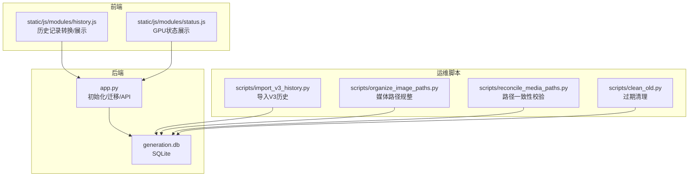
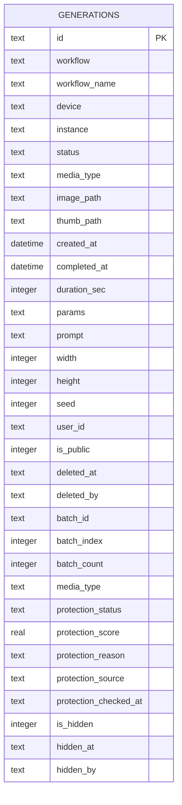
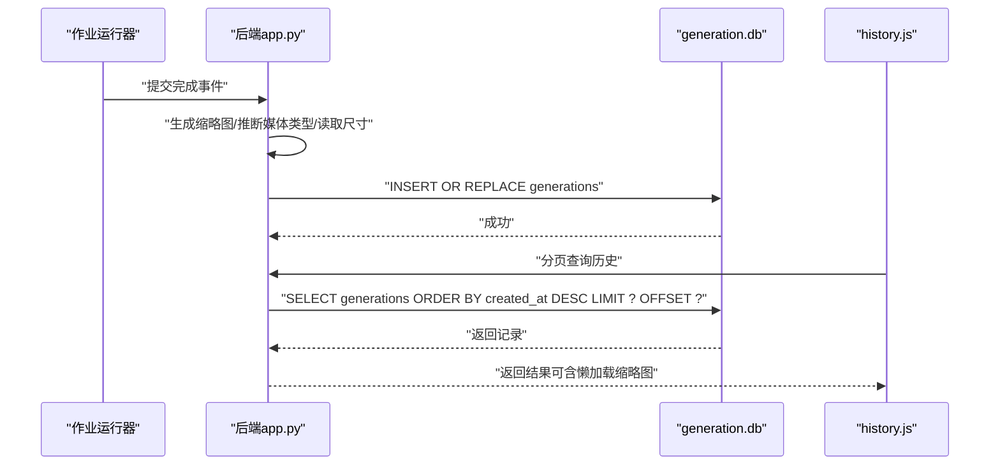
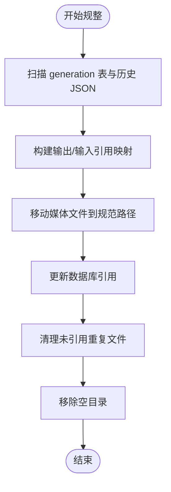
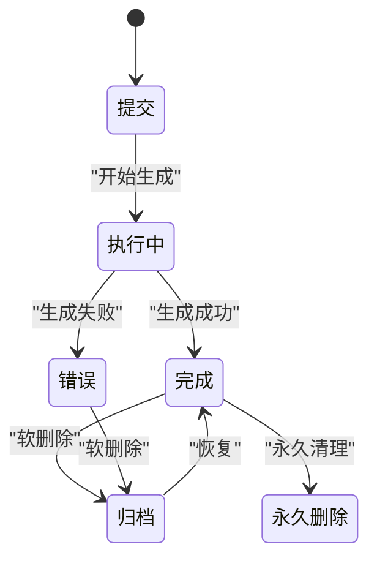
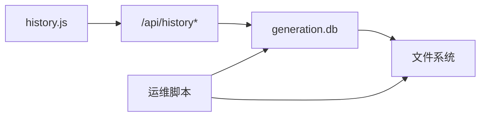

# 生成历史数据库

<cite>
**本文引用的文件**
- [app.py](file://app.py)
- [history.js](file://static/js/modules/history.js)
- [import_v3_history.py](file://scripts/import_v3_history.py)
- [organize_image_paths.py](file://scripts/organize_image_paths.py)
- [reconcile_media_paths.py](file://scripts/reconcile_media_paths.py)
- [clean_old.py](file://scripts/clean_old.py)
- [status.js](file://static/js/modules/status.js)
- [4.0-beta-PHASE2-DRAFT.md](file://docs/archive/root-md-2026-06-03/4.0-beta-PHASE2-DRAFT.md)
- [workflow-storage-architecture-plan.md](file://docs/workflow-storage-architecture-plan.md)
</cite>

## 目录
1. [简介](#简介)
2. [项目结构](#项目结构)
3. [核心组件](#核心组件)
4. [架构总览](#架构总览)
5. [组件详解](#组件详解)
6. [依赖关系分析](#依赖关系分析)
7. [性能与可扩展性](#性能与可扩展性)
8. [故障排查指南](#故障排查指南)
9. [结论](#结论)
10. [附录](#附录)

## 简介
本设计文档聚焦 Ez ComfyUI Showcase 的生成历史数据库 generation.db，系统性阐述其整体架构、表结构设计、作业生命周期、状态跟踪、媒体文件管理、性能优化策略与运维实践。generation.db 以 SQLite 为核心，承载生成作业的历史记录、元数据与软删除归档能力，并通过后端 API 提供分页查询、分享/隐藏控制、批量删除与永久清理等能力。

## 项目结构
generation.db 位于 data 目录下，配合前端历史模块与若干脚本工具实现完整的出图历史管理闭环：
- 后端应用层：负责初始化表结构、插入/更新记录、软删除、批量清理、API 查询与权限校验
- 前端历史模块：负责将已完成作业转换为历史记录、批处理展示与交互
- 迁移与维护脚本：负责从旧版 history.json 导入、媒体路径规整、重复文件清理、过期数据清理

图表来源
- [app.py](file://app.py)
- [history.js](file://static/js/modules/history.js)
- [status.js](file://static/js/modules/status.js)
- [import_v3_history.py](file://scripts/import_v3_history.py)
- [organize_image_paths.py](file://scripts/organize_image_paths.py)
- [reconcile_media_paths.py](file://scripts/reconcile_media_paths.py)
- [clean_old.py](file://scripts/clean_old.py)

章节来源
- [app.py](file://app.py)
- [history.js](file://static/js/modules/history.js)
- [status.js](file://static/js/modules/status.js)
- [import_v3_history.py](file://scripts/import_v3_history.py)
- [organize_image_paths.py](file://scripts/organize_image_paths.py)
- [reconcile_media_paths.py](file://scripts/reconcile_media_paths.py)
- [clean_old.py](file://scripts/clean_old.py)

## 核心组件
- generation 表：存储生成作业的完整历史记录，包含工作流信息、媒体路径、尺寸、种子、耗时、保护状态、用户与可见性控制等
- 前端历史模块：将已完成作业转换为历史记录并进行批处理、置顶、排序与懒加载
- 后端 API：提供分页查询、软删除、恢复、永久删除、公开/隐藏切换等操作
- 运维脚本：导入旧数据、规整媒体路径、清理重复与过期数据

章节来源
- [app.py](file://app.py)
- [history.js](file://static/js/modules/history.js)

## 架构总览
generation.db 的核心是 generation 表，承载作业从提交到完成的全生命周期数据；后端通过 API 对外提供查询与治理能力；前端负责将作业状态转化为历史记录并进行展示与交互；运维脚本保障数据一致性与空间健康。

图表来源
- [app.py](file://app.py)

章节来源
- [app.py](file://app.py)

## 组件详解

### generation 表结构设计
generation 表是生成历史的核心载体，字段覆盖工作流配置、参数、媒体文件路径、尺寸、种子、耗时、保护状态、用户与可见性控制、批处理标识等。以下为关键字段说明与设计目标：

- 基础标识与时间
  - id：作业唯一标识，主键
  - created_at：记录创建时间，默认本地时间
  - completed_at：完成时间（可为空）
  - duration_sec：生成耗时（秒）

- 工作流与实例绑定
  - workflow：工作流文件名
  - workflow_name：工作流显示名称
  - device / instance：执行设备与实例标识，便于资源追踪与统计

- 媒体与预览
  - media_type：媒体类型（image/video），默认 image
  - image_path：输出媒体相对路径
  - thumb_path：缩略图相对路径（由后端按需生成）

- 参数与元信息
  - params：JSON 字符串，保存工作流参数映射
  - prompt：用户提示词摘要
  - width / height：媒体尺寸
  - seed：随机种子

- 用户与可见性
  - user_id：归属用户
  - is_public：是否公开
  - is_hidden / hidden_at / hidden_by：隐藏控制与审计

- 软删除与归档
  - deleted_at / deleted_by：软删除标记与执行者

- 批处理支持
  - batch_id / batch_index / batch_count：用于多输出批处理的聚合与排序

- 内容安全
  - protection_status / protection_score / protection_reason / protection_source / protection_checked_at：内容保护状态与评分、原因、来源与检查时间

设计目标
- 全生命周期数据沉淀：从提交、执行、完成到归档/删除的完整记录
- 多媒体统一管理：媒体与缩略图路径统一存储，便于懒加载与预览
- 扩展性：预留保护状态、隐藏、公开等治理字段
- 兼容性：支持从旧版 history.json 导入与字段回填

章节来源
- [app.py](file://app.py)
- [import_v3_history.py](file://scripts/import_v3_history.py)

### 历史记录表（generation 表）的数据持久化策略
- 插入流程
  - 后端在作业完成后调用插入逻辑，若未生成缩略图则按需生成
  - 自动推断媒体类型（image/video），并读取真实宽高
  - 将保护状态规范化至允许值集合
  - 使用 INSERT OR REPLACE 保证幂等更新
- 更新与懒加载
  - 首次查询时若发现缺少缩略图，后端会尝试生成并回写
  - 支持 compact 模式减少字段传输，提升分页性能
- 批处理
  - 批量作业会生成多个历史条目，共享 batch_id 并按 batch_index 排序

图表来源
- [app.py](file://app.py)
- [history.js](file://static/js/modules/history.js)

章节来源
- [app.py](file://app.py)
- [history.js](file://static/js/modules/history.js)

### 历史记录表（generation 表）的媒体文件路径管理
- 输出媒体与缩略图路径均以相对路径存储，便于迁移与备份
- 路径规整与一致性校验
  - 运维脚本扫描 generation 表与历史 JSON，重建非规范路径
  - 自动移动媒体文件到目标位置并更新引用
- 重复文件清理
  - 识别未被引用的重复媒体文件，移入隔离区，避免磁盘浪费
- 过期清理
  - 基于时间阈值清理旧记录及其媒体文件

图表来源
- [organize_image_paths.py](file://scripts/organize_image_paths.py)
- [reconcile_media_paths.py](file://scripts/reconcile_media_paths.py)
- [clean_old.py](file://scripts/clean_old.py)

章节来源
- [organize_image_paths.py](file://scripts/organize_image_paths.py)
- [reconcile_media_paths.py](file://scripts/reconcile_media_paths.py)
- [clean_old.py](file://scripts/clean_old.py)

### 历史记录表（generation 表）的状态跟踪与保护状态
- 保护状态字段
  - protection_status：pending/safe/protected/error
  - protection_score / protection_reason / protection_source：评分、原因、来源
  - protection_checked_at：检查时间
- 前端状态展示
  - GPU 使用率、显存占用、温度等指标通过 status.js 展示，辅助判断生成压力与异常

章节来源
- [app.py](file://app.py)
- [status.js](file://static/js/modules/status.js)

### 历史记录表（generation 表）的查询与治理 API
- 分页查询
  - 支持 limit/offset、按 created_at 降序、rowid 辅助排序
  - 支持 scope/status/current_user 等过滤条件
- 软删除与恢复
  - 标记 deleted_at/deleted_by 实现软删除
  - 支持恢复接口清除软删除标记
- 永久删除
  - 删除记录并清理对应媒体文件
- 可见性控制
  - 切换 is_public/is_hidden 并记录 hidden_at/hidden_by

章节来源
- [app.py](file://app.py)

### 历史记录表（generation 表）的作业生命周期管理
- 提交：生成作业开始，记录基础元信息
- 执行中：实时状态更新（进度、节点、采样器阶段等）
- 完成：生成媒体与缩略图，写入 generation 表
- 归档/删除：支持软删除与永久删除
- 恢复：从软删除状态恢复

图表来源
- [app.py](file://app.py)

章节来源
- [app.py](file://app.py)

## 依赖关系分析
- 后端对 generation 表的依赖
  - 初始化与迁移：确保字段存在与默认值一致
  - 插入/更新：INSERT OR REPLACE 与字段规范化
  - 查询：分页、过滤、懒加载缩略图
  - 治理：软删除、恢复、永久删除、可见性控制
- 前端对后端 API 的依赖
  - 历史记录转换与批处理
  - 媒体与缩略图加载
- 运维脚本对 generation 表与文件系统的依赖
  - 导入旧数据、规整路径、清理重复与过期数据

图表来源
- [app.py](file://app.py)
- [history.js](file://static/js/modules/history.js)
- [import_v3_history.py](file://scripts/import_v3_history.py)
- [organize_image_paths.py](file://scripts/organize_image_paths.py)
- [reconcile_media_paths.py](file://scripts/reconcile_media_paths.py)
- [clean_old.py](file://scripts/clean_old.py)

章节来源
- [app.py](file://app.py)
- [history.js](file://static/js/modules/history.js)
- [import_v3_history.py](file://scripts/import_v3_history.py)
- [organize_image_paths.py](file://scripts/organize_image_paths.py)
- [reconcile_media_paths.py](file://scripts/reconcile_media_paths.py)
- [clean_old.py](file://scripts/clean_old.py)

## 性能与可扩展性
- 分页查询
  - 使用 created_at 降序与 rowid 辅助排序，避免全表扫描
  - 限制每页最大数量，结合 offset 控制内存占用
- 懒加载缩略图
  - 首次查询时按需生成缩略图并回写，降低冷启动成本
- 批处理优化
  - 批量作业共享 batch_id，前端按 batch_index 排序渲染
- 索引建议（基于现有实现的观察）
  - 已有主键 id，建议考虑在 user_id、created_at、deleted_at 上建立复合索引以优化常见查询
  - 在 media_type、status 等过滤字段上建立单列索引以加速筛选
- 查询缓存
  - 对高频分页查询结果进行短期缓存（如 Redis/LRU），减少数据库压力
- 定期清理
  - 清理过期记录与未引用媒体文件，保持数据库与文件系统一致性

章节来源
- [app.py](file://app.py)
- [history.js](file://static/js/modules/history.js)

## 故障排查指南
- 历史记录缺失或缩略图不显示
  - 检查 generation 表中 image_path/thumb_path 是否为空
  - 触发懒加载逻辑，后端会尝试生成缩略图并回写
- 媒体文件丢失
  - 使用规整脚本扫描并修复路径，必要时从备份恢复
- 重复文件占用空间
  - 使用重复文件清理脚本隔离未引用重复文件
- 过期数据清理
  - 使用过期清理脚本按时间阈值删除旧记录及媒体文件
- 权限与可见性问题
  - 确认 is_public/is_hidden 与 deleted_at 状态符合预期

章节来源
- [app.py](file://app.py)
- [organize_image_paths.py](file://scripts/organize_image_paths.py)
- [reconcile_media_paths.py](file://scripts/reconcile_media_paths.py)
- [clean_old.py](file://scripts/clean_old.py)

## 结论
generation.db 以 SQLite 为基础，围绕 generation 表构建了完整的生成历史管理能力：从作业生命周期记录、媒体文件路径管理、保护状态治理，到分页查询、软删除与恢复、批量处理与前端展示。通过运维脚本保障数据一致性与空间健康，结合懒加载与分页策略提升性能。建议后续引入索引与查询缓存进一步优化大数据量场景，并完善审计字段以增强可追溯性。

## 附录
- 设计演进参考
  - 早期设计草案中定义了 generation_history 表结构，与当前 generation 表高度一致
  - 工作流存储架构规划明确了文件系统与数据库的职责边界，为 generation.db 的定位提供了依据

章节来源
- [4.0-beta-PHASE2-DRAFT.md](file://docs/archive/root-md-2026-06-03/4.0-beta-PHASE2-DRAFT.md)
- [workflow-storage-architecture-plan.md](file://docs/workflow-storage-architecture-plan.md)