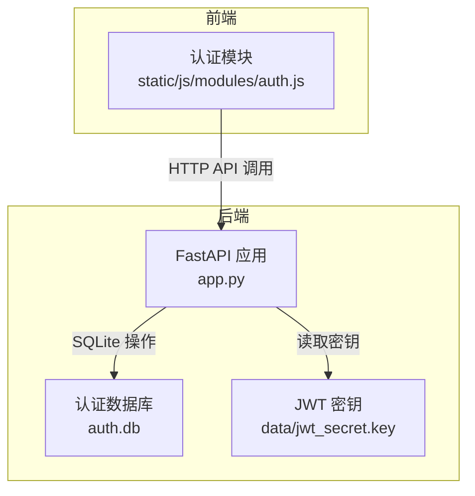
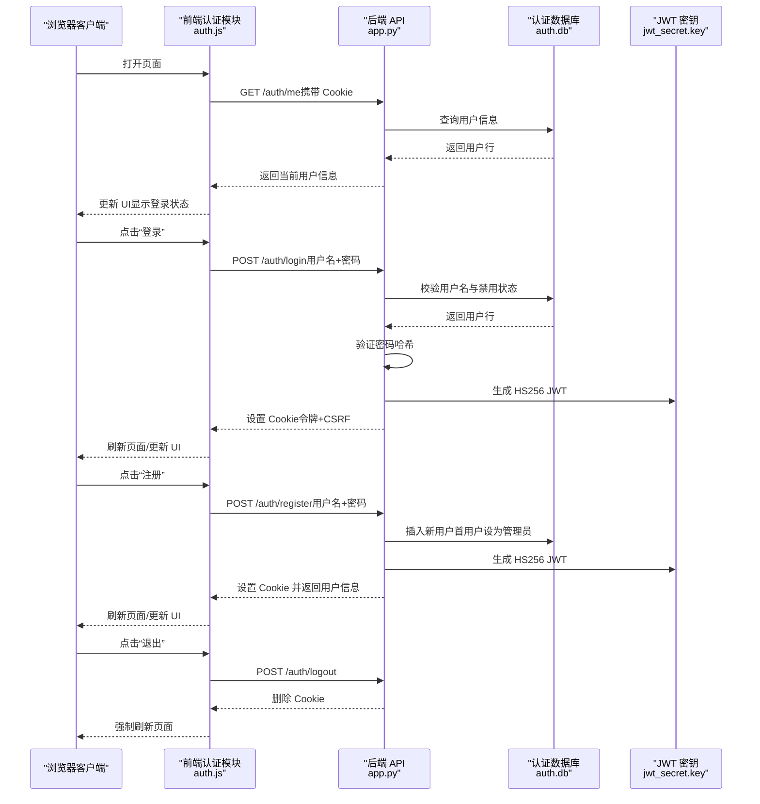
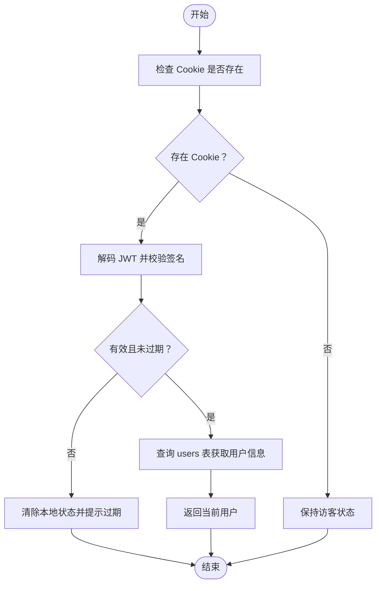
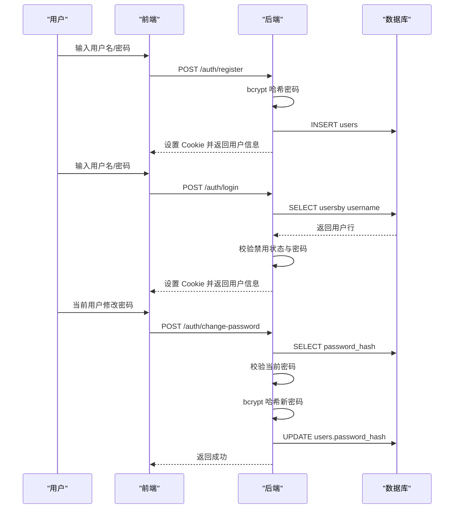
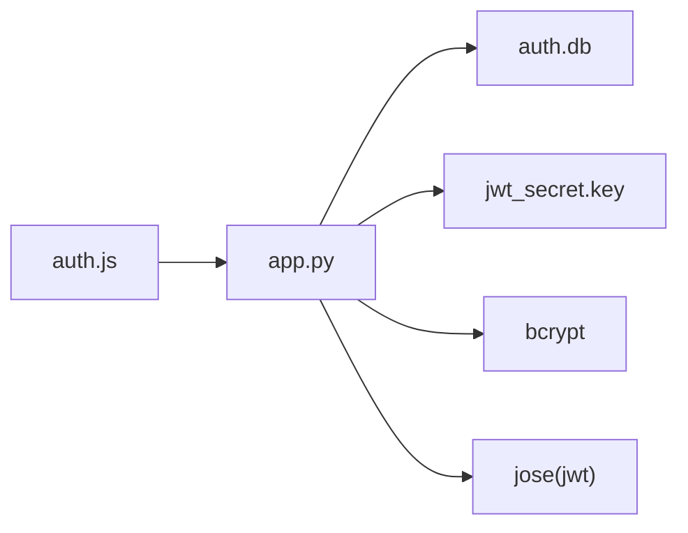

# 用户认证数据库

<cite>
**本文引用的文件**
- [app.py](file://app.py)
- [auth.js](file://static/js/modules/auth.js)
- [V4_PHASE1_IMPLEMENTATION.md](file://docs/archive/root-md-2026-06-03/V4_PHASE1_IMPLEMENTATION.md)
- [test_site_notifications_api.py](file://tests/test_site_notifications_api.py)
</cite>

## 目录
1. [简介](#简介)
2. [项目结构](#项目结构)
3. [核心组件](#核心组件)
4. [架构总览](#架构总览)
5. [详细组件分析](#详细组件分析)
6. [依赖关系分析](#依赖关系分析)
7. [性能考虑](#性能考虑)
8. [故障排查指南](#故障排查指南)
9. [结论](#结论)
10. [附录](#附录)

## 简介
本设计文档面向 Ez ComfyUI Showcase 的用户认证数据库（auth.db），系统性阐述其整体架构与设计原理，覆盖以下主题：
- 用户表 users 的字段定义、数据类型与约束
- 会话与令牌机制：JWT 令牌存储、过期时间管理、Cookie 安全属性
- 权限与角色体系：用户角色定义、访问控制规则、管理员继承机制
- 数据库连接与并发：SQLite 连接模式、事务隔离与并发控制策略
- 用户注册、登录、密码修改的完整流程与数据库操作
- 实际建表语句示例、常用查询优化与索引设计原则
- 安全措施：密码哈希算法、SQL 注入防护、会话劫持防护

## 项目结构
认证相关的核心位置如下：
- 后端入口与认证实现：app.py
- 前端认证模块：static/js/modules/auth.js
- 认证数据库初始化与迁移：app.py 中的 _init_auth_db 与相关路由
- 历史实现文档与示例：docs/archive/root-md-2026-06-03/V4_PHASE1_IMPLEMENTATION.md
- 测试用例：tests/test_site_notifications_api.py（用于验证令牌有效期）



**图表来源**
- [app.py](file://app.py)
- [auth.js](file://static/js/modules/auth.js)

**章节来源**
- [app.py](file://app.py)
- [auth.js](file://static/js/modules/auth.js)

## 核心组件
- 用户表 users：存储用户标识、用户名、密码哈希、角色、禁用状态、头像与创建时间等。
- 站点通知表 site_notifications 与状态表 site_notification_state：用于站点级通知的发布与用户抑制状态记录。
- 认证中间件与路由：负责注册、登录、登出、当前用户查询、密码修改、管理员用户管理等。

关键实现要点：
- 使用 bcrypt 对密码进行哈希存储，并在登录时校验。
- 使用 HS256 算法的 JWT 存储于 HTTP Cookie 中，配合 CSRF Cookie 与 SameSite/Lax/Secure 属性提升安全性。
- 角色字段 role 支持 "admin"/"user"，并具备管理员继承机制与权限校验。
- 数据库初始化时自动迁移旧字段（如 role、disabled）并确保首个用户拥有管理员身份。

**章节来源**
- [app.py](file://app.py)
- [V4_PHASE1_IMPLEMENTATION.md](file://docs/archive/root-md-2026-06-03/V4_PHASE1_IMPLEMENTATION.md)

## 架构总览
认证系统的端到端交互流程如下：



**图表来源**
- [app.py](file://app.py)
- [auth.js](file://static/js/modules/auth.js)

## 详细组件分析

### 用户表 users 设计
- 字段与类型
  - id：TEXT 主键，UUID 前缀字符串
  - username：TEXT 唯一非空
  - password_hash：TEXT 非空（bcrypt 哈希）
  - role：TEXT 默认 "user"，支持 "admin"/"user"
  - disabled：INTEGER 默认 0（0 表示启用，1 表示禁用）
  - avatar：TEXT 默认空串
  - created_at：DATETIME 默认当前本地时间
- 约束与默认值
  - username 唯一性约束
  - 首个注册用户自动提升为管理员
  - 禁用用户无法登录
- 建表语句参考
  - 参考历史实现文档中的建表示例（字段与约束与当前实现一致）
- 索引建议
  - 在 username 上建立唯一索引（由 UNIQUE 约束隐含）
  - 如需按创建时间排序或统计，可在 created_at 上建立索引

**章节来源**
- [app.py](file://app.py)
- [V4_PHASE1_IMPLEMENTATION.md](file://docs/archive/root-md-2026-06-03/V4_PHASE1_IMPLEMENTATION.md)

### 会话与令牌机制
- 令牌生成与存储
  - HS256 算法，密钥来自 data/jwt_secret.key（若环境变量未设置则自动生成并限制权限）
  - 令牌有效期：ACCESS_TOKEN_EXPIRE_DAYS = 31 天
  - 通过 HTTP Cookie 存储，httponly=true、secure=HTTPS 时为 true、samesite="lax"
- CSRF 防护
  - 同步设置 CSRF Cookie，并要求请求头携带 X-CSRF-Token，使用恒等比较防止时序攻击
- 速率限制
  - 对注册/登录接口进行基于 IP+用户名的滑动窗口限流，降低暴力破解风险
- 会话恢复与失效
  - 前端调用 /auth/me 恢复会话；若失败则清除本地状态并提示过期



**图表来源**
- [app.py](file://app.py)
- [auth.js](file://static/js/modules/auth.js)

**章节来源**
- [app.py](file://app.py)
- [auth.js](file://static/js/modules/auth.js)

### 权限与角色体系
- 角色定义
  - "admin"：超级管理员，拥有最高权限
  - "user"：普通用户
- 继承与访问控制
  - 首个注册用户自动成为管理员
  - 管理员可管理用户列表、修改用户角色/禁用状态/密码
  - 管理员可发布/查看站点通知
- 关键校验点
  - 当前用户角色查询与缓存
  - 禁止管理员自我禁用
  - 禁止删除自身账户

```mermaid
classDiagram
class Users {
+id : TEXT
+username : TEXT
+password_hash : TEXT
+role : TEXT
+disabled : INTEGER
+avatar : TEXT
+created_at : DATETIME
}
class SiteNotifications {
+id : INTEGER
+title : TEXT
+content : TEXT
+created_by : TEXT
+created_at : DATETIME
}
class SiteNotificationState {
+user_id : TEXT
+suppressed_until_id : INTEGER
+updated_at : DATETIME
}
Users ||..o{ SiteNotificationState : "用户-抑制状态"
Users ||..o{ SiteNotifications : "发布者"
```

**图表来源**
- [app.py](file://app.py)

**章节来源**
- [app.py](file://app.py)

### 数据库连接与并发控制
- 连接模式
  - 使用 sqlite3 直连 auth.db，每个请求独立打开/关闭连接
  - 未使用显式连接池（单机/嵌入式 SQLite 场景）
- 事务与隔离
  - 默认行为遵循 SQLite 默认隔离级别
  - 写操作（注册/登录/更新用户）在单次请求内完成，避免跨请求竞争
- 并发访问策略
  - 通过速率限制与 CSRF 降低并发攻击面
  - 未引入 WAL/锁竞争优化（小型应用规模下无需）

**章节来源**
- [app.py](file://app.py)

### 用户注册、登录、密码修改流程
- 注册
  - 校验用户名长度与密码长度
  - bcrypt 哈希密码
  - 首个用户自动设为管理员，其余用户默认为普通用户
  - 插入 users 表并生成 JWT，设置 Cookie
- 登录
  - 校验用户名与密码（bcrypt 校验）
  - 禁用用户不可登录
  - 生成 JWT 并设置 Cookie
- 密码修改
  - 校验当前密码正确性
  - 新密码长度不小于 6
  - 更新 password_hash



**图表来源**
- [app.py](file://app.py)

**章节来源**
- [app.py](file://app.py)

### 常用查询与优化建议
- 查询当前用户
  - 通过 /auth/me 获取 id/username/role/disabled/avatar/created_at
- 管理员用户列表
  - 通过 /api/users 获取全部用户并排序
- 索引设计原则
  - username 唯一索引（由 UNIQUE 约束保证）
  - created_at 建立索引以支持按时间排序与统计
- SQL 注入防护
  - 全部使用参数化查询（sqlite3.Row + 占位符）
  - 未使用动态拼接 SQL

**章节来源**
- [app.py](file://app.py)

### 安全措施
- 密码加密
  - bcrypt 哈希存储，盐值由 bcrypt 生成
- 令牌安全
  - HS256 JWT，密钥持久化至 data/jwt_secret.key（文件权限严格）
  - Cookie httponly/secure/samesite 防止 XSS/CORS/CSRF
- CSRF 防护
  - 同源请求必须携带 CSRF Token，服务端恒等比较
- 速率限制
  - 登录/注册接口基于 IP+用户名的滑动窗口限流
- 会话劫持防护
  - 令牌有效期 31 天；前端定期调用 /auth/me 恢复会话
  - 登出时删除 Cookie 并强制刷新页面

**章节来源**
- [app.py](file://app.py)
- [auth.js](file://static/js/modules/auth.js)

## 依赖关系分析
- 后端依赖
  - FastAPI：路由与中间件
  - python-jose：JWT 编解码
  - passlib[bcrypt]：密码哈希
  - sqlite3：本地数据库访问
- 前端依赖
  - fetch API：HTTP 请求
  - Cookie/LocalStorage：会话状态与 CSRF Token
- 外部集成
  - Cookie 与 CSRF Token 的一致性校验
  - 令牌有效期测试（测试用例验证 ACCESS_TOKEN_EXPIRE_DAYS ≥ 31）



**图表来源**
- [app.py](file://app.py)
- [auth.js](file://static/js/modules/auth.js)

**章节来源**
- [app.py](file://app.py)
- [auth.js](file://static/js/modules/auth.js)
- [test_site_notifications_api.py](file://tests/test_site_notifications_api.py)

## 性能考虑
- 连接与事务
  - 单请求连接，无长事务，避免锁竞争
- 查询路径
  - 用户名唯一查询，索引命中良好
  - 管理员用户列表按创建时间排序，建议在 created_at 建立索引
- 并发与限流
  - 速率限制减少无效尝试，降低数据库压力
- 令牌有效期
  - 31 天有效期减少频繁登录带来的数据库写入

[本节为通用指导，不直接分析具体文件]

## 故障排查指南
- 登录失败
  - 检查用户名是否存在、是否被禁用、密码是否正确
  - 确认 Cookie 是否被设置且未过期
- 注册失败
  - 检查用户名长度与密码长度是否满足要求
  - 确认用户名唯一性冲突
- 会话异常
  - 前端 /auth/me 返回失败时，确认 Cookie 与 CSRF Token 一致
  - 登出后强制刷新页面，避免本地状态残留
- 管理员功能不可用
  - 确认当前用户 role 为 "admin"
  - 首个用户自动成为管理员，若被删除需重新注册

**章节来源**
- [app.py](file://app.py)
- [auth.js](file://static/js/modules/auth.js)

## 结论
auth.db 的认证数据库设计简洁稳健，围绕 bcrypt 哈希、HS256 JWT、Cookie 与 CSRF 保护构建了基础的安全模型。通过角色与管理员继承机制实现了最小权限控制，结合速率限制与会话恢复策略，满足小型到中型应用的认证需求。后续可按业务增长引入连接池、WAL/锁优化与更细粒度的权限控制。

[本节为总结，不直接分析具体文件]

## 附录

### 建表语句参考
- 用户表 users
  - 字段与约束与当前实现一致
- 站点通知表 site_notifications 与状态表 site_notification_state
  - 用于站点级通知发布与用户抑制状态记录

**章节来源**
- [V4_PHASE1_IMPLEMENTATION.md](file://docs/archive/root-md-2026-06-03/V4_PHASE1_IMPLEMENTATION.md)
- [app.py](file://app.py)