# 数据管理文档

<cite>
**本文引用的文件**
- [app.py](file://app.py)
- [import_v3_history.py](file://scripts/import_v3_history.py)
- [organize_image_paths.py](file://scripts/organize_image_paths.py)
- [cleanup_duplicate_media.py](file://scripts/cleanup_duplicate_media.py)
- [reconcile_media_paths.py](file://scripts/reconcile_media_paths.py)
- [media_outputs.py](file://modules/media_outputs.py)
- [auth.js](file://static/js/modules/auth.js)
- [history.js](file://static/js/modules/history.js)
- [test_media_outputs.py](file://tests/test_media_outputs.py)
- [test_logs_api.py](file://tests/test_logs_api.py)
- [I2V_10eros_v3_TiledSampler.json](file://data/wf_configs/I2V_10eros_v3_TiledSampler.json)
</cite>

## 目录
1. [简介](#简介)
2. [项目结构](#项目结构)
3. [核心组件](#核心组件)
4. [架构总览](#架构总览)
5. [详细组件分析](#详细组件分析)
6. [依赖分析](#依赖分析)
7. [性能考虑](#性能考虑)
8. [故障排查指南](#故障排查指南)
9. [结论](#结论)
10. [附录](#附录)

## 简介
本文件面向 Ez ComfyUI Showcase 的数据管理需求，系统化梳理数据库设计（SQLite）、用户认证与权限模型、工作流元数据与版本管理、生成历史与结果存储、文件系统架构、备份与恢复策略、数据迁移与版本升级、数据安全与隐私保护，以及性能优化建议。内容兼顾技术深度与可读性，帮助开发者与运维人员高效理解并维护数据层。

## 项目结构
围绕数据管理的关键目录与文件如下：
- 数据库：生成历史与工作流元数据使用 SQLite；认证与站点通知使用独立 SQLite。
- 历史数据：既有 SQLite 表，也保留了历史 JSON 文件作为回退与迁移来源。
- 文件系统：工作流配置、缩略图、生成输出、上传输入、历史归档等分层存放。
- 迁移工具：从旧版 history.json 导入到 SQLite，以及媒体路径整理与对账脚本。
- 前端模块：历史记录、认证与权限 UI、日志可见性控制等。

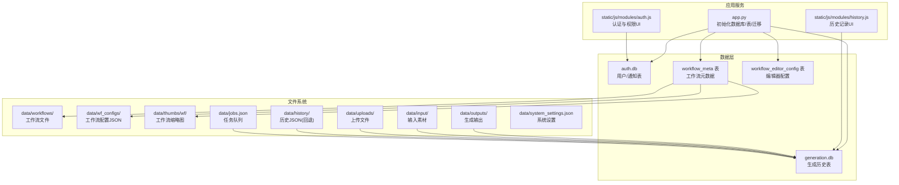

图表来源
- [app.py](file://app.py)
- [auth.js](file://static/js/modules/auth.js)
- [history.js](file://static/js/modules/history.js)

章节来源
- [app.py](file://app.py)
- [import_v3_history.py](file://scripts/import_v3_history.py)

## 核心组件
- 生成历史数据库（generation.db）
  - 主表 generations：记录每次生成的作业信息、结果路径、参数、保护状态等。
  - 元数据表 workflow_meta：工作流元数据、标签、所有者、共享状态、版本列表等。
  - 编辑器配置表 workflow_editor_config：按工作流/作用域/用户维度的配置快照。
- 认证与站点通知数据库（auth.db）
  - 用户表 users：用户名唯一、角色、启用状态、头像、创建时间。
  - 站点通知表 site_notifications：标题、内容、创建人、创建时间。
  - 站点通知状态表 site_notification_state：用户通知抑制状态。
- 历史数据回退与迁移
  - 历史 JSON 文件 data/history/history.json 作为 V3 到 V4 的迁移源。
  - 迁移脚本 import_v3_history.py 将历史导入 generation.db。
- 文件系统与媒体输出
  - 输出类型识别：图片/视频扩展名与键位映射。
  - 媒体路径组织：按用户与日期归档，支持路径整理与对账。
  - 缩略图与工作流配置：独立目录与元数据表配合。

章节来源
- [app.py](file://app.py)
- [import_v3_history.py](file://scripts/import_v3_history.py)
- [media_outputs.py](file://modules/media_outputs.py)
- [organize_image_paths.py](file://scripts/organize_image_paths.py)
- [cleanup_duplicate_media.py](file://scripts/cleanup_duplicate_media.py)
- [reconcile_media_paths.py](file://scripts/reconcile_media_paths.py)

## 架构总览
下图展示数据在应用中的流向：前端通过 API 访问后端；后端写入 SQLite 并更新文件系统；迁移脚本与工具负责历史数据与文件系统的治理。

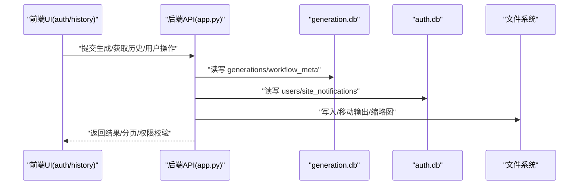

图表来源
- [app.py](file://app.py)
- [auth.js](file://static/js/modules/auth.js)
- [history.js](file://static/js/modules/history.js)

## 详细组件分析

### 数据库设计与表结构

#### 生成历史表 generations
- 设计要点
  - 主键：id（文本）。
  - 关联字段：workflow、workflow_name、user_id、instance、device。
  - 结果与元信息：image_path、thumb_path、media_type、prompt、尺寸、seed。
  - 时间与状态：created_at、completed_at、duration_sec、status。
  - 批量生成：batch_id、batch_index、batch_count。
  - 隐私与保护：protection_status、protection_score、protection_reason、protection_source、protection_checked_at。
  - 可见性：is_public、is_hidden、hidden_at、hidden_by。
  - 软删除：deleted_at、deleted_by。
- 索引与约束
  - 主键 id。
  - 建议索引：user_id、workflow、created_at、is_public、is_hidden、batch_id。
  - 外键：未显式声明外键，但业务上与用户、工作流存在逻辑关联。
- 字段复杂度
  - 插入/更新：O(1)；批量查询：基于索引 O(log N) 到 O(N) 视范围而定。
- 错误处理
  - 写入失败记录日志，避免中断流程。

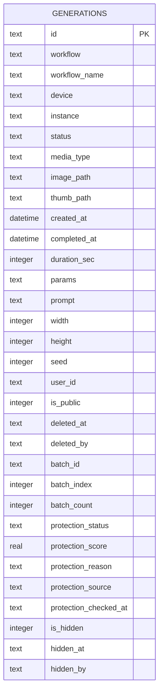

图表来源
- [app.py](file://app.py)

章节来源
- [app.py](file://app.py)

#### 工作流元数据表 workflow_meta
- 设计要点
  - 主键：filename。
  - 元信息：name、tags_json、owner_id、shared、source、source_path、thumbnail、sort_order。
  - 版本管理：versions_json、active_version、updated_at。
- 索引与约束
  - filename 唯一主键。
  - 建议索引：owner_id、shared、updated_at。
- 版本控制
  - 支持多版本 JSON 文件路径，动态扫描 __versions 子目录补充版本清单。
- 迁移策略
  - 从 data/wf_meta.json 迁移到 workflow_meta 表，并回写 JSON 以保持双写兼容。

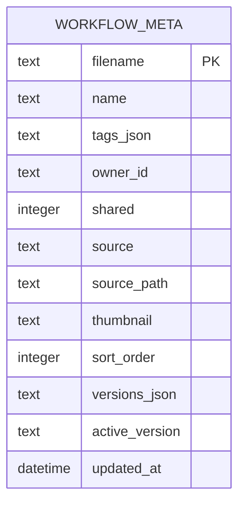

图表来源
- [app.py](file://app.py)

章节来源
- [app.py](file://app.py)

#### 工作流编辑器配置表 workflow_editor_config
- 设计要点
  - 复合主键：workflow_filename + config_scope + user_id。
  - config_json：按作用域与用户隔离的配置快照。
- 使用场景
  - 个性化节点布局、参数面板可见性、默认值等。

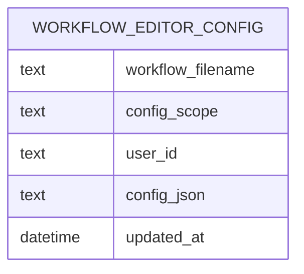

图表来源
- [app.py](file://app.py)

章节来源
- [app.py](file://app.py)

#### 认证与站点通知表（auth.db）
- 用户表 users
  - 主键：id；username 唯一；role、disabled 控制权限与启用状态。
- 站点通知表 site_notifications
  - 自增 id；title、content、created_by、created_at。
- 站点通知状态表 site_notification_state
  - 主键：user_id；suppressed_until_id；updated_at。

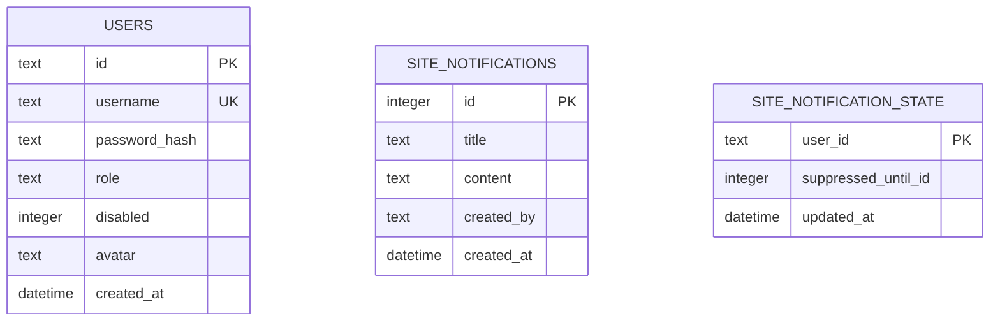

图表来源
- [app.py](file://app.py)

章节来源
- [app.py](file://app.py)

### 用户认证与权限数据存储
- 登录与会话
  - 前端 auth.js 提供登录、切换用户、修改密码、系统设置入口。
  - 后端通过 rate limit 限制暴力尝试，防止频繁失败。
- 权限模型
  - 用户角色：user/admin；管理员自动从最早用户继承。
  - 历史项可见性：仅本人或管理员可见；日志可见性按 job_id 与用户绑定。
- 安全控制
  - 日志可见性过滤：非管理员仅能查看自身或关联 job 的日志条目。
  - 历史项公开/隐藏：仅拥有者可变更 is_public/is_hidden。

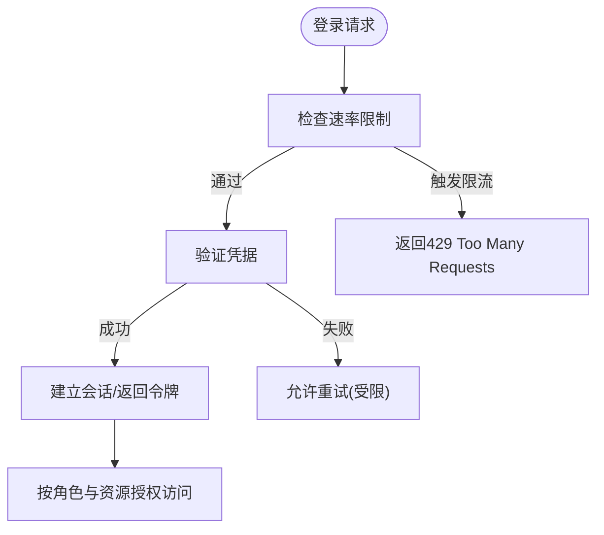

图表来源
- [app.py](file://app.py)
- [auth.js](file://static/js/modules/auth.js)

章节来源
- [app.py](file://app.py)
- [auth.js](file://static/js/modules/auth.js)
- [test_logs_api.py](file://tests/test_logs_api.py)

### 工作流元数据管理
- 元数据结构
  - 包含 name、tags、owner_id、shared、source、source_path、thumbnail、sort_order、versions、active_version 等。
  - tags 与 versions 以 JSON 存储，便于灵活扩展。
- 版本控制机制
  - 通过扫描 __versions 子目录动态发现版本文件，若数据库中缺失则补齐。
  - 支持 active_version 指定当前生效版本。
- 配置存储
  - workflow_editor_config 支持按用户与作用域隔离的配置快照，便于个性化与团队协作。

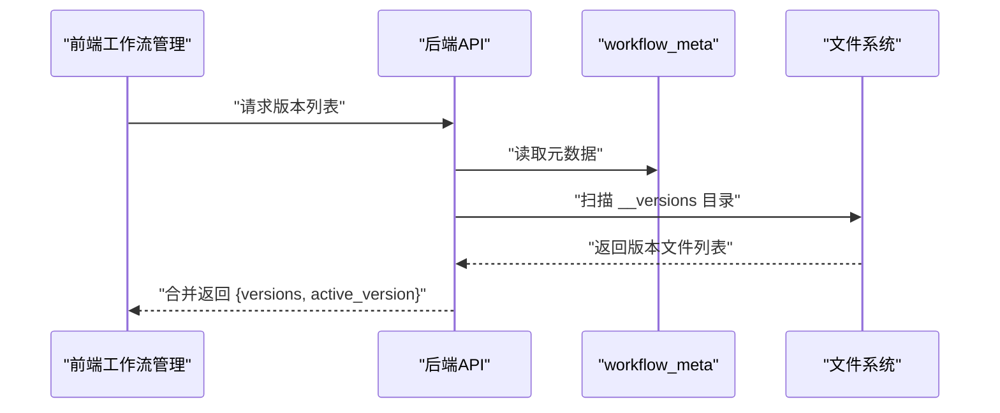

图表来源
- [app.py](file://app.py)

章节来源
- [app.py](file://app.py)

### 生成历史数据管理
- 记录结构
  - 由前端生成页面构造历史记录对象，包含 id、workflow、prompt、尺寸、seed、耗时、时间戳、用户、公开/隐藏标记、批处理信息、保护状态与分数等。
- 状态跟踪
  - generations 表记录完成时间、状态、媒体类型、结果路径等。
  - protection_* 字段用于内容安全评分与标注。
- 结果存储
  - image_path/thumb_path 指向文件系统中的实际文件；媒体类型由输出扩展名与键位判定。
- 公开/隐藏与软删除
  - is_public 控制是否对外可见；is_hidden/hide_by/hide_at 支持管理员/拥有者隐藏；deleted_at/deleted_by 支持软删除。

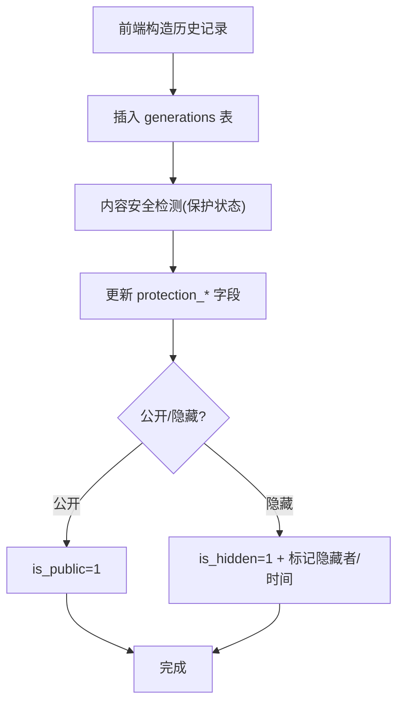

图表来源
- [history.js](file://static/js/modules/history.js)
- [app.py](file://app.py)

章节来源
- [history.js](file://static/js/modules/history.js)
- [app.py](file://app.py)

### 文件系统架构
- 目录组织
  - data/workflows：工作流 JSON 文件。
  - data/wf_configs：工作流配置 JSON（含节点可见性、排序等）。
  - data/thumbs/wf：工作流缩略图。
  - data/outputs：生成输出（图片/视频），按用户与日期归档。
  - data/input：输入素材。
  - data/uploads：上传文件（含 legacy 子目录）。
  - data/history：历史 JSON（V3 回退）。
  - data/jobs.json：任务队列。
  - data/system_settings.json：系统设置。
- 媒体输出识别
  - 按扩展名区分图片与视频；优先选择视频输出而非预览帧。
- 路径整理与对账
  - organize_image_paths.py：根据 generations 表构建引用上下文，将输出/输入文件迁移到规范路径。
  - reconcile_media_paths.py：对比数据库与文件系统，修复缺失/非规范引用，备份关键文件。
  - cleanup_duplicate_media.py：去重与清理策略，保留引用文件与特定规则文件。

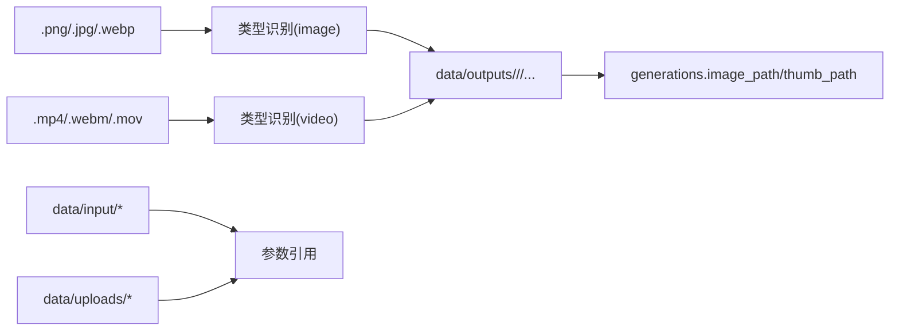

图表来源
- [media_outputs.py](file://modules/media_outputs.py)
- [organize_image_paths.py](file://scripts/organize_image_paths.py)
- [reconcile_media_paths.py](file://scripts/reconcile_media_paths.py)
- [cleanup_duplicate_media.py](file://scripts/cleanup_duplicate_media.py)

章节来源
- [media_outputs.py](file://modules/media_outputs.py)
- [organize_image_paths.py](file://scripts/organize_image_paths.py)
- [reconcile_media_paths.py](file://scripts/reconcile_media_paths.py)
- [cleanup_duplicate_media.py](file://scripts/cleanup_duplicate_media.py)
- [test_media_outputs.py](file://tests/test_media_outputs.py)

### 数据备份与恢复
- 备份策略
  - 数据库：generation.db 与 auth.db。
  - 文件：关键 JSON（history.json、jobs.json、system_settings.json）与媒体输出根目录。
  - 增量：reconcile_media_paths.py 支持备份现有数据库与历史 JSON，便于回滚。
- 恢复流程
  - 恢复数据库与文件至相同位置。
  - 如需回退历史，可使用 data/migration_backups 中的历史 JSON。
  - 重新运行迁移脚本（如 import_v3_history.py）以确保数据一致性。

章节来源
- [reconcile_media_paths.py](file://scripts/reconcile_media_paths.py)
- [import_v3_history.py](file://scripts/import_v3_history.py)

### 数据迁移与版本升级
- 从 V3 到 V4
  - 使用 import_v3_history.py 将 data/history/history.json 导入 generation.db。
  - 迁移后关闭同步模式，提升导入性能。
- 元数据迁移
  - 将 data/wf_meta.json 迁移到 workflow_meta 表，同时回写 JSON 保持兼容。
- 版本发现与补齐
  - 动态扫描 __versions 子目录，补齐版本清单并更新元数据表。
- 向后兼容
  - 旧 JSON 回退：当数据库不可用时，回退到 JSON 文件读取。
  - 列扩展：通过 ALTER TABLE 逐步添加新列，避免破坏现有部署。

章节来源
- [app.py](file://app.py)
- [import_v3_history.py](file://scripts/import_v3_history.py)

### 数据安全与隐私保护
- 敏感数据处理
  - 用户密码采用哈希存储；前端不传输明文密码。
  - 历史记录包含 prompt_preview，应遵循最小暴露原则。
- 访问控制
  - 用户只能查看自己的历史；管理员可查看全部。
  - 日志可见性按 job_id 与用户绑定，防止越权。
- 审计与可见性
  - 隐藏/删除操作记录 hidden_by/hidden_at、deleted_by/deleted_at。
  - 管理员可查看系统日志与通知状态。

章节来源
- [app.py](file://app.py)
- [test_logs_api.py](file://tests/test_logs_api.py)

## 依赖分析
- 组件耦合
  - app.py 是数据层与业务逻辑的核心，依赖 SQLite 与文件系统。
  - 前端模块（auth.js、history.js）通过 API 与后端交互。
  - 迁移与治理脚本（organize/reconcile/cleanup）依赖 generation.db 与文件系统。
- 外部依赖
  - Python 标准库（sqlite3、json、os、pathlib、argparse 等）。
  - Node.js（测试环境中的前端模块测试）。

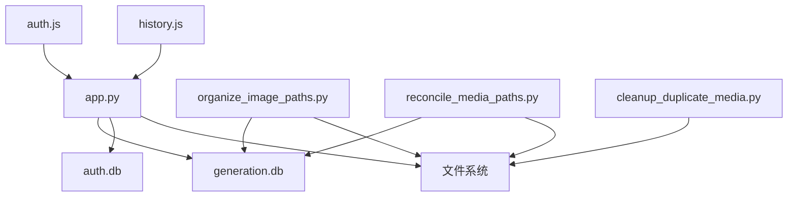

图表来源
- [app.py](file://app.py)
- [organize_image_paths.py](file://scripts/organize_image_paths.py)
- [reconcile_media_paths.py](file://scripts/reconcile_media_paths.py)
- [cleanup_duplicate_media.py](file://scripts/cleanup_duplicate_media.py)
- [auth.js](file://static/js/modules/auth.js)
- [history.js](file://static/js/modules/history.js)

章节来源
- [app.py](file://app.py)

## 性能考虑
- 查询优化
  - 为高频查询字段建立索引：user_id、workflow、created_at、is_public、is_hidden、batch_id。
  - 分页与窗口化加载：历史 UI 支持懒加载与详情缓存，减少一次性载荷。
- 索引策略
  - 复合索引：如 (user_id, created_at)、(is_public, created_at)。
  - 覆盖索引：针对常用 SELECT 字段组合，减少回表。
- 缓存配置
  - 历史详情缓存：限制缓存大小，避免内存膨胀。
  - 前端模块缓存：静态资源版本号控制，避免缓存污染。
- I/O 优化
  - 迁移阶段关闭 WAL/synchronous 以提升导入速度；生产环境按需开启 WAL。
  - 媒体文件去重与清理，降低磁盘占用与 IO 压力。

## 故障排查指南
- 历史导入失败
  - 检查 history.json 格式与类型；确认 generation.db 表已创建。
  - 查看导入脚本输出与日志缓冲区。
- 媒体路径异常
  - 使用 reconcile_media_paths.py 对账数据库与文件系统，修复缺失与非规范引用。
  - 使用 organize_image_paths.py 重新组织输出/输入路径。
- 权限与可见性问题
  - 确认用户角色与 is_public/is_hidden 标记。
  - 检查日志可见性过滤逻辑，确保按 job_id 与用户正确匹配。
- 内容安全检测异常
  - 检查 protection_* 字段更新情况与错误日志。
  - 重试保护检测流程并记录异常。

章节来源
- [import_v3_history.py](file://scripts/import_v3_history.py)
- [reconcile_media_paths.py](file://scripts/reconcile_media_paths.py)
- [organize_image_paths.py](file://scripts/organize_image_paths.py)
- [test_logs_api.py](file://tests/test_logs_api.py)
- [app.py](file://app.py)

## 结论
Ez ComfyUI Showcase 的数据管理以 SQLite 为核心，结合文件系统实现工作流元数据、生成历史与媒体输出的统一管理。通过完善的迁移脚本、路径整理与对账工具，保障了从 V3 到 V4 的平滑过渡与长期可维护性。配合前端权限与日志可见性控制，实现了安全可控的数据访问。建议持续完善索引与缓存策略，强化备份与监控，确保系统在高并发与大规模数据下的稳定性与性能。

## 附录
- 关键文件与用途
  - data/wf_configs/*.json：工作流配置（节点可见性、排序、默认值等）。
  - data/wf_meta.json：工作流元数据（迁移后写入 workflow_meta 表）。
  - data/history/history.json：历史生成记录（V3 回退）。
  - data/system_settings.json：系统级设置。
  - data/jobs.json：任务队列状态。
- 示例参考
  - 工作流配置示例：I2V_10eros_v3_TiledSampler.json（节点键位、隐藏区域、排序等）。

章节来源
- [I2V_10eros_v3_TiledSampler.json](file://data/wf_configs/I2V_10eros_v3_TiledSampler.json)