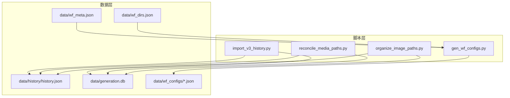
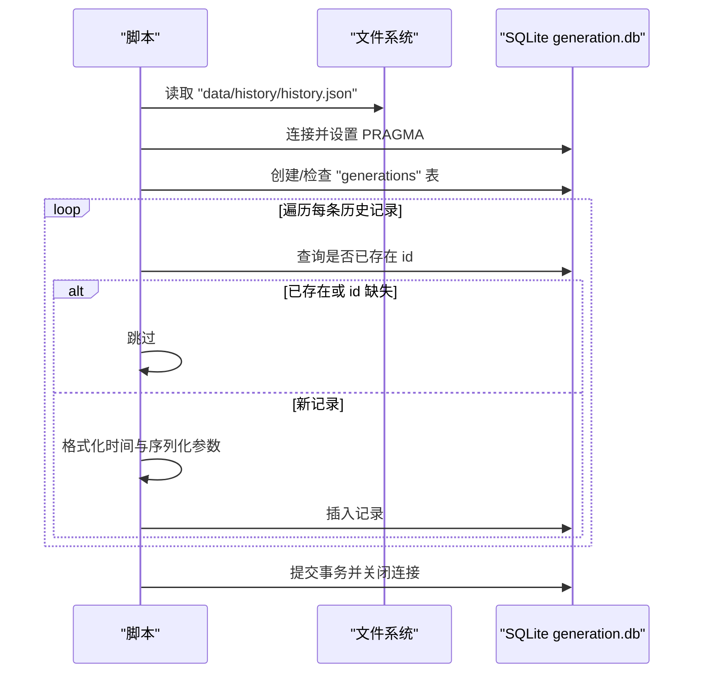
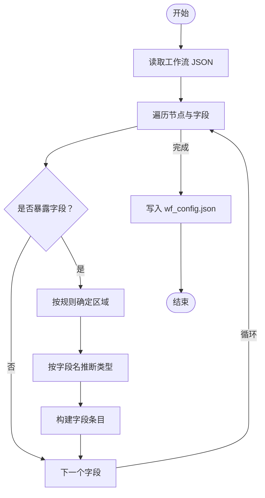
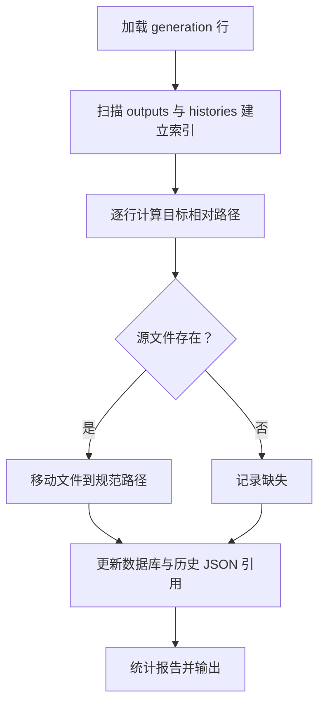
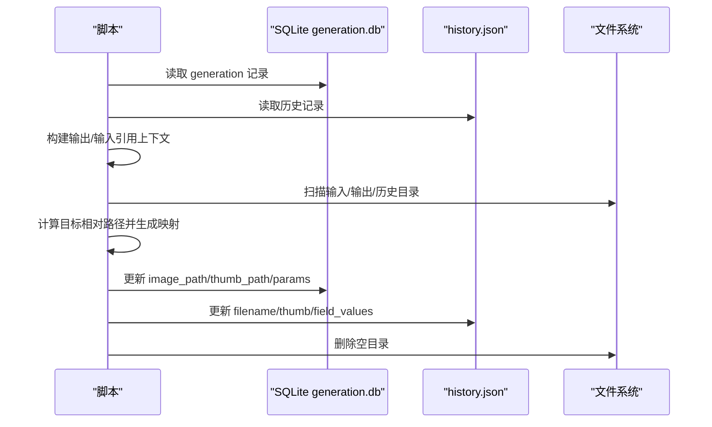
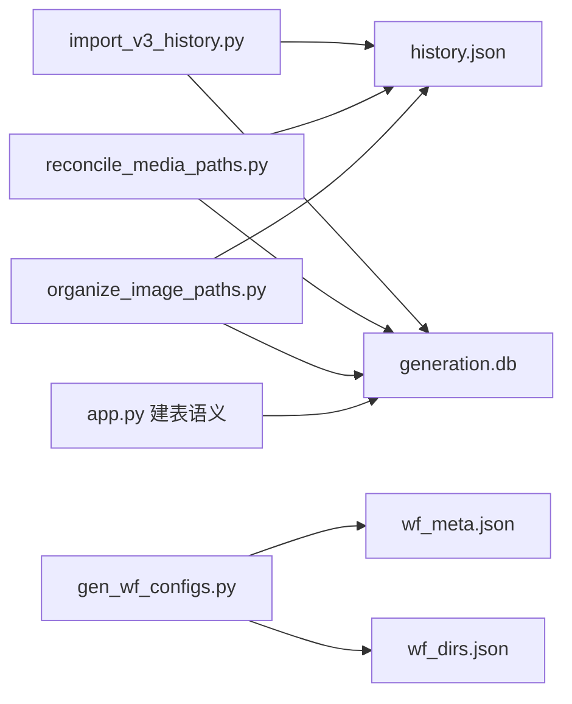

# 数据迁移

<cite>
**本文引用的文件**
- [scripts/import_v3_history.py](file://scripts/import_v3_history.py)
- [scripts/gen_wf_configs.py](file://scripts/gen_wf_configs.py)
- [scripts/reconcile_media_paths.py](file://scripts/reconcile_media_paths.py)
- [scripts/organize_image_paths.py](file://scripts/organize_image_paths.py)
- [data/history/history.json](file://data/history/history.json)
- [data/wf_meta.json](file://data/wf_meta.json)
- [data/wf_dirs.json](file://data/wf_dirs.json)
- [data/generation.db](file://data/generation.db)
- [app.py](file://app.py)
</cite>

## 目录
1. [简介](#简介)
2. [项目结构](#项目结构)
3. [核心组件](#核心组件)
4. [架构总览](#架构总览)
5. [详细组件分析](#详细组件分析)
6. [依赖分析](#依赖分析)
7. [性能考虑](#性能考虑)
8. [故障排查指南](#故障排查指南)
9. [结论](#结论)
10. [附录](#附录)

## 简介
本文件面向 Ez ComfyUI Showcase 的版本升级与数据迁移场景，系统化梳理从旧版本到新版本的数据迁移策略与实现细节，覆盖以下方面：
- 历史数据迁移：从旧版 history.json 迁移到新版 SQLite generation 表
- 工作流配置迁移：基于工作流节点自动生成可编辑的 wf_configs
- 媒体文件路径整理：统一输出与输入媒体文件的存储路径，修复非规范引用
- 迁移准备与验证：备份、环境检查、依赖验证、完整性校验与进度跟踪
- 回滚与应急：失败处理、数据恢复、用户影响最小化

## 项目结构
本次迁移涉及的关键目录与文件：
- scripts/：迁移脚本集合
  - import_v3_history.py：历史记录导入
  - gen_wf_configs.py：工作流配置生成
  - reconcile_media_paths.py：媒体路径统一与修复
  - organize_image_paths.py：媒体路径组织与引用更新
- data/：数据与配置
  - history/history.json：旧版历史记录
  - generation.db：SQLite 生成记录库
  - wf_meta.json：工作流元数据
  - wf_dirs.json：工作流目录列表
  - wf_configs/：生成的工作流配置
- app.py：应用中定义的 generation 表结构（用于对照）



图表来源
- [scripts/import_v3_history.py:1-104](file://scripts/import_v3_history.py#L1-L104)
- [scripts/gen_wf_configs.py:1-175](file://scripts/gen_wf_configs.py#L1-L175)
- [scripts/reconcile_media_paths.py:1-264](file://scripts/reconcile_media_paths.py#L1-L264)
- [scripts/organize_image_paths.py:1-319](file://scripts/organize_image_paths.py#L1-L319)
- [data/history/history.json:1-200](file://data/history/history.json#L1-L200)
- [data/wf_meta.json:1-537](file://data/wf_meta.json#L1-L537)
- [data/wf_dirs.json:1-4](file://data/wf_dirs.json#L1-L4)
- [data/generation.db](file://data/generation.db)

章节来源
- [scripts/import_v3_history.py:1-104](file://scripts/import_v3_history.py#L1-L104)
- [scripts/gen_wf_configs.py:1-175](file://scripts/gen_wf_configs.py#L1-L175)
- [scripts/reconcile_media_paths.py:1-264](file://scripts/reconcile_media_paths.py#L1-L264)
- [scripts/organize_image_paths.py:1-319](file://scripts/organize_image_paths.py#L1-L319)
- [data/history/history.json:1-200](file://data/history/history.json#L1-L200)
- [data/wf_meta.json:1-537](file://data/wf_meta.json#L1-L537)
- [data/wf_dirs.json:1-4](file://data/wf_dirs.json#L1-L4)
- [data/generation.db](file://data/generation.db)

## 核心组件
- 历史数据导入器：将旧版 history.json 中的历史记录导入到 generation 表，去重、兼容时间格式、持久化参数
- 工作流配置生成器：解析工作流节点，按规则生成可编辑字段配置，支持模板适配与参数映射
- 媒体路径统一器：将输出与输入媒体文件迁移到规范化的 {user}/{date}/{file} 结构，并修复数据库与历史 JSON 中的引用
- 媒体路径组织器：在不移动文件的前提下，计算目标相对路径并更新引用，减少磁盘 IO 并保持一致性

章节来源
- [scripts/import_v3_history.py:1-104](file://scripts/import_v3_history.py#L1-L104)
- [scripts/gen_wf_configs.py:1-175](file://scripts/gen_wf_configs.py#L1-L175)
- [scripts/reconcile_media_paths.py:1-264](file://scripts/reconcile_media_paths.py#L1-L264)
- [scripts/organize_image_paths.py:1-319](file://scripts/organize_image_paths.py#L1-L319)

## 架构总览
下图展示迁移流程的端到端架构：从历史数据与工作流源文件出发，通过脚本层完成导入、生成与整理，最终落库并更新历史 JSON。

```mermaid
graph TB
A["旧版历史数据<br/>data/history/history.json"] --> B["导入器<br/>import_v3_history.py"]
C["工作流源文件<br/>data/workflows/*.json"] --> D["配置生成器<br/>gen_wf_configs.py"]
E["生成记录库<br/>data/generation.db"] <- --> B
F["媒体文件<br/>data/outputs & data/input"] --> G["媒体路径统一器<br/>reconcile_media_paths.py"]
F --> H["媒体路径组织器<br/>organize_image_paths.py"]
G --> E
H --> E
B --> I["历史 JSON 更新<br/>data/history/history.json"]
G --> I
H --> I
D --> J["工作流配置<br/>data/wf_configs/*.json"]
```

图表来源
- [scripts/import_v3_history.py:1-104](file://scripts/import_v3_history.py#L1-L104)
- [scripts/gen_wf_configs.py:1-175](file://scripts/gen_wf_configs.py#L1-L175)
- [scripts/reconcile_media_paths.py:1-264](file://scripts/reconcile_media_paths.py#L1-L264)
- [scripts/organize_image_paths.py:1-319](file://scripts/organize_image_paths.py#L1-L319)
- [data/history/history.json:1-200](file://data/history/history.json#L1-L200)
- [data/generation.db](file://data/generation.db)

## 详细组件分析

### 历史数据迁移：import_v3_history.py
该脚本负责将旧版 history.json 的记录导入到 generation 表，实现要点：
- 读取历史 JSON，校验类型为数组
- 建表：若不存在则创建 generation 表（含主键 id、workflow、image_path、thumb_path、params 等字段）
- 去重：按 id 查询是否存在，存在则跳过
- 时间格式兼容：将 ISO 时间中的 “T” 替换为空格并截断到秒级
- 参数持久化：将 field_values 序列化为 JSON 字符串存入 params
- 性能优化：开启 WAL 模式与关闭同步以提升批量插入性能



图表来源
- [scripts/import_v3_history.py:1-104](file://scripts/import_v3_history.py#L1-L104)
- [data/history/history.json:1-200](file://data/history/history.json#L1-L200)
- [data/generation.db](file://data/generation.db)

章节来源
- [scripts/import_v3_history.py:1-104](file://scripts/import_v3_history.py#L1-L104)

### 工作流配置迁移：gen_wf_configs.py
该脚本根据工作流源文件生成可编辑的 wf_configs，实现要点：
- 目标清单：限定处理特定工作流文件名
- 节点字段识别：仅处理“暴露字段”（inputs 中满足特定结构的项）
- 区域规则：按节点类型与字段名映射到 user_input/advanced/output 等区域
- 类型推断：根据字段名自动推断类型（如 image/textarea/number/select/toggle）
- 输出：生成包含字段键、标签、顺序、可见性与类型的配置，并写入 data/wf_configs/



图表来源
- [scripts/gen_wf_configs.py:1-175](file://scripts/gen_wf_configs.py#L1-L175)
- [data/wf_meta.json:1-537](file://data/wf_meta.json#L1-L537)
- [data/wf_dirs.json:1-4](file://data/wf_dirs.json#L1-L4)

章节来源
- [scripts/gen_wf_configs.py:1-175](file://scripts/gen_wf_configs.py#L1-L175)
- [data/wf_meta.json:1-537](file://data/wf_meta.json#L1-L537)
- [data/wf_dirs.json:1-4](file://data/wf_dirs.json#L1-L4)

### 媒体文件路径整理：reconcile_media_paths.py
该脚本将数据库与历史 JSON 中的媒体引用统一到规范路径，并尝试移动文件：
- 规范化路径：将相对路径标准化为 {user}/{date}/{file} 形式
- 文件索引：扫描 outputs 与 histories 目录，建立文件名索引
- 源选择：优先使用规范路径，其次在历史与上传目录查找匹配文件
- 引用修复：更新 generation 表与 history.json 中的 image_path、thumb_path 与 params 中的图像字段
- 备份与应用：支持 dry-run 与 apply 模式，自动备份 generation.db 与 history.json



图表来源
- [scripts/reconcile_media_paths.py:1-264](file://scripts/reconcile_media_paths.py#L1-L264)
- [data/generation.db](file://data/generation.db)
- [data/history/history.json:1-200](file://data/history/history.json#L1-L200)

章节来源
- [scripts/reconcile_media_paths.py:1-264](file://scripts/reconcile_media_paths.py#L1-L264)

### 媒体文件路径组织：organize_image_paths.py
该脚本在不移动文件的前提下，计算目标相对路径并更新引用，降低磁盘 IO：
- 上下文构建：从 generation 与 history 中提取用户与日期上下文
- 目标路径：对每个媒体文件计算 {user}/{date}/{file} 的目标相对路径
- 映射与更新：生成旧/新路径映射，更新 generation 表与 history.json 中的引用
- 清理空目录：删除迁移后产生的空目录



图表来源
- [scripts/organize_image_paths.py:1-319](file://scripts/organize_image_paths.py#L1-L319)
- [data/generation.db](file://data/generation.db)
- [data/history/history.json:1-200](file://data/history/history.json#L1-L200)

章节来源
- [scripts/organize_image_paths.py:1-319](file://scripts/organize_image_paths.py#L1-L319)

## 依赖分析
- 脚本间依赖：各脚本独立运行，无直接相互调用；均依赖 data/ 下的输入与输出目录、generation.db 与 history.json
- 数据库结构：generation 表由脚本创建，字段与 app.py 中的建表语义一致，确保迁移前后结构兼容
- 配置来源：gen_wf_configs.py 依赖 wf_meta.json 与 wf_dirs.json 提供工作流元信息与目录列表
- 历史数据：import_v3_history.py 与 reconcile_media_paths.py/organize_image_paths.py 均依赖 history.json 与 generation.db



图表来源
- [scripts/import_v3_history.py:1-104](file://scripts/import_v3_history.py#L1-L104)
- [scripts/gen_wf_configs.py:1-175](file://scripts/gen_wf_configs.py#L1-L175)
- [scripts/reconcile_media_paths.py:1-264](file://scripts/reconcile_media_paths.py#L1-L264)
- [scripts/organize_image_paths.py:1-319](file://scripts/organize_image_paths.py#L1-L319)
- [data/history/history.json:1-200](file://data/history/history.json#L1-L200)
- [data/wf_meta.json:1-537](file://data/wf_meta.json#L1-L537)
- [data/wf_dirs.json:1-4](file://data/wf_dirs.json#L1-L4)
- [data/generation.db](file://data/generation.db)
- [app.py](file://app.py)

章节来源
- [scripts/import_v3_history.py:1-104](file://scripts/import_v3_history.py#L1-L104)
- [scripts/gen_wf_configs.py:1-175](file://scripts/gen_wf_configs.py#L1-L175)
- [scripts/reconcile_media_paths.py:1-264](file://scripts/reconcile_media_paths.py#L1-L264)
- [scripts/organize_image_paths.py:1-319](file://scripts/organize_image_paths.py#L1-L319)
- [data/history/history.json:1-200](file://data/history/history.json#L1-L200)
- [data/wf_meta.json:1-537](file://data/wf_meta.json#L1-L537)
- [data/wf_dirs.json:1-4](file://data/wf_dirs.json#L1-L4)
- [data/generation.db](file://data/generation.db)
- [app.py](file://app.py)

## 性能考虑
- 批量插入优化：导入脚本启用 WAL 模式与关闭同步，显著提升批量写入性能
- 索引与扫描：路径整理脚本通过文件名索引快速定位候选源文件，减少跨目录扫描成本
- 并发与磁盘 IO：组织器在不移动文件的情况下完成路径计算与引用更新，避免大规模文件移动
- 内存占用：脚本采用流式读取与增量更新策略，避免一次性加载全部数据

## 故障排查指南
- 历史导入失败
  - 症状：脚本报错或未插入任何记录
  - 排查：确认 history.json 是否为数组格式；检查 generation.db 是否可写；查看是否存在重复 id 导致跳过
  - 参考
    - [scripts/import_v3_history.py:13-16](file://scripts/import_v3_history.py#L13-L16)
    - [scripts/import_v3_history.py:51-62](file://scripts/import_v3_history.py#L51-L62)
- 媒体路径修复异常
  - 症状：部分记录显示“缺失输出/输入”
  - 排查：确认 outputs/input 目录中是否存在同名文件；检查历史与上传目录；确认规范路径是否正确
  - 参考
    - [scripts/reconcile_media_paths.py:157-159](file://scripts/reconcile_media_paths.py#L157-L159)
    - [scripts/reconcile_media_paths.py:178-179](file://scripts/reconcile_media_paths.py#L178-L179)
- 历史 JSON 不一致
  - 症状：history.json 与 generation.db 中的引用不一致
  - 排查：执行 reconcile_media_paths.py 或 organize_image_paths.py 的 --apply 模式进行修复
  - 参考
    - [scripts/reconcile_media_paths.py:198-232](file://scripts/reconcile_media_paths.py#L198-L232)
    - [scripts/organize_image_paths.py:232-256](file://scripts/organize_image_paths.py#L232-L256)
- 配置生成失败
  - 症状：目标工作流文件不存在或未生成配置
  - 排查：确认 data/workflows 中目标文件存在；检查 TARGETS 列表与文件名匹配
  - 参考
    - [scripts/gen_wf_configs.py:63-65](file://scripts/gen_wf_configs.py#L63-L65)
    - [scripts/gen_wf_configs.py:155-166](file://scripts/gen_wf_configs.py#L155-L166)

章节来源
- [scripts/import_v3_history.py:1-104](file://scripts/import_v3_history.py#L1-L104)
- [scripts/reconcile_media_paths.py:1-264](file://scripts/reconcile_media_paths.py#L1-L264)
- [scripts/organize_image_paths.py:1-319](file://scripts/organize_image_paths.py#L1-L319)
- [scripts/gen_wf_configs.py:1-175](file://scripts/gen_wf_configs.py#L1-L175)

## 结论
通过上述四个脚本的协同工作，Ez ComfyUI Showcase 实现了从历史数据、工作流配置到媒体文件路径的全链路迁移与整理。脚本具备完善的备份、干跑与应用模式，能够有效降低迁移风险并保证数据一致性。建议在生产环境中先进行干跑验证，再按阶段执行应用模式，并在迁移后进行全面的功能与性能验证。

## 附录

### 迁移前准备清单
- 备份
  - 备份 generation.db 与 history.json 至 data/migration_backups
  - 参考
    - [scripts/reconcile_media_paths.py:80-89](file://scripts/reconcile_media_paths.py#L80-L89)
    - [scripts/organize_image_paths.py:85-94](file://scripts/organize_image_paths.py#L85-L94)
- 环境检查
  - 确认 Python 版本与依赖可用
  - 确认 data/ 目录权限可读写
- 依赖验证
  - 确认 SQLite 可用
  - 确认 JSON 文件格式合法

### 迁移过程监控与验证
- 进度跟踪
  - 各脚本打印统计信息（插入数、跳过数、移动数、变更数等）
- 完整性检查
  - 对比 generation 表与 history.json 的引用一致性
  - 校验 wf_configs 生成数量与目标工作流数量一致
- 错误处理
  - 使用 dry-run 模式先行验证
  - 出错时回滚至最近备份

### 迁移后验证与测试
- 功能验证
  - 校验历史记录在前端可正常展示与检索
  - 校验工作流配置在 UI 中可编辑
- 性能测试
  - 执行批量生成任务，观察响应时间与资源占用
- 用户验收
  - 邀请关键用户进行端到端试用

### 回滚策略与应急处理
- 回滚步骤
  - 将 migration_backups 中的 generation.db 与 history.json 恢复到原位置
  - 如需，重新执行导入与整理脚本的 dry-run 以确认一致性
- 应急处理
  - 若出现严重数据损坏，立即停止服务并启用冷备
  - 通知用户并提供降级方案（如只读模式）