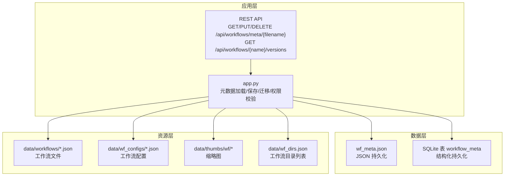
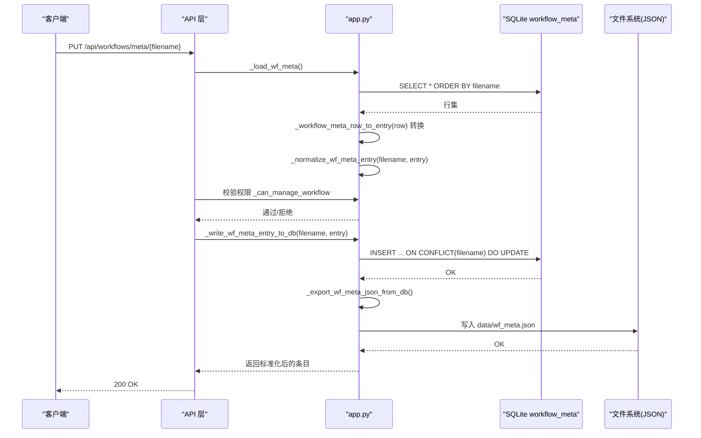
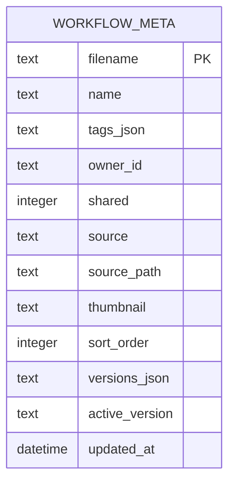
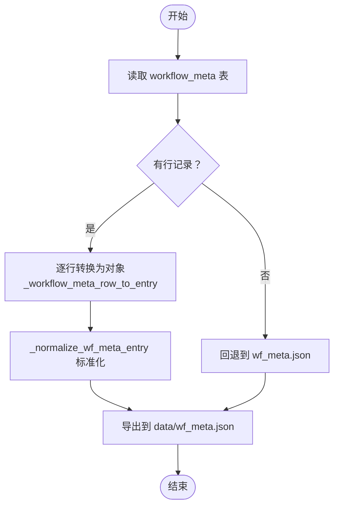
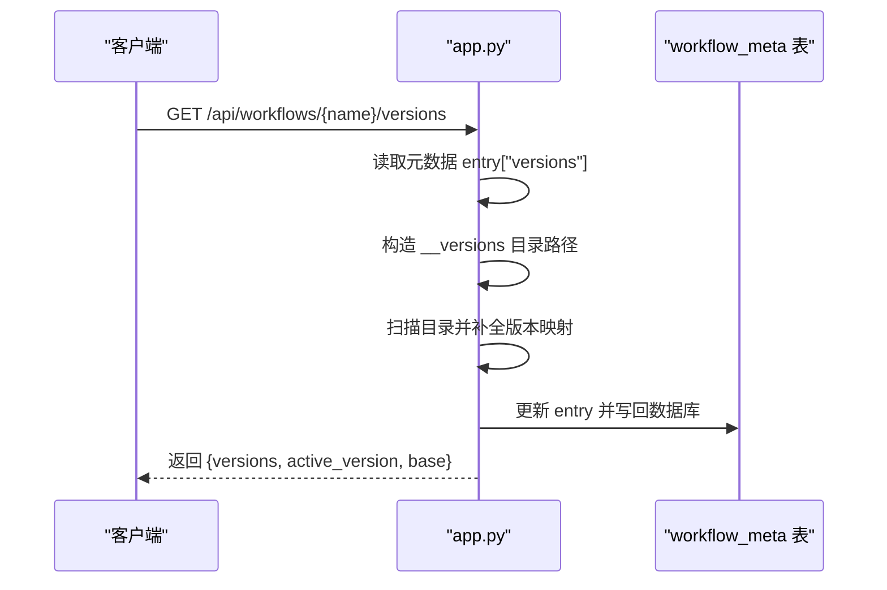
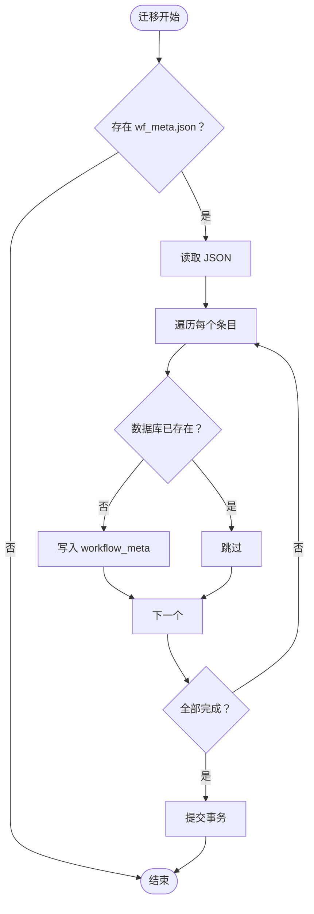
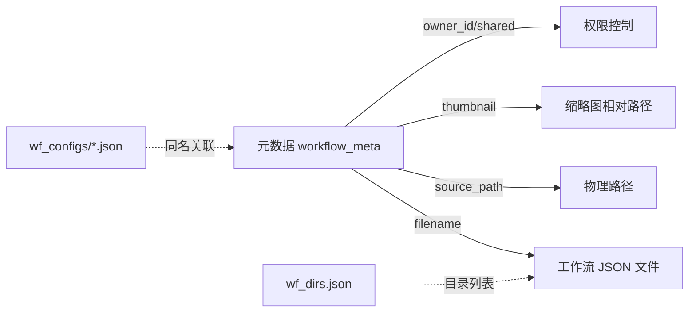
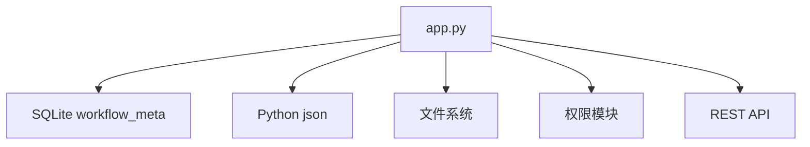

# 元数据管理

<cite>
**本文引用的文件**
- [wf_meta.json](file://data/wf_meta.json)
- [app.py](file://app.py)
- [test_workflow_meta_api.py](file://tests/test_workflow_meta_api.py)
</cite>

## 目录
1. [简介](#简介)
2. [项目结构](#项目结构)
3. [核心组件](#核心组件)
4. [架构总览](#架构总览)
5. [详细组件分析](#详细组件分析)
6. [依赖关系分析](#依赖关系分析)
7. [性能考量](#性能考量)
8. [故障排查指南](#故障排查指南)
9. [结论](#结论)
10. [附录](#附录)

## 简介
本文件面向 Ez ComfyUI Showcase 的元数据管理系统，聚焦工作流元数据（wf_meta.json）的数据模型、存储与序列化、查询与检索、版本控制与变更追踪，以及与工作流配置、文件系统、用户权限的集成方式，并提供性能优化建议。系统采用“JSON 文件 + SQLite 数据库”的双轨持久化策略：在应用启动时将旧版 JSON 元数据迁移至数据库表 workflow_meta，运行期优先读写数据库，同时保持 JSON 文件作为可读写备份与导出目标。

## 项目结构
- 元数据文件位置：data/wf_meta.json
- 应用入口与业务逻辑：app.py
- 单元测试：tests/test_workflow_meta_api.py
- 关键目录与文件：
  - data/workflows：工作流 JSON 文件存放目录
  - data/wf_configs：工作流配置 JSON 文件存放目录
  - data/thumbs/wf：缩略图目录
  - data/wf_dirs.json：工作流目录列表

图表来源
- [app.py:1690-1720](file://app.py#L1690-L1720)
- [app.py:7007-7063](file://app.py#L7007-L7063)
- [app.py:7195-7229](file://app.py#L7195-L7229)
- [app.py:9243-9262](file://app.py#L9243-L9262)

章节来源
- [app.py:1690-1720](file://app.py#L1690-L1720)
- [app.py:7007-7063](file://app.py#L7007-L7063)
- [app.py:7195-7229](file://app.py#L7195-L7229)
- [app.py:9243-9262](file://app.py#L9243-L9262)

## 核心组件
- 元数据模型与 JSON 结构
  - 键：工作流 JSON 文件名（如 "i2i-Qwen-Rapid.json"）
  - 值：对象，包含 name、tags、owner_id、shared、source、source_path、thumbnail、sort_order、versions、active_version 等字段
- 存储与序列化
  - 运行期：SQLite 表 workflow_meta；字段以 JSON 文本形式存储数组与字典（tags_json、versions_json）
  - 备份：data/wf_meta.json 作为 JSON 文件备份与导出
- 查询与检索
  - 读取：按 filename 排序从 workflow_meta 表读取并转换为对象
  - 写入：INSERT ... ON CONFLICT(filename) DO UPDATE，批量写入后导出到 JSON
- 权限与可见性
  - 可见性：未登录或非管理员仅能访问 shared=true 的条目
  - 管理权限：仅 owner 或管理员可修改
- 版本管理
  - active_version 记录当前激活版本
  - /api/workflows/{name}/versions 动态扫描 __versions 目录并补充版本清单

章节来源
- [wf_meta.json:1-537](file://data/wf_meta.json#L1-L537)
- [app.py:1593-1616](file://app.py#L1593-L1616)
- [app.py:2691-2731](file://app.py#L2691-L2731)
- [app.py:7009-7043](file://app.py#L7009-L7043)
- [app.py:7195-7229](file://app.py#L7195-L7229)
- [app.py:9243-9262](file://app.py#L9243-L9262)

## 架构总览
系统通过 app.py 实现“数据库优先 + JSON 备份”的双轨持久化。初始化时自动迁移 JSON 到数据库；运行中优先读写数据库；必要时导出为 JSON 文件，确保兼容与可读性。

图表来源
- [app.py:7195-7217](file://app.py#L7195-L7217)
- [app.py:2691-2731](file://app.py#L2691-L2731)
- [app.py:2798-2801](file://app.py#L2798-L2801)
- [app.py:7009-7043](file://app.py#L7009-L7043)

## 详细组件分析

### 数据模型与字段定义
- 主键：filename（工作流 JSON 文件名）
- 必填字段
  - name：显示名称，默认使用文件名去扩展名
  - tags：标签数组，默认空数组
  - owner_id：所有者 ID，默认引导管理员 ID
  - shared：布尔值，是否公开共享
- 可选字段
  - source：来源分组（如 "DGX Spark"、"ez-comfy"）
  - source_path：物理路径
  - thumbnail：缩略图相对路径
  - sort_order：排序序号
  - active_version：当前激活版本标识
  - versions：版本映射（版本名 -> 路径）

图表来源
- [app.py:1690-1705](file://app.py#L1690-L1705)

章节来源
- [app.py:1593-1616](file://app.py#L1593-L1616)
- [app.py:2681-2688](file://app.py#L2681-L2688)
- [app.py:1690-1705](file://app.py#L1690-L1705)

### 存储格式与序列化机制
- JSON 结构设计
  - 顶层为对象，键为工作流文件名，值为元数据对象
  - 嵌套对象与数组以 JSON 字符串形式存储于数据库列（tags_json、versions_json）
- 特殊字符与编码
  - JSON 写入时使用 ensure_ascii=False，支持中文等 Unicode 字符
- 序列化工具
  - _json_dumps_compact：紧凑 JSON 序列化
  - _json_loads_safe：安全反序列化，带默认值兜底

图表来源
- [app.py:7009-7043](file://app.py#L7009-L7043)
- [app.py:1380-1386](file://app.py#L1380-L1386)
- [app.py:2798-2801](file://app.py#L2798-L2801)

章节来源
- [app.py:7009-7043](file://app.py#L7009-L7043)
- [app.py:1380-1386](file://app.py#L1380-L1386)
- [app.py:2798-2801](file://app.py#L2798-L2801)

### 查询与检索机制
- 基础查询
  - 全量读取：按 filename 排序返回完整元数据字典
  - 单条更新：PUT /api/workflows/meta/{filename}
  - 删除：DELETE /api/workflows/meta/{filename}
- 权限控制
  - 查看：未登录或非管理员仅能查看 shared=true 的条目
  - 管理：仅 owner 或管理员可修改
- 版本查询
  - GET /api/workflows/{name}/versions：列出版本映射与当前激活版本，动态扫描 __versions 目录补全

图表来源
- [app.py:9243-9262](file://app.py#L9243-L9262)

章节来源
- [app.py:7195-7229](file://app.py#L7195-L7229)
- [app.py:2804-2827](file://app.py#L2804-L2827)
- [app.py:9243-9262](file://app.py#L9243-L9262)

### 版本控制与变更追踪
- 版本管理
  - active_version：当前激活版本标识
  - versions：版本映射（版本名 -> 路径），支持外部目录（如 __versions）挂载
- 变更追踪
  - updated_at：每条记录的最后更新时间戳
  - 迁移流程：首次启动将 wf_meta.json 迁移到 workflow_meta，避免重复导入
- 回滚与冲突
  - 回滚：通过 active_version 切换
  - 冲突：ON CONFLICT(filename) DO UPDATE，避免重复插入

图表来源
- [app.py:2733-2753](file://app.py#L2733-L2753)

章节来源
- [app.py:1690-1705](file://app.py#L1690-L1705)
- [app.py:2733-2753](file://app.py#L2733-L2753)
- [app.py:2691-2731](file://app.py#L2691-L2731)

### 与其他系统组件的集成
- 与工作流配置的关联
  - 工作流配置独立存储于 data/wf_configs，与元数据通过文件名关联
- 与文件系统的映射
  - source_path 指向物理路径；thumbnail 为相对路径，迁移时会移动缩略图并更新相对路径
  - 支持多工作流目录：data/wf_dirs.json 记录目录列表
- 与用户权限的绑定
  - owner_id 绑定所有者；shared 控制公开；管理接口校验当前用户是否为 owner 或管理员

图表来源
- [app.py:1690-1705](file://app.py#L1690-L1705)
- [app.py:2756-2787](file://app.py#L2756-L2787)
- [app.py:7046-7062](file://app.py#L7046-L7062)

章节来源
- [app.py:2756-2787](file://app.py#L2756-L2787)
- [app.py:7046-7062](file://app.py#L7046-L7062)
- [app.py:2804-2827](file://app.py#L2804-L2827)

## 依赖关系分析
- 组件耦合
  - app.py 对 SQLite、JSON、文件系统、权限模块存在直接依赖
  - 元数据 API 与权限校验紧密耦合
- 外部依赖
  - SQLite：本地轻量数据库
  - Python json：JSON 序列化/反序列化
  - 文件系统：缩略图与工作流文件的物理映射

图表来源
- [app.py:1690-1705](file://app.py#L1690-L1705)
- [app.py:7195-7229](file://app.py#L7195-L7229)

章节来源
- [app.py:1690-1705](file://app.py#L1690-L1705)
- [app.py:7195-7229](file://app.py#L7195-L7229)

## 性能考量
- 查询优化
  - 使用 ORDER BY filename 保证稳定顺序；如需按 sort_order 排序，可在应用层二次排序
  - 读取全表后在内存中构建字典，适合中小规模元数据集
- 缓存策略
  - 当前未见专用缓存层；可考虑在应用层对只读元数据进行短期缓存（如 LRU）
- 索引设计
  - filename 为主键，具备唯一性与查找效率
  - 可根据查询模式（如按 owner_id、shared、tags）评估是否增加二级索引
- 批量操作
  - 写入时先 DELETE 后批量 INSERT，减少碎片；事务内执行提升一致性
- I/O 优化
  - JSON 导出仅在元数据变更后触发，避免频繁落盘

章节来源
- [app.py:7009-7043](file://app.py#L7009-L7043)
- [app.py:2691-2731](file://app.py#L2691-L2731)

## 故障排查指南
- JSON 迁移失败
  - 现象：启动时提示迁移失败
  - 排查：检查 data/wf_meta.json 是否为合法 JSON 对象；确认数据库连接可用
- 权限错误
  - 现象：更新/删除返回 403
  - 排查：确认当前用户是否为管理员或条目 owner；shared 状态与登录状态
- 缩略图路径异常
  - 现象：缩略图无法显示或路径不正确
  - 排查：执行缩略图迁移逻辑，确保相对路径正确并已移动到目标目录
- 单元测试验证
  - 测试覆盖：排序持久化、权限拒绝、数据库连接指向、缩略图响应头禁用缓存

章节来源
- [app.py:2733-2753](file://app.py#L2733-L2753)
- [app.py:2804-2827](file://app.py#L2804-L2827)
- [app.py:2756-2787](file://app.py#L2756-L2787)
- [test_workflow_meta_api.py:48-84](file://tests/test_workflow_meta_api.py#L48-L84)

## 结论
该元数据管理系统以 SQLite 为核心持久化介质，结合 JSON 文件备份，实现了工作流元数据的结构化存储、灵活查询与版本管理。通过严格的权限控制与文件系统映射，系统在易用性与可维护性之间取得平衡。建议后续根据数据规模引入索引与缓存策略，并完善全文/模糊检索能力以满足更复杂的查询需求。

## 附录
- 关键 API
  - PUT /api/workflows/meta/{filename}：更新元数据
  - DELETE /api/workflows/meta/{filename}：删除元数据
  - GET /api/workflows/{name}/versions：查询版本列表与当前激活版本
- 关键函数
  - _load_wf_meta/_save_wf_meta：元数据加载/保存
  - _write_wf_meta_entry_to_db：单条写入（含 ON CONFLICT）
  - _migrate_wf_meta_json_to_db：JSON 迁移
  - _export_wf_meta_json_from_db：导出 JSON

章节来源
- [app.py:7195-7229](file://app.py#L7195-L7229)
- [app.py:9243-9262](file://app.py#L9243-L9262)
- [app.py:7009-7043](file://app.py#L7009-L7043)
- [app.py:2691-2731](file://app.py#L2691-L2731)
- [app.py:2733-2753](file://app.py#L2733-L2753)
- [app.py:2798-2801](file://app.py#L2798-L2801)