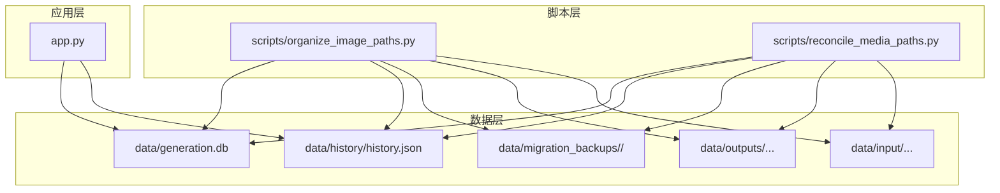
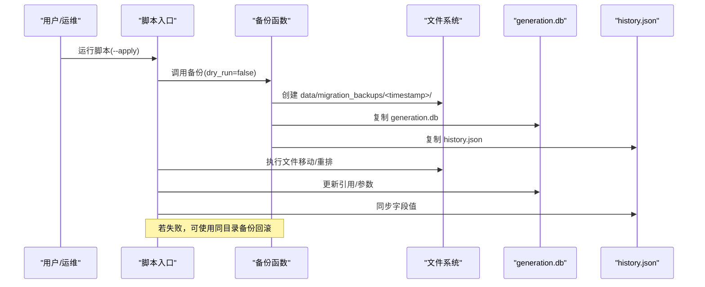
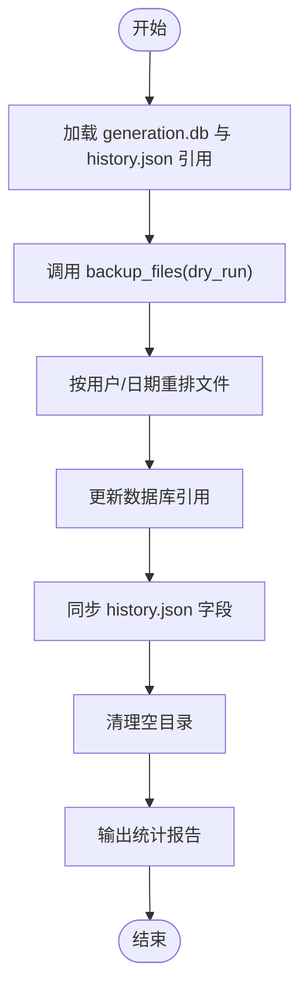
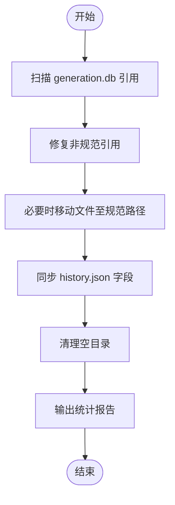
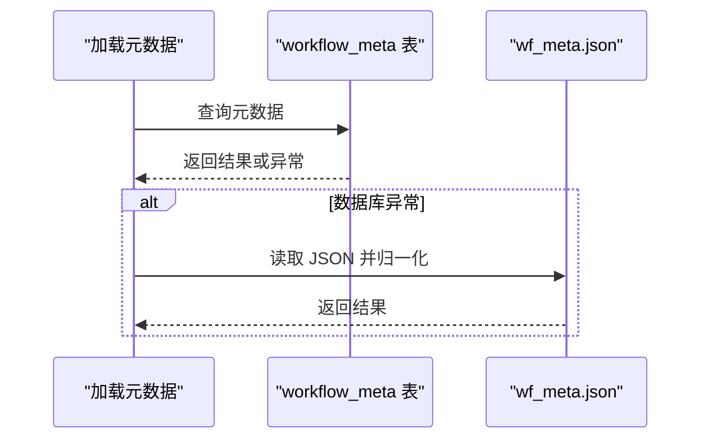
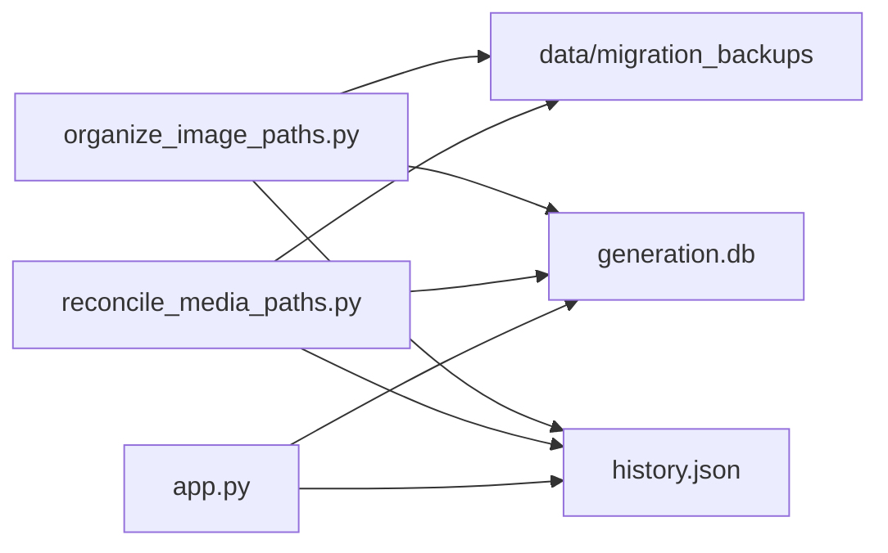

# 备份系统

<cite>
**本文引用的文件**
- [scripts/organize_image_paths.py](file://scripts/organize_image_paths.py)
- [scripts/reconcile_media_paths.py](file://scripts/reconcile_media_paths.py)
- [app.py](file://app.py)
</cite>

## 目录
1. [简介](#简介)
2. [项目结构](#项目结构)
3. [核心组件](#核心组件)
4. [架构总览](#架构总览)
5. [详细组件分析](#详细组件分析)
6. [依赖关系分析](#依赖关系分析)
7. [性能考虑](#性能考虑)
8. [故障排查指南](#故障排查指南)
9. [结论](#结论)
10. [附录](#附录)

## 简介
本文件面向 Ez ComfyUI Showcase 的备份系统，聚焦于 data/codex_backups 目录的备份架构与存储策略，结合仓库中现有的迁移与修复脚本，系统性梳理备份文件命名规则、版本控制机制、存储位置管理；解释自动化流程（定时备份、全量备份、备份触发条件）；说明完整性验证与恢复流程；并给出性能优化与监控告警建议。需要特别说明的是：当前仓库中未发现直接针对 data/codex_backups 的专用备份服务或定时任务配置；现有实现集中在“媒体路径整理”和“数据库/历史记录备份”的脚本中，备份目录实际为 data/migration_backups。本文在不臆测的前提下，基于现有代码进行严谨分析，并对 codex_backups 的预期行为提出可落地的工程化建议。

## 项目结构
围绕备份系统的关键文件与职责如下：
- scripts/organize_image_paths.py：负责将生成与输入图片迁移到规范路径，并在执行前进行数据库与历史记录的备份。
- scripts/reconcile_media_paths.py：负责将数据库与历史记录中的非规范引用统一到规范路径，并在执行前进行备份。
- app.py：应用层工作流元数据与配置的持久化逻辑，为备份恢复提供数据一致性参考。

图表来源
- [scripts/organize_image_paths.py:17-35](file://scripts/organize_image_paths.py#L17-L35)
- [scripts/reconcile_media_paths.py:25-36](file://scripts/reconcile_media_paths.py#L25-L36)
- [app.py:7009-7066](file://app.py#L7009-L7066)

章节来源
- [scripts/organize_image_paths.py:17-35](file://scripts/organize_image_paths.py#L17-L35)
- [scripts/reconcile_media_paths.py:25-36](file://scripts/reconcile_media_paths.py#L25-L36)
- [app.py:7009-7066](file://app.py#L7009-L7066)

## 核心组件
- 备份触发器与备份函数
  - 在媒体路径整理与修复脚本中，均在执行任何变更前调用 backup_files(dry_run)，以确保在“应用模式”下先写入备份。
  - 备份内容：generation.db 与 data/history/history.json。
- 备份命名与存储
  - 备份目录：data/migration_backups。
  - 备份时间戳命名：YYYYMMDD_HHMMSS。
  - 每次备份创建独立子目录，包含 generation.db 与 history.json 的副本。
- 数据一致性与恢复
  - 媒体路径整理与修复脚本在变更前备份数据库与历史文件，变更后可据此回滚或继续推进。
  - 应用层工作流元数据与配置通过数据库表与 JSON 文件共同维护，恢复时需保证两者一致。

章节来源
- [scripts/organize_image_paths.py:85-94](file://scripts/organize_image_paths.py#L85-L94)
- [scripts/reconcile_media_paths.py:80-89](file://scripts/reconcile_media_paths.py#L80-L89)
- [app.py:7032-7044](file://app.py#L7032-L7044)

## 架构总览
从“备份—变更—恢复”的视角，备份系统由三层构成：
- 触发层：脚本入口（--apply）触发备份与变更。
- 执行层：媒体路径整理/修复，更新数据库与历史文件。
- 恢复层：通过备份目录的时间戳子目录进行回滚或比对。

图表来源
- [scripts/organize_image_paths.py:273-319](file://scripts/organize_image_paths.py#L273-L319)
- [scripts/reconcile_media_paths.py:249-264](file://scripts/reconcile_media_paths.py#L249-L264)
- [scripts/organize_image_paths.py:85-94](file://scripts/organize_image_paths.py#L85-L94)
- [scripts/reconcile_media_paths.py:80-89](file://scripts/reconcile_media_paths.py#L80-L89)

## 详细组件分析

### 组件A：媒体路径整理脚本（organize_image_paths）
- 功能要点
  - 将生成与上传的图片迁移到规范路径 data/outputs/{user}/{date}/{file} 与 data/input/{user}/{date}/{file}。
  - 在执行前调用 backup_files(dry_run) 进行备份。
  - 变更后清理空目录，统计移动数量与受影响记录数。
- 备份策略
  - 全量备份：复制 generation.db 与 history.json 到 data/migration_backups/<timestamp>/。
  - 触发条件：脚本以 --apply 运行且 dry_run=false。
- 存储位置
  - 备份根目录：data/migration_backups。
  - 子目录命名：YYYYMMDD_HHMMSS。
- 完整性与恢复
  - 通过备份目录中的 generation.db 与 history.json 回滚数据库与历史文件。
  - 若移动过程中出现异常，可删除失败的子目录或保留以供人工核验。

图表来源
- [scripts/organize_image_paths.py:273-319](file://scripts/organize_image_paths.py#L273-L319)
- [scripts/organize_image_paths.py:85-94](file://scripts/organize_image_paths.py#L85-L94)

章节来源
- [scripts/organize_image_paths.py:85-94](file://scripts/organize_image_paths.py#L85-L94)
- [scripts/organize_image_paths.py:273-319](file://scripts/organize_image_paths.py#L273-L319)

### 组件B：媒体路径修复脚本（reconcile_media_paths）
- 功能要点
  - 修复数据库与历史记录中的非规范引用，确保输出/输入文件引用指向规范路径。
  - 在执行前调用 backup_files(dry_run) 进行备份。
  - 变更后同步历史记录字段，清理空目录。
- 备份策略
  - 全量备份：复制 generation.db 与 history.json 到 data/migration_backups/<timestamp>/。
  - 触发条件：脚本以 --apply 运行且 dry_run=false。
- 存储位置
  - 备份根目录：data/migration_backups。
  - 子目录命名：YYYYMMDD_HHMMSS。
- 完整性与恢复
  - 通过备份目录中的 generation.db 与 history.json 回滚数据库与历史文件。
  - 若修复过程中出现异常，可保留备份目录用于人工核验。

图表来源
- [scripts/reconcile_media_paths.py:131-196](file://scripts/reconcile_media_paths.py#L131-L196)
- [scripts/reconcile_media_paths.py:198-233](file://scripts/reconcile_media_paths.py#L198-L233)
- [scripts/reconcile_media_paths.py:80-89](file://scripts/reconcile_media_paths.py#L80-L89)

章节来源
- [scripts/reconcile_media_paths.py:80-89](file://scripts/reconcile_media_paths.py#L80-L89)
- [scripts/reconcile_media_paths.py:131-196](file://scripts/reconcile_media_paths.py#L131-L196)
- [scripts/reconcile_media_paths.py:198-233](file://scripts/reconcile_media_paths.py#L198-L233)

### 组件C：应用层工作流元数据与配置（app.py）
- 功能要点
  - 工作流元数据与配置通过数据库表与 JSON 文件共同维护。
  - 提供元数据的加载、保存与回退逻辑（当数据库异常时回退到 JSON）。
- 对备份的意义
  - 备份恢复时应同时校验数据库与 JSON 文件的一致性，避免元数据丢失或错配。
  - 恢复顺序建议：先恢复 generation.db 与 history.json，再恢复工作流元数据与配置。

图表来源
- [app.py:7009-7066](file://app.py#L7009-L7066)

章节来源
- [app.py:7009-7066](file://app.py#L7009-L7066)

## 依赖关系分析
- 组件耦合
  - organize_image_paths 与 reconcile_media_paths 共享相同的备份目录与命名策略，具备高度一致性。
  - 二者均依赖 generation.db 与 history.json 的一致性，变更前的备份是保障。
- 外部依赖
  - 文件系统：备份目录、媒体文件路径、历史记录文件。
  - 数据库：generation.db 的结构与字段，影响备份恢复后的引用修复。
- 潜在风险
  - 备份目录与 codex_backups 不一致：当前仓库中仅存在 migration_backups，若目标为 codex_backups，需在部署层进行路径映射或迁移。
  - 缺少版本控制与校验和：当前实现未包含校验和计算与一致性检查，属于设计缺口。

图表来源
- [scripts/organize_image_paths.py:17-35](file://scripts/organize_image_paths.py#L17-L35)
- [scripts/reconcile_media_paths.py:25-36](file://scripts/reconcile_media_paths.py#L25-L36)
- [app.py:7009-7066](file://app.py#L7009-L7066)

章节来源
- [scripts/organize_image_paths.py:17-35](file://scripts/organize_image_paths.py#L17-L35)
- [scripts/reconcile_media_paths.py:25-36](file://scripts/reconcile_media_paths.py#L25-L36)
- [app.py:7009-7066](file://app.py#L7009-L7066)

## 性能考虑
- 备份速度优化
  - 使用系统级复制接口（如 copy2）已具备较好的跨平台兼容性；可考虑在大文件场景下启用异步或分块复制（需评估实现复杂度与收益）。
- 存储空间压缩
  - 当前备份为全量复制，未见压缩策略；可在备份目录引入压缩归档（如 tar.gz），并配合校验和以降低存储占用。
- 网络传输优化
  - 若备份目标为远端存储，建议采用断点续传与多线程分片；当前脚本为本地操作，暂无网络传输需求。
- 并发备份处理
  - 当前脚本串行执行，未见并发备份；若未来扩展为多实例或多源备份，需引入互斥锁与队列调度，避免目录冲突。

## 故障排查指南
- 备份未生成
  - 检查是否以 --apply 运行，dry_run 为 true 时不会写入备份。
  - 检查 data/migration_backups 权限与磁盘空间。
- 备份损坏或不完整
  - 比对 generation.db 与 history.json 的存在性与大小；必要时重新执行备份。
- 恢复失败
  - 使用同目录备份覆盖当前数据库与历史文件，确认应用重启后引用修复完成。
- 数据不一致
  - 对照 app.py 中的元数据加载逻辑，确保数据库与 JSON 文件一致；若数据库异常，回退到 JSON 并修正。

章节来源
- [scripts/organize_image_paths.py:85-94](file://scripts/organize_image_paths.py#L85-L94)
- [scripts/reconcile_media_paths.py:80-89](file://scripts/reconcile_media_paths.py#L80-L89)
- [app.py:7009-7066](file://app.py#L7009-L7066)

## 结论
- 现有实现提供了可靠的全量备份能力与明确的备份触发流程，确保在变更前生成可追溯的备份。
- 备份目录为 data/migration_backups，命名采用时间戳；当前未发现针对 data/codex_backups 的专用备份流程。
- 建议后续补齐版本控制、校验和与恢复验证机制，并在部署层明确 codex_backups 的使用边界与迁移策略。

## 附录

### 备份系统设计建议（面向 codex_backups）
- 命名规则
  - 采用 YYYYMMDD_HHMMSS 的子目录命名，便于排序与检索。
- 版本控制机制
  - 在备份目录内记录版本号、变更摘要与校验和，支持快速定位与回滚。
- 存储位置管理
  - 将 data/migration_backups 作为过渡目录，逐步迁移至 data/codex_backups；在部署层提供符号链接或路径映射。
- 自动化流程
  - 定时任务：每日/每周全量备份，按需触发增量备份。
  - 触发条件：数据库写入、历史文件变更、工作流元数据更新。
  - 优先级管理：高优先级为数据库与历史文件，低优先级为媒体文件。
- 完整性验证
  - 校验和：SHA-256 计算与存储，恢复后比对。
  - 一致性检查：数据库与 JSON 文件双写一致性校验。
- 恢复流程
  - 数据恢复策略：优先恢复 generation.db 与 history.json，再恢复工作流元数据与配置。
  - 冲突处理：冲突时保留最新版本并生成差异报告。
  - 版本回滚：通过版本号选择目标备份集。
  - 灾难恢复：异地容灾与自动切换，定期演练恢复流程。
- 性能优化
  - 备份速度：分块复制与并行压缩。
  - 存储压缩：tar.gz 或增量压缩。
  - 网络传输：远端存储采用断点续传与多线程。
- 监控与告警
  - 状态监控：备份任务执行状态、耗时与成功率。
  - 失败告警：备份失败、校验和不匹配、存储空间不足。
  - 恢复测试：定期进行恢复演练与一致性验证。