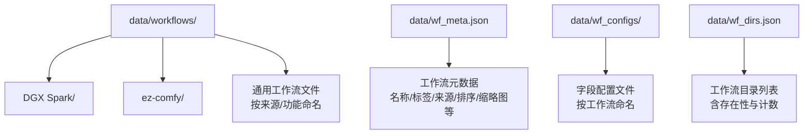
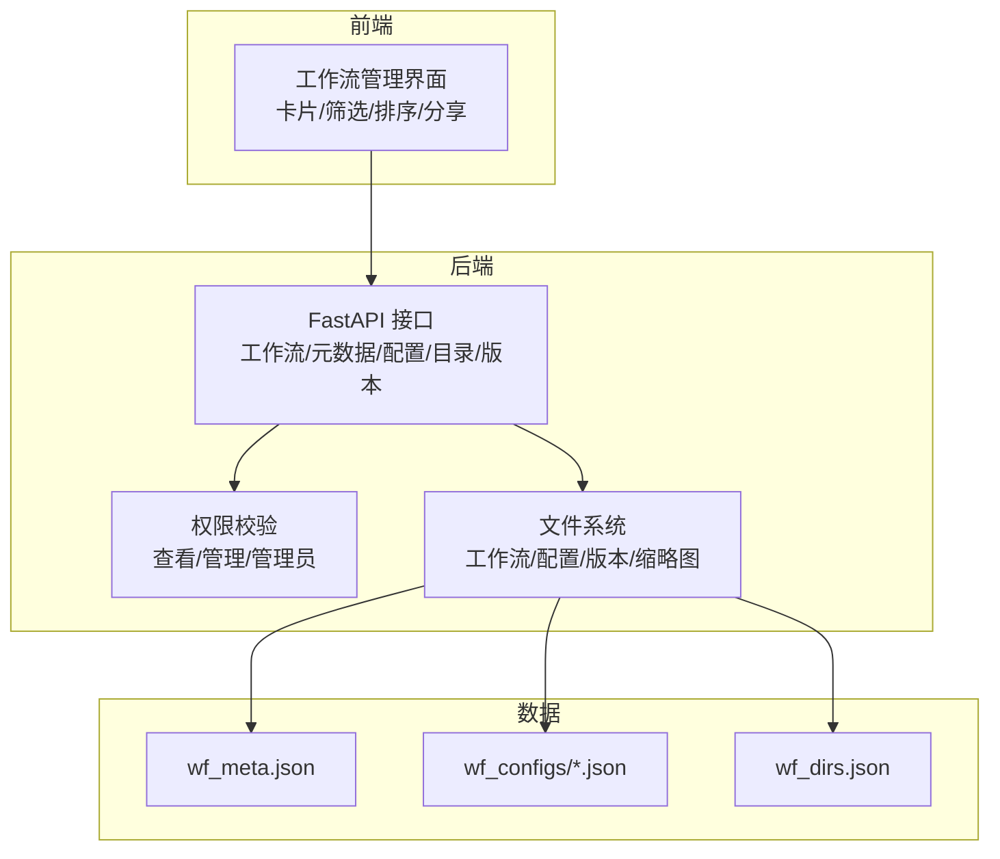
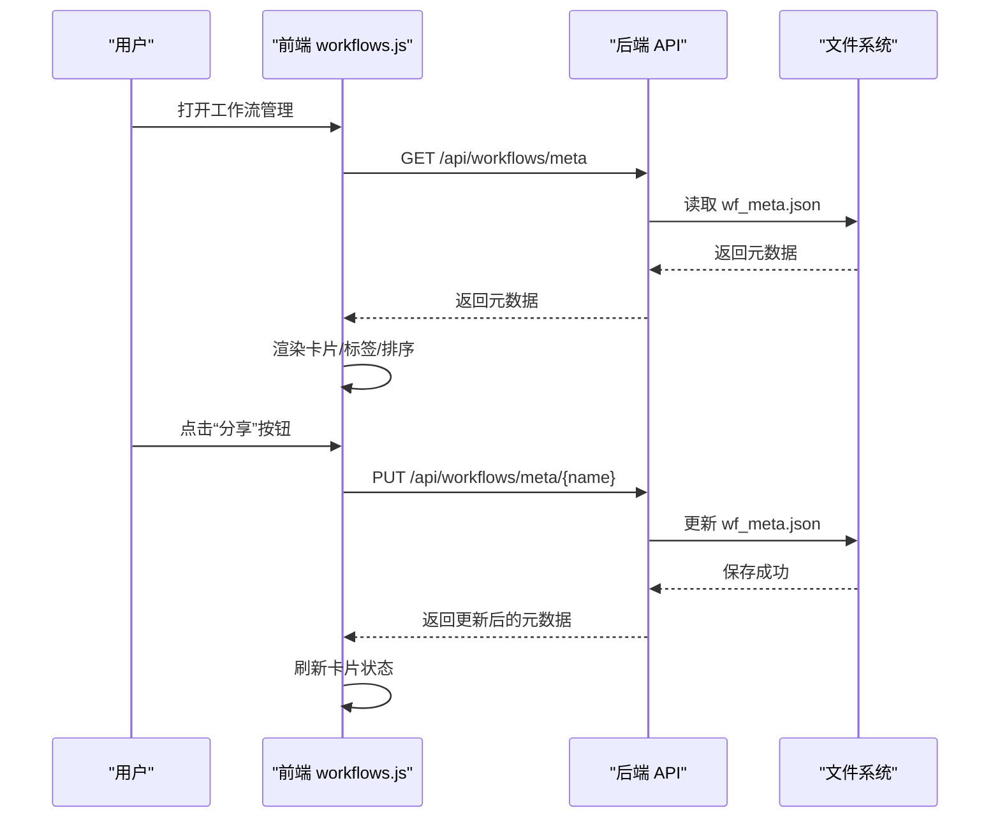
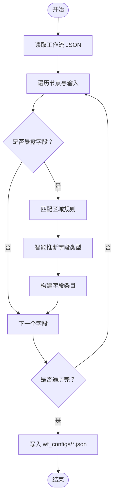
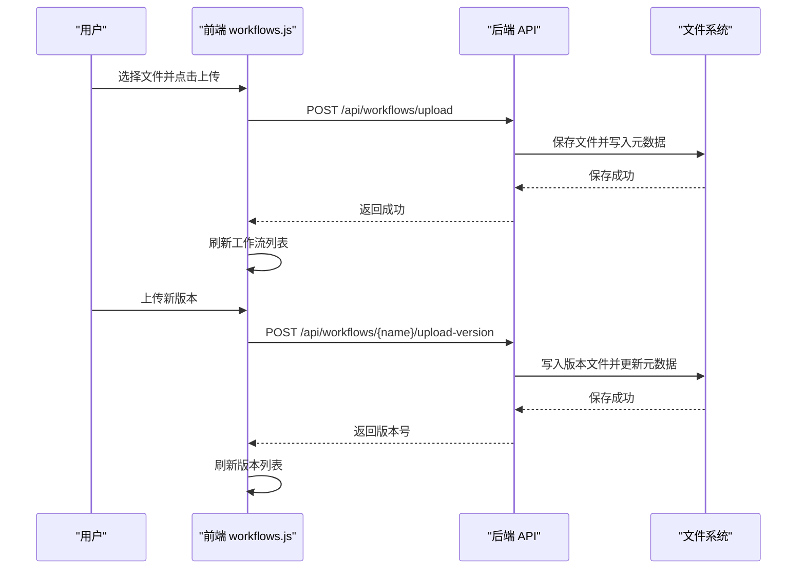
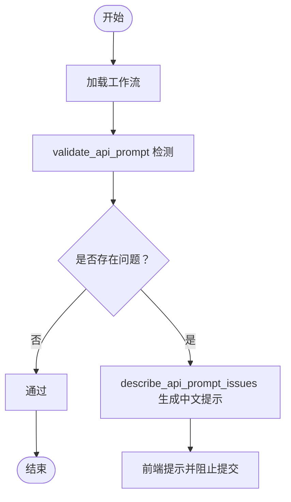
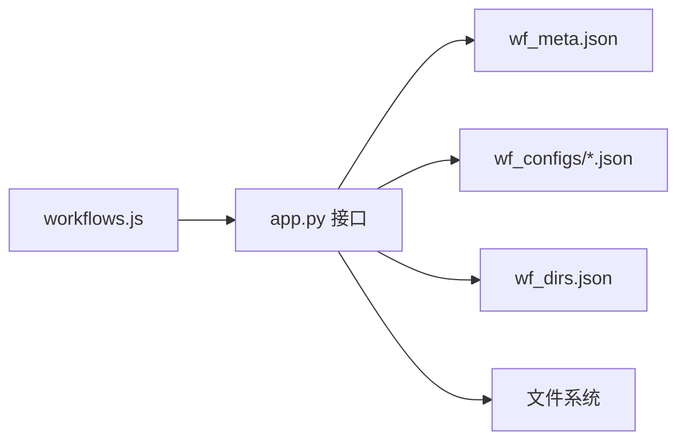

# 工作流文件组织

<cite>
**本文引用的文件**
- [app.py](file://app.py)
- [workflows.js](file://static/js/modules/workflows.js)
- [wf_meta.json](file://data/wf_meta.json)
- [wf_dirs.json](file://data/wf_dirs.json)
- [gen_wf_configs.py](file://scripts/gen_wf_configs.py)
- [SeedVR2_upscale_2k.json](file://data/wf_configs/SeedVR2_upscale_2k.json)
- [i2i-FireRed-Edit-1.1.json](file://data/wf_configs/i2i-FireRed-Edit-1.1.json)
- [workflow_validation.py](file://modules/workflow_validation.py)
</cite>

## 目录
1. [简介](#简介)
2. [项目结构](#项目结构)
3. [核心组件](#核心组件)
4. [架构总览](#架构总览)
5. [详细组件分析](#详细组件分析)
6. [依赖关系分析](#依赖关系分析)
7. [性能考量](#性能考量)
8. [故障排查指南](#故障排查指南)
9. [结论](#结论)
10. [附录](#附录)

## 简介
本文件面向 Ez ComfyUI Showcase 的工作流文件组织系统，系统性梳理 workflows 目录的多层级文件组织结构与管理机制，覆盖来源分类（DGX Spark、ez-comfy）、功能分类、权限控制、导入导出与版本管理、批量操作等能力。文档旨在帮助开发者与运营人员高效理解与使用工作流文件组织体系。

## 项目结构
工作流文件主要位于 data 目录下，采用“来源分类 + 功能分类”的双层组织方式：
- 来源分类：data/workflows/DGX Spark/ 与 data/workflows/ez-comfy/
- 功能分类：根目录 data/workflows/ 下的通用工作流文件
- 元数据与配置：data/wf_meta.json 记录每个工作流的元信息；data/wf_configs/ 保存字段配置；data/wf_dirs.json 定义扫描目录列表

图表来源
- [wf_meta.json:1-537](file://data/wf_meta.json#L1-L537)
- [wf_dirs.json:1-4](file://data/wf_dirs.json#L1-L4)
- [SeedVR2_upscale_2k.json:1-266](file://data/wf_configs/SeedVR2_upscale_2k.json#L1-L266)
- [i2i-FireRed-Edit-1.1.json:1-255](file://data/wf_configs/i2i-FireRed-Edit-1.1.json#L1-L255)

章节来源
- [wf_meta.json:1-537](file://data/wf_meta.json#L1-L537)
- [wf_dirs.json:1-4](file://data/wf_dirs.json#L1-L4)

## 核心组件
- 工作流元数据管理：通过 data/wf_meta.json 维护每个工作流的显示名、标签、来源、排序、缩略图、所有者等属性，支持前端展示与筛选。
- 字段配置生成：scripts/gen_wf_configs.py 自动解析工作流节点暴露字段，生成 data/wf_configs/*.json，定义字段区域（用户输入/高级/输出）、可见性、类型与顺序。
- 目录扫描与管理：data/wf_dirs.json 列举工作流扫描目录，支持增删目录、统计数量、校验存在性。
- 前端工作流管理：static/js/modules/workflows.js 实现工作流卡片渲染、标签过滤、排序、分享状态切换、缩略图上传、版本管理、批量上传与删除等。

章节来源
- [workflows.js:1-800](file://static/js/modules/workflows.js#L1-L800)
- [gen_wf_configs.py:1-175](file://scripts/gen_wf_configs.py#L1-L175)

## 架构总览
系统从前端 UI 到后端 API 再到底层文件系统形成闭环：前端通过 API 获取元数据与配置，后端负责权限校验、文件解析与存储、目录扫描与版本管理。

图表来源
- [workflows.js:1-800](file://static/js/modules/workflows.js#L1-L800)
- [app.py:6616-7296](file://app.py#L6616-L7296)
- [wf_meta.json:1-537](file://data/wf_meta.json#L1-L537)
- [wf_dirs.json:1-4](file://data/wf_dirs.json#L1-L4)

## 详细组件分析

### 组件A：工作流来源与功能分类
- 来源分类
  - DGX Spark：提供专业级工作流，覆盖图生图、文生图、视频制作、放大等场景，包含大量 LoRA、模型变体与加速版本。
  - ez-comfy：提供基础工作流模板，如视频制作与通用工作流。
- 功能分类
  - 按应用：图像生成（文生图/图生图）、视频处理（图生视频/文生视频）、图像增强（放大）。
  - 按技术栈：不同模型（如 Qwen、Flux2、SeedVR2、ERNIE、LTX2.3、Sulphur、Bernini 等）与 LoRA。
  - 按性能：快速生成（Turbo/加速版）、高质量输出（高分辨率/高步数/LoRA）。

章节来源
- [wf_meta.json:1-537](file://data/wf_meta.json#L1-L537)

### 组件B：工作流元数据与权限控制
- 元数据字段
  - name：显示名称（可自定义）
  - tags：标签数组（用于前端筛选与分类）
  - owner_id：所有者标识
  - shared：是否共享（仅管理员可修改）
  - source/source_path：来源与物理路径
  - sort_order：排序权重
  - thumbnail：缩略图相对路径
- 权限控制
  - 查看：登录用户可查看非私有工作流
  - 管理：工作流所有者或管理员可编辑元数据、上传/删除工作流、设置分享状态
  - 分享：仅管理员可更改 shared 状态
- 前端交互
  - 卡片渲染：显示名称、标签、缩略图、操作按钮（编辑/节点/下载/分享/删除）
  - 分类筛选：按主标签与搜索关键词过滤
  - 排序：按 sort_order 与本地化排序

图表来源
- [workflows.js:581-757](file://static/js/modules/workflows.js#L581-L757)
- [app.py:7195-7217](file://app.py#L7195-L7217)
- [wf_meta.json:1-537](file://data/wf_meta.json#L1-L537)

章节来源
- [workflows.js:581-757](file://static/js/modules/workflows.js#L581-L757)
- [app.py:7195-7217](file://app.py#L7195-L7217)

### 组件C：字段配置生成与工作流分析
- 自动生成流程
  - scripts/gen_wf_configs.py 解析 data/workflows/ 下的工作流，识别节点暴露字段，按规则分配区域（用户输入/高级/输出），推断字段类型（文本/数字/选择/开关/种子/图像），并生成 data/wf_configs/*.json。
- 字段配置结构
  - version：配置版本
  - workflow：对应工作流文件名
  - fields：字段数组，包含 key（节点::字段）、zone（区域）、visible（可见性）、label、order、type 及类型特定参数（如 min/max/step/options）
- 工作流分析
  - /api/workflows/{name}/analyze 返回工作流分析结果（如节点/连线问题）

图表来源
- [gen_wf_configs.py:60-148](file://scripts/gen_wf_configs.py#L60-L148)
- [SeedVR2_upscale_2k.json:1-266](file://data/wf_configs/SeedVR2_upscale_2k.json#L1-L266)
- [i2i-FireRed-Edit-1.1.json:1-255](file://data/wf_configs/i2i-FireRed-Edit-1.1.json#L1-L255)

章节来源
- [gen_wf_configs.py:1-175](file://scripts/gen_wf_configs.py#L1-L175)
- [SeedVR2_upscale_2k.json:1-266](file://data/wf_configs/SeedVR2_upscale_2k.json#L1-L266)
- [i2i-FireRed-Edit-1.1.json:1-255](file://data/wf_configs/i2i-FireRed-Edit-1.1.json#L1-L255)

### 组件D：导入导出、版本管理与批量操作
- 导入
  - /api/workflows/upload 接收 .json 文件，保存至工作流目录并更新元数据
- 导出
  - /api/workflows/{name}/download 提供工作流文件下载
- 版本管理
  - /api/workflows/{name}/upload-version 上传新版本，自动编号并激活最新版本
  - /api/workflows/{name}/versions 获取版本列表
  - /api/workflows/{name}/version-download 下载指定版本
  - /api/workflows/{name}/activate-version 激活指定版本
  - /api/workflows/{name}/versions/{version} 删除指定版本
- 批量操作
  - 前端支持批量上传、删除、重命名、设置分享状态、拖拽排序与标签管理

图表来源
- [workflows.js:718-735](file://static/js/modules/workflows.js#L718-L735)
- [workflows.js:9279-9316](file://static/js/modules/workflows.js#L9279-L9316)
- [app.py:6758-6756](file://app.py#L6758-L6756)
- [app.py:9279-9316](file://app.py#L9279-L9316)

章节来源
- [workflows.js:718-735](file://static/js/modules/workflows.js#L718-L735)
- [workflows.js:9279-9316](file://static/js/modules/workflows.js#L9279-L9316)
- [app.py:6758-6756](file://app.py#L6758-L6756)
- [app.py:9279-9316](file://app.py#L9279-L9316)

### 组件E：工作流验证与错误处理
- 工作流验证
  - modules/workflow_validation.py 提供 validate_api_prompt 与 describe_api_prompt_issues，用于检测缺失节点连接与占位输入，返回中文错误描述
- 错误处理
  - 前端在工作流分析与提交前进行提示，避免无效工作流进入生成队列

图表来源
- [workflow_validation.py:22-60](file://modules/workflow_validation.py#L22-L60)
- [workflows.js:1-800](file://static/js/modules/workflows.js#L1-L800)

章节来源
- [workflow_validation.py:1-60](file://modules/workflow_validation.py#L1-L60)
- [workflows.js:1-800](file://static/js/modules/workflows.js#L1-L800)

## 依赖关系分析
- 前端依赖后端 API 提供元数据、配置、目录与版本信息
- 后端依赖文件系统存储工作流、配置与版本文件
- 元数据与配置相互独立：元数据决定展示与权限，配置决定表单渲染

图表来源
- [workflows.js:1-800](file://static/js/modules/workflows.js#L1-L800)
- [app.py:6616-7296](file://app.py#L6616-L7296)
- [wf_meta.json:1-537](file://data/wf_meta.json#L1-L537)
- [wf_dirs.json:1-4](file://data/wf_dirs.json#L1-L4)

章节来源
- [workflows.js:1-800](file://static/js/modules/workflows.js#L1-L800)
- [app.py:6616-7296](file://app.py#L6616-L7296)

## 性能考量
- 目录扫描：/api/workflow-dirs 会递归统计 .json 数量，建议合理划分目录，避免单目录过大
- 缩略图缓存：前端通过时间戳戳破坏缓存，避免浏览器缓存导致缩略图不更新
- 字段配置：生成脚本一次性解析工作流，建议定期清理冗余配置文件
- 大文件传输：版本上传受 MAX_WORKFLOW_SIZE 限制，建议压缩与分批上传

## 故障排查指南
- 无法查看工作流
  - 检查元数据中 shared 与 owner_id，确认当前用户是否有查看权限
- 无法编辑或分享
  - 管理员可修改 shared；普通用户仅能管理自己拥有的工作流
- 上传失败
  - 确认文件为 .json 且符合 JSON 格式；检查后端日志与前端提示
- 版本上传异常
  - 确认工作流存在且 JSON 可解析；检查版本目录权限
- 缩略图不显示
  - 检查 thumbnail 字段与实际文件路径；刷新页面以清除缓存

章节来源
- [workflows.js:165-191](file://static/js/modules/workflows.js#L165-L191)
- [workflows.js:213-239](file://static/js/modules/workflows.js#L213-L239)
- [workflows.js:241-270](file://static/js/modules/workflows.js#L241-L270)
- [app.py:6758-6756](file://app.py#L6758-L6756)
- [app.py:9279-9316](file://app.py#L9279-L9316)

## 结论
Ez ComfyUI Showcase 的工作流文件组织系统通过“来源分类 + 功能分类”的目录结构、完善的元数据与字段配置、严格的权限控制与丰富的导入导出/版本管理能力，实现了从开发到运营的全生命周期管理。建议在实际使用中：
- 明确来源与功能分类，规范命名与标签
- 使用字段配置提升表单可用性
- 严格区分权限，确保共享与私有工作流的安全
- 定期维护目录与版本，保持系统整洁高效

## 附录
- 关键 API 概览
  - GET /api/workflows/meta：获取元数据
  - PUT /api/workflows/meta/{filename}：更新元数据（含分享）
  - POST /api/workflows/upload：上传工作流
  - GET /api/workflows/{name}/download：下载工作流
  - POST /api/workflows/{name}/upload-version：上传版本
  - GET /api/workflow-dirs：列出扫描目录
  - POST /api/workflow-dirs：新增目录
  - DELETE /api/workflow-dirs：删除目录

章节来源
- [app.py:6616-7296](file://app.py#L6616-L7296)
- [app.py:6797-6835](file://app.py#L6797-L6835)