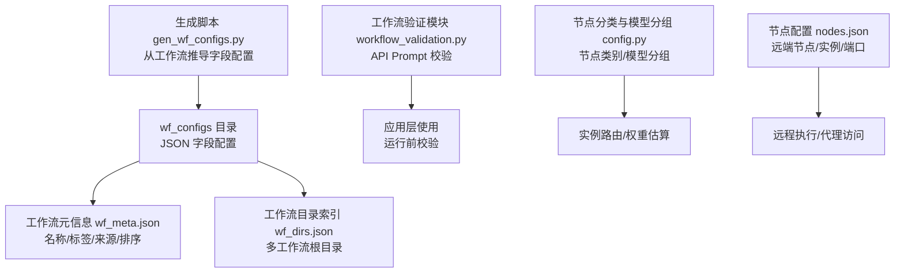
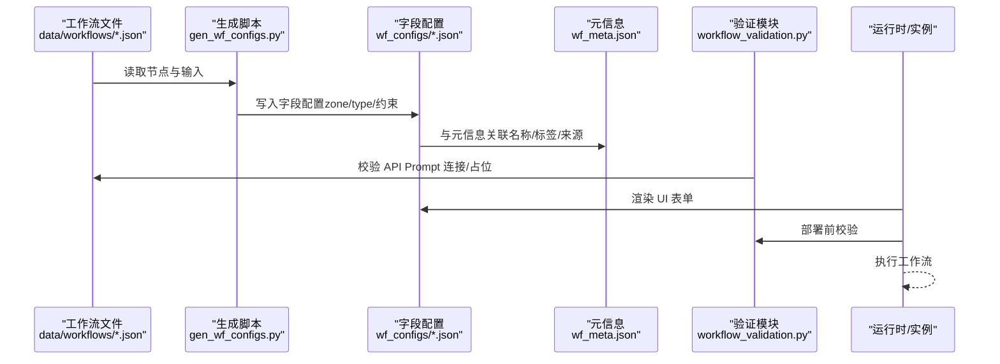
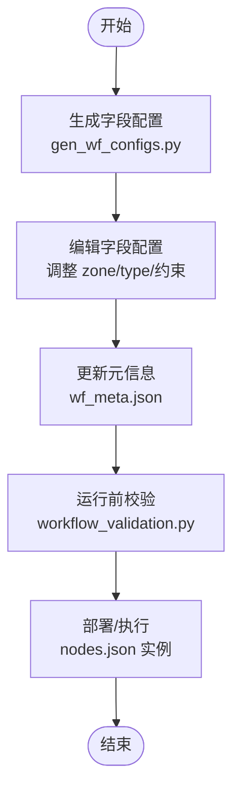
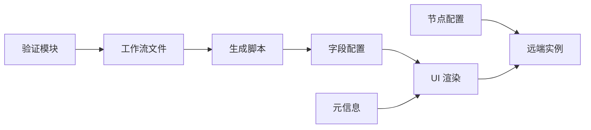

# 工作流配置存储

<cite>
**本文引用的文件**
- [data/wf_configs/i2i-FireRed-Edit-1.1.json](file://data/wf_configs/i2i-FireRed-Edit-1.1.json)
- [data/wf_configs/i2i_Qwen_Edit.json](file://data/wf_configs/i2i_Qwen_Edit.json)
- [data/wf_configs/t2i-nunchaku-z-image-turbo-highSD.json](file://data/wf_configs/t2i-nunchaku-z-image-turbo-highSD.json)
- [data/wf_configs/t2i-z-image.json](file://data/wf_configs/t2i-z-image.json)
- [data/wf_configs/nunchaku-z-image-turbo-high.json](file://data/wf_configs/nunchaku-z-image-turbo-high.json)
- [data/wf_configs/nunchaku_T2I_4k.json](file://data/wf_configs/nunchaku_T2I_4k.json)
- [data/wf_configs/i2v_ltx23_10eros.json](file://data/wf_configs/i2v_ltx23_10eros.json)
- [data/wf_meta.json](file://data/wf_meta.json)
- [data/wf_dirs.json](file://data/wf_dirs.json)
- [scripts/gen_wf_configs.py](file://scripts/gen_wf_configs.py)
- [modules/workflow_validation.py](file://modules/workflow_validation.py)
- [modules/config.py](file://modules/config.py)
- [config/nodes.json](file://config/nodes.json)
</cite>

## 目录
1. [简介](#简介)
2. [项目结构](#项目结构)
3. [核心组件](#核心组件)
4. [架构总览](#架构总览)
5. [详细组件分析](#详细组件分析)
6. [依赖关系分析](#依赖关系分析)
7. [性能考量](#性能考量)
8. [故障排查指南](#故障排查指南)
9. [结论](#结论)
10. [附录](#附录)

## 简介
本文件系统化梳理 Ez ComfyUI Showcase 的工作流配置存储体系，聚焦 data/wf_configs 目录的组织与策略，涵盖以下主题：
- 配置文件命名规范与目录布局
- JSON 配置文件的结构与字段语义
- 参数类型与约束（数值范围、枚举、步进）
- 不同类型工作流（图像到图像 i2i、文本到图像 t2i、图像到视频 i2v）的配置差异
- 版本管理与向后兼容策略
- 创建、编辑、验证与部署流程
- 性能优化建议（文件体积、加载速度、内存占用）

## 项目结构
wf_configs 存储了面向 UI 的“字段配置”（field config），用于描述 ComfyUI 工作流中哪些节点参数需要暴露给用户、如何分组展示以及默认的输入类型与约束。这些配置与实际的工作流文件（data/workflows 下）一一对应，但仅包含 UI 层所需元数据。

图表来源
- [data/wf_configs/i2i-FireRed-Edit-1.1.json:1-255](file://data/wf_configs/i2i-FireRed-Edit-1.1.json#L1-L255)
- [data/wf_meta.json:1-537](file://data/wf_meta.json#L1-L537)
- [data/wf_dirs.json:1-4](file://data/wf_dirs.json#L1-L4)
- [scripts/gen_wf_configs.py:1-175](file://scripts/gen_wf_configs.py#L1-L175)
- [modules/workflow_validation.py:1-60](file://modules/workflow_validation.py#L1-L60)
- [modules/config.py:1-152](file://modules/config.py#L1-L152)
- [config/nodes.json:1-97](file://config/nodes.json#L1-L97)

章节来源
- [data/wf_configs/i2i-FireRed-Edit-1.1.json:1-255](file://data/wf_configs/i2i-FireRed-Edit-1.1.json#L1-L255)
- [data/wf_meta.json:1-537](file://data/wf_meta.json#L1-L537)
- [data/wf_dirs.json:1-4](file://data/wf_dirs.json#L1-L4)
- [scripts/gen_wf_configs.py:1-175](file://scripts/gen_wf_configs.py#L1-L175)
- [modules/workflow_validation.py:1-60](file://modules/workflow_validation.py#L1-L60)
- [modules/config.py:1-152](file://modules/config.py#L1-L152)
- [config/nodes.json:1-97](file://config/nodes.json#L1-L97)

## 核心组件
- 字段配置文件（wf_configs/*.json）
  - 结构：version、workflow、fields 数组
  - fields 中每个条目描述一个 UI 可编辑字段，包含 key、zone、visible、label、order、type 以及针对特定类型的附加属性（如 number 的 min/max/step、select 的 options、toggle）
- 元信息文件（wf_meta.json）
  - 记录每个工作流的显示名、标签、来源、排序、缩略图等元数据
- 目录索引（wf_dirs.json）
  - 列出多个工作流根目录，便于扫描与聚合
- 生成脚本（gen_wf_configs.py）
  - 从工作流文件推导字段配置，自动标注 zone（user_input/advanced/output/hidden）、类型与约束
- 验证模块（workflow_validation.py）
  - 对 ComfyUI API Prompt 进行连通性与占位校验，辅助部署前检查
- 节点与模型分组（config.py）
  - 定义节点类别、模型分组，支持实例亲和与权重估算
- 远端节点配置（nodes.json）
  - 描述远端节点、SSH/代理、实例端口等，支撑跨机执行

章节来源
- [data/wf_configs/i2i-FireRed-Edit-1.1.json:1-255](file://data/wf_configs/i2i-FireRed-Edit-1.1.json#L1-L255)
- [data/wf_meta.json:1-537](file://data/wf_meta.json#L1-L537)
- [data/wf_dirs.json:1-4](file://data/wf_dirs.json#L1-L4)
- [scripts/gen_wf_configs.py:1-175](file://scripts/gen_wf_configs.py#L1-L175)
- [modules/workflow_validation.py:1-60](file://modules/workflow_validation.py#L1-L60)
- [modules/config.py:1-152](file://modules/config.py#L1-L152)
- [config/nodes.json:1-97](file://config/nodes.json#L1-L97)

## 架构总览
下图展示了从工作流到字段配置、再到运行时校验与部署的整体流程。

图表来源
- [scripts/gen_wf_configs.py:60-148](file://scripts/gen_wf_configs.py#L60-L148)
- [data/wf_configs/i2i-FireRed-Edit-1.1.json:1-255](file://data/wf_configs/i2i-FireRed-Edit-1.1.json#L1-L255)
- [data/wf_meta.json:1-537](file://data/wf_meta.json#L1-L537)
- [modules/workflow_validation.py:22-42](file://modules/workflow_validation.py#L22-L42)

## 详细组件分析

### 字段配置文件结构与命名规范
- 文件命名
  - 与对应工作流文件同名（扩展名均为 .json）
  - 示例：i2i-FireRed-Edit-1.1.json、t2i-nunchaku-z-image-turbo-highSD.json、i2v_ltx23_10eros.json
- JSON 结构
  - version：当前配置版本号（整数）
  - workflow：对应工作流文件名
  - fields：字段数组，每项包含
    - key：唯一标识，格式为 "<节点ID>::<字段名>" 或 "<节点ID>:<子节点ID>::<字段名>"
    - zone：区域，决定 UI 展示位置与可见性
      - user_input：用户输入区
      - advanced：高级参数区
      - output：输出区
      - hidden：隐藏区（仍可被 UI 使用）
    - visible：是否在 UI 中可见
    - label：显示标签
    - order：字段顺序
    - type：输入类型
      - text、textarea、number、seed、image、select、toggle
    - 针对 type 的附加属性
      - number：min、max、step
      - select：options
      - image/textarea/seed/text：无额外要求
- 字段类型与约束
  - 数字类（number）：常见有步进与上下界，如 denoise/strength 的范围 0..1，步进 0.05
  - 选择类（select）：枚举选项固定，如采样器、调度器
  - 图像类（image）：用于上传或引用输入图像
  - 种子类（seed）：用于随机种子
  - 开关类（toggle）：布尔开关
  - 文本类（text/textarea）：长文本或短文本

章节来源
- [data/wf_configs/i2i-FireRed-Edit-1.1.json:1-255](file://data/wf_configs/i2i-FireRed-Edit-1.1.json#L1-L255)
- [data/wf_configs/i2i_Qwen_Edit.json:1-294](file://data/wf_configs/i2i_Qwen_Edit.json#L1-L294)
- [data/wf_configs/t2i-nunchaku-z-image-turbo-highSD.json:1-191](file://data/wf_configs/t2i-nunchaku-z-image-turbo-highSD.json#L1-L191)
- [data/wf_configs/t2i-z-image.json:1-290](file://data/wf_configs/t2i-z-image.json#L1-L290)
- [data/wf_configs/nunchaku-z-image-turbo-high.json:1-209](file://data/wf_configs/nunchaku-z-image-turbo-high.json#L1-L209)
- [data/wf_configs/nunchaku_T2I_4k.json:1-424](file://data/wf_configs/nunchaku_T2I_4k.json#L1-L424)
- [data/wf_configs/i2v_ltx23_10eros.json:1-417](file://data/wf_configs/i2v_ltx23_10eros.json#L1-L417)

### 不同类型工作流配置的结构差异
- 图像到图像（i2i）
  - 关键字段：prompt、strength、seed、steps、cfg、sampler/scheduler、denoise、image/upload
  - 示例：i2i-FireRed-Edit-1.1.json、i2i_Qwen_Edit.json
- 文本到图像（t2i）
  - 关键字段：width/height/batch_size、seed、steps/cfg、sampler/scheduler、text
  - 示例：t2i-nunchaku-z-image-turbo-highSD.json、t2i-z-image.json
- 图像到视频（i2v）
  - 关键字段：参考图、提示词、宽高、时长、帧率、视频编码、噪声种子、强度、LoRA 强度、分块参数、音频传递等
  - 示例：i2v_ltx23_10eros.json

章节来源
- [data/wf_configs/i2i-FireRed-Edit-1.1.json:1-255](file://data/wf_configs/i2i-FireRed-Edit-1.1.json#L1-L255)
- [data/wf_configs/i2i_Qwen_Edit.json:1-294](file://data/wf_configs/i2i_Qwen_Edit.json#L1-L294)
- [data/wf_configs/t2i-nunchaku-z-image-turbo-highSD.json:1-191](file://data/wf_configs/t2i-nunchaku-z-image-turbo-highSD.json#L1-L191)
- [data/wf_configs/t2i-z-image.json:1-290](file://data/wf_configs/t2i-z-image.json#L1-L290)
- [data/wf_configs/i2v_ltx23_10eros.json:1-417](file://data/wf_configs/i2v_ltx23_10eros.json#L1-L417)

### 版本管理与兼容策略
- 版本号
  - 字段配置文件包含 version 字段，当前为 1
- 向后兼容
  - 新增字段：在现有 fields 数组末尾追加，不破坏旧字段顺序
  - 类型变更：通过新增字段替代旧字段，保留旧字段以兼容旧版本 UI
  - 区域调整：zone 的变化不影响字段键，仅影响 UI 展示
- 迁移策略
  - 生成脚本可按规则自动推导字段配置，便于批量升级
  - 元信息文件可记录迁移历史与来源，辅助回溯

章节来源
- [data/wf_configs/i2i-FireRed-Edit-1.1.json:2-3](file://data/wf_configs/i2i-FireRed-Edit-1.1.json#L2-L3)
- [scripts/gen_wf_configs.py:142-148](file://scripts/gen_wf_configs.py#L142-L148)
- [data/wf_meta.json:1-537](file://data/wf_meta.json#L1-L537)

### 创建、编辑、验证与部署流程
- 创建
  - 从工作流文件（data/workflows）中提取节点与输入，依据规则推导 zone 与类型
  - 生成对应的字段配置文件（wf_configs/*.json）
- 编辑
  - 修改生成脚本中的规则或手动调整字段配置
  - 更新元信息（wf_meta.json）以反映名称、标签、来源与排序
- 验证
  - 使用 workflow_validation.py 对 ComfyUI API Prompt 进行连通性与占位校验
  - 生成中文错误摘要，定位缺失节点与占位值问题
- 部署
  - 将字段配置与元信息纳入 UI 渲染
  - 通过 nodes.json 配置远端实例与端口，实现跨机执行

图表来源
- [scripts/gen_wf_configs.py:60-148](file://scripts/gen_wf_configs.py#L60-L148)
- [data/wf_meta.json:1-537](file://data/wf_meta.json#L1-L537)
- [modules/workflow_validation.py:22-60](file://modules/workflow_validation.py#L22-L60)
- [config/nodes.json:1-97](file://config/nodes.json#L1-L97)

章节来源
- [scripts/gen_wf_configs.py:1-175](file://scripts/gen_wf_configs.py#L1-L175)
- [modules/workflow_validation.py:1-60](file://modules/workflow_validation.py#L1-L60)
- [data/wf_meta.json:1-537](file://data/wf_meta.json#L1-L537)
- [config/nodes.json:1-97](file://config/nodes.json#L1-L97)

### 参数验证机制
- 字段级约束
  - 类型与范围：number 的 min/max/step、select 的 options、image/textarea/seed/text
  - 默认值与帮助：部分字段包含默认值或帮助文本
- 工作流级校验
  - workflow_validation.py 校验 API Prompt 的连接完整性与占位值
  - 输出中文错误摘要，限制示例数量，便于快速修复

章节来源
- [data/wf_configs/i2v_ltx23_10eros.json:86-92](file://data/wf_configs/i2v_ltx23_10eros.json#L86-L92)
- [modules/workflow_validation.py:22-60](file://modules/workflow_validation.py#L22-L60)

## 依赖关系分析
- 字段配置依赖于工作流文件的节点与输入定义
- 生成脚本依赖于节点分类与字段规则
- 元信息文件提供 UI 展示与排序控制
- 验证模块独立于字段配置，直接作用于工作流文件
- 节点配置文件提供远端实例与端口，影响部署路径

图表来源
- [scripts/gen_wf_configs.py:60-148](file://scripts/gen_wf_configs.py#L60-L148)
- [data/wf_configs/i2i-FireRed-Edit-1.1.json:1-255](file://data/wf_configs/i2i-FireRed-Edit-1.1.json#L1-L255)
- [data/wf_meta.json:1-537](file://data/wf_meta.json#L1-L537)
- [modules/workflow_validation.py:22-42](file://modules/workflow_validation.py#L22-L42)
- [config/nodes.json:1-97](file://config/nodes.json#L1-L97)

章节来源
- [scripts/gen_wf_configs.py:1-175](file://scripts/gen_wf_configs.py#L1-L175)
- [modules/workflow_validation.py:1-60](file://modules/workflow_validation.py#L1-L60)
- [modules/config.py:1-152](file://modules/config.py#L1-L152)
- [config/nodes.json:1-97](file://config/nodes.json#L1-L97)

## 性能考量
- 文件大小控制
  - 仅保留必要字段，避免冗余的 hidden 字段
  - 合理使用 options 枚举，减少重复字符串
- 加载速度优化
  - 字段配置文件通常较小，建议按需懒加载
  - 将常用工作流置于本地缓存，减少网络 IO
- 内存使用管理
  - UI 渲染时按 zone 分组，避免一次性渲染过多控件
  - 对 select/textarea 等控件进行虚拟化或延迟初始化

## 故障排查指南
- 常见问题
  - 字段键冲突：确保 key 唯一，格式为 "<节点ID>::<字段名>" 或 "<节点ID>:<子节点ID>::<字段名>"
  - 类型不匹配：number 的 min/max/step 与 select 的 options 必须与 UI 一致
  - 占位值未替换：使用 workflow_validation.py 检查 API Prompt 的占位与连接
- 排查步骤
  - 逐项核对字段配置与工作流节点定义
  - 使用验证模块输出的中文摘要定位问题
  - 检查元信息与目录索引，确认工作流可见性与来源

章节来源
- [modules/workflow_validation.py:45-60](file://modules/workflow_validation.py#L45-L60)
- [data/wf_configs/i2i-FireRed-Edit-1.1.json:86-120](file://data/wf_configs/i2i-FireRed-Edit-1.1.json#L86-L120)

## 结论
wf_configs 目录通过标准化的字段配置，将复杂的工作流参数抽象为 UI 友好的表单，配合元信息与生成脚本，实现了高效、可维护的工作流配置体系。结合验证模块与节点配置，系统在保证易用性的同时兼顾了可扩展性与可移植性。

## 附录
- 目录索引
  - 多工作流根目录由 wf_dirs.json 统一管理，便于扫描与聚合
- 节点与模型分组
  - 通过 config.py 的 NodeCategory 与 ModelGroup，支持实例亲和与权重估算
- 远端节点
  - nodes.json 提供 SSH/代理配置与实例端口，支撑跨机执行

章节来源
- [data/wf_dirs.json:1-4](file://data/wf_dirs.json#L1-L4)
- [modules/config.py:1-152](file://modules/config.py#L1-L152)
- [config/nodes.json:1-97](file://config/nodes.json#L1-L97)