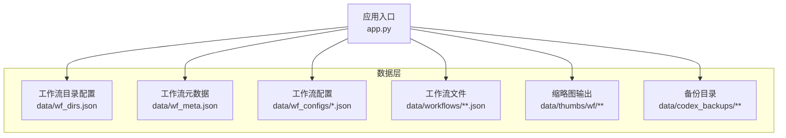
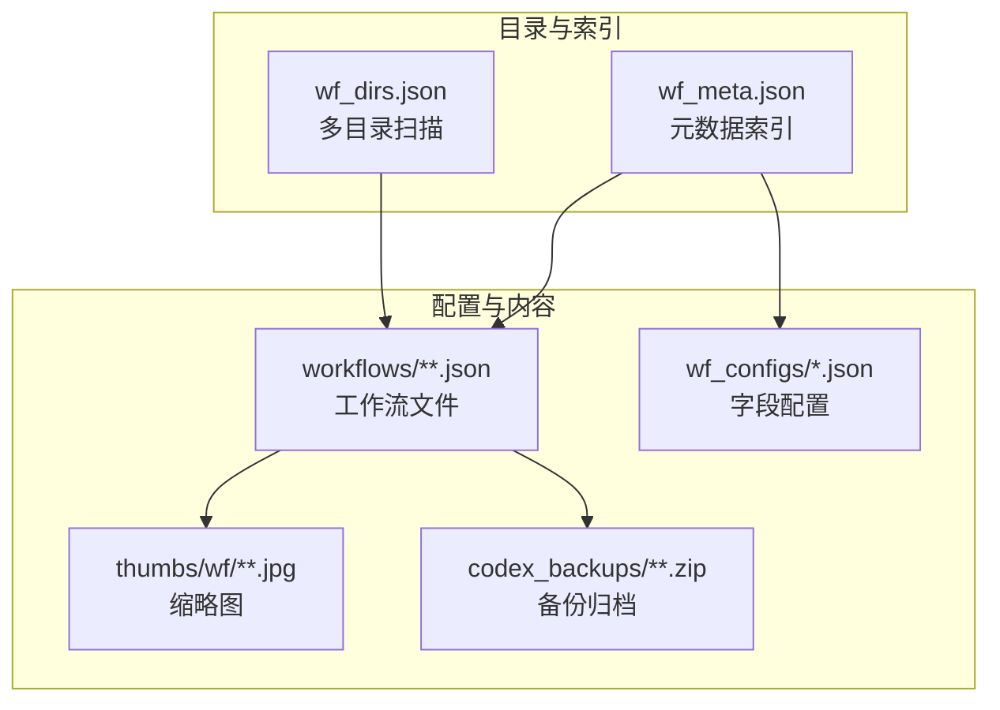
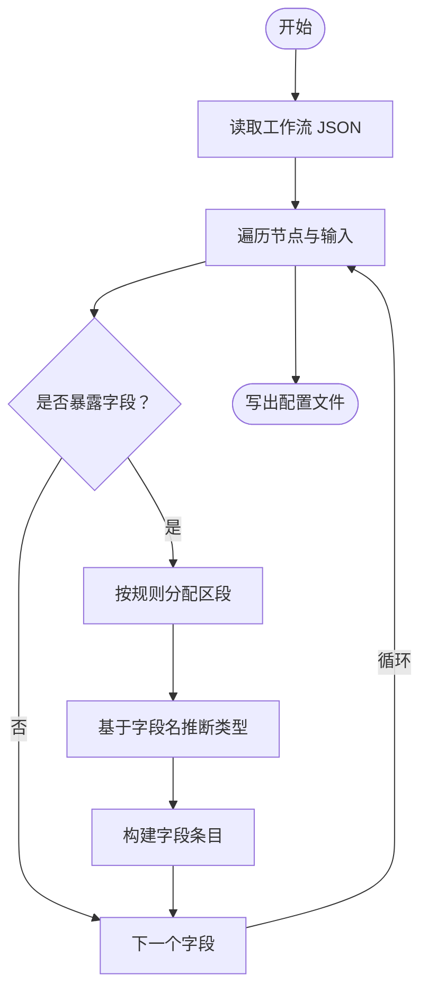
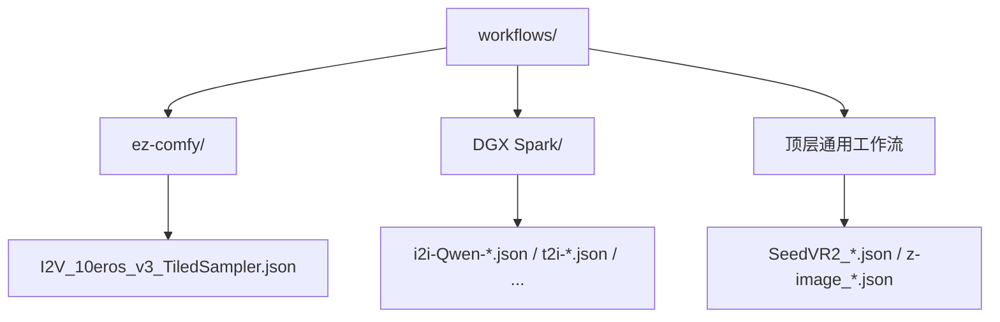
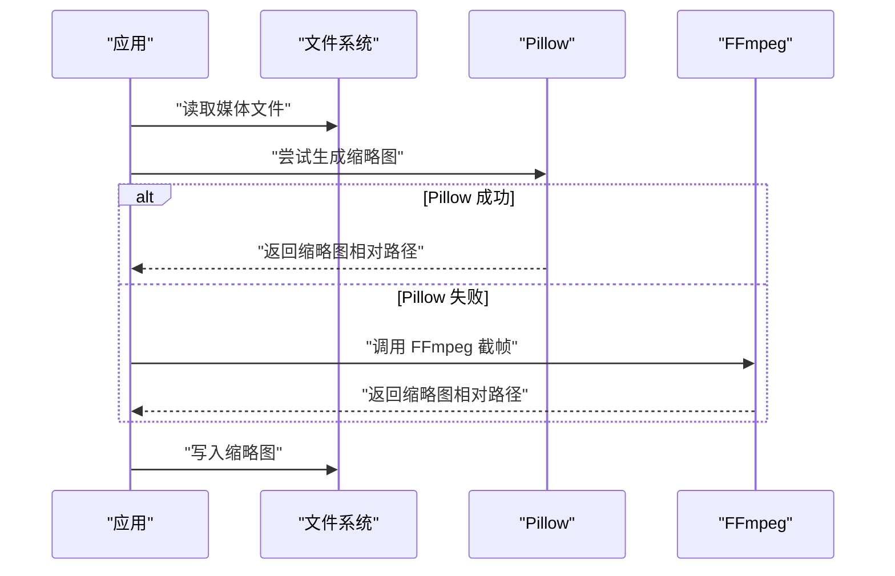
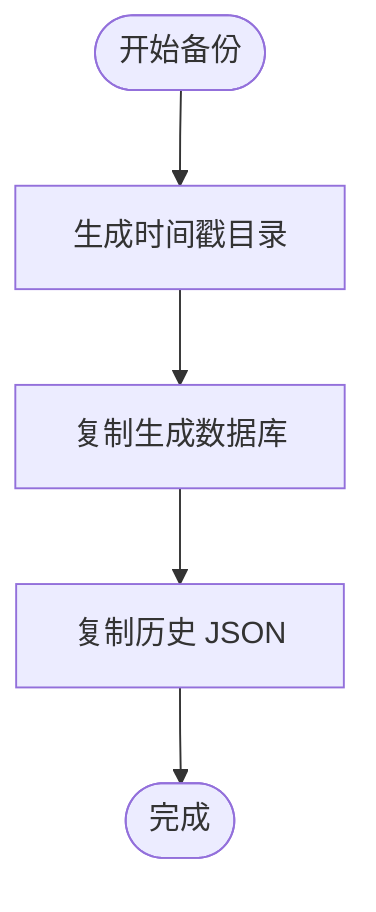
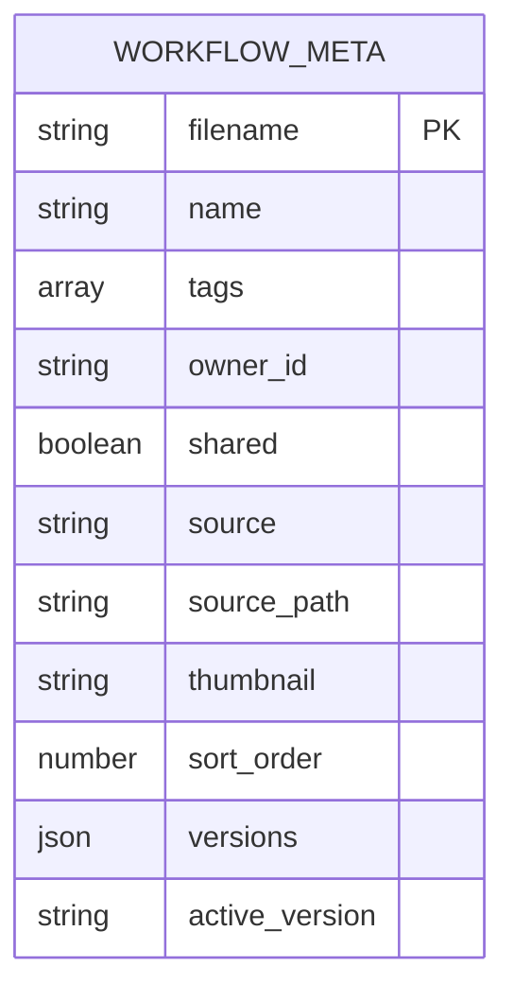
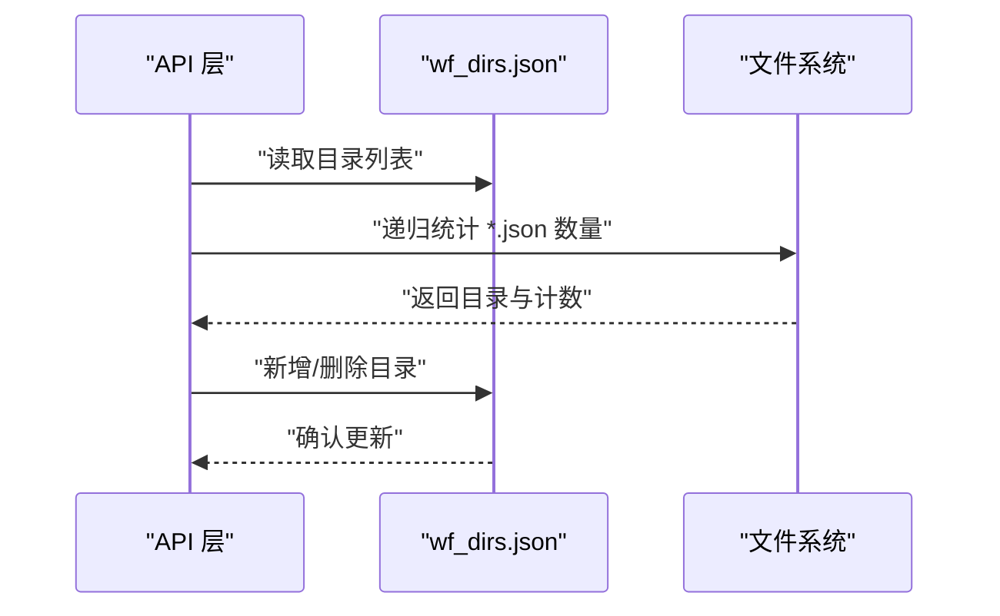
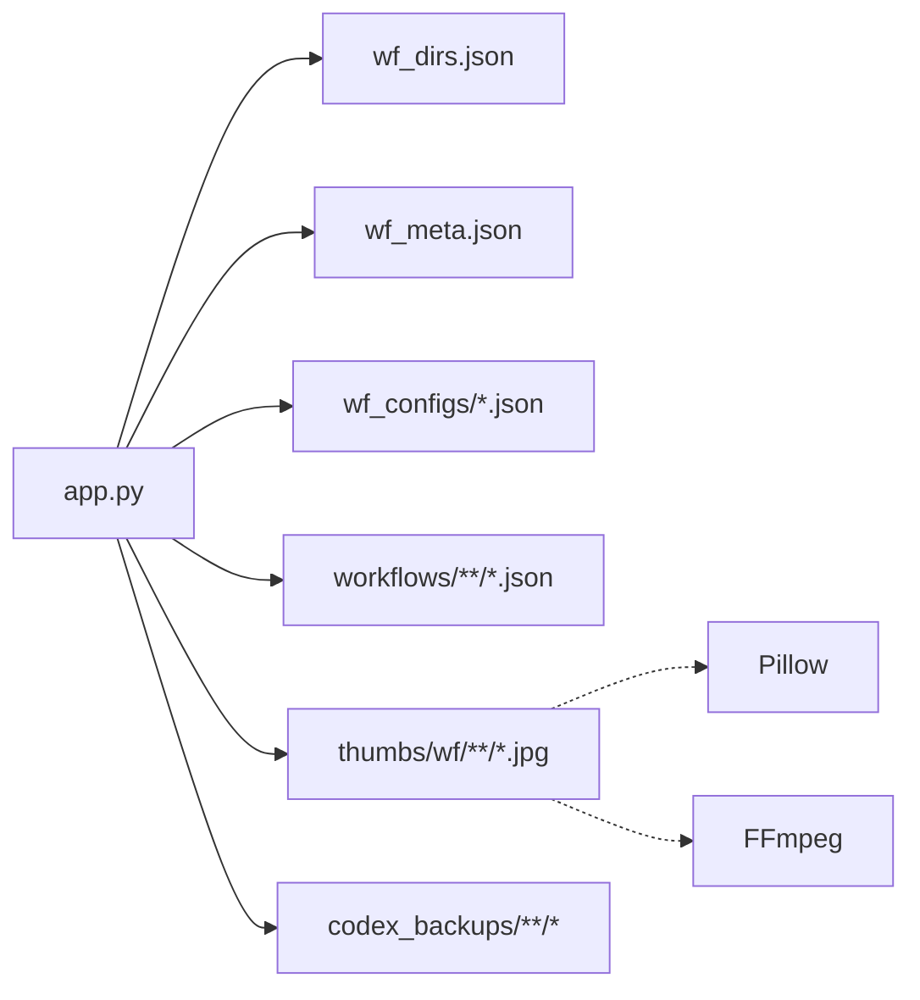

# 文件系统架构

<cite>
**本文引用的文件**
- [data/wf_meta.json](file://data/wf_meta.json)
- [data/wf_dirs.json](file://data/wf_dirs.json)
- [data/wf_configs/](file://data/wf_configs/)
- [data/workflows/](file://data/workflows/)
- [data/thumbs/wf/](file://data/thumbs/wf/)
- [data/codex_backups/](file://data/codex_backups/)
- [scripts/gen_wf_configs.py](file://scripts/gen_wf_configs.py)
- [modules/config.py](file://modules/config.py)
- [app.py](file://app.py)
- [scripts/reconcile_media_paths.py](file://scripts/reconcile_media_paths.py)
- [scripts/organize_image_paths.py](file://scripts/organize_image_paths.py)
</cite>

## 目录
1. [简介](#简介)
2. [项目结构](#项目结构)
3. [核心组件](#核心组件)
4. [架构总览](#架构总览)
5. [详细组件分析](#详细组件分析)
6. [依赖关系分析](#依赖关系分析)
7. [性能考虑](#性能考虑)
8. [故障排查指南](#故障排查指南)
9. [结论](#结论)
10. [附录](#附录)

## 简介
本文件系统架构文档聚焦 Ez ComfyUI Showcase 的数据与工作流文件组织，涵盖以下主题：
- 工作流配置文件的组织与生成策略（wf_configs）
- 工作流文件的分类存储与来源管理（workflows）
- 缩略图系统的设计与缓存策略（thumbs）
- 备份系统与版本管理（codex_backups 与版本子目录）
- 元数据管理（wf_meta.json）与目录配置（wf_dirs.json）
- 性能优化建议（访问模式、缓存与磁盘空间）

## 项目结构
数据层主要由以下目录构成：
- data/wf_configs：工作流配置文件集合，按工作流 JSON 名称一一对应，用于驱动 UI 字段区段与输入类型推断
- data/workflows：工作流文件集合，按来源分目录存放（如 ez-comfy、DGX Spark），同时保留顶层通用工作流
- data/wf_meta.json：工作流元数据索引，包含名称、标签、来源、排序、缩略图、版本等
- data/wf_dirs.json：可扫描的工作流目录列表，支持多路径扩展
- data/thumbs/wf：缩略图输出目录，按媒体相对路径生成
- data/codex_backups：备份根目录，配合脚本进行历史数据备份

图表来源
- [app.py:6795-6835](file://app.py#L6795-L6835)
- [data/wf_dirs.json:1-4](file://data/wf_dirs.json#L1-L4)
- [data/wf_meta.json:1-537](file://data/wf_meta.json#L1-L537)
- [data/wf_configs/](file://data/wf_configs/)
- [data/workflows/](file://data/workflows/)
- [data/thumbs/wf/](file://data/thumbs/wf/)
- [data/codex_backups/](file://data/codex_backups/)

章节来源
- [app.py:6795-6835](file://app.py#L6795-L6835)
- [data/wf_dirs.json:1-4](file://data/wf_dirs.json#L1-L4)
- [data/wf_meta.json:1-537](file://data/wf_meta.json#L1-L537)

## 核心组件
- 工作流配置生成器：根据工作流节点暴露字段生成配置，决定 UI 字段区段（用户区/高级/输出）、可见性、类型与默认范围
- 工作流目录管理：支持多目录扫描、动态增删、统计计数
- 元数据索引：集中维护工作流的展示名、标签、来源、排序、缩略图、版本等
- 缩略图系统：优先使用 Pillow 生成 JPEG 缩略图；对视频采用 FFmpeg 截帧
- 备份系统：脚本化备份生成带时间戳的归档目录，复制生成记录与历史数据

章节来源
- [scripts/gen_wf_configs.py:1-175](file://scripts/gen_wf_configs.py#L1-L175)
- [app.py:6795-6835](file://app.py#L6795-L6835)
- [app.py:5501-6090](file://app.py#L5501-L6090)
- [scripts/reconcile_media_paths.py:80-93](file://scripts/reconcile_media_paths.py#L80-L93)
- [scripts/organize_image_paths.py:85-93](file://scripts/organize_image_paths.py#L85-L93)

## 架构总览
工作流文件系统围绕“配置-元数据-目录-内容”四要素协同工作：
- 目录配置（wf_dirs.json）决定扫描范围
- 元数据（wf_meta.json）提供索引与展示属性
- 配置（wf_configs）驱动 UI 表单
- 内容（workflows、thumbs、codex_backups）承载实际资产

图表来源
- [data/wf_dirs.json:1-4](file://data/wf_dirs.json#L1-L4)
- [data/wf_meta.json:1-537](file://data/wf_meta.json#L1-L537)
- [data/wf_configs/](file://data/wf_configs/)
- [data/workflows/](file://data/workflows/)
- [data/thumbs/wf/](file://data/thumbs/wf/)
- [data/codex_backups/](file://data/codex_backups/)

## 详细组件分析

### 工作流配置文件（wf_configs）组织与生成
- 存储策略
  - 与 workflows 下同名 JSON 对应，便于按文件名快速定位配置
  - 自动生成，避免手工维护成本
- 文件命名规范
  - 与目标工作流文件名一致（含扩展名）
- 版本管理机制
  - 通过独立的版本上传接口与本地版本目录实现，不直接体现在 wf_configs 中
- 字段区段与类型推断
  - 用户区（user_input）、高级（advanced）、输出（output）三类
  - 基于节点类型与字段名进行智能类型判定（文本、数字、选择、开关、种子等）
- 生成流程
  - 解析工作流 JSON，遍历节点输入，筛选暴露字段
  - 应用规则表确定区段与类型，并写入配置文件

图表来源
- [scripts/gen_wf_configs.py:60-148](file://scripts/gen_wf_configs.py#L60-L148)

章节来源
- [scripts/gen_wf_configs.py:1-175](file://scripts/gen_wf_configs.py#L1-L175)

### 工作流文件分类存储（workflows）
- 来源目录
  - workflows/ez-comfy：官方或推荐工作流
  - workflows/DGX Spark：第三方来源工作流
- 顶层通用工作流
  - 顶层 workflows 目录保留常用工作流，便于统一管理
- 标签分类与权限控制
  - 标签与权限在元数据（wf_meta.json）中集中维护，不在文件系统层面强制约束
  - 权限字段（如 shared）用于前端展示与访问控制
- 访问与解析
  - 应用通过元数据中的 source_path 或解析函数解析实际路径，确保来源一致性

图表来源
- [data/workflows/](file://data/workflows/)

章节来源
- [data/wf_meta.json:1-537](file://data/wf_meta.json#L1-L537)
- [app.py:6795-6835](file://app.py#L6795-L6835)

### 缩略图系统（thumbs）
- 目录结构
  - 输出至 data/thumbs/wf，按媒体相对路径生成
- 图片处理流程
  - 优先使用 Pillow：EXIF 转正、缩放、模式转换、JPEG 保存
  - 对非图像（如视频）使用 FFmpeg 截帧生成缩略图
  - 失败日志记录，避免噪声日志污染
- 缓存策略
  - 若目标缩略图已存在则直接复用
  - 对不可识别图像或 FFmpeg 不可用的情况有明确降级与告警

图表来源
- [app.py:6022-6090](file://app.py#L6022-L6090)

章节来源
- [app.py:5501-6090](file://app.py#L5501-L6090)

### 备份系统（codex_backups）
- 备份策略
  - 脚本化备份：以时间戳创建子目录，复制生成数据库与历史 JSON
  - 支持 dry-run 预演
- 增量备份机制
  - 当前实现为全量复制；未见内置增量算法
- 备份恢复流程
  - 将备份目录中的文件复制回原位置，重启服务后生效

图表来源
- [scripts/reconcile_media_paths.py:80-93](file://scripts/reconcile_media_paths.py#L80-L93)
- [scripts/organize_image_paths.py:85-93](file://scripts/organize_image_paths.py#L85-L93)

章节来源
- [scripts/reconcile_media_paths.py:80-93](file://scripts/reconcile_media_paths.py#L80-L93)
- [scripts/organize_image_paths.py:85-93](file://scripts/organize_image_paths.py#L85-L93)

### 元数据管理（wf_meta.json）
- 结构设计
  - 键为工作流文件名，值包含 name、tags、owner_id、shared、source、source_path、thumbnail、sort_order、versions 等
- 存储格式
  - JSON 文件，同时支持数据库持久化与文件导出
- 索引与查询机制
  - 提供版本列表与活动版本管理接口
  - 支持按来源、标签、排序字段检索与展示

图表来源
- [data/wf_meta.json:1-537](file://data/wf_meta.json#L1-L537)
- [app.py:9243-9316](file://app.py#L9243-L9316)

章节来源
- [data/wf_meta.json:1-537](file://data/wf_meta.json#L1-L537)
- [app.py:9243-9316](file://app.py#L9243-L9316)

### 目录配置管理（wf_dirs.json）
- 作用
  - 定义可扫描的工作流目录列表，支持动态增删与统计
- 目录扫描策略
  - 递归扫描 JSON 文件，统计数量
- 动态加载机制
  - 读取 JSON 列表，若缺失则回退到默认工作流目录并写回

图表来源
- [app.py:6795-6835](file://app.py#L6795-L6835)
- [data/wf_dirs.json:1-4](file://data/wf_dirs.json#L1-L4)

章节来源
- [app.py:6795-6835](file://app.py#L6795-L6835)
- [data/wf_dirs.json:1-4](file://data/wf_dirs.json#L1-L4)

## 依赖关系分析
- 组件耦合
  - app.py 依赖 wf_dirs.json 与 wf_meta.json 实现目录扫描与元数据索引
  - 缩略图生成依赖 Pillow 或 FFmpeg，失败时记录日志
  - 备份脚本依赖固定的数据文件路径
- 外部依赖
  - Pillow：图像处理
  - FFmpeg：视频截帧
  - SQLite/JSON：元数据持久化

图表来源
- [app.py:6795-6835](file://app.py#L6795-L6835)
- [app.py:5501-6090](file://app.py#L5501-L6090)
- [data/wf_dirs.json:1-4](file://data/wf_dirs.json#L1-L4)
- [data/wf_meta.json:1-537](file://data/wf_meta.json#L1-L537)
- [data/wf_configs/](file://data/wf_configs/)
- [data/workflows/](file://data/workflows/)
- [data/thumbs/wf/](file://data/thumbs/wf/)
- [data/codex_backups/](file://data/codex_backups/)

## 性能考虑
- 文件访问模式
  - 优先缓存目录扫描结果，减少重复递归
  - 缩略图生成前先检查目标是否存在，避免重复处理
- 缓存策略
  - 缩略图按媒体相对路径生成，命中率高
  - 节点与实例配置采用短时缓存，降低频繁 IO
- 磁盘空间管理
  - 备份采用时间戳目录，便于清理旧版本
  - 建议定期清理过期缩略图与未使用的版本文件

## 故障排查指南
- 缩略图生成失败
  - Pillow 不可用：检查环境依赖与导入异常
  - FFmpeg 未配置：确认二进制路径与可用性
  - 日志中存在“无法识别图像文件”或“缩略图失败”等告警
- 目录扫描异常
  - 确认 wf_dirs.json 中路径存在且可读
  - 使用 API 查询目录状态与计数
- 版本管理问题
  - 检查版本目录与活动版本字段一致性
  - 上传新版本后确认元数据已更新

章节来源
- [app.py:178-189](file://app.py#L178-L189)
- [app.py:6022-6090](file://app.py#L6022-L6090)
- [app.py:6795-6835](file://app.py#L6795-L6835)
- [app.py:9243-9316](file://app.py#L9243-L9316)

## 结论
该文件系统架构以“配置-元数据-目录-内容”为核心，通过清晰的目录划分与脚本化流程实现了工作流的可维护性与可扩展性。建议后续在备份系统引入增量策略，在版本管理上完善冲突处理与回滚能力，进一步提升运维效率。

## 附录
- 关键常量与类别定义（参考模块）
  - 节点分类表与模型分组，辅助实例路由与进度计算
- 快速开始与脚本
  - 备份脚本与媒体路径整理脚本，便于批量维护

章节来源
- [modules/config.py:1-152](file://modules/config.py#L1-L152)
- [scripts/reconcile_media_paths.py:80-93](file://scripts/reconcile_media_paths.py#L80-L93)
- [scripts/organize_image_paths.py:85-93](file://scripts/organize_image_paths.py#L85-L93)