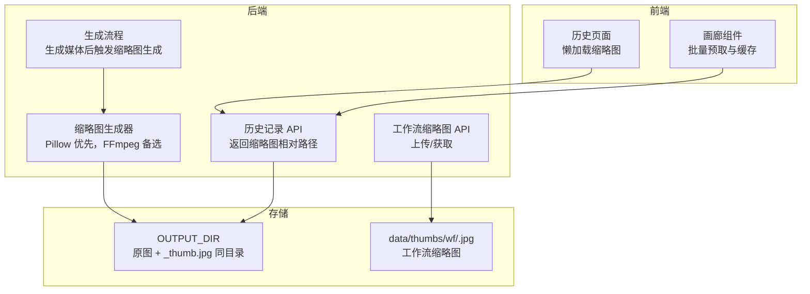
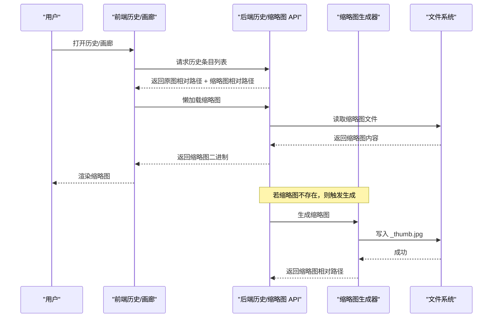
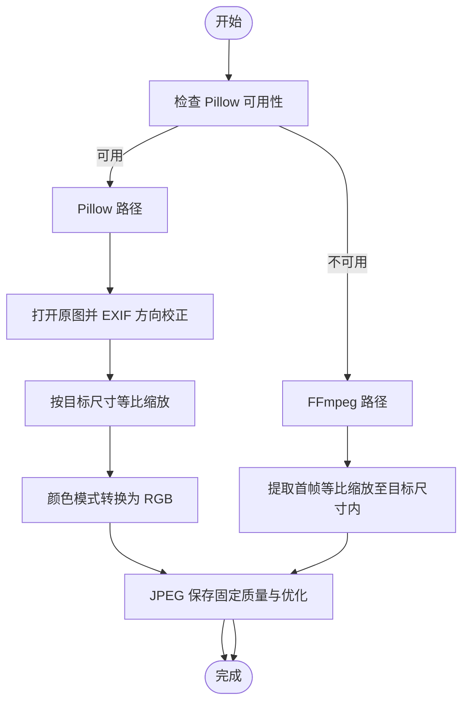
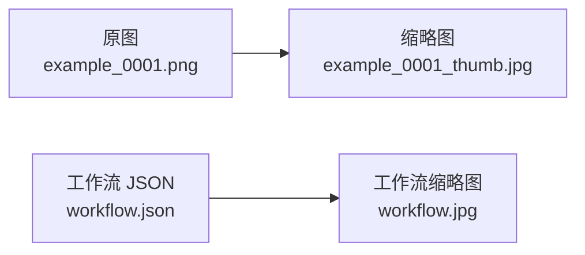
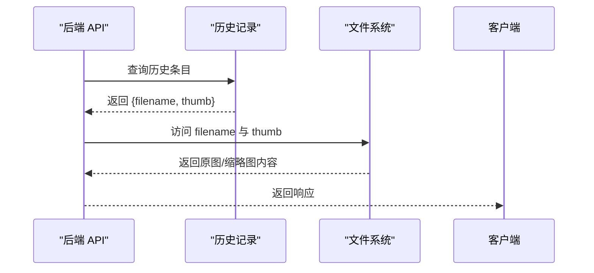
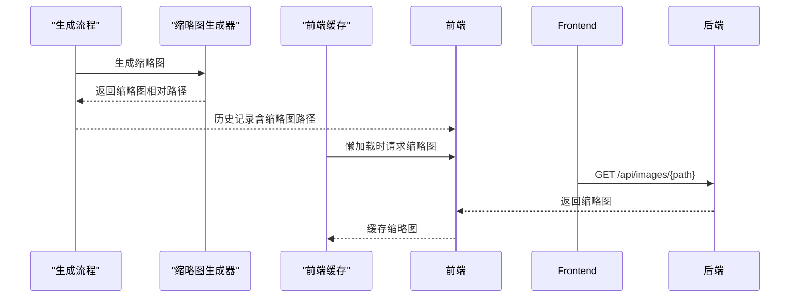
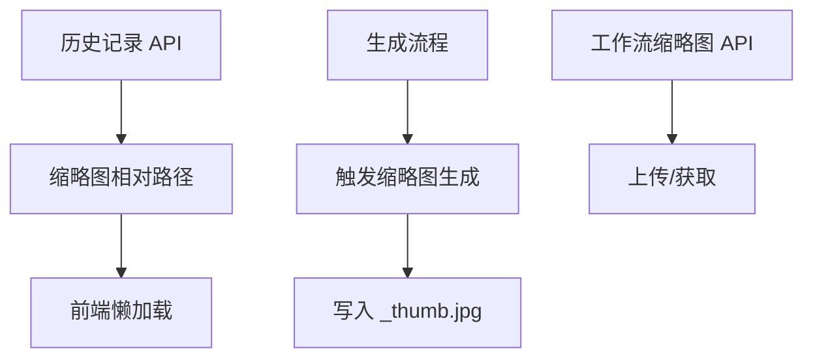

# 缩略图系统

<cite>
**本文档引用的文件**
- [app.py](file://app.py)
- [history.js](file://static/js/modules/history.js)
- [test_history_api.py](file://tests/test_history_api.py)
- [test_image_protection.py](file://tests/test_image_protection.py)
- [test_logs_api.py](file://tests/test_logs_api.py)
- [test_video_editor_ui.py](file://tests/test_video_editor_ui.py)
</cite>

## 目录
1. [简介](#简介)
2. [项目结构](#项目结构)
3. [核心组件](#核心组件)
4. [架构总览](#架构总览)
5. [详细组件分析](#详细组件分析)
6. [依赖关系分析](#依赖关系分析)
7. [性能考虑](#性能考虑)
8. [故障排除指南](#故障排除指南)
9. [结论](#结论)
10. [附录](#附录)

## 简介
本文件面向 Ez ComfyUI Showcase 的缩略图系统，系统性阐述 thumbs 目录的存储结构、缩略图生成流程（尺寸规格、格式转换、质量控制）、生成算法（自动缩放、裁剪策略、颜色空间转换、压缩优化）、缓存机制（策略、过期时间、内存与磁盘优化）、与原图的对应关系管理（文件名映射、元数据关联、路径解析），以及预生成与懒加载策略（批量生成、异步处理、错误恢复）。同时提供性能监控与调优建议，帮助在保证用户体验的同时降低资源消耗。

## 项目结构
缩略图系统主要涉及以下关键位置与模块：
- 输出目录下的历史记录与媒体：OUTPUT_DIR 下的生成产物与缩略图同目录存放，缩略图命名规则为“原文件名_base64编码或序号”+“_thumb.jpg”，与原图共享相对路径层级。
- 工作流缩略图：工作流元数据中可上传独立的缩略图，保存于 data/thumbs/wf 目录，通过 API 进行上传与获取。
- 前端交互：历史详情与画廊组件对缩略图进行懒加载与缓存，避免重复请求与渲染开销。

图表来源
- [app.py:5501-5527](file://app.py#L5501-L5527)
- [app.py:6055-6090](file://app.py#L6055-L6090)
- [app.py:7232-7265](file://app.py#L7232-L7265)
- [app.py:8361-8370](file://app.py#L8361-L8370)

章节来源
- [app.py:5501-5527](file://app.py#L5501-L5527)
- [app.py:6055-6090](file://app.py#L6055-L6090)
- [app.py:7232-7265](file://app.py#L7232-L7265)
- [app.py:8361-8370](file://app.py#L8361-L8370)

## 核心组件
- 缩略图生成器
  - Pillow 路径：读取原图，自动 EXIF 方向校正，按目标尺寸进行高质量缩放，确保颜色模式统一为 RGB，最后以 JPEG 保存并设置质量参数与优化选项。
  - FFmpeg 路径：当 Pillow 不可用或原图为视频时，使用 FFmpeg 提取首帧，按目标尺寸等比缩小至不超过目标尺寸的最大边，采用固定质量参数输出。
- 存储与命名
  - 输出目录下，缩略图与原图同目录，文件名为“原文件名_base64或序号”+“_thumb.jpg”。工作流缩略图位于 data/thumbs/wf，文件名为“工作流名.ext”。
- 对应关系与路径解析
  - 历史记录 API 返回字段包含原图相对路径与缩略图相对路径；前端通过 API 拉取并渲染，支持懒加载与缓存。
- 错误处理与降级
  - Pillow 不可用时跳过图片类缩略图生成，转而尝试 FFmpeg；无效图像文件不产生噪声日志；视频记录在无法探测尺寸时回退到缩略图尺寸。

章节来源
- [app.py:6022-6052](file://app.py#L6022-L6052)
- [app.py:6055-6090](file://app.py#L6055-L6090)
- [app.py:1333-1348](file://app.py#L1333-L1348)
- [app.py:1558-1560](file://app.py#L1558-L1560)
- [app.py:2266-2267](file://app.py#L2266-L2267)

## 架构总览
缩略图系统由“生成—存储—访问—缓存”四层构成，前后端协同完成从生成到展示的全链路。

图表来源
- [app.py:5501-5527](file://app.py#L5501-L5527)
- [app.py:6055-6090](file://app.py#L6055-L6090)
- [app.py:8361-8370](file://app.py#L8361-L8370)

## 详细组件分析

### 组件A：缩略图生成算法
- 尺寸规格
  - 固定目标尺寸：400×400（以较短边为准进行等比缩放）。
- 自动缩放与裁剪
  - 使用高质量重采样算法进行缩放；对于视频，按目标尺寸等比缩小至不超过目标尺寸的最大边，不进行额外裁剪。
- 颜色空间转换
  - 统一转换为 RGB；若原图包含透明通道，使用白色背景进行合成后再转 RGB。
- 质量控制与压缩
  - JPEG 保存，设置固定质量参数与优化选项，兼顾体积与清晰度。
- 兼容性与降级
  - Pillow 不可用时，尝试 FFmpeg；若原图为不支持的图片扩展名则直接返回空缩略图。

图表来源
- [app.py:6022-6052](file://app.py#L6022-L6052)
- [app.py:6055-6090](file://app.py#L6055-L6090)

章节来源
- [app.py:5903-5904](file://app.py#L5903-L5904)
- [app.py:6022-6052](file://app.py#L6022-L6052)
- [app.py:6055-6090](file://app.py#L6055-L6090)

### 组件B：存储结构与命名规范
- 输出目录（OUTPUT_DIR）
  - 原图与缩略图同目录存放，缩略图文件名为“原文件名_base64或序号”+“_thumb.jpg”，保持与原图相同的相对路径层级，便于后续解析与访问。
- 工作流缩略图（data/thumbs/wf）
  - 文件名为“工作流名.ext”，扩展名受控（仅允许特定图片类型），通过专用 API 上传与获取，用于工作流卡片展示。

图表来源
- [app.py:6055-6065](file://app.py#L6055-L6065)
- [app.py:1333-1348](file://app.py#L1333-L1348)
- [app.py:7232-7251](file://app.py#L7232-L7251)

章节来源
- [app.py:6055-6065](file://app.py#L6055-L6065)
- [app.py:1333-1348](file://app.py#L1333-L1348)
- [app.py:7232-7251](file://app.py#L7232-L7251)

### 组件C：与原图的对应关系管理
- 文件名映射
  - 缩略图基于原图文件名派生，确保稳定的一一对应关系。
- 元数据关联
  - 历史记录 API 返回原图与缩略图的相对路径，前端据此进行懒加载与展示。
- 路径解析机制
  - 前端通过 API 获取的相对路径拼接后端静态服务地址，实现安全、可控的访问。

图表来源
- [app.py:1558-1560](file://app.py#L1558-L1560)
- [app.py:2266-2267](file://app.py#L2266-L2267)
- [app.py:8361-8370](file://app.py#L8361-L8370)

章节来源
- [app.py:1558-1560](file://app.py#L1558-L1560)
- [app.py:2266-2267](file://app.py#L2266-L2267)
- [app.py:8361-8370](file://app.py#L8361-L8370)

### 组件D：预生成与懒加载策略
- 预生成
  - 在生成流程结束时同步触发缩略图生成，确保历史记录中立即具备缩略图。
- 懒加载
  - 前端在进入页面或滚动到可视区域时再请求缩略图，减少初始加载压力。
- 批量生成与异步处理
  - 对大量历史记录可采用分批处理策略；当前实现为逐条生成，后续可引入队列或后台任务以避免阻塞主线程。
- 错误恢复
  - 当 Pillow 不可用或 FFmpeg 未配置时，系统会记录警告但不中断流程；无效图像文件不会产生噪声日志。

图表来源
- [app.py:5501-5527](file://app.py#L5501-L5527)
- [app.py:6055-6090](file://app.py#L6055-L6090)
- [app.py:8361-8370](file://app.py#L8361-L8370)
- [history.js:134-176](file://static/js/modules/history.js#L134-L176)

章节来源
- [app.py:5501-5527](file://app.py#L5501-L5527)
- [app.py:6055-6090](file://app.py#L6055-L6090)
- [history.js:134-176](file://static/js/modules/history.js#L134-L176)

## 依赖关系分析
- 组件耦合
  - 生成器依赖 Pillow 或 FFmpeg；历史记录 API 依赖文件系统中的缩略图存在性；前端依赖 API 返回的相对路径进行访问。
- 外部依赖
  - Pillow：负责图片类缩略图生成。
  - FFmpeg：负责视频类缩略图生成。
- 接口契约
  - 历史记录 API 返回字段包含原图与缩略图相对路径；工作流缩略图 API 支持上传与获取，扩展名受控。

图表来源
- [app.py:1558-1560](file://app.py#L1558-L1560)
- [app.py:5501-5527](file://app.py#L5501-L5527)
- [app.py:6055-6090](file://app.py#L6055-L6090)
- [app.py:7232-7251](file://app.py#L7232-L7251)

章节来源
- [app.py:1558-1560](file://app.py#L1558-L1560)
- [app.py:5501-5527](file://app.py#L5501-L5527)
- [app.py:6055-6090](file://app.py#L6055-L6090)
- [app.py:7232-7251](file://app.py#L7232-L7251)

## 性能考虑
- 生成速度优化
  - 使用高质量重采样算法与固定质量参数，平衡清晰度与体积；对视频采用首帧提取，避免长时间处理。
- 存储空间管理
  - 缩略图与原图同目录，便于清理；可定期扫描并删除孤立缩略图；限制工作流缩略图扩展名，减少冗余格式。
- 用户体验提升
  - 前端懒加载与缓存命中率优化，减少重复请求；对无效图像文件与非关键日志进行过滤，避免干扰用户。

## 故障排除指南
- Pillow 不可用
  - 现象：图片类缩略图生成失败，系统记录警告但继续运行。
  - 处理：安装 Pillow 或确保运行环境可用。
- FFmpeg 未配置
  - 现象：视频类缩略图生成被跳过，记录警告。
  - 处理：正确配置项目 FFmpeg 路径。
- 无效图像文件
  - 现象：历史记录缩略图为空，且不产生噪声日志。
  - 处理：修复或替换原图文件。
- 视频记录尺寸探测失败
  - 现象：视频记录在无法探测尺寸时回退到缩略图尺寸。
  - 处理：确保视频可被 FFmpeg 正确解码。

章节来源
- [app.py:177-206](file://app.py#L177-L206)
- [app.py:6073-6076](file://app.py#L6073-L6076)
- [app.py:6086-6089](file://app.py#L6086-L6089)
- [test_history_api.py:334-354](file://tests/test_history_api.py#L334-L354)
- [test_history_api.py:356-362](file://tests/test_history_api.py#L356-L362)

## 结论
Ez ComfyUI Showcase 的缩略图系统通过“Pillow 优先、FFmpeg 备选”的双轨策略，实现了对图片与视频的稳定缩略图生成；通过与原图同目录的命名规范与历史记录 API 的路径返回，简化了前端访问与缓存策略。结合懒加载与前端缓存，系统在保证用户体验的同时有效降低了带宽与计算压力。未来可在批量生成与异步处理方面进一步优化，以应对更大规模的历史数据。

## 附录
- 关键实现参考
  - 缩略图生成器与尺寸、格式、质量控制：[app.py:6022-6052](file://app.py#L6022-L6052)、[app.py:6055-6090](file://app.py#L6055-L6090)
  - 工作流缩略图上传与获取：[app.py:7232-7251](file://app.py#L7232-L7251)
  - 历史记录 API 返回字段与懒加载触发点：[app.py:1558-1560](file://app.py#L1558-L1560)、[app.py:2266-2267](file://app.py#L2266-L2267)
  - 前端历史详情缓存与懒加载：[history.js:134-176](file://static/js/modules/history.js#L134-L176)
- 测试验证
  - 缩略图日志噪声过滤与降级行为：[test_logs_api.py:85](file://tests/test_logs_api.py#L85)
  - 无效输出文件不污染日志：[test_history_api.py:334-354](file://tests/test_history_api.py#L334-L354)
  - 缺失 Pillow 不中断流程：[test_history_api.py:356-362](file://tests/test_history_api.py#L356-L362)
  - 视频记录尺寸回退逻辑：[test_history_api.py:428](file://tests/test_history_api.py#L428)、[test_history_api.py:455](file://tests/test_history_api.py#L455)
  - 预览保护使用缩略图尺寸：[test_image_protection.py:38](file://tests/test_image_protection.py#L38)
  - 视频时间轴缩略图样式：[test_video_editor_ui.py:93](file://tests/test_video_editor_ui.py#L93)