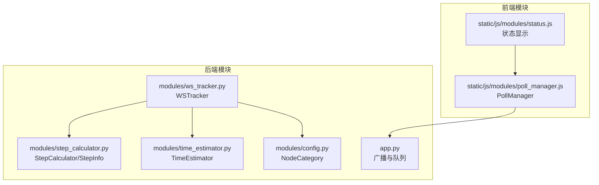
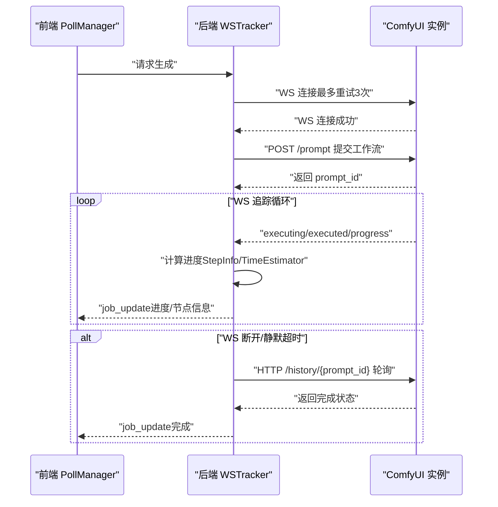
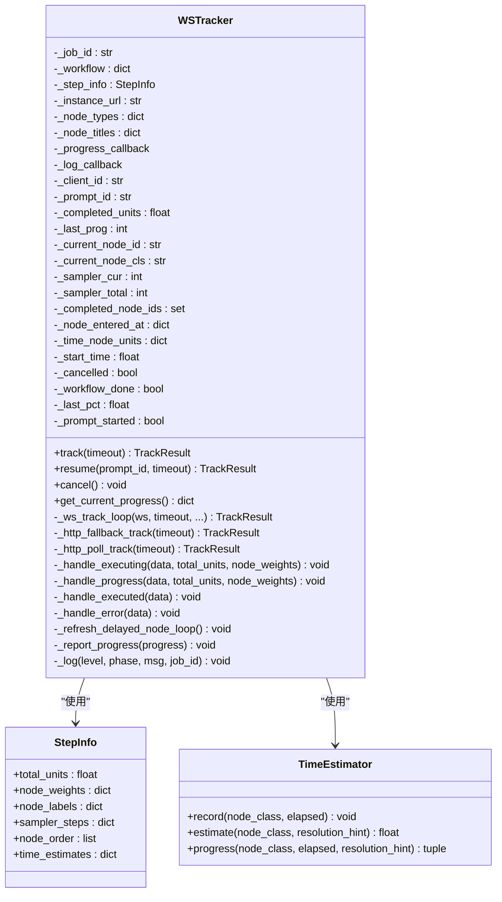
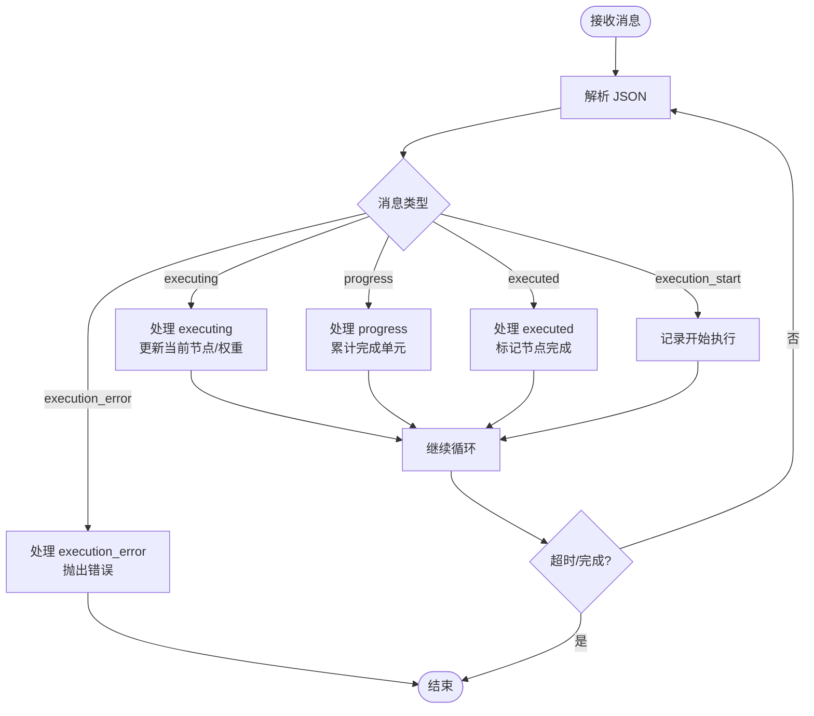
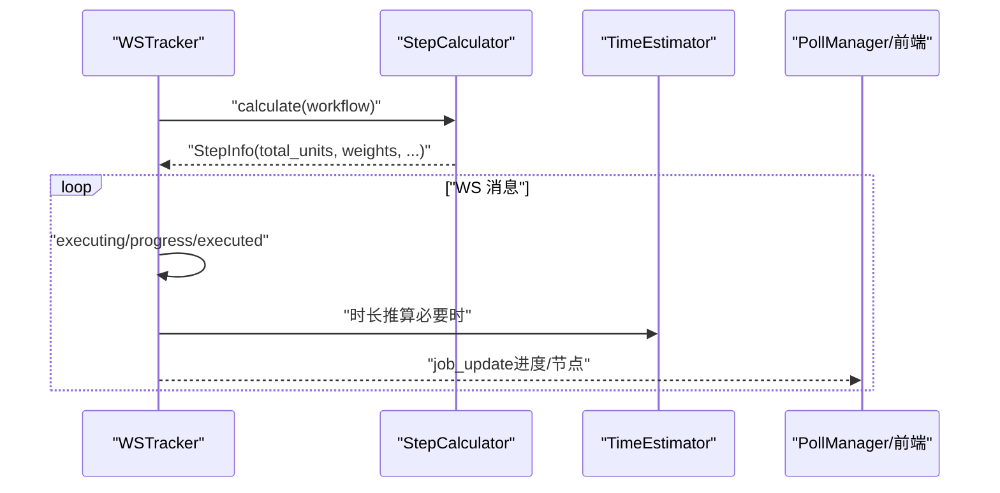
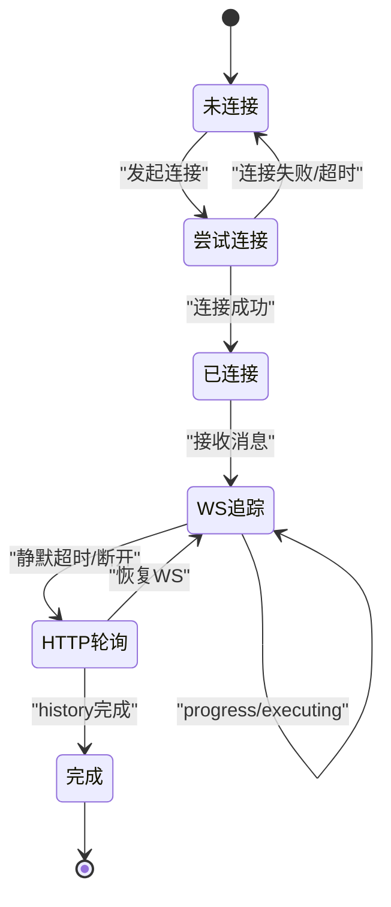
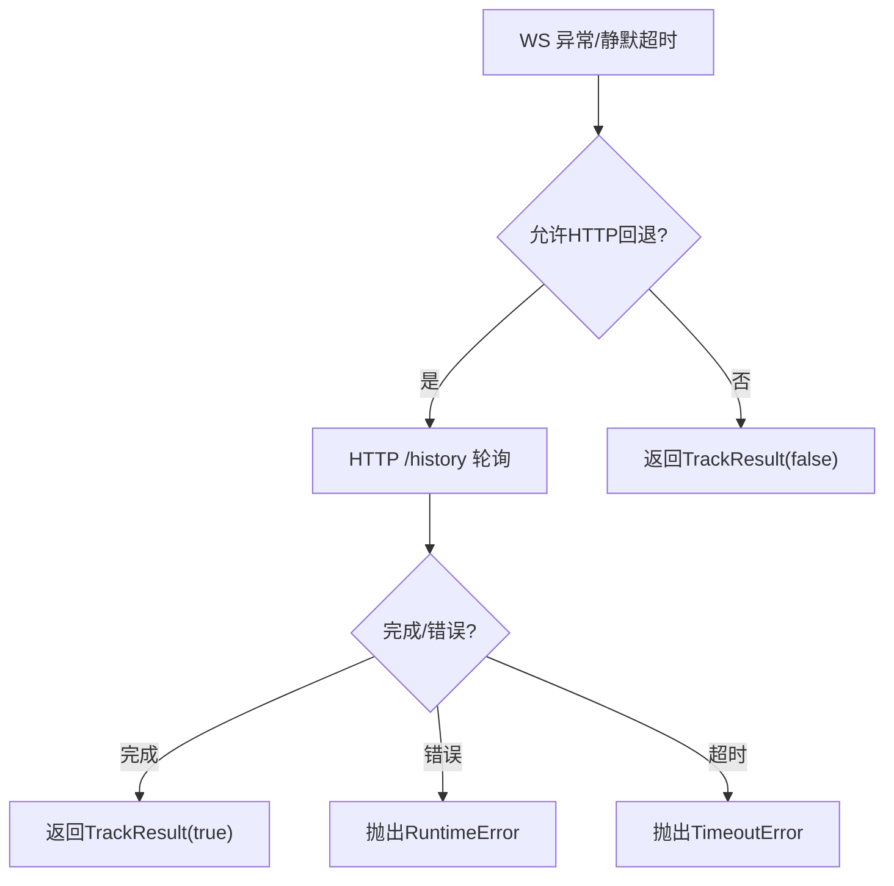
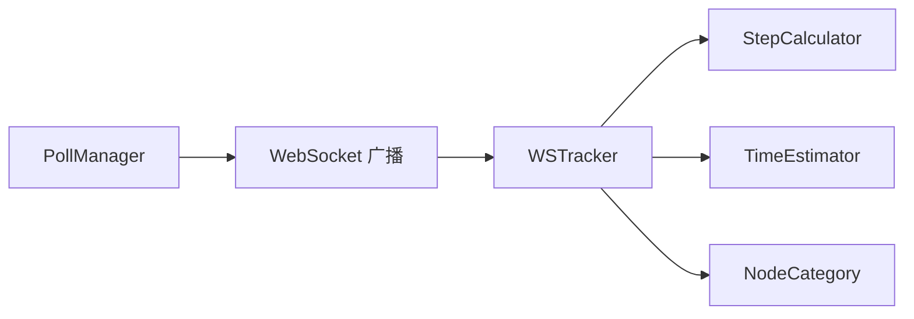

# WebSocket 跟踪器 (WSTracker)

<cite>
**本文档引用的文件**
- [ws_tracker.py](file://modules/ws_tracker.py)
- [step_calculator.py](file://modules/step_calculator.py)
- [time_estimator.py](file://modules/time_estimator.py)
- [config.py](file://modules/config.py)
- [app.py](file://app.py)
- [poll_manager.js](file://static/js/modules/poll_manager.js)
- [status.js](file://static/js/modules/status.js)
- [test_progress_calculation.py](file://tests/test_progress_calculation.py)
- [v4.0-refactor-pipeline.md](file://docs/v4.0-refactor-pipeline.md)
</cite>

## 目录
1. [简介](#简介)
2. [项目结构](#项目结构)
3. [核心组件](#核心组件)
4. [架构总览](#架构总览)
5. [详细组件分析](#详细组件分析)
6. [依赖关系分析](#依赖关系分析)
7. [性能考量](#性能考量)
8. [故障排查指南](#故障排查指南)
9. [结论](#结论)
10. [附录](#附录)

## 简介
本文件为 Ez ComfyUI Showcase 的 WebSocket 跟踪器模块（WSTracker）提供全面技术文档。该模块负责与 ComfyUI 实例建立 WebSocket 连接，实时追踪生成进度，处理断线退化为 HTTP 轮询，以及在异常情况下进行超时检测与错误处理。文档涵盖协议设计、状态广播机制、连接管理、错误处理、进度跟踪算法、实时数据传输、断线重连策略与超时处理，并提供协议规范、消息序列图、状态机图、类结构图与调用关系图，同时给出配置项说明、使用示例、调试技巧与性能优化建议。

## 项目结构
WSTracker 模块位于 modules 目录下，与进度计算引擎（StepCalculator）、时长推算器（TimeEstimator）以及节点分类配置（config.NodeCategory）协同工作。前端通过 PollManager.js 与 WebSocket 服务交互，实现作业状态的实时推送与回退轮询。

**图表来源**
- [ws_tracker.py:158-405](file://modules/ws_tracker.py#L158-L405)
- [step_calculator.py:43-146](file://modules/step_calculator.py#L43-L146)
- [time_estimator.py:14-107](file://modules/time_estimator.py#L14-L107)
- [config.py:11-56](file://modules/config.py#L11-L56)
- [poll_manager.js:25-218](file://static/js/modules/poll_manager.js#L25-L218)
- [status.js:330-387](file://static/js/modules/status.js#L330-L387)

**章节来源**
- [ws_tracker.py:158-405](file://modules/ws_tracker.py#L158-L405)
- [step_calculator.py:43-146](file://modules/step_calculator.py#L43-L146)
- [time_estimator.py:14-107](file://modules/time_estimator.py#L14-L107)
- [config.py:11-56](file://modules/config.py#L11-L56)
- [poll_manager.js:25-218](file://static/js/modules/poll_manager.js#L25-L218)
- [status.js:330-387](file://static/js/modules/status.js#L330-L387)

## 核心组件
- WSTracker：WebSocket 连接、工作流提交、实时进度追踪、断线退化 HTTP 轮询、超时检测与错误处理。
- StepCalculator/StepInfo：基于工作流拓扑与节点类型计算总单元数、节点权重、采样步数与时间估算。
- TimeEstimator：为不发送 progress 事件的节点提供时长推算与进度估计。
- NodeCategory：节点分类表，决定权重分配与进度计算策略。
- PollManager：前端 WebSocket 客户端，负责连接、消息处理、断线重连与 HTTP 轮询回退。
- 状态显示模块：根据作业状态与进度更新 UI。

**章节来源**
- [ws_tracker.py:160-405](file://modules/ws_tracker.py#L160-L405)
- [step_calculator.py:20-146](file://modules/step_calculator.py#L20-L146)
- [time_estimator.py:14-107](file://modules/time_estimator.py#L14-L107)
- [config.py:11-56](file://modules/config.py#L11-L56)
- [poll_manager.js:25-218](file://static/js/modules/poll_manager.js#L25-L218)

## 架构总览
WSTracker 作为后端进度追踪的核心，负责：
- 建立与 ComfyUI 的 WebSocket 连接（最多重试 3 次）
- 提交工作流并获取 prompt_id
- 实时接收 executing/progress/executed/execution_error/execution_start 等消息
- 基于 StepInfo 与 TimeEstimator 计算进度
- 在无消息或连接断开时退化为 HTTP 轮询 /history/{prompt_id}
- 超时检测与错误处理

前端 PollManager 通过 WebSocket 接收 job_update/log 广播，若 WebSocket 不可用则以 3 秒间隔回退轮询。

**图表来源**
- [ws_tracker.py:307-366](file://modules/ws_tracker.py#L307-L366)
- [ws_tracker.py:424-564](file://modules/ws_tracker.py#L424-L564)
- [poll_manager.js:161-218](file://static/js/modules/poll_manager.js#L161-L218)

**章节来源**
- [ws_tracker.py:282-366](file://modules/ws_tracker.py#L282-L366)
- [ws_tracker.py:424-564](file://modules/ws_tracker.py#L424-L564)
- [poll_manager.js:161-218](file://static/js/modules/poll_manager.js#L161-L218)

## 详细组件分析

### WSTracker 类结构与职责
WSTracker 负责：
- 连接管理：构建 WS URL、重试连接、超时控制
- 工作流提交：POST /prompt 获取 prompt_id
- 实时追踪：处理 executing/progress/executed/execution_error/execution_start
- 进度计算：结合 StepInfo 与 TimeEstimator
- 断线退化：WS 无响应或断开时退化为 HTTP 轮询
- 超时与错误：PromptStartTimeout、execution_error 等

**图表来源**
- [ws_tracker.py:160-405](file://modules/ws_tracker.py#L160-L405)
- [step_calculator.py:20-41](file://modules/step_calculator.py#L20-L41)
- [time_estimator.py:14-107](file://modules/time_estimator.py#L14-L107)

**章节来源**
- [ws_tracker.py:160-405](file://modules/ws_tracker.py#L160-L405)
- [step_calculator.py:20-41](file://modules/step_calculator.py#L20-L41)
- [time_estimator.py:14-107](file://modules/time_estimator.py#L14-L107)

### WebSocket 协议与消息格式
- 连接建立：将 HTTP URL 转换为 ws/wss，并附加 clientId 查询参数。
- 消息类型：
  - executing：节点开始执行，data.node 为目标节点 ID；当 node=null 时表示工作流完成。
  - progress：节点进度更新，data.node、data.value、data.max。
  - executed：节点执行完成，data.node。
  - execution_error：执行错误，携带异常信息。
  - execution_start：工作流开始执行。
- 过滤：仅处理与当前 prompt_id 对应的消息，避免多任务实例干扰。

**图表来源**
- [ws_tracker.py:514-541](file://modules/ws_tracker.py#L514-L541)
- [ws_tracker.py:634-758](file://modules/ws_tracker.py#L634-L758)

**章节来源**
- [ws_tracker.py:514-541](file://modules/ws_tracker.py#L514-L541)
- [ws_tracker.py:634-758](file://modules/ws_tracker.py#L634-L758)

### 进度跟踪算法与状态同步
- StepInfo 计算：
  - 采样器/超分器节点：按有效步数分配权重，占总预算的 90%，其余节点共享 10%。
  - 无 steps 的超分器：使用 TimeEstimator 估算耗时，作为时长推算节点。
  - 普通节点：权重为 1，按比例分配。
- 进度累积：
  - progress 事件：按 (cur - last_prog) / max * weight 累加。
  - executing 切换：标记上一个非 progress 节点完成（除采样/超分外）。
  - executed 事件：标记节点完成并记录耗时。
- 状态同步：
  - 前端通过 PollManager 接收 job_update，按状态变化触发 UI 更新与 Toast 提示。

**图表来源**
- [step_calculator.py:61-146](file://modules/step_calculator.py#L61-L146)
- [time_estimator.py:41-107](file://modules/time_estimator.py#L41-L107)
- [ws_tracker.py:634-758](file://modules/ws_tracker.py#L634-L758)
- [poll_manager.js:235-307](file://static/js/modules/poll_manager.js#L235-L307)

**章节来源**
- [step_calculator.py:61-146](file://modules/step_calculator.py#L61-L146)
- [time_estimator.py:41-107](file://modules/time_estimator.py#L41-L107)
- [ws_tracker.py:634-758](file://modules/ws_tracker.py#L634-L758)
- [poll_manager.js:235-307](file://static/js/modules/poll_manager.js#L235-L307)

### 连接管理与断线重连策略
- WS 连接：最多重试 3 次，每次间隔 2 秒；open_timeout 10 秒。
- WS 静默超时：300 秒无消息则退化为 HTTP 轮询。
- Prompt 启动超时：提交后 45 秒内未收到执行开始消息则抛出 PromptStartTimeout。
- 断线处理：捕获 ConnectionClosed 或 recv 超时，退化 HTTP 轮询。
- 前端重连：PollManager 在 WS 关闭后 5 秒重连，并发送 ping 保持心跳。

**图表来源**
- [ws_tracker.py:307-366](file://modules/ws_tracker.py#L307-L366)
- [ws_tracker.py:424-564](file://modules/ws_tracker.py#L424-L564)
- [poll_manager.js:161-218](file://static/js/modules/poll_manager.js#L161-L218)

**章节来源**
- [ws_tracker.py:307-366](file://modules/ws_tracker.py#L307-L366)
- [ws_tracker.py:424-564](file://modules/ws_tracker.py#L424-L564)
- [poll_manager.js:161-218](file://static/js/modules/poll_manager.js#L161-L218)

### 错误处理与超时机制
- PromptSubmitError：提交工作流失败时抛出。
- PromptStartTimeout：提交后超过 45 秒未开始执行。
- execution_error：ComfyUI 抛出执行错误，WSTracker 抛出 RuntimeError。
- HTTP 轮询：在 WS 异常或静默超时时退化，轮询 /history/{prompt_id} 直至完成或超时。
- 前端错误：WS 错误日志记录，自动重连。

**图表来源**
- [ws_tracker.py:363-366](file://modules/ws_tracker.py#L363-L366)
- [ws_tracker.py:588-631](file://modules/ws_tracker.py#L588-L631)
- [ws_tracker.py:782-794](file://modules/ws_tracker.py#L782-L794)

**章节来源**
- [ws_tracker.py:363-366](file://modules/ws_tracker.py#L363-L366)
- [ws_tracker.py:588-631](file://modules/ws_tracker.py#L588-L631)
- [ws_tracker.py:782-794](file://modules/ws_tracker.py#L782-L794)

## 依赖关系分析
- WSTracker 依赖 StepCalculator 与 TimeEstimator 进行进度与耗时计算。
- NodeCategory 提供节点分类，影响权重与进度策略。
- 前端 PollManager 依赖后端广播接口，实现作业状态的实时展示与回退轮询。

**图表来源**
- [ws_tracker.py:19-21](file://modules/ws_tracker.py#L19-L21)
- [step_calculator.py:16-17](file://modules/step_calculator.py#L16-L17)
- [time_estimator.py:9-11](file://modules/time_estimator.py#L9-L11)
- [config.py:11-56](file://modules/config.py#L11-L56)
- [poll_manager.js:161-218](file://static/js/modules/poll_manager.js#L161-L218)

**章节来源**
- [ws_tracker.py:19-21](file://modules/ws_tracker.py#L19-L21)
- [step_calculator.py:16-17](file://modules/step_calculator.py#L16-L17)
- [time_estimator.py:9-11](file://modules/time_estimator.py#L9-L11)
- [config.py:11-56](file://modules/config.py#L11-L56)
- [poll_manager.js:161-218](file://static/js/modules/poll_manager.js#L161-L218)

## 性能考量
- 进度计算精度：StepCalculator 基于拓扑排序与节点类型精确分配权重，减少误差。
- 时长推算：TimeEstimator 使用历史中位数与分辨率启发式，避免极端值影响。
- WS 优先：优先使用 WebSocket 实时推送，HTTP 轮询仅作为兜底，降低服务器压力。
- 超时与重连：合理的超时与重连策略减少无效占用，提升系统稳定性。
- 前端渲染：前端采用增量补丁（patch）更新卡片，避免全量重绘。

[本节为通用指导，无需具体文件分析]

## 故障排查指南
- 连接失败：检查 ComfyUI 地址、防火墙与网络连通性；确认 clientId 参数正确附加。
- 无进度更新：确认工作流包含采样器/超分器节点；检查 progress 事件是否正常发送。
- Prompt 启动超时：检查 ComfyUI 实例负载与资源；适当增加 PROMPT_START_TIMEOUT。
- 执行错误：查看 execution_error 消息中的异常详情；定位具体节点问题。
- 断线重连：前端 PollManager 自动重连；若频繁断开，检查网络质量与 WS 服务器配置。
- HTTP 轮询兜底：确认 /history/{prompt_id} 可访问；检查权限与实例状态。

**章节来源**
- [ws_tracker.py:470-507](file://modules/ws_tracker.py#L470-L507)
- [ws_tracker.py:782-794](file://modules/ws_tracker.py#L782-L794)
- [poll_manager.js:161-218](file://static/js/modules/poll_manager.js#L161-L218)

## 结论
WSTracker 通过 WebSocket 实现实时进度追踪，结合 StepCalculator 与 TimeEstimator 提供高精度进度计算，并在异常情况下可靠地退化为 HTTP 轮询。其断线重连与超时机制确保了系统的鲁棒性，配合前端 PollManager 的广播与回退策略，实现了稳定高效的实时通信体验。建议在生产环境中合理配置超时与重试参数，监控执行错误与断线频率，持续优化节点权重与时间估算策略。

[本节为总结性内容，无需具体文件分析]

## 附录

### WebSocket 协议规范
- 连接 URL：将 HTTP/HTTPS 替换为 ws/wss，并附加 ?clientId=...
- 消息类型：
  - executing：data.node 为目标节点 ID；null 表示完成。
  - progress：data.node、data.value、data.max。
  - executed：data.node。
  - execution_error：异常信息。
  - execution_start：开始执行。
- 过滤：仅处理与当前 prompt_id 对应的消息。

**章节来源**
- [ws_tracker.py:144-155](file://modules/ws_tracker.py#L144-L155)
- [ws_tracker.py:514-541](file://modules/ws_tracker.py#L514-L541)

### 配置选项说明
- WS_RETRY_COUNT：WS 连接重试次数，默认 3。
- WS_RETRY_DELAY：重试间隔（秒），默认 2.0。
- WS_SILENT_TIMEOUT：WS 无消息超时（秒），默认 300.0，触发 HTTP 回退。
- PROMPT_START_TIMEOUT：提交后等待执行开始的最长时间（秒），默认 45.0。
- HTTP_POLL_INTERVAL：HTTP 轮询间隔（秒），默认 3.0。
- PROGRESS_REFRESH_INTERVAL：时长推算节点刷新间隔（秒），默认 5.0。

**章节来源**
- [ws_tracker.py:177-189](file://modules/ws_tracker.py#L177-L189)

### 使用示例与最佳实践
- 初始化：传入 job_id、workflow、StepInfo、instance_url、node_types，并设置进度回调。
- 跟踪：调用 track(timeout) 获取 TrackResult；若需要恢复已有 prompt，使用 resume(prompt_id, timeout)。
- 取消：调用 cancel() 设置取消标志，下次迭代将停止。
- 前端集成：PollManager 自动处理 WS 连接、消息解析与 HTTP 回退；根据 job_update 更新 UI。

**章节来源**
- [ws_tracker.py:190-229](file://modules/ws_tracker.py#L190-L229)
- [ws_tracker.py:282-401](file://modules/ws_tracker.py#L282-L401)
- [poll_manager.js:25-218](file://static/js/modules/poll_manager.js#L25-L218)

### 调试技巧
- 启用日志：通过 _log_callback 输出阶段、级别与消息，便于定位问题。
- 检查节点权重：确认关键节点（采样器/超分器）权重分配合理。
- 监控 WS 事件：观察 executing/progress/executed 是否按预期到达。
- 测试超时场景：使用测试用例模拟静默与启动超时，验证错误处理路径。

**章节来源**
- [ws_tracker.py:885-914](file://modules/ws_tracker.py#L885-L914)
- [test_progress_calculation.py:41-96](file://tests/test_progress_calculation.py#L41-L96)