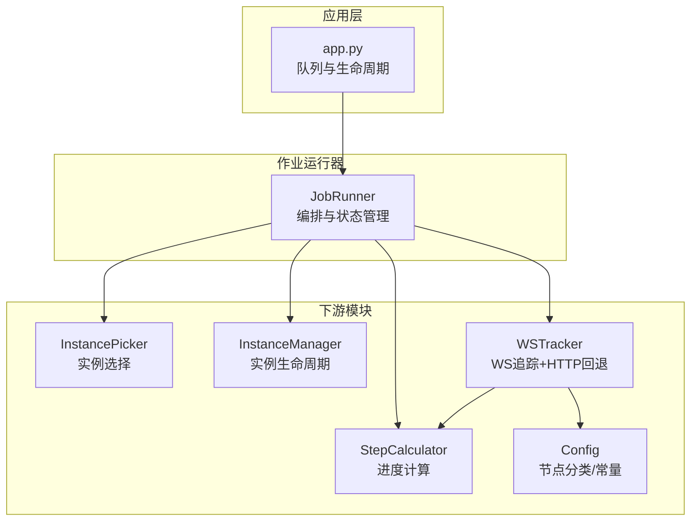
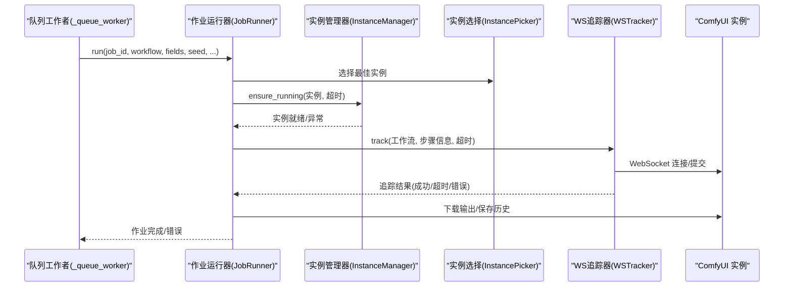
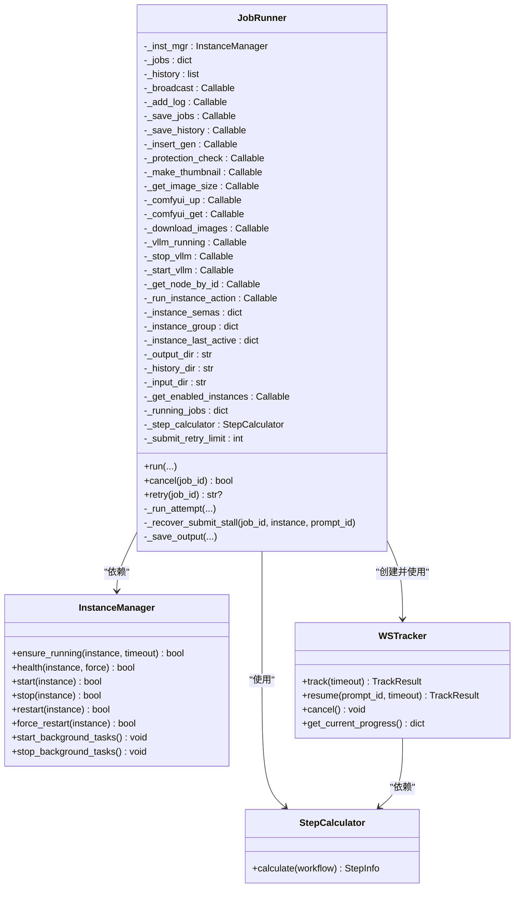
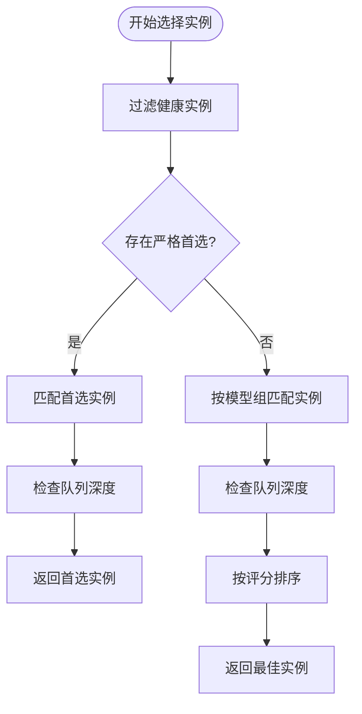
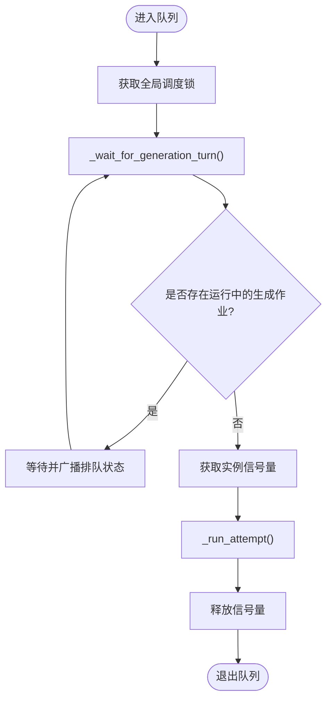
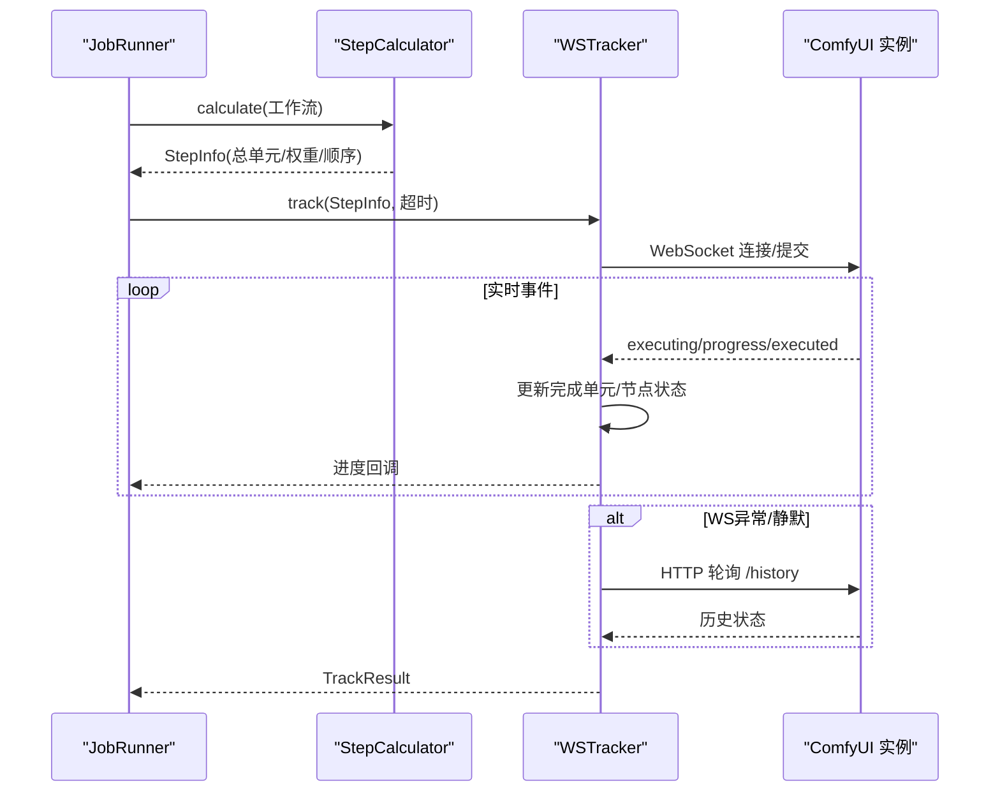
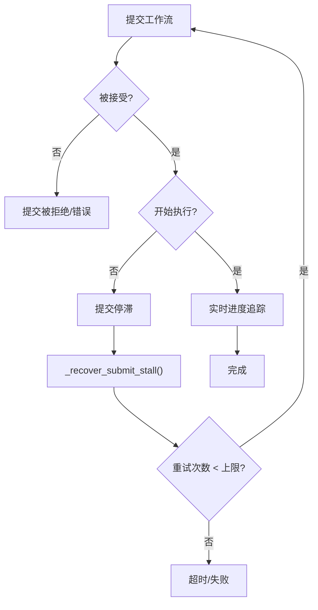
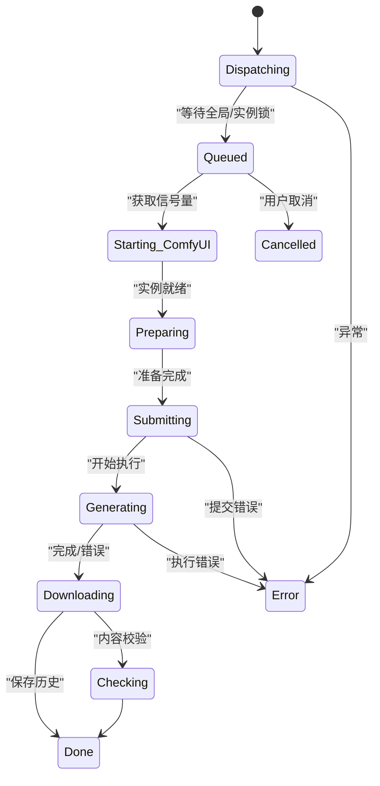
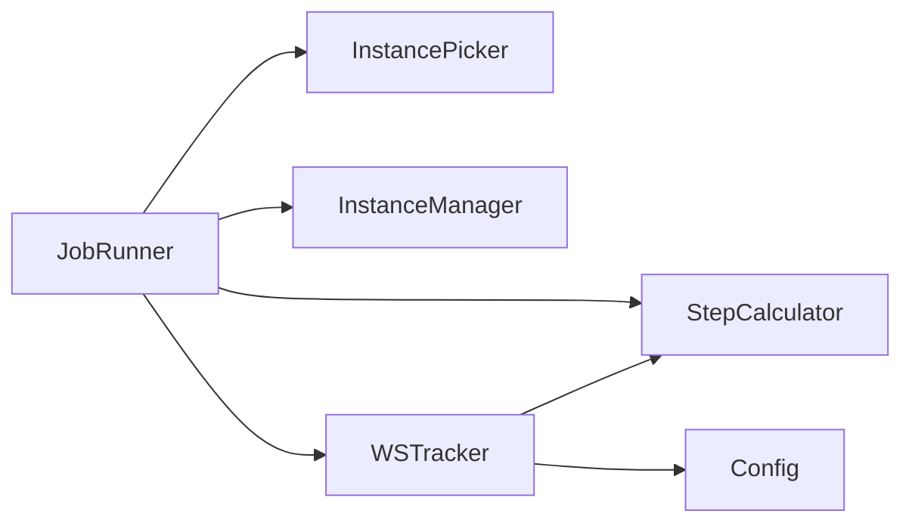

# 作业运行器 (JobRunner)

<cite>
**本文档引用的文件**
- [modules/job_runner.py](file://modules/job_runner.py)
- [modules/instance_picker.py](file://modules/instance_picker.py)
- [modules/instance_manager.py](file://modules/instance_manager.py)
- [modules/step_calculator.py](file://modules/step_calculator.py)
- [modules/ws_tracker.py](file://modules/ws_tracker.py)
- [modules/config.py](file://modules/config.py)
- [app.py](file://app.py)
- [tests/test_job_runner_queue.py](file://tests/test_job_runner_queue.py)
- [tests/test_global_generation_queue.py](file://tests/test_global_generation_queue.py)
</cite>

## 目录
1. [简介](#简介)
2. [项目结构](#项目结构)
3. [核心组件](#核心组件)
4. [架构总览](#架构总览)
5. [详细组件分析](#详细组件分析)
6. [依赖分析](#依赖分析)
7. [性能考量](#性能考量)
8. [故障排除指南](#故障排除指南)
9. [结论](#结论)
10. [附录](#附录)

## 简介
作业运行器（JobRunner）是 Ez ComfyUI Showcase 的核心编排模块，负责将用户提交的生成任务从队列中取出，串行调用下游模块完成一次完整的出图流程。其职责包括：
- 实例选择与并发控制（基于实例信号量）
- vLLM 生命周期管理（启动/停止）
- 工作流准备与验证
- WebSocket 实时进度追踪与 HTTP 回退
- 输出下载与历史记录入库
- 错误处理、重试与恢复
- 作业状态管理与资源清理

## 项目结构
作业运行器位于 modules/job_runner.py，通过依赖注入的方式与应用层交互，不直接依赖 app.py 的任何内容。其协作模块包括：
- 实例选择：modules/instance_picker.py
- 实例管理：modules/instance_manager.py
- 步骤计算：modules/step_calculator.py
- WebSocket 追踪：modules/ws_tracker.py
- 配置常量：modules/config.py

**图表来源**
- [modules/job_runner.py:93-198](file://modules/job_runner.py#L93-L198)
- [modules/instance_picker.py:40-124](file://modules/instance_picker.py#L40-L124)
- [modules/instance_manager.py:43-151](file://modules/instance_manager.py#L43-L151)
- [modules/step_calculator.py:43-146](file://modules/step_calculator.py#L43-L146)
- [modules/ws_tracker.py:160-282](file://modules/ws_tracker.py#L160-L282)
- [modules/config.py:11-152](file://modules/config.py#L11-L152)

**章节来源**
- [modules/job_runner.py:1-100](file://modules/job_runner.py#L1-L100)
- [app.py:999-1050](file://app.py#L999-L1050)

## 核心组件
- JobRunner：作业编排器，负责实例选择、并发控制、vLLM 生命周期、工作流准备、进度追踪、输出保存与状态更新。
- InstancePicker：纯选择函数，根据工作流类型与实例状态返回最佳实例。
- InstanceManager：实例生命周期管理，负责冷启动、健康检查、空闲回收与后台监控。
- StepCalculator：从工作流 JSON 解析节点拓扑，计算总单元与各节点权重，支撑进度计算。
- WSTracker：WebSocket 通信与实时进度追踪，支持 HTTP 回退与断线重连。
- Config：节点分类与状态映射常量。

**章节来源**
- [modules/job_runner.py:93-198](file://modules/job_runner.py#L93-L198)
- [modules/instance_picker.py:40-124](file://modules/instance_picker.py#L40-L124)
- [modules/instance_manager.py:43-151](file://modules/instance_manager.py#L43-L151)
- [modules/step_calculator.py:43-146](file://modules/step_calculator.py#L43-L146)
- [modules/ws_tracker.py:160-282](file://modules/ws_tracker.py#L160-L282)
- [modules/config.py:11-152](file://modules/config.py#L11-L152)

## 架构总览
作业运行器采用“全局串行 + 实例级并发”的混合调度策略：
- 全局队列工作者（_queue_worker）保证生成作业全局串行，避免 A/B 实例同时生成导致资源竞争。
- 实例级信号量（_instance_semas）作为本地安全网，确保同一实例内的任务有序执行。
- 依赖注入设计：JobRunner 通过构造参数接收应用层函数（广播、保存、ComfyUI 通信、vLLM 管理等），实现模块解耦。

**图表来源**
- [app.py:999-1050](file://app.py#L999-L1050)
- [modules/job_runner.py:234-715](file://modules/job_runner.py#L234-L715)
- [modules/instance_manager.py:93-151](file://modules/instance_manager.py#L93-L151)
- [modules/instance_picker.py:40-124](file://modules/instance_picker.py#L40-L124)
- [modules/ws_tracker.py:282-366](file://modules/ws_tracker.py#L282-L366)

## 详细组件分析

### 类结构与依赖注入

**图表来源**
- [modules/job_runner.py:103-198](file://modules/job_runner.py#L103-L198)
- [modules/instance_manager.py:43-151](file://modules/instance_manager.py#L43-L151)
- [modules/ws_tracker.py:160-282](file://modules/ws_tracker.py#L160-L282)
- [modules/step_calculator.py:43-72](file://modules/step_calculator.py#L43-L72)

**章节来源**
- [modules/job_runner.py:103-198](file://modules/job_runner.py#L103-L198)
- [modules/instance_manager.py:43-151](file://modules/instance_manager.py#L43-L151)
- [modules/ws_tracker.py:160-282](file://modules/ws_tracker.py#L160-L282)
- [modules/step_calculator.py:43-72](file://modules/step_calculator.py#L43-L72)

### 实例选择策略
实例选择遵循以下规则：
- 严格首选：某些工作流类型固定路由到特定实例（如 T2I/I2I/视频/放大等）。
- 模型组亲和：优先选择与工作流模型组一致的实例，避免跨组切换带来的显存/权重加载成本。
- 队列深度：综合远端 ComfyUI 队列与本地等待队列，选择负载较低的实例。
- 排序与惩罚：对忙碌实例施加惩罚，避免任务过度集中在单一实例。

**图表来源**
- [modules/instance_picker.py:40-124](file://modules/instance_picker.py#L40-L124)

**章节来源**
- [modules/instance_picker.py:40-124](file://modules/instance_picker.py#L40-L124)

### 队列等待机制
作业运行器实现了“全局串行 + 实例级并发”的双重保障：
- 全局串行：_queue_worker 使用全局调度锁，确保同一时刻只有一个作业在运行。
- 实例级并发：每个实例拥有独立信号量，同一实例内的作业串行执行，不同实例可并行。

**图表来源**
- [modules/job_runner.py:211-232](file://modules/job_runner.py#L211-L232)
- [app.py:1000-1034](file://app.py#L1000-L1034)

**章节来源**
- [modules/job_runner.py:211-232](file://modules/job_runner.py#L211-L232)
- [app.py:999-1050](file://app.py#L999-L1050)

### 进度计算与追踪
- StepCalculator：解析工作流节点拓扑，区分采样器/超分器（长耗时）与普通节点（短耗时），计算总单元与各节点权重。
- WSTracker：通过 WebSocket 实时接收 executing/progress/executed 事件，结合 StepInfo 计算百分比；若 WS 断开或无响应，则退化为 HTTP 轮询 /history。

**图表来源**
- [modules/step_calculator.py:61-146](file://modules/step_calculator.py#L61-L146)
- [modules/ws_tracker.py:282-366](file://modules/ws_tracker.py#L282-L366)
- [modules/ws_tracker.py:424-564](file://modules/ws_tracker.py#L424-L564)

**章节来源**
- [modules/step_calculator.py:61-146](file://modules/step_calculator.py#L61-L146)
- [modules/ws_tracker.py:282-366](file://modules/ws_tracker.py#L282-L366)

### 错误处理与重试机制
- 提交停滞重试：当实例接受 prompt 后长时间无执行事件，触发自动纠错（清理队列、中断、重启实例），并在限定次数内重试。
- 传输瞬时错误：对连接被拒、超时、连接重置等瞬时错误进行识别与容忍，避免误报。
- 保存超时：历史记录保存阶段设置超时保护，防止卡死。
- 取消与清理：支持取消作业，发送中断请求，释放信号量并清理状态。

**图表来源**
- [modules/job_runner.py:576-616](file://modules/job_runner.py#L576-L616)
- [modules/job_runner.py:716-768](file://modules/job_runner.py#L716-L768)

**章节来源**
- [modules/job_runner.py:576-616](file://modules/job_runner.py#L576-L616)
- [modules/job_runner.py:716-768](file://modules/job_runner.py#L716-L768)

### 状态管理与生命周期
- 状态集合：包括 dispatching、queued、starting_comfyui、preparing、submitting、generating、downloading、done、error、cancelled、checking 等。
- 生命周期：由 _queue_worker 创建并运行，每个 job_id 对应一次 run() 调用；完成后更新历史记录并广播。
- 资源清理：无论成功与否，均会释放实例信号量、更新实例活跃时间、按需重启 vLLM。

**图表来源**
- [modules/job_runner.py:77-77](file://modules/job_runner.py#L77-L77)
- [modules/job_runner.py:693-715](file://modules/job_runner.py#L693-L715)

**章节来源**
- [modules/job_runner.py:77-77](file://modules/job_runner.py#L77-L77)
- [modules/job_runner.py:693-715](file://modules/job_runner.py#L693-L715)

## 依赖分析
- 模块耦合：JobRunner 通过依赖注入与应用层解耦，仅依赖下游模块的接口契约。
- 直接依赖：instance_picker、instance_manager、step_calculator、ws_tracker。
- 外部依赖：websockets、urllib、subprocess、asyncio.Semaphore。
- 潜在循环：无直接循环依赖，各模块职责清晰。

**图表来源**
- [modules/job_runner.py:26-33](file://modules/job_runner.py#L26-L33)
- [modules/ws_tracker.py:19-21](file://modules/ws_tracker.py#L19-L21)
- [modules/config.py:11-152](file://modules/config.py#L11-L152)

**章节来源**
- [modules/job_runner.py:26-33](file://modules/job_runner.py#L26-L33)
- [modules/ws_tracker.py:19-21](file://modules/ws_tracker.py#L19-L21)
- [modules/config.py:11-152](file://modules/config.py#L11-L152)

## 性能考量
- 实例选择评分：综合队列深度、模型组亲和与排序，避免热点实例过载。
- 进度计算精度：区分长耗时与短耗时节点，提升 UI 进度反馈准确性。
- WS 与 HTTP 双通道：在 WS 断开或静默时自动回退 HTTP 轮询，兼顾稳定性与性能。
- 超时与重试：合理设置提交停滞重试上限与间隔，避免资源浪费。
- 并发控制：全局串行 + 实例级信号量，平衡吞吐与稳定性。

## 故障排除指南
- 连接被拒/超时：检查 ComfyUI 实例是否正常运行、网络连通性与防火墙设置。
- 提交后无响应：触发自动纠错流程（清理队列、中断、重启实例），必要时更换实例。
- 保存历史超时：检查输出目录权限、磁盘空间与下载函数可用性。
- 任务取消无效：确认已向实例发送 /interrupt，并检查信号量释放。
- 队列卡住：检查全局调度锁与实例信号量状态，必要时重启相关后台任务。

**章节来源**
- [modules/job_runner.py:40-61](file://modules/job_runner.py#L40-L61)
- [modules/job_runner.py:716-768](file://modules/job_runner.py#L716-L768)
- [modules/ws_tracker.py:53-66](file://modules/ws_tracker.py#L53-L66)

## 结论
作业运行器通过清晰的职责划分与严格的依赖注入，实现了稳定高效的生成作业编排。其“全局串行 + 实例级并发”的调度策略、完善的错误处理与重试机制、以及高精度的进度计算，共同保障了系统的可靠性与用户体验。配合实例选择、生命周期管理与 WebSocket 追踪等模块，形成了一套可扩展、可观测、可维护的出图流水线。

## 附录

### 配置选项说明
- 提交重试上限：_submit_retry_limit，默认为 3 次。
- 跟踪超时：默认 900 秒，视频类工作流为 3600 秒。
- 运行中生成状态集合：用于队列等待判断与阻塞检测。
- 节点分类：SAMPLER/UPSCALE/FREE/NORMAL 等，决定权重与进度计算方式。

**章节来源**
- [modules/job_runner.py:75-77](file://modules/job_runner.py#L75-L77)
- [modules/job_runner.py:84-91](file://modules/job_runner.py#L84-L91)
- [modules/config.py:11-79](file://modules/config.py#L11-L79)

### 使用示例
- 应用启动时通过 lifespan 注入 JobRunner 与 InstanceManager，并启动队列工作者与后台任务。
- 队列工作者从全局队列取出作业，调用 JobRunner.run() 执行完整流程。
- 测试用例验证了队列等待、提交停滞重试与取消行为。

**章节来源**
- [app.py:3224-3253](file://app.py#L3224-L3253)
- [app.py:999-1050](file://app.py#L999-L1050)
- [tests/test_job_runner_queue.py:31-203](file://tests/test_job_runner_queue.py#L31-L203)
- [tests/test_global_generation_queue.py:30-75](file://tests/test_global_generation_queue.py#L30-L75)