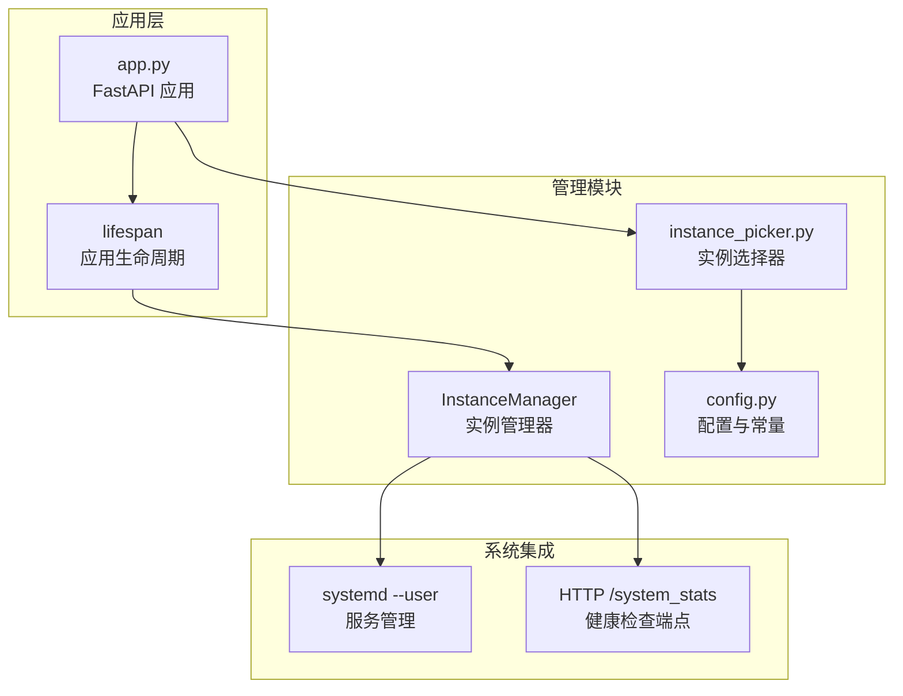
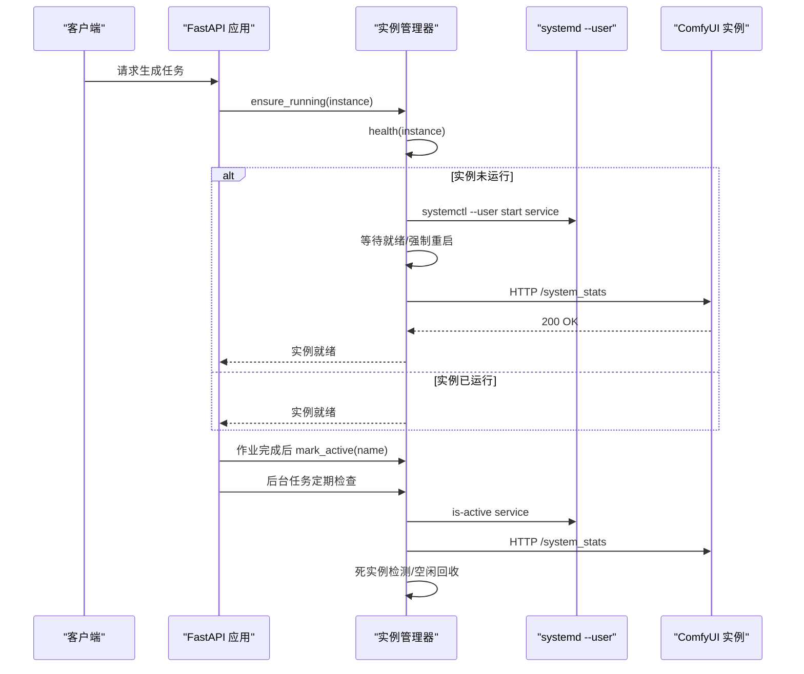
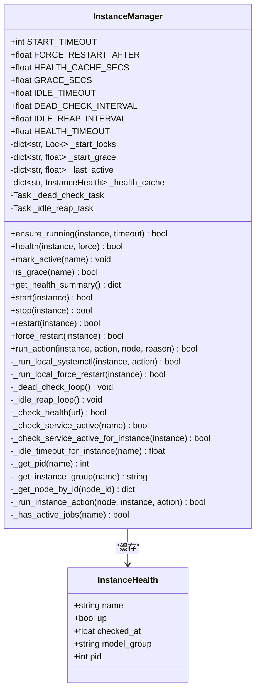
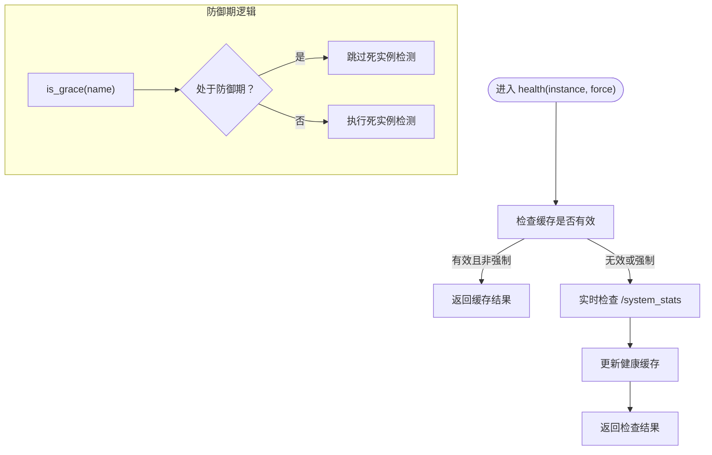
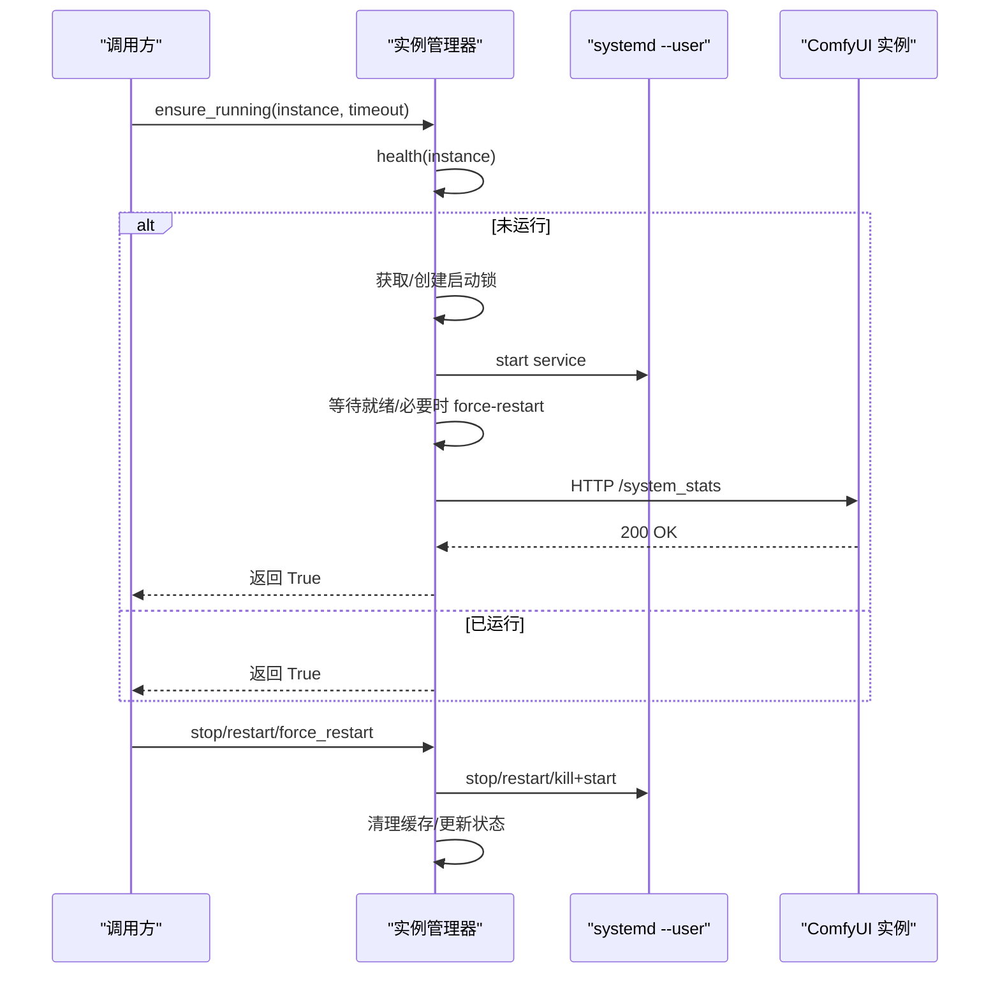
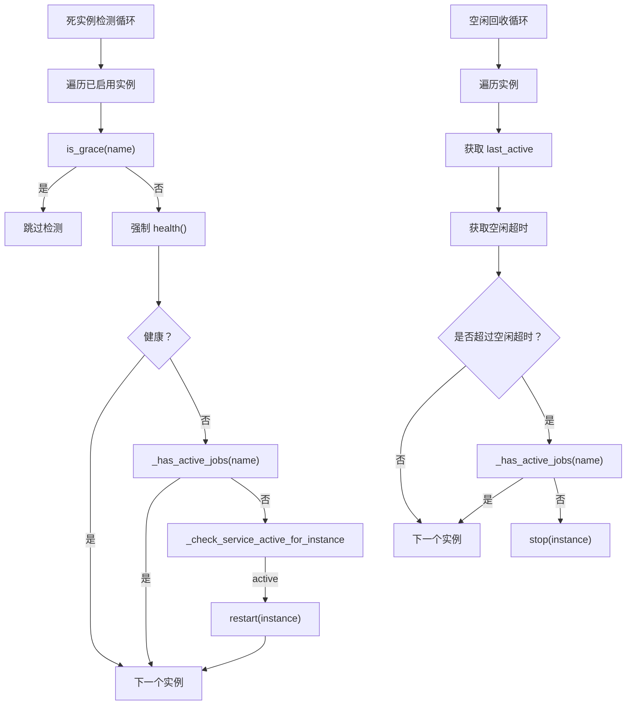
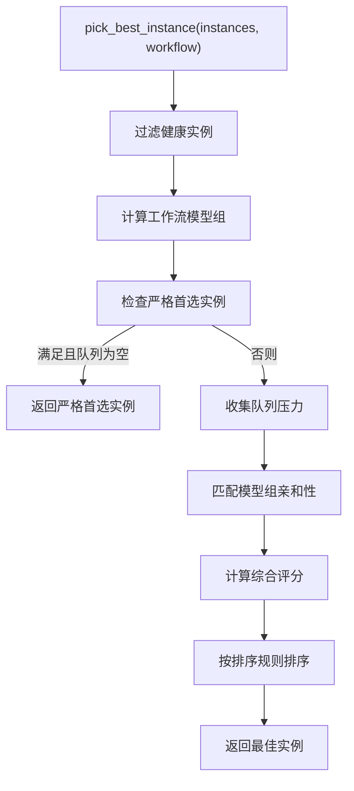
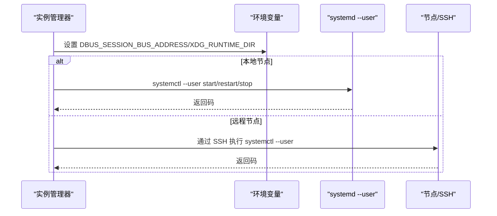
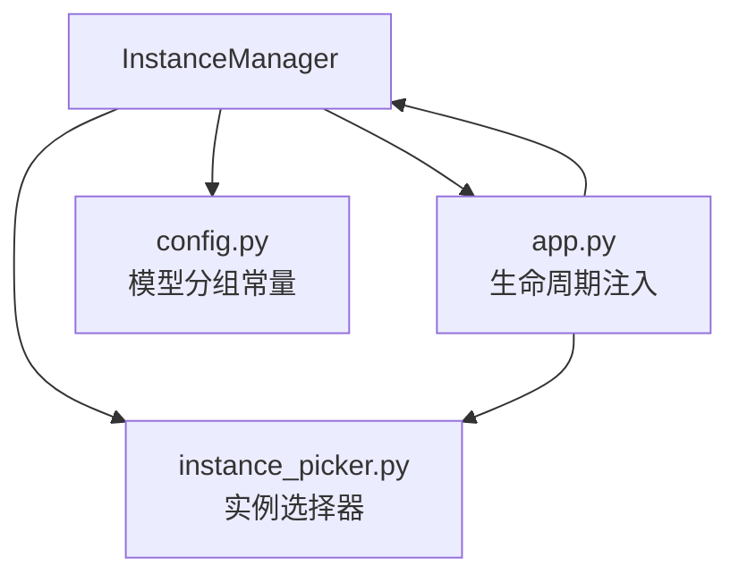

# 实例管理器 (InstanceManager)

<cite>
**本文档引用的文件**
- [modules/instance_manager.py](file://modules/instance_manager.py)
- [app.py](file://app.py)
- [modules/instance_picker.py](file://modules/instance_picker.py)
- [modules/config.py](file://modules/config.py)
- [tests/test_instance_picker.py](file://tests/test_instance_picker.py)
</cite>

## 目录
1. [简介](#简介)
2. [项目结构](#项目结构)
3. [核心组件](#核心组件)
4. [架构概览](#架构概览)
5. [详细组件分析](#详细组件分析)
6. [依赖分析](#依赖分析)
7. [性能考虑](#性能考虑)
8. [故障排除指南](#故障排除指南)
9. [结论](#结论)
10. [附录](#附录)

## 简介
本文件为 Ez ComfyUI Showcase 的实例管理器模块提供完整技术文档。实例管理器负责 ComfyUI 实例的生命周期管理、健康检查、故障恢复、空闲回收、服务发现与负载均衡等核心能力。其设计目标是成为"实例能否使用"的唯一权威，统一管理本地与远程实例的启动、停止、重启与强制重启，并通过健康检查与后台监控保障系统的稳定性与可用性。

## 项目结构
实例管理器位于 modules 目录下，作为独立模块被应用主程序（FastAPI）在生命周期中初始化与注入。与之协作的关键模块包括：
- 实例选择器：基于健康度、队列压力、模型组亲和性进行实例挑选
- 配置模块：提供节点分类与模型分组常量，支撑实例亲和性决策
- 应用主程序：在 FastAPI 生命周期中创建实例管理器实例，注入钩子函数与状态字典

**图表来源**
- [app.py:3203-3239](file://app.py#L3203-L3239)
- [modules/instance_manager.py:43-90](file://modules/instance_manager.py#L43-L90)
- [modules/instance_picker.py:78-101](file://modules/instance_picker.py#L78-L101)
- [modules/config.py:81-111](file://modules/config.py#L81-L111)

**章节来源**
- [app.py:3203-3239](file://app.py#L3203-L3239)
- [modules/instance_manager.py:43-90](file://modules/instance_manager.py#L43-L90)

## 核心组件
- 实例健康快照：记录单实例的健康状态、检查时间、模型组与进程 PID
- 实例管理器：提供启动/停止/重启/强制重启、健康检查、防御期判断、空闲回收、死实例检测等能力
- 实例选择器：结合健康度、队列压力、模型组亲和性与排序规则选择最佳实例
- 配置模块：提供节点分类与模型分组常量，支撑实例亲和性路由

**章节来源**
- [modules/instance_manager.py:23-39](file://modules/instance_manager.py#L23-L39)
- [modules/instance_manager.py:43-90](file://modules/instance_manager.py#L43-L90)
- [modules/instance_picker.py:78-101](file://modules/instance_picker.py#L78-L101)
- [modules/config.py:81-111](file://modules/config.py#L81-L111)

## 架构概览
实例管理器通过 FastAPI 生命周期初始化，注入应用层钩子以统一处理本地与远程实例的生命周期操作。健康检查通过 HTTP 访问 /system_stats 端点，后台监控周期性检测死实例与空闲实例。实例选择器在作业派发阶段综合多种因素选择最优实例。

**图表来源**
- [app.py:3203-3239](file://app.py#L3203-L3239)
- [modules/instance_manager.py:93-151](file://modules/instance_manager.py#L93-L151)
- [modules/instance_manager.py:216-251](file://modules/instance_manager.py#L216-L251)
- [modules/instance_manager.py:334-374](file://modules/instance_manager.py#L334-L374)

## 详细组件分析

### 实例健康快照与管理器类结构
实例健康快照用于缓存单实例的健康状态，包含名称、可访问性、检查时间、模型组与 PID。实例管理器采用单例模式，在应用生命周期中初始化，维护启动去重锁、防御期时间戳、最后活跃时间戳、健康缓存以及后台任务句柄。

**图表来源**
- [modules/instance_manager.py:23-39](file://modules/instance_manager.py#L23-L39)
- [modules/instance_manager.py:43-90](file://modules/instance_manager.py#L43-L90)
- [modules/instance_manager.py:152-182](file://modules/instance_manager.py#L152-L182)
- [modules/instance_manager.py:216-274](file://modules/instance_manager.py#L216-L274)

**章节来源**
- [modules/instance_manager.py:23-39](file://modules/instance_manager.py#L23-L39)
- [modules/instance_manager.py:43-90](file://modules/instance_manager.py#L43-L90)

### 健康检查与防御期机制
健康检查通过 HTTP 访问 /system_stats 端点，使用缓存策略避免频繁探测。防御期用于避免刚启动的实例在短时间内被误判为死实例，期间跳过死实例检测。

**图表来源**
- [modules/instance_manager.py:152-182](file://modules/instance_manager.py#L152-L182)
- [modules/instance_manager.py:194-207](file://modules/instance_manager.py#L194-L207)

**章节来源**
- [modules/instance_manager.py:152-182](file://modules/instance_manager.py#L152-L182)
- [modules/instance_manager.py:194-207](file://modules/instance_manager.py#L194-L207)

### 启动/停止/重启/强制重启流程
实例管理器提供幂等的启动流程，使用去重锁避免并发重复启动；支持普通重启与强制重启（先 KILL -9 再启动）。生命周期动作通过 systemd --user 执行，并在成功后更新内部状态。

**图表来源**
- [modules/instance_manager.py:93-151](file://modules/instance_manager.py#L93-L151)
- [modules/instance_manager.py:216-274](file://modules/instance_manager.py#L216-L274)
- [modules/instance_manager.py:276-318](file://modules/instance_manager.py#L276-L318)

**章节来源**
- [modules/instance_manager.py:93-151](file://modules/instance_manager.py#L93-L151)
- [modules/instance_manager.py:216-274](file://modules/instance_manager.py#L216-L274)
- [modules/instance_manager.py:276-318](file://modules/instance_manager.py#L276-L318)

### 死实例检测与空闲回收
后台任务周期性扫描实例：对处于防御期外且健康检查失败的实例，若 systemd 服务仍处于 active，则触发重启；对超过空闲超时且无活跃作业的实例，执行停止操作。

**图表来源**
- [modules/instance_manager.py:334-374](file://modules/instance_manager.py#L334-L374)
- [modules/instance_manager.py:397-421](file://modules/instance_manager.py#L397-L421)
- [modules/instance_manager.py:423-434](file://modules/instance_manager.py#L423-L434)

**章节来源**
- [modules/instance_manager.py:334-374](file://modules/instance_manager.py#L334-L374)
- [modules/instance_manager.py:397-434](file://modules/instance_manager.py#L397-L434)

### 实例选择器与负载均衡
实例选择器在作业派发阶段综合健康度、队列压力、模型组亲和性与排序规则，优先选择满足条件且压力较小的实例。当存在严格首选实例且队列为空时，优先保持实例稳定。

**图表来源**
- [modules/instance_picker.py:78-101](file://modules/instance_picker.py#L78-L101)
- [modules/instance_picker.py:172-189](file://modules/instance_picker.py#L172-L189)
- [modules/instance_picker.py:208-226](file://modules/instance_picker.py#L208-L226)

**章节来源**
- [modules/instance_picker.py:78-101](file://modules/instance_picker.py#L78-L101)
- [modules/instance_picker.py:172-189](file://modules/instance_picker.py#L172-L189)
- [modules/instance_picker.py:208-226](file://modules/instance_picker.py#L208-L226)

### 与系统服务（systemd）集成
实例管理器通过 systemd --user 命令执行服务管理，支持本地与远程 SSH 连接场景。在 nohup 环境中，需要设置 D-Bus 会话总线地址与运行时目录环境变量以确保 systemctl --user 正常工作。

**图表来源**
- [modules/instance_manager.py:276-318](file://modules/instance_manager.py#L276-L318)
- [app.py:915-949](file://app.py#L915-L949)

**章节来源**
- [modules/instance_manager.py:276-318](file://modules/instance_manager.py#L276-L318)
- [app.py:915-949](file://app.py#L915-L949)

## 依赖分析
- 实例管理器依赖应用主程序在生命周期中注入的状态字典与钩子函数，以统一处理本地与远程实例的生命周期操作
- 实例选择器依赖配置模块提供的模型分组常量，实现基于工作流与实例当前加载模型组的亲和性匹配
- 应用主程序在 FastAPI 生命周期中创建实例管理器实例，并注入节点解析、动作执行、活跃作业判断等回调

**图表来源**
- [app.py:3203-3239](file://app.py#L3203-L3239)
- [modules/instance_manager.py:86-90](file://modules/instance_manager.py#L86-L90)
- [modules/config.py:81-111](file://modules/config.py#L81-L111)
- [modules/instance_picker.py:78-101](file://modules/instance_picker.py#L78-L101)

**章节来源**
- [app.py:3203-3239](file://app.py#L3203-L3239)
- [modules/instance_manager.py:86-90](file://modules/instance_manager.py#L86-L90)
- [modules/config.py:81-111](file://modules/config.py#L81-L111)
- [modules/instance_picker.py:78-101](file://modules/instance_picker.py#L78-L101)

## 性能考虑
- 健康检查缓存：通过 HEALTH_CACHE_SECS 减少 HTTP 探测频率，降低对实例与网络的压力
- 启动去重锁：避免并发请求同时触发启动，减少 systemd 调用次数
- 后台任务间隔：DEAD_CHECK_INTERVAL 与 IDLE_REAP_INTERVAL 控制后台扫描频率，平衡准确性与开销
- 队列压力与亲和性：实例选择器通过队列压力与模型组亲和性减少跨实例切换带来的模型加载成本
- 防御期：GRACE_SECS 避免刚启动实例的误判，减少不必要的重启

[本节为通用性能指导，无需特定文件来源]

## 故障排除指南
- 启动超时：检查 START_TIMEOUT 与 FORCE_RESTART_AFTER 配置，确认 systemd 服务是否正常；查看日志中"启动失败"条目
- 健康检查失败：确认实例 /system_stats 端点可达，检查网络与防火墙设置；查看健康缓存是否过期
- 死实例误判：确认实例是否处于防御期（刚启动），或是否存在活跃作业导致跳过检测
- 空闲回收误杀：调整 IDLE_TIMEOUT 或注入自定义空闲超时提供器，避免在高负载时段回收实例
- 远程实例管理：确认 SSH 配置与 D-Bus 环境变量设置，确保远程 systemctl --user 可用

**章节来源**
- [modules/instance_manager.py:52-60](file://modules/instance_manager.py#L52-L60)
- [modules/instance_manager.py:334-374](file://modules/instance_manager.py#L334-L374)
- [app.py:915-949](file://app.py#L915-L949)

## 结论
实例管理器通过统一的生命周期管理、健康检查与后台监控，为 Ez ComfyUI Showcase 提供了稳定可靠的实例治理能力。结合实例选择器的亲和性与负载均衡策略，系统能够在多实例环境下高效分配任务并维持整体稳定性。通过 systemd 集成与可扩展的钩子机制，实例管理器能够适应本地与远程部署场景，并为后续功能扩展提供清晰边界。

[本节为总结性内容，无需特定文件来源]

## 附录

### 配置选项说明
- START_TIMEOUT：冷启动等待就绪的最大秒数
- FORCE_RESTART_AFTER：冷启动未就绪时强制清理并重启的时间阈值
- HEALTH_CACHE_SECS：健康检查缓存有效期
- GRACE_SECS：启动后的防御期时长，避免误判死实例
- IDLE_TIMEOUT：空闲超时，超过该时间且无活跃作业的实例将被停止
- DEAD_CHECK_INTERVAL：死实例检测循环间隔
- IDLE_REAP_INTERVAL：空闲回收循环间隔
- HEALTH_TIMEOUT：健康检查 HTTP 超时

**章节来源**
- [modules/instance_manager.py:52-60](file://modules/instance_manager.py#L52-L60)

### 使用示例
- 确保实例运行：调用 ensure_running(instance, timeout)，在超时内等待实例就绪
- 手动控制实例：调用 start/stop/restart/force_restart，返回布尔值表示命令是否成功发出
- 获取健康快照：调用 get_health_summary，获取全量实例健康状态

**章节来源**
- [modules/instance_manager.py:93-151](file://modules/instance_manager.py#L93-L151)
- [modules/instance_manager.py:216-251](file://modules/instance_manager.py#L216-L251)
- [modules/instance_manager.py:208-214](file://modules/instance_manager.py#L208-L214)

### 测试参考
- 实例选择器单元测试：验证不同工作流在空闲与有队列情况下的实例选择行为

**章节来源**
- [tests/test_instance_picker.py:17-36](file://tests/test_instance_picker.py#L17-L36)