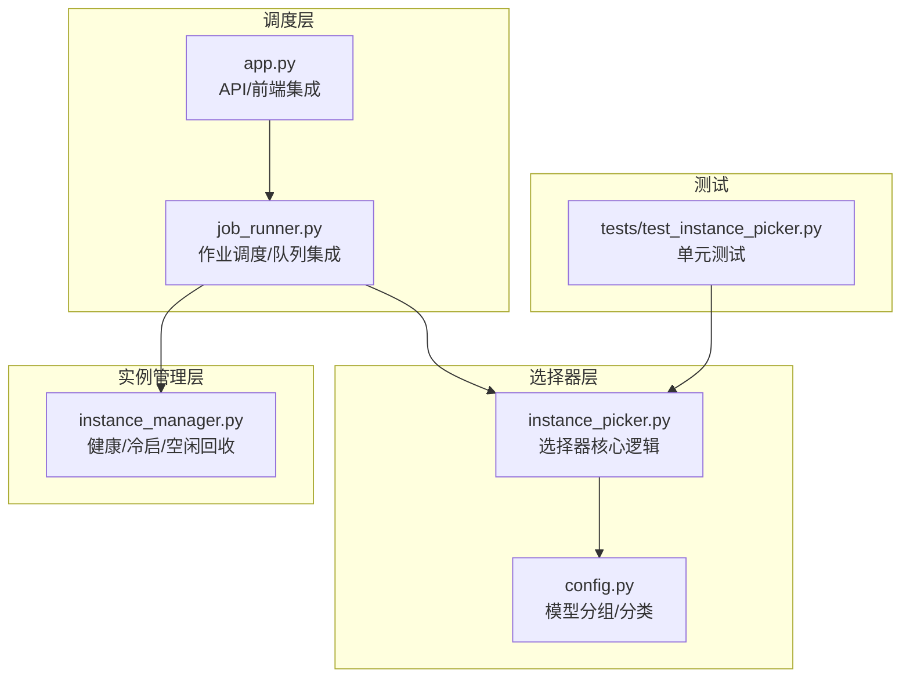
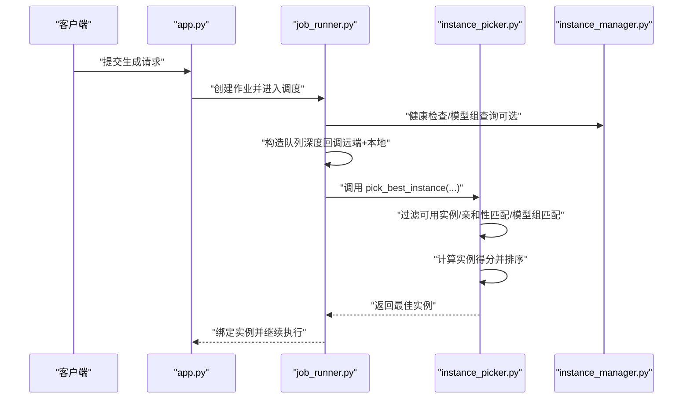
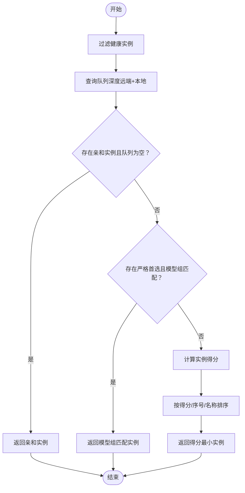
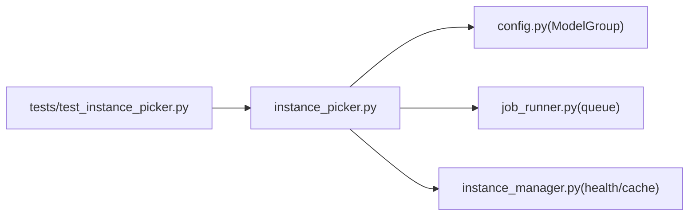
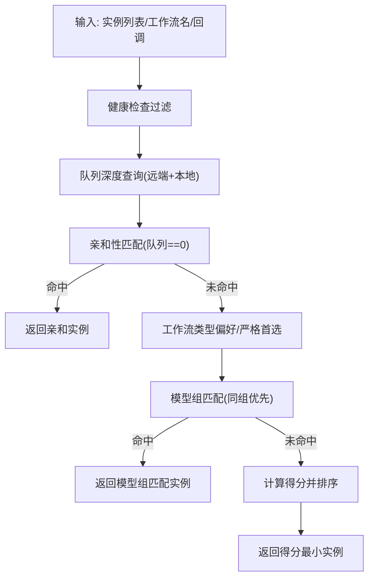

# 实例选择器（InstancePicker）

<cite>
**本文档引用的文件**
- [modules/instance_picker.py](file://modules/instance_picker.py)
- [modules/config.py](file://modules/config.py)
- [modules/instance_manager.py](file://modules/instance_manager.py)
- [modules/job_runner.py](file://modules/job_runner.py)
- [tests/test_instance_picker.py](file://tests/test_instance_picker.py)
- [app.py](file://app.py)
</cite>

## 目录
1. [简介](#简介)
2. [项目结构](#项目结构)
3. [核心组件](#核心组件)
4. [架构总览](#架构总览)
5. [详细组件分析](#详细组件分析)
6. [依赖关系分析](#依赖关系分析)
7. [性能考量](#性能考量)
8. [故障排除指南](#故障排除指南)
9. [结论](#结论)
10. [附录](#附录)

## 简介
本文件为 Ez ComfyUI Showcase 的“实例选择器”（InstancePicker）模块提供系统化技术文档。该模块负责在多实例 ComfyUI 环境中，基于工作流类型、实例健康状态、队列长度与模型组亲和性等因素，选择最优目标实例，从而实现负载均衡、资源利用优化与响应时间控制。文档将深入解释算法设计原理、评分机制、决策流程、配置项与使用方式，并给出性能指标、优化建议与故障排查要点。

## 项目结构
InstancePicker 位于 modules 子目录，围绕以下关键文件协作：
- 实例选择器：modules/instance_picker.py
- 配置与模型分组：modules/config.py
- 实例生命周期与健康检查：modules/instance_manager.py
- 作业调度与队列集成：modules/job_runner.py
- 测试用例：tests/test_instance_picker.py
- 应用层集成入口：app.py

图表来源
- [modules/instance_picker.py:1-227](file://modules/instance_picker.py#L1-L227)
- [modules/config.py:81-111](file://modules/config.py#L81-L111)
- [modules/job_runner.py:316-373](file://modules/job_runner.py#L316-L373)
- [modules/instance_manager.py:152-182](file://modules/instance_manager.py#L152-L182)
- [tests/test_instance_picker.py:17-94](file://tests/test_instance_picker.py#L17-L94)

章节来源
- [modules/instance_picker.py:1-227](file://modules/instance_picker.py#L1-L227)
- [modules/config.py:81-111](file://modules/config.py#L81-L111)
- [modules/job_runner.py:316-373](file://modules/job_runner.py#L316-L373)
- [modules/instance_manager.py:152-182](file://modules/instance_manager.py#L152-L182)
- [tests/test_instance_picker.py:17-94](file://tests/test_instance_picker.py#L17-L94)

## 核心组件
- 实例选择器（InstancePicker）
  - 功能：根据工作流类型、亲和性、队列长度与模型组匹配，返回最佳实例。
  - 特点：纯选择逻辑，不执行健康检查或冷启动；通过回调注入队列查询与健康检查。
- 模型分组（ModelGroup）
  - 功能：从工作流文件名提取模型组，支持多关键词映射与回退策略。
- 实例管理器（InstanceManager）
  - 功能：健康检查缓存、冷启动、空闲回收、死实例检测；为选择器提供健康状态与模型组信息。
- 作业运行器（JobRunner）
  - 功能：在调度阶段调用选择器，整合远端队列与本地等待队列，记录实例模型组。
- 测试用例（test_instance_picker）
  - 功能：验证不同工作流类型的偏好、严格首选实例、模型组亲和性与队列稳定性。

章节来源
- [modules/instance_picker.py:40-123](file://modules/instance_picker.py#L40-L123)
- [modules/config.py:81-111](file://modules/config.py#L81-L111)
- [modules/instance_manager.py:152-182](file://modules/instance_manager.py#L152-L182)
- [modules/job_runner.py:316-373](file://modules/job_runner.py#L316-L373)
- [tests/test_instance_picker.py:17-94](file://tests/test_instance_picker.py#L17-L94)

## 架构总览
实例选择器在调度阶段被调用，结合远端 ComfyUI 队列与本地等待队列，综合工作流类型偏好、实例亲和性、模型组匹配与实例排序序号，输出最优实例。实例健康状态与模型组信息由上层组件提供或缓存。

图表来源
- [modules/job_runner.py:316-373](file://modules/job_runner.py#L316-L373)
- [modules/instance_picker.py:40-123](file://modules/instance_picker.py#L40-L123)
- [modules/instance_manager.py:152-182](file://modules/instance_manager.py#L152-L182)

## 详细组件分析

### 实例选择器算法与决策机制
- 输入与约束
  - 实例列表：包含 name/url 等字段。
  - 工作流名称：用于推断工作流类型与模型组。
  - 回调注入：
    - 亲和性查询：返回固定首选实例名（如 Bernini）。
    - 健康检查：过滤不可用实例。
    - 队列深度查询：远端 ComfyUI 队列 + 本地等待队列之和。
    - 实例模型组查询：覆盖默认从文件名推断。
- 选择规则
  1) 亲和性优先：若存在严格首选实例且其队列为 0，则直接返回。
  2) 模型组亲和：若存在与工作流相同的模型组实例，优先返回；否则尝试首选实例。
  3) 得分排序：综合队列压力、实例偏好、模型组匹配与排序序号，取最小得分者。
- 得分函数
  - 基础项：load × (4 + pressure)
  - 偏好修正：若为首选实例，减去相应权重；否则轻微加分。
  - 模型组修正：匹配则大幅减分，空组次之，不匹配加分。
  - 排序键：(得分, sort_order, 实例名)，确保稳定排序与公平性。

图表来源
- [modules/instance_picker.py:75-123](file://modules/instance_picker.py#L75-L123)
- [modules/instance_picker.py:159-189](file://modules/instance_picker.py#L159-L189)

章节来源
- [modules/instance_picker.py:40-123](file://modules/instance_picker.py#L40-L123)
- [modules/instance_picker.py:159-189](file://modules/instance_picker.py#L159-L189)

### 工作流类型与偏好策略
- 类型识别
  - bernini：专用实例，高压力偏好。
  - t2i：文本到图像，偏好 A。
  - i2i：图像到图像，偏好 B。
  - 视频类：t2v/i2v，偏好 B。
  - 放大/SeedVR：偏好 A。
- 严格首选
  - 对上述类型启用严格首选，确保不跨 lane 泄漏。

章节来源
- [modules/instance_picker.py:126-152](file://modules/instance_picker.py#L126-L152)

### 模型组亲和与匹配
- 文件名到模型组映射
  - 通过 ModelGroup.extract_model_group 从文件名提取组名，支持多关键词与回退。
- 选择器中的使用
  - 若实例当前模型组与工作流组一致，显著降低得分；空组次之；不一致加分。
  - 通过 group_getter 覆盖默认推断，便于动态更新实例组。

章节来源
- [modules/config.py:81-111](file://modules/config.py#L81-L111)
- [modules/instance_picker.py:177-183](file://modules/instance_picker.py#L177-L183)

### 队列长度评估与本地等待队列
- 远端队列：通过 /queue 接口获取 running + pending 数量。
- 本地等待队列：统计除当前作业外，处于特定状态的同实例作业数量。
- 组合策略：两者相加作为最终队列深度，兼顾远端与本地排队压力。

章节来源
- [modules/job_runner.py:351-373](file://modules/job_runner.py#L351-L373)

### 亲和性匹配与严格首选
- 亲和性：来自配置或业务逻辑，返回固定实例名。
- 严格首选：对某些工作流类型强制固定 lane，避免跨 lane 泄漏。
- 优先级：亲和且队列为空时直接命中；否则进入模型组/得分排序。

章节来源
- [modules/instance_picker.py:96-118](file://modules/instance_picker.py#L96-L118)
- [modules/instance_picker.py:32-37](file://modules/instance_picker.py#L32-L37)

### 选择器调用链与应用集成
- app.py 中在生成流程的 Phase 1 调用 pick_best_instance，注入亲和性、健康检查、队列与模型组回调。
- job_runner.py 中构造队列深度与本地等待队列，记录实例模型组，后续用于亲和性与公平性。

章节来源
- [app.py:1059-1088](file://app.py#L1059-L1088)
- [modules/job_runner.py:504-523](file://modules/job_runner.py#L504-L523)

### 测试用例与行为验证
- I2I/T2I 偏好与稳定性：当实例空闲时优先 A/B；即使队列存在也保持 lane 稳定。
- 放大类偏好：优先 A。
- 严格首选：bernini 固定到专用实例。
- 模型组亲和：相同组实例得分更低，优先选择。
- 变体共享组：不同文件名变体共享同一组，确保亲和性一致。

章节来源
- [tests/test_instance_picker.py:30-90](file://tests/test_instance_picker.py#L30-L90)

## 依赖关系分析
- 选择器依赖
  - config.ModelGroup：文件名到模型组映射。
  - 回调注入：亲和性、健康检查、队列深度、实例模型组。
- 上层依赖
  - job_runner：提供队列深度与本地等待队列组合，记录实例模型组。
  - instance_manager：提供健康检查缓存与模型组信息（可选）。
- 测试依赖
  - 测试用例模拟实例、队列与模型组，验证偏好与亲和性。

图表来源
- [modules/instance_picker.py:15-15](file://modules/instance_picker.py#L15-L15)
- [modules/job_runner.py:351-373](file://modules/job_runner.py#L351-L373)
- [modules/instance_manager.py:152-182](file://modules/instance_manager.py#L152-L182)
- [tests/test_instance_picker.py:4-4](file://tests/test_instance_picker.py#L4-L4)

章节来源
- [modules/instance_picker.py:15-15](file://modules/instance_picker.py#L15-L15)
- [modules/job_runner.py:351-373](file://modules/job_runner.py#L351-L373)
- [modules/instance_manager.py:152-182](file://modules/instance_manager.py#L152-L182)
- [tests/test_instance_picker.py:4-4](file://tests/test_instance_picker.py#L4-L4)

## 性能考量
- 选择器复杂度
  - 过滤健康实例 O(N)；查询队列深度 O(N)；排序 O(N log N)；整体 O(N log N)。
- 队列评估
  - 远端队列与本地等待队列叠加，减少跨实例抖动与长尾延迟。
- 偏好与亲和
  - 亲和命中可跳过排序，显著降低开销。
- 得分函数
  - 线性权重与小扰动，避免过度抖动；sort_order 与实例名作为稳定键，保障公平性。
- 健康检查与缓存
  - 健康检查结果缓存，减少重复 IO；实例管理器提供缓存与死实例检测，间接提升选择器稳定性。

章节来源
- [modules/instance_picker.py:75-123](file://modules/instance_picker.py#L75-L123)
- [modules/instance_manager.py:152-182](file://modules/instance_manager.py#L152-L182)

## 故障排除指南
- 无可用实例
  - 现象：抛出“无可用实例”错误。
  - 排查：确认实例列表非空，检查健康检查回调是否正确过滤。
- 无健康实例
  - 现象：抛出“无健康实例可用”错误。
  - 排查：检查健康检查回调与缓存；必要时强制刷新缓存。
- 队列查询异常
  - 现象：队列深度回退为高值，导致误判。
  - 排查：检查远端接口可达性与权限；本地等待队列统计逻辑。
- 亲和实例队列不为空
  - 现象：严格首选实例被跳过。
  - 排查：确认亲和实例是否确实空闲；或放宽策略以保持 lane 稳定。
- 模型组不匹配
  - 现象：实例得分偏高，选择不理想。
  - 排查：核对 ModelGroup 映射与实例当前模型组；必要时通过 group_getter 覆盖。

章节来源
- [modules/instance_picker.py:75-90](file://modules/instance_picker.py#L75-L90)
- [modules/instance_manager.py:152-182](file://modules/instance_manager.py#L152-L182)

## 结论
InstancePicker 通过“亲和性优先 + 模型组匹配 + 队列压力 + 排序稳定”的综合策略，在多实例环境下实现了公平、低抖动与高吞吐的选择机制。配合 job_runner 的队列叠加与 instance_manager 的健康缓存，整体系统在响应时间与资源利用率方面表现稳健。建议在生产环境中结合监控指标与动态权重微调，持续优化选择策略。

## 附录

### 算法流程图（代码级）

图表来源
- [modules/instance_picker.py:75-123](file://modules/instance_picker.py#L75-L123)

### 评分函数细节（代码级）
- 基础项：load × (4 + pressure)
- 偏好修正：首选实例减分，非首选加分（视压力而定）
- 模型组修正：同组大幅减分，空组减分，不匹配加分
- 排序键：(得分, sort_order, 实例名)

章节来源
- [modules/instance_picker.py:159-189](file://modules/instance_picker.py#L159-L189)

### 配置选项与使用示例（路径指引）
- 模型分组映射
  - [modules/config.py:84-110](file://modules/config.py#L84-L110)
- 选择器调用（应用层）
  - [app.py:1059-1088](file://app.py#L1059-L1088)
- 选择器调用（作业运行器）
  - [modules/job_runner.py:316-373](file://modules/job_runner.py#L316-L373)
- 选择器内部实现
  - [modules/instance_picker.py:40-123](file://modules/instance_picker.py#L40-L123)

### 测试用例与验证场景（路径指引）
- 偏好与稳定性
  - [tests/test_instance_picker.py:30-48](file://tests/test_instance_picker.py#L30-L48)
- 严格首选与专用实例
  - [tests/test_instance_picker.py:54-63](file://tests/test_instance_picker.py#L54-L63)
- 模型组亲和与变体共享
  - [tests/test_instance_picker.py:65-89](file://tests/test_instance_picker.py#L65-L89)

### 性能指标与监控建议
- 指标
  - 选择耗时（毫秒级）
  - 队列深度分布（远端/本地）
  - 实例得分分布与排序稳定性
  - 健康检查命中率与缓存命中时间
- 建议
  - 为队列查询增加超时与重试策略
  - 动态调整压力系数以适配不同工作负载
  - 增加实例组切换频率统计，辅助模型组亲和性优化

[本节为通用指导，无需具体文件引用]