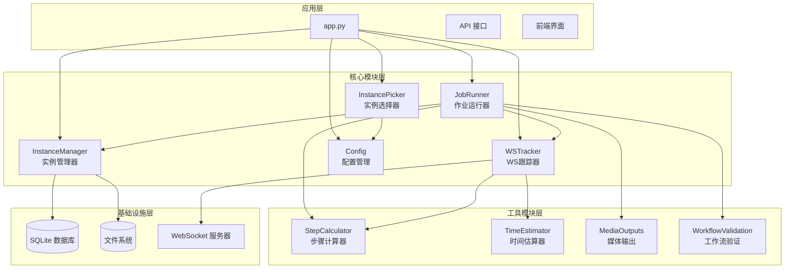
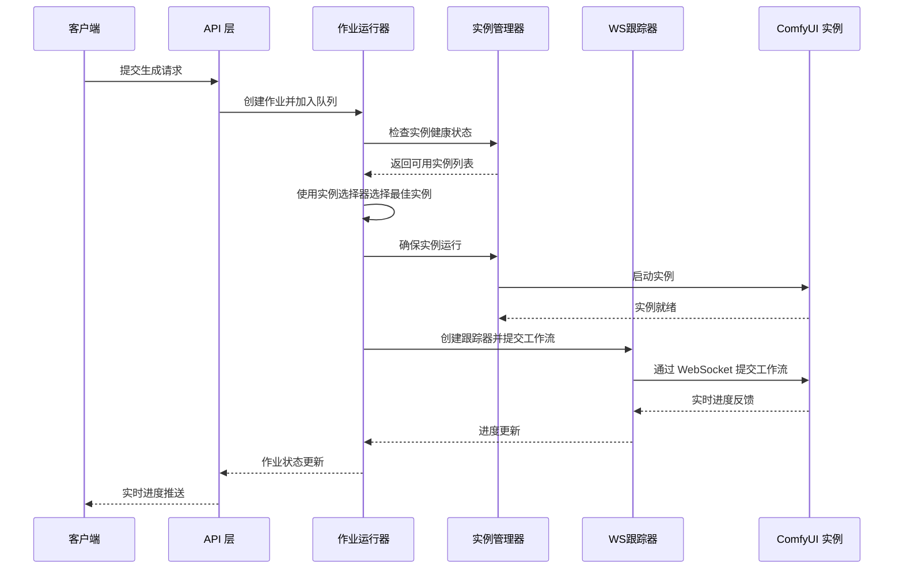
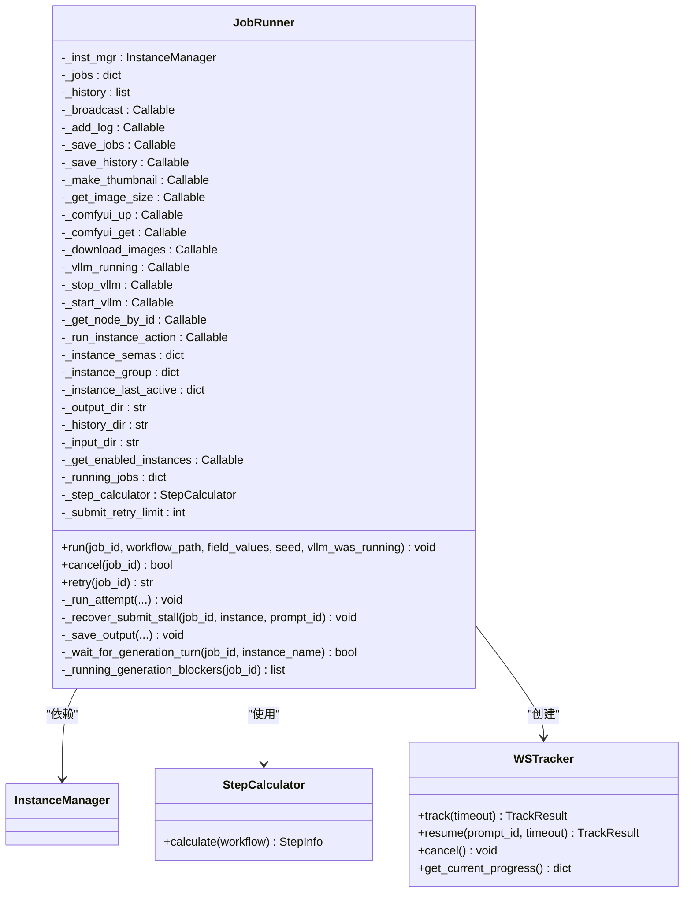
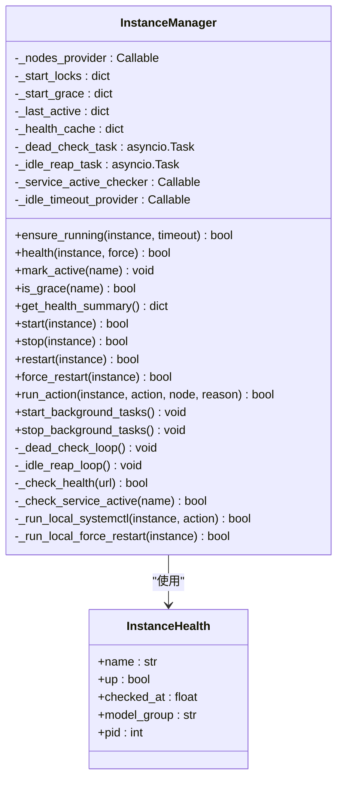
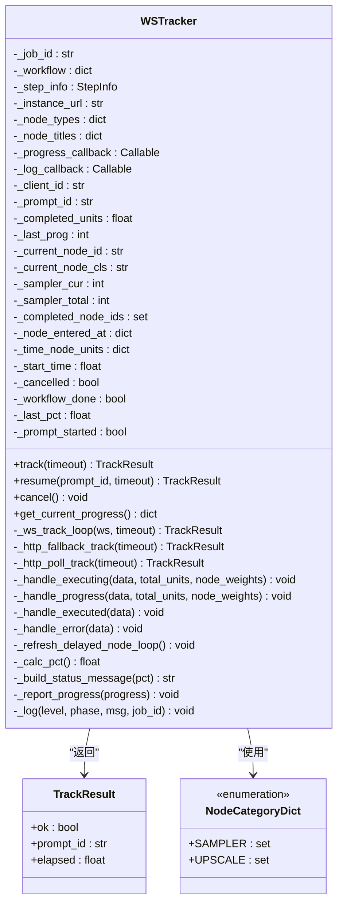
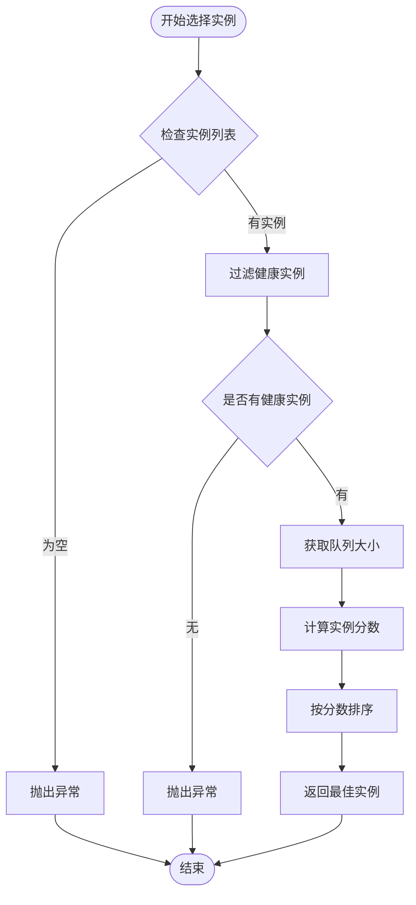
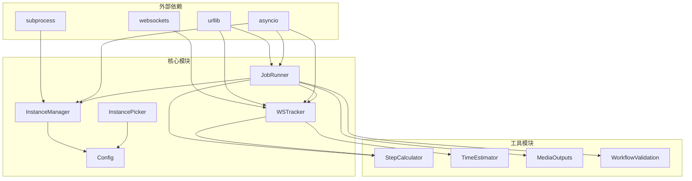

# 核心模块文档

<cite>
**本文档引用的文件**
- [job_runner.py](file://modules/job_runner.py)
- [instance_manager.py](file://modules/instance_manager.py)
- [ws_tracker.py](file://modules/ws_tracker.py)
- [config.py](file://modules/config.py)
- [instance_picker.py](file://modules/instance_picker.py)
- [app.py](file://app.py)
</cite>

## 目录
1. [简介](#简介)
2. [项目结构](#项目结构)
3. [核心组件](#核心组件)
4. [架构概览](#架构概览)
5. [详细组件分析](#详细组件分析)
6. [依赖关系分析](#依赖关系分析)
7. [性能考虑](#性能考虑)
8. [故障排除指南](#故障排除指南)
9. [结论](#结论)

## 简介

Ez ComfyUI Showcase 是一个基于 Python 的 ComfyUI 管理平台，提供了分布式实例管理、智能作业调度、实时进度追踪等功能。本文档深入分析了四个核心业务模块：作业运行器（Job Runner）、实例管理器（Instance Manager）、WebSocket 跟踪器（WS Tracker）和实例选择器（Instance Picker），以及它们之间的协作关系。

该系统采用模块化设计，通过依赖注入的方式将各个组件解耦，实现了高可维护性和可扩展性。系统支持多个 ComfyUI 实例的并行管理，具备完善的错误处理和重试机制。

## 项目结构

系统采用模块化架构，核心业务逻辑集中在 modules 目录下：



**图表来源**
- [app.py:3200-3282](file://app.py#L3200-L3282)
- [job_runner.py:93-198](file://modules/job_runner.py#L93-L198)
- [instance_manager.py:43-91](file://modules/instance_manager.py#L43-L91)
- [ws_tracker.py:160-190](file://modules/ws_tracker.py#L160-L190)

**章节来源**
- [app.py:3200-3282](file://app.py#L3200-L3282)
- [job_runner.py:1-1086](file://modules/job_runner.py#L1-L1086)
- [instance_manager.py:1-532](file://modules/instance_manager.py#L1-L532)
- [ws_tracker.py:1-928](file://modules/ws_tracker.py#L1-L928)

## 核心组件

### 作业运行器（JobRunner）

作业运行器是整个系统的核心协调器，负责串联各个下游模块完成完整的出图流程。它实现了以下关键功能：

- **作业编排**：按照预定义顺序调用各个模块
- **实例选择**：集成实例选择器进行智能实例路由
- **错误处理**：提供完善的错误捕获和重试机制
- **进度追踪**：实时更新作业状态和进度

### 实例管理器（InstanceManager）

实例管理器负责 ComfyUI 实例的全生命周期管理：

- **健康检查**：定期检查实例可用性
- **冷启动管理**：处理实例启动和就绪过程
- **空闲回收**：自动停止长时间空闲的实例
- **故障恢复**：检测并恢复异常实例

### WebSocket 跟踪器（WSTracker）

WebSocket 跟踪器提供实时进度追踪能力：

- **WebSocket 连接**：建立与 ComfyUI 实例的实时通信
- **进度计算**：基于节点权重计算准确的进度百分比
- **断线重连**：在网络异常时自动恢复连接
- **HTTP 回退**：WebSocket 失败时使用 HTTP 轮询

### 实例选择器（InstancePicker）

实例选择器实现智能的实例路由算法：

- **负载均衡**：综合考虑队列长度和实例负载
- **模型亲和性**：根据工作流类型选择合适的实例
- **优先级策略**：为不同类型的作业设置不同的实例偏好
- **动态调整**：根据实时状态动态调整选择策略

**章节来源**
- [job_runner.py:93-198](file://modules/job_runner.py#L93-L198)
- [instance_manager.py:43-91](file://modules/instance_manager.py#L43-L91)
- [ws_tracker.py:160-190](file://modules/ws_tracker.py#L160-L190)
- [instance_picker.py:40-74](file://modules/instance_picker.py#L40-L74)

## 架构概览

系统采用分层架构设计，各层职责明确，通过接口契约进行松耦合集成：



**图表来源**
- [job_runner.py:234-291](file://modules/job_runner.py#L234-L291)
- [instance_manager.py:93-151](file://modules/instance_manager.py#L93-L151)
- [ws_tracker.py:282-366](file://modules/ws_tracker.py#L282-L366)

系统的关键特性包括：

- **异步处理**：所有 I/O 操作都是异步的，提高并发性能
- **错误隔离**：每个模块都有独立的错误处理机制
- **状态持久化**：作业状态和历史记录持久化存储
- **实时通信**：通过 WebSocket 提供实时进度反馈

**章节来源**
- [job_runner.py:234-715](file://modules/job_runner.py#L234-L715)
- [instance_manager.py:322-375](file://modules/instance_manager.py#L322-L375)
- [ws_tracker.py:282-564](file://modules/ws_tracker.py#L282-L564)

## 详细组件分析

### 作业运行器（JobRunner）详细分析

#### 类结构图



**图表来源**
- [job_runner.py:93-198](file://modules/job_runner.py#L93-L198)
- [job_runner.py:565-574](file://modules/job_runner.py#L565-L574)

#### 核心算法说明

作业运行器实现了复杂的作业编排算法，主要包括：

1. **实例选择算法**：结合工作流类型、实例健康状态、队列长度和模型亲和性
2. **并发控制**：使用信号量确保实例级别的并发安全
3. **错误恢复**：实现多层次的错误检测和自动恢复机制
4. **进度追踪**：实时更新作业状态和用户界面

#### 关键配置选项

| 配置项 | 默认值 | 描述 |
|--------|--------|------|
| `DEFAULT_TRACK_TIMEOUT` | 900秒 | 默认作业跟踪超时时间 |
| `VIDEO_TRACK_TIMEOUT` | 3600秒 | 视频生成作业的跟踪超时时间 |
| `_submit_retry_limit` | 3次 | 提交失败的最大重试次数 |

#### 使用示例

```python
# 基本作业运行
await job_runner.run(
    job_id="job_123",
    workflow_path="/path/to/workflow.json",
    field_values={"node1::seed": 42},
    seed=42,
    vllm_was_running=False
)
```

**章节来源**
- [job_runner.py:93-715](file://modules/job_runner.py#L93-L715)
- [job_runner.py:832-882](file://modules/job_runner.py#L832-L882)

### 实例管理器（InstanceManager）详细分析

#### 类结构图



**图表来源**
- [instance_manager.py:43-91](file://modules/instance_manager.py#L43-L91)
- [instance_manager.py:23-40](file://modules/instance_manager.py#L23-L40)

#### 核心算法说明

实例管理器实现了以下关键算法：

1. **健康检查算法**：通过 `/system_stats` 端点检查实例可用性，支持缓存机制
2. **空闲回收算法**：检测长时间空闲的实例并自动停止以节省资源
3. **死实例检测算法**：监控 systemd 服务状态与健康检查结果的不一致情况
4. **冷启动算法**：处理实例启动过程中的各种异常情况

#### 关键配置选项

| 配置项 | 默认值 | 描述 |
|--------|--------|------|
| `START_TIMEOUT` | 300秒 | 实例启动超时时间 |
| `FORCE_RESTART_AFTER` | 30秒 | 强制重启前的等待时间 |
| `HEALTH_CACHE_SECS` | 15秒 | 健康检查结果缓存时间 |
| `IDLE_TIMEOUT` | 900秒 | 实例空闲超时时间 |
| `DEAD_CHECK_INTERVAL` | 60秒 | 死实例检测间隔 |

#### 使用示例

```python
# 确保实例运行
await instance_manager.ensure_running(instance, timeout=300)

# 检查实例健康状态
if await instance_manager.health(instance):
    print("实例可用")

# 启动实例
await instance_manager.start(instance)
```

**章节来源**
- [instance_manager.py:43-532](file://modules/instance_manager.py#L43-L532)

### WebSocket 跟踪器（WSTracker）详细分析

#### 类结构图



**图表来源**
- [ws_tracker.py:160-256](file://modules/ws_tracker.py#L160-L256)
- [ws_tracker.py:26-38](file://modules/ws_tracker.py#L26-L38)
- [ws_tracker.py:918-928](file://modules/ws_tracker.py#L918-L928)

#### 核心算法说明

WebSocket 跟踪器实现了以下关键算法：

1. **进度计算算法**：基于节点权重和执行时间计算准确的进度百分比
2. **WebSocket 连接算法**：实现重连机制和断线恢复
3. **HTTP 回退算法**：在网络异常时自动切换到 HTTP 轮询模式
4. **超时检测算法**：监控作业执行状态，及时发现和处理异常

#### 关键配置选项

| 配置项 | 默认值 | 描述 |
|--------|--------|------|
| `WS_RETRY_COUNT` | 3次 | WebSocket 连接重试次数 |
| `WS_RETRY_DELAY` | 2.0秒 | 连接重试间隔 |
| `WS_SILENT_TIMEOUT` | 300.0秒 | WebSocket 无消息超时时间 |
| `PROMPT_START_TIMEOUT` | 45.0秒 | 提交后等待开始执行的超时时间 |
| `HTTP_POLL_INTERVAL` | 3.0秒 | HTTP 轮询间隔 |
| `PROGRESS_REFRESH_INTERVAL` | 5.0秒 | 进度刷新间隔 |

#### 使用示例

```python
# 创建跟踪器
tracker = WSTracker(
    job_id=job_id,
    workflow=workflow,
    step_info=step_info,
    instance_url=instance_url,
    node_types=node_types,
    progress_callback=progress_callback
)

# 开始跟踪
result = await tracker.track(timeout=900)
```

**章节来源**
- [ws_tracker.py:160-928](file://modules/ws_tracker.py#L160-L928)

### 实例选择器（InstancePicker）详细分析

#### 算法流程图



**图表来源**
- [instance_picker.py:75-124](file://modules/instance_picker.py#L75-L124)

#### 核心算法说明

实例选择器实现了基于多维度评分的实例选择算法：

1. **工作流类型分析**：根据工作流名称识别 T2I、I2I、视频等不同类型
2. **实例评分算法**：综合考虑队列长度、实例偏好、模型亲和性等因素
3. **动态调整机制**：为忙碌实例增加惩罚，避免过度集中
4. **亲和性匹配**：优先选择适合当前工作流的实例

#### 评分算法详解

实例选择的最终分数计算公式：
```
score = load × (4 + pressure) + penalty
```

其中：
- `load`：实例的队列长度
- `pressure`：工作流压力系数（不同类型的作业有不同的压力系数）
- `penalty`：额外惩罚项，考虑实例偏好和模型亲和性

#### 使用示例

```python
# 选择最佳实例
instance = await pick_best_instance(
    instances=available_instances,
    workflow_name=workflow_name,
    affinity_getter=affinity_getter,
    health_check=health_check,
    queue_size_getter=queue_size_getter,
    group_getter=group_getter
)
```

**章节来源**
- [instance_picker.py:40-223](file://modules/instance_picker.py#L40-L223)

### 配置管理器（Config）详细分析

配置管理器提供了系统运行所需的各种常量和配置：

#### 节点分类体系

系统定义了完整的节点分类体系，用于进度计算和性能优化：

| 分类 | 节点类型 | 权重 | 特殊处理 |
|------|----------|------|----------|
| SAMPLER | 采样器节点 | 0 | 采样进度单独计算 |
| UPSCALE | 超分节点 | 0 | 超分进度单独计算 |
| WEIGHT_1 | 标准节点 | 1 | 基础权重 |
| FREE | 无成本节点 | 0 | 不计入总进度 |
| LOADER | 模型加载节点 | 0 | 不计入总进度 |
| FREE_RUNTIME | 运行时节点 | 0 | 不计入总进度 |

#### 模型分组策略

系统支持多种模型分组，用于实例亲和性路由：

| 分组 | 关键词 | 适用场景 |
|------|--------|----------|
| flux2-klein | flux2_klein, flux2-klein, flux-2-klein | Flux 2 Klein 模型 |
| flux2-dev | flux2_dev, flux2-dev, flux.2-dev | Flux 2 开发版模型 |
| nunchaku | nunchaku | Nunchaku 模型系列 |
| z-image-turbo | z-image-turbo, z_image_turbo, z-image, z-xxx, z_xxx | Z-Image Turbo 模型 |
| seedvr | seedvr | SeedVR 模型系列 |
| i2i-firered | firered, fire-red | FireRed I2I 模型 |
| i2i-qwen | i2i_qwen, i2i-qwen | Qwen I2I 模型 |

**章节来源**
- [config.py:11-151](file://modules/config.py#L11-L151)

## 依赖关系分析

系统模块间的依赖关系清晰明确，遵循依赖倒置原则：



**图表来源**
- [job_runner.py:26-33](file://modules/job_runner.py#L26-L33)
- [instance_manager.py:11-18](file://modules/instance_manager.py#L11-L18)
- [ws_tracker.py:17-21](file://modules/ws_tracker.py#L17-L21)

### 模块耦合度分析

- **低耦合设计**：各模块通过接口契约交互，减少直接依赖
- **依赖注入**：通过构造函数注入外部依赖，便于测试和替换
- **单一职责**：每个模块专注于特定功能领域
- **可扩展性**：新的功能可以通过添加新模块实现

### 循环依赖检查

系统设计避免了循环依赖：
- 上层模块不依赖下层模块
- 工具模块保持纯函数特性
- 配置模块提供常量定义，不依赖其他模块

**章节来源**
- [job_runner.py:26-33](file://modules/job_runner.py#L26-L33)
- [instance_manager.py:11-18](file://modules/instance_manager.py#L11-L18)
- [ws_tracker.py:17-21](file://modules/ws_tracker.py#L17-L21)

## 性能考虑

### 并发性能优化

系统采用了多层次的并发优化策略：

1. **异步 I/O**：所有网络操作都是异步的，避免阻塞主线程
2. **信号量控制**：使用信号量限制每个实例的并发任务数量
3. **缓存机制**：健康检查结果和实例状态进行缓存
4. **批量处理**：支持批量作业处理，减少系统开销

### 内存管理

- **垃圾回收**：合理使用 Python 的垃圾回收机制
- **资源清理**：确保 WebSocket 连接和文件句柄正确关闭
- **内存泄漏防护**：避免循环引用和全局变量滥用

### 网络性能

- **连接池**：复用 HTTP 连接，减少握手开销
- **超时控制**：为所有网络操作设置合理的超时时间
- **重试策略**：实现指数退避的重试机制

## 故障排除指南

### 常见问题及解决方案

#### 实例无法启动

**症状**：实例启动超时或启动失败
**原因分析**：
- systemd 服务配置错误
- 环境变量缺失
- 端口被占用

**解决步骤**：
1. 检查 systemd 服务状态：`systemctl --user status comfyui-<name>`
2. 查看服务日志：`journalctl --user -u comfyui-<name>`
3. 验证端口可用性：`netstat -tlnp | grep :<port>`
4. 检查环境变量：确认 DBUS_SESSION_BUS_ADDRESS 和 XDG_RUNTIME_DIR 设置

#### WebSocket 连接失败

**症状**：进度无法实时更新，显示连接错误
**原因分析**：
- 网络连接不稳定
- WebSocket 服务器配置错误
- 防火墙阻止连接

**解决步骤**：
1. 检查网络连通性：`ping <instance-url>`
2. 验证 WebSocket 端点：`curl -i -N -H "Connection: Upgrade" -H "Upgrade: websocket" <ws-url>`
3. 检查防火墙设置：确认端口开放
4. 查看浏览器开发者工具中的网络面板

#### 进度计算不准确

**症状**：进度百分比显示异常或停滞
**原因分析**：
- 节点权重配置错误
- 采样器节点处理异常
- 超分节点进度计算问题

**解决步骤**：
1. 检查工作流中的节点类型
2. 验证节点权重配置
3. 查看节点执行日志
4. 更新节点分类配置

#### 实例选择错误

**症状**：作业被分配到不合适的实例
**原因分析**：
- 模型亲和性配置错误
- 实例健康状态判断异常
- 队列长度统计不准确

**解决步骤**：
1. 检查模型分组配置
2. 验证实例健康检查逻辑
3. 查看队列统计信息
4. 调整实例偏好设置

### 调试工具和技巧

#### 日志分析

系统提供了丰富的日志记录功能：

```bash
# 查看最近的日志
tail -f data/logs/recent.jsonl

# 按作业过滤日志
grep "job_id" data/logs/recent.jsonl

# 按阶段过滤日志
grep "\"phase\":\"generate\"" data/logs/recent.jsonl
```

#### 性能监控

```python
# 检查实例健康状态
curl http://localhost:9091/api/instances/health

# 查看作业队列状态
curl http://localhost:9091/api/jobs

# 监控 GPU 使用情况
nvidia-smi -l 1
```

#### 调试模式

系统支持调试模式，可以获取更详细的执行信息：

1. 设置环境变量：`export EZ_COMFYUI_DEBUG=true`
2. 重启应用服务
3. 查看详细日志输出
4. 分析执行流程

**章节来源**
- [job_runner.py:693-704](file://modules/job_runner.py#L693-L704)
- [instance_manager.py:334-357](file://modules/instance_manager.py#L334-L357)
- [ws_tracker.py:364-366](file://modules/ws_tracker.py#L364-L366)

## 结论

Ez ComfyUI Showcase 的核心模块设计体现了现代异步系统的最佳实践：

### 设计优势

1. **模块化架构**：清晰的职责分离和接口契约
2. **异步并发**：充分利用 Python 的异步特性
3. **容错设计**：完善的错误处理和自动恢复机制
4. **可观测性**：全面的日志记录和状态监控
5. **可扩展性**：插件化的架构支持功能扩展

### 技术亮点

- **智能实例选择**：基于多维度评分的实例路由算法
- **实时进度追踪**：WebSocket + HTTP 回退的双重保障
- **生命周期管理**：从启动到回收的完整实例管理
- **错误恢复**：多层次的自动故障恢复机制

### 改进建议

1. **监控告警**：添加更完善的监控和告警机制
2. **性能分析**：集成性能分析工具，持续优化系统性能
3. **自动化测试**：完善单元测试和集成测试覆盖
4. **文档完善**：补充更多的使用示例和最佳实践

该系统为 ComfyUI 的分布式部署和管理提供了可靠的解决方案，具有良好的扩展性和维护性，适合在生产环境中稳定运行。