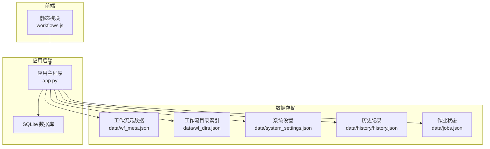
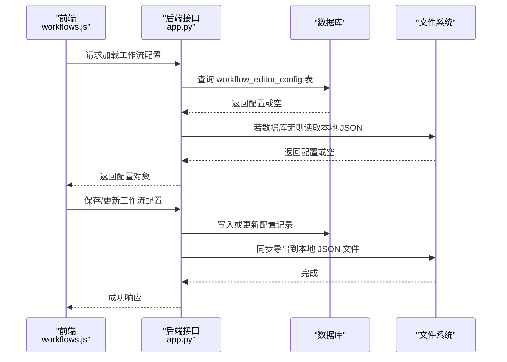
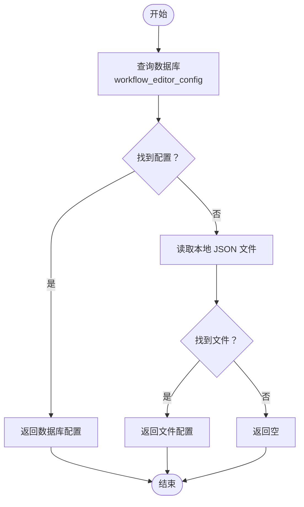
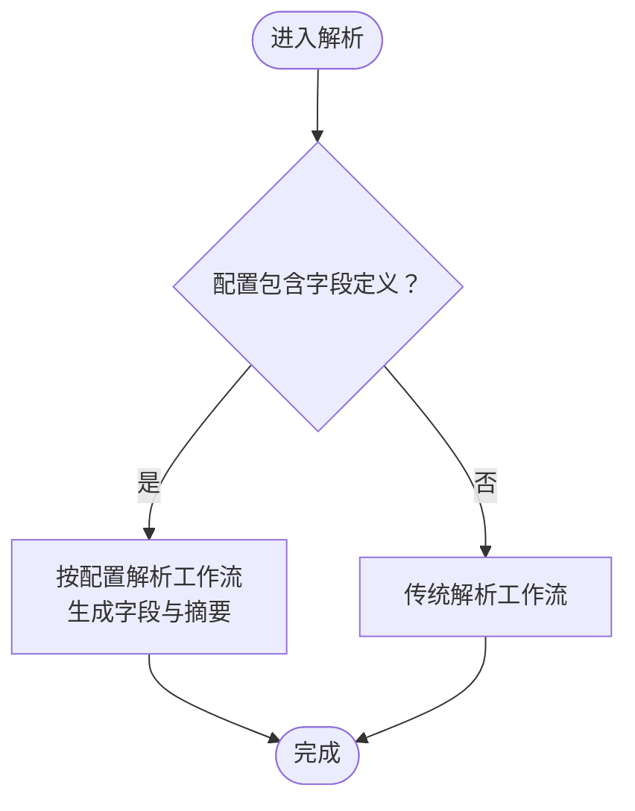
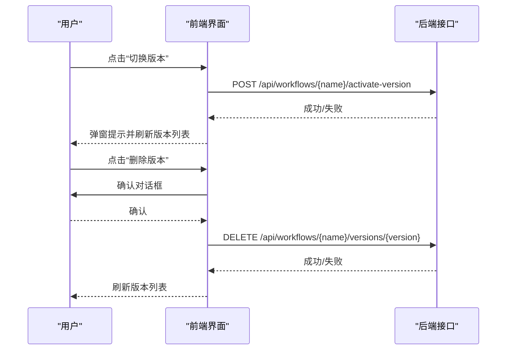
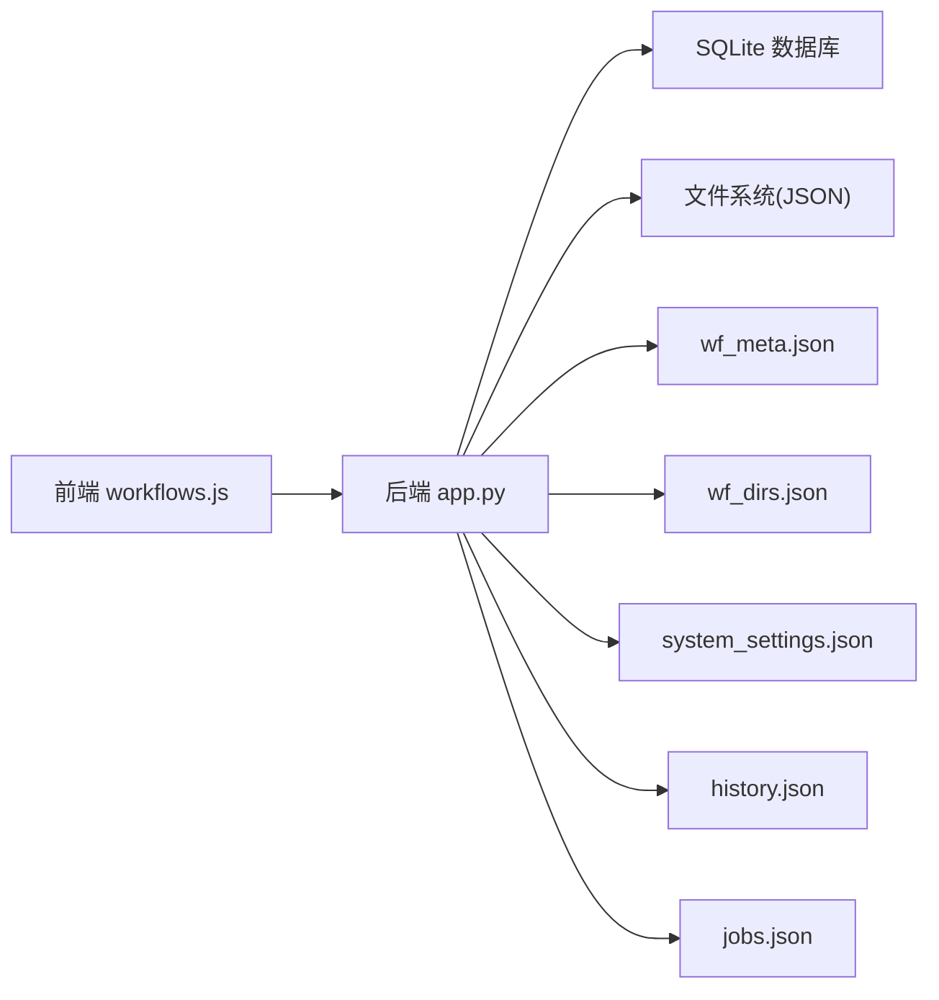

# 配置管理器（ConfigManager）

<cite>
**本文引用的文件**
- [app.py](file://app.py)
- [workflows.js](file://static/js/modules/workflows.js)
- [gen_wf_configs.py](file://scripts/gen_wf_configs.py)
- [data/wf_meta.json](file://data/wf_meta.json)
- [data/wf_dirs.json](file://data/wf_dirs.json)
- [data/system_settings.json](file://data/system_settings.json)
- [data/cancelled_prompts.json](file://data/cancelled_prompts.json)
- [data/history/history.json](file://data/history/history.json)
- [data/jobs.json](file://data/jobs.json)
- [modules/config.py](file://modules/config.py)
</cite>

## 目录
1. [简介](#简介)
2. [项目结构](#项目结构)
3. [核心组件](#核心组件)
4. [架构总览](#架构总览)
5. [详细组件分析](#详细组件分析)
6. [依赖分析](#依赖分析)
7. [性能考量](#性能考量)
8. [故障排查指南](#故障排查指南)
9. [结论](#结论)
10. [附录](#附录)

## 简介
本文件面向 Ez ComfyUI Showcase 的“配置管理器”模块，系统化阐述其在节点配置解析、系统参数管理、工作流配置加载与持久化、常量定义与默认值策略等方面的职责与实现。文档将给出配置文件格式、解析算法、验证机制、优先级与层次结构、动态更新路径，并提供配置项清单、迁移指南、最佳实践与安全/性能建议。

## 项目结构
围绕配置管理的关键目录与文件如下：
- 数据层：工作流元数据、系统设置、历史记录、作业状态等 JSON 文件
- 应用层：工作流解析与配置加载逻辑、数据库表结构与迁移脚本
- 前端层：工作流编辑与版本管理交互逻辑
- 脚本层：工作流配置生成工具

图表来源
- [app.py](file://app.py)
- [workflows.js](file://static/js/modules/workflows.js)
- [data/wf_meta.json](file://data/wf_meta.json)
- [data/wf_dirs.json](file://data/wf_dirs.json)
- [data/system_settings.json](file://data/system_settings.json)
- [data/history/history.json](file://data/history/history.json)
- [data/jobs.json](file://data/jobs.json)

章节来源
- [app.py](file://app.py)
- [workflows.js](file://static/js/modules/workflows.js)

## 核心组件
- 工作流配置加载与持久化：通过数据库与本地文件双轨镜像，支持配置的读取、写入、删除与迁移
- 工作流解析与字段覆盖：根据配置对工作流进行字段解析与摘要生成，支持字段顺序、类型、分组等元信息
- 系统参数与常量：系统设置、历史与作业状态等作为系统级配置参与运行时行为
- 前端编辑与版本管理：提供工作流编辑、版本切换与删除的前端交互能力

章节来源
- [app.py](file://app.py)
- [workflows.js](file://static/js/modules/workflows.js)

## 架构总览
配置管理采用“数据库为主、文件为辅”的双轨架构，确保高可用与可回退。前端通过 API 与后端交互，后端负责解析与持久化。

图表来源
- [app.py](file://app.py)
- [workflows.js](file://static/js/modules/workflows.js)

## 详细组件分析

### 组件一：工作流配置加载与持久化
- 加载优先级
  - 优先从数据库查询全局作用域配置
  - 若数据库未命中，则回退到本地文件系统
- 持久化策略
  - 写入数据库并同步导出到本地 JSON 文件
  - 删除操作同时清理数据库与文件
- 迁移机制
  - 将旧版本地配置批量迁移到数据库，避免重复迁移
- 解析入口
  - 当存在字段定义时，按配置解析；否则走传统解析路径

图表来源
- [app.py](file://app.py)

章节来源
- [app.py](file://app.py)

### 组件二：工作流解析与字段覆盖
- 字段覆盖逻辑
  - 若工作流配置包含字段定义，则以配置为准进行字段解析与摘要生成
  - 否则回退到传统解析
- 字段元信息
  - 字段顺序、分组、类型、校验规则等由配置驱动
- 生成工具
  - 提供脚本自动生成工作流配置，便于维护与一致性

图表来源
- [app.py](file://app.py)
- [gen_wf_configs.py](file://scripts/gen_wf_configs.py)

章节来源
- [app.py](file://app.py)
- [gen_wf_configs.py](file://scripts/gen_wf_configs.py)

### 组件三：系统参数与常量
- 系统设置
  - 存储于 data/system_settings.json，用于控制全局行为
- 历史与作业
  - 历史记录与作业状态分别存储于 data/history/history.json 与 data/jobs.json，作为系统运行时状态的一部分
- 元数据与目录索引
  - data/wf_meta.json 与 data/wf_dirs.json 提供工作流元信息与目录映射，辅助前端展示与导航

章节来源
- [data/system_settings.json](file://data/system_settings.json)
- [data/history/history.json](file://data/history/history.json)
- [data/jobs.json](file://data/jobs.json)
- [data/wf_meta.json](file://data/wf_meta.json)
- [data/wf_dirs.json](file://data/wf_dirs.json)

### 组件四：前端编辑与版本管理
- 编辑权限控制
  - 仅管理员或拥有者可编辑工作流
- 版本管理
  - 支持版本切换与删除，删除前需确认
- 同步与刷新
  - 操作成功后刷新版本列表与工作流网格

图表来源
- [workflows.js](file://static/js/modules/workflows.js)

章节来源
- [workflows.js](file://static/js/modules/workflows.js)

## 依赖分析
- 模块耦合
  - 应用层对数据库与文件系统的依赖清晰，遵循“数据库为主、文件为辅”的原则
  - 前端仅通过 API 与后端交互，降低耦合度
- 外部依赖
  - SQLite 用于配置持久化
  - JSON 文件用于历史、作业与系统设置等状态数据
- 可能的循环依赖
  - 未见直接循环导入；解析与持久化逻辑分离良好

图表来源
- [app.py](file://app.py)
- [workflows.js](file://static/js/modules/workflows.js)

章节来源
- [app.py](file://app.py)
- [workflows.js](file://static/js/modules/workflows.js)

## 性能考量
- 读取性能
  - 数据库查询命中率高时，避免频繁文件 IO
  - 对热点工作流配置可考虑缓存（如内存缓存）以减少数据库访问
- 写入性能
  - 批量写入与事务合并可减少磁盘写入次数
  - 导出文件与数据库写入应保持原子性，避免部分写入
- 解析性能
  - 字段覆盖解析仅在配置存在时触发，避免对无配置工作流的额外开销
- I/O 优化
  - 使用异步读写与流式处理，减少大文件解析时的内存峰值

## 故障排查指南
- 配置加载失败
  - 检查数据库中是否存在对应记录
  - 确认本地 JSON 文件是否存在且可读
- 配置写入失败
  - 检查数据库连接与权限
  - 确认文件导出目录可写
- 迁移问题
  - 查看迁移日志，确认是否已跳过重复迁移
  - 手动检查目标文件是否已存在
- 前端操作异常
  - 确认用户权限与工作流所有权
  - 检查网络请求返回码与错误消息

章节来源
- [app.py](file://app.py)
- [workflows.js](file://static/js/modules/workflows.js)

## 结论
配置管理器通过数据库与文件的双轨机制，实现了工作流配置的可靠持久化与高效解析；结合前端的编辑与版本管理能力，提供了良好的用户体验。整体设计具备良好的可扩展性与向后兼容性，适合在复杂场景下持续演进。

## 附录

### 配置文件格式与字段说明
- 工作流配置（JSON）
  - 字段：version、workflow、fields
  - fields：字段数组，包含字段顺序、分组、类型、校验规则等元信息
- 系统设置（JSON）
  - 系统级参数集合，用于控制全局行为
- 历史与作业（JSON）
  - 历史记录与作业状态，用于运行时状态追踪

章节来源
- [gen_wf_configs.py](file://scripts/gen_wf_configs.py)
- [data/system_settings.json](file://data/system_settings.json)
- [data/history/history.json](file://data/history/history.json)
- [data/jobs.json](file://data/jobs.json)

### 解析算法与优先级
- 优先级
  - 数据库 > 本地文件
- 解析流程
  - 若配置包含字段定义，按配置解析；否则走传统解析
- 默认值策略
  - 未显式提供的字段属性采用默认值（由生成工具与解析逻辑共同保证）

章节来源
- [app.py](file://app.py)
- [gen_wf_configs.py](file://scripts/gen_wf_configs.py)

### 动态更新机制
- 实时生效
  - 更新后立即写入数据库并导出文件，前端可重新加载
- 版本管理
  - 支持多版本并存与切换，删除前需确认

章节来源
- [app.py](file://app.py)
- [workflows.js](file://static/js/modules/workflows.js)

### 迁移指南
- 从本地文件迁移到数据库
  - 使用迁移函数遍历配置目录，跳过已存在记录，批量写入数据库
  - 成功后导出镜像文件，便于回退与审计

章节来源
- [app.py](file://app.py)

### 最佳实践
- 配置可扩展性
  - 新增字段时，先在生成工具中完善字段元信息，再进行解析适配
- 向后兼容
  - 保留旧版字段定义，解析逻辑兼容旧格式
- 安全性
  - 严格控制工作流编辑权限，避免未授权修改
  - 对敏感字段进行脱敏与最小暴露
- 性能优化
  - 对热点配置进行缓存
  - 批量写入与事务合并
  - 异步处理与流式解析

### 配置项清单与默认值
- 工作流配置字段
  - version：整数，版本号
  - workflow：字符串，工作流名称
  - fields：数组，字段定义集合
- 系统设置字段
  - 由具体系统设置决定，建议在新增字段时提供默认值与校验规则
- 历史与作业字段
  - 由业务实体决定，建议统一命名规范与时间戳格式

章节来源
- [gen_wf_configs.py](file://scripts/gen_wf_configs.py)
- [data/system_settings.json](file://data/system_settings.json)
- [data/history/history.json](file://data/history/history.json)
- [data/jobs.json](file://data/jobs.json)