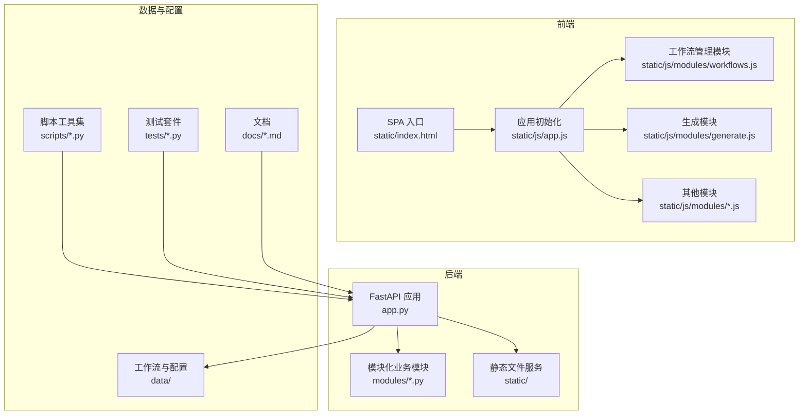
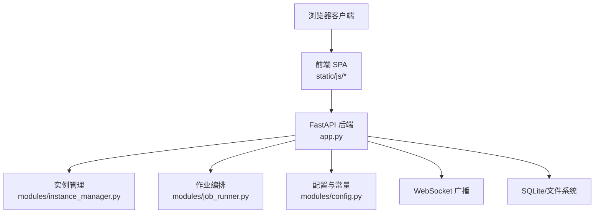
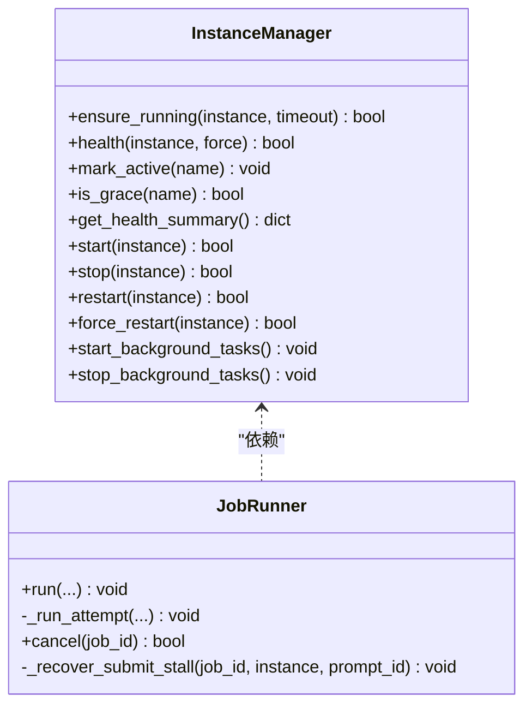
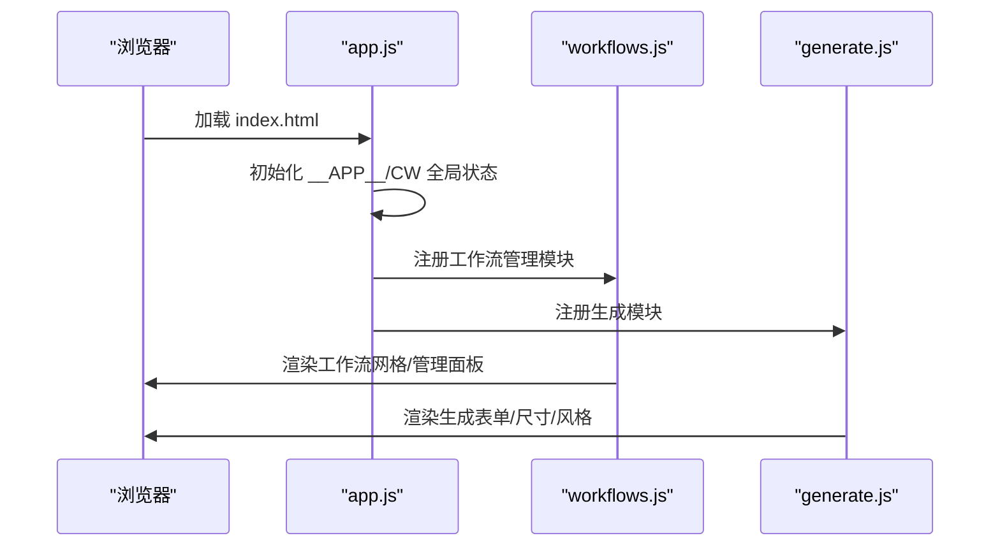
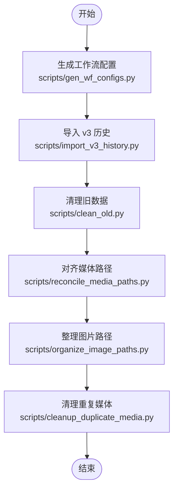
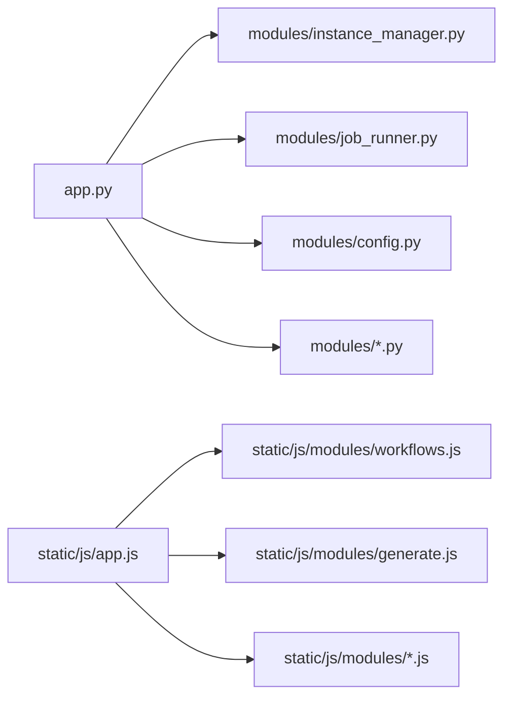
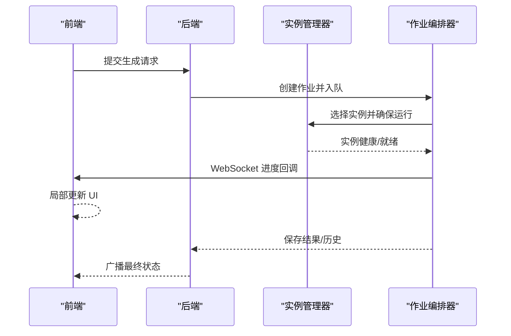

# 代码质量保证

<cite>
**本文引用的文件**
- [PROJECT_STANDARDS.md](file://PROJECT_STANDARDS.md)
- [README.md](file://README.md)
- [app.py](file://app.py)
- [modules/config.py](file://modules/config.py)
- [modules/instance_manager.py](file://modules/instance_manager.py)
- [modules/job_runner.py](file://modules/job_runner.py)
- [static/js/app.js](file://static/js/app.js)
- [static/js/modules/workflows.js](file://static/js/modules/workflows.js)
- [static/js/modules/generate.js](file://static/js/modules/generate.js)
- [tests/test_comfyui_upload.py](file://tests/test_comfyui_upload.py)
- [tests/test_flux2_dev_i2i_workflow.py](file://tests/test_flux2_dev_i2i_workflow.py)
- [tests/test_flux2_klein_workflows.py](file://tests/test_flux2_klein_workflows.py)
- [tests/test_prompt_interrogator.py](file://tests/test_prompt_interrogator.py)
- [tests/test_workflow_validation.py](file://tests/test_workflow_validation.py)
- [scripts/gen_wf_configs.py](file://scripts/gen_wf_configs.py)
- [scripts/import_v3_history.py](file://scripts/import_v3_history.py)
- [scripts/clean_old.py](file://scripts/clean_old.py)
- [scripts/reconcile_media_paths.py](file://scripts/reconcile_media_paths.py)
- [scripts/organize_image_paths.py](file://scripts/organize_image_paths.py)
- [scripts/cleanup_duplicate_media.py](file://scripts/cleanup_duplicate_media.py)
- [docs/SPECIFICATION.md](file://docs/SPECIFICATION.md)
- [docs/USER_GUIDE.md](file://docs/USER_GUIDE.md)
- [docs/PROJECT_OVERVIEW.md](file://docs/PROJECT_OVERVIEW.md)
</cite>

## 目录
1. [引言](#引言)
2. [项目结构](#项目结构)
3. [核心组件](#核心组件)
4. [架构总览](#架构总览)
5. [详细组件分析](#详细组件分析)
6. [依赖分析](#依赖分析)
7. [性能考虑](#性能考虑)
8. [故障排查指南](#故障排查指南)
9. [结论](#结论)
10. [附录](#附录)

## 引言
本文件面向 Ez ComfyUI Showcase 项目的代码质量保证，系统化阐述编码风格、命名约定、注释规范、文档标准；明确代码审查流程与质量检查清单；给出静态分析与安全扫描实践；规划自动化质量门禁与持续集成策略；提供重构与优化指导；并建立文档质量与维护策略，帮助团队在多语言混合（Python/FastAPI + JavaScript/Vanilla ES6）环境下实现高质量交付。

## 项目结构
项目采用前后端分离的单页应用（SPA）架构，后端基于 FastAPI 提供 API，前端通过静态资源提供 UI 与交互逻辑。模块化组织后端 Python 模块，前端以 ES6 IIFE 模块形式组织功能模块，配合统一的全局状态与共享接口。

**图表来源**
- [README.md:40-59](file://README.md#L40-L59)
- [app.py:1-120](file://app.py#L1-L120)
- [static/js/app.js:1-120](file://static/js/app.js#L1-L120)

**章节来源**
- [README.md:40-59](file://README.md#L40-L59)

## 核心组件
- 后端核心：FastAPI 应用与模块化业务模块（实例管理、作业编排、提示词处理、媒体输出、工作流验证等）
- 前端核心：SPA 初始化、模块化 UI 模块（工作流管理、生成面板、历史画廊等）
- 数据与脚本：工作流与元数据、历史导入与整理、媒体路径一致性处理
- 测试与文档：覆盖关键业务场景的测试用例与项目文档

**章节来源**
- [app.py:1-200](file://app.py#L1-L200)
- [modules/config.py:1-152](file://modules/config.py#L1-L152)
- [modules/instance_manager.py:1-120](file://modules/instance_manager.py#L1-L120)
- [modules/job_runner.py:1-120](file://modules/job_runner.py#L1-L120)
- [static/js/app.js:1-120](file://static/js/app.js#L1-L120)
- [static/js/modules/workflows.js:1-120](file://static/js/modules/workflows.js#L1-L120)
- [static/js/modules/generate.js:1-120](file://static/js/modules/generate.js#L1-L120)

## 架构总览
系统采用“后端 API + 前端 SPA”的分层架构，后端负责实例生命周期、作业编排、提示词与图像处理、日志与状态广播；前端负责 UI 渲染、用户交互、状态订阅与局部更新。

**图表来源**
- [app.py:1-200](file://app.py#L1-L200)
- [modules/instance_manager.py:1-120](file://modules/instance_manager.py#L1-L120)
- [modules/job_runner.py:1-120](file://modules/job_runner.py#L1-L120)
- [modules/config.py:1-152](file://modules/config.py#L1-L152)

## 详细组件分析

### 后端核心：实例管理与作业编排
- 实例管理器负责健康检查、冷启动、空闲回收、死实例检测与后台任务协调
- 作业编排器串联实例选择、信号量控制、进度跟踪、结果保存与 vLLM 生命周期管理

**图表来源**
- [modules/instance_manager.py:43-120](file://modules/instance_manager.py#L43-L120)
- [modules/job_runner.py:93-160](file://modules/job_runner.py#L93-L160)

**章节来源**
- [modules/instance_manager.py:1-200](file://modules/instance_manager.py#L1-L200)
- [modules/job_runner.py:1-200](file://modules/job_runner.py#L1-L200)

### 前端核心：SPA 初始化与模块化 UI
- SPA 初始化负责全局状态、API 基址、轮询与模块注册
- 工作流管理模块负责工作流列表、元数据、缩略图、分享与版本管理
- 生成模块负责尺寸限制、风格预设、提示词优化与视频脚本上下文

**图表来源**
- [static/js/app.js:630-730](file://static/js/app.js#L630-L730)
- [static/js/modules/workflows.js:580-620](file://static/js/modules/workflows.js#L580-L620)
- [static/js/modules/generate.js:190-260](file://static/js/modules/generate.js#L190-L260)

**章节来源**
- [static/js/app.js:1-200](file://static/js/app.js#L1-L200)
- [static/js/modules/workflows.js:1-200](file://static/js/modules/workflows.js#L1-L200)
- [static/js/modules/generate.js:1-200](file://static/js/modules/generate.js#L1-L200)

### 数据与脚本：工作流与历史处理
- 脚本工具负责工作流配置生成、历史导入、媒体路径整理与重复项清理
- 数据目录包含工作流 JSON、缩略图、元数据与历史记录

**图表来源**
- [scripts/gen_wf_configs.py](file://scripts/gen_wf_configs.py)
- [scripts/import_v3_history.py](file://scripts/import_v3_history.py)
- [scripts/clean_old.py](file://scripts/clean_old.py)
- [scripts/reconcile_media_paths.py](file://scripts/reconcile_media_paths.py)
- [scripts/organize_image_paths.py](file://scripts/organize_image_paths.py)
- [scripts/cleanup_duplicate_media.py](file://scripts/cleanup_duplicate_media.py)

**章节来源**
- [scripts/gen_wf_configs.py](file://scripts/gen_wf_configs.py)
- [scripts/import_v3_history.py](file://scripts/import_v3_history.py)
- [scripts/clean_old.py](file://scripts/clean_old.py)
- [scripts/reconcile_media_paths.py](file://scripts/reconcile_media_paths.py)
- [scripts/organize_image_paths.py](file://scripts/organize_image_paths.py)
- [scripts/cleanup_duplicate_media.py](file://scripts/cleanup_duplicate_media.py)

## 依赖分析
- 后端模块间低耦合：通过依赖注入与共享状态协作，避免直接循环引用
- 前端模块通过 window.__APP__ 与 window.CW 共享接口，遵循 IIFE 模式与私有函数命名约定
- 数据与脚本工具与后端解耦，通过文件系统与命令行交互

**图表来源**
- [app.py:29-59](file://app.py#L29-L59)
- [modules/instance_manager.py:1-120](file://modules/instance_manager.py#L1-L120)
- [modules/job_runner.py:1-120](file://modules/job_runner.py#L1-L120)
- [modules/config.py:1-152](file://modules/config.py#L1-L152)
- [static/js/app.js:86-112](file://static/js/app.js#L86-L112)

**章节来源**
- [app.py:29-59](file://app.py#L29-L59)

## 性能考虑
- 局部 DOM 更新：禁止全量刷新，仅在必要时进行全量刷新
- 模块化设计：IIFE 封装与共享接口，减少全局污染
- 禁止行内样式：统一 CSS 管理，避免样式计算抖动
- SVG 图标系统：集中管理图标，避免内联字符与字体渲染差异
- 实例信号量与队列：通过信号量与队列控制并发，避免 GPU 资源争用
- 前端轮询与 WebSocket：结合使用，降低长轮询开销

**章节来源**
- [PROJECT_STANDARDS.md:8-44](file://PROJECT_STANDARDS.md#L8-L44)
- [PROJECT_STANDARDS.md:47-93](file://PROJECT_STANDARDS.md#L47-L93)
- [PROJECT_STANDARDS.md:96-130](file://PROJECT_STANDARDS.md#L96-L130)
- [PROJECT_STANDARDS.md:132-162](file://PROJECT_STANDARDS.md#L132-L162)
- [modules/job_runner.py:400-480](file://modules/job_runner.py#L400-L480)
- [static/js/app.js:150-220](file://static/js/app.js#L150-L220)

## 故障排查指南
- 实例健康与冷启动：检查实例管理器健康检查与启动流程，关注超时与强制重启
- 作业提交与跟踪：关注 WSTracker 超时与回退机制，检查队列状态与历史查询
- 日志与错误：利用后端日志缓冲与持久化，定位阶段消息与错误详情
- 前端状态：通过前端轮询与 UI 状态反馈，确认实例状态与 GPU 使用情况

**图表来源**
- [modules/instance_manager.py:93-151](file://modules/instance_manager.py#L93-L151)
- [modules/job_runner.py:234-320](file://modules/job_runner.py#L234-L320)
- [static/js/app.js:150-220](file://static/js/app.js#L150-L220)

**章节来源**
- [modules/instance_manager.py:334-375](file://modules/instance_manager.py#L334-L375)
- [modules/job_runner.py:576-652](file://modules/job_runner.py#L576-L652)
- [app.py:217-292](file://app.py#L217-L292)

## 结论
本项目在前后端均建立了清晰的模块化边界与一致的开发规范，通过实例管理与作业编排保障生成稳定性，通过前端局部更新与统一样式提升用户体验。建议在现有基础上进一步完善自动化质量门禁与静态分析，强化文档与测试的持续维护，确保长期演进的可维护性与可靠性。

## 附录

### 代码质量标准与规范
- 编码风格与命名约定
  - 后端：Python 遵循类型注解与模块化导入，避免全局副作用
  - 前端：ES6 IIFE 模块、严格模式、下划线私有函数、统一命名空间
- 注释规范
  - 关键函数与类提供清晰的用途说明与参数/返回值说明
- 文档标准
  - 项目文档与模块文档同步更新，保持与代码变更一致

**章节来源**
- [PROJECT_STANDARDS.md:1-162](file://PROJECT_STANDARDS.md#L1-L162)
- [README.md:1-127](file://README.md#L1-L127)

### 代码审查流程与质量检查清单
- Pull Request 审查流程
  - 提交 PR 前完成本地测试与文档更新
  - 至少一名审阅者同意后合并
- 质量检查清单
  - 代码风格与命名一致性
  - 前端局部更新与样式规范
  - 后端模块职责与依赖注入
  - 日志与错误处理完整性
  - 性能与并发控制（信号量、队列）

**章节来源**
- [PROJECT_STANDARDS.md:8-162](file://PROJECT_STANDARDS.md#L8-L162)

### 静态代码分析与安全扫描
- Python 后端
  - 使用类型检查与导入顺序检查
  - 关注异常处理与资源释放
- JavaScript 前端
  - 使用严格模式与模块化封装
  - 禁止行内样式与内联事件
- 安全扫描
  - 依赖版本审计与漏洞扫描
  - CSRF 与认证相关检查

[本节为通用指导，无需特定文件引用]

### 自动化代码质量检查与 CI/CD
- 质量门禁
  - 代码风格检查、单元测试覆盖率、静态分析
- 构建与部署
  - 通过脚本与配置文件管理环境变量与依赖
- 版本与发布
  - 变更记录与版本号同步更新

**章节来源**
- [README.md:78-127](file://README.md#L78-L127)

### 重构与优化指导
- 重构时机
  - 代码重复、模块职责不清、性能瓶颈
- 重构策略
  - 依赖注入与接口抽象、局部更新与模块化
- 风险评估
  - 影响范围、回滚方案、回归测试覆盖

**章节来源**
- [PROJECT_STANDARDS.md:8-44](file://PROJECT_STANDARDS.md#L8-L44)
- [modules/job_runner.py:199-233](file://modules/job_runner.py#L199-L233)

### 文档质量与维护策略
- 更新要求
  - 代码变更需同步更新相关文档
- 质量检查
  - 文档与实现一致性核对
- 一致性维护
  - 统一术语与格式，定期回顾与修订

**章节来源**
- [docs/SPECIFICATION.md](file://docs/SPECIFICATION.md)
- [docs/USER_GUIDE.md](file://docs/USER_GUIDE.md)
- [docs/PROJECT_OVERVIEW.md](file://docs/PROJECT_OVERVIEW.md)