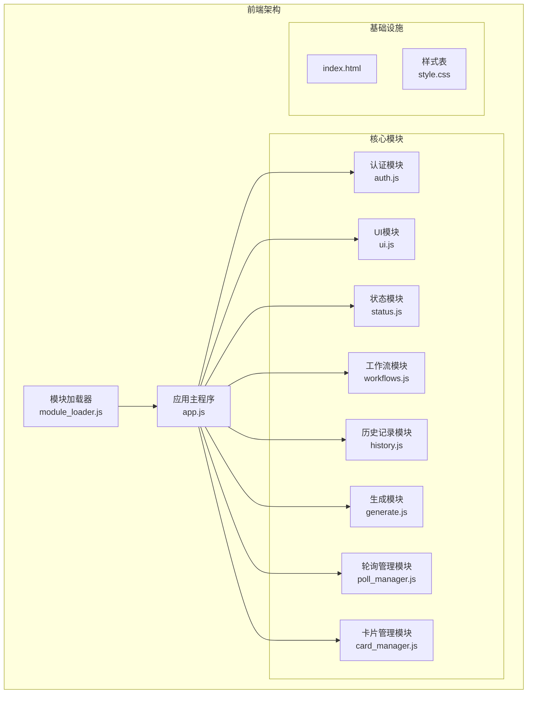
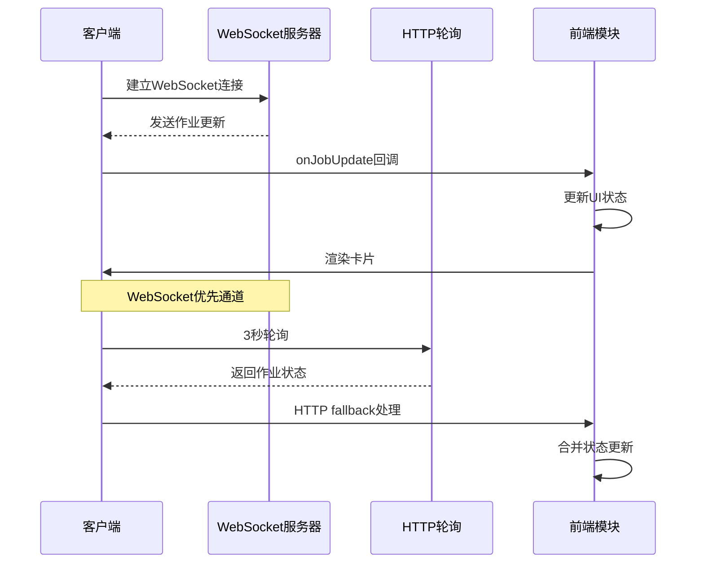
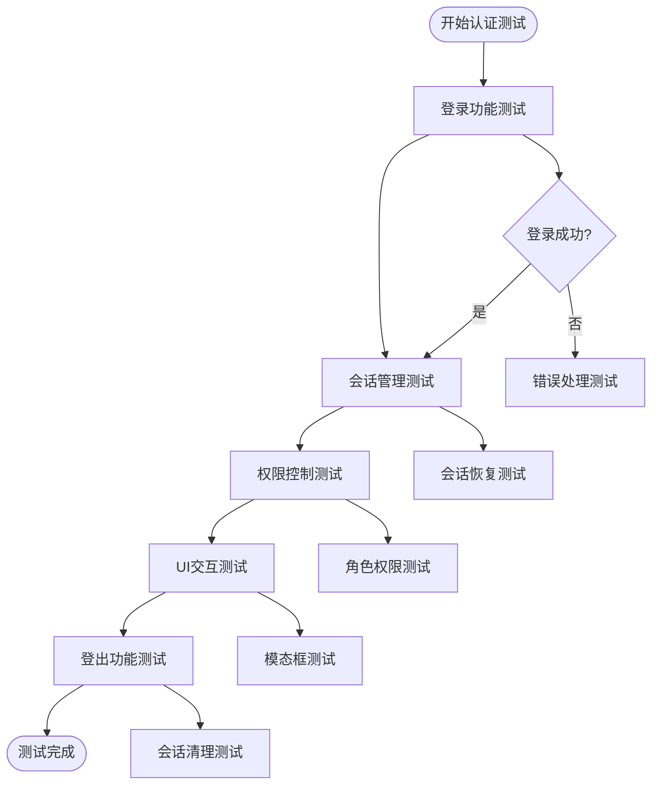
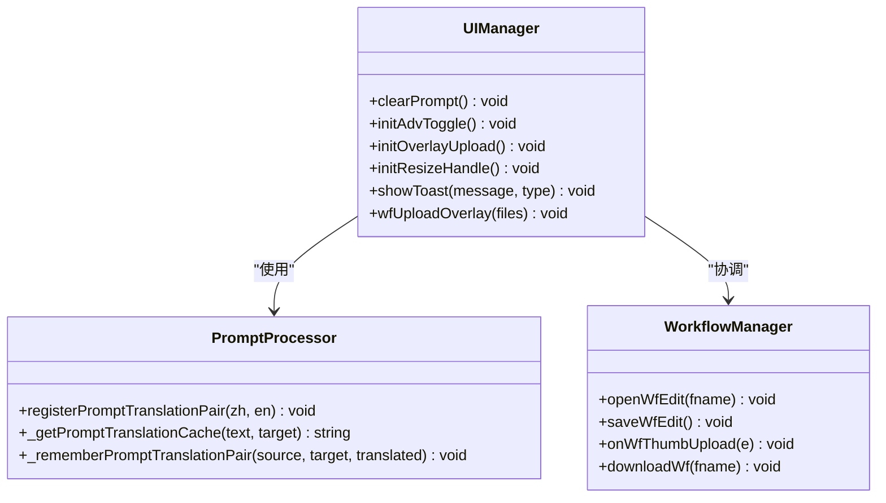
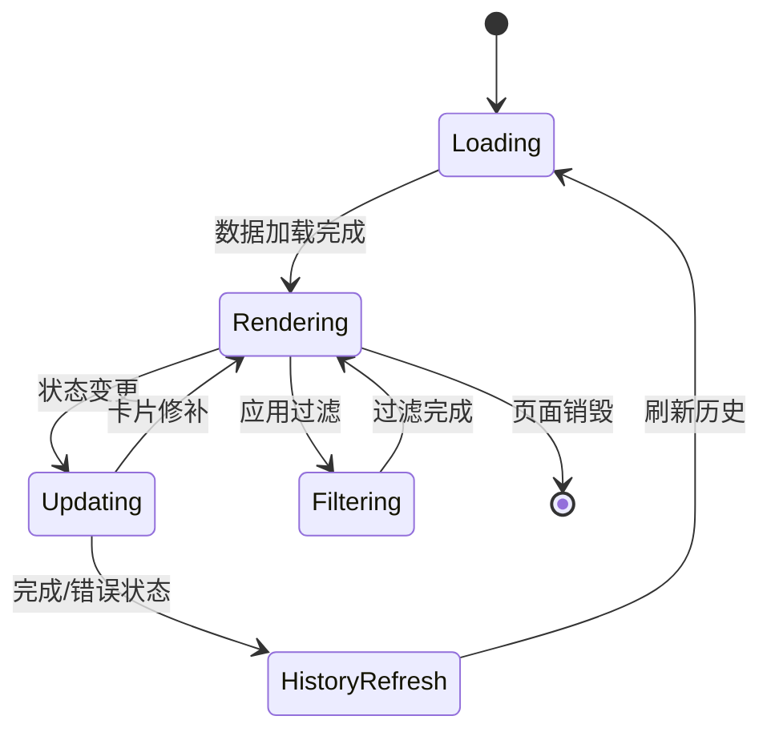
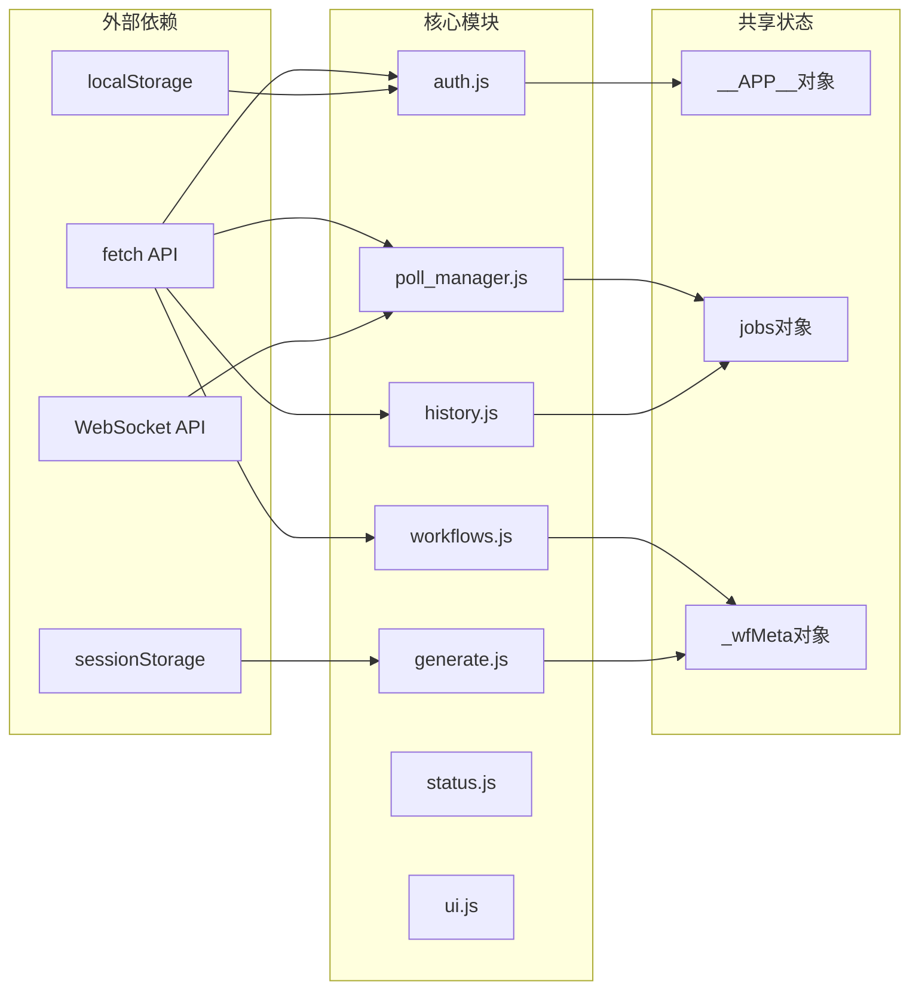

# 前端界面测试

<cite>
**本文档引用的文件**
- [module_loader.js](file://static/js/module_loader.js)
- [app.js](file://static/js/app.js)
- [auth.js](file://static/js/modules/auth.js)
- [ui.js](file://static/js/modules/ui.js)
- [workflows.js](file://static/js/modules/workflows.js)
- [history.js](file://static/js/modules/history.js)
- [generate.js](file://static/js/modules/generate.js)
- [poll_manager.js](file://static/js/modules/poll_manager.js)
- [status.js](file://static/js/modules/status.js)
- [card_manager.js](file://static/js/modules/card_manager.js)
- [index.html](file://static/index.html)
- [style.css](file://static/css/style.css)
</cite>

## 目录
1. [引言](#引言)
2. [项目结构](#项目结构)
3. [核心组件](#核心组件)
4. [架构概览](#架构概览)
5. [详细组件分析](#详细组件分析)
6. [依赖关系分析](#依赖关系分析)
7. [性能考虑](#性能考虑)
8. [故障排除指南](#故障排除指南)
9. [结论](#结论)

## 引言

Ez ComfyUI Showcase 是一个基于 Web 的图像生成平台，提供了完整的前端模块化架构。本文档专注于前端界面测试策略，涵盖 JavaScript 模块的独立测试、组件交互测试、状态管理测试以及 UI 测试的完整实施方案。

该应用采用模块化的前端架构，通过统一的模块加载器管理各个功能模块，实现了高度解耦的设计。前端测试策略需要考虑到模块间的依赖关系、异步操作的处理、WebSocket 通信的测试以及跨浏览器兼容性等问题。

## 项目结构

前端项目采用模块化设计，主要包含以下结构：

**图表来源**
- [module_loader.js:1-151](file://static/js/module_loader.js#L1-L151)
- [app.js:1-927](file://static/js/app.js#L1-L927)

**章节来源**
- [module_loader.js:1-151](file://static/js/module_loader.js#L1-L151)
- [app.js:1-927](file://static/js/app.js#L1-L927)

## 核心组件

### 模块加载器 (Module Loader)

模块加载器负责统一管理前端模块的加载顺序和依赖关系：

- **核心职责**: 管理模块加载顺序、处理异步加载、字体预连接、图标精灵加载
- **加载策略**: 核心模块优先加载，登录后模块按需加载
- **版本控制**: 通过查询参数实现缓存控制

### 应用主程序 (App)

应用主程序作为整个系统的入口点，负责：

- **全局状态管理**: 通过 `__APP__` 对象管理共享状态
- **初始化流程**: 设置视口、API 基础地址、全局事件监听
- **模块集成**: 协调各模块间的交互和通信

### 认证模块 (Auth)

提供完整的用户认证和授权功能：

- **用户状态管理**: 登录、登出、会话恢复
- **权限控制**: 基于角色的访问控制
- **UI 更新**: 自动更新界面元素显示状态

**章节来源**
- [module_loader.js:14-31](file://static/js/module_loader.js#L14-L31)
- [app.js:86-111](file://static/js/app.js#L86-L111)
- [auth.js:1-800](file://static/js/modules/auth.js#L1-L800)

## 架构概览

前端采用事件驱动的架构模式，通过 WebSocket 实现实时数据同步：

**图表来源**
- [poll_manager.js:161-218](file://static/js/modules/poll_manager.js#L161-L218)
- [poll_manager.js:312-435](file://static/js/modules/poll_manager.js#L312-L435)

**章节来源**
- [poll_manager.js:1-509](file://static/js/modules/poll_manager.js#L1-L509)

## 详细组件分析

### 认证模块测试策略

认证模块是前端测试的核心，需要覆盖以下场景：

#### 用户认证流程测试
- **登录功能**: 验证用户名密码验证、错误处理
- **会话管理**: 测试会话过期、自动恢复机制
- **权限验证**: 不同角色用户的访问权限测试

#### UI 交互测试
- **模态框显示**: 登录/注册对话框的显示和隐藏
- **按钮状态**: 根据认证状态动态更新按钮显示
- **表单验证**: 输入验证和错误提示

**图表来源**
- [auth.js:279-336](file://static/js/modules/auth.js#L279-L336)
- [auth.js:412-491](file://static/js/modules/auth.js#L412-L491)

**章节来源**
- [auth.js:1-800](file://static/js/modules/auth.js#L1-L800)

### UI 模块测试策略

UI 模块负责用户界面的各种交互功能：

#### 提示词处理测试
- **提示词翻译**: 中英文提示词互译功能
- **提示词优化**: 提示词优化算法测试
- **提示词缓存**: 翻译缓存机制验证

#### 工作流管理测试
- **工作流上传**: JSON 文件上传和验证
- **缩略图管理**: 工作流缩略图的上传和显示
- **标签系统**: 工作流标签的添加和管理

**图表来源**
- [ui.js:58-800](file://static/js/modules/ui.js#L58-L800)
- [workflows.js:213-364](file://static/js/modules/workflows.js#L213-L364)

**章节来源**
- [ui.js:1-800](file://static/js/modules/ui.js#L1-L800)
- [workflows.js:1-800](file://static/js/modules/workflows.js#L1-L800)

### 历史记录模块测试策略

历史记录模块处理生成任务的历史管理和展示：

#### 数据加载测试
- **分页加载**: 历史记录的分页加载机制
- **懒加载**: 无限滚动的懒加载实现
- **过滤功能**: 基于多种条件的历史记录过滤

#### 卡片渲染测试
- **动态渲染**: 基于数据动态生成卡片
- **状态更新**: 实时状态更新的卡片修补
- **媒体类型**: 支持图片和视频的不同渲染方式

**图表来源**
- [history.js:440-458](file://static/js/modules/history.js#L440-L458)
- [history.js:514-588](file://static/js/modules/history.js#L514-L588)

**章节来源**
- [history.js:1-800](file://static/js/modules/history.js#L1-L800)

### 生成模块测试策略

生成模块负责处理图像生成请求和参数配置：

#### 参数验证测试
- **尺寸限制**: 不同工作流的尺寸限制验证
- **比例计算**: 图像比例的自动计算和限制
- **种子值**: 随机种子的生成和管理

#### 风格预设测试
- **风格匹配**: 不同工作流的风格预设适配
- **参数转换**: 风格参数到工作流参数的转换
- **兼容性**: 新旧工作流的兼容性测试

**章节来源**
- [generate.js:1-800](file://static/js/modules/generate.js#L1-L800)

### 状态模块测试策略

状态模块监控和显示系统状态：

#### 实例状态测试
- **实例发现**: ComfyUI 实例的自动发现
- **状态同步**: 实例状态的实时同步
- **负载均衡**: 多实例的负载均衡显示

#### GPU 监控测试
- **资源监控**: GPU 内存使用情况监控
- **温度监控**: GPU 温度和利用率监控
- **告警机制**: 资源压力告警的触发和显示

**章节来源**
- [status.js:1-659](file://static/js/modules/status.js#L1-L659)

## 依赖关系分析

前端模块间存在复杂的依赖关系，需要特别关注：

**图表来源**
- [module_loader.js:145-150](file://static/js/module_loader.js#L145-L150)
- [app.js:86-111](file://static/js/app.js#L86-L111)

**章节来源**
- [module_loader.js:1-151](file://static/js/module_loader.js#L1-L151)
- [app.js:1-927](file://static/js/app.js#L1-L927)

## 性能考虑

前端性能测试重点关注以下几个方面：

### 加载性能测试
- **首屏加载时间**: 从页面加载到主要内容可见的时间
- **模块加载时间**: 各模块的异步加载性能
- **缓存策略**: 版本控制和缓存失效测试

### 运行时性能测试
- **渲染性能**: 大量历史记录的渲染性能
- **内存使用**: 长时间运行的内存泄漏检测
- **事件处理**: 高频事件的处理性能

### 网络性能测试
- **WebSocket 连接**: 连接建立和维护的性能
- **HTTP 轮询**: 轮询间隔和响应时间测试
- **错误重试**: 网络异常的重试机制测试

## 故障排除指南

### 常见问题诊断

#### 模块加载问题
- **检查加载顺序**: 确认模块加载器的依赖关系
- **版本冲突**: 验证缓存版本参数的一致性
- **网络错误**: 检查静态资源的可用性

#### WebSocket 连接问题
- **连接状态**: 监控连接建立和断开事件
- **重连机制**: 验证自动重连的逻辑
- **消息处理**: 确认消息解析和处理的正确性

#### 状态同步问题
- **数据一致性**: 验证 WebSocket 和 HTTP 轮询的数据一致性
- **状态丢失**: 检查状态更新的完整性
- **竞态条件**: 处理并发状态更新的问题

**章节来源**
- [poll_manager.js:200-218](file://static/js/modules/poll_manager.js#L200-L218)
- [module_loader.js:33-42](file://static/js/module_loader.js#L33-L42)

## 结论

Ez ComfyUI Showcase 的前端测试策略需要综合考虑模块化架构的特点，重点关注以下方面：

1. **模块独立测试**: 每个模块的功能测试和边界条件验证
2. **组件交互测试**: 模块间的通信和状态同步测试
3. **实时数据测试**: WebSocket 连接和消息处理的测试
4. **性能基准测试**: 关键路径的性能指标和优化
5. **兼容性测试**: 不同浏览器和设备的兼容性验证

通过建立完善的测试体系，可以确保前端系统的稳定性、性能和用户体验，为用户提供可靠的图像生成服务。