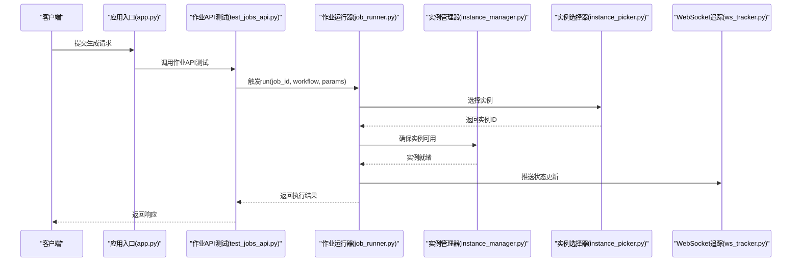
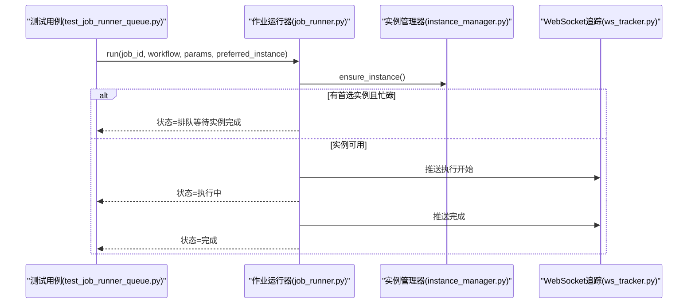
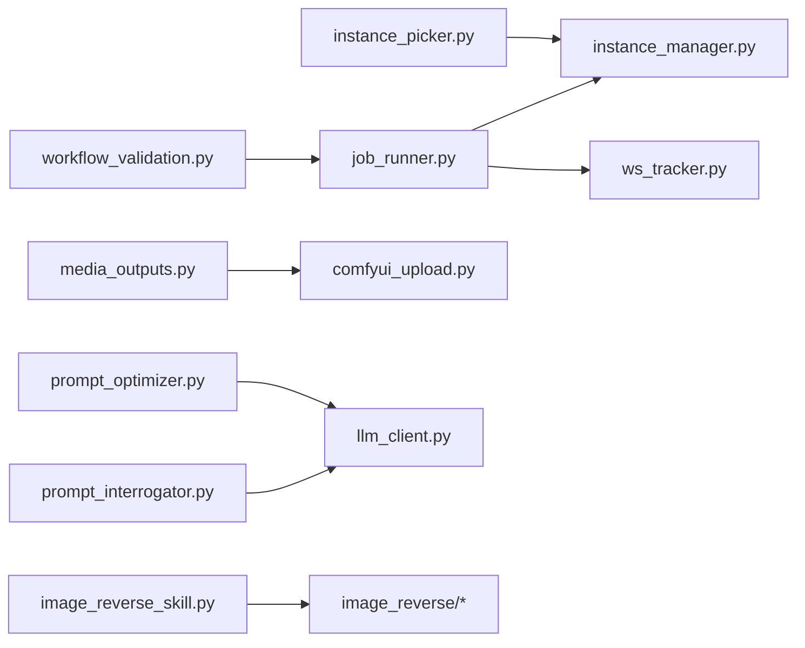

# 核心功能测试

<cite>
**本文档引用的文件**
- [app.py](file://app.py)
- [modules/job_runner.py](file://modules/job_runner.py)
- [modules/instance_manager.py](file://modules/instance_manager.py)
- [modules/instance_picker.py](file://modules/instance_picker.py)
- [modules/workflow_validation.py](file://modules/workflow_validation.py)
- [modules/media_outputs.py](file://modules/media_outputs.py)
- [modules/ws_tracker.py](file://modules/ws_tracker.py)
- [modules/comfyui_upload.py](file://modules/comfyui_upload.py)
- [modules/prompt_interrogator.py](file://modules/prompt_interrogator.py)
- [modules/prompt_optimizer.py](file://modules/prompt_optimizer.py)
- [modules/time_estimator.py](file://modules/time_estimator.py)
- [modules/step_calculator.py](file://modules/step_calculator.py)
- [modules/llm_client.py](file://modules/llm_client.py)
- [modules/image_protection.py](file://modules/image_protection.py)
- [modules/image_reverse_skill.py](file://modules/image_reverse_skill.py)
- [modules/image_reverse/parser.py](file://modules/image_reverse/parser.py)
- [modules/image_reverse/schemas.py](file://modules/image_reverse/schemas.py)
- [modules/image_reverse/pipelines.py](file://modules/image_reverse/pipelines.py)
- [modules/image_reverse/contracts.py](file://modules/image_reverse/contracts.py)
- [modules/image_reverse/legacy_adapter.py](file://modules/image_reverse/legacy_adapter.py)
- [tests/test_jobs_api.py](file://tests/test_jobs_api.py)
- [tests/test_history_api.py](file://tests/test_history_api.py)
- [tests/test_workflow_validation.py](file://tests/test_workflow_validation.py)
- [tests/test_instance_picker.py](file://tests/test_instance_picker.py)
- [tests/test_job_runner_queue.py](file://tests/test_job_runner_queue.py)
- [tests/test_global_generation_queue.py](file://tests/test_global_generation_queue.py)
- [tests/test_media_outputs.py](file://tests/test_media_outputs.py)
- [tests/test_logs_api.py](file://tests/test_logs_api.py)
- [tests/test_prompt_interrogator.py](file://tests/test_prompt_interrogator.py)
- [tests/test_prompt_optimizer.py](file://tests/test_prompt_optimizer.py)
- [tests/test_time_estimator.py](file://tests/test_time_estimator.py)
- [tests/test_step_calculator.py](file://tests/test_step_calculator.py)
- [tests/test_llm_client.py](file://tests/test_llm_client.py)
- [tests/test_image_protection.py](file://tests/test_image_protection.py)
- [tests/test_image_reverse_contracts.py](file://tests/test_image_reverse_contracts.py)
- [tests/test_image_reverse_pipelines.py](file://tests/test_image_reverse_pipelines.py)
- [tests/test_comfyui_upload.py](file://tests/test_comfyui_upload.py)
</cite>

## 目录
1. [引言](#引言)
2. [项目结构](#项目结构)
3. [核心组件](#核心组件)
4. [架构总览](#架构总览)
5. [详细组件分析](#详细组件分析)
6. [依赖分析](#依赖分析)
7. [性能考虑](#性能考虑)
8. [故障排查指南](#故障排查指南)
9. [结论](#结论)
10. [附录](#附录)

## 引言
本测试文档聚焦 Ez ComfyUI Showcase 的核心功能测试，覆盖作业管理 API、历史记录管理、工作流验证、实例选择算法、作业队列管理等关键模块。文档提供测试用例设计思路（正常流程、异常流程、边界条件、并发测试）、测试数据准备与模拟策略（数据库模拟、外部服务模拟、状态模拟）、断言策略与验证方法（响应验证、状态码验证、数据完整性验证），以及性能测试与压力测试实施方案，并给出测试失败分析与调试方法。

## 项目结构
项目采用模块化组织，核心后端逻辑集中在 modules 目录，前端交互与静态资源在 static 目录，测试用例集中在 tests 目录。应用入口为 app.py，负责路由与业务编排；各功能模块封装独立职责，如作业执行（job_runner）、实例管理（instance_manager）、工作流验证（workflow_validation）等。

```mermaid
graph TB
subgraph "应用入口"
APP["app.py"]
end
subgraph "核心模块"
JR["job_runner.py"]
IM["instance_manager.py"]
IP["instance_picker.py"]
WV["workflow_validation.py"]
MO["media_outputs.py"]
WT["ws_tracker.py"]
CU["comfyui_upload.py"]
PI["prompt_interrogator.py"]
PO["prompt_optimizer.py"]
TE["time_estimator.py"]
SC["step_calculator.py"]
LLM["llm_client.py"]
IPROTECT["image_protection.py"]
IR["image_reverse_skill.py"]
end
subgraph "测试用例"
TJ["tests/test_jobs_api.py"]
TH["tests/test_history_api.py"]
TW["tests/test_workflow_validation.py"]
TIP["tests/test_instance_picker.py"]
TJRQ["tests/test_job_runner_queue.py"]
TGQ["tests/test_global_generation_queue.py"]
TMO["tests/test_media_outputs.py"]
TL["tests/test_logs_api.py"]
TPI["tests/test_prompt_interrogator.py"]
TPO["tests/test_prompt_optimizer.py"]
TTE["tests/test_time_estimator.py"]
TSC["tests/test_step_calculator.py"]
TLLM["tests/test_llm_client.py"]
TIPROT["tests/test_image_protection.py"]
TIRCON["tests/test_image_reverse_contracts.py"]
TIRPIPE["tests/test_image_reverse_pipelines.py"]
TCU["tests/test_comfyui_upload.py"]
end
APP --> JR
APP --> IM
APP --> WV
APP --> MO
APP --> WT
APP --> CU
APP --> PI
APP --> PO
APP --> TE
APP --> SC
APP --> LLM
APP --> IPROTECT
APP --> IR
TJ -.-> APP
TH -.-> APP
TW -.-> WV
TIP -.-> IP
TJRQ -.-> JR
TGQ -.-> JR
TMO -.-> MO
TL -.-> APP
TPI -.-> PI
TPO -.-> PO
TTE -.-> TE
TSC -.-> SC
TLLM -.-> LLM
TIPROT -.-> IPROTECT
TIRCON -.-> IR
TIRPIPE -.-> IR
TCU -.-> CU
```

图表来源
- [app.py](file://app.py)
- [modules/job_runner.py](file://modules/job_runner.py)
- [modules/instance_manager.py](file://modules/instance_manager.py)
- [modules/instance_picker.py](file://modules/instance_picker.py)
- [modules/workflow_validation.py](file://modules/workflow_validation.py)
- [modules/media_outputs.py](file://modules/media_outputs.py)
- [modules/ws_tracker.py](file://modules/ws_tracker.py)
- [modules/comfyui_upload.py](file://modules/comfyui_upload.py)
- [modules/prompt_interrogator.py](file://modules/prompt_interrogator.py)
- [modules/prompt_optimizer.py](file://modules/prompt_optimizer.py)
- [modules/time_estimator.py](file://modules/time_estimator.py)
- [modules/step_calculator.py](file://modules/step_calculator.py)
- [modules/llm_client.py](file://modules/llm_client.py)
- [modules/image_protection.py](file://modules/image_protection.py)
- [modules/image_reverse_skill.py](file://modules/image_reverse_skill.py)
- [tests/test_jobs_api.py](file://tests/test_jobs_api.py)
- [tests/test_history_api.py](file://tests/test_history_api.py)
- [tests/test_workflow_validation.py](file://tests/test_workflow_validation.py)
- [tests/test_instance_picker.py](file://tests/test_instance_picker.py)
- [tests/test_job_runner_queue.py](file://tests/test_job_runner_queue.py)
- [tests/test_global_generation_queue.py](file://tests/test_global_generation_queue.py)
- [tests/test_media_outputs.py](file://tests/test_media_outputs.py)
- [tests/test_logs_api.py](file://tests/test_logs_api.py)
- [tests/test_prompt_interrogator.py](file://tests/test_prompt_interrogator.py)
- [tests/test_prompt_optimizer.py](file://tests/test_prompt_optimizer.py)
- [tests/test_time_estimator.py](file://tests/test_time_estimator.py)
- [tests/test_step_calculator.py](file://tests/test_step_calculator.py)
- [tests/test_llm_client.py](file://tests/test_llm_client.py)
- [tests/test_image_protection.py](file://tests/test_image_protection.py)
- [tests/test_image_reverse_contracts.py](file://tests/test_image_reverse_contracts.py)
- [tests/test_image_reverse_pipelines.py](file://tests/test_image_reverse_pipelines.py)
- [tests/test_comfyui_upload.py](file://tests/test_comfyui_upload.py)

章节来源
- [app.py](file://app.py)
- [modules/job_runner.py](file://modules/job_runner.py)
- [modules/instance_manager.py](file://modules/instance_manager.py)
- [modules/instance_picker.py](file://modules/instance_picker.py)
- [modules/workflow_validation.py](file://modules/workflow_validation.py)
- [modules/media_outputs.py](file://modules/media_outputs.py)
- [modules/ws_tracker.py](file://modules/ws_tracker.py)
- [modules/comfyui_upload.py](file://modules/comfyui_upload.py)
- [modules/prompt_interrogator.py](file://modules/prompt_interrogator.py)
- [modules/prompt_optimizer.py](file://modules/prompt_optimizer.py)
- [modules/time_estimator.py](file://modules/time_estimator.py)
- [modules/step_calculator.py](file://modules/step_calculator.py)
- [modules/llm_client.py](file://modules/llm_client.py)
- [modules/image_protection.py](file://modules/image_protection.py)
- [modules/image_reverse_skill.py](file://modules/image_reverse_skill.py)
- [tests/test_jobs_api.py](file://tests/test_jobs_api.py)
- [tests/test_history_api.py](file://tests/test_history_api.py)
- [tests/test_workflow_validation.py](file://tests/test_workflow_validation.py)
- [tests/test_instance_picker.py](file://tests/test_instance_picker.py)
- [tests/test_job_runner_queue.py](file://tests/test_job_runner_queue.py)
- [tests/test_global_generation_queue.py](file://tests/test_global_generation_queue.py)
- [tests/test_media_outputs.py](file://tests/test_media_outputs.py)
- [tests/test_logs_api.py](file://tests/test_logs_api.py)
- [tests/test_prompt_interrogator.py](file://tests/test_prompt_interrogator.py)
- [tests/test_prompt_optimizer.py](file://tests/test_prompt_optimizer.py)
- [tests/test_time_estimator.py](file://tests/test_time_estimator.py)
- [tests/test_step_calculator.py](file://tests/test_step_calculator.py)
- [tests/test_llm_client.py](file://tests/test_llm_client.py)
- [tests/test_image_protection.py](file://tests/test_image_protection.py)
- [tests/test_image_reverse_contracts.py](file://tests/test_image_reverse_contracts.py)
- [tests/test_image_reverse_pipelines.py](file://tests/test_image_reverse_pipelines.py)
- [tests/test_comfyui_upload.py](file://tests/test_comfyui_upload.py)

## 核心组件
- 作业管理与执行：由作业运行器负责异步执行、状态跟踪、输出保存与 WebSocket 通知。
- 实例管理与选择：实例管理器维护可用实例集合，实例选择器根据策略挑选最优实例。
- 工作流验证：对工作流配置进行合法性与兼容性检查。
- 媒体输出与上传：处理生成结果的媒体输出与上传。
- 提示词工具链：包含提示词查询、优化与标签处理。
- 时间估算与步数计算：基于历史与参数估算生成耗时与迭代步数。
- LLM 客户端与图像保护：集成外部 LLM 服务与图像保护能力。
- 图像反向技能：解析、校验与执行图像反向工作流。

章节来源
- [modules/job_runner.py](file://modules/job_runner.py)
- [modules/instance_manager.py](file://modules/instance_manager.py)
- [modules/instance_picker.py](file://modules/instance_picker.py)
- [modules/workflow_validation.py](file://modules/workflow_validation.py)
- [modules/media_outputs.py](file://modules/media_outputs.py)
- [modules/prompt_interrogator.py](file://modules/prompt_interrogator.py)
- [modules/prompt_optimizer.py](file://modules/prompt_optimizer.py)
- [modules/time_estimator.py](file://modules/time_estimator.py)
- [modules/step_calculator.py](file://modules/step_calculator.py)
- [modules/llm_client.py](file://modules/llm_client.py)
- [modules/image_protection.py](file://modules/image_protection.py)
- [modules/image_reverse_skill.py](file://modules/image_reverse_skill.py)

## 架构总览
下图展示核心模块间的调用关系与数据流向，突出作业从提交到完成的关键路径。

图表来源
- [app.py](file://app.py)
- [tests/test_jobs_api.py](file://tests/test_jobs_api.py)
- [modules/job_runner.py](file://modules/job_runner.py)
- [modules/instance_manager.py](file://modules/instance_manager.py)
- [modules/instance_picker.py](file://modules/instance_picker.py)
- [modules/ws_tracker.py](file://modules/ws_tracker.py)

## 详细组件分析

### 作业管理 API 测试
- 测试目标：验证作业提交、状态查询、取消、重试、清理等接口行为。
- 正常流程测试：提交有效作业，轮询状态直至完成，断言输出存在且格式正确。
- 异常流程测试：提交非法参数或不存在的工作流，断言返回错误状态码与错误信息。
- 边界条件测试：空参数、超长参数、特殊字符、重复作业ID等。
- 并发测试：多用户同时提交作业，验证互斥与隔离性。
- 断言策略：HTTP 状态码、JSON 结构、字段类型与范围、作业状态转换序列。
- 数据准备：使用测试专用工作流配置与媒体输出目录，确保可重复性。
- 模拟策略：使用 mock 替换外部服务调用，隔离数据库与网络依赖。
- 失败分析：记录请求/响应日志，定位状态机异常与回调缺失。

章节来源
- [tests/test_jobs_api.py](file://tests/test_jobs_api.py)
- [modules/job_runner.py](file://modules/job_runner.py)
- [modules/media_outputs.py](file://modules/media_outputs.py)

### 历史记录管理测试
- 测试目标：验证历史记录的增删改查、分页加载、焦点删除、粘性展示等功能。
- 正常流程测试：创建历史记录、分页拉取、按条件过滤、删除单条与批量删除。
- 异常流程测试：越权访问、删除进行中作业、重复删除同一记录。
- 边界条件测试：空列表、最大分页大小、时间戳边界。
- 并发测试：多线程写入与读取，验证一致性。
- 断言策略：记录数量、排序顺序、字段完整性、权限控制。
- 数据准备：预置历史数据集，使用内存存储模拟持久化。
- 模拟策略：mock 文件系统与数据库操作。
- 失败分析：对比期望与实际记录集，检查索引与缓存一致性。

章节来源
- [tests/test_history_api.py](file://tests/test_history_api.py)

### 工作流验证测试
- 测试目标：验证工作流配置的合法性、节点完整性、参数有效性与兼容性。
- 正常流程测试：通过合法工作流配置，断言验证通过且无警告。
- 异常流程测试：缺少必要节点、参数类型不匹配、版本不兼容。
- 边界条件测试：空工作流、极小/极大数值、特殊节点类型。
- 断言策略：验证结果列表、错误码映射、建议修复项。
- 数据准备：使用仓库中的真实工作流样例作为正负样本。
- 模拟策略：mock 外部依赖，集中验证逻辑。
- 失败分析：逐项比对验证规则，定位具体节点与参数问题。

章节来源
- [tests/test_workflow_validation.py](file://tests/test_workflow_validation.py)
- [modules/workflow_validation.py](file://modules/workflow_validation.py)

### 实例选择算法测试
- 测试目标：验证实例选择策略在不同负载、健康度、偏好下的正确性。
- 正常流程测试：多实例场景下选择最优实例，断言负载均衡与优先级。
- 异常流程测试：所有实例不可用、实例状态异常、选择超时。
- 边界条件测试：单实例、实例权重为零、空闲时间极短。
- 并发测试：高并发选择请求，验证锁与原子性。
- 断言策略：选择分布统计、平均响应时间、错误率。
- 数据准备：构造不同健康度与负载的实例集合。
- 模拟策略：mock 实例健康检查与负载上报。
- 失败分析：绘制选择直方图，定位策略偏差与竞态。

章节来源
- [tests/test_instance_picker.py](file://tests/test_instance_picker.py)
- [modules/instance_picker.py](file://modules/instance_picker.py)
- [modules/instance_manager.py](file://modules/instance_manager.py)

### 作业队列管理测试
- 测试目标：验证全局队列与实例内队列的行为、优先级、阻塞与恢复。
- 正常流程测试：多个作业排队、实例空闲后自动调度、完成通知。
- 异常流程测试：实例离线、作业被取消、队列溢出。
- 边界条件测试：空队列、单作业、极高优先级作业。
- 并发测试：多实例并发执行，验证去重与一致性。
- 断言策略：队列长度、作业状态变迁、调度延迟。
- 数据准备：使用内存作业表与事件队列。
- 模拟策略：mock 实例生命周期与网络通信。
- 失败分析：记录调度事件时间线，定位死锁与饥饿。

图表来源
- [tests/test_job_runner_queue.py](file://tests/test_job_runner_queue.py)
- [modules/job_runner.py](file://modules/job_runner.py)
- [modules/instance_manager.py](file://modules/instance_manager.py)
- [modules/ws_tracker.py](file://modules/ws_tracker.py)

章节来源
- [tests/test_job_runner_queue.py](file://tests/test_job_runner_queue.py)
- [tests/test_global_generation_queue.py](file://tests/test_global_generation_queue.py)
- [modules/job_runner.py](file://modules/job_runner.py)
- [modules/instance_manager.py](file://modules/instance_manager.py)
- [modules/ws_tracker.py](file://modules/ws_tracker.py)

### 媒体输出与上传测试
- 测试目标：验证生成结果的保存、命名、清理与上传行为。
- 正常流程测试：成功生成并保存媒体文件，上传至指定位置。
- 异常流程测试：磁盘空间不足、上传失败、文件损坏。
- 边界条件测试：大文件、特殊字符文件名、路径过长。
- 断言策略：文件存在性、哈希一致性、元数据完整。
- 数据准备：临时目录与占位文件。
- 模拟策略：mock 存储与网络传输。
- 失败分析：检查 IO 错误与网络超时，定位具体阶段。

章节来源
- [tests/test_media_outputs.py](file://tests/test_media_outputs.py)
- [modules/media_outputs.py](file://modules/media_outputs.py)
- [modules/comfyui_upload.py](file://modules/comfyui_upload.py)

### 日志与状态 API 测试
- 测试目标：验证日志获取、状态查询、通知推送等接口。
- 正常流程测试：实时拉取日志、订阅状态变更。
- 异常流程测试：无效日志级别、订阅超时、权限不足。
- 断言策略：日志行数、级别过滤、增量推送。
- 数据准备：预热日志缓冲区。
- 模拟策略：mock WebSocket 与日志后端。
- 失败分析：核对订阅 ID 与时间戳，排查丢包。

章节来源
- [tests/test_logs_api.py](file://tests/test_logs_api.py)
- [modules/ws_tracker.py](file://modules/ws_tracker.py)

### 提示词工具链测试
- 测试目标：验证提示词查询、优化与标签处理的准确性与性能。
- 正常流程测试：查询返回候选、优化提升质量、标签分类正确。
- 异常流程测试：查询超时、优化失败、标签冲突。
- 断言策略：候选数量、相似度阈值、标签覆盖率。
- 数据准备：标准提示词语料库。
- 模拟策略：mock LLM 与本地模型。
- 失败分析：对比优化前后指标，定位模型问题。

章节来源
- [tests/test_prompt_interrogator.py](file://tests/test_prompt_interrogator.py)
- [tests/test_prompt_optimizer.py](file://tests/test_prompt_optimizer.py)
- [modules/prompt_interrogator.py](file://modules/prompt_interrogator.py)
- [modules/prompt_optimizer.py](file://modules/prompt_optimizer.py)

### 时间估算与步数计算测试
- 测试目标：验证时间估算与步数计算的准确性与稳定性。
- 正常流程测试：输入典型参数，输出合理估算值。
- 异常流程测试：参数越界、缺失关键参数。
- 断言策略：误差范围、收敛速度、边界行为。
- 数据准备：历史作业数据集。
- 模拟策略：固定随机种子，保证可重复。
- 失败分析：绘制残差图，识别系统性偏差。

章节来源
- [tests/test_time_estimator.py](file://tests/test_time_estimator.py)
- [tests/test_step_calculator.py](file://tests/test_step_calculator.py)
- [modules/time_estimator.py](file://modules/time_estimator.py)
- [modules/step_calculator.py](file://modules/step_calculator.py)

### LLM 客户端测试
- 测试目标：验证外部 LLM 服务的调用、鉴权与响应解析。
- 正常流程测试：成功请求与响应解析。
- 异常流程测试：鉴权失败、网络超时、服务不可用。
- 断言策略：请求头、响应结构、错误码映射。
- 数据准备：Mock 服务端响应。
- 模拟策略：mock HTTP 客户端。
- 失败分析：检查请求签名与重试策略。

章节来源
- [tests/test_llm_client.py](file://tests/test_llm_client.py)
- [modules/llm_client.py](file://modules/llm_client.py)

### 图像保护测试
- 测试目标：验证图像保护策略与检测效果。
- 正常流程测试：敏感内容被标记或拦截。
- 异常流程测试：误报与漏报。
- 断言策略：命中率、假阳性率。
- 数据准备：敏感与非敏感图像集。
- 模拟策略：mock 检测服务。
- 失败分析：分析误判样本，调整阈值。

章节来源
- [tests/test_image_protection.py](file://tests/test_image_protection.py)
- [modules/image_protection.py](file://modules/image_protection.py)

### 图像反向技能测试
- 测试目标：验证图像反向工作流的解析、校验与执行。
- 正常流程测试：解析 JSON、校验契约、执行管线。
- 异常流程测试：格式错误、契约不匹配、执行失败。
- 断言策略：解析结果、校验通过率、执行成功率。
- 数据准备：多种反向工作流样例。
- 模拟策略：mock 外部依赖。
- 失败分析：定位解析与校验环节。

章节来源
- [tests/test_image_reverse_contracts.py](file://tests/test_image_reverse_contracts.py)
- [tests/test_image_reverse_pipelines.py](file://tests/test_image_reverse_pipelines.py)
- [modules/image_reverse/parser.py](file://modules/image_reverse/parser.py)
- [modules/image_reverse/schemas.py](file://modules/image_reverse/schemas.py)
- [modules/image_reverse/pipelines.py](file://modules/image_reverse/pipelines.py)
- [modules/image_reverse/contracts.py](file://modules/image_reverse/contracts.py)
- [modules/image_reverse/legacy_adapter.py](file://modules/image_reverse/legacy_adapter.py)
- [modules/image_reverse_skill.py](file://modules/image_reverse_skill.py)

## 依赖分析
- 组件耦合：作业运行器依赖实例管理器与 WebSocket 追踪；实例选择器依赖实例管理器；工作流验证独立但被作业流程调用。
- 外部依赖：LLM 客户端、存储与上传服务、提示词服务等通过模块化封装隔离。
- 循环依赖：未发现循环导入；各模块职责清晰。
- 风险点：队列调度与状态同步是高并发风险点，需重点监控。

图表来源
- [modules/job_runner.py](file://modules/job_runner.py)
- [modules/instance_manager.py](file://modules/instance_manager.py)
- [modules/instance_picker.py](file://modules/instance_picker.py)
- [modules/workflow_validation.py](file://modules/workflow_validation.py)
- [modules/media_outputs.py](file://modules/media_outputs.py)
- [modules/comfyui_upload.py](file://modules/comfyui_upload.py)
- [modules/prompt_interrogator.py](file://modules/prompt_interrogator.py)
- [modules/prompt_optimizer.py](file://modules/prompt_optimizer.py)
- [modules/llm_client.py](file://modules/llm_client.py)
- [modules/image_reverse_skill.py](file://modules/image_reverse_skill.py)
- [modules/image_reverse/parser.py](file://modules/image_reverse/parser.py)
- [modules/image_reverse/schemas.py](file://modules/image_reverse/schemas.py)
- [modules/image_reverse/pipelines.py](file://modules/image_reverse/pipelines.py)
- [modules/image_reverse/contracts.py](file://modules/image_reverse/contracts.py)
- [modules/image_reverse/legacy_adapter.py](file://modules/image_reverse/legacy_adapter.py)

## 性能考虑
- 并发测试：使用多线程/多进程模拟高并发作业提交与执行，观察队列积压与实例利用率。
- 负载测试：逐步增加作业速率，测量 P95/P99 延迟与吞吐量，识别瓶颈。
- 响应时间测试：分别测量 API 延迟、实例选择延迟、执行延迟与推送延迟。
- 资源监控：CPU、内存、磁盘 IO、网络带宽与实例 GPU 利用率。
- 优化建议：引入限流与背压、优化热点实例选择、缓存常用工作流与提示词、压缩媒体输出。

## 故障排查指南
- 日志分析：启用详细日志，记录请求 ID、作业 ID、实例 ID 与时间戳，便于回溯。
- 错误定位：结合断言失败与模拟替换点，缩小问题范围至特定模块或函数。
- 问题复现：使用最小化测试用例与固定种子，确保可重复。
- 状态机检查：核对作业状态转换序列，识别异常分支。
- 回滚策略：对影响全局的变更采用灰度发布与快速回滚。

## 结论
本文档系统梳理了 Ez ComfyUI Showcase 的核心功能测试方案，涵盖作业管理、历史记录、工作流验证、实例选择与队列管理等关键模块。通过规范的测试用例设计、数据与模拟策略、断言与验证方法，以及性能与故障排查流程，能够有效保障系统稳定性与可靠性。建议持续完善测试矩阵，加强自动化与可视化监控，提升回归效率与问题定位速度。

## 附录
- 测试环境要求：Python 版本、依赖安装、数据库与外部服务配置。
- 测试数据清单：工作流样例、历史记录样本、媒体文件与日志模板。
- 常用命令：pytest 运行、覆盖率统计、性能基准测试脚本。