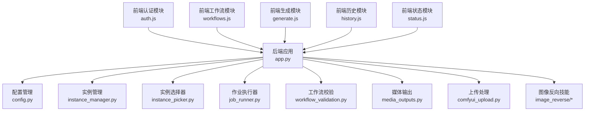
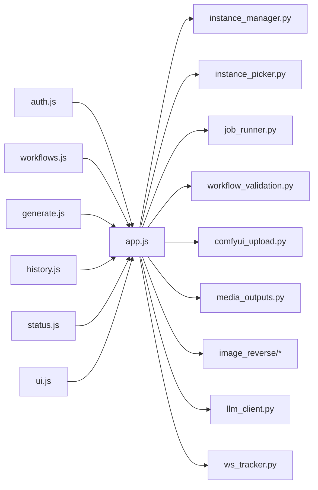

# 测试与质量保证

<cite>
**本文引用的文件**
- [app.py](file://app.py)
- [modules/config.py](file://modules/config.py)
- [modules/instance_manager.py](file://modules/instance_manager.py)
- [modules/instance_picker.py](file://modules/instance_picker.py)
- [modules/job_runner.py](file://modules/job_runner.py)
- [modules/comfyui_upload.py](file://modules/comfyui_upload.py)
- [modules/media_outputs.py](file://modules/media_outputs.py)
- [modules/prompt_interrogator.py](file://modules/prompt_interrogator.py)
- [modules/prompt_labels.py](file://modules/prompt_labels.py)
- [modules/prompt_optimizer.py](file://modules/prompt_optimizer.py)
- [modules/image_reverse/contracts.py](file://modules/image_reverse/contracts.py)
- [modules/image_reverse/pipelines.py](file://modules/image_reverse/pipelines.py)
- [modules/image_reverse/schemas.py](file://modules/image_reverse/schemas.py)
- [modules/image_reverse/parser.py](file://modules/image_reverse/parser.py)
- [modules/image_reverse/legacy_adapter.py](file://modules/image_reverse/legacy_adapter.py)
- [modules/image_reverse_skill.py](file://modules/image_reverse_skill.py)
- [modules/llm_client.py](file://modules/llm_client.py)
- [modules/workflow_validation.py](file://modules/workflow_validation.py)
- [modules/ws_tracker.py](file://modules/ws_tracker.py)
- [static/js/app.js](file://static/js/app.js)
- [static/js/module_loader.js](file://static/js/module_loader.js)
- [static/js/modules/auth.js](file://static/js/modules/auth.js)
- [static/js/modules/workflows.js](file://static/js/modules/workflows.js)
- [static/js/modules/generate.js](file://static/js/modules/generate.js)
- [static/js/modules/history.js](file://static/js/modules/history.js)
- [static/js/modules/status.js](file://static/js/modules/status.js)
- [static/js/modules/ui.js](file://static/js/modules/ui.js)
- [static/index.html](file://static/index.html)
- [tests/test_jobs_api.py](file://tests/test_jobs_api.py)
- [tests/test_history_api.py](file://tests/test_history_api.py)
- [tests/test_logs_api.py](file://tests/test_logs_api.py)
- [tests/test_system_settings_api.py](file://tests/test_system_settings_api.py)
- [tests/test_upload_image_api.py](file://tests/test_upload_image_api.py)
- [tests/test_flux2_dev_i2i_workflow.py](file://tests/test_flux2_dev_i2i_workflow.py)
- [tests/test_flux2_dev_unsloth_workflows.py](file://tests/test_flux2_dev_unsloth_workflows.py)
- [tests/test_flux2_klein_workflows.py](file://tests/test_flux2_klein_workflows.py)
- [tests/test_ltx_10eros_workflow.py](file://tests/test_ltx_10eros_workflow.py)
- [tests/test_ltx_sulphur_i2v_workflow.py](file://tests/test_ltx_sulphur_i2v_workflow.py)
- [tests/test_ltx_tattoo_video_workflow.py](file://tests/test_ltx_tattoo_video_workflow.py)
- [tests/test_seedvr2_video_upscale_workflows.py](file://tests/test_seedvr2_video_upscale_workflows.py)
- [tests/test_workflow_validation.py](file://tests/test_workflow_validation.py)
- [tests/test_image_reverse_contracts.py](file://tests/test_image_reverse_contracts.py)
- [tests/test_image_reverse_pipelines.py](file://tests/test_image_reverse_pipelines.py)
- [tests/test_prompt_interrogator.py](file://tests/test_prompt_interrogator.py)
- [tests/test_prompt_labels.py](file://tests/test_prompt_labels.py)
- [tests/test_prompt_optimizer.py](file://tests/test_prompt_optimizer.py)
- [tests/test_llm_client.py](file://tests/test_llm_client.py)
- [tests/test_comfyui_upload.py](file://tests/test_comfyui_upload.py)
- [tests/test_media_outputs.py](file://tests/test_media_outputs.py)
- [tests/test_instance_picker.py](file://tests/test_instance_picker.py)
- [tests/test_instance_idle_guard.py](file://tests/test_instance_idle_guard.py)
- [tests/test_job_runner_queue.py](file://tests/test_job_runner_queue.py)
- [tests/test_job_time_estimates.py](file://tests/test_job_time_estimates.py)
- [tests/test_job_timer_estimate_ui.py](file://tests/test_job_timer_estimate_ui.py)
- [tests/test_global_generation_queue.py](file://tests/test_global_generation_queue.py)
- [tests/test_gallery_job_isolation.py](file://tests/test_gallery_job_isolation.py)
- [tests/test_gallery_job_patch_stability.py](file://tests/test_gallery_job_patch_stability.py)
- [tests/test_gallery_patch.py](file://tests/test_gallery_patch.py)
- [tests/test_poll_manager_resume.py](file://tests/test_poll_manager_resume.py)
- [tests/test_progress_calculation.py](file://tests/test_progress_calculation.py)
- [tests/test_account_history_ui.py](file://tests/test_account_history_ui.py)
- [tests/test_director_mode_ui.py](file://tests/test_director_mode_ui.py)
- [tests/test_video_editor_ui.py](file://tests/test_video_editor_ui.py)
- [tests/test_video_preview_ui.py](file://tests/test_video_preview_ui.py)
- [tests/test_workflow_manager_ui.py](file://tests/test_workflow_manager_ui.py)
- [tests/test_workflow_meta_api.py](file://tests/test_workflow_meta_api.py)
- [tests/test_status_ui.py](file://tests/test_status_ui.py)
- [tests/test_system_settings_ui.py](file://tests/test_system_settings_ui.py)
- [tests/test_prompt_interrogate_ui.py](file://tests/test_prompt_interrogate_ui.py)
- [tests/test_prompt_reuse_ui.py](file://tests/test_prompt_reuse_ui.py)
- [tests/test_log_panel_ui.py](file://tests/test_log_panel_ui.py)
- [tests/test_site_notifications_api.py](file://tests/test_site_notifications_api.py)
- [tests/test_site_notifications_ui.py](file://tests/test_site_notifications_ui.py)
- [tests/test_security_controls.py](file://tests/test_security_controls.py)
- [tests/test_image_protection.py](file://tests/test_image_protection.py)
- [tests/test_css_loading.py](file://tests/test_css_loading.py)
- [tests/test_modal_safari_css.py](file://tests/test_modal_safari_css.py)
- [tests/test_lightbox_sizing.py](file://tests/test_lightbox_sizing.py)
- [tests/test_titlebar_layout.py](file://tests/test_titlebar_layout.py)
- [tests/test_toast_throttle.py](file://tests/test_toast_throttle.py)
- [tests/test_startup_load_dedup_ui.py](file://tests/test_startup_load_dedup_ui.py)
- [tests/test_status_button_runtime.py](file://tests/test_status_button_runtime.py)
- [tests/test_status_gpu_message.py](file://tests/test_status_gpu_message.py)
- [tests/test_device_manager_ui.py](file://tests/test_device_manager_ui.py)
- [tests/test_job_card_layout.py](file://tests/test_job_card_layout.py)
- [tests/test_job_card_media_neutral_status.py](file://tests/test_job_card_media_neutral_status.py)
- [tests/test_job_complete_animation.py](file://tests/test_job_complete_animation.py)
- [tests/test_job_resume.py](file://tests/test_job_resume.py)
- [tests/test_legacy_vllm_management.py](file://tests/test_legacy_vllm_management.py)
- [tests/test_seed_field_detection.py](file://tests/test_seed_field_detection.py)
- [tests/test_sensitive_preview_keywords.py](file://tests/test_sensitive_preview_keywords.py)
- [tests/test_app_version.py](file://tests/test_app_version.py)
- [README.md](file://README.md)
- [PROJECT_STANDARDS.md](file://PROJECT_STANDARDS.md)
- [BRANCHING.md](file://BRANCHING.md)
</cite>

## 目录
1. [引言](#引言)
2. [项目结构](#项目结构)
3. [核心组件](#核心组件)
4. [架构总览](#架构总览)
5. [详细组件分析](#详细组件分析)
6. [依赖分析](#依赖分析)
7. [性能考虑](#性能考虑)
8. [故障排查指南](#故障排查指南)
9. [结论](#结论)
10. [附录](#附录)

## 引言
本文件面向 Ez ComfyUI Showcase 的测试与质量保证，系统性阐述测试策略与方法论，覆盖单元测试、集成测试、端到端测试；说明测试框架与工具使用（pytest 配置、测试数据准备、模拟对象）；详列核心业务流程（用户认证、工作流管理、实例调度、作业执行）的测试覆盖；给出前端测试策略（模块化前端、UI 交互、状态管理）；提供性能与压力测试方案；总结代码质量保障（规范检查、静态分析、覆盖率）；梳理持续集成与部署中的测试流程（自动化测试、质量门禁、发布验证）；最后给出缺陷跟踪与修复流程及最佳实践。

## 项目结构
项目采用前后端分离与模块化设计：后端以 Flask 应用为中心，通过模块化 Python 包承载业务能力；前端采用模块化 JS 架构，配合静态资源与 HTML 入口；测试目录集中于 tests/，覆盖 API、UI、工作流、图像处理、实例与队列等多个维度。

```mermaid
graph TB
subgraph "后端应用"
APP["app.py<br/>Flask 应用入口"]
CFG["modules/config.py<br/>配置管理"]
INST_MGR["modules/instance_manager.py<br/>实例管理"]
INST_PICK["modules/instance_picker.py<br/>实例选择器"]
JOB_RUN["modules/job_runner.py<br/>作业执行器"]
WF_VAL["modules/workflow_validation.py<br/>工作流校验"]
WS_TRK["modules/ws_tracker.py<br/>WebSocket 跟踪"]
MEDIA["modules/media_outputs.py<br/>媒体输出"]
LLM["modules/llm_client.py<br/>LLM 客户端"]
IMG_REV["modules/image_reverse/*<br/>图像反向技能"]
end
subgraph "前端"
HTML["static/index.html<br/>页面入口"]
JS_APP["static/js/app.js<br/>应用主模块"]
MOD_LOADER["static/js/module_loader.js<br/>模块加载器"]
MOD_AUTH["static/js/modules/auth.js"]
MOD_WF["static/js/modules/workflows.js"]
MOD_GEN["static/js/modules/generate.js"]
MOD_HIS["static/js/modules/history.js"]
MOD_STS["static/js/modules/status.js"]
MOD_UI["static/js/modules/ui.js"]
end
subgraph "测试"
T_API["tests/*_api.py"]
T_UI["tests/*_ui.py"]
T_WF["tests/*workflow*.py"]
T_IMG["tests/*image_reverse*.py"]
T_UTIL["tests/*prompt*.py<br/>tests/*media*.py<br/>tests/*upload*.py"]
end
APP --> CFG
APP --> INST_MGR
APP --> INST_PICK
APP --> JOB_RUN
APP --> WF_VAL
APP --> WS_TRK
APP --> MEDIA
APP --> LLM
APP --> IMG_REV
HTML --> JS_APP
JS_APP --> MOD_LOADER
JS_APP --> MOD_AUTH
JS_APP --> MOD_WF
JS_APP --> MOD_GEN
JS_APP --> MOD_HIS
JS_APP --> MOD_STS
JS_APP --> MOD_UI
T_API --> APP
T_UI --> JS_APP
T_WF --> APP
T_UTIL --> APP
```

图示来源
- [app.py](file://app.py)
- [modules/config.py](file://modules/config.py)
- [modules/instance_manager.py](file://modules/instance_manager.py)
- [modules/instance_picker.py](file://modules/instance_picker.py)
- [modules/job_runner.py](file://modules/job_runner.py)
- [modules/workflow_validation.py](file://modules/workflow_validation.py)
- [modules/ws_tracker.py](file://modules/ws_tracker.py)
- [modules/media_outputs.py](file://modules/media_outputs.py)
- [modules/llm_client.py](file://modules/llm_client.py)
- [modules/image_reverse/pipelines.py](file://modules/image_reverse/pipelines.py)
- [static/index.html](file://static/index.html)
- [static/js/app.js](file://static/js/app.js)
- [static/js/module_loader.js](file://static/js/module_loader.js)
- [static/js/modules/auth.js](file://static/js/modules/auth.js)
- [static/js/modules/workflows.js](file://static/js/modules/workflows.js)
- [static/js/modules/generate.js](file://static/js/modules/generate.js)
- [static/js/modules/history.js](file://static/js/modules/history.js)
- [static/js/modules/status.js](file://static/js/modules/status.js)
- [static/js/modules/ui.js](file://static/js/modules/ui.js)
- [tests/test_jobs_api.py](file://tests/test_jobs_api.py)
- [tests/test_workflow_validation.py](file://tests/test_workflow_validation.py)
- [tests/test_image_reverse_pipelines.py](file://tests/test_image_reverse_pipelines.py)
- [tests/test_prompt_interrogator.py](file://tests/test_prompt_interrogator.py)
- [tests/test_media_outputs.py](file://tests/test_media_outputs.py)
- [tests/test_comfyui_upload.py](file://tests/test_comfyui_upload.py)

章节来源
- [app.py](file://app.py)
- [README.md](file://README.md)

## 核心组件
- 应用入口与路由：后端通过 app.py 提供 REST API 与 WebSocket 接口，负责请求分发与业务编排。
- 实例管理与选择：instance_manager.py 管理计算实例生命周期，instance_picker.py 基于策略选择可用实例。
- 作业执行：job_runner.py 负责作业队列、调度、执行与状态更新。
- 工作流与校验：workflow_validation.py 对工作流配置进行格式与参数校验。
- 媒体与上传：comfyui_upload.py 处理上传，media_outputs.py 统一输出媒体资源路径与元数据。
- 图像反向技能：image_reverse/* 模块实现图像反向解析、提示词生成与管道执行。
- 前端模块：auth/workflows/generate/history/status/ui 等模块分别承担认证、工作流管理、生成、历史、状态与 UI 控制逻辑。
- 测试覆盖：tests/ 下包含 API、UI、工作流、图像处理、提示词、媒体、上传、实例与队列等测试用例。

章节来源
- [modules/instance_manager.py](file://modules/instance_manager.py)
- [modules/instance_picker.py](file://modules/instance_picker.py)
- [modules/job_runner.py](file://modules/job_runner.py)
- [modules/workflow_validation.py](file://modules/workflow_validation.py)
- [modules/comfyui_upload.py](file://modules/comfyui_upload.py)
- [modules/media_outputs.py](file://modules/media_outputs.py)
- [modules/image_reverse/pipelines.py](file://modules/image_reverse/pipelines.py)
- [static/js/modules/auth.js](file://static/js/modules/auth.js)
- [static/js/modules/workflows.js](file://static/js/modules/workflows.js)
- [static/js/modules/generate.js](file://static/js/modules/generate.js)
- [static/js/modules/history.js](file://static/js/modules/history.js)
- [static/js/modules/status.js](file://static/js/modules/status.js)
- [static/js/modules/ui.js](file://static/js/modules/ui.js)

## 架构总览
下图展示后端服务与前端模块之间的交互关系，以及关键业务流程（认证、工作流管理、实例选择、作业执行、媒体输出）在测试层面的覆盖点。

图示来源
- [app.py](file://app.py)
- [modules/config.py](file://modules/config.py)
- [modules/instance_manager.py](file://modules/instance_manager.py)
- [modules/instance_picker.py](file://modules/instance_picker.py)
- [modules/job_runner.py](file://modules/job_runner.py)
- [modules/workflow_validation.py](file://modules/workflow_validation.py)
- [modules/media_outputs.py](file://modules/media_outputs.py)
- [modules/comfyui_upload.py](file://modules/comfyui_upload.py)
- [modules/image_reverse/pipelines.py](file://modules/image_reverse/pipelines.py)
- [static/js/modules/auth.js](file://static/js/modules/auth.js)
- [static/js/modules/workflows.js](file://static/js/modules/workflows.js)
- [static/js/modules/generate.js](file://static/js/modules/generate.js)
- [static/js/modules/history.js](file://static/js/modules/history.js)
- [static/js/modules/status.js](file://static/js/modules/status.js)

## 详细组件分析

### 用户认证（前端）
- 测试策略：验证登录态保持、会话失效重定向、权限控制等 UI 行为；结合后端接口测试确保认证流程闭环。
- 关键测试用例参考：
  - [tests/test_account_history_ui.py](file://tests/test_account_history_ui.py)
  - [tests/test_director_mode_ui.py](file://tests/test_director_mode_ui.py)
  - [tests/test_system_settings_ui.py](file://tests/test_system_settings_ui.py)
- 前端模块定位：
  - [static/js/modules/auth.js](file://static/js/modules/auth.js)
  - [static/js/app.js](file://static/js/app.js)
  - [static/js/module_loader.js](file://static/js/module_loader.js)

章节来源
- [static/js/modules/auth.js](file://static/js/modules/auth.js)
- [static/js/app.js](file://static/js/app.js)
- [static/js/module_loader.js](file://static/js/module_loader.js)
- [tests/test_account_history_ui.py](file://tests/test_account_history_ui.py)
- [tests/test_director_mode_ui.py](file://tests/test_director_mode_ui.py)
- [tests/test_system_settings_ui.py](file://tests/test_system_settings_ui.py)

### 工作流管理（后端+前端）
- 后端职责：工作流配置校验、元数据 API、上传与存储。
- 前端职责：工作流列表、编辑、选择、提交与状态展示。
- 关键测试用例参考：
  - [tests/test_workflow_validation.py](file://tests/test_workflow_validation.py)
  - [tests/test_workflow_meta_api.py](file://tests/test_workflow_meta_api.py)
  - [tests/test_workflow_manager_ui.py](file://tests/test_workflow_manager_ui.py)
  - [tests/test_flux2_dev_i2i_workflow.py](file://tests/test_flux2_dev_i2i_workflow.py)
  - [tests/test_flux2_dev_unsloth_workflows.py](file://tests/test_flux2_dev_unsloth_workflows.py)
  - [tests/test_flux2_klein_workflows.py](file://tests/test_flux2_klein_workflows.py)
  - [tests/test_ltx_10eros_workflow.py](file://tests/test_ltx_10eros_workflow.py)
  - [tests/test_ltx_sulphur_i2v_workflow.py](file://tests/test_ltx_sulphur_i2v_workflow.py)
  - [tests/test_ltx_tattoo_video_workflow.py](file://tests/test_ltx_tattoo_video_workflow.py)
  - [tests/test_seedvr2_video_upscale_workflows.py](file://tests/test_seedvr2_video_upscale_workflows.py)
- 后端模块定位：
  - [modules/workflow_validation.py](file://modules/workflow_validation.py)
  - [modules/comfyui_upload.py](file://modules/comfyui_upload.py)
  - [modules/media_outputs.py](file://modules/media_outputs.py)
- 前端模块定位：
  - [static/js/modules/workflows.js](file://static/js/modules/workflows.js)
  - [static/js/modules/generate.js](file://static/js/modules/generate.js)

章节来源
- [modules/workflow_validation.py](file://modules/workflow_validation.py)
- [modules/comfyui_upload.py](file://modules/comfyui_upload.py)
- [modules/media_outputs.py](file://modules/media_outputs.py)
- [static/js/modules/workflows.js](file://static/js/modules/workflows.js)
- [static/js/modules/generate.js](file://static/js/modules/generate.js)
- [tests/test_workflow_validation.py](file://tests/test_workflow_validation.py)
- [tests/test_workflow_meta_api.py](file://tests/test_workflow_meta_api.py)
- [tests/test_workflow_manager_ui.py](file://tests/test_workflow_manager_ui.py)
- [tests/test_flux2_dev_i2i_workflow.py](file://tests/test_flux2_dev_i2i_workflow.py)
- [tests/test_flux2_dev_unsloth_workflows.py](file://tests/test_flux2_dev_unsloth_workflows.py)
- [tests/test_flux2_klein_workflows.py](file://tests/test_flux2_klein_workflows.py)
- [tests/test_ltx_10eros_workflow.py](file://tests/test_ltx_10eros_workflow.py)
- [tests/test_ltx_sulphur_i2v_workflow.py](file://tests/test_ltx_sulphur_i2v_workflow.py)
- [tests/test_ltx_tattoo_video_workflow.py](file://tests/test_ltx_tattoo_video_workflow.py)
- [tests/test_seedvr2_video_upscale_workflows.py](file://tests/test_seedvr2_video_upscale_workflows.py)

### 实例调度与作业执行
- 实例管理：实例注册、空闲守护、健康检查与回收。
- 作业执行：队列管理、并发度控制、进度计算、恢复与完成通知。
- 关键测试用例参考：
  - [tests/test_instance_picker.py](file://tests/test_instance_picker.py)
  - [tests/test_instance_idle_guard.py](file://tests/test_instance_idle_guard.py)
  - [tests/test_job_runner_queue.py](file://tests/test_job_runner_queue.py)
  - [tests/test_job_time_estimates.py](file://tests/test_job_time_estimates.py)
  - [tests/test_job_timer_estimate_ui.py](file://tests/test_job_timer_estimate_ui.py)
  - [tests/test_global_generation_queue.py](file://tests/test_global_generation_queue.py)
  - [tests/test_gallery_job_isolation.py](file://tests/test_gallery_job_isolation.py)
  - [tests/test_gallery_job_patch_stability.py](file://tests/test_gallery_job_patch_stability.py)
  - [tests/test_gallery_patch.py](file://tests/test_gallery_patch.py)
  - [tests/test_poll_manager_resume.py](file://tests/test_poll_manager_resume.py)
  - [tests/test_progress_calculation.py](file://tests/test_progress_calculation.py)
  - [tests/test_job_resume.py](file://tests/test_job_resume.py)
- 后端模块定位：
  - [modules/instance_manager.py](file://modules/instance_manager.py)
  - [modules/instance_picker.py](file://modules/instance_picker.py)
  - [modules/job_runner.py](file://modules/job_runner.py)

章节来源
- [modules/instance_manager.py](file://modules/instance_manager.py)
- [modules/instance_picker.py](file://modules/instance_picker.py)
- [modules/job_runner.py](file://modules/job_runner.py)
- [tests/test_instance_picker.py](file://tests/test_instance_picker.py)
- [tests/test_instance_idle_guard.py](file://tests/test_instance_idle_guard.py)
- [tests/test_job_runner_queue.py](file://tests/test_job_runner_queue.py)
- [tests/test_job_time_estimates.py](file://tests/test_job_time_estimates.py)
- [tests/test_job_timer_estimate_ui.py](file://tests/test_job_timer_estimate_ui.py)
- [tests/test_global_generation_queue.py](file://tests/test_global_generation_queue.py)
- [tests/test_gallery_job_isolation.py](file://tests/test_gallery_job_isolation.py)
- [tests/test_gallery_job_patch_stability.py](file://tests/test_gallery_job_patch_stability.py)
- [tests/test_gallery_patch.py](file://tests/test_gallery_patch.py)
- [tests/test_poll_manager_resume.py](file://tests/test_poll_manager_resume.py)
- [tests/test_progress_calculation.py](file://tests/test_progress_calculation.py)
- [tests/test_job_resume.py](file://tests/test_job_resume.py)

### 图像反向技能与提示词处理
- 图像反向：解析输入、生成提示词、执行工作流管道。
- 提示词：询问、标签与优化。
- 关键测试用例参考：
  - [tests/test_image_reverse_contracts.py](file://tests/test_image_reverse_contracts.py)
  - [tests/test_image_reverse_pipelines.py](file://tests/test_image_reverse_pipelines.py)
  - [tests/test_prompt_interrogator.py](file://tests/test_prompt_interrogator.py)
  - [tests/test_prompt_labels.py](file://tests/test_prompt_labels.py)
  - [tests/test_prompt_optimizer.py](file://tests/test_prompt_optimizer.py)
- 后端模块定位：
  - [modules/image_reverse/contracts.py](file://modules/image_reverse/contracts.py)
  - [modules/image_reverse/pipelines.py](file://modules/image_reverse/pipelines.py)
  - [modules/image_reverse/schemas.py](file://modules/image_reverse/schemas.py)
  - [modules/image_reverse/parser.py](file://modules/image_reverse/parser.py)
  - [modules/image_reverse/legacy_adapter.py](file://modules/image_reverse/legacy_adapter.py)
  - [modules/image_reverse_skill.py](file://modules/image_reverse_skill.py)
  - [modules/prompt_interrogator.py](file://modules/prompt_interrogator.py)
  - [modules/prompt_labels.py](file://modules/prompt_labels.py)
  - [modules/prompt_optimizer.py](file://modules/prompt_optimizer.py)

章节来源
- [modules/image_reverse/contracts.py](file://modules/image_reverse/contracts.py)
- [modules/image_reverse/pipelines.py](file://modules/image_reverse/pipelines.py)
- [modules/image_reverse/schemas.py](file://modules/image_reverse/schemas.py)
- [modules/image_reverse/parser.py](file://modules/image_reverse/parser.py)
- [modules/image_reverse/legacy_adapter.py](file://modules/image_reverse/legacy_adapter.py)
- [modules/image_reverse_skill.py](file://modules/image_reverse_skill.py)
- [modules/prompt_interrogator.py](file://modules/prompt_interrogator.py)
- [modules/prompt_labels.py](file://modules/prompt_labels.py)
- [modules/prompt_optimizer.py](file://modules/prompt_optimizer.py)
- [tests/test_image_reverse_contracts.py](file://tests/test_image_reverse_contracts.py)
- [tests/test_image_reverse_pipelines.py](file://tests/test_image_reverse_pipelines.py)
- [tests/test_prompt_interrogator.py](file://tests/test_prompt_interrogator.py)
- [tests/test_prompt_labels.py](file://tests/test_prompt_labels.py)
- [tests/test_prompt_optimizer.py](file://tests/test_prompt_optimizer.py)

### 媒体输出与上传
- 上传与输出：统一处理上传、生成输出路径与元数据、清理与去重。
- 关键测试用例参考：
  - [tests/test_comfyui_upload.py](file://tests/test_comfyui_upload.py)
  - [tests/test_media_outputs.py](file://tests/test_media_outputs.py)
  - [tests/test_upload_image_api.py](file://tests/test_upload_image_api.py)
- 后端模块定位：
  - [modules/comfyui_upload.py](file://modules/comfyui_upload.py)
  - [modules/media_outputs.py](file://modules/media_outputs.py)

章节来源
- [modules/comfyui_upload.py](file://modules/comfyui_upload.py)
- [modules/media_outputs.py](file://modules/media_outputs.py)
- [tests/test_comfyui_upload.py](file://tests/test_comfyui_upload.py)
- [tests/test_media_outputs.py](file://tests/test_media_outputs.py)
- [tests/test_upload_image_api.py](file://tests/test_upload_image_api.py)

### LLM 客户端与 WebSocket 跟踪
- LLM 客户端：封装外部模型调用，支持错误处理与超时控制。
- WebSocket 跟踪：实时状态推送与事件追踪。
- 关键测试用例参考：
  - [tests/test_llm_client.py](file://tests/test_llm_client.py)
  - [tests/test_site_notifications_api.py](file://tests/test_site_notifications_api.py)
  - [tests/test_site_notifications_ui.py](file://tests/test_site_notifications_ui.py)
- 后端模块定位：
  - [modules/llm_client.py](file://modules/llm_client.py)
  - [modules/ws_tracker.py](file://modules/ws_tracker.py)

章节来源
- [modules/llm_client.py](file://modules/llm_client.py)
- [modules/ws_tracker.py](file://modules/ws_tracker.py)
- [tests/test_llm_client.py](file://tests/test_llm_client.py)
- [tests/test_site_notifications_api.py](file://tests/test_site_notifications_api.py)
- [tests/test_site_notifications_ui.py](file://tests/test_site_notifications_ui.py)

## 依赖分析
- 后端模块间依赖：app.py 作为入口聚合各模块；实例管理与选择器被作业执行器依赖；工作流校验与上传/媒体模块被前端工作流与生成流程依赖。
- 前端模块依赖：module_loader.js 加载各子模块；auth/workflows/generate/history/status/ui 彼此解耦，通过 app.js 协调。
- 测试依赖：tests/*_api.py 依赖后端路由与业务模块；tests/*_ui.py 依赖前端模块与静态资源；工作流与图像处理测试覆盖后端与前端对应模块。

图示来源
- [static/js/modules/auth.js](file://static/js/modules/auth.js)
- [static/js/modules/workflows.js](file://static/js/modules/workflows.js)
- [static/js/modules/generate.js](file://static/js/modules/generate.js)
- [static/js/modules/history.js](file://static/js/modules/history.js)
- [static/js/modules/status.js](file://static/js/modules/status.js)
- [static/js/modules/ui.js](file://static/js/modules/ui.js)
- [static/js/app.js](file://static/js/app.js)
- [app.py](file://app.py)
- [modules/instance_manager.py](file://modules/instance_manager.py)
- [modules/instance_picker.py](file://modules/instance_picker.py)
- [modules/job_runner.py](file://modules/job_runner.py)
- [modules/workflow_validation.py](file://modules/workflow_validation.py)
- [modules/comfyui_upload.py](file://modules/comfyui_upload.py)
- [modules/media_outputs.py](file://modules/media_outputs.py)
- [modules/image_reverse/pipelines.py](file://modules/image_reverse/pipelines.py)
- [modules/llm_client.py](file://modules/llm_client.py)
- [modules/ws_tracker.py](file://modules/ws_tracker.py)

## 性能考虑
- 并发与队列：通过作业执行器与全局生成队列测试评估并发吞吐与资源占用；关注实例选择器的负载均衡与空闲守护对性能的影响。
- 负载测试：基于工作流与媒体输出的测试场景构造高负载，观察响应时间与错误率。
- 基准测试：针对关键算法（如提示词生成、图像反向解析）建立稳定输入集，测量执行耗时与内存峰值。
- 前端性能：UI 模块的懒加载与状态管理优化，避免不必要的重渲染；通过 UI 交互测试验证滚动、缩略图加载等性能指标。

## 故障排查指南
- 认证与权限：检查前端 auth 模块与后端路由鉴权链路；确认会话状态与权限标记。
- 工作流与上传：核对工作流校验规则与上传路径；验证媒体输出路径与清理逻辑。
- 实例与队列：检查实例空闲守护与回收策略；核对作业队列与进度计算逻辑。
- 图像反向与提示词：验证输入解析、提示词生成与管道执行的边界条件。
- WebSocket 与通知：确认事件推送与 UI 展示一致性。

章节来源
- [static/js/modules/auth.js](file://static/js/modules/auth.js)
- [modules/workflow_validation.py](file://modules/workflow_validation.py)
- [modules/comfyui_upload.py](file://modules/comfyui_upload.py)
- [modules/media_outputs.py](file://modules/media_outputs.py)
- [modules/instance_manager.py](file://modules/instance_manager.py)
- [modules/instance_picker.py](file://modules/instance_picker.py)
- [modules/job_runner.py](file://modules/job_runner.py)
- [modules/image_reverse/pipelines.py](file://modules/image_reverse/pipelines.py)
- [modules/ws_tracker.py](file://modules/ws_tracker.py)

## 结论
本测试与质量保证文档从测试策略、工具使用、核心业务覆盖、前端测试、性能与压力测试、代码质量保障、CI/CD 流程、缺陷跟踪与修复等方面，为 Ez ComfyUI Showcase 提供了系统化的指导。建议在持续迭代中逐步完善自动化测试矩阵，强化性能基线与回归测试，并将质量门禁纳入 CI/CD 流水线。

## 附录

### 测试框架与工具
- 测试运行：pytest（默认配置与插件），建议在 CI 中启用覆盖率统计与并行执行。
- 测试数据：利用仓库内 data/ 与 workflows/ 中的工作流样例作为测试输入；必要时在测试中创建临时数据集。
- 模拟对象：对 LLM 客户端、WebSocket 跟踪、文件系统与外部 API 使用 mock，隔离外部依赖。
- 断言与夹具：统一断言风格，合理使用 pytest fixtures 管理测试环境与清理。

章节来源
- [tests/test_llm_client.py](file://tests/test_llm_client.py)
- [tests/test_site_notifications_api.py](file://tests/test_site_notifications_api.py)
- [tests/test_comfyui_upload.py](file://tests/test_comfyui_upload.py)
- [tests/test_media_outputs.py](file://tests/test_media_outputs.py)

### API 测试清单
- 作业相关：jobs API、历史 API、日志 API、系统设置 API。
- 工作流相关：工作流校验、元数据 API、上传与媒体输出。
- UI 相关：状态 UI、系统设置 UI、站点通知 UI、视频编辑与预览 UI、工作流管理 UI、提示词交互 UI、种子字段检测、敏感预览关键字、安全控制等。

章节来源
- [tests/test_jobs_api.py](file://tests/test_jobs_api.py)
- [tests/test_history_api.py](file://tests/test_history_api.py)
- [tests/test_logs_api.py](file://tests/test_logs_api.py)
- [tests/test_system_settings_api.py](file://tests/test_system_settings_api.py)
- [tests/test_workflow_validation.py](file://tests/test_workflow_validation.py)
- [tests/test_workflow_meta_api.py](file://tests/test_workflow_meta_api.py)
- [tests/test_status_ui.py](file://tests/test_status_ui.py)
- [tests/test_system_settings_ui.py](file://tests/test_system_settings_ui.py)
- [tests/test_site_notifications_api.py](file://tests/test_site_notifications_api.py)
- [tests/test_site_notifications_ui.py](file://tests/test_site_notifications_ui.py)
- [tests/test_video_editor_ui.py](file://tests/test_video_editor_ui.py)
- [tests/test_video_preview_ui.py](file://tests/test_video_preview_ui.py)
- [tests/test_workflow_manager_ui.py](file://tests/test_workflow_manager_ui.py)
- [tests/test_prompt_interrogate_ui.py](file://tests/test_prompt_interrogate_ui.py)
- [tests/test_prompt_reuse_ui.py](file://tests/test_prompt_reuse_ui.py)
- [tests/test_seed_field_detection.py](file://tests/test_seed_field_detection.py)
- [tests/test_sensitive_preview_keywords.py](file://tests/test_sensitive_preview_keywords.py)
- [tests/test_security_controls.py](file://tests/test_security_controls.py)

### 前端测试策略
- 模块化测试：对 auth/workflows/generate/history/status/ui 等模块进行独立单元测试，确保接口契约与行为稳定。
- UI 交互测试：验证布局、滚动、模态框、通知、状态按钮、GPU 消息、设备管理、标题栏等 UI 组件。
- 状态管理测试：验证状态变更、事件驱动与 UI 同步。
- 资源加载测试：CSS 加载、Safari 模态框样式、灯箱尺寸、标题栏布局、启动去重、吐司节流等。

章节来源
- [static/js/modules/auth.js](file://static/js/modules/auth.js)
- [static/js/modules/workflows.js](file://static/js/modules/workflows.js)
- [static/js/modules/generate.js](file://static/js/modules/generate.js)
- [static/js/modules/history.js](file://static/js/modules/history.js)
- [static/js/modules/status.js](file://static/js/modules/status.js)
- [static/js/modules/ui.js](file://static/js/modules/ui.js)
- [tests/test_css_loading.py](file://tests/test_css_loading.py)
- [tests/test_modal_safari_css.py](file://tests/test_modal_safari_css.py)
- [tests/test_lightbox_sizing.py](file://tests/test_lightbox_sizing.py)
- [tests/test_titlebar_layout.py](file://tests/test_titlebar_layout.py)
- [tests/test_startup_load_dedup_ui.py](file://tests/test_startup_load_dedup_ui.py)
- [tests/test_toast_throttle.py](file://tests/test_toast_throttle.py)
- [tests/test_status_button_runtime.py](file://tests/test_status_button_runtime.py)
- [tests/test_status_gpu_message.py](file://tests/test_status_gpu_message.py)
- [tests/test_device_manager_ui.py](file://tests/test_device_manager_ui.py)
- [tests/test_job_card_layout.py](file://tests/test_job_card_layout.py)
- [tests/test_job_card_media_neutral_status.py](file://tests/test_job_card_media_neutral_status.py)
- [tests/test_job_complete_animation.py](file://tests/test_job_complete_animation.py)

### 代码质量保证
- 规范检查：遵循项目规范文件，统一命名、注释与模块组织。
- 静态分析：引入 flake8、pylint 或 ruff 进行静态检查，CI 中强制执行。
- 覆盖率分析：pytest 结合 coverage，设定阈值，逐步提升关键路径覆盖率。
- 文档与标准：参考项目标准与设计规范，确保测试与实现的一致性。

章节来源
- [PROJECT_STANDARDS.md](file://PROJECT_STANDARDS.md)
- [BRANCHING.md](file://BRANCHING.md)

### 持续集成与持续部署
- 自动化测试：在 CI 中执行 pytest，按模块拆分并行任务，缩短反馈周期。
- 质量门禁：覆盖率阈值、静态检查失败即阻断、关键测试失败阻断。
- 发布验证：E2E 场景抽样、关键 UI 交互验证、工作流与媒体输出验证。
- 分支策略：遵循分支规范，主干保护与 PR 审查结合自动化测试。

章节来源
- [BRANCHING.md](file://BRANCHING.md)

### 缺陷跟踪与修复流程
- 报告：明确复现步骤、预期/实际结果、环境信息与日志片段。
- 重现：在本地或 CI 环境中最小化复现，定位模块与用例。
- 修复：编写针对性用例，修复后回归验证，更新相关文档与测试。
- 验证：通过 CI 与手动抽样验证，关闭缺陷并归档。

### 测试最佳实践
- 用例设计：覆盖正常、异常与边界场景；优先保障核心业务流程。
- 数据隔离：测试间不共享可变状态，使用临时目录与数据库快照。
- 可维护性：测试命名清晰、断言明确、夹具复用、模拟合理。
- 回归策略：随功能演进补充用例，定期评审与重构过时测试。