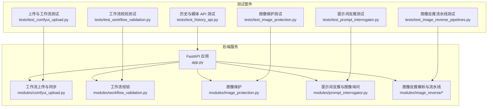
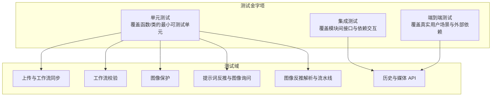
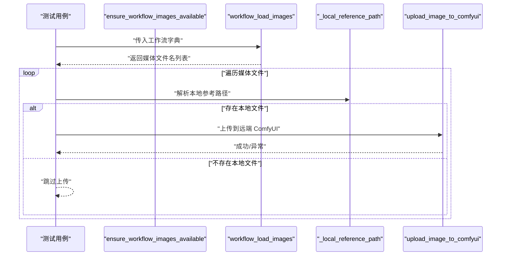
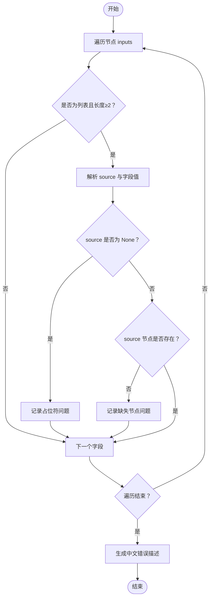
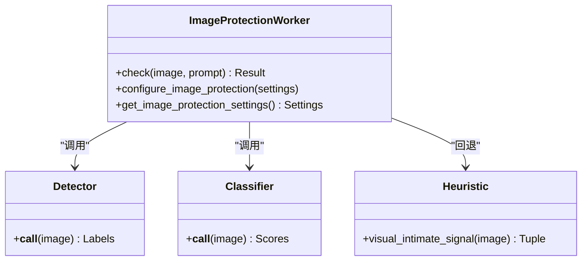
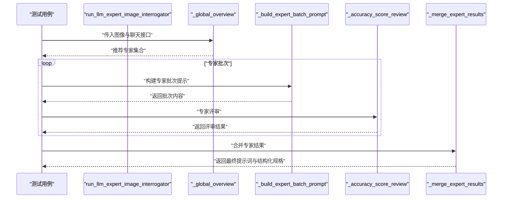
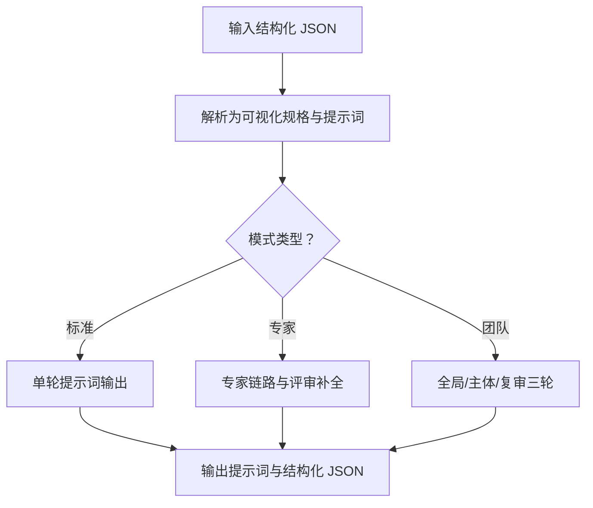
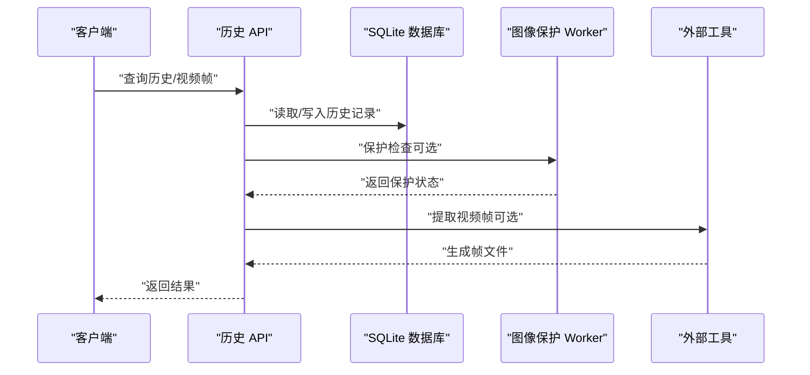
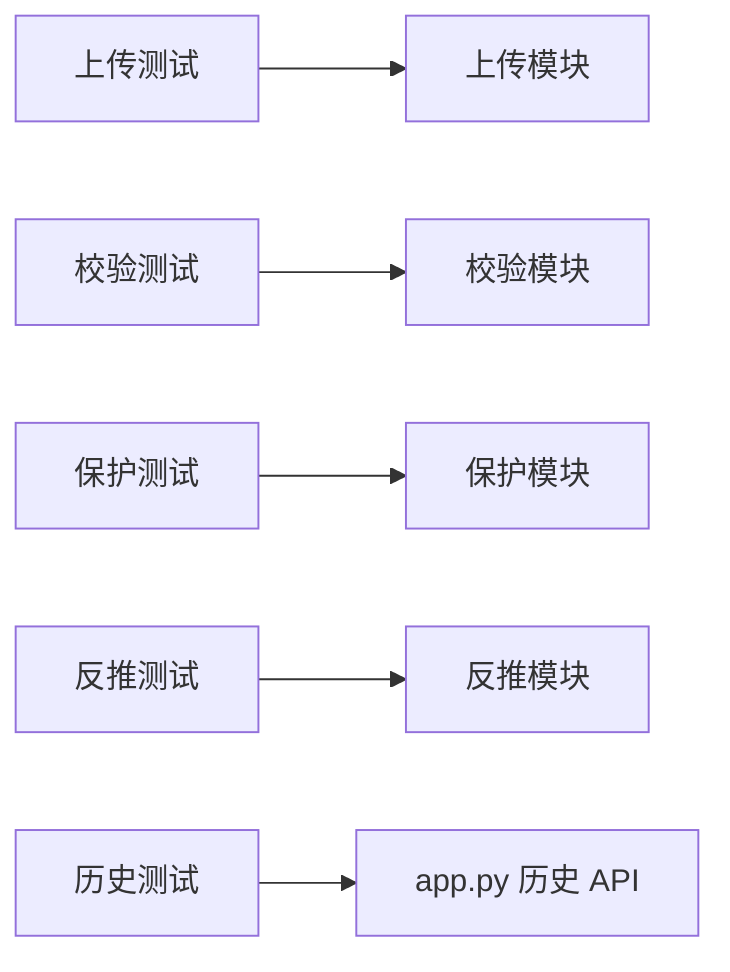

# 测试策略与方法论

<cite>
**本文引用的文件**
- [app.py](file://app.py)
- [modules/comfyui_upload.py](file://modules/comfyui_upload.py)
- [modules/workflow_validation.py](file://modules/workflow_validation.py)
- [modules/image_protection.py](file://modules/image_protection.py)
- [modules/prompt_interrogator.py](file://modules/prompt_interrogator.py)
- [modules/image_reverse/parser.py](file://modules/image_reverse/parser.py)
- [modules/image_reverse/pipelines.py](file://modules/image_reverse/pipelines.py)
- [modules/image_reverse/schemas.py](file://modules/image_reverse/schemas.py)
- [tests/test_comfyui_upload.py](file://tests/test_comfyui_upload.py)
- [tests/test_workflow_validation.py](file://tests/test_workflow_validation.py)
- [tests/test_image_protection.py](file://tests/test_image_protection.py)
- [tests/test_prompt_interrogator.py](file://tests/test_prompt_interrogator.py)
- [tests/test_image_reverse_pipelines.py](file://tests/test_image_reverse_pipelines.py)
- [tests/test_history_api.py](file://tests/test_history_api.py)
</cite>

## 目录
1. [引言](#引言)
2. [项目结构](#项目结构)
3. [核心组件](#核心组件)
4. [架构总览](#架构总览)
5. [详细组件分析](#详细组件分析)
6. [依赖分析](#依赖分析)
7. [性能考量](#性能考量)
8. [故障排查指南](#故障排查指南)
9. [结论](#结论)
10. [附录](#附录)

## 引言
本文件面向 Ez ComfyUI Showcase 项目，系统化阐述测试策略与方法论，涵盖测试金字塔、测试层级划分（单元测试、集成测试、端到端测试）、测试优先级、测试框架与配置、测试数据管理、测试环境配置、测试分类与覆盖范围，以及测试编写规范与最佳实践。文档旨在帮助开发者高效构建稳定、可维护、可扩展的测试体系，确保核心业务逻辑与关键流程的可靠性。

## 项目结构
项目采用模块化设计，前端静态资源与后端 API 通过 FastAPI 提供服务；测试集中在 tests 目录，围绕核心模块（上传与工作流、历史与媒体、图像保护、提示词反推与图像询问、工作流校验等）进行覆盖。

图表来源
- [app.py:1-200](file://app.py#L1-L200)
- [modules/comfyui_upload.py:1-358](file://modules/comfyui_upload.py#L1-L358)
- [modules/workflow_validation.py:1-60](file://modules/workflow_validation.py#L1-L60)
- [modules/image_protection.py](file://modules/image_protection.py)
- [modules/prompt_interrogator.py](file://modules/prompt_interrogator.py)
- [modules/image_reverse/parser.py](file://modules/image_reverse/parser.py)
- [modules/image_reverse/pipelines.py](file://modules/image_reverse/pipelines.py)
- [modules/image_reverse/schemas.py](file://modules/image_reverse/schemas.py)
- [tests/test_comfyui_upload.py:1-151](file://tests/test_comfyui_upload.py#L1-L151)
- [tests/test_workflow_validation.py:1-42](file://tests/test_workflow_validation.py#L1-L42)
- [tests/test_image_protection.py:1-606](file://tests/test_image_protection.py#L1-L606)
- [tests/test_prompt_interrogator.py:1-800](file://tests/test_prompt_interrogator.py#L1-L800)
- [tests/test_image_reverse_pipelines.py:1-403](file://tests/test_image_reverse_pipelines.py#L1-L403)
- [tests/test_history_api.py:1-1027](file://tests/test_history_api.py#L1-L1027)

章节来源
- [app.py:1-200](file://app.py#L1-L200)

## 核心组件
- 工作流上传与同步：负责收集工作流中的媒体引用、解析与本地路径映射、必要时生成派生图像、并上传至远端 ComfyUI 输入目录。
- 工作流校验：对 API Prompt 的连接完整性与占位符进行校验，输出结构化问题描述。
- 图像保护：基于检测器、启发式与提示词信号的多通道保护决策，支持可视化回退与提示词风险评估。
- 提示词反推与图像询问：提供图像理解、专家级拆解、评审与合并的流水线，支持多轮评审与质量评分。
- 图像反推解析与流水线：将结构化 JSON 解析为可生成的提示词与结构化规格，并支持专家模式与团队模式。
- 历史与媒体 API：提供历史记录查询、视频帧提取、缩略图生成、保护状态更新等能力。

章节来源
- [modules/comfyui_upload.py:1-358](file://modules/comfyui_upload.py#L1-L358)
- [modules/workflow_validation.py:1-60](file://modules/workflow_validation.py#L1-L60)
- [modules/image_protection.py](file://modules/image_protection.py)
- [modules/prompt_interrogator.py](file://modules/prompt_interrogator.py)
- [modules/image_reverse/parser.py](file://modules/image_reverse/parser.py)
- [modules/image_reverse/pipelines.py](file://modules/image_reverse/pipelines.py)
- [modules/image_reverse/schemas.py](file://modules/image_reverse/schemas.py)

## 架构总览
测试架构遵循测试金字塔，以单元测试为基础，集成测试覆盖模块交互，端到端测试覆盖真实用户场景与外部依赖。

[此图为概念性架构示意，无需图表来源标注]

## 详细组件分析

### 组件一：工作流上传与同步（上传、路径解析、派生图像、上传远端）
- 测试重点
  - 收集工作流中的 LoadImage/LoadVideo 文件列表，含 LTXDirector 时间轴媒体。
  - 本地路径规范化与安全校验，防止越界访问。
  - 历史输出作为参考时的复用逻辑。
  - Qwen 多角度构图的“仅提示词保留”策略与派生图像生成。
  - 远端上传失败的错误传播与异常处理。
- 关键测试用例
  - 收集嵌套 LoadImage/LoadVideo 路径与 LTXDirector 时间轴媒体。
  - 本地路径解析与越权路径保护。
  - 历史输出复用为上传参考。
  - Qwen 多角度构图仅提示词保留，不实际旋转/扩图。
  - 非 Qwen 工作流忽略处理。
- 测试方法
  - 使用临时目录隔离输入/输出，构造不同场景的 JSON 工作流。
  - 通过桩函数替换远端上传实现，断言上传调用与参数。
  - 断言返回值与副作用（文件生成、上传调用次数等）。

图表来源
- [modules/comfyui_upload.py:15-54](file://modules/comfyui_upload.py#L15-L54)
- [modules/comfyui_upload.py:66-77](file://modules/comfyui_upload.py#L66-L77)
- [modules/comfyui_upload.py:348-358](file://modules/comfyui_upload.py#L348-L358)

章节来源
- [tests/test_comfyui_upload.py:1-151](file://tests/test_comfyui_upload.py#L1-L151)
- [modules/comfyui_upload.py:1-358](file://modules/comfyui_upload.py#L1-L358)

### 组件二：工作流校验（API Prompt 连接完整性与占位符）
- 测试重点
  - 对每个节点的 inputs 进行遍历，识别缺失节点与占位符。
  - 将问题汇总为结构化对象，生成中文错误描述。
- 关键测试用例
  - UI 导出链接与占位符导致的“缺失节点/占位符”问题。
  - 合法 API Prompt 无问题。
- 测试方法
  - 构造包含占位符与缺失连接的工作流字典。
  - 断言问题数量、种类与描述文本。

图表来源
- [modules/workflow_validation.py:22-42](file://modules/workflow_validation.py#L22-L42)
- [modules/workflow_validation.py:45-60](file://modules/workflow_validation.py#L45-L60)

章节来源
- [tests/test_workflow_validation.py:1-42](file://tests/test_workflow_validation.py#L1-L42)
- [modules/workflow_validation.py:1-60](file://modules/workflow_validation.py#L1-L60)

### 组件三：图像保护（检测器、启发式、提示词信号）
- 测试重点
  - 检测器加载与调用次数控制、重复检测结果一致性。
  - 视觉回退开关与默认启用策略。
  - 不同标签置信度阈值下的保护/安全判定。
  - 提示词风险触发保护。
  - 缺失图像的错误处理。
- 关键测试用例
  - 检测器一次性加载、多次检测。
  - 配对高置信度暴露标签保护。
  - 视觉回退在检测器漏检时生效。
  - 强 Nude 提示词触发保护。
  - 缺失图像返回错误状态。
- 测试方法
  - 使用临时图像文件与桩函数模拟检测器/分类器。
  - 验证状态、来源与原因描述。
  - 开关设置变更后的行为验证。

图表来源
- [modules/image_protection.py](file://modules/image_protection.py)

章节来源
- [tests/test_image_protection.py:1-606](file://tests/test_image_protection.py#L1-L606)
- [modules/image_protection.py](file://modules/image_protection.py)

### 组件四：提示词反推与图像询问（专家级拆解、评审与合并）
- 测试重点
  - 全局概览选择专家集合，限制后续专家数量。
  - 专家批次任务与评审合并流程，支持重试与补全。
  - 工作流构建与节点连接、参数校验。
  - 运行时模板大小与字段约束。
- 关键测试用例
  - 专家选择阶梯式限制。
  - 批次任务缺失专家的重试与补全。
  - 工作流构建节点类型、输入参数与文本提示。
  - 运行时模板字段与长度约束。
- 测试方法
  - 使用桩函数模拟聊天接口，断言专家批次、评审与合并结果。
  - 断言工作流节点类型、连接与输入参数。

图表来源
- [modules/prompt_interrogator.py](file://modules/prompt_interrogator.py)
- [tests/test_prompt_interrogator.py:1-800](file://tests/test_prompt_interrogator.py#L1-L800)

章节来源
- [tests/test_prompt_interrogator.py:1-800](file://tests/test_prompt_interrogator.py#L1-L800)
- [modules/prompt_interrogator.py](file://modules/prompt_interrogator.py)

### 组件五：图像反推解析与流水线（JSON 解析、专家模式、团队模式）
- 测试重点
  - 结构化 JSON 解析为提示词与结构化规格，保留专家模式关键字段。
  - 标准/专家/团队模式的调用链与断言。
  - 专家评审补全与最终规格输出。
- 关键测试用例
  - 清晰视觉规格书解析与字段去前缀。
  - 专家模式关键细节保留与提示词拼接。
  - 团队模式全局/主体/复审三轮流程。
- 测试方法
  - 使用临时 JPEG 占位文件，断言提示词、结构化 JSON 与专家模式开关。

图表来源
- [modules/image_reverse/parser.py](file://modules/image_reverse/parser.py)
- [modules/image_reverse/pipelines.py](file://modules/image_reverse/pipelines.py)
- [modules/image_reverse/schemas.py](file://modules/image_reverse/schemas.py)
- [tests/test_image_reverse_pipelines.py:1-403](file://tests/test_image_reverse_pipelines.py#L1-L403)

章节来源
- [tests/test_image_reverse_pipelines.py:1-403](file://tests/test_image_reverse_pipelines.py#L1-L403)
- [modules/image_reverse/parser.py](file://modules/image_reverse/parser.py)
- [modules/image_reverse/pipelines.py](file://modules/image_reverse/pipelines.py)
- [modules/image_reverse/schemas.py](file://modules/image_reverse/schemas.py)

### 组件六：历史与媒体 API（历史查询、视频帧提取、缩略图、保护状态）
- 测试重点
  - 历史记录用户名丰富、紧凑模式与详情切换。
  - 视频帧提取与封面设置、输入导入、保护检查。
  - 历史计数、签名与边界时间处理。
  - 保护状态回填与重检策略。
- 关键测试用例
  - 用户计数与管理员轻量统计。
  - 视频帧提取重试与边界时间钳制。
  - 历史摘要签名与日志抑制。
  - 保护状态持久化与回填。
- 测试方法
  - 使用临时目录与 SQLite 内存库，mock 外部工具与保护检测器，断言响应与副作用。

图表来源
- [tests/test_history_api.py:1-1027](file://tests/test_history_api.py#L1-L1027)
- [app.py:1-200](file://app.py#L1-L200)

章节来源
- [tests/test_history_api.py:1-1027](file://tests/test_history_api.py#L1-L1027)
- [app.py:1-200](file://app.py#L1-L200)

## 依赖分析
- 模块内聚与耦合
  - 上传模块与工作流校验模块均依赖字典型工作流结构，耦合度低，便于单元测试。
  - 图像保护模块对外部检测器/分类器/工具存在外部依赖，需通过桩函数隔离。
  - 历史 API 测试依赖 SQLite 数据库与外部工具（FFmpeg），setUp/tearDown 中进行环境隔离。
- 直接与间接依赖
  - 历史 API 测试直接依赖 app.py 中的历史函数与保护配置。
  - 上传测试依赖上传模块内部函数，间接依赖远端上传接口。
- 循环依赖
  - 当前模块未见循环依赖迹象。
- 外部依赖与集成点
  - 远端 ComfyUI 上传接口、FFmpeg 视频处理、检测器/分类器、LLM 接口等。

图表来源
- [tests/test_comfyui_upload.py:1-151](file://tests/test_comfyui_upload.py#L1-L151)
- [tests/test_workflow_validation.py:1-42](file://tests/test_workflow_validation.py#L1-L42)
- [tests/test_image_protection.py:1-606](file://tests/test_image_protection.py#L1-L606)
- [tests/test_prompt_interrogator.py:1-800](file://tests/test_prompt_interrogator.py#L1-L800)
- [tests/test_history_api.py:1-1027](file://tests/test_history_api.py#L1-L1027)
- [app.py:1-200](file://app.py#L1-L200)

章节来源
- [tests/test_comfyui_upload.py:1-151](file://tests/test_comfyui_upload.py#L1-L151)
- [tests/test_workflow_validation.py:1-42](file://tests/test_workflow_validation.py#L1-L42)
- [tests/test_image_protection.py:1-606](file://tests/test_image_protection.py#L1-L606)
- [tests/test_prompt_interrogator.py:1-800](file://tests/test_prompt_interrogator.py#L1-L800)
- [tests/test_history_api.py:1-1027](file://tests/test_history_api.py#L1-L1027)
- [app.py:1-200](file://app.py#L1-L200)

## 性能考量
- 测试执行效率
  - 优先使用内存数据库与临时文件，避免磁盘 IO。
  - 对外部工具（如 FFmpeg）使用桩函数或最小化调用次数。
- 测试覆盖率与回归成本
  - 通过单元测试覆盖热点路径，减少集成测试与端到端测试的执行频率。
  - 对上传与保护等耗时操作，采用桩函数与断言调用次数。
- 资源隔离
  - 使用 setUp/tearDown 或临时目录确保并发测试互不干扰。

[本节为通用指导，无需章节来源]

## 故障排查指南
- 上传失败
  - 检查本地路径解析与越界保护逻辑，确认输入/输出目录权限。
  - 断言远端上传请求参数与边界标识。
- 工作流校验失败
  - 核对连接 source 是否为 None 或指向不存在节点。
  - 使用 describe_api_prompt_issues 获取详细错误信息。
- 图像保护误判
  - 检查检测器/分类器/提示词信号开关，验证阈值与回退策略。
  - 对缺失图像返回错误状态，避免空指针。
- 历史 API 异常
  - 核对 SQLite 初始化、日志缓冲与外部工具可用性。
  - 对视频帧提取失败进行重试与边界时间钳制。

章节来源
- [modules/comfyui_upload.py:348-358](file://modules/comfyui_upload.py#L348-L358)
- [modules/workflow_validation.py:45-60](file://modules/workflow_validation.py#L45-L60)
- [tests/test_image_protection.py:252-260](file://tests/test_image_protection.py#L252-L260)
- [tests/test_history_api.py:17-47](file://tests/test_history_api.py#L17-L47)

## 结论
本测试策略以测试金字塔为核心，结合单元测试、集成测试与端到端测试，覆盖上传同步、工作流校验、图像保护、提示词反推、图像反推与历史 API 等关键领域。通过临时目录与桩函数隔离外部依赖，确保测试稳定性与可重复性；通过结构化断言与错误描述，提升问题定位效率。建议持续完善测试覆盖率，强化边界条件与异常处理测试，保障系统在复杂场景下的可靠性。

[本节为总结性内容，无需章节来源]

## 附录

### 测试框架与配置
- 测试框架
  - 使用 Python unittest，测试文件以 test_* 命名，便于自动发现。
- 测试发现机制
  - 通过命令行运行 tests 目录下的测试文件，或使用测试运行器统一执行。
- 测试夹具（fixtures）
  - 历史 API 测试通过 setUp/tearDown 设置临时目录与数据库，恢复全局状态。
  - 上传与反推测试通过临时目录与桩函数替换外部依赖。

章节来源
- [tests/test_history_api.py:17-47](file://tests/test_history_api.py#L17-L47)
- [tests/test_comfyui_upload.py:1-151](file://tests/test_comfyui_upload.py#L1-L151)
- [tests/test_image_reverse_pipelines.py:1-403](file://tests/test_image_reverse_pipelines.py#L1-L403)

### 测试数据管理
- 准备
  - 使用临时目录存放输入/输出与数据库文件，避免污染开发环境。
  - 对图像保护与提示词反推测试，使用小尺寸占位图像文件。
- 清理
  - 测试结束后清理临时目录与数据库文件。
- 隔离
  - 通过环境变量与全局状态替换，确保测试间互不影响。
- 模拟
  - 使用桩函数模拟远端上传、检测器/分类器、外部工具调用。

章节来源
- [tests/test_history_api.py:17-47](file://tests/test_history_api.py#L17-L47)
- [tests/test_image_protection.py:1-606](file://tests/test_image_protection.py#L1-L606)
- [tests/test_prompt_interrogator.py:1-800](file://tests/test_prompt_interrogator.py#L1-L800)

### 测试环境配置
- 测试数据库
  - 历史 API 测试使用临时 SQLite 数据库，初始化生成表结构。
- 模拟服务
  - 上传测试模拟远端上传接口；图像保护测试模拟检测器/分类器；提示词反推测试模拟 LLM 接口。
- 测试专用配置
  - 通过环境变量与全局状态替换，确保测试可配置性与可重复性。

章节来源
- [tests/test_history_api.py:17-47](file://tests/test_history_api.py#L17-L47)
- [tests/test_comfyui_upload.py:77-82](file://tests/test_comfyui_upload.py#L77-L82)
- [tests/test_image_protection.py:291-308](file://tests/test_image_protection.py#L291-L308)

### 测试分类与覆盖范围
- 核心功能测试
  - 上传与同步、工作流校验、图像保护、提示词反推、图像反推、历史 API。
- 边界条件测试
  - 越界路径保护、占位符与缺失节点、弱置信度标签、缺失图像、边界时间处理。
- 异常处理测试
  - 远端上传异常、外部工具不可用、日志噪声过滤、保护状态持久化失败。

章节来源
- [tests/test_comfyui_upload.py:50-84](file://tests/test_comfyui_upload.py#L50-L84)
- [tests/test_workflow_validation.py:16-37](file://tests/test_workflow_validation.py#L16-L37)
- [tests/test_image_protection.py:252-260](file://tests/test_image_protection.py#L252-L260)
- [tests/test_history_api.py:232-236](file://tests/test_history_api.py#L232-L236)

### 测试编写规范与最佳实践
- 命名约定
  - 测试类以模块名+Test 命名，测试方法以 test_* 开头。
- 断言策略
  - 使用 assertEqual/assertTrue/assertIn 等明确断言结果与副作用。
  - 对错误信息与结构化对象进行断言，避免模糊匹配。
- 测试组织结构
  - 将相似功能的测试归类在同一文件，便于维护与查找。
  - 使用 setUp/tearDown 统一资源准备与清理。

章节来源
- [tests/test_comfyui_upload.py:15-151](file://tests/test_comfyui_upload.py#L15-L151)
- [tests/test_workflow_validation.py:11-42](file://tests/test_workflow_validation.py#L11-L42)
- [tests/test_image_protection.py:9-606](file://tests/test_image_protection.py#L9-L606)
- [tests/test_prompt_interrogator.py:86-800](file://tests/test_prompt_interrogator.py#L86-L800)
- [tests/test_image_reverse_pipelines.py:15-403](file://tests/test_image_reverse_pipelines.py#L15-L403)
- [tests/test_history_api.py:16-1027](file://tests/test_history_api.py#L16-L1027)