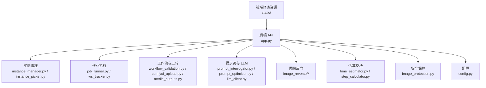
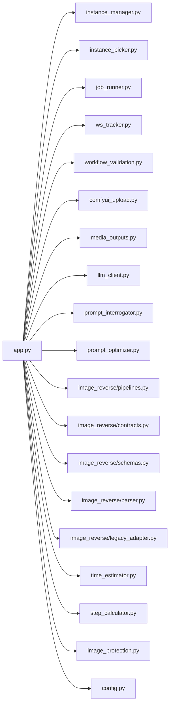

# 集成与性能测试

<cite>
**本文引用的文件**
- [app.py](file://app.py)
- [modules/config.py](file://modules/config.py)
- [modules/instance_manager.py](file://modules/instance_manager.py)
- [modules/instance_picker.py](file://modules/instance_picker.py)
- [modules/job_runner.py](file://modules/job_runner.py)
- [modules/comfyui_upload.py](file://modules/comfyui_upload.py)
- [modules/media_outputs.py](file://modules/media_outputs.py)
- [modules/ws_tracker.py](file://modules/ws_tracker.py)
- [modules/llm_client.py](file://modules/llm_client.py)
- [modules/prompt_interrogator.py](file://modules/prompt_interrogator.py)
- [modules/prompt_optimizer.py](file://modules/prompt_optimizer.py)
- [modules/workflow_validation.py](file://modules/workflow_validation.py)
- [modules/image_reverse/pipelines.py](file://modules/image_reverse/pipelines.py)
- [modules/image_reverse/contracts.py](file://modules/image_reverse/contracts.py)
- [modules/image_reverse/schemas.py](file://modules/image_reverse/schemas.py)
- [modules/image_reverse/parser.py](file://modules/image_reverse/parser.py)
- [modules/image_reverse/legacy_adapter.py](file://modules/image_reverse/legacy_adapter.py)
- [modules/time_estimator.py](file://modules/time_estimator.py)
- [modules/step_calculator.py](file://modules/step_calculator.py)
- [modules/image_protection.py](file://modules/image_protection.py)
- [tests/test_jobs_api.py](file://tests/test_jobs_api.py)
- [tests/test_history_api.py](file://tests/test_history_api.py)
- [tests/test_logs_api.py](file://tests/test_logs_api.py)
- [tests/test_workflow_validation.py](file://tests/test_workflow_validation.py)
- [tests/test_comfyui_upload.py](file://tests/test_comfyui_upload.py)
- [tests/test_media_outputs.py](file://tests/test_media_outputs.py)
- [tests/test_prompt_interrogator.py](file://tests/test_prompt_interrogator.py)
- [tests/test_prompt_optimizer.py](file://tests/test_prompt_optimizer.py)
- [tests/test_image_reverse_pipelines.py](file://tests/test_image_reverse_pipelines.py)
- [tests/test_image_reverse_contracts.py](file://tests/test_image_reverse_contracts.py)
- [tests/test_instance_picker.py](file://tests/test_instance_picker.py)
- [tests/test_instance_idle_guard.py](file://tests/test_instance_idle_guard.py)
- [tests/test_global_generation_queue.py](file://tests/test_global_generation_queue.py)
- [tests/test_job_runner_queue.py](file://tests/test_job_runner_queue.py)
- [tests/test_job_time_estimates.py](file://tests/test_job_time_estimates.py)
- [tests/test_status_ui.py](file://tests/test_status_ui.py)
- [tests/test_status_gpu_message.py](file://tests/test_status_gpu_message.py)
- [tests/test_system_settings_api.py](file://tests/test_system_settings_api.py)
- [tests/test_system_settings_ui.py](file://tests/test_system_settings_ui.py)
- [tests/test_llm_client.py](file://tests/test_llm_client.py)
- [tests/test_image_protection.py](file://tests/test_image_protection.py)
- [tests/test_flux2_dev_i2i_workflow.py](file://tests/test_flux2_dev_i2i_workflow.py)
- [tests/test_flux2_klein_workflows.py](file://tests/test_flux2_klein_workflows.py)
- [tests/test_seedvr2_video_upscale_workflows.py](file://tests/test_seedvr2_video_upscale_workflows.py)
- [tests/test_ltx_10eros_workflow.py](file://tests/test_ltx_10eros_workflow.py)
- [tests/test_ltx_sulphur_i2v_workflow.py](file://tests/test_ltx_sulphur_i2v_workflow.py)
- [tests/test_ltx_tattoo_video_workflow.py](file://tests/test_ltx_tattoo_video_workflow.py)
- [tests/test_qwen_multiangle.py](file://tests/test_qwen_multiangle.py)
- [tests/test_flux2_dev_unsloth_workflows.py](file://tests/test_flux2_dev_unsloth_workflows.py)
- [README.md](file://README.md)
</cite>

## 目录
1. [引言](#引言)
2. [项目结构](#项目结构)
3. [核心组件](#核心组件)
4. [架构总览](#架构总览)
5. [详细组件分析](#详细组件分析)
6. [依赖关系分析](#依赖关系分析)
7. [性能考虑](#性能考虑)
8. [故障排查指南](#故障排查指南)
9. [结论](#结论)
10. [附录](#附录)

## 引言
本文件面向 Ez ComfyUI Showcase 的集成与性能测试，目标是提供系统化的测试策略与实施方案，覆盖模块间接口测试、数据流测试、服务集成测试；并发用户、吞吐量、延迟与资源使用率等性能测试；性能基准测试的建立与维护（基准线设定、指标监控、回归检测）；以及负载与压力测试（渐进式、峰值、稳定性）。同时给出性能瓶颈分析与优化建议，并说明监控与告警在测试中的应用。

## 项目结构
Ez ComfyUI Showcase 采用模块化设计，前端静态资源位于 static/，后端应用入口为 app.py，核心业务逻辑分布在 modules/ 下的多个子模块中，测试用例集中在 tests/ 目录。工作流配置与元数据位于 data/ 目录，文档与规范位于 docs/。

```mermaid
graph TB
subgraph "应用层"
APP["app.py"]
end
subgraph "业务模块"
CFG["modules/config.py"]
IM["modules/instance_manager.py"]
IP["modules/instance_picker.py"]
JR["modules/job_runner.py"]
WS["modules/ws_tracker.py"]
LLM["modules/llm_client.py"]
PI["modules/prompt_interrogator.py"]
PO["modules/prompt_optimizer.py"]
WFV["modules/workflow_validation.py"]
CO["modules/comfyui_upload.py"]
MO["modules/media_outputs.py"]
IR["modules/image_reverse/pipelines.py"]
IC["modules/image_reverse/contracts.py"]
IS["modules/image_reverse/schemas.py"]
PR["modules/image_reverse/parser.py"]
LA["modules/image_reverse/legacy_adapter.py"]
TE["modules/time_estimator.py"]
SC["modules/step_calculator.py"]
IPD["modules/image_protection.py"]
end
subgraph "测试层"
TJOBS["tests/test_jobs_api.py"]
THIS["tests/test_history_api.py"]
TLOGS["tests/test_logs_api.py"]
TWFV["tests/test_workflow_validation.py"]
TUP["tests/test_comfyui_upload.py"]
TMO["tests/test_media_outputs.py"]
TPI["tests/test_prompt_interrogator.py"]
TPO["tests/test_prompt_optimizer.py"]
TIR["tests/test_image_reverse_pipelines.py"]
TIC["tests/test_image_reverse_contracts.py"]
TIP["tests/test_instance_picker.py"]
TIDLE["tests/test_instance_idle_guard.py"]
TGQ["tests/test_global_generation_queue.py"]
TJR["tests/test_job_runner_queue.py"]
TTE["tests/test_job_time_estimates.py"]
TSU["tests/test_status_ui.py"]
TGPU["tests/test_status_gpu_message.py"]
TSSA["tests/test_system_settings_api.py"]
TSSUI["tests/test_system_settings_ui.py"]
TLLM["tests/test_llm_client.py"]
TIPD["tests/test_image_protection.py"]
TFLUX["tests/test_flux2_dev_i2i_workflow.py"]
TKLEIN["tests/test_flux2_klein_workflows.py"]
TSEED["tests/test_seedvr2_video_upscale_workflows.py"]
TLTX10["tests/test_ltx_10eros_workflow.py"]
TLSUL["tests/test_ltx_sulphur_i2v_workflow.py"]
TLTTAT["tests/test_ltx_tattoo_video_workflow.py"]
TQWEN["tests/test_qwen_multiangle.py"]
TUNSL["tests/test_flux2_dev_unsloth_workflows.py"]
end
APP --> IM
APP --> IP
APP --> JR
APP --> WS
APP --> LLM
APP --> PI
APP --> PO
APP --> WFV
APP --> CO
APP --> MO
APP --> IR
APP --> IC
APP --> IS
APP --> PR
APP --> LA
APP --> TE
APP --> SC
APP --> IPD
TJOBS --> APP
THIS --> APP
TLOGS --> APP
TWFV --> WFV
TUP --> CO
TMO --> MO
TPI --> PI
TPO --> PO
TIR --> IR
TIC --> IC
TIP --> IP
TIDLE --> IM
TGQ --> JR
TJR --> JR
TTE --> TE
TSU --> APP
TGPU --> APP
TSSA --> APP
TSSUI --> APP
TLLM --> LLM
TIPD --> IPD
TFLUX --> APP
TKLEIN --> APP
TSEED --> APP
TLTX10 --> APP
TLSUL --> APP
TLTTAT --> APP
TQWEN --> APP
TUNSL --> APP
```

图表来源
- [app.py](file://app.py)
- [modules/config.py](file://modules/config.py)
- [modules/instance_manager.py](file://modules/instance_manager.py)
- [modules/instance_picker.py](file://modules/instance_picker.py)
- [modules/job_runner.py](file://modules/job_runner.py)
- [modules/ws_tracker.py](file://modules/ws_tracker.py)
- [modules/llm_client.py](file://modules/llm_client.py)
- [modules/prompt_interrogator.py](file://modules/prompt_interrogator.py)
- [modules/prompt_optimizer.py](file://modules/prompt_optimizer.py)
- [modules/workflow_validation.py](file://modules/workflow_validation.py)
- [modules/comfyui_upload.py](file://modules/comfyui_upload.py)
- [modules/media_outputs.py](file://modules/media_outputs.py)
- [modules/image_reverse/pipelines.py](file://modules/image_reverse/pipelines.py)
- [modules/image_reverse/contracts.py](file://modules/image_reverse/contracts.py)
- [modules/image_reverse/schemas.py](file://modules/image_reverse/schemas.py)
- [modules/image_reverse/parser.py](file://modules/image_reverse/parser.py)
- [modules/image_reverse/legacy_adapter.py](file://modules/image_reverse/legacy_adapter.py)
- [modules/time_estimator.py](file://modules/time_estimator.py)
- [modules/step_calculator.py](file://modules/step_calculator.py)
- [modules/image_protection.py](file://modules/image_protection.py)
- [tests/test_jobs_api.py](file://tests/test_jobs_api.py)
- [tests/test_history_api.py](file://tests/test_history_api.py)
- [tests/test_logs_api.py](file://tests/test_logs_api.py)
- [tests/test_workflow_validation.py](file://tests/test_workflow_validation.py)
- [tests/test_comfyui_upload.py](file://tests/test_comfyui_upload.py)
- [tests/test_media_outputs.py](file://tests/test_media_outputs.py)
- [tests/test_prompt_interrogator.py](file://tests/test_prompt_interrogator.py)
- [tests/test_prompt_optimizer.py](file://tests/test_prompt_optimizer.py)
- [tests/test_image_reverse_pipelines.py](file://tests/test_image_reverse_pipelines.py)
- [tests/test_image_reverse_contracts.py](file://tests/test_image_reverse_contracts.py)
- [tests/test_instance_picker.py](file://tests/test_instance_picker.py)
- [tests/test_instance_idle_guard.py](file://tests/test_instance_idle_guard.py)
- [tests/test_global_generation_queue.py](file://tests/test_global_generation_queue.py)
- [tests/test_job_runner_queue.py](file://tests/test_job_runner_queue.py)
- [tests/test_job_time_estimates.py](file://tests/test_job_time_estimates.py)
- [tests/test_status_ui.py](file://tests/test_status_ui.py)
- [tests/test_status_gpu_message.py](file://tests/test_status_gpu_message.py)
- [tests/test_system_settings_api.py](file://tests/test_system_settings_api.py)
- [tests/test_system_settings_ui.py](file://tests/test_system_settings_ui.py)
- [tests/test_llm_client.py](file://tests/test_llm_client.py)
- [tests/test_image_protection.py](file://tests/test_image_protection.py)
- [tests/test_flux2_dev_i2i_workflow.py](file://tests/test_flux2_dev_i2i_workflow.py)
- [tests/test_flux2_klein_workflows.py](file://tests/test_flux2_klein_workflows.py)
- [tests/test_seedvr2_video_upscale_workflows.py](file://tests/test_seedvr2_video_upscale_workflows.py)
- [tests/test_ltx_10eros_workflow.py](file://tests/test_ltx_10eros_workflow.py)
- [tests/test_ltx_sulphur_i2v_workflow.py](file://tests/test_ltx_sulphur_i2v_workflow.py)
- [tests/test_ltx_tattoo_video_workflow.py](file://tests/test_ltx_tattoo_video_workflow.py)
- [tests/test_qwen_multiangle.py](file://tests/test_qwen_multiangle.py)
- [tests/test_flux2_dev_unsloth_workflows.py](file://tests/test_flux2_dev_unsloth_workflows.py)

章节来源
- [README.md](file://README.md)
- [app.py](file://app.py)

## 核心组件
- 应用入口与路由：app.py 提供 Web 服务与 API 路由，承载前端交互与后端处理的统一入口。
- 实例管理：instance_manager.py 管理 ComfyUI 实例生命周期与资源分配；instance_picker.py 负责实例选择策略。
- 作业执行：job_runner.py 负责生成任务的调度、执行与状态跟踪；ws_tracker.py 提供 WebSocket 状态追踪。
- 工作流与上传：workflow_validation.py 校验工作流配置；comfyui_upload.py 处理上传与预处理；media_outputs.py 管理媒体输出。
- LLM 与提示词：llm_client.py 提供 LLM 接口；prompt_interrogator.py 与 prompt_optimizer.py 负责提示词解析与优化。
- 图像反向：image_reverse/pipelines.py、contracts.py、schemas.py、parser.py、legacy_adapter.py 组成图像反向处理链路。
- 时间估算与步数计算：time_estimator.py 与 step_calculator.py 提供生成时间与步数估算能力。
- 安全保护：image_protection.py 提供敏感内容保护策略。
- 配置：config.py 提供全局配置项，影响各模块行为。

章节来源
- [app.py](file://app.py)
- [modules/instance_manager.py](file://modules/instance_manager.py)
- [modules/instance_picker.py](file://modules/instance_picker.py)
- [modules/job_runner.py](file://modules/job_runner.py)
- [modules/ws_tracker.py](file://modules/ws_tracker.py)
- [modules/comfyui_upload.py](file://modules/comfyui_upload.py)
- [modules/media_outputs.py](file://modules/media_outputs.py)
- [modules/llm_client.py](file://modules/llm_client.py)
- [modules/prompt_interrogator.py](file://modules/prompt_interrogator.py)
- [modules/prompt_optimizer.py](file://modules/prompt_optimizer.py)
- [modules/workflow_validation.py](file://modules/workflow_validation.py)
- [modules/image_reverse/pipelines.py](file://modules/image_reverse/pipelines.py)
- [modules/image_reverse/contracts.py](file://modules/image_reverse/contracts.py)
- [modules/image_reverse/schemas.py](file://modules/image_reverse/schemas.py)
- [modules/image_reverse/parser.py](file://modules/image_reverse/parser.py)
- [modules/image_reverse/legacy_adapter.py](file://modules/image_reverse/legacy_adapter.py)
- [modules/time_estimator.py](file://modules/time_estimator.py)
- [modules/step_calculator.py](file://modules/step_calculator.py)
- [modules/image_protection.py](file://modules/image_protection.py)
- [modules/config.py](file://modules/config.py)

## 架构总览
系统采用“前端静态 + 后端服务”的分层架构。前端通过静态资源提供界面，后端通过 app.py 暴露 REST API 与 WebSocket 接口，业务模块按职责拆分，形成高内聚低耦合的服务集合。测试层通过直接调用 API 或模块方法进行集成与性能验证。

图表来源
- [app.py](file://app.py)
- [modules/instance_manager.py](file://modules/instance_manager.py)
- [modules/instance_picker.py](file://modules/instance_picker.py)
- [modules/job_runner.py](file://modules/job_runner.py)
- [modules/ws_tracker.py](file://modules/ws_tracker.py)
- [modules/workflow_validation.py](file://modules/workflow_validation.py)
- [modules/comfyui_upload.py](file://modules/comfyui_upload.py)
- [modules/media_outputs.py](file://modules/media_outputs.py)
- [modules/prompt_interrogator.py](file://modules/prompt_interrogator.py)
- [modules/prompt_optimizer.py](file://modules/prompt_optimizer.py)
- [modules/llm_client.py](file://modules/llm_client.py)
- [modules/image_reverse/pipelines.py](file://modules/image_reverse/pipelines.py)
- [modules/time_estimator.py](file://modules/time_estimator.py)
- [modules/step_calculator.py](file://modules/step_calculator.py)
- [modules/image_protection.py](file://modules/image_protection.py)
- [modules/config.py](file://modules/config.py)

## 详细组件分析

### 1) 集成测试策略
- 模块间接口测试
  - 以模块为单位，验证输入输出契约与异常路径。例如：
    - 工作流校验：使用 workflow_validation.py 的校验逻辑，结合 tests/test_workflow_validation.py 进行断言。
    - 上传与媒体输出：使用 comfyui_upload.py 与 media_outputs.py，结合 tests/test_comfyui_upload.py 与 tests/test_media_outputs.py。
    - 图像反向：使用 image_reverse/* 模块，结合 tests/test_image_reverse_pipelines.py 与 tests/test_image_reverse_contracts.py。
  - 关键点：确保模块间依赖关系稳定，错误传播与回退策略可预期。
- 数据流测试
  - 从上传到生成再到输出的完整链路验证，覆盖正常路径与异常路径（如无效工作流、上传失败、实例不可用）。
  - 可参考 jobs API 测试与历史/日志 API 测试，确保数据在各阶段正确传递与持久化。
- 服务集成测试
  - 通过 app.py 聚合的 API，对端到端流程进行集成验证，包括鉴权、参数校验、状态流转与响应格式一致性。

章节来源
- [modules/workflow_validation.py](file://modules/workflow_validation.py)
- [modules/comfyui_upload.py](file://modules/comfyui_upload.py)
- [modules/media_outputs.py](file://modules/media_outputs.py)
- [modules/image_reverse/pipelines.py](file://modules/image_reverse/pipelines.py)
- [modules/image_reverse/contracts.py](file://modules/image_reverse/contracts.py)
- [tests/test_workflow_validation.py](file://tests/test_workflow_validation.py)
- [tests/test_comfyui_upload.py](file://tests/test_comfyui_upload.py)
- [tests/test_media_outputs.py](file://tests/test_media_outputs.py)
- [tests/test_image_reverse_pipelines.py](file://tests/test_image_reverse_pipelines.py)
- [tests/test_image_reverse_contracts.py](file://tests/test_image_reverse_contracts.py)
- [tests/test_jobs_api.py](file://tests/test_jobs_api.py)
- [tests/test_history_api.py](file://tests/test_history_api.py)
- [tests/test_logs_api.py](file://tests/test_logs_api.py)

### 2) 性能测试实施方案
- 并发用户测试
  - 使用多线程/多进程模拟并发请求，覆盖 jobs API、历史查询、日志查询等高频接口，统计吞吐量与错误率。
  - 参考：jobs API 与历史/日志 API 的测试文件，作为并发场景的接口基线。
- 吞吐量测试
  - 在固定时间内尽可能多地提交生成任务，观察队列积压、实例利用率与响应时间变化。
  - 参考：全局生成队列与作业执行器的测试，评估系统最大承载能力。
- 延迟测试
  - 测量端到端时延（请求到达至结果可用），区分 P50/P95/P99 分位与时延分布。
  - 参考：状态 UI 与 GPU 状态相关测试，关注渲染与状态更新延迟。
- 资源使用率测试
  - 监控 CPU、内存、显存、磁盘 I/O、网络 I/O，结合系统设置 API 与 UI 的测试，定位资源瓶颈。
  - 参考：系统设置 API/UI 测试与状态相关测试。

章节来源
- [tests/test_jobs_api.py](file://tests/test_jobs_api.py)
- [tests/test_history_api.py](file://tests/test_history_api.py)
- [tests/test_logs_api.py](file://tests/test_logs_api.py)
- [tests/test_global_generation_queue.py](file://tests/test_global_generation_queue.py)
- [tests/test_job_runner_queue.py](file://tests/test_job_runner_queue.py)
- [tests/test_status_ui.py](file://tests/test_status_ui.py)
- [tests/test_status_gpu_message.py](file://tests/test_status_gpu_message.py)
- [tests/test_system_settings_api.py](file://tests/test_system_settings_api.py)
- [tests/test_system_settings_ui.py](file://tests/test_system_settings_ui.py)

### 3) 性能基准测试
- 基准线设定
  - 以典型工作流（如 Flux2、SeedVR2、LTX 系列）为基准集，定义吞吐量、P95 延迟、资源占用阈值。
  - 参考：Flux2、SeedVR2、LTX 系列相关工作流测试，确定标准配置下的基线指标。
- 指标监控
  - 结合系统设置 API/UI 与状态测试，持续采集 CPU/内存/GPU/网络/磁盘指标，形成性能画像。
- 回归检测
  - 将每次变更后的指标与基线对比，触发回归告警；对异常波动进行根因分析。

章节来源
- [tests/test_flux2_dev_i2i_workflow.py](file://tests/test_flux2_dev_i2i_workflow.py)
- [tests/test_flux2_klein_workflows.py](file://tests/test_flux2_klein_workflows.py)
- [tests/test_seedvr2_video_upscale_workflows.py](file://tests/test_seedvr2_video_upscale_workflows.py)
- [tests/test_ltx_10eros_workflow.py](file://tests/test_ltx_10eros_workflow.py)
- [tests/test_ltx_sulphur_i2v_workflow.py](file://tests/test_ltx_sulphur_i2v_workflow.py)
- [tests/test_ltx_tattoo_video_workflow.py](file://tests/test_ltx_tattoo_video_workflow.py)
- [tests/test_system_settings_api.py](file://tests/test_system_settings_api.py)
- [tests/test_system_settings_ui.py](file://tests/test_system_settings_ui.py)
- [tests/test_status_ui.py](file://tests/test_status_ui.py)
- [tests/test_status_gpu_message.py](file://tests/test_status_gpu_message.py)

### 4) 负载与压力测试
- 渐进式负载测试
  - 逐步提升并发与任务速率，观察系统拐点（队列积压、错误率上升、时延突增）。
- 峰值负载测试
  - 在短时内达到峰值并发，验证系统的抗冲击能力与恢复速度。
- 稳定性测试
  - 长时间维持高负载，检查内存泄漏、连接泄漏与状态不一致问题。
- 参考测试
  - 全局生成队列、作业执行器、实例选择与空闲守卫等测试，用于评估稳定性与弹性。

章节来源
- [tests/test_global_generation_queue.py](file://tests/test_global_generation_queue.py)
- [tests/test_job_runner_queue.py](file://tests/test_job_runner_queue.py)
- [tests/test_instance_picker.py](file://tests/test_instance_picker.py)
- [tests/test_instance_idle_guard.py](file://tests/test_instance_idle_guard.py)

### 5) 性能瓶颈分析与优化建议
- CPU 使用率分析
  - 关注提示词解析、工作流校验、媒体输出等 CPU 密集环节，优先优化热点路径。
- 内存使用分析
  - 监控生成过程中的中间缓存与对象生命周期，避免大对象重复创建与长尾内存增长。
- 网络 I/O 分析
  - 上传/下载与外部 LLM 接口的带宽与延迟，必要时引入 CDN 与连接池复用。
- 优化建议
  - 对热点模块（如提示词优化、工作流校验、实例选择）进行缓存与批量化处理。
  - 对 I/O 密集路径（上传/下载）增加异步与限速策略。
  - 对外部依赖（LLM）增加超时与重试策略，避免阻塞主流程。

章节来源
- [modules/prompt_optimizer.py](file://modules/prompt_optimizer.py)
- [modules/workflow_validation.py](file://modules/workflow_validation.py)
- [modules/comfyui_upload.py](file://modules/comfyui_upload.py)
- [modules/media_outputs.py](file://modules/media_outputs.py)
- [modules/llm_client.py](file://modules/llm_client.py)
- [modules/instance_picker.py](file://modules/instance_picker.py)

### 6) 监控与告警机制
- 实时性能监控
  - 通过系统设置 API/UI 与状态测试，采集并展示 CPU/内存/GPU/网络/磁盘指标。
- 异常检测
  - 基于测试阈值（如 P95 延迟、错误率、资源占用）触发异常告警。
- 自动告警
  - 将测试结果与阈值联动，形成自动化回归与告警闭环。

章节来源
- [tests/test_system_settings_api.py](file://tests/test_system_settings_api.py)
- [tests/test_system_settings_ui.py](file://tests/test_system_settings_ui.py)
- [tests/test_status_ui.py](file://tests/test_status_ui.py)
- [tests/test_status_gpu_message.py](file://tests/test_status_gpu_message.py)

## 依赖关系分析
模块之间的依赖关系如下：

图表来源
- [app.py](file://app.py)
- [modules/instance_manager.py](file://modules/instance_manager.py)
- [modules/instance_picker.py](file://modules/instance_picker.py)
- [modules/job_runner.py](file://modules/job_runner.py)
- [modules/ws_tracker.py](file://modules/ws_tracker.py)
- [modules/workflow_validation.py](file://modules/workflow_validation.py)
- [modules/comfyui_upload.py](file://modules/comfyui_upload.py)
- [modules/media_outputs.py](file://modules/media_outputs.py)
- [modules/llm_client.py](file://modules/llm_client.py)
- [modules/prompt_interrogator.py](file://modules/prompt_interrogator.py)
- [modules/prompt_optimizer.py](file://modules/prompt_optimizer.py)
- [modules/image_reverse/pipelines.py](file://modules/image_reverse/pipelines.py)
- [modules/image_reverse/contracts.py](file://modules/image_reverse/contracts.py)
- [modules/image_reverse/schemas.py](file://modules/image_reverse/schemas.py)
- [modules/image_reverse/parser.py](file://modules/image_reverse/parser.py)
- [modules/image_reverse/legacy_adapter.py](file://modules/image_reverse/legacy_adapter.py)
- [modules/time_estimator.py](file://modules/time_estimator.py)
- [modules/step_calculator.py](file://modules/step_calculator.py)
- [modules/image_protection.py](file://modules/image_protection.py)
- [modules/config.py](file://modules/config.py)

章节来源
- [app.py](file://app.py)
- [modules/instance_manager.py](file://modules/instance_manager.py)
- [modules/instance_picker.py](file://modules/instance_picker.py)
- [modules/job_runner.py](file://modules/job_runner.py)
- [modules/ws_tracker.py](file://modules/ws_tracker.py)
- [modules/workflow_validation.py](file://modules/workflow_validation.py)
- [modules/comfyui_upload.py](file://modules/comfyui_upload.py)
- [modules/media_outputs.py](file://modules/media_outputs.py)
- [modules/llm_client.py](file://modules/llm_client.py)
- [modules/prompt_interrogator.py](file://modules/prompt_interrogator.py)
- [modules/prompt_optimizer.py](file://modules/prompt_optimizer.py)
- [modules/image_reverse/pipelines.py](file://modules/image_reverse/pipelines.py)
- [modules/image_reverse/contracts.py](file://modules/image_reverse/contracts.py)
- [modules/image_reverse/schemas.py](file://modules/image_reverse/schemas.py)
- [modules/image_reverse/parser.py](file://modules/image_reverse/parser.py)
- [modules/image_reverse/legacy_adapter.py](file://modules/image_reverse/legacy_adapter.py)
- [modules/time_estimator.py](file://modules/time_estimator.py)
- [modules/step_calculator.py](file://modules/step_calculator.py)
- [modules/image_protection.py](file://modules/image_protection.py)
- [modules/config.py](file://modules/config.py)

## 性能考虑
- 任务调度与队列
  - 全局生成队列与作业执行器的并发度需与实例容量匹配，避免过度调度导致抖动。
- I/O 优化
  - 上传/下载与外部 LLM 接口应具备连接池与超时控制，减少阻塞。
- 缓存与批处理
  - 对提示词优化、工作流校验等可复用逻辑进行缓存与批处理，降低重复开销。
- 资源隔离
  - 实例选择与空闲守卫策略应保证资源隔离与回收，防止资源饥饿。

章节来源
- [tests/test_global_generation_queue.py](file://tests/test_global_generation_queue.py)
- [tests/test_job_runner_queue.py](file://tests/test_job_runner_queue.py)
- [tests/test_instance_picker.py](file://tests/test_instance_picker.py)
- [tests/test_instance_idle_guard.py](file://tests/test_instance_idle_guard.py)
- [modules/llm_client.py](file://modules/llm_client.py)
- [modules/comfyui_upload.py](file://modules/comfyui_upload.py)
- [modules/media_outputs.py](file://modules/media_outputs.py)

## 故障排查指南
- API 与模块测试
  - 使用对应测试文件定位问题范围：jobs API、history API、logs API、workflow 校验、上传/输出、提示词、图像反向、实例与队列、时间估算、系统设置、LLM 客户端、安全保护等。
- 状态与资源
  - 通过状态 UI 与 GPU 状态测试，确认渲染与状态更新是否异常；结合系统设置 API/UI 检查资源占用是否异常。
- 回归与基线
  - 对照基准测试结果，识别回归点并缩小问题范围。

章节来源
- [tests/test_jobs_api.py](file://tests/test_jobs_api.py)
- [tests/test_history_api.py](file://tests/test_history_api.py)
- [tests/test_logs_api.py](file://tests/test_logs_api.py)
- [tests/test_workflow_validation.py](file://tests/test_workflow_validation.py)
- [tests/test_comfyui_upload.py](file://tests/test_comfyui_upload.py)
- [tests/test_media_outputs.py](file://tests/test_media_outputs.py)
- [tests/test_prompt_interrogator.py](file://tests/test_prompt_interrogator.py)
- [tests/test_prompt_optimizer.py](file://tests/test_prompt_optimizer.py)
- [tests/test_image_reverse_pipelines.py](file://tests/test_image_reverse_pipelines.py)
- [tests/test_image_reverse_contracts.py](file://tests/test_image_reverse_contracts.py)
- [tests/test_instance_picker.py](file://tests/test_instance_picker.py)
- [tests/test_instance_idle_guard.py](file://tests/test_instance_idle_guard.py)
- [tests/test_global_generation_queue.py](file://tests/test_global_generation_queue.py)
- [tests/test_job_runner_queue.py](file://tests/test_job_runner_queue.py)
- [tests/test_job_time_estimates.py](file://tests/test_job_time_estimates.py)
- [tests/test_status_ui.py](file://tests/test_status_ui.py)
- [tests/test_status_gpu_message.py](file://tests/test_status_gpu_message.py)
- [tests/test_system_settings_api.py](file://tests/test_system_settings_api.py)
- [tests/test_system_settings_ui.py](file://tests/test_system_settings_ui.py)
- [tests/test_llm_client.py](file://tests/test_llm_client.py)
- [tests/test_image_protection.py](file://tests/test_image_protection.py)

## 结论
通过模块化测试与端到端集成测试，结合性能基准与监控告警机制，可以系统性地保障 Ez ComfyUI Showcase 的质量与稳定性。建议在持续集成中引入性能回归检测与自动化告警，配合渐进式与峰值压力测试，持续优化系统在高负载下的表现。

## 附录
- 典型工作流测试清单
  - Flux2 系列：i2i、unsloth 等工作流测试
  - SeedVR2 视频放大
  - LTX 系列：10eros、sulphur、tattoo video
  - 多角度 Qwen 工作流
- 相关测试文件路径
  - [tests/test_flux2_dev_i2i_workflow.py](file://tests/test_flux2_dev_i2i_workflow.py)
  - [tests/test_flux2_dev_unsloth_workflows.py](file://tests/test_flux2_dev_unsloth_workflows.py)
  - [tests/test_flux2_klein_workflows.py](file://tests/test_flux2_klein_workflows.py)
  - [tests/test_seedvr2_video_upscale_workflows.py](file://tests/test_seedvr2_video_upscale_workflows.py)
  - [tests/test_ltx_10eros_workflow.py](file://tests/test_ltx_10eros_workflow.py)
  - [tests/test_ltx_sulphur_i2v_workflow.py](file://tests/test_ltx_sulphur_i2v_workflow.py)
  - [tests/test_ltx_tattoo_video_workflow.py](file://tests/test_ltx_tattoo_video_workflow.py)
  - [tests/test_qwen_multiangle.py](file://tests/test_qwen_multiangle.py)