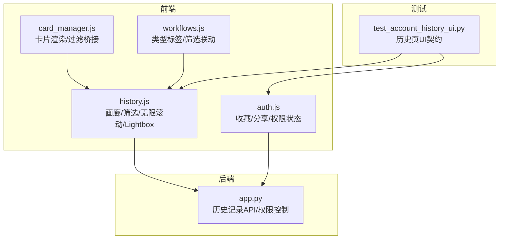
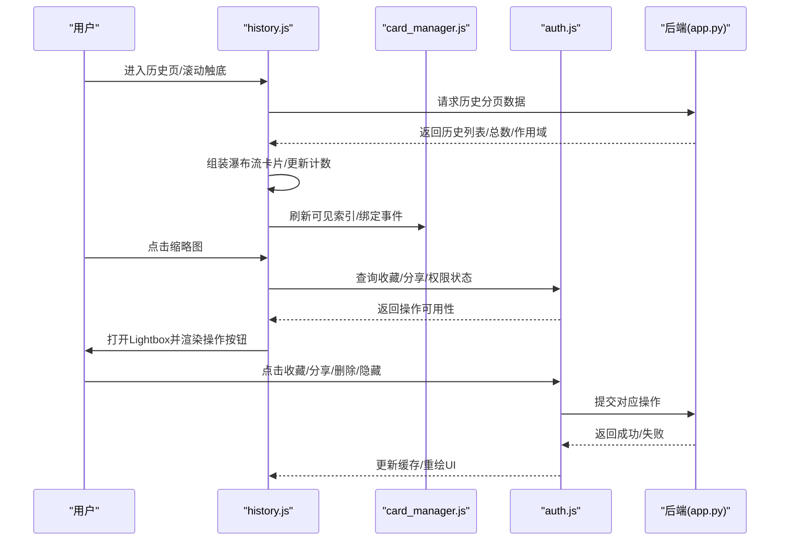
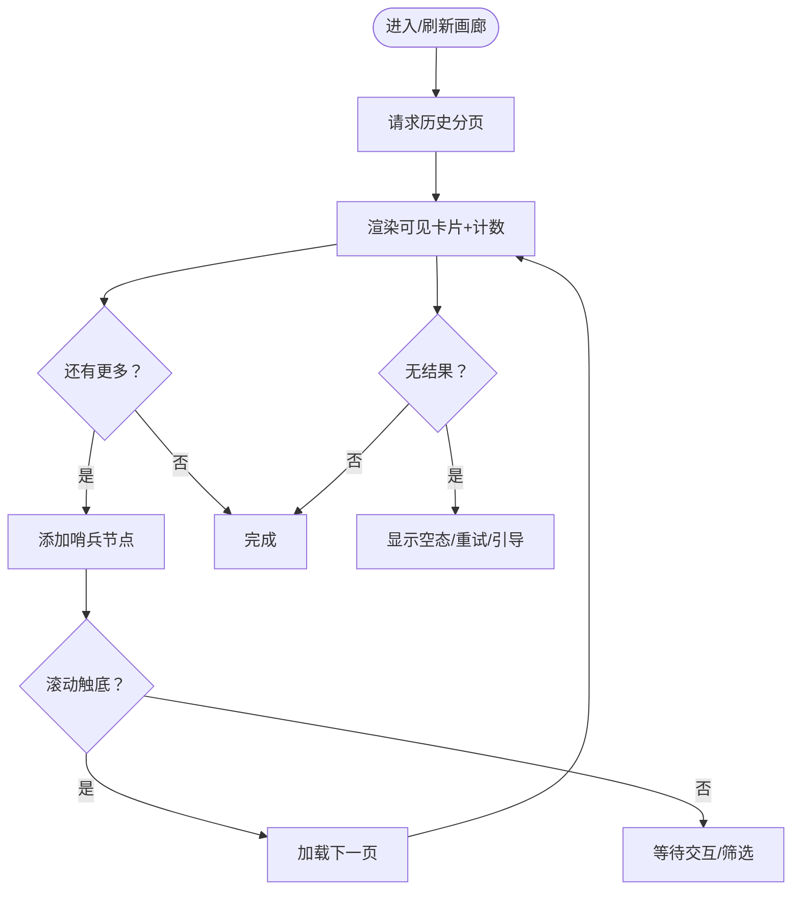
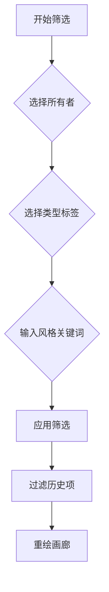
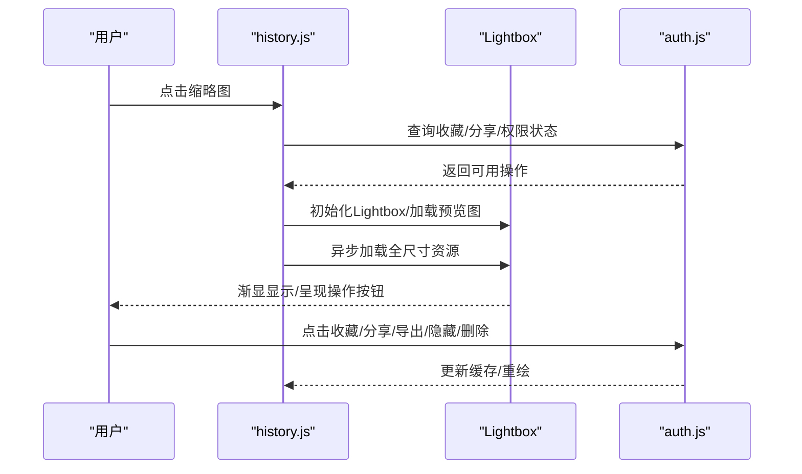
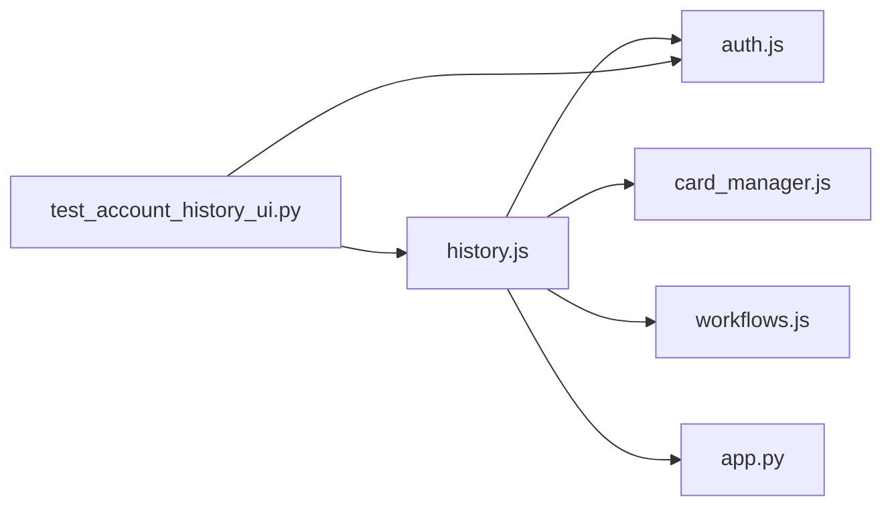

# 历史记录与画廊

<cite>
**本文引用的文件**
- [app.py](file://app.py)
- [history.js](file://static/js/modules/history.js)
- [auth.js](file://static/js/modules/auth.js)
- [card_manager.js](file://static/js/modules/card_manager.js)
- [workflows.js](file://static/js/modules/workflows.js)
- [test_account_history_ui.py](file://tests/test_account_history_ui.py)
</cite>

## 目录
1. [简介](#简介)
2. [项目结构](#项目结构)
3. [核心组件](#核心组件)
4. [架构总览](#架构总览)
5. [详细组件分析](#详细组件分析)
6. [依赖关系分析](#依赖关系分析)
7. [性能考量](#性能考量)
8. [故障排查指南](#故障排查指南)
9. [结论](#结论)
10. [附录](#附录)

## 简介
本指南面向 Ez ComfyUI Showcase 的“历史记录与画廊”功能，围绕以下目标展开：  
- 画廊浏览：瀑布流布局、无限滚动加载、缩略图展示  
- 历史记录筛选：按用户、收藏、类型等条件筛选  
- 搜索功能：关键词搜索、标签过滤等高级技巧  
- 图片预览：Lightbox 查看器，支持放大、缩小、旋转、下载等  
- 收藏与分享：标记收藏、分享到首页列表  
- 批量操作：批量删除、批量收藏等  
- 图片导出：导出到其他工作流或视频制作  
- 历史管理与清理：维护良好使用体验  

## 项目结构
历史记录与画廊相关的核心文件分布如下：  
- 前端模块：static/js/modules/history.js（画廊渲染、筛选、无限滚动、Lightbox）、static/js/modules/auth.js（收藏/分享/权限状态）、static/js/modules/card_manager.js（卡片渲染与过滤桥接）、static/js/modules/workflows.js（类型标签体系与筛选联动）  
- 后端接口：app.py（历史记录查询与权限控制）  
- 测试用例：tests/test_account_history_ui.py（历史页 UI 行为契约）

图表来源
- [history.js:3330-3415](file://static/js/modules/history.js#L3330-L3415)
- [auth.js:1385-1904](file://static/js/modules/auth.js#L1385-L1904)
- [card_manager.js:50-88](file://static/js/modules/card_manager.js#L50-L88)
- [workflows.js:366-455](file://static/js/modules/workflows.js#L366-L455)
- [app.py:7702-7737](file://app.py#L7702-L7737)
- [test_account_history_ui.py:1-37](file://tests/test_account_history_ui.py#L1-L37)

章节来源
- [history.js:3330-3415](file://static/js/modules/history.js#L3330-L3415)
- [auth.js:1385-1904](file://static/js/modules/auth.js#L1385-L1904)
- [card_manager.js:50-88](file://static/js/modules/card_manager.js#L50-L88)
- [workflows.js:366-455](file://static/js/modules/workflows.js#L366-L455)
- [app.py:7702-7737](file://app.py#L7702-L7737)
- [test_account_history_ui.py:1-37](file://tests/test_account_history_ui.py#L1-L37)

## 核心组件
- 历史记录画廊渲染与无限滚动：负责分页拉取、瀑布流布局、可见项计数、空态提示、错误重试等  
- 收藏/分享/权限状态：提供收藏按钮状态、分享开关、删除/隐藏权限判断  
- 卡片管理器桥接：将外部窗口方法与内部渲染逻辑对接，触发刷新与筛选  
- 类型标签与筛选联动：从工作流元数据生成类型标签，驱动历史记录类型筛选  
- 后端历史记录 API：根据作用域（我的/公开/隐藏/回收站）、状态、用户身份返回历史数据并控制访问权限  

章节来源
- [history.js:1726-1761](file://static/js/modules/history.js#L1726-L1761)
- [history.js:3330-3415](file://static/js/modules/history.js#L3330-L3415)
- [auth.js:1385-1904](file://static/js/modules/auth.js#L1385-L1904)
- [card_manager.js:58-88](file://static/js/modules/card_manager.js#L58-L88)
- [workflows.js:366-455](file://static/js/modules/workflows.js#L366-L455)
- [app.py:7702-7737](file://app.py#L7702-L7737)

## 架构总览
历史记录与画廊的端到端流程如下：  
- 用户进入历史页 → 触发加载 → 分页请求后端 → 渲染瀑布流卡片 → 监听滚动触底 → 自动加载下一页  
- 筛选/搜索 → 更新过滤器 → 重新渲染 → 显示匹配结果或空态提示  
- 点击缩略图 → 打开 Lightbox → 支持收藏/分享/删除/隐藏/导出等操作  
- 批量操作 → 通过卡片选择器批量执行收藏/分享/删除/隐藏  
- 导出 → 将图片/视频导出到其他工作流或视频制作  

图表来源
- [history.js:1726-1761](file://static/js/modules/history.js#L1726-L1761)
- [history.js:3330-3415](file://static/js/modules/history.js#L3330-L3415)
- [card_manager.js:58-88](file://static/js/modules/card_manager.js#L58-L88)
- [auth.js:1385-1904](file://static/js/modules/auth.js#L1385-L1904)
- [app.py:7702-7737](file://app.py#L7702-L7737)

## 详细组件分析

### 画廊浏览：瀑布流布局、无限滚动、缩略图
- 瀑布流与分页：根据可见数量与总条数决定是否追加哨兵节点，触发下一页加载  
- 无限滚动：在未加载完或存在筛选时自动加载更多；加载失败提供重试按钮  
- 缩略图与计数：显示当前筛选/总量统计，为空时显示引导文案  
- 可见索引同步：为每张卡片设置历史索引，绑定点击事件（表单填充/打开 Lightbox/复用）  

图表来源
- [history.js:1726-1761](file://static/js/modules/history.js#L1726-L1761)
- [history.js:3330-3415](file://static/js/modules/history.js#L3330-L3415)

章节来源
- [history.js:1726-1761](file://static/js/modules/history.js#L1726-L1761)
- [history.js:3330-3415](file://static/js/modules/history.js#L3330-L3415)

### 历史记录筛选：按用户、收藏、类型等
- 用户筛选：支持仅看“我的”或“他人”，切换后自动刷新渲染  
- 收藏/隐藏筛选：通过“收藏”“已隐藏”按钮切换，实时更新缓存并重绘  
- 类型筛选：基于工作流元数据的主标签（如“文生图/图生图/放大/文生视频/图生视频”），与历史项类型匹配  
- 条件组合：同时生效的多条件筛选，最终只显示满足所有条件的项  

图表来源
- [auth.js:1499-1507](file://static/js/modules/auth.js#L1499-L1507)
- [auth.js:1792-1810](file://static/js/modules/auth.js#L1792-L1810)
- [workflows.js:366-455](file://static/js/modules/workflows.js#L366-L455)
- [history.js:1910-1937](file://static/js/modules/history.js#L1910-L1937)

章节来源
- [auth.js:1499-1507](file://static/js/modules/auth.js#L1499-L1507)
- [auth.js:1792-1810](file://static/js/modules/auth.js#L1792-L1810)
- [workflows.js:366-455](file://static/js/modules/workflows.js#L366-L455)
- [history.js:1910-1937](file://static/js/modules/history.js#L1910-L1937)

### 搜索功能：关键词与标签过滤
- 关键词搜索：对提示词文本（含 JSON 结构提取）进行小写化匹配  
- 标签过滤：结合工作流元数据中的标签集合，支持按标签快速定位  
- 高级技巧：先按类型标签缩小范围，再输入关键词进一步精确  

章节来源
- [history.js:1910-1937](file://static/js/modules/history.js#L1910-L1937)
- [workflows.js:395-404](file://static/js/modules/workflows.js#L395-L404)

### 图片预览：Lightbox 查看器
- 打开流程：点击缩略图 → 解析媒体类型（图片/视频）→ 加载预览图 → 异步加载全尺寸资源 → 渐显显示  
- 操作按钮：收藏、分享、删除、隐藏、视频编辑、图片导出菜单、分享到首页等  
- 状态同步：根据当前用户与历史项状态动态显示/禁用按钮  
- 尺寸与适配：锁定显示尺寸、视频元数据加载后定位操作区、准备视频编辑器  

图表来源
- [history.js:2547-2636](file://static/js/modules/history.js#L2547-L2636)
- [history.js:2793-2828](file://static/js/modules/history.js#L2793-L2828)
- [history.js:340-401](file://static/js/modules/history.js#L340-L401)
- [auth.js:1385-1904](file://static/js/modules/auth.js#L1385-L1904)

章节来源
- [history.js:2547-2636](file://static/js/modules/history.js#L2547-L2636)
- [history.js:2793-2828](file://static/js/modules/history.js#L2793-L2828)
- [history.js:340-401](file://static/js/modules/history.js#L340-L401)
- [auth.js:1385-1904](file://static/js/modules/auth.js#L1385-L1904)

### 收藏与分享：标记收藏、分享到首页
- 收藏状态：卡片与悬浮预览均同步收藏状态，按钮样式与标题随状态变化  
- 分享控制：公开/私有切换，提交后更新缓存并提示成功/失败  
- 权限判断：仅登录用户可收藏/分享；管理员可跨用户访问隐藏/回收站数据  
- 隐藏与删除：隐藏仅影响可见性，删除进入回收站；两者均需权限校验  

章节来源
- [auth.js:1385-1398](file://static/js/modules/auth.js#L1385-L1398)
- [auth.js:1646-1680](file://static/js/modules/auth.js#L1646-L1680)
- [auth.js:1883-1904](file://static/js/modules/auth.js#L1883-L1904)
- [app.py:7702-7737](file://app.py#L7702-L7737)

### 批量操作：批量删除、批量收藏
- 选择机制：通过卡片选择器勾选多个历史项  
- 批量收藏/分享：调用对应 API，成功后更新缓存并重绘  
- 删除与隐藏：批量删除进入回收站；批量隐藏仅改变可见性  
- 错误处理：统一 toast 提示，必要时回滚 UI 状态  

章节来源
- [auth.js:1853-1904](file://static/js/modules/auth.js#L1853-L1904)

### 图片导出：导出到其他工作流或视频制作
- 导出入口：Lightbox 中的“图片导出菜单”“分享到首页”按钮  
- 工作流集成：导出后可在工作流管理器中复用或作为素材接入视频编辑流程  
- 视频处理：视频项支持视频编辑器入口，便于二次加工  

章节来源
- [history.js:340-401](file://static/js/modules/history.js#L340-L401)
- [workflows.js:366-455](file://static/js/modules/workflows.js#L366-L455)

### 历史记录管理与清理：维护良好体验
- 回收站：删除的历史项进入回收站，支持恢复与清空  
- 隐藏管理：仅本人可见的隐藏项，可随时取消隐藏  
- 清理策略：定期清理长期未使用的隐藏项或批量清空回收站  
- 权限隔离：不同用户的作用域与可见范围由后端严格控制  

章节来源
- [app.py:7702-7737](file://app.py#L7702-L7737)
- [auth.js:1812-1828](file://static/js/modules/auth.js#L1812-L1828)

## 依赖关系分析
- history.js 依赖 auth.js 提供的收藏/分享/权限状态，依赖 card_manager.js 同步可见索引与事件绑定  
- workflows.js 生成类型标签，驱动历史记录类型筛选  
- app.py 提供历史记录 API，依据作用域与用户角色返回数据并控制访问权限  
- test_account_history_ui.py 对历史页 UI 行为进行契约校验（筛选分组、按钮顺序、样式规则等）  

图表来源
- [history.js:1184-1210](file://static/js/modules/history.js#L1184-L1210)
- [auth.js:1385-1904](file://static/js/modules/auth.js#L1385-L1904)
- [card_manager.js:58-88](file://static/js/modules/card_manager.js#L58-L88)
- [workflows.js:366-455](file://static/js/modules/workflows.js#L366-L455)
- [app.py:7702-7737](file://app.py#L7702-L7737)
- [test_account_history_ui.py:1-37](file://tests/test_account_history_ui.py#L1-L37)

章节来源
- [history.js:1184-1210](file://static/js/modules/history.js#L1184-L1210)
- [auth.js:1385-1904](file://static/js/modules/auth.js#L1385-L1904)
- [card_manager.js:58-88](file://static/js/modules/card_manager.js#L58-L88)
- [workflows.js:366-455](file://static/js/modules/workflows.js#L366-L455)
- [app.py:7702-7737](file://app.py#L7702-L7737)
- [test_account_history_ui.py:1-37](file://tests/test_account_history_ui.py#L1-L37)

## 性能考量
- 分页与懒加载：按需加载、避免一次性渲染过多卡片  
- 可见索引同步：减少 DOM 查询与事件绑定成本  
- 预览与全图分离：先显示缩略图，全尺寸图异步加载，提升首屏速度  
- 缓存与去重：加载新页时去重、保持排序稳定，降低重复渲染  
- 错误与重试：网络异常时提供重试按钮，避免长时间无响应  

## 故障排查指南
- 画廊空白或加载失败  
  - 检查网络请求与错误提示，点击“重试”按钮  
  - 若筛选导致无匹配，尝试清除筛选或放宽条件  
- Lightbox 无法打开或图片不显示  
  - 确认媒体类型解析正确，检查预览图与全尺寸图加载路径  
  - 若为视频，确认元数据加载完成后再显示操作区  
- 收藏/分享无效  
  - 确认已登录且具备相应权限；查看 toast 提示  
  - 若为管理员，确认隐藏/回收站作用域下的权限  
- 删除/隐藏异常  
  - 回收站与隐藏状态需区分；确认后端返回状态与前端缓存一致  

章节来源
- [history.js:1748-1760](file://static/js/modules/history.js#L1748-L1760)
- [history.js:2547-2636](file://static/js/modules/history.js#L2547-L2636)
- [auth.js:1883-1904](file://static/js/modules/auth.js#L1883-L1904)
- [app.py:7702-7737](file://app.py#L7702-L7737)

## 结论
Ez ComfyUI Showcase 的历史记录与画廊通过前后端协同，提供了完整的浏览、筛选、预览、收藏、分享与导出能力。其分页与无限滚动设计兼顾性能与体验，Lightbox 提供丰富的媒体操作入口，配合严格的权限控制与回收站/隐藏机制，帮助用户高效管理创作历史。

## 附录
- 快速上手建议  
  - 先按“类型标签”缩小范围，再用关键词精确搜索  
  - 使用“收藏”“已隐藏”快速整理个人素材  
  - 大量操作建议使用批量功能，提高效率  
  - 导出前先确认媒体类型与尺寸，确保后续工作流兼容