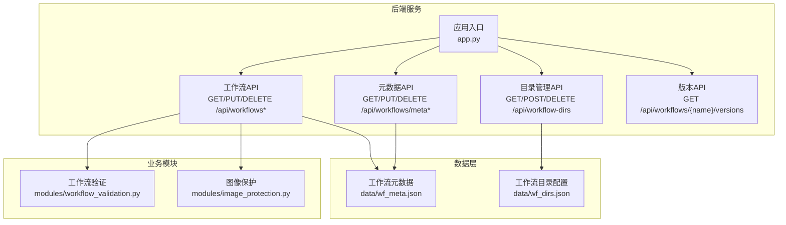
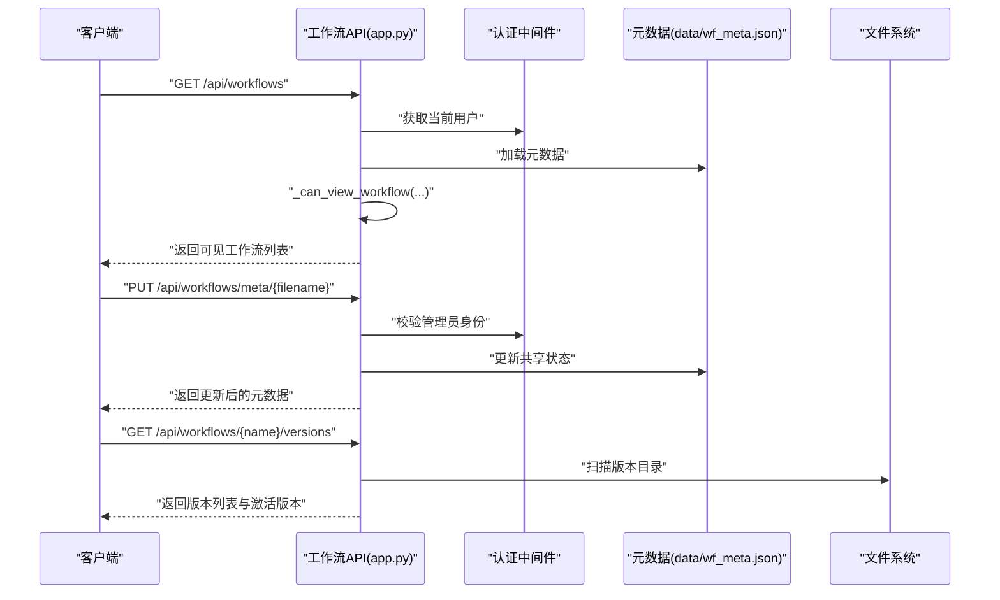
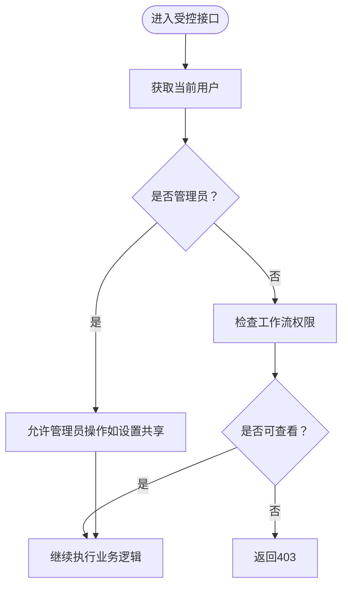
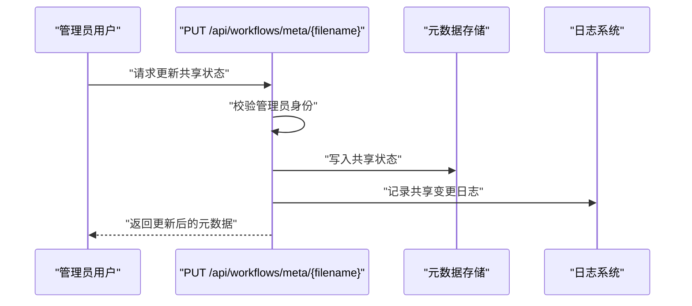
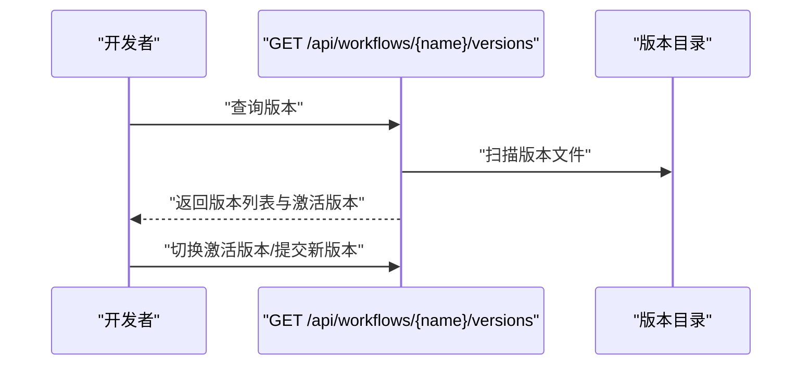
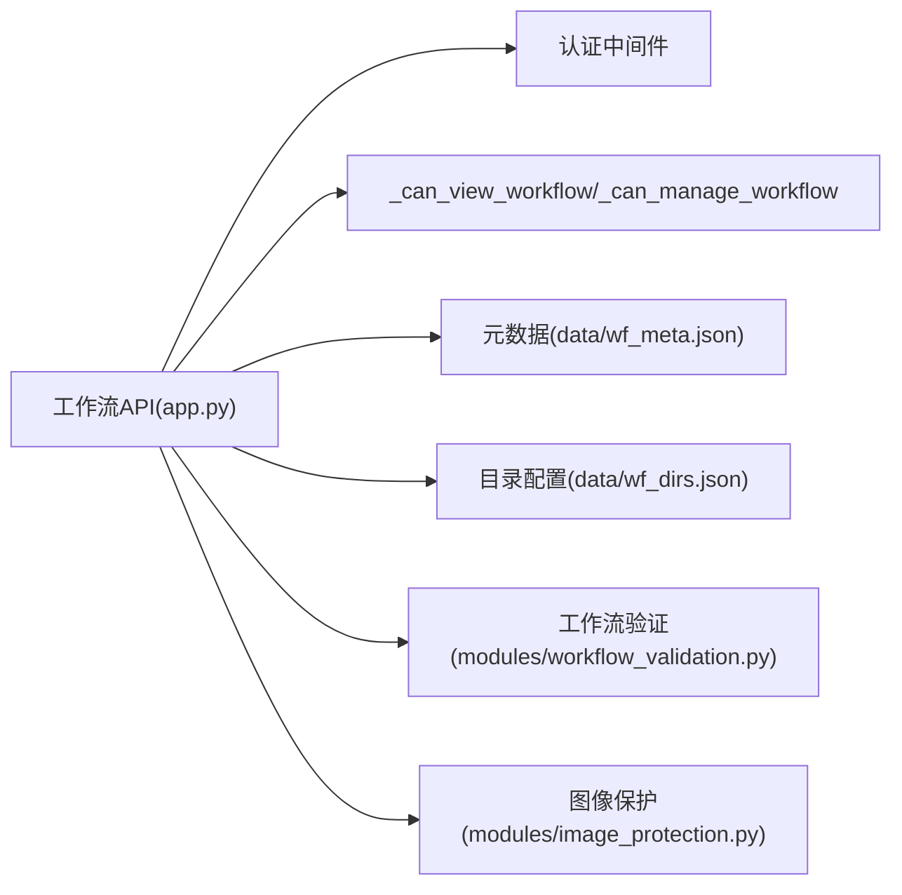

# 工作流共享与协作

<cite>
**本文引用的文件**
- [app.py](file://app.py)
- [README.md](file://README.md)
- [data/wf_meta.json](file://data/wf_meta.json)
- [data/wf_dirs.json](file://data/wf_dirs.json)
- [modules/workflow_validation.py](file://modules/workflow_validation.py)
- [modules/image_protection.py](file://modules/image_protection.py)
</cite>

## 目录
1. [简介](#简介)
2. [项目结构](#项目结构)
3. [核心组件](#核心组件)
4. [架构总览](#架构总览)
5. [详细组件分析](#详细组件分析)
6. [依赖关系分析](#依赖关系分析)
7. [性能考量](#性能考量)
8. [故障排查指南](#故障排查指南)
9. [结论](#结论)
10. [附录](#附录)

## 简介
本指南面向 Ez ComfyUI Showcase 的“工作流共享与协作”能力，系统阐述工作流共享的概念、权限控制机制、可见性与使用范围、共享状态的设置与管理、不同角色（普通用户与管理员）的权限差异、协作流程与最佳实践、版本控制策略、安全注意事项，以及典型协作场景示例。读者可据此在平台上高效地创建、共享、协作与维护工作流。

## 项目结构
围绕工作流共享与协作的关键目录与文件如下：
- 后端服务入口与 API：app.py
- 工作流元数据存储：data/wf_meta.json
- 工作流目录配置：data/wf_dirs.json
- 工作流验证模块：modules/workflow_validation.py
- 图像保护模块：modules/image_protection.py

图表来源
- [app.py](file://app.py)
- [data/wf_meta.json](file://data/wf_meta.json)
- [data/wf_dirs.json](file://data/wf_dirs.json)
- [modules/workflow_validation.py](file://modules/workflow_validation.py)
- [modules/image_protection.py](file://modules/image_protection.py)

章节来源
- [app.py](file://app.py)
- [data/wf_meta.json](file://data/wf_meta.json)
- [data/wf_dirs.json](file://data/wf_dirs.json)

## 核心组件
- 工作流元数据与共享状态
  - 元数据键包含：名称、标签、所有者、共享标志、版本信息等。共享状态由布尔字段表示，并通过管理员权限进行变更。
- 权限控制模型
  - 查看权限：非公开工作流需登录且满足“拥有者或已共享”的条件。
  - 管理权限：仅工作流拥有者或管理员可修改元数据、重命名、删除工作流。
  - 管理员特权限制：仅管理员可设置/取消工作流共享状态。
- 版本管理
  - 支持工作流历史版本列表与当前激活版本切换，便于多人协作回溯与恢复。
- 协作与可见性
  - 已共享的工作流对登录用户可见；未共享的工作流仅对拥有者可见。
- 安全与合规
  - 提供图像保护能力，结合工作流中的敏感内容识别与处理策略，降低泄露风险。

章节来源
- [app.py](file://app.py)
- [modules/workflow_validation.py](file://modules/workflow_validation.py)
- [modules/image_protection.py](file://modules/image_protection.py)

## 架构总览
下图展示工作流共享与协作在系统中的关键交互路径：客户端请求经由后端 API，依据权限控制逻辑判断访问与操作权限，再读写元数据与工作流文件，最终返回结果。

图表来源
- [app.py](file://app.py)
- [data/wf_meta.json](file://data/wf_meta.json)

## 详细组件分析

### 权限控制与可见性
- 查看权限判定
  - 非公开工作流必须满足“当前用户已登录且为拥有者，或该工作流处于共享状态”，否则拒绝访问。
- 管理权限判定
  - 仅工作流拥有者或管理员可执行元数据修改、重命名、删除等管理操作。
- 管理员特权限制
  - 设置/取消共享状态仅管理员可操作；普通用户提交共享字段会被忽略或被拒绝。

图表来源
- [app.py](file://app.py)

章节来源
- [app.py](file://app.py)

### 共享状态的设置与管理
- 设置共享
  - 通过 PUT /api/workflows/meta/{filename} 更新元数据中的共享字段；仅管理员可成功设置。
  - 接口会记录日志，包含工作流名与操作人。
- 取消共享
  - 将共享字段置为 false，使工作流仅对拥有者可见。
- 共享状态标识
  - 列表与详情接口均返回共享布尔值，前端据此展示共享标识。

图表来源
- [app.py](file://app.py)

章节来源
- [app.py](file://app.py)

### 访问权限与角色差异
- 普通用户
  - 可查看：已登录且满足“拥有者或共享”条件的工作流。
  - 可管理：仅限自身拥有的工作流。
- 管理员
  - 可查看：全部工作流（含未共享）。
  - 可管理：全部工作流。
  - 可设置共享：任意工作流的共享状态。

章节来源
- [app.py](file://app.py)

### 协作流程与最佳实践
- 分享链接协作
  - 将工作流设为共享后，其他登录用户可在工作流列表中发现并使用该工作流。
  - 建议配合标签与名称规范，提升检索效率。
- 团队协作建议
  - 使用统一命名规范与标签体系，便于分类与检索。
  - 对关键工作流设置共享，但注意敏感内容保护。
  - 使用版本管理功能保存重要里程碑版本，避免覆盖式修改导致历史丢失。

章节来源
- [app.py](file://app.py)

### 版本控制与冲突避免
- 版本列表
  - 通过 GET /api/workflows/{name}/versions 获取历史版本清单与当前激活版本。
- 多人协作建议
  - 在多人编辑前先拉取最新版本，编辑完成后提交新版本并激活，减少覆盖冲突。
  - 使用标签与注释标注版本用途与变更摘要，便于追溯。

图表来源
- [app.py](file://app.py)

章节来源
- [app.py](file://app.py)

### 安全考虑与敏感内容保护
- 图像保护
  - 结合图像保护模块，对工作流中可能包含敏感内容的输出进行识别与处理，降低泄露风险。
- 最佳实践
  - 对涉及隐私或商业机密的工作流保持私有，不设为共享。
  - 定期审查工作流中的敏感节点与输出，必要时启用保护策略。

章节来源
- [modules/image_protection.py](file://modules/image_protection.py)

### 实际协作场景示例
- 团队项目管理
  - 将项目常用工作流设为共享，团队成员在列表中快速定位并复用；通过版本管理保留里程碑版本。
- 工作流模板分享
  - 将标准化模板设为共享，新成员可直接下载使用；通过标签与名称明确用途，便于检索。
- 跨部门协作
  - 不同部门间通过共享工作流实现跨域复用；对涉及本部门机密的内容保持私有，避免误共享。

章节来源
- [app.py](file://app.py)

## 依赖关系分析
- API 层依赖
  - 工作流 API 依赖认证中间件与权限控制函数，确保访问与操作合法。
  - 元数据 API 依赖元数据持久化（data/wf_meta.json），用于读写共享状态与版本信息。
  - 目录管理 API 依赖目录配置（data/wf_dirs.json），用于扩展工作流扫描范围。
- 业务模块依赖
  - 工作流验证模块用于保障工作流合法性，防止恶意或异常工作流参与共享。
  - 图像保护模块用于敏感内容识别与处理，降低共享带来的安全风险。

图表来源
- [app.py](file://app.py)
- [data/wf_meta.json](file://data/wf_meta.json)
- [data/wf_dirs.json](file://data/wf_dirs.json)
- [modules/workflow_validation.py](file://modules/workflow_validation.py)
- [modules/image_protection.py](file://modules/image_protection.py)

章节来源
- [app.py](file://app.py)
- [data/wf_meta.json](file://data/wf_meta.json)
- [data/wf_dirs.json](file://data/wf_dirs.json)
- [modules/workflow_validation.py](file://modules/workflow_validation.py)
- [modules/image_protection.py](file://modules/image_protection.py)

## 性能考量
- 元数据读写
  - 共享状态与版本信息频繁读取，建议在元数据层采用轻量结构与索引优化，减少扫描成本。
- 文件系统访问
  - 工作流列表与版本扫描涉及大量文件遍历，建议限制扫描深度与范围，结合缓存策略提升响应速度。
- 并发与一致性
  - 多人协作时，建议引入乐观锁或版本号机制，避免并发写入导致的数据不一致。

## 故障排查指南
- 无权限错误
  - 现象：访问工作流或修改元数据返回 403。
  - 排查：确认当前用户是否为管理员；检查工作流是否已共享；核对拥有者信息。
- 共享状态未生效
  - 现象：设置共享后其他用户仍无法看到。
  - 排查：确认调用接口为管理员；检查元数据写入是否成功；核对列表过滤逻辑。
- 版本缺失
  - 现象：查询版本列表为空。
  - 排查：确认版本目录存在且命名规范；检查版本文件是否符合约定；重新导出元数据。
- 安全问题
  - 现象：共享工作流包含敏感内容。
  - 排查：启用图像保护策略；对敏感节点进行脱敏或移除；限制共享范围。

章节来源
- [app.py](file://app.py)
- [modules/image_protection.py](file://modules/image_protection.py)

## 结论
Ez ComfyUI Showcase 的工作流共享与协作以清晰的权限模型与元数据管理为核心，辅以版本控制与安全保护，能够有效支撑团队协作与知识复用。通过规范的命名与标签体系、严格的管理员权限控制、以及版本与安全策略，可显著降低协作风险并提升效率。

## 附录
- 快速参考
  - 查看工作流列表：GET /api/workflows
  - 查看工作流详情与字段：GET /api/workflows/{name}/fields
  - 下载工作流：GET /api/workflows/{name}/download
  - 更新元数据与共享状态：PUT /api/workflows/meta/{filename}
  - 查询版本：GET /api/workflows/{name}/versions
  - 管理工作流目录：GET/POST/DELETE /api/workflow-dirs

章节来源
- [app.py](file://app.py)
- [README.md](file://README.md)