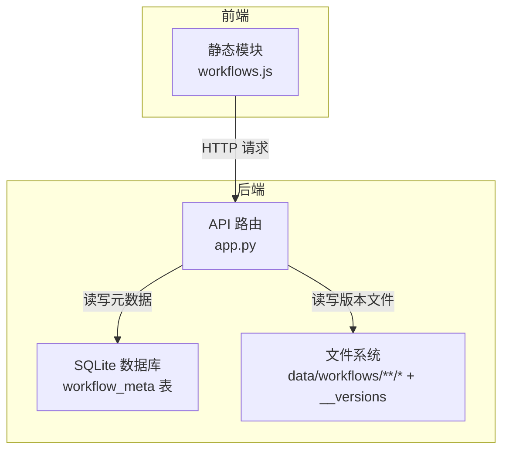
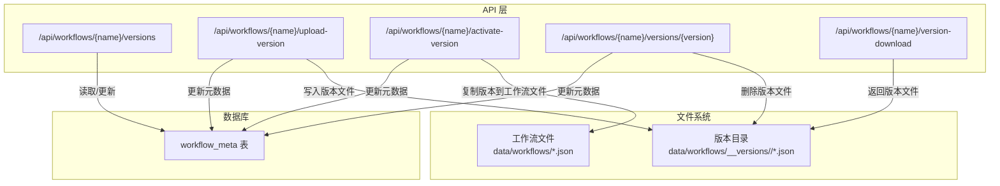
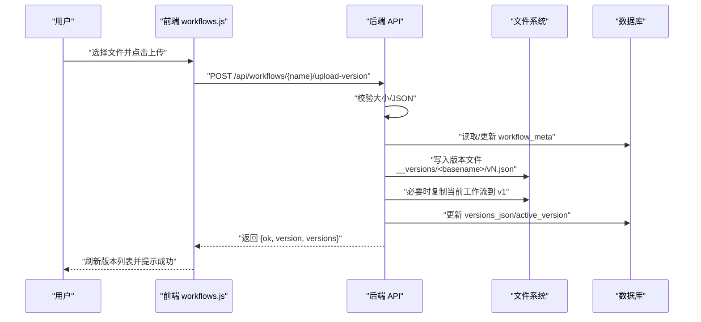
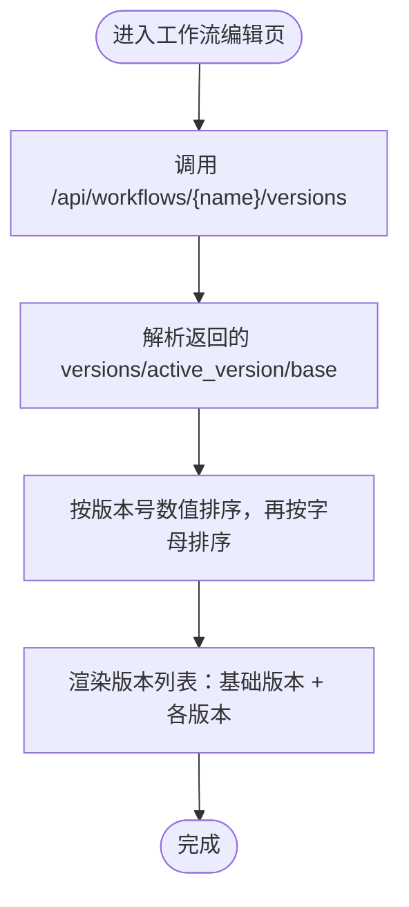
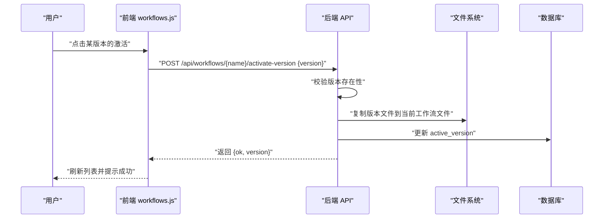
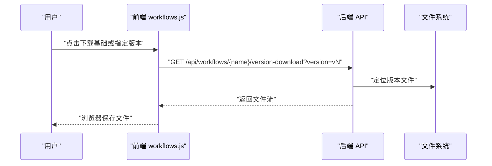
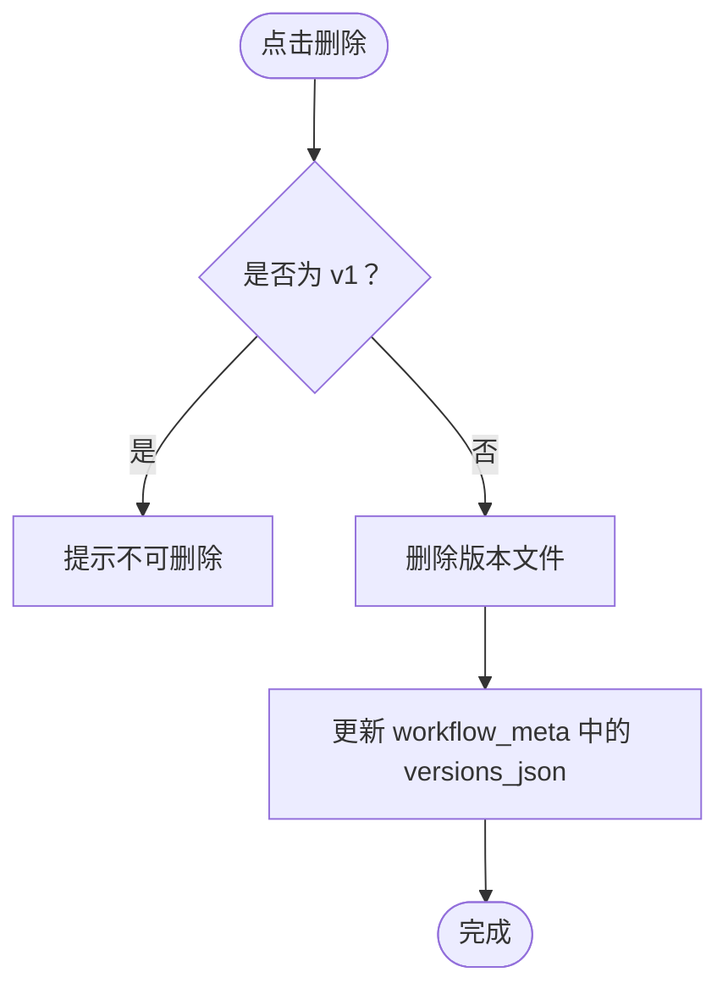
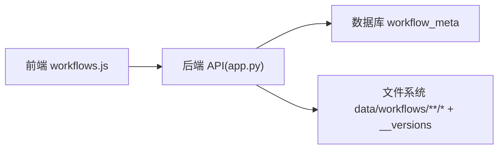

# 工作流版本管理

<cite>
**本文引用的文件**
- [app.py](file://app.py)
- [workflows.js](file://static/js/modules/workflows.js)
- [workflow-storage-architecture-plan.md](file://docs/workflow-storage-architecture-plan.md)
</cite>

## 目录
1. [简介](#简介)
2. [项目结构](#项目结构)
3. [核心组件](#核心组件)
4. [架构总览](#架构总览)
5. [详细组件分析](#详细组件分析)
6. [依赖关系分析](#依赖关系分析)
7. [性能考量](#性能考量)
8. [故障排查指南](#故障排查指南)
9. [结论](#结论)
10. [附录](#附录)

## 简介
本指南面向 Ez ComfyUI Showcase 的“工作流版本管理”功能，帮助用户理解工作流版本的概念与价值，并掌握版本上传、版本列表查看、版本切换、版本下载、版本删除等操作流程。系统采用“文件内容持久化 + 数据库存储元数据”的混合架构：工作流文件与版本文件以 JSON 文件形式保存在文件系统中，而工作流名称、标签、拥有者、共享状态、版本映射与当前激活版本等元信息则由数据库统一维护，确保多用户协作与一致性。

## 项目结构
围绕工作流版本管理的关键位置如下：
- 后端 API 定义与实现位于应用入口文件中，提供版本查询、上传、激活、下载与删除接口。
- 前端工作流编辑模块负责渲染版本列表、触发上传与激活操作、下载指定版本。
- 文档明确了“文件系统持有工作流与版本内容，数据库持有协作元数据”的边界设计。

图表来源
- [app.py](file://app.py)
- [workflows.js](file://static/js/modules/workflows.js)
- [workflow-storage-architecture-plan.md](file://docs/workflow-storage-architecture-plan.md)

章节来源
- [app.py](file://app.py)
- [workflows.js](file://static/js/modules/workflows.js)
- [workflow-storage-architecture-plan.md](file://docs/workflow-storage-architecture-plan.md)

## 核心组件
- 版本元数据表（workflow_meta）
  - 字段要点：filename、name、tags_json、owner_id、shared、source、source_path、thumbnail、sort_order、versions_json、active_version、updated_at。
  - 作用：记录每个工作流的元信息与版本映射，以及当前激活版本。
- 版本文件组织
  - 结构：每个工作流对应一个目录，内含按版本命名的 JSON 文件；首次上传或激活时会复制当前工作流文件到首个版本。
- 前端版本面板
  - 功能：展示版本列表、下载基础版本与各版本、激活任意版本、删除非基础版本。

章节来源
- [app.py](file://app.py)
- [workflow-storage-architecture-plan.md](file://docs/workflow-storage-architecture-plan.md)

## 架构总览
版本管理遵循“文件系统存内容、数据库存元数据”的边界设计。版本文件与工作流文件均以 JSON 形式存放，便于导入导出与远程同步；数据库仅存协作相关元信息与版本映射，避免将大体量工作流内容直接存入数据库。

图表来源
- [app.py](file://app.py)
- [workflow-storage-architecture-plan.md](file://docs/workflow-storage-architecture-plan.md)

## 详细组件分析

### 版本上传（新增版本）
- 操作入口：在工作流编辑界面触发上传，选择本地 JSON 文件。
- 服务端处理：
  - 限制文件大小上限。
  - 校验 JSON 格式。
  - 解析元数据，计算下一个版本号（基于现有版本名中的数字）。
  - 创建版本目录并写入版本文件。
  - 若无任何版本且存在当前工作流文件，则自动创建 v1 并复制当前工作流内容。
  - 更新元数据中的版本映射与当前激活版本。
- 前端交互：
  - 上传成功后刷新版本列表，显示新版本并标记为当前激活版本。

图表来源
- [app.py](file://app.py)
- [workflows.js](file://static/js/modules/workflows.js)

章节来源
- [app.py](file://app.py)
- [workflows.js](file://static/js/modules/workflows.js)

### 版本列表查看与排序
- 列表来源：调用版本查询接口，返回版本映射、当前激活版本与基础版本信息。
- 排序规则：优先按版本号数值升序，其次按字母顺序。
- 基础版本：始终作为第一个条目显示，若当前未激活任何版本则标记为“当前”。

图表来源
- [workflows.js](file://static/js/modules/workflows.js)

章节来源
- [workflows.js](file://static/js/modules/workflows.js)

### 版本切换（激活）
- 操作入口：在版本列表中点击“激活”按钮。
- 服务端处理：
  - 校验目标版本是否存在且文件有效。
  - 将目标版本文件复制回当前工作流文件路径，使更改立即生效。
  - 更新元数据中的当前激活版本。
- 前端交互：激活成功后重新渲染版本列表，标记新版本为“当前”。

图表来源
- [app.py](file://app.py)
- [workflows.js](file://static/js/modules/workflows.js)

章节来源
- [app.py](file://app.py)
- [workflows.js](file://static/js/modules/workflows.js)

### 版本下载
- 基础版本下载：下载当前工作流文件。
- 指定版本下载：下载对应版本文件，文件名为“基础名_版本号.json”。

图表来源
- [app.py](file://app.py)
- [workflows.js](file://static/js/modules/workflows.js)

章节来源
- [app.py](file://app.py)
- [workflows.js](file://static/js/modules/workflows.js)

### 版本删除
- 限制：基础版本（v1）不可删除。
- 操作入口：在版本列表中点击“删除”按钮。
- 服务端处理：删除对应版本文件，并更新元数据中的版本映射。
- 前端交互：删除成功后刷新版本列表。

图表来源
- [app.py](file://app.py)
- [workflows.js](file://static/js/modules/workflows.js)

章节来源
- [app.py](file://app.py)
- [workflows.js](file://static/js/modules/workflows.js)

### 版本比较（概念说明）
- 当前系统未提供“版本对比”页面或 API。若需对比两个版本的差异，可采用以下方式：
  - 使用“版本下载”分别下载两个版本文件，然后在外部工具中进行对比。
  - 在工作流编辑器中先“激活”目标版本，再执行生成任务，通过输出结果进行对比验证。
- 若未来需要内置对比功能，可在前端增加对比视图，并通过后端提供版本内容读取接口。

（本节为概念性说明，不直接分析具体文件）

## 依赖关系分析
- 前端依赖后端 API 提供的版本查询、上传、激活、下载与删除能力。
- 后端依赖数据库存储元数据，依赖文件系统存储版本文件。
- 版本文件与工作流文件的命名与目录结构遵循固定模式，保证一致性与可维护性。

图表来源
- [app.py](file://app.py)
- [workflows.js](file://static/js/modules/workflows.js)

章节来源
- [app.py](file://app.py)
- [workflows.js](file://static/js/modules/workflows.js)

## 性能考量
- 版本文件大小：服务端对上传文件大小有限制，避免单个版本文件过大影响存储与传输。
- 版本数量：版本越多，文件系统目录项越多；建议定期清理不再使用的版本，保持目录整洁。
- 元数据更新：每次上传/激活/删除都会更新数据库中的版本映射，频繁操作可能带来写放大；建议批量操作或合并变更。

（本节提供通用建议，不直接分析具体文件）

## 故障排查指南
- 上传失败（无效 JSON）
  - 现象：提示 JSON 格式错误。
  - 处理：检查 JSON 是否合法，确认文件编码与格式正确。
- 上传失败（文件过大）
  - 现象：提示超过大小限制。
  - 处理：压缩工作流节点或拆分步骤，降低文件体积。
- 版本不存在或文件缺失
  - 现象：下载/激活时报错“版本未找到”。
  - 处理：确认版本名是否正确；检查文件系统中对应版本文件是否存在。
- 基础版本无法删除
  - 现象：删除按钮不可用或提示不可删除。
  - 处理：基础版本（v1）不可删除，这是设计限制；如需清理，请先激活其他版本后再删除。
- 版本列表为空
  - 现象：显示“尚无版本”。
  - 处理：先上传一个版本；若已有工作流文件但无版本，系统会在首次上传时自动创建 v1。

章节来源
- [app.py](file://app.py)
- [workflows.js](file://static/js/modules/workflows.js)

## 结论
Ez ComfyUI Showcase 的工作流版本管理以“文件系统 + 数据库”的混合架构实现，既保证了与 ComfyUI 原生文件生态的兼容性，又提供了多用户协作所需的元数据管理能力。通过上传、查看、切换、下载与删除等操作，用户可以高效地维护工作流的历史版本，保障实验与生产的稳定性。

## 附录

### 版本命名规则与版本号管理
- 命名规则：版本名以“v”开头加数字组成（如 v1、v2、v10），系统会据此进行数值排序。
- 自动编号：新版本号基于现有版本名中的最大数字加一自动生成。
- 基础版本：当存在当前工作流文件且尚未有版本时，系统会自动创建 v1 并复制当前工作流内容。

章节来源
- [app.py](file://app.py)

### 最佳实践
- 版本命名规范
  - 使用语义化版本号（如 v1、v2、v10），避免混用字母与特殊字符。
  - 对重大改动使用递增版本号，便于追溯。
- 发布策略
  - 在关键节点（如参数优化、节点替换）创建新版本，保留旧版本用于回滚。
  - 避免频繁小改动导致版本过多，建议合并变更后再发布。
- 存储管理
  - 定期清理不再使用的版本，释放磁盘空间。
  - 对重要版本进行手动备份（下载并归档）。
- 安全与权限
  - 仅管理员可上传/删除版本，避免误操作破坏工作流。
- 可靠性
  - 上传前先在编辑器中验证工作流逻辑，减少无效版本。
  - 使用“激活”预览效果，确认无误后再正式启用。

章节来源
- [app.py](file://app.py)
- [workflow-storage-architecture-plan.md](file://docs/workflow-storage-architecture-plan.md)