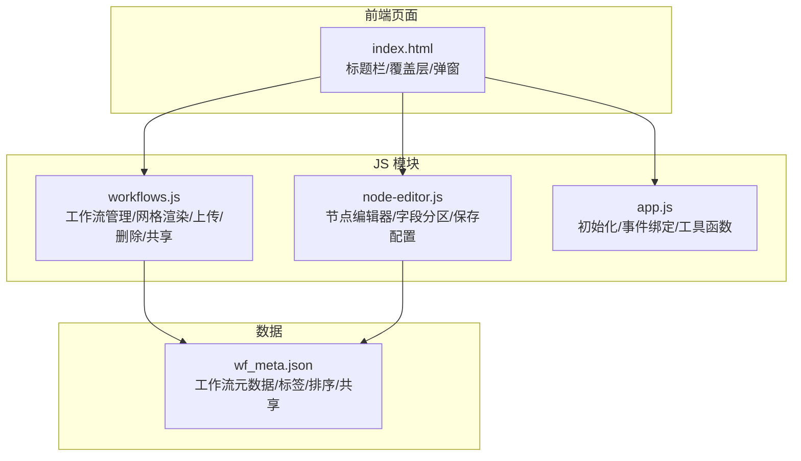
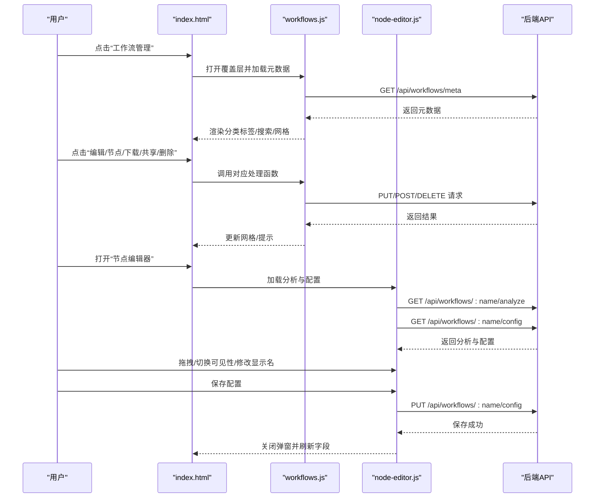
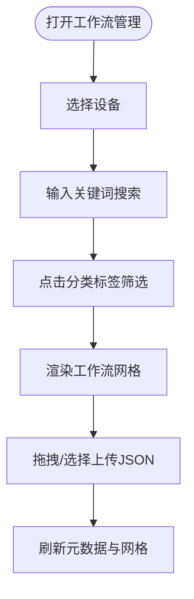
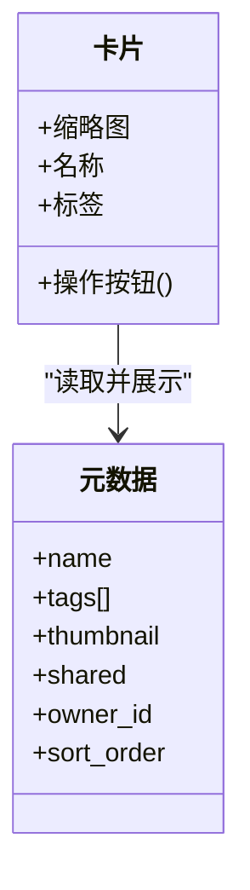
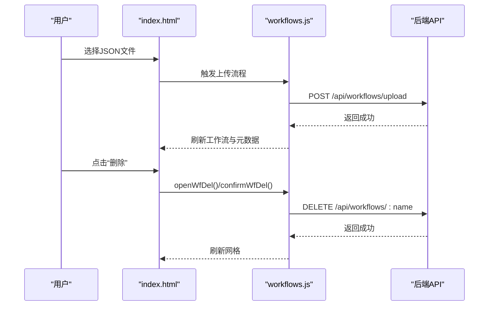
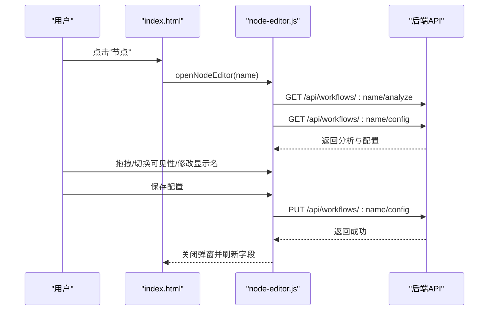
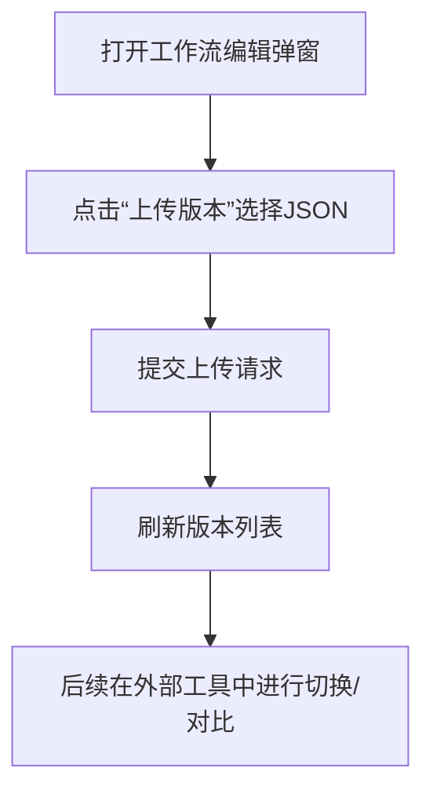
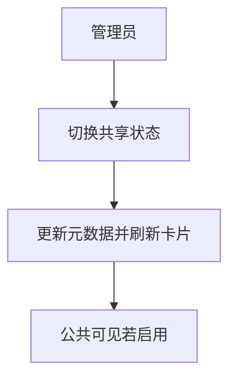
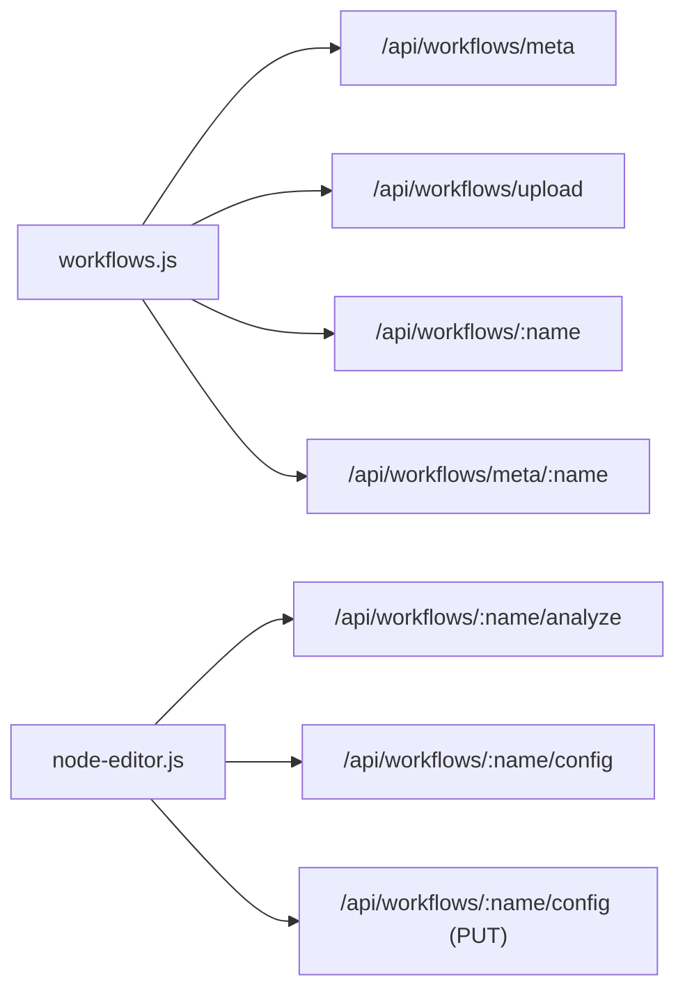

# 工作流管理

<cite>
**本文引用的文件**
- [index.html](file://static/index.html)
- [workflows.js](file://static/js/modules/workflows.js)
- [node-editor.js](file://static/js/modules/node-editor.js)
- [app.js](file://static/js/app.js)
- [wf_meta.json](file://data/wf_meta.json)
</cite>

## 目录
1. [简介](#简介)
2. [项目结构](#项目结构)
3. [核心组件](#核心组件)
4. [架构总览](#架构总览)
5. [详细组件解析](#详细组件解析)
6. [依赖关系分析](#依赖关系分析)
7. [性能考量](#性能考量)
8. [故障排查指南](#故障排查指南)
9. [结论](#结论)
10. [附录](#附录)

## 简介
本指南面向 Ez ComfyUI Showcase 的“工作流管理”功能，帮助用户高效完成以下任务：
- 在工作流选择界面进行分类、搜索、筛选与排序
- 查看与操作工作流卡片（缩略图、标签、版本）
- 使用工作流编辑器进行上传、导入、删除
- 通过节点编辑器以可视化方式修改工作流参数（用户输入区、高级参数区、输出区）
- 管理工作流版本（上传、切换、对比）
- 共享与协作（设置共享状态）

本指南提供操作步骤、界面截图说明与常见问题排查，帮助不同技术背景的用户顺利上手。

## 项目结构
工作流管理功能由前端页面与模块化 JS 组成，核心文件如下：
- 页面与覆盖层：static/index.html
- 工作流管理模块：static/js/modules/workflows.js
- 节点编辑器模块：static/js/modules/node-editor.js
- 应用初始化与事件绑定：static/js/app.js
- 工作流元数据：data/wf_meta.json

**图表来源**
- [index.html](file://static/index.html)
- [workflows.js](file://static/js/modules/workflows.js)
- [node-editor.js](file://static/js/modules/node-editor.js)
- [app.js](file://static/js/app.js)
- [wf_meta.json](file://data/wf_meta.json)

**章节来源**
- [index.html](file://static/index.html)
- [workflows.js](file://static/js/modules/workflows.js)
- [node-editor.js](file://static/js/modules/node-editor.js)
- [app.js](file://static/js/app.js)
- [wf_meta.json](file://data/wf_meta.json)

## 核心组件
- 工作流管理覆盖层：提供设备选择、搜索、分类筛选、上传入口与工作流网格展示。
- 工作流卡片：包含缩略图、名称、标签、操作按钮（编辑、节点、下载、共享、删除）。
- 工作流编辑弹窗：支持修改名称、标签、上传缩略图、版本管理。
- 节点编辑器：按“用户输入/高级参数/输出/隐藏”四个区域组织字段，支持拖拽排序与可见性切换。
- 版本管理：在编辑弹窗内上传新版本，保留历史版本，便于回滚与对比。
- 共享与协作：管理员可切换工作流共享状态，影响其在公共可见范围内的呈现。

**章节来源**
- [index.html](file://static/index.html)
- [workflows.js](file://static/js/modules/workflows.js)
- [node-editor.js](file://static/js/modules/node-editor.js)

## 架构总览
工作流管理采用“覆盖层 + 弹窗 + 模块化 JS”的前端架构，通过统一的 API 与后端交互，实现工作流的增删改查、版本管理与共享控制。

**图表来源**
- [index.html](file://static/index.html)
- [workflows.js](file://static/js/modules/workflows.js)
- [node-editor.js](file://static/js/modules/node-editor.js)

## 详细组件解析

### 工作流选择界面
- 设备选择与同步：覆盖层左上方提供设备选择下拉，支持手动同步按钮与状态提示。
- 搜索与筛选：搜索框实时过滤工作流；分类标签页按主标签聚合计数，点击切换可见集合。
- 排序：排序依据为元数据中的 sort_order，其次按文件名本地化排序。
- 上传入口：左侧统计面板提供“上传工作流”，支持拖拽与点击选择文件。

**图表来源**
- [index.html](file://static/index.html)
- [workflows.js](file://static/js/modules/workflows.js)

**章节来源**
- [index.html](file://static/index.html)
- [workflows.js](file://static/js/modules/workflows.js)

### 工作流卡片查看与操作
- 缩略图预览：优先使用元数据中的 thumbnail，否则回退到工作流预览图。
- 标签显示：主标签来自元数据 tags[0]，若为空则根据文件名推断类型（文生图/图生图/文生视频/图生视频等）。
- 操作按钮：
  - 编辑：仅工作流拥有者或管理员可编辑（名称、标签、缩略图、版本）。
  - 节点：进入节点编辑器，按区域组织字段。
  - 下载：下载工作流 JSON。
  - 共享：管理员可切换共享状态（影响“共享”标签与卡片外观）。
  - 删除：仅工作流拥有者或管理员可删除。

**图表来源**
- [workflows.js](file://static/js/modules/workflows.js)
- [wf_meta.json](file://data/wf_meta.json)

**章节来源**
- [workflows.js](file://static/js/modules/workflows.js)
- [wf_meta.json](file://data/wf_meta.json)

### 工作流编辑器（上传/导入/删除）
- 上传工作流：支持单个或批量上传 .json 文件，上传后自动刷新工作流列表与元数据。
- 导入：覆盖层的上传区域支持拖拽与点击两种方式。
- 删除：在工作流卡片上点击“删除”，弹出确认对话框，确认后调用删除接口并刷新。

**图表来源**
- [index.html](file://static/index.html)
- [workflows.js](file://static/js/modules/workflows.js)

**章节来源**
- [index.html](file://static/index.html)
- [workflows.js](file://static/js/modules/workflows.js)

### 节点编辑器（可视化参数修改）
- 字段分区：用户输入区、高级参数区、输出区、隐藏区。
- 可见性切换：点击“眼睛”图标在可见/隐藏之间切换，隐藏字段会移动到“隐藏”区。
- 显示名修改：在字段卡片上的输入框修改显示名称，不影响底层字段键值。
- 拖拽排序：在区域内拖拽字段卡片调整顺序，保存后生效。
- 保存与重置：保存配置写回后端；重置可删除已保存配置，回到自动分类状态。

**图表来源**
- [index.html](file://static/index.html)
- [node-editor.js](file://static/js/modules/node-editor.js)

**章节来源**
- [index.html](file://static/index.html)
- [node-editor.js](file://static/js/modules/node-editor.js)

### 工作流版本管理
- 版本上传：在工作流编辑弹窗的“版本管理”区域，点击“上传版本”选择 .json 文件上传，系统保留历史版本。
- 版本切换与对比：当前界面未提供直接切换/对比功能，但可通过上传新版本的方式管理历史版本；如需切换/对比，可在后端或外部工具中实现。

**图表来源**
- [index.html](file://static/index.html)
- [workflows.js](file://static/js/modules/workflows.js)

**章节来源**
- [index.html](file://static/index.html)
- [workflows.js](file://static/js/modules/workflows.js)

### 工作流共享与协作
- 共享状态：管理员可切换工作流的共享状态，卡片上会显示“共享”标签。
- 权限控制：编辑、节点、删除等操作基于当前用户角色与工作流 owner_id 判断。
- 元数据字段：shared、owner_id、tags、sort_order 等决定卡片展示与权限。

**图表来源**
- [workflows.js](file://static/js/modules/workflows.js)
- [wf_meta.json](file://data/wf_meta.json)

**章节来源**
- [workflows.js](file://static/js/modules/workflows.js)
- [wf_meta.json](file://data/wf_meta.json)

## 依赖关系分析
- workflows.js 依赖：
  - 元数据：从 /api/workflows/meta 获取并缓存至内存，用于网格渲染与权限判断。
  - 上传/删除/共享：通过 fetch 调用后端 API。
  - 缩略图：优先使用元数据 thumbnail，否则回退到工作流预览图。
- node-editor.js 依赖：
  - 分析接口：/api/workflows/:name/analyze 提供字段清单与类型信息。
  - 配置接口：/api/workflows/:name/config 提供已保存的字段分区与显示名。
  - 保存：PUT 写回配置，随后刷新当前工作流字段并关闭弹窗。

**图表来源**
- [workflows.js](file://static/js/modules/workflows.js)
- [node-editor.js](file://static/js/modules/node-editor.js)

**章节来源**
- [workflows.js](file://static/js/modules/workflows.js)
- [node-editor.js](file://static/js/modules/node-editor.js)

## 性能考量
- 网格渲染优化：使用局部 DOM 替换策略，仅更新变化的卡片，避免整页重建。
- 缩略图缓存：通过时间戳参数 bust 防止浏览器缓存，确保缩略图更新即时生效。
- 懒加载与分页：历史与网格采用懒加载与分批渲染，提升大列表场景下的流畅度。
- 本地计算：主标签推断与排序在前端完成，减少后端压力。

[本节为通用指导，无需特定文件引用]

## 故障排查指南
- 上传失败
  - 症状：上传后无响应或提示失败。
  - 排查：确认文件为 .json；检查网络与后端服务状态；查看控制台错误信息。
  - 相关实现：上传流程与错误提示位于 workflows.js。
- 缩略图不更新
  - 症状：上传缩略图后卡片仍显示旧图。
  - 排查：确认元数据 thumbnail 已更新；刷新页面或强制 bust 参数生效。
  - 相关实现：缩略图 URL 构造与 bust 策略在 workflows.js。
- 权限不足
  - 症状：编辑/删除/共享按钮不可用。
  - 排查：确认当前用户角色与工作流 owner_id 是否匹配；管理员可执行共享切换。
  - 相关实现：权限判断逻辑在 workflows.js。
- 节点配置保存失败
  - 症状：保存后未生效或报错。
  - 排查：检查字段类型与范围（min/max/step/options）是否符合要求；确认网络正常。
  - 相关实现：保存配置与错误提示位于 node-editor.js。

**章节来源**
- [workflows.js](file://static/js/modules/workflows.js)
- [node-editor.js](file://static/js/modules/node-editor.js)

## 结论
Ez ComfyUI Showcase 的工作流管理提供了完整的前端交互体验：从工作流的浏览、筛选、上传、编辑到节点级参数的可视化配置与版本管理，配合共享机制实现团队协作。通过模块化的 JS 架构与清晰的 API 交互，用户可以高效地组织与维护工作流资产。

[本节为总结，无需特定文件引用]

## 附录
- 实际操作示例与截图说明
  - 工作流管理覆盖层：打开“工作流管理”按钮，进入覆盖层后可进行设备选择、搜索、分类筛选与上传。
  - 工作流卡片操作：点击“编辑”打开编辑弹窗，修改名称/标签/缩略图，或在“版本管理”上传新版本；点击“节点”进入节点编辑器；点击“下载”导出工作流；管理员可切换“共享”状态。
  - 节点编辑器：在“用户输入/高级参数/输出/隐藏”四个区域拖拽字段卡片，修改显示名，保存后生效。
  - 删除工作流：在卡片上点击“删除”，确认后刷新网格。

[本节为概念性说明，无需特定文件引用]