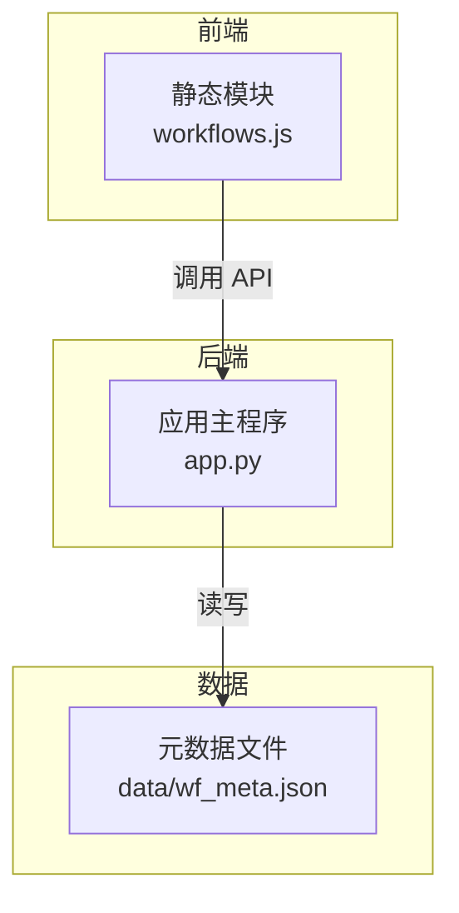
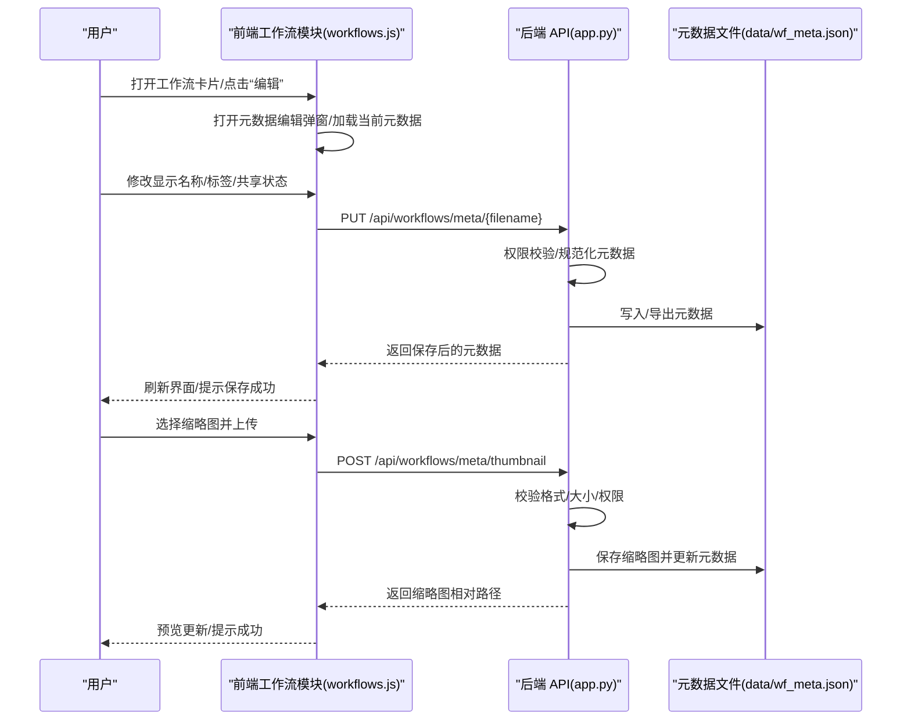
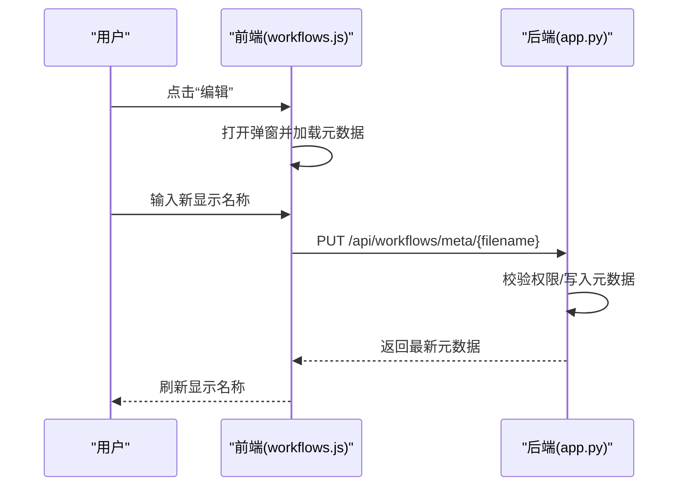
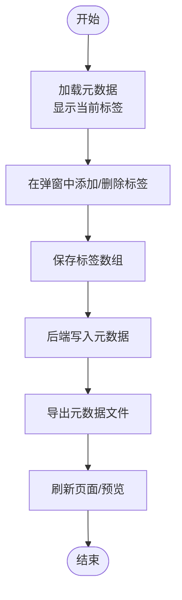
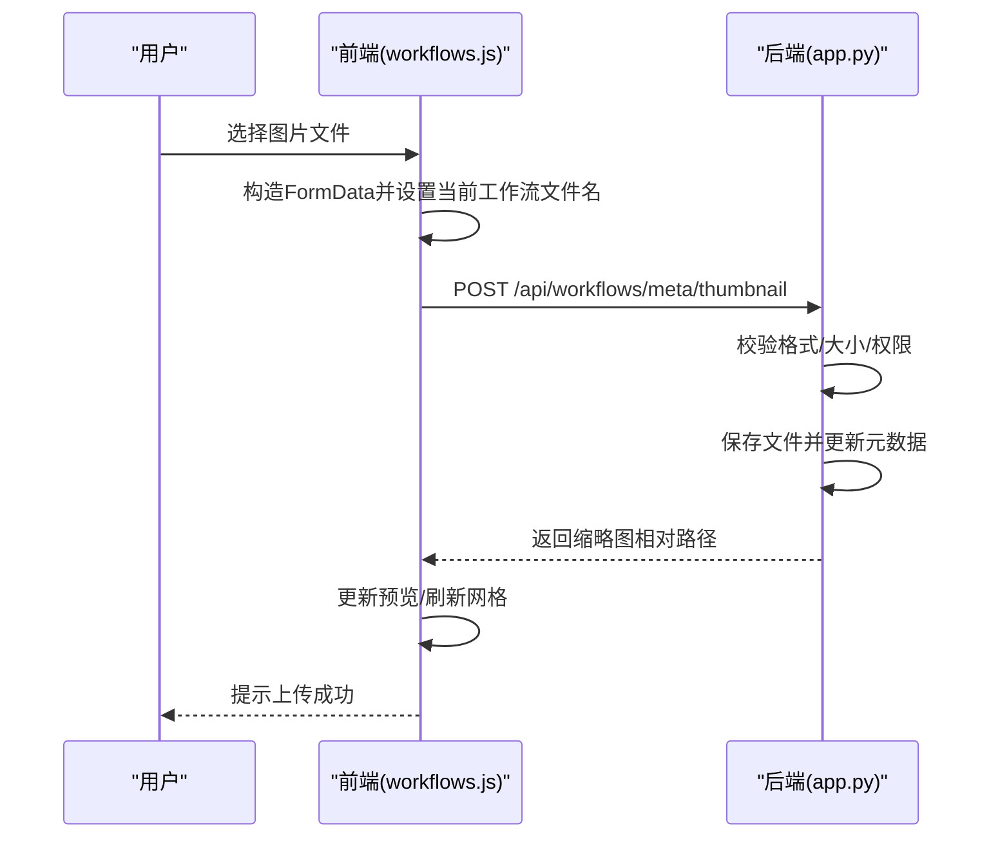

# 工作流元数据管理

<cite>
**本文引用的文件**
- [app.py](file://app.py)
- [workflows.js](file://static/js/modules/workflows.js)
- [wf_meta.json](file://data/wf_meta.json)
- [test_workflow_meta_api.py](file://tests/test_workflow_meta_api.py)
</cite>

## 目录
1. [简介](#简介)
2. [项目结构](#项目结构)
3. [核心组件](#核心组件)
4. [架构总览](#架构总览)
5. [详细组件分析](#详细组件分析)
6. [依赖关系分析](#依赖关系分析)
7. [性能考虑](#性能考虑)
8. [故障排除指南](#故障排除指南)
9. [结论](#结论)
10. [附录](#附录)

## 简介
本指南面向 Ez ComfyUI Showcase 的工作流元数据管理功能，覆盖以下主题：
- 工作流显示名称编辑：打开编辑界面、修改显示名称、保存更改、权限校验
- 标签管理：添加、删除、自动完成、分类显示
- 缩略图上传：选择、上传、预览、清除
- 元数据编辑界面：弹窗打开、字段填写、验证规则、保存与取消
- 权限控制：不同用户角色的访问差异
- 最佳实践：标签命名规范、缩略图尺寸建议、元数据完整性检查
- 常见问题：权限不足、上传失败、标签重复等

## 项目结构
与工作流元数据相关的关键位置：
- 后端接口与业务逻辑位于应用主文件中，提供元数据增删改查、排序、缩略图上传等 API
- 前端模块负责渲染工作流卡片、标签展示、缩略图预览与交互
- 元数据持久化文件用于导出与备份

图表来源
- [workflows.js:1-986](file://static/js/modules/workflows.js#L1-L986)
- [app.py:7165-7251](file://app.py#L7165-L7251)
- [wf_meta.json](file://data/wf_meta.json)

章节来源
- [workflows.js:1-986](file://static/js/modules/workflows.js#L1-L986)
- [app.py:7165-7251](file://app.py#L7165-L7251)
- [wf_meta.json](file://data/wf_meta.json)

## 核心组件
- 元数据编辑与管理 API（后端）
  - 更新元数据：PUT /api/workflows/meta/{filename}
  - 删除元数据：DELETE /api/workflows/meta/{filename}
  - 排序元数据：POST /api/workflows/meta/sort
  - 上传缩略图：POST /api/workflows/meta/thumbnail
- 前端工作流模块（前端）
  - 渲染工作流卡片与标签
  - 触发元数据编辑弹窗
  - 处理缩略图上传与预览
  - 读取与展示元数据

章节来源
- [app.py:7165-7251](file://app.py#L7165-L7251)
- [workflows.js:1-986](file://static/js/modules/workflows.js#L1-L986)

## 架构总览
下图展示了从用户操作到后端处理与数据持久化的整体流程。

图表来源
- [app.py:7165-7251](file://app.py#L7165-L7251)
- [workflows.js:241-270](file://static/js/modules/workflows.js#L241-L270)
- [wf_meta.json](file://data/wf_meta.json)

## 详细组件分析

### 工作流显示名称编辑
- 打开编辑界面
  - 在工作流卡片中点击“编辑”按钮，前端会打开元数据编辑弹窗，并加载目标工作流的当前元数据
  - 显示名称优先使用自定义名称，否则回退为文件名（去除扩展名）
- 修改显示名称
  - 在弹窗中输入新的显示名称，前端将名称字段提交至后端
- 保存更改
  - 后端接收 PUT 请求，进行权限校验与元数据规范化，然后写入元数据文件并导出
- 权限验证
  - 仅管理员或工作流所有者可编辑；若无权限，后端返回禁止访问错误

图表来源
- [workflows.js:508-541](file://static/js/modules/workflows.js#L508-L541)
- [app.py:7195-7217](file://app.py#L7195-L7217)

章节来源
- [workflows.js:508-541](file://static/js/modules/workflows.js#L508-L541)
- [app.py:7195-7217](file://app.py#L7195-L7217)

### 工作流标签管理
- 添加标签
  - 在编辑弹窗中输入新标签并保存；后端接收标签数组并写入元数据
- 删除标签
  - 从前端弹窗移除对应标签后保存；后端更新元数据
- 标签自动完成
  - 前端根据已有标签集合提供基础的去重与提示能力（基于现有实现，具体自动完成逻辑以实际 UI 为准）
- 标签分类显示
  - 前端会从元数据中提取主标签并生成分类标签，用于页面分组与筛选

图表来源
- [workflows.js:516-518](file://static/js/modules/workflows.js#L516-L518)
- [app.py:7195-7217](file://app.py#L7195-L7217)
- [wf_meta.json](file://data/wf_meta.json)

章节来源
- [workflows.js:516-518](file://static/js/modules/workflows.js#L516-L518)
- [app.py:7195-7217](file://app.py#L7195-L7217)
- [wf_meta.json](file://data/wf_meta.json)

### 工作流缩略图上传
- 选择与上传
  - 在缩略图区域点击或拖拽文件，前端构造表单并调用上传接口
- 预览与清除
  - 上传成功后，前端更新缩略图缓存戳并刷新预览；支持清除旧缩略图（由后端迁移逻辑保证路径正确）
- 后端限制
  - 仅允许指定图片格式与大小上限；必须具备工作流管理权限

图表来源
- [workflows.js:241-270](file://static/js/modules/workflows.js#L241-L270)
- [app.py:7232-7251](file://app.py#L7232-L7251)

章节来源
- [workflows.js:241-270](file://static/js/modules/workflows.js#L241-L270)
- [app.py:7232-7251](file://app.py#L7232-L7251)

### 元数据编辑界面使用方法
- 打开编辑弹窗
  - 点击工作流卡片上的“编辑”按钮，弹窗加载当前元数据（名称、标签、共享状态、排序等）
- 字段填写与验证
  - 显示名称：非空时优先使用；为空则回退为文件名
  - 标签：数组类型；重复项由前端去重或后端规范化处理
  - 共享状态：仅管理员可修改
  - 排序：通过排序接口批量更新
- 保存与取消
  - 保存：提交后端并刷新界面
  - 取消：关闭弹窗不提交

章节来源
- [workflows.js:508-541](file://static/js/modules/workflows.js#L508-L541)
- [app.py:7165-7217](file://app.py#L7165-L7217)

### 权限控制说明
- 管理员
  - 可编辑任意工作流元数据、设置共享状态、调整排序
- 工作流所有者
  - 可编辑自己的工作流元数据、上传缩略图
- 普通用户
  - 仅可查看，不可编辑或上传

章节来源
- [app.py:7195-7217](file://app.py#L7195-L7217)
- [app.py:7232-7251](file://app.py#L7232-L7251)

### 最佳实践
- 标签命名规范
  - 使用简洁、统一的语义化标签；避免重复与歧义
  - 建议按用途/模型/风格等维度分类
- 缩略图尺寸与格式
  - 推荐正方形缩略图，尺寸适中以便快速浏览
  - 支持格式：PNG、JPG、JPEG、WEBP、BMP
- 元数据完整性检查
  - 定期导出与备份元数据文件
  - 对缺失或异常字段进行清理与修复

章节来源
- [app.py:7232-7251](file://app.py#L7232-L7251)
- [wf_meta.json](file://data/wf_meta.json)

## 依赖关系分析
- 前端依赖后端 API 提供的元数据读写与缩略图上传能力
- 后端依赖元数据文件进行持久化存储与导出
- 权限控制贯穿所有写操作，确保安全

图表来源
- [workflows.js:1-986](file://static/js/modules/workflows.js#L1-L986)
- [app.py:7165-7251](file://app.py#L7165-L7251)
- [wf_meta.json](file://data/wf_meta.json)

章节来源
- [workflows.js:1-986](file://static/js/modules/workflows.js#L1-L986)
- [app.py:7165-7251](file://app.py#L7165-L7251)
- [wf_meta.json](file://data/wf_meta.json)

## 性能考虑
- 缩略图上传采用分块读取与大小限制，避免大文件导致内存压力
- 元数据批量导出与写入需注意 I/O 开销，建议在后台任务中执行
- 前端缩略图缓存戳用于强制刷新，减少不必要的重复请求

章节来源
- [app.py:7232-7251](file://app.py#L7232-L7251)

## 故障排除指南
- 编辑权限不足
  - 现象：保存时报错或被拒绝
  - 处理：确认当前用户是否为管理员或工作流所有者
- 缩略图上传失败
  - 现象：上传后无响应或报错
  - 处理：检查文件格式与大小限制；确认具备管理权限；刷新页面后重试
- 标签重复或无效
  - 现象：标签列表异常或显示重复
  - 处理：在弹窗中清理重复项并重新保存；必要时手动修复元数据文件
- 共享状态无法修改
  - 现象：尝试设置共享失败
  - 处理：仅管理员可修改共享状态，请联系管理员

章节来源
- [app.py:7195-7217](file://app.py#L7195-L7217)
- [app.py:7232-7251](file://app.py#L7232-L7251)
- [test_workflow_meta_api.py:1-38](file://tests/test_workflow_meta_api.py#L1-L38)

## 结论
Ez ComfyUI Showcase 的工作流元数据管理提供了完善的编辑、标签与缩略图能力，并通过严格的权限控制保障安全性。遵循本文的操作流程与最佳实践，可高效地维护工作流元数据，提升团队协作效率与内容组织质量。

## 附录
- 相关测试用例参考：工作流元数据 API 测试，验证了基本的 CRUD 行为与权限控制

章节来源
- [test_workflow_meta_api.py:1-38](file://tests/test_workflow_meta_api.py#L1-L38)