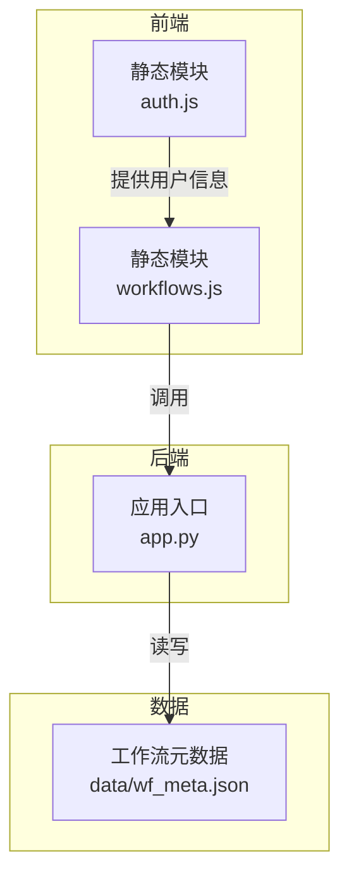
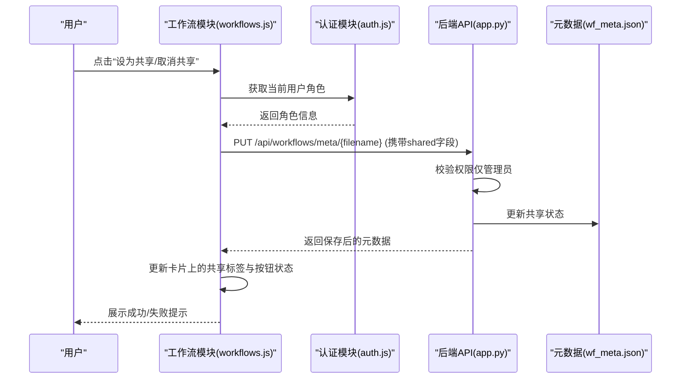
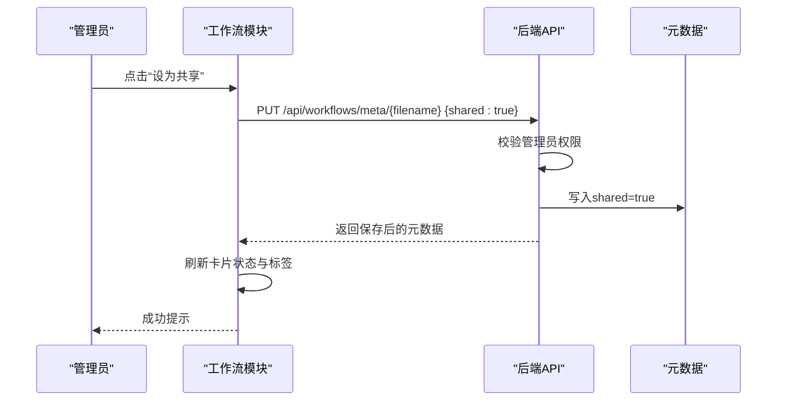
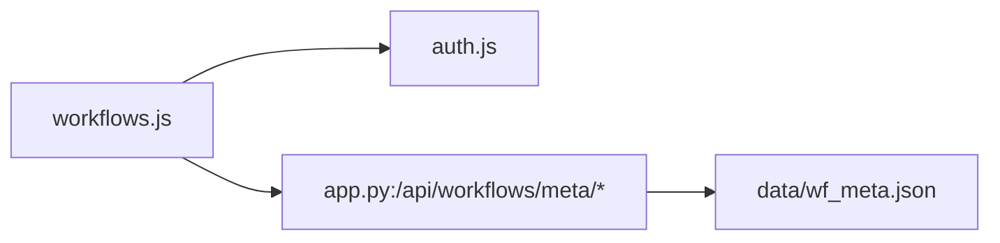

# 工作流共享控制

<cite>
**本文档引用的文件**
- [workflows.js](file://static/js/modules/workflows.js)
- [auth.js](file://static/js/modules/auth.js)
- [app.py](file://app.py)
- [wf_meta.json](file://data/wf_meta.json)
</cite>

## 目录
1. [简介](#简介)
2. [项目结构](#项目结构)
3. [核心组件](#核心组件)
4. [架构总览](#架构总览)
5. [详细组件分析](#详细组件分析)
6. [依赖关系分析](#依赖关系分析)
7. [性能考量](#性能考量)
8. [故障排除指南](#故障排除指南)
9. [结论](#结论)

## 简介
本指南面向 Ez ComfyUI Showcase 的“工作流共享控制”功能，帮助用户与管理员理解并正确使用工作流的共享状态查看、共享/取消共享操作、权限控制机制以及共享工作流的使用方式。文档同时涵盖安全注意事项与常见问题排查。

## 项目结构
工作流共享控制涉及前端模块与后端 API 的协同：
- 前端工作流模块负责渲染共享状态、触发共享切换、更新界面状态
- 认证模块提供用户身份信息与角色判断
- 后端 API 提供工作流元数据读写、共享状态变更与权限校验

图表来源
- [workflows.js](file://static/js/modules/workflows.js)
- [auth.js](file://static/js/modules/auth.js)
- [app.py](file://app.py)
- [wf_meta.json](file://data/wf_meta.json)

章节来源
- [workflows.js](file://static/js/modules/workflows.js)
- [auth.js](file://static/js/modules/auth.js)
- [app.py](file://app.py)
- [wf_meta.json](file://data/wf_meta.json)

## 核心组件
- 工作流管理器（前端）：负责渲染工作流卡片、显示共享标签、共享按钮状态、响应管理员共享/取消共享操作
- 认证模块（前端）：提供当前用户角色（管理员/普通用户），用于控制界面交互与权限判断
- 后端 API：提供工作流元数据读写、共享状态变更、权限校验（仅管理员可更改共享）

章节来源
- [workflows.js](file://static/js/modules/workflows.js)
- [auth.js](file://static/js/modules/auth.js)
- [app.py](file://app.py)

## 架构总览
工作流共享控制的前后端交互流程如下：

图表来源
- [workflows.js](file://static/js/modules/workflows.js)
- [auth.js](file://static/js/modules/auth.js)
- [app.py](file://app.py)
- [wf_meta.json](file://data/wf_meta.json)

## 详细组件分析

### 1) 共享状态查看与视觉提示
- 共享标签显示：在工作流卡片的标签区域展示“共享”标签，用于直观提示该工作流处于共享状态
- 共享按钮状态：按钮根据当前共享状态显示“已共享/未共享”，并带有相应标题与图标
- 权限标识：仅管理员可见并可操作共享按钮；普通用户看到只读状态或隐藏相关按钮

章节来源
- [workflows.js](file://static/js/modules/workflows.js)
- [auth.js](file://static/js/modules/auth.js)

### 2) 将工作流设为共享（管理员操作）
- 权限验证：前端通过认证模块获取当前用户角色，仅管理员可看到并点击共享按钮
- 操作流程：
  1) 管理员点击“设为共享”
  2) 前端调用后端 API，发送 PUT 请求至 /api/workflows/meta/{filename}，携带 shared=true
  3) 后端校验当前用户是否为管理员，若非管理员则返回权限不足
  4) 后端更新元数据中的 shared 字段，并记录日志
  5) 前端收到响应后更新卡片状态与标签，并给出成功/失败提示

图表来源
- [workflows.js](file://static/js/modules/workflows.js)
- [app.py](file://app.py)
- [wf_meta.json](file://data/wf_meta.json)

章节来源
- [workflows.js](file://static/js/modules/workflows.js)
- [app.py](file://app.py)

### 3) 取消工作流共享（管理员操作）
- 操作流程与设为共享类似，只是 shared=false
- 前端调用相同 API，后端同样进行权限校验与元数据更新
- 前端更新卡片状态与标签，提示操作结果

章节来源
- [workflows.js](file://static/js/modules/workflows.js)
- [app.py](file://app.py)

### 4) 权限控制机制
- 角色要求：仅管理员具备修改工作流共享状态的权限
- 普通用户限制：普通用户无法看到共享按钮或无法发起共享变更请求
- 继承规则：工作流的 owner_id 与归属关系由元数据维护，共享状态独立于所有权，但修改共享需管理员权限

章节来源
- [workflows.js](file://static/js/modules/workflows.js)
- [auth.js](file://static/js/modules/auth.js)
- [app.py](file://app.py)
- [wf_meta.json](file://data/wf_meta.json)

### 5) 共享工作流的使用说明
- 发现：共享工作流会在工作流列表中以“共享”标签标识，便于筛选与查找
- 使用：普通用户可直接下载与使用共享工作流，无需管理员授权
- 引用：共享工作流的来源与排序等元信息由元数据维护，便于追溯与组织

章节来源
- [workflows.js](file://static/js/modules/workflows.js)
- [wf_meta.json](file://data/wf_meta.json)

### 6) 安全考虑
- 共享范围控制：共享状态仅影响工作流的可见与可使用性，不改变其所属关系
- 访问权限管理：共享状态变更严格限制为管理员操作，避免误用或滥用
- 内容审核：建议建立内容审核流程，确保共享工作流符合平台规范
- 日志审计：后端对共享状态变更进行日志记录，便于审计与追踪

章节来源
- [app.py](file://app.py)

## 依赖关系分析
- 前端依赖
  - workflows.js 依赖认证模块提供的用户角色信息，以决定是否显示共享按钮与允许何种操作
  - workflows.js 通过统一的 API 访问封装与后端交互
- 后端依赖
  - app.py 的共享状态变更接口依赖权限校验函数，确保仅管理员可更改
  - 元数据持久化依赖 wf_meta.json，保存共享状态与其它工作流属性

图表来源
- [workflows.js](file://static/js/modules/workflows.js)
- [auth.js](file://static/js/modules/auth.js)
- [app.py](file://app.py)
- [wf_meta.json](file://data/wf_meta.json)

章节来源
- [workflows.js](file://static/js/modules/workflows.js)
- [auth.js](file://static/js/modules/auth.js)
- [app.py](file://app.py)
- [wf_meta.json](file://data/wf_meta.json)

## 性能考量
- 前端渲染：共享状态变更后，前端仅更新对应卡片的标签与按钮状态，避免全量重绘
- 后端写入：共享状态变更属于元数据写入，开销较小；建议批量操作时合并请求
- 缓存策略：元数据读取可结合缓存与版本控制，减少频繁 IO

## 故障排除指南
- 共享状态异常
  - 现象：点击共享按钮后状态未更新或闪烁
  - 排查：确认当前用户角色是否为管理员；检查网络请求是否成功；查看前端提示与浏览器控制台错误
- 权限问题
  - 现象：看不到共享按钮或提示权限不足
  - 排查：确认登录状态与角色；确保当前用户具备管理员权限；检查后端权限校验逻辑
- 访问受限
  - 现象：无法下载或使用共享工作流
  - 排查：确认工作流文件是否存在且可访问；检查后端路由与文件路径映射
- 数据不同步
  - 现象：页面显示与实际共享状态不一致
  - 排查：刷新页面重新加载元数据；检查元数据文件是否被正确写入与导出

章节来源
- [workflows.js](file://static/js/modules/workflows.js)
- [auth.js](file://static/js/modules/auth.js)
- [app.py](file://app.py)
- [wf_meta.json](file://data/wf_meta.json)

## 结论
工作流共享控制通过严格的管理员权限约束与清晰的前端视觉反馈，实现了对共享状态的可控管理。配合完善的日志与元数据持久化机制，既保障了易用性，也兼顾了安全性与可追溯性。建议在团队内明确管理员职责与审核流程，确保共享工作流的质量与合规。