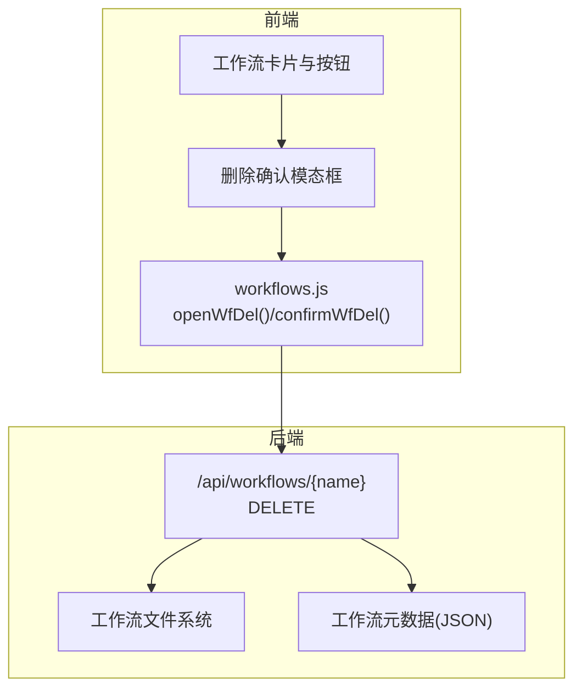
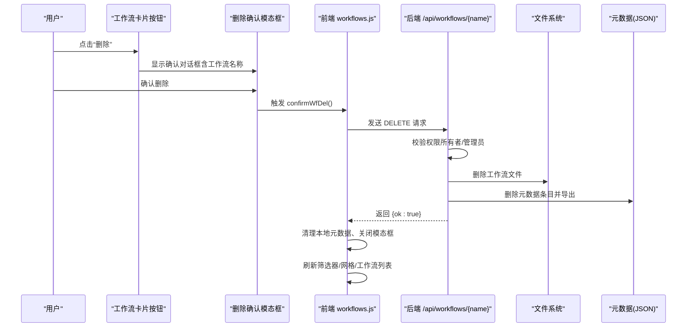
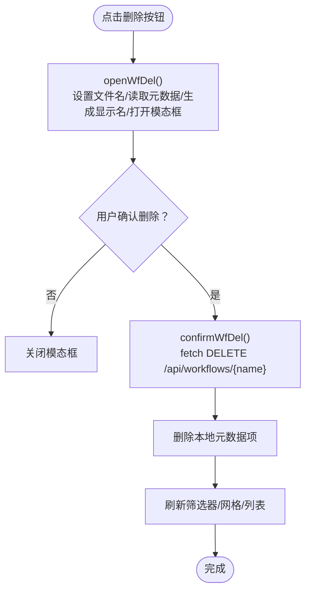
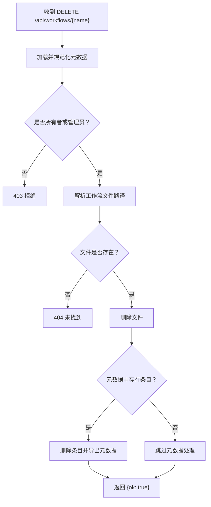
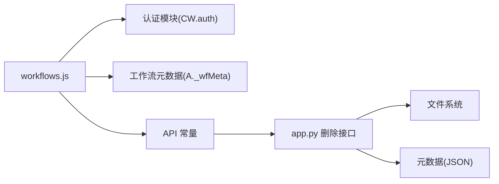

# 工作流删除操作

<cite>
**本文引用的文件**
- [workflows.js](file://static/js/modules/workflows.js)
- [app.py](file://app.py)
- [index.html](file://static/index.html)
</cite>

## 目录
1. [简介](#简介)
2. [项目结构](#项目结构)
3. [核心组件](#核心组件)
4. [架构总览](#架构总览)
5. [详细组件分析](#详细组件分析)
6. [依赖关系分析](#依赖关系分析)
7. [性能考量](#性能考量)
8. [故障排除指南](#故障排除指南)
9. [结论](#结论)

## 简介
本指南面向 Ez ComfyUI Showcase 的“工作流删除”功能，提供从用户交互到后端处理的完整使用与技术说明。内容涵盖：
- 删除触发方式：删除按钮点击、确认对话框、删除执行流程
- 删除前确认机制：工作流名称展示、不可撤销提示、确认动作
- 权限要求：所有者验证、管理员权限、删除权限检查
- 执行过程：前端请求、后端鉴权与文件删除、元数据清理、界面刷新
- 删除后果：文件删除、元数据清理、历史记录影响
- 安全考虑：误删防护、恢复难度、备份建议
- 故障排除：权限不足、文件不存在、网络异常等

## 项目结构
与工作流删除直接相关的前端与后端模块如下：
- 前端工作流管理模块：负责 UI 交互、确认对话框、调用删除 API、刷新界面
- 后端 API：接收删除请求、进行权限校验、删除文件与元数据、返回结果

图表来源
- [workflows.js](file://static/js/modules/workflows.js)
- [app.py](file://app.py)

章节来源
- [workflows.js](file://static/js/modules/workflows.js)
- [app.py](file://app.py)

## 核心组件
- 前端确认与调用
  - 打开删除确认：根据当前工作流元数据生成显示名称，设置提示文案并打开模态框
  - 确认删除：向后端发起 DELETE 请求，成功后清理本地元数据、关闭模态框、刷新网格与筛选器、重新加载工作流列表
- 后端删除接口
  - 权限校验：仅允许所有者或管理员删除
  - 文件删除：定位工作流文件并删除
  - 元数据清理：若存在元数据条目则删除并导出最新元数据
  - 返回响应：返回成功标识

章节来源
- [workflows.js](file://static/js/modules/workflows.js)
- [app.py](file://app.py)

## 架构总览
下图展示了从用户点击到删除完成的端到端流程。

图表来源
- [workflows.js](file://static/js/modules/workflows.js)
- [app.py](file://app.py)

## 详细组件分析

### 前端：删除确认与执行
- 打开删除确认
  - 设置待删除文件名
  - 读取元数据，计算显示名称
  - 更新模态框提示文本
  - 打开模态框
- 确认删除
  - 发起 DELETE 请求至后端
  - 成功后从本地元数据中移除该项
  - 关闭模态框
  - 刷新筛选器标签、网格、工作流列表
  - 重新拉取工作流数据

图表来源
- [workflows.js](file://static/js/modules/workflows.js)

章节来源
- [workflows.js](file://static/js/modules/workflows.js)

### 后端：删除接口与权限控制
- 接口路径：DELETE /api/workflows/{name}
- 权限校验：
  - 需要登录用户
  - 仅允许所有者或管理员
- 处理逻辑：
  - 加载并规范化元数据条目
  - 解析工作流文件路径
  - 若文件不存在，返回 404
  - 删除文件
  - 若存在元数据，删除条目并导出最新元数据
  - 返回 {ok: true}

图表来源
- [app.py](file://app.py)

章节来源
- [app.py](file://app.py)

### 权限要求与验证机制
- 用户身份来源：前端通过认证模块获取当前用户；后端通过依赖注入获取当前用户
- 权限判定：
  - 管理员：拥有最高权限
  - 所有者：工作流元数据中 owner_id 与当前用户 ID 匹配
- 删除权限检查：
  - 前端在渲染卡片时根据 canManage 决定是否显示删除按钮
  - 后端在接口层再次校验，拒绝无权限请求

章节来源
- [workflows.js](file://static/js/modules/workflows.js)
- [app.py](file://app.py)

### 删除后的界面与数据更新
- 本地状态更新：
  - 从本地元数据映射中移除被删除项
- 界面刷新：
  - 重新渲染筛选器标签
  - 重新渲染工作流网格
  - 重新加载工作流列表
- 历史记录影响：
  - 历史任务中关联该工作流的记录仍可查看，但无法再对该工作流执行删除操作

章节来源
- [workflows.js](file://static/js/modules/workflows.js)

## 依赖关系分析
- 前端依赖
  - workflows.js 依赖认证模块以获取当前用户身份
  - workflows.js 依赖工作流元数据以生成显示名称与判断权限
  - workflows.js 依赖全局常量 API 以拼接后端接口地址
- 后端依赖
  - app.py 的删除接口依赖用户认证中间件与权限辅助函数
  - 删除接口依赖工作流元数据读写与文件系统操作

图表来源
- [workflows.js](file://static/js/modules/workflows.js)
- [app.py](file://app.py)

章节来源
- [workflows.js](file://static/js/modules/workflows.js)
- [app.py](file://app.py)

## 性能考量
- 前端
  - 删除操作为轻量级请求，主要耗时在 UI 刷新与重新加载
  - 本地元数据清理避免了额外的网络往返
- 后端
  - 文件删除与元数据清理均为 O(1) 操作
  - 无复杂索引扫描，删除接口响应迅速

## 故障排除指南
- 删除失败（403 无权限）
  - 检查当前用户是否为管理员或工作流所有者
  - 确认工作流元数据中的 owner_id 是否正确
- 删除失败（404 未找到）
  - 检查工作流文件是否存在于工作流目录
  - 确认文件名与请求路径一致
- 网络异常或超时
  - 检查前端 API 常量与后端服务连通性
  - 查看浏览器开发者工具 Network 面板
- 界面未刷新
  - 确认前端删除成功后是否调用了刷新函数
  - 检查本地元数据映射是否已移除对应项
- 历史记录仍可见
  - 属于正常行为，历史记录不随工作流删除而自动清理

章节来源
- [workflows.js](file://static/js/modules/workflows.js)
- [app.py](file://app.py)

## 结论
工作流删除功能在前端与后端均实现了清晰的权限控制与确认机制。前端通过模态框与显示名称强化用户确认，后端严格校验删除权限并执行文件与元数据清理。删除操作不可逆，建议在执行前做好备份与确认，确保不会误删重要工作流。