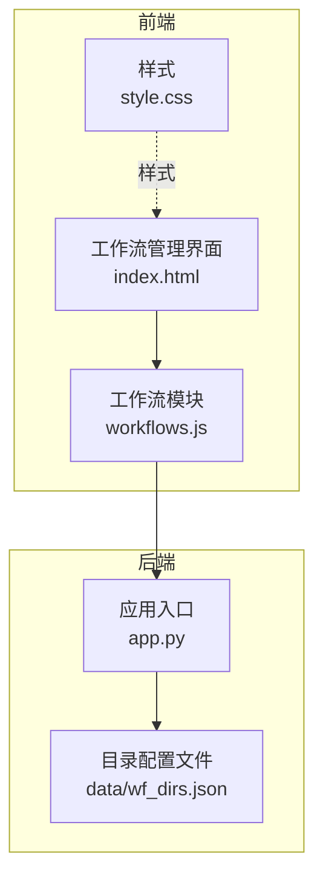
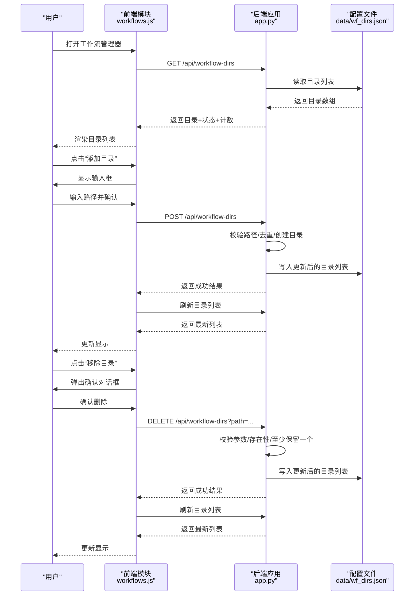
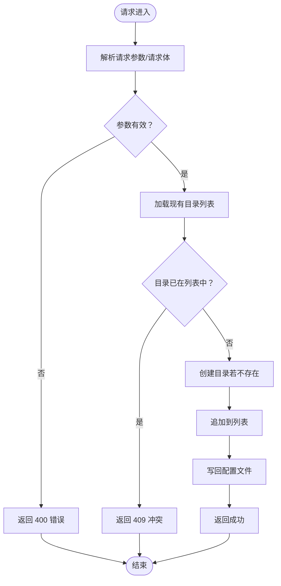
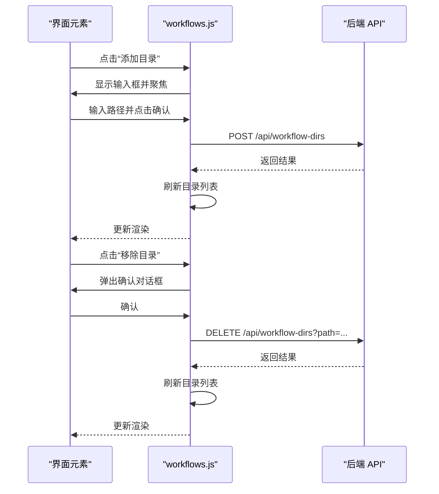
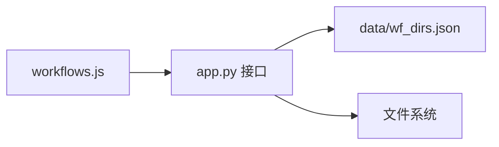

# 工作流目录管理

<cite>
**本文引用的文件**
- [app.py](file://app.py)
- [workflows.js](file://static/js/modules/workflows.js)
- [style.css](file://static/css/style.css)
- [index.html](file://static/index.html)
- [wf_dirs.json](file://data/wf_dirs.json)
</cite>

## 目录
1. [简介](#简介)
2. [项目结构](#项目结构)
3. [核心组件](#核心组件)
4. [架构总览](#架构总览)
5. [详细组件分析](#详细组件分析)
6. [依赖关系分析](#依赖关系分析)
7. [性能考量](#性能考量)
8. [故障排查指南](#故障排查指南)
9. [结论](#结论)
10. [附录](#附录)

## 简介
本指南面向 Ez ComfyUI Showcase 的“工作流目录管理”功能，帮助管理员与使用者完成以下目标：
- 添加新的工作流目录：输入路径、路径有效性校验、确认添加流程
- 查看与管理现有目录：目录列表、存在性检查、工作流数量统计
- 移除工作流目录：确认对话框、权限校验、删除操作
- 路径有效性验证机制：格式检查、目录存在性、权限控制
- 最佳实践：目录结构建议、命名规范、权限配置
- 常见问题与解决方案：无法添加、路径无效、权限不足等

## 项目结构
工作流目录管理由后端 API 与前端模块协同实现：
- 后端通过 Flask 提供 REST 接口，负责目录持久化与校验
- 前端 JavaScript 模块负责 UI 展示、交互与调用后端接口
- 配置文件用于持久化目录列表

图表来源
- [index.html:68-87](file://static/index.html#L68-L87)
- [workflows.js:646-672](file://static/js/modules/workflows.js#L646-L672)
- [app.py:6797-6835](file://app.py#L6797-L6835)
- [wf_dirs.json](file://data/wf_dirs.json)

章节来源
- [index.html:68-87](file://static/index.html#L68-L87)
- [workflows.js:646-672](file://static/js/modules/workflows.js#L646-L672)
- [app.py:6797-6835](file://app.py#L6797-L6835)

## 核心组件
- 后端 API
  - 获取目录列表：GET /api/workflow-dirs
  - 添加目录：POST /api/workflow-dirs
  - 删除目录：DELETE /api/workflow-dirs
- 前端模块
  - 加载目录列表：loadWfDirs
  - 显示/隐藏新增区域：showAddDir/hideAddDir
  - 新增目录：addWfDir
  - 删除目录：removeWfDir
- 配置文件
  - 目录列表持久化：data/wf_dirs.json

章节来源
- [app.py:6797-6835](file://app.py#L6797-L6835)
- [workflows.js:607-628](file://static/js/modules/workflows.js#L607-L628)
- [workflows.js:592-605](file://static/js/modules/workflows.js#L592-L605)
- [workflows.js:646-672](file://static/js/modules/workflows.js#L646-L672)
- [wf_dirs.json](file://data/wf_dirs.json)

## 架构总览
下图展示了“添加/删除/查看”目录的端到端流程。

图表来源
- [workflows.js:607-628](file://static/js/modules/workflows.js#L607-L628)
- [workflows.js:592-605](file://static/js/modules/workflows.js#L592-L605)
- [workflows.js:646-672](file://static/js/modules/workflows.js#L646-L672)
- [app.py:6797-6835](file://app.py#L6797-L6835)
- [wf_dirs.json](file://data/wf_dirs.json)

## 详细组件分析

### 后端 API 设计
- GET /api/workflow-dirs
  - 功能：返回当前所有工作流目录的状态与统计
  - 输出字段：path（目录绝对路径）、exists（是否存在）、count（该目录下 .json 数量）
  - 权限：需要管理员身份
- POST /api/workflow-dirs
  - 请求体：{ path: "..." }
  - 处理逻辑：
    - 去除空白并展开用户路径
    - 绝对化路径
    - 检查是否已存在
    - 自动创建目录
    - 追加到列表并持久化
  - 权限：需要管理员身份
- DELETE /api/workflow-dirs
  - 查询参数：path
  - 处理逻辑：
    - 去除空白
    - 校验是否存在
    - 保证至少保留一个目录
    - 从列表移除并持久化
  - 权限：需要管理员身份

图表来源
- [app.py:6807-6820](file://app.py#L6807-L6820)
- [app.py:6823-6835](file://app.py#L6823-L6835)
- [app.py:7046-7062](file://app.py#L7046-L7062)

章节来源
- [app.py:6797-6835](file://app.py#L6797-L6835)
- [app.py:7046-7062](file://app.py#L7046-L7062)

### 前端交互设计
- 目录列表渲染
  - 通过 loadWfDirs 从后端拉取数据，渲染每个目录项
  - 若目录存在，显示“工作流数量”；否则显示“不存在”提示
  - 当目录数量大于 1 时，显示“移除”按钮
- 新增目录
  - showAddDir/hideAddDir 控制输入区域显隐
  - addWfDir 发起 POST 请求，处理错误并刷新列表
- 删除目录
  - removeWfDir 先弹窗确认，再发起 DELETE 请求，处理错误并刷新列表

图表来源
- [workflows.js:607-628](file://static/js/modules/workflows.js#L607-L628)
- [workflows.js:592-605](file://static/js/modules/workflows.js#L592-L605)
- [workflows.js:646-672](file://static/js/modules/workflows.js#L646-L672)

章节来源
- [workflows.js:607-628](file://static/js/modules/workflows.js#L607-L628)
- [workflows.js:592-605](file://static/js/modules/workflows.js#L592-L605)
- [workflows.js:646-672](file://static/js/modules/workflows.js#L646-L672)

### 目录持久化与默认行为
- 默认目录
  - 若配置文件不存在或为空，系统会以 WORKFLOW_DIR 作为唯一目录
- 配置文件
  - 使用 data/wf_dirs.json 存储目录列表
  - 读写均进行目录创建与安全检查

章节来源
- [app.py:7046-7062](file://app.py#L7046-L7062)
- [wf_dirs.json](file://data/wf_dirs.json)

### 权限与安全
- 管理员权限
  - 所有目录管理操作均需管理员身份
  - 后端通过 require_admin 校验
- 路径安全
  - 后端对路径进行展开、绝对化处理，避免相对路径逃逸
  - 列表统计使用递归匹配，确保仅统计 .json 文件

章节来源
- [app.py:2617-2621](file://app.py#L2617-L2621)
- [app.py:6807-6820](file://app.py#L6807-L6820)
- [app.py:6797-6804](file://app.py#L6797-L6804)

## 依赖关系分析
- 前端依赖后端 API 提供的数据与状态
- 后端依赖配置文件进行目录持久化
- 目录统计依赖文件系统遍历

图表来源
- [workflows.js:646-672](file://static/js/modules/workflows.js#L646-L672)
- [app.py:6797-6804](file://app.py#L6797-L6804)
- [app.py:7046-7062](file://app.py#L7046-L7062)

章节来源
- [workflows.js:646-672](file://static/js/modules/workflows.js#L646-L672)
- [app.py:6797-6804](file://app.py#L6797-L6804)
- [app.py:7046-7062](file://app.py#L7046-L7062)

## 性能考量
- 目录统计采用递归扫描，当目录层级深或文件数量大时可能产生额外 IO 开销
- 建议：
  - 控制单个目录下的文件数量，必要时按主题分目录
  - 避免在根目录放置过多文件
  - 定期清理无效或重复的工作流文件

## 故障排查指南
- 无法添加目录
  - 现象：弹出“添加失败”
  - 可能原因与处理：
    - 路径为空：检查输入框是否留空
    - 路径已存在：确认是否重复添加同一目录
    - 权限不足：确认当前登录用户具备管理员权限
- 路径无效
  - 现象：后端返回 400
  - 可能原因与处理：
    - 路径包含非法字符或不被允许的相对路径
    - 解决：使用绝对路径或可展开的用户路径（如 ~），确保路径合法
- 权限不足
  - 现象：后端返回 403
  - 可能原因与处理：
    - 当前用户非管理员
    - 解决：使用管理员账户登录后再试
- 无法移除目录
  - 现象：后端返回 400 或 404
  - 可能原因与处理：
    - 传入路径为空：检查查询参数
    - 目录不存在：确认路径拼写正确
    - 至少保留一个目录：至少保留一个目录，先添加新目录再删除旧目录
- 目录显示“不存在”
  - 现象：目录项显示“不存在”
  - 可能原因与处理：
    - 目录被外部删除或移动
    - 解决：恢复目录或重新添加

章节来源
- [workflows.js:607-628](file://static/js/modules/workflows.js#L607-L628)
- [workflows.js:592-605](file://static/js/modules/workflows.js#L592-L605)
- [app.py:6807-6835](file://app.py#L6807-L6835)

## 结论
工作流目录管理通过前后端协作实现了“查看—添加—删除”的完整闭环。后端提供严格的权限控制与路径安全校验，前端提供直观的交互与即时反馈。遵循本文最佳实践与故障排查建议，可稳定高效地维护工作流目录集合。

## 附录

### 使用步骤详解

- 添加新的工作流目录
  1) 在工作流管理器中打开“目录管理”界面
  2) 点击“添加目录”，输入目录路径（支持 ~ 展开与绝对路径）
  3) 确认提交，系统自动创建目录并写入配置
  4) 刷新后可在列表中看到新增目录及其工作流数量
  5) 如遇失败，请根据错误提示检查路径合法性与管理员权限

- 查看与管理现有目录
  - 列表显示：每个条目包含路径、存在性状态与工作流数量
  - 存在性检查：若目录不存在，会提示“不存在”
  - 工作流数量统计：递归统计该目录下 .json 文件数量

- 移除工作流目录
  1) 在目录列表中点击“移除”按钮
  2) 弹窗确认后执行删除
  3) 系统确保至少保留一个目录
  4) 刷新后列表更新

- 目录路径有效性验证机制
  - 路径格式：去除首尾空白，展开用户路径，转换为绝对路径
  - 目录存在性：检查目录是否存在，不存在则标记为“不存在”
  - 权限检查：仅管理员可执行添加/删除
  - 列表去重：防止重复添加同一目录

- 最佳实践
  - 目录结构建议：按主题或项目划分子目录，避免单目录过大
  - 路径命名规范：使用清晰易懂的英文或拼音命名，避免特殊字符
  - 权限配置：仅授予管理员必要的访问权限
  - 定期维护：清理无效或重复文件，保持目录整洁

章节来源
- [workflows.js:607-628](file://static/js/modules/workflows.js#L607-L628)
- [workflows.js:592-605](file://static/js/modules/workflows.js#L592-L605)
- [workflows.js:646-672](file://static/js/modules/workflows.js#L646-L672)
- [app.py:6797-6835](file://app.py#L6797-L6835)