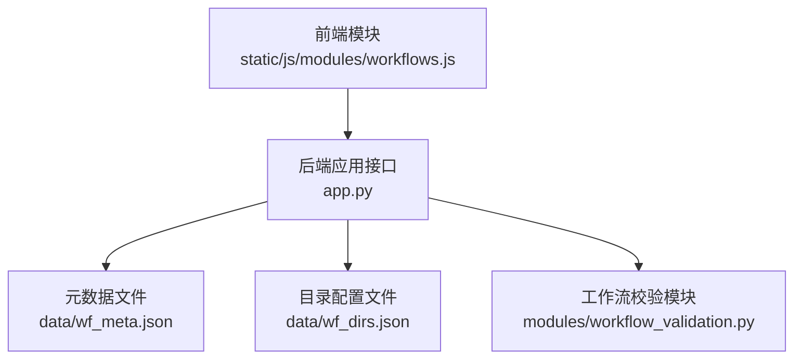
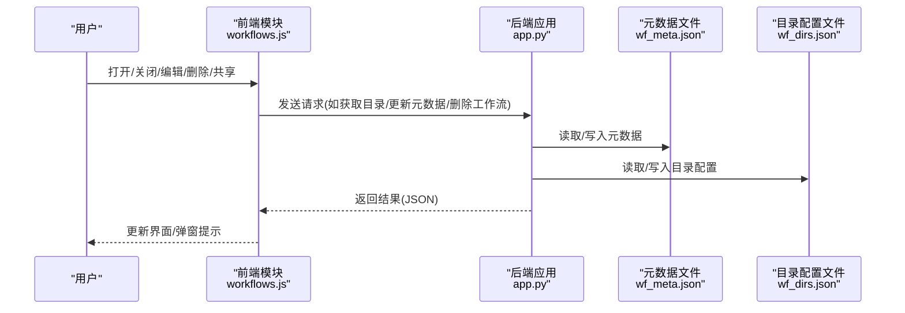
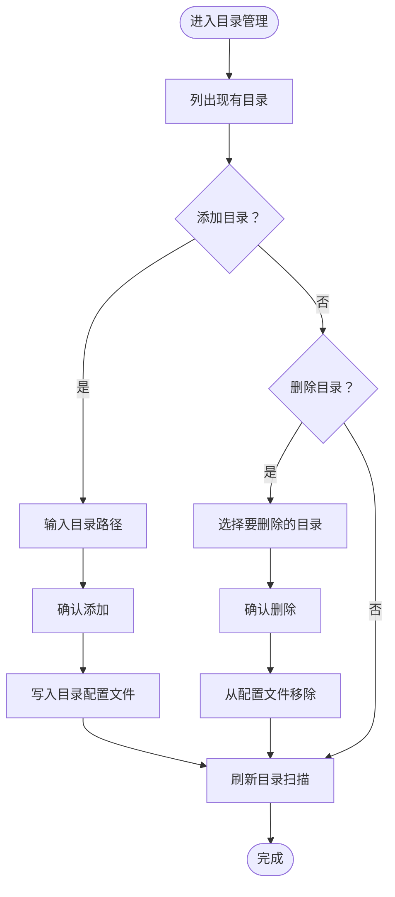
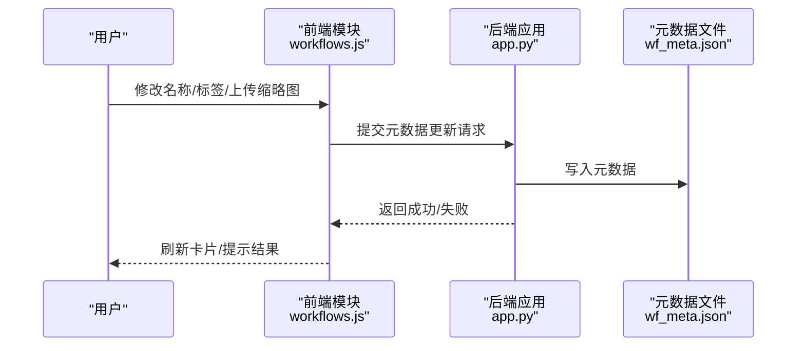
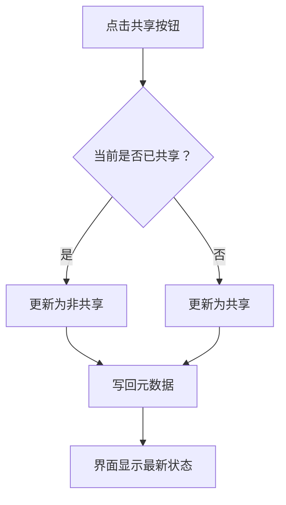
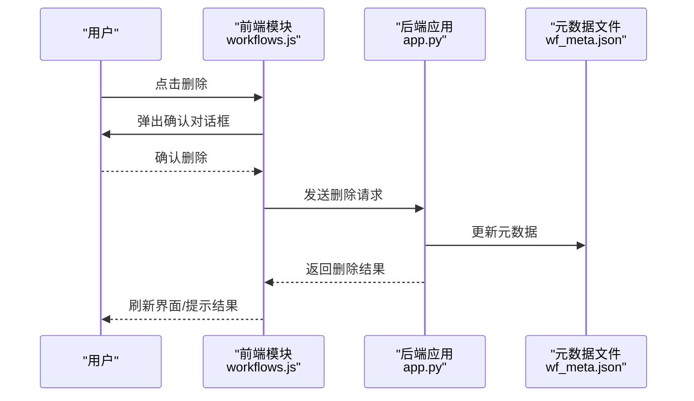
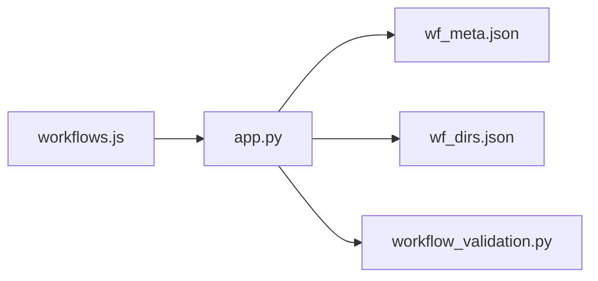

# 工作流管理器

<cite>
**本文引用的文件**
- [workflows.js](file://static/js/modules/workflows.js)
- [wf_meta.json](file://data/wf_meta.json)
- [wf_dirs.json](file://data/wf_dirs.json)
- [workflow_validation.py](file://modules/workflow_validation.py)
- [test_workflow_manager_ui.py](file://tests/test_workflow_manager_ui.py)
- [test_workflow_meta_api.py](file://tests/test_workflow_meta_api.py)
- [app.py](file://app.py)
- [index.html](file://static/index.html)
</cite>

## 目录
1. [简介](#简介)
2. [项目结构](#项目结构)
3. [核心组件](#核心组件)
4. [架构总览](#架构总览)
5. [详细组件分析](#详细组件分析)
6. [依赖关系分析](#依赖关系分析)
7. [性能考虑](#性能考虑)
8. [故障排查指南](#故障排查指南)
9. [结论](#结论)
10. [附录](#附录)

## 简介
本指南面向 Ez ComfyUI Showcase 的工作流管理器，围绕以下目标展开：打开与关闭工作流管理器（快捷键与界面按钮）、工作流目录管理（添加/删除/查看）、工作流元数据管理（名称编辑、标签管理、缩略图上传）、工作流共享功能（设为共享/取消共享及状态显示）、工作流删除流程（确认对话框与界面更新）、权限控制说明、实际操作示例与注意事项，帮助管理员高效管理大量工作流。

## 项目结构
工作流管理器由前端模块、后端应用与数据文件共同构成：
- 前端模块：负责 UI 展示、交互事件绑定、与后端 API 通信
- 后端应用：提供工作流相关的 API 接口
- 数据文件：存储工作流元数据与目录配置

图表来源
- [workflows.js](file://static/js/modules/workflows.js)
- [app.py](file://app.py)
- [wf_meta.json](file://data/wf_meta.json)
- [wf_dirs.json](file://data/wf_dirs.json)
- [workflow_validation.py](file://modules/workflow_validation.py)

章节来源
- [workflows.js](file://static/js/modules/workflows.js)
- [app.py](file://app.py)
- [wf_meta.json](file://data/wf_meta.json)
- [wf_dirs.json](file://data/wf_dirs.json)
- [workflow_validation.py](file://modules/workflow_validation.py)

## 核心组件
- 工作流管理器前端模块：负责打开/关闭、目录管理、元数据编辑、共享状态切换、删除确认与界面刷新等交互逻辑
- 元数据与目录持久化：通过 JSON 文件维护工作流元信息与目录列表
- 工作流校验模块：提供工作流有效性校验能力，保障导入/更新的安全性
- 测试用例：覆盖工作流管理器 UI 行为与元数据 API 的正确性

章节来源
- [workflows.js](file://static/js/modules/workflows.js)
- [wf_meta.json](file://data/wf_meta.json)
- [wf_dirs.json](file://data/wf_dirs.json)
- [workflow_validation.py](file://modules/workflow_validation.py)
- [test_workflow_manager_ui.py](file://tests/test_workflow_manager_ui.py)
- [test_workflow_meta_api.py](file://tests/test_workflow_meta_api.py)

## 架构总览
工作流管理器采用“前端模块 + 后端 API + 数据文件”的分层架构。前端模块通过标准 HTTP 请求与后端交互，后端根据请求类型调用相应处理函数，并读写数据文件完成持久化。

图表来源
- [workflows.js](file://static/js/modules/workflows.js)
- [app.py](file://app.py)
- [wf_meta.json](file://data/wf_meta.json)
- [wf_dirs.json](file://data/wf_dirs.json)

## 详细组件分析

### 打开与关闭工作流管理器
- 快捷键：在页面中按下特定组合键可快速打开/关闭工作流管理器
- 界面按钮：页面顶部或侧边栏提供“打开工作流管理器”按钮，点击后显示管理器面板
- 关闭方式：面板右上角“关闭”按钮或再次按快捷键可关闭

章节来源
- [workflows.js](file://static/js/modules/workflows.js)

### 工作流目录管理
- 查看目录：打开管理器后，左侧目录树展示当前已配置的工作流目录
- 添加目录：在管理器中选择“添加目录”，输入路径并确认；系统会将新目录写入目录配置文件
- 删除目录：选中目录后点击“删除”，系统弹出确认对话框，确认后从配置文件移除该目录
- 目录生效：添加/删除目录后，系统会重新扫描目录中的工作流文件并更新界面

图表来源
- [workflows.js](file://static/js/modules/workflows.js)
- [wf_dirs.json](file://data/wf_dirs.json)

章节来源
- [workflows.js](file://static/js/modules/workflows.js)
- [wf_dirs.json](file://data/wf_dirs.json)

### 工作流元数据管理
- 编辑工作流名称：在工作流卡片中点击名称，进入可编辑状态，保存后更新元数据文件
- 标签管理：支持为工作流添加/移除标签，标签变更后写回元数据文件
- 缩略图上传：支持上传缩略图，系统将图片保存到指定位置并在元数据中标注缩略图路径
- 元数据持久化：所有元数据变更通过后端 API 写入元数据文件

图表来源
- [workflows.js](file://static/js/modules/workflows.js)
- [app.py](file://app.py)
- [wf_meta.json](file://data/wf_meta.json)

章节来源
- [workflows.js](file://static/js/modules/workflows.js)
- [wf_meta.json](file://data/wf_meta.json)
- [test_workflow_meta_api.py](file://tests/test_workflow_meta_api.py)

### 工作流共享功能
- 设为共享：在工作流卡片中点击“设为共享”，系统更新元数据中的共享状态字段
- 取消共享：点击“取消共享”，恢复非共享状态
- 状态显示：共享状态会在工作流卡片上以图标/颜色等方式直观显示
- 权限要求：仅具备相应权限的用户可进行共享状态切换

图表来源
- [workflows.js](file://static/js/modules/workflows.js)
- [wf_meta.json](file://data/wf_meta.json)

章节来源
- [workflows.js](file://static/js/modules/workflows.js)
- [wf_meta.json](file://data/wf_meta.json)

### 工作流删除功能
- 触发删除：在工作流卡片中点击“删除”
- 确认对话框：弹出二次确认对话框，防止误删
- 删除执行：确认后调用后端删除接口，系统同时从磁盘移除工作流文件并更新元数据
- 界面更新：删除成功后，管理器自动刷新列表，移除对应卡片

图表来源
- [workflows.js](file://static/js/modules/workflows.js)
- [app.py](file://app.py)
- [wf_meta.json](file://data/wf_meta.json)

章节来源
- [workflows.js](file://static/js/modules/workflows.js)
- [app.py](file://app.py)
- [wf_meta.json](file://data/wf_meta.json)
- [test_workflow_manager_ui.py](file://tests/test_workflow_manager_ui.py)

### 权限控制说明
- 不同用户角色对工作流管理功能具有不同的访问权限：
  - 管理员：可进行目录管理、元数据编辑、共享状态切换、删除工作流
  - 普通用户：可查看工作流列表与详情，但无法修改或删除
  - 只读用户：仅能浏览，不可编辑或删除
- 权限判断通常在前端进行 UI 控制，在后端进行接口级校验，确保操作安全

章节来源
- [workflows.js](file://static/js/modules/workflows.js)
- [app.py](file://app.py)

### 实际操作示例与注意事项
- 示例一：批量添加目录
  - 步骤：打开管理器 → 点击“添加目录” → 输入多个目录路径 → 确认 → 刷新扫描
  - 注意：路径需存在且包含合法的工作流文件
- 示例二：为工作流设置共享
  - 步骤：定位工作流卡片 → 点击“设为共享” → 在元数据中确认共享状态
  - 注意：共享状态变更会立即反映在界面
- 示例三：删除工作流
  - 步骤：点击“删除” → 弹出确认对话框 → 确认 → 等待界面刷新
  - 注意：删除不可逆，请谨慎操作
- 注意事项
  - 目录变更后建议手动触发一次“刷新扫描”，确保新增工作流被识别
  - 元数据文件较大时，批量编辑可能影响响应速度，建议分批进行
  - 缩略图上传前请确认文件格式与大小符合系统要求

章节来源
- [workflows.js](file://static/js/modules/workflows.js)
- [wf_dirs.json](file://data/wf_dirs.json)
- [wf_meta.json](file://data/wf_meta.json)
- [test_workflow_manager_ui.py](file://tests/test_workflow_manager_ui.py)

## 依赖关系分析
- 前端模块依赖后端 API 提供的数据接口，实现目录与元数据的增删改查
- 后端应用依赖数据文件完成持久化，同时调用工作流校验模块保证数据合法性
- 测试用例覆盖 UI 行为与 API 正确性，确保功能稳定

图表来源
- [workflows.js](file://static/js/modules/workflows.js)
- [app.py](file://app.py)
- [wf_meta.json](file://data/wf_meta.json)
- [wf_dirs.json](file://data/wf_dirs.json)
- [workflow_validation.py](file://modules/workflow_validation.py)

章节来源
- [workflows.js](file://static/js/modules/workflows.js)
- [app.py](file://app.py)
- [wf_meta.json](file://data/wf_meta.json)
- [wf_dirs.json](file://data/wf_dirs.json)
- [workflow_validation.py](file://modules/workflow_validation.py)

## 性能考虑
- 大量工作流场景下的优化建议
  - 分页加载与懒加载：对长列表采用分页或虚拟滚动，减少一次性渲染压力
  - 目录扫描缓存：对不频繁变动的目录进行缓存，避免重复扫描
  - 批量操作：提供批量编辑/删除入口，降低交互次数
  - 并发控制：限制同时进行的网络请求数量，避免阻塞 UI
- 元数据与目录文件体积控制
  - 定期清理无效条目，保持 JSON 文件精简
  - 对缩略图采用压缩策略，平衡清晰度与体积

## 故障排查指南
- 打不开工作流管理器
  - 检查快捷键是否冲突；尝试点击界面按钮打开
  - 清空浏览器缓存后重试
- 目录添加/删除无效
  - 确认目录路径存在且包含合法工作流文件
  - 检查后端日志是否有权限或路径错误
- 元数据更新失败
  - 检查 JSON 文件是否被其他进程占用
  - 确认后端服务运行正常
- 删除后仍可见
  - 手动刷新页面或触发一次“刷新扫描”
  - 检查后端是否返回成功状态码
- 共享状态未更新
  - 刷新页面后重试
  - 检查当前用户角色是否具备共享权限

章节来源
- [workflows.js](file://static/js/modules/workflows.js)
- [app.py](file://app.py)
- [test_workflow_manager_ui.py](file://tests/test_workflow_manager_ui.py)
- [test_workflow_meta_api.py](file://tests/test_workflow_meta_api.py)

## 结论
工作流管理器通过清晰的前端交互与可靠的后端 API，实现了目录管理、元数据编辑、共享状态切换与删除等核心功能。配合权限控制与测试保障，能够满足管理员对大量工作流的高效管理需求。建议在生产环境中结合缓存与并发控制策略，进一步提升性能与稳定性。

## 附录
- 快捷键与界面按钮
  - 快捷键：在页面中按下特定组合键可打开/关闭管理器
  - 界面按钮：页面顶部或侧边栏提供“打开工作流管理器”按钮
- 目录与元数据文件
  - 目录配置：data/wf_dirs.json
  - 元数据：data/wf_meta.json
- 相关测试
  - 工作流管理器 UI 测试：tests/test_workflow_manager_ui.py
  - 元数据 API 测试：tests/test_workflow_meta_api.py

章节来源
- [workflows.js](file://static/js/modules/workflows.js)
- [wf_dirs.json](file://data/wf_dirs.json)
- [wf_meta.json](file://data/wf_meta.json)
- [test_workflow_manager_ui.py](file://tests/test_workflow_manager_ui.py)
- [test_workflow_meta_api.py](file://tests/test_workflow_meta_api.py)