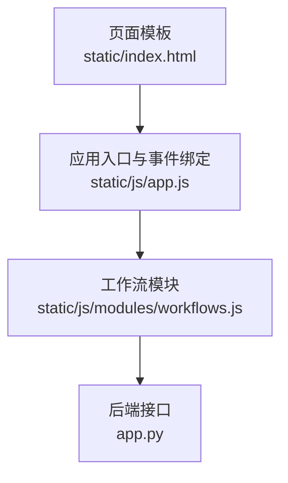
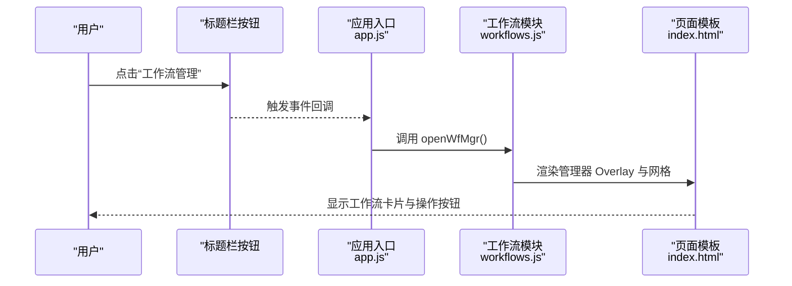
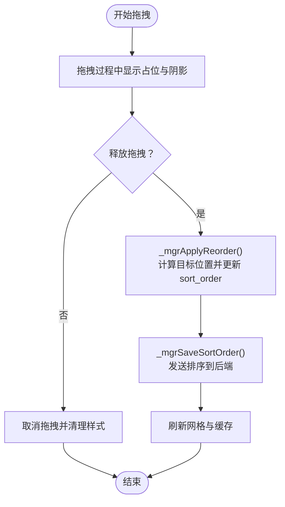
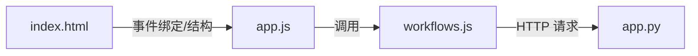

# 界面操作指南

<cite>
**本文引用的文件**
- [static/js/modules/workflows.js](file://static/js/modules/workflows.js)
- [static/index.html](file://static/index.html)
- [static/js/app.js](file://static/js/app.js)
- [app.py](file://app.py)
</cite>

## 目录
1. [简介](#简介)
2. [项目结构](#项目结构)
3. [核心组件](#核心组件)
4. [架构总览](#架构总览)
5. [详细组件分析](#详细组件分析)
6. [依赖关系分析](#依赖关系分析)
7. [性能考量](#性能考量)
8. [故障排查指南](#故障排查指南)
9. [结论](#结论)
10. [附录](#附录)

## 简介
本指南面向 Ez ComfyUI Showcase 的“工作流管理器”界面，帮助用户高效完成以下操作：
- 打开与关闭工作流管理器（含快捷键与按钮）
- 熟悉工作流网格视图的布局与元素构成
- 使用工作流卡片上的操作按钮（编辑、节点配置、下载、共享、删除等）
- 搜索与筛选（按名称、按标签、按类型）
- 卡片交互（点击选择、拖拽排序、右键菜单）
- 界面响应与状态变化

## 项目结构
工作流管理器界面由前端模块与页面模板共同实现，核心逻辑集中在 workflows.js，页面结构在 index.html 中定义，应用入口与事件绑定在 app.js 中完成。

图表来源
- [static/index.html](file://static/index.html)
- [static/js/app.js](file://static/js/app.js)
- [static/js/modules/workflows.js](file://static/js/modules/workflows.js)
- [app.py](file://app.py)

章节来源
- [static/index.html](file://static/index.html)
- [static/js/app.js](file://static/js/app.js)
- [static/js/modules/workflows.js](file://static/js/modules/workflows.js)
- [app.py](file://app.py)

## 核心组件
- 工作流管理器（Overlay）：用于集中管理与展示工作流卡片、筛选与排序。
- 工作流网格视图（Grid）：以卡片形式展示工作流，包含缩略图、名称、标签与操作按钮。
- 编辑弹窗（Edit Modal）：用于修改工作流名称、标签、缩略图与版本。
- 删除确认弹窗（Delete Modal）：删除前的安全确认。
- 过滤标签页（Filter Tabs）：按主标签进行分类筛选。
- 拖拽排序（Drag-to-Reorder）：支持桌面与移动端触摸拖拽重排。

章节来源
- [static/js/modules/workflows.js](file://static/js/modules/workflows.js)
- [static/index.html](file://static/index.html)
- [static/js/app.js](file://static/js/app.js)

## 架构总览
工作流管理器通过事件绑定打开 Overlay，渲染网格视图与过滤标签，用户可对卡片执行编辑、下载、共享、删除等操作；管理员可设置共享状态；支持拖拽排序并持久化到后端。

图表来源
- [static/js/app.js](file://static/js/app.js)
- [static/js/modules/workflows.js](file://static/js/modules/workflows.js)
- [static/index.html](file://static/index.html)

## 详细组件分析

### 打开与关闭工作流管理器
- 打开方式
  - 标题栏按钮：点击“工作流管理”按钮触发打开。
  - 关闭方式：点击 Overlay 内的关闭按钮或 Overlay 外部遮罩层。
- 快捷键
  - 当管理器处于焦点时，可使用 Esc 键快速关闭（由浏览器默认行为或全局键盘监听实现）。

章节来源
- [static/js/app.js](file://static/js/app.js)
- [static/index.html](file://static/index.html)
- [static/js/modules/workflows.js](file://static/js/modules/workflows.js)

### 工作流网格视图布局与元素
- 布局结构
  - 卡片容器：每个工作流以卡片形式呈现，包含缩略图区域、基本信息区与操作按钮区。
  - 缩略图区域：显示工作流预览图；若无则显示占位图标。
  - 名称显示：优先显示自定义名称，否则回退为文件名（去除扩展名）。
  - 标签分类：主标签作为卡片标签显示，另有额外标签以小标签形式展示。
  - 共享标记：当工作流被共享时显示“共享”标签。
- 可见性与权限
  - 若当前用户无管理权限，则卡片进入只读态，禁用拖拽与部分操作按钮。

章节来源
- [static/js/modules/workflows.js](file://static/js/modules/workflows.js)

### 工作流卡片操作按钮
- 编辑（仅管理权限可见）
  - 功能：打开编辑弹窗，可修改名称、标签、缩略图与版本。
  - 触发：点击卡片内“编辑”按钮。
- 节点配置（仅管理权限可见）
  - 功能：跳转至节点编辑器，对工作流节点进行配置。
  - 触发：点击卡片内“节点”按钮。
- 下载
  - 功能：直接下载对应工作流文件。
  - 触发：点击卡片内“下载”按钮。
- 共享（仅管理员可见）
  - 功能：切换工作流的共享状态（已共享/未共享），按钮样式随状态变化。
  - 触发：点击卡片内“共享”按钮。
- 删除（仅管理权限可见）
  - 功能：打开删除确认弹窗，确认后从服务器移除并刷新列表。
  - 触发：点击卡片内“删除”按钮。

章节来源
- [static/js/modules/workflows.js](file://static/js/modules/workflows.js)
- [static/index.html](file://static/index.html)

### 搜索与筛选
- 按名称搜索
  - 在工作流网格视图中输入关键词，系统会根据显示名称与文件名进行匹配与高亮。
- 按标签筛选
  - 使用顶部“过滤标签页”，点击对应标签即可仅显示该类别的工作流卡片。
  - 主标签优先级：文生图、图生图、放大、文生视频、图生视频、其他。
- 按类型分类
  - 类型由工作流元数据中的标签推导，主标签决定卡片所属类别。

章节来源
- [static/js/modules/workflows.js](file://static/js/modules/workflows.js)

### 工作流卡片交互
- 点击选择
  - 在主工作流网格中，点击卡片可选中该工作流；移动阈值较小，避免误触。
- 拖拽排序（管理权限）
  - 支持桌面拖拽与移动端触摸拖拽，拖动时出现阴影与占位提示，松手后触发排序更新。
  - 排序结果通过请求保存到后端，并同步更新本地缓存。
- 右键菜单
  - 当前实现未提供右键菜单；如需扩展，可在卡片上绑定右键事件并注入上下文菜单。

图表来源
- [static/js/modules/workflows.js](file://static/js/modules/workflows.js)

章节来源
- [static/js/modules/workflows.js](file://static/js/modules/workflows.js)

### 界面响应与状态变化
- 打开/关闭 Overlay
  - 打开：渲染管理器 Overlay 并加载工作流元数据与网格。
  - 关闭：移除 Overlay 的激活状态，恢复页面交互。
- 编辑弹窗
  - 打开：填充当前工作流的名称、标签与缩略图预览，允许添加/删除标签与上传缩略图。
  - 关闭：关闭弹窗并刷新过滤标签与网格。
- 删除确认
  - 打开：显示确认消息，确认后调用删除接口并刷新。
- 共享状态切换
  - 管理员点击“共享”按钮后，按钮文案与样式随状态切换，后端同步更新。

章节来源
- [static/js/modules/workflows.js](file://static/js/modules/workflows.js)
- [static/index.html](file://static/index.html)

## 依赖关系分析
- 页面模板与模块解耦
  - index.html 定义 Overlay 与弹窗结构，workflows.js 负责渲染与交互逻辑。
- 应用入口绑定
  - app.js 将 UI 事件（如打开管理器、关闭弹窗）绑定到 workflows.js 的公开函数。
- 后端接口
  - workflows.js 通过 API 调用后端接口，实现工作流元数据、缩略图、排序、删除等操作。

图表来源
- [static/index.html](file://static/index.html)
- [static/js/app.js](file://static/js/app.js)
- [static/js/modules/workflows.js](file://static/js/modules/workflows.js)
- [app.py](file://app.py)

章节来源
- [static/index.html](file://static/index.html)
- [static/js/app.js](file://static/js/app.js)
- [static/js/modules/workflows.js](file://static/js/modules/workflows.js)
- [app.py](file://app.py)

## 性能考量
- 渲染优化
  - 使用虚拟滚动或分页可进一步降低大量工作流时的渲染压力（建议项）。
- 拖拽性能
  - 拖拽过程仅更新视觉占位，排序变更通过批量请求提交，避免频繁网络请求。
- 缓存策略
  - 本地缓存工作流元数据与缩略图版本号，减少重复请求。

## 故障排查指南
- 打不开工作流管理器
  - 检查标题栏按钮是否绑定事件；确认 app.js 中的事件绑定是否生效。
- 无法编辑工作流
  - 确认当前用户是否具备管理权限；检查编辑按钮是否显示。
- 删除无效
  - 确认删除弹窗已打开且已点击确认；查看网络面板是否有删除请求与返回码。
- 共享状态不更新
  - 确认当前用户为管理员；检查后端接口返回与前端状态切换逻辑。
- 拖拽排序不生效
  - 确认卡片具有管理权限；检查拖拽事件绑定与排序保存请求是否成功。

章节来源
- [static/js/app.js](file://static/js/app.js)
- [static/js/modules/workflows.js](file://static/js/modules/workflows.js)

## 结论
工作流管理器提供了直观的网格视图与完善的管理能力，结合标签筛选、拖拽排序与弹窗编辑，能够满足日常工作流的组织与维护需求。建议在大规模工作流场景下引入分页与缓存策略以提升性能，并考虑扩展右键菜单以增强交互体验。

## 附录
- 快捷键
  - Esc：关闭当前弹窗或管理器 Overlay（若处于焦点）。
- 常见问题
  - 为什么看不到“共享”按钮？仅管理员可见。
  - 为什么“编辑/节点/删除”按钮不可用？当前用户无管理权限。