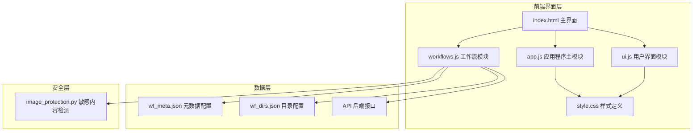
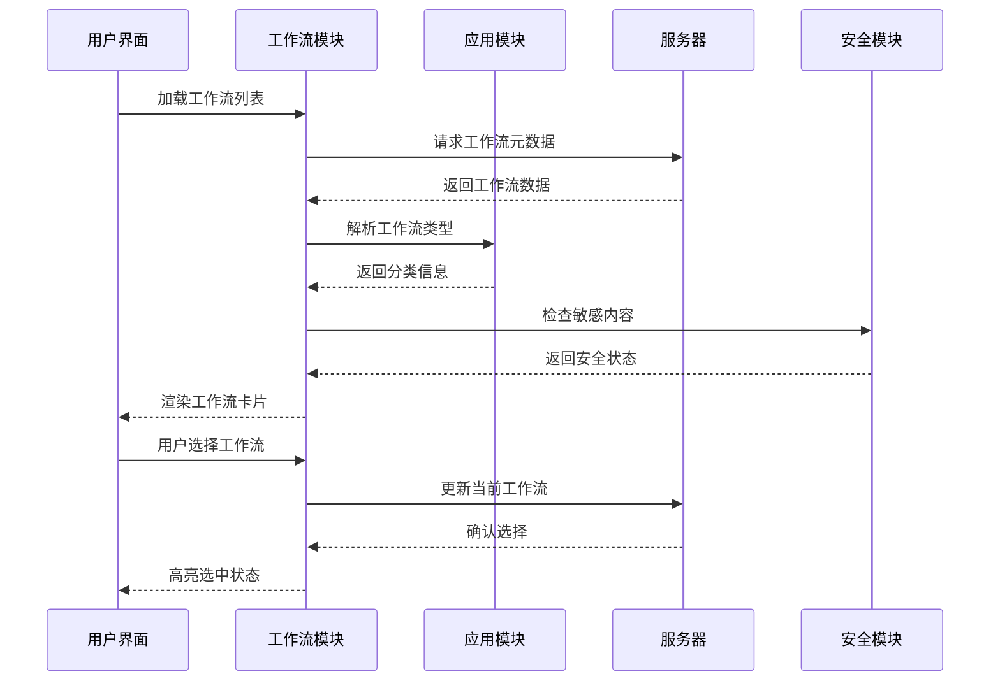
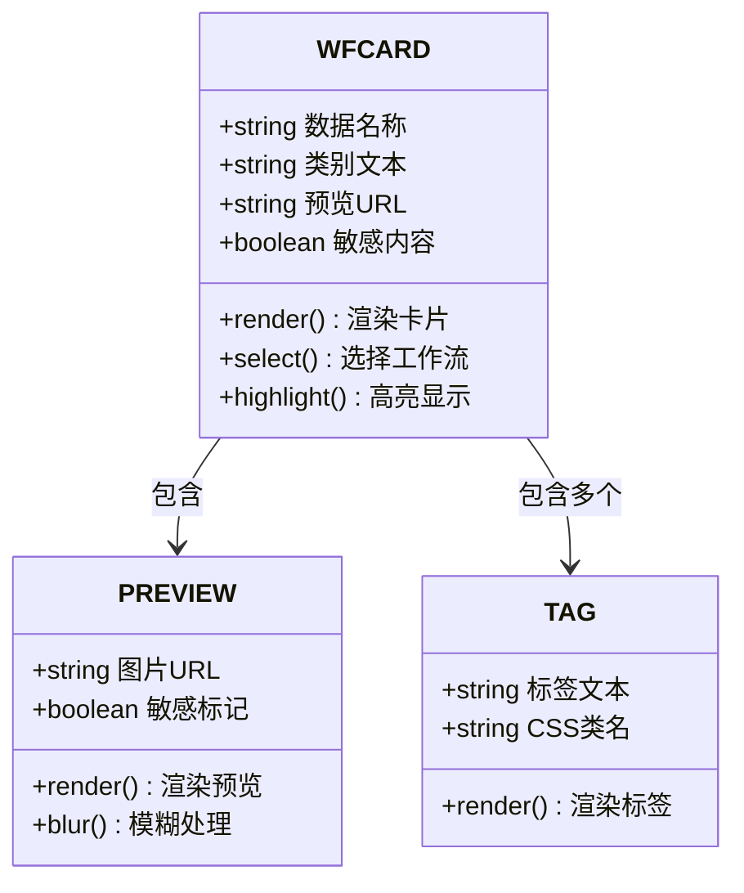
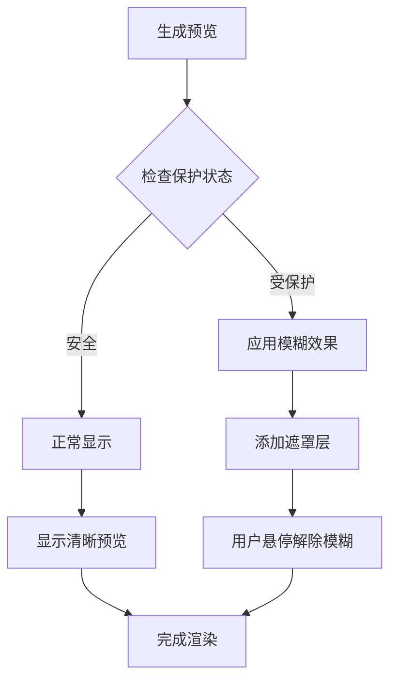
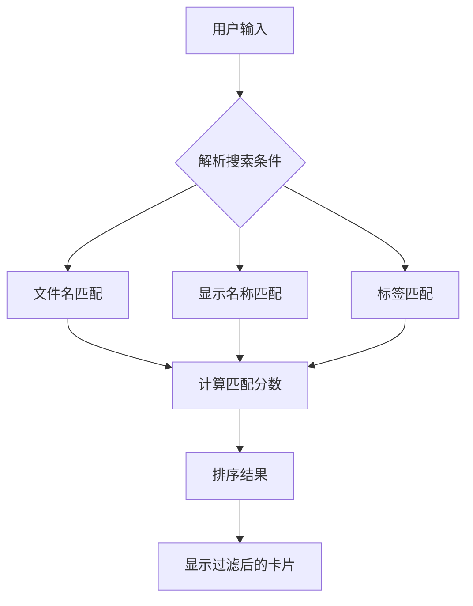

# 工作流选择界面

<cite>
**本文档引用的文件**
- [index.html](file://static/index.html)
- [workflows.js](file://static/js/modules/workflows.js)
- [ui.js](file://static/js/modules/ui.js)
- [style.css](file://static/css/style.css)
- [app.js](file://static/js/app.js)
- [wf_meta.json](file://data/wf_meta.json)
- [wf_dirs.json](file://data/wf_dirs.json)
- [image_protection.py](file://modules/image_protection.py)
</cite>

## 目录
1. [简介](#简介)
2. [项目结构](#项目结构)
3. [核心组件](#核心组件)
4. [架构概览](#架构概览)
5. [详细组件分析](#详细组件分析)
6. [依赖关系分析](#依赖关系分析)
7. [性能考虑](#性能考虑)
8. [故障排除指南](#故障排除指南)
9. [结论](#结论)
10. [附录](#附录)

## 简介

Ez ComfyUI Showcase 的工作流选择界面是一个功能丰富的图形化工作流管理系统，提供了直观的网格视图、智能分类筛选、强大的搜索功能和完整的预览机制。该界面支持多种工作流类型（文生图、图生图、视频制作、放大等），具备敏感内容保护机制，为用户提供了一站式的工作流管理和选择体验。

## 项目结构

工作流选择界面主要由以下核心部分组成：



**图表来源**
- [index.html:1-659](file://static/index.html#L1-L659)
- [workflows.js:1-800](file://static/js/modules/workflows.js#L1-L800)
- [style.css:1-200](file://static/css/style.css#L1-L200)

**章节来源**
- [index.html:1-659](file://static/index.html#L1-L659)
- [workflows.js:1-800](file://static/js/modules/workflows.js#L1-L800)
- [style.css:1-200](file://static/css/style.css#L1-L200)

## 核心组件

### 工作流网格视图系统

工作流网格视图采用响应式设计，支持不同屏幕尺寸下的自适应布局：

- **网格布局**：使用 CSS Grid 和 Flexbox 实现灵活的卡片排列
- **卡片设计**：每个工作流卡片包含预览图、名称、标签和操作按钮
- **交互设计**：支持点击选择、悬停效果和动画过渡

### 分类筛选系统

系统内置智能分类机制，支持多维度的工作流组织：

- **类型分类**：文生图、图生图、文生视频、图生视频、放大
- **分辨率标签**：2K、4K、8K 等高质量输出支持
- **功能标签**：LoRA、测试、实验等特殊用途标识

### 搜索和过滤功能

提供多层次的搜索和过滤能力：

- **名称搜索**：基于工作流文件名和显示名称的模糊匹配
- **标签过滤**：精确匹配工作流标签进行分类筛选
- **实时过滤**：输入即生效的动态过滤体验

**章节来源**
- [workflows.js:366-455](file://static/js/modules/workflows.js#L366-L455)
- [style.css:409-456](file://static/css/style.css#L409-L456)

## 架构概览

工作流选择界面采用模块化架构设计，各组件职责明确：



**图表来源**
- [workflows.js:956-1013](file://static/js/modules/workflows.js#L956-L1013)
- [app.js:118-145](file://static/js/app.js#L118-L145)

## 详细组件分析

### 工作流卡片组件

工作流卡片是界面的核心元素，具有以下特性：

#### 卡片布局结构



**图表来源**
- [workflows.js:956-976](file://static/js/modules/workflows.js#L956-L976)
- [style.css:409-441](file://static/css/style.css#L409-L441)

#### 预览系统设计

预览系统采用多层次的安全检查机制：

1. **历史预览优先**：优先使用最近生成的历史结果
2. **缩略图后备**：使用工作流元数据中的自定义缩略图
3. **图标降级**：无预览时显示默认工作流图标

#### 敏感内容保护机制

系统实现了多层次的敏感内容保护：



**图表来源**
- [workflows.js:67-97](file://static/js/modules/workflows.js#L67-L97)
- [image_protection.py:164-182](file://modules/image_protection.py#L164-L182)

**章节来源**
- [workflows.js:95-127](file://static/js/modules/workflows.js#L95-L127)
- [style.css:425-441](file://static/css/style.css#L425-L441)

### 分类筛选系统

#### 标签分类机制

系统支持多层级的标签分类：

| 标签类型 | 示例 | CSS类名 | 功能 |
|---------|------|---------|------|
| 文生图 | 文生图 | wf-tag-t2i | 文字到图像生成 |
| 图生图 | 图生图 | wf-tag-i2i | 图像到图像转换 |
| 文生视频 | 文生视频 | wf-tag-t2v | 文字到视频生成 |
| 图生视频 | 图生视频 | wf-tag-i2v | 图像到视频转换 |
| 放大 | 放大 | wf-tag-cat | 图像放大增强 |
| 分辨率 | 2K/4K/8K | wf-tag-res | 输出质量标识 |

#### 动态标签生成

标签系统支持动态生成和排序：


**图表来源**
- [workflows.js:440-449](file://static/js/modules/workflows.js#L440-L449)
- [workflows.js:987-1010](file://static/js/modules/workflows.js#L987-L1010)

**章节来源**
- [workflows.js:408-455](file://static/js/modules/workflows.js#L408-L455)
- [app.js:118-145](file://static/js/app.js#L118-L145)

### 搜索和过滤功能

#### 多维搜索算法

搜索功能支持多维度的数据匹配：



**图表来源**
- [workflows.js:388-406](file://static/js/modules/workflows.js#L388-L406)

#### 实时过滤实现

系统采用高效的实时过滤机制：

1. **防抖处理**：避免频繁的DOM操作
2. **增量更新**：只更新变化的卡片
3. **内存优化**：使用模板缓存减少重复渲染

**章节来源**
- [workflows.js:388-406](file://static/js/modules/workflows.js#L388-L406)
- [ui.js:667-727](file://static/js/modules/ui.js#L667-L727)

### 交互功能

#### 卡片交互设计

工作流卡片支持多种交互方式：

| 交互类型 | 触发方式 | 功能描述 |
|----------|----------|----------|
| 点击选择 | 单击卡片 | 选择当前工作流 |
| 悬停效果 | 鼠标悬停 | 显示详细信息 |
| 拖拽排序 | 按住拖拽 | 在管理界面重新排序 |
| 右键菜单 | 右键点击 | 快捷操作选项 |

#### 移动端适配

系统针对移动端进行了专门优化：

- **触摸友好的尺寸**：确保在小屏幕上易于操作
- **响应式布局**：自动适应不同屏幕尺寸
- **手势支持**：支持滑动和缩放操作

**章节来源**
- [workflows.js:151-163](file://static/js/modules/workflows.js#L151-L163)
- [ui.js:667-727](file://static/js/modules/ui.js#L667-L727)

## 依赖关系分析

工作流选择界面的依赖关系呈现层次化结构：

```mermaid
graph TB
subgraph "界面层"
A[index.html)
B[style.css]
C[ui.js]
end
subgraph "业务逻辑层"
D[workflows.js]
E[app.js]
end
subgraph "数据层"
F[wf_meta.json]
G[wf_dirs.json]
H[API服务]
end
subgraph "安全层"
I[image_protection.py]
end
A --> D
A --> C
A --> E
D --> F
D --> G
D --> H
D --> I
E --> I
C --> B
```

**图表来源**
- [index.html:1-659](file://static/index.html#L1-L659)
- [workflows.js:1-800](file://static/js/modules/workflows.js#L1-L800)
- [style.css:1-200](file://static/css/style.css#L1-L200)

**章节来源**
- [index.html:1-659](file://static/index.html#L1-L659)
- [workflows.js:1-800](file://static/js/modules/workflows.js#L1-L800)

## 性能考虑

### 渲染优化策略

系统采用了多项性能优化措施：

1. **虚拟滚动**：对于大量工作流时采用虚拟滚动技术
2. **懒加载**：图片资源采用懒加载机制
3. **缓存机制**：标签和元数据信息进行本地缓存
4. **增量更新**：只更新发生变化的DOM元素

### 内存管理

- **事件委托**：使用事件委托减少内存占用
- **定时器清理**：及时清理不再使用的定时器
- **垃圾回收**：定期清理无用的DOM引用

## 故障排除指南

### 常见问题及解决方案

#### 工作流预览不显示

**问题现象**：工作流卡片显示为空白或默认图标

**可能原因**：
1. 工作流元数据中缺少缩略图配置
2. 预览图片文件损坏或不存在
3. 网络连接异常导致图片加载失败

**解决步骤**：
1. 检查 `wf_meta.json` 中的缩略图配置
2. 验证图片文件路径的有效性
3. 确认网络连接正常

#### 分类标签显示异常

**问题现象**：工作流分类标签显示错误或缺失

**解决步骤**：
1. 检查工作流元数据中的标签配置
2. 验证标签格式是否符合规范
3. 重新加载工作流元数据

#### 搜索功能失效

**问题现象**：搜索框输入无响应或搜索结果不正确

**解决步骤**：
1. 检查浏览器JavaScript执行状态
2. 验证搜索关键词的格式
3. 清除浏览器缓存后重试

**章节来源**
- [workflows.js:129-138](file://static/js/modules/workflows.js#L129-L138)
- [wf_meta.json:1-537](file://data/wf_meta.json#L1-L537)

## 结论

Ez ComfyUI Showcase 的工作流选择界面通过精心设计的架构和丰富的功能特性，为用户提供了高效、直观的工作流管理体验。系统不仅具备强大的分类筛选和搜索功能，还实现了智能化的预览机制和敏感内容保护，确保了良好的用户体验和安全性。

界面采用现代化的响应式设计，支持多种设备和屏幕尺寸，同时通过多项性能优化措施保证了流畅的交互体验。整体而言，这是一个功能完备、设计精良的工作流管理界面解决方案。

## 附录

### 使用示例

#### 快速查找工作流

1. 打开工作流管理界面
2. 在搜索框中输入关键词（如"文生图"）
3. 系统自动显示匹配的工作流
4. 点击目标工作流卡片进行选择

#### 创建新工作流

1. 点击"上传工作流"按钮
2. 选择本地的JSON文件
3. 系统自动验证并导入工作流
4. 在工作流管理界面编辑元数据

#### 管理工作流标签

1. 打开工作流管理界面
2. 点击"编辑"按钮
3. 在标签输入框中添加新的标签
4. 点击"保存"按钮确认更改

### 截图说明

由于技术限制，无法在此提供具体的截图。建议用户在实际使用过程中参考界面中的视觉指示来完成各种操作。