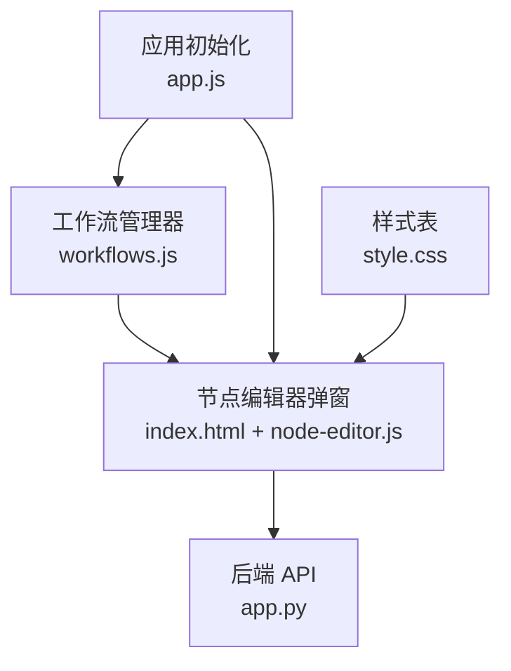
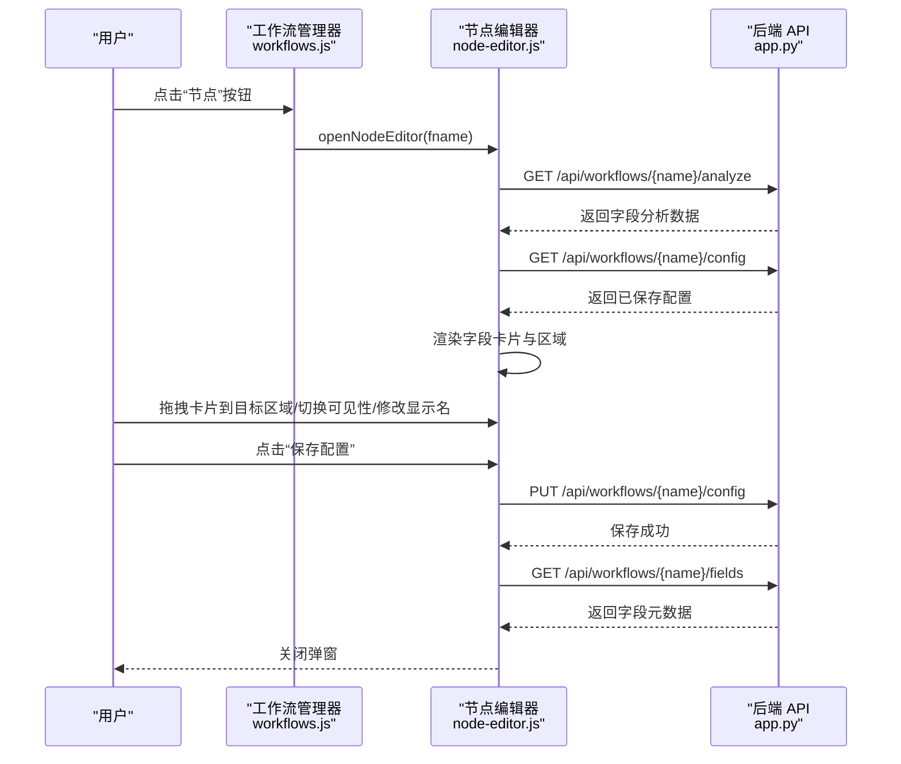
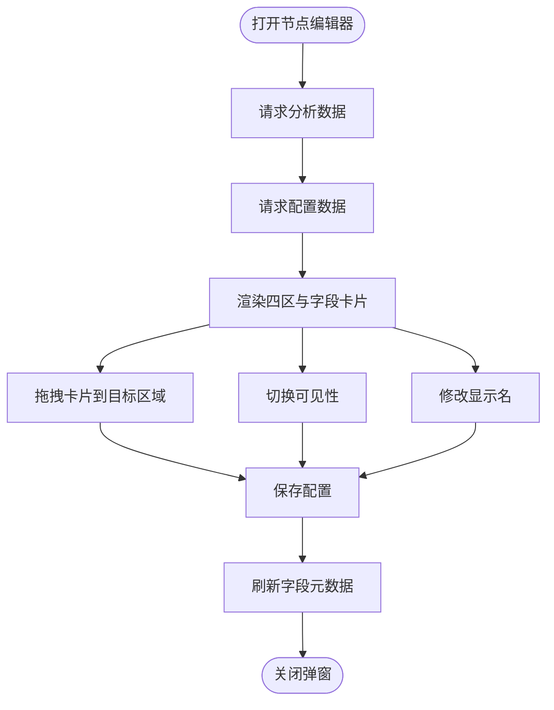
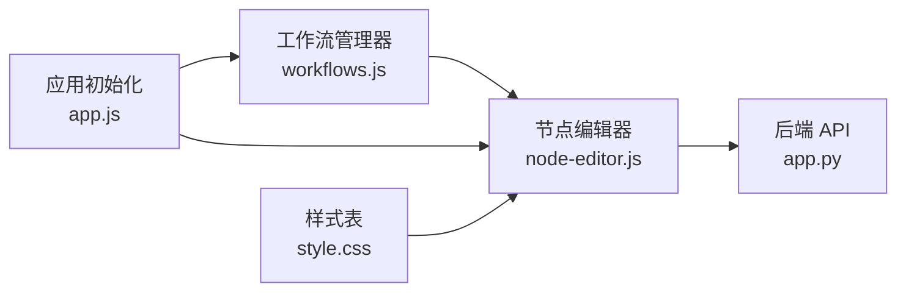

# 节点编辑器

<cite>
**本文引用的文件**
- [index.html](file://static/index.html)
- [node-editor.js](file://static/js/modules/node-editor.js)
- [workflows.js](file://static/js/modules/workflows.js)
- [app.js](file://static/js/app.js)
- [style.css](file://static/css/style.css)
- [app.py](file://app.py)
</cite>

## 目录
1. [简介](#简介)
2. [项目结构](#项目结构)
3. [核心组件](#核心组件)
4. [架构总览](#架构总览)
5. [详细组件分析](#详细组件分析)
6. [依赖关系分析](#依赖关系分析)
7. [性能考虑](#性能考虑)
8. [故障排除指南](#故障排除指南)
9. [结论](#结论)
10. [附录](#附录)

## 简介
本指南面向 Ez ComfyUI Showcase 的节点编辑器，帮助用户从工作流管理器进入节点编辑界面，掌握界面布局、节点添加/删除/连接、参数修改、工作流保存与导出等完整操作流程，并提供最佳实践与常见问题解决方案。

## 项目结构
节点编辑器位于前端静态页面中，通过工作流管理器触发打开，核心由以下文件组成：
- 页面模板与布局：static/index.html
- 节点编辑器逻辑：static/js/modules/node-editor.js
- 工作流管理器与入口按钮：static/js/modules/workflows.js
- 应用初始化与事件绑定：static/js/app.js
- 样式定义：static/css/style.css
- 后端 API（分析、配置、下载）：app.py

图表来源
- [index.html:205-248](file://static/index.html#L205-L248)
- [node-editor.js:534-557](file://static/js/modules/node-editor.js#L534-L557)
- [workflows.js:520-541](file://static/js/modules/workflows.js#L520-L541)
- [app.js:723-727](file://static/js/app.js#L723-L727)
- [style.css:8025-8056](file://static/css/style.css#L8025-L8056)
- [app.py:6707-6737](file://app.py#L6707-L6737)

章节来源
- [index.html:205-248](file://static/index.html#L205-L248)
- [node-editor.js:534-557](file://static/js/modules/node-editor.js#L534-L557)
- [workflows.js:520-541](file://static/js/modules/workflows.js#L520-L541)
- [app.js:723-727](file://static/js/app.js#L723-L727)
- [style.css:8025-8056](file://static/css/style.css#L8025-L8056)
- [app.py:6707-6737](file://app.py#L6707-L6737)

## 核心组件
- 节点编辑器弹窗：包含“用户输入/高级参数/输出/隐藏”四个区域，支持字段卡片拖拽、可见性切换、自定义显示名。
- 工作流管理器：提供工作流列表、上传、编辑、节点编辑入口、下载、删除等操作。
- 应用初始化：负责事件绑定、按钮点击与弹窗开关。
- 样式系统：定义节点编辑器区域、卡片、交互态的视觉表现。

章节来源
- [index.html:205-248](file://static/index.html#L205-L248)
- [node-editor.js:332-528](file://static/js/modules/node-editor.js#L332-L528)
- [workflows.js:520-541](file://static/js/modules/workflows.js#L520-L541)
- [app.js:723-727](file://static/js/app.js#L723-L727)
- [style.css:8771-8825](file://static/css/style.css#L8771-L8825)

## 架构总览
节点编辑器通过两个后端接口获取数据与持久化配置：
- 分析接口：/api/workflows/{name}/analyze
- 配置接口：/api/workflows/{name}/config
- 字段渲染接口：/api/workflows/{name}/fields
- 下载接口：/api/workflows/{name}/download

图表来源
- [workflows.js:520-541](file://static/js/modules/workflows.js#L520-L541)
- [node-editor.js:534-557](file://static/js/modules/node-editor.js#L534-L557)
- [node-editor.js:278-331](file://static/js/modules/node-editor.js#L278-L331)
- [node-editor.js:124-158](file://static/js/modules/node-editor.js#L124-L158)
- [app.py:6707-6737](file://app.py#L6707-L6737)

## 详细组件分析

### 界面布局与区域
节点编辑器弹窗包含四区：
- 用户输入：首屏关键参数
- 高级参数：进阶控制项
- 输出：生成结果相关
- 隐藏：保留但不展示

每个区域由容器承载，卡片以字段维度组织，支持拖拽排序与可见性切换。

图表来源
- [index.html:222-239](file://static/index.html#L222-L239)
- [node-editor.js:332-528](file://static/js/modules/node-editor.js#L332-L528)
- [node-editor.js:278-331](file://static/js/modules/node-editor.js#L278-L331)
- [node-editor.js:124-158](file://static/js/modules/node-editor.js#L124-L158)

章节来源
- [index.html:222-239](file://static/index.html#L222-L239)
- [node-editor.js:332-528](file://static/js/modules/node-editor.js#L332-L528)
- [style.css:8771-8825](file://static/css/style.css#L8771-L8825)

### 从工作流管理器进入节点编辑器
- 在工作流管理器卡片中，点击“节点”按钮即可打开节点编辑器。
- 打开时会并行请求分析与配置数据，然后渲染界面。

章节来源
- [workflows.js:520-541](file://static/js/modules/workflows.js#L520-L541)
- [node-editor.js:534-557](file://static/js/modules/node-editor.js#L534-L557)

### 字段卡片与区域交互
- 字段卡片包含节点标识、字段名、显示名输入框、值预览、可见性切换按钮。
- 支持在桌面端拖拽卡片到不同区域；移动端点击卡片展开详情并可切换可见性。
- 可见性切换会根据当前所在区域记录“上一个区域”，以便恢复时回到正确位置。

章节来源
- [node-editor.js:382-480](file://static/js/modules/node-editor.js#L382-L480)
- [node-editor.js:460-477](file://static/js/modules/node-editor.js#L460-L477)
- [node-editor.js:30-50](file://static/js/modules/node-editor.js#L30-L50)

### 参数修改与保存
- 显示名：通过字段卡片内的输入框即时修改，保存时写入配置。
- 可见性：点击眼睛图标切换，保存时记录 visible 状态。
- 区域归属：拖拽到不同区域保存 zone 与顺序。
- 保存动作会将配置提交至后端，并刷新当前工作流字段元数据。

章节来源
- [node-editor.js:278-331](file://static/js/modules/node-editor.js#L278-L331)
- [node-editor.js:124-158](file://static/js/modules/node-editor.js#L124-L158)

### 工作流保存与导出
- 保存：点击“保存配置”后，前端将构建配置对象并调用配置接口进行持久化。
- 导出：工作流管理器提供“下载”按钮，点击后通过下载接口将 JSON 文件下载到本地。

章节来源
- [node-editor.js:278-331](file://static/js/modules/node-editor.js#L278-L331)
- [workflows.js:181-183](file://static/js/modules/workflows.js#L181-L183)
- [app.py:6729-6737](file://app.py#L6729-L6737)

### 最佳实践与注意事项
- 合理分区：将常用参数放入“用户输入”，复杂参数放入“高级参数”，结果相关放入“输出”，不展示的内部参数放入“隐藏”。
- 显示名优化：为字段卡片设置简洁易懂的显示名，提升前台可读性。
- 可见性策略：默认隐藏不必要参数，仅在需要时显式开启。
- 保存前预览：保存后利用字段元数据刷新功能核对效果。
- 移动端体验：移动端通过点击展开卡片，注意避免误触拖拽。

章节来源
- [node-editor.js:332-528](file://static/js/modules/node-editor.js#L332-L528)
- [node-editor.js:278-331](file://static/js/modules/node-editor.js#L278-L331)
- [node-editor.js:124-158](file://static/js/modules/node-editor.js#L124-L158)

## 依赖关系分析
- 节点编辑器依赖工作流管理器提供的入口与工作流名称。
- 节点编辑器依赖后端 API 提供的分析、配置、字段元数据与下载能力。
- 应用初始化负责绑定按钮事件，确保弹窗与保存/重置动作生效。

图表来源
- [workflows.js:520-541](file://static/js/modules/workflows.js#L520-L541)
- [node-editor.js:534-557](file://static/js/modules/node-editor.js#L534-L557)
- [app.js:723-727](file://static/js/app.js#L723-L727)
- [style.css:8025-8056](file://static/css/style.css#L8025-L8056)
- [app.py:6707-6737](file://app.py#L6707-L6737)

章节来源
- [workflows.js:520-541](file://static/js/modules/workflows.js#L520-L541)
- [node-editor.js:534-557](file://static/js/modules/node-editor.js#L534-L557)
- [app.js:723-727](file://static/js/app.js#L723-L727)
- [style.css:8025-8056](file://static/css/style.css#L8025-L8056)
- [app.py:6707-6737](file://app.py#L6707-L6737)

## 性能考虑
- 拖拽排序采用局部 DOM 更新与节流策略，避免频繁重绘。
- 字段卡片渲染时按区域批量插入，减少布局抖动。
- 移动端紧凑模式下切换卡片展开/收起，降低触摸误触概率。

章节来源
- [node-editor.js:30-50](file://static/js/modules/node-editor.js#L30-L50)
- [node-editor.js:332-528](file://static/js/modules/node-editor.js#L332-L528)
- [node-editor.js:30-50](file://static/js/modules/node-editor.js#L30-L50)

## 故障排除指南
- 打不开节点编辑器
  - 确认已在工作流管理器中选择了工作流并点击“节点”按钮。
  - 检查浏览器控制台是否有网络错误（分析/配置接口）。
- 保存后未生效
  - 确认保存按钮已点击且返回状态为成功。
  - 刷新页面或重新打开节点编辑器，检查字段元数据是否更新。
- 字段显示名未改变
  - 确认在字段卡片内修改了“显示名”输入框，并保存配置。
- 移动端无法拖拽
  - 移动端通过点击卡片展开详情，再点击“可见性”按钮切换。
- 下载失败
  - 确认工作流存在且有权限访问，尝试刷新页面后重试。

章节来源
- [workflows.js:520-541](file://static/js/modules/workflows.js#L520-L541)
- [node-editor.js:278-331](file://static/js/modules/node-editor.js#L278-L331)
- [node-editor.js:124-158](file://static/js/modules/node-editor.js#L124-L158)
- [workflows.js:181-183](file://static/js/modules/workflows.js#L181-L183)

## 结论
节点编辑器提供了直观的可视化配置体验，通过“用户输入/高级参数/输出/隐藏”四区划分与字段卡片拖拽，帮助用户快速整理工作流参数的展示与控制。配合工作流管理器的上传、编辑、下载与删除功能，形成完整的节点参数管理闭环。

## 附录
- 后端 API 端点
  - 分析：GET /api/workflows/{name}/analyze
  - 配置：GET/PUT /api/workflows/{name}/config
  - 字段元数据：GET /api/workflows/{name}/fields
  - 下载：GET /api/workflows/{name}/download

章节来源
- [app.py:6707-6737](file://app.py#L6707-L6737)