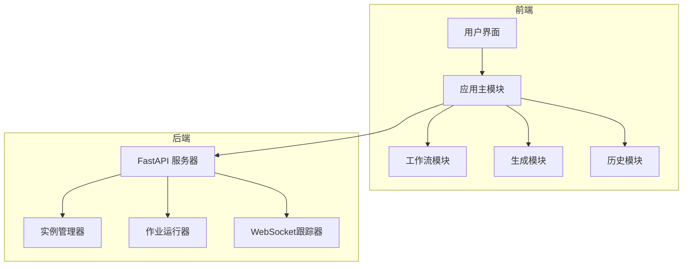
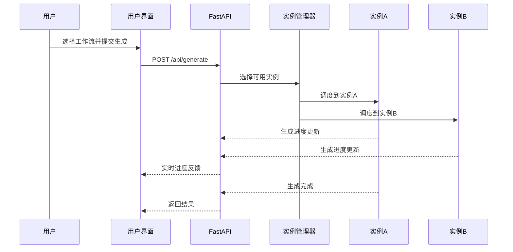
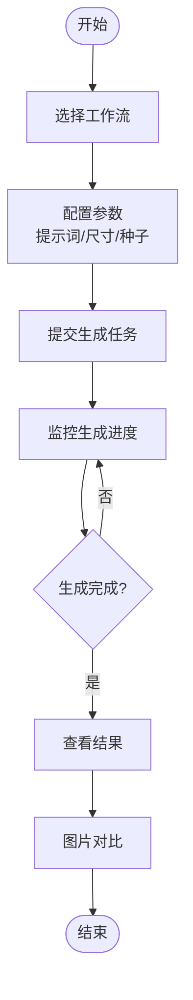
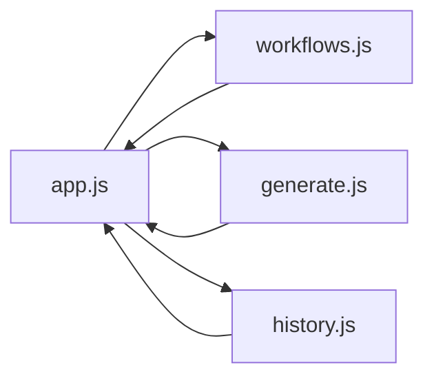

# 快速开始

<cite>
**本文引用的文件**
- [README.md](file://README.md)
- [app.py](file://app.py)
- [index.html](file://static/index.html)
- [app.js](file://static/js/app.js)
- [workflows.js](file://static/js/modules/workflows.js)
- [generate.js](file://static/js/modules/generate.js)
- [history.js](file://static/js/modules/history.js)
- [quick-start.sh](file://quick-start.sh)
</cite>

## 目录
1. [简介](#简介)
2. [项目结构](#项目结构)
3. [核心组件](#核心组件)
4. [架构概览](#架构概览)
5. [详细组件分析](#详细组件分析)
6. [依赖关系分析](#依赖关系分析)
7. [性能考虑](#性能考虑)
8. [故障排除指南](#故障排除指南)
9. [结论](#结论)
10. [附录](#附录)

## 简介
Ez ComfyUI Showcase 是一个多实例 ComfyUI Web 管理与生成平台，采用三段式 UI 设计，支持多实例调度、GPU 监控、服务管理、节点编辑器、画廊系统等功能。本文档旨在帮助新用户在 5 分钟内完成首次成功生成。

## 项目结构
该项目采用前后端分离架构：
- 后端：Python FastAPI 应用，提供 REST API 和 WebSocket 通信
- 前端：Vanilla JavaScript ES6 模块，实现三段式用户界面
- 配置：JSON 配置文件管理节点和工作流

**图表来源**
- [app.py:1-800](file://app.py#L1-L800)
- [index.html:1-659](file://static/index.html#L1-L659)

**章节来源**
- [README.md:40-59](file://README.md#L40-L59)
- [app.py:1-800](file://app.py#L1-L800)

## 核心组件
基于三段式布局的用户界面设计：

### 左侧工作流选择区
- 工作流网格展示
- 标签分类筛选
- 工作流元数据管理
- 节点编辑器集成

### 中间生成区
- 快速出图表单
- 参数调节面板
- 实时进度监控
- 尺寸预设和比例控制

### 右侧历史区
- 无限滚动画廊
- 按标签/日期/模型筛选
- 图片对比功能
- 收藏和分享管理

**章节来源**
- [index.html:293-346](file://static/index.html#L293-L346)
- [workflows.js:493-541](file://static/js/modules/workflows.js#L493-L541)
- [generate.js:1-800](file://static/js/modules/generate.js#L1-L800)
- [history.js:1-800](file://static/js/modules/history.js#L1-L800)

## 架构概览
系统采用多实例生成调度架构，支持 A/B 实例并行处理：

**图表来源**
- [app.py:305-378](file://app.py#L305-L378)
- [app.py:476-491](file://app.py#L476-L491)

## 详细组件分析

### 首次使用准备工作

#### 浏览器兼容性要求
- 支持现代浏览器（Chrome、Firefox、Safari）
- 需要启用 JavaScript 和 Cookie
- 建议使用最新版本浏览器以获得最佳体验

#### 网络环境配置
- 默认端口：9091（可通过环境变量配置）
- 支持本地部署和远程访问
- 需要开放必要的端口和防火墙规则

**章节来源**
- [README.md:61-76](file://README.md#L61-L76)
- [README.md:78-86](file://README.md#L78-L86)

### 访问应用界面

#### 本地部署方式
1. 克隆仓库并安装依赖
2. 启动应用服务器
3. 访问 http://localhost:9091

#### 远程访问方式
1. 配置反向代理（如 Nginx）
2. 设置 SSL 证书
3. 通过域名访问应用

**章节来源**
- [README.md:61-76](file://README.md#L61-L76)
- [quick-start.sh:1-127](file://quick-start.sh#L1-L127)

### 基本用户界面介绍

#### 三段式布局详解
1. **左侧工作流选择区**
   - 工作流网格展示各类预置工作流
   - 支持按类型（文生图、图生图、视频等）筛选
   - 可查看工作流元数据和缩略图

2. **中间生成区**
   - 快速出图表单，包含提示词输入
   - 参数调节面板，支持种子、尺寸等参数
   - 实时进度监控和状态显示

3. **右侧历史区**
   - 无限滚动画廊展示历史生成结果
   - 支持多种筛选条件（标签、日期、模型等）
   - 图片对比和收藏功能

**章节来源**
- [index.html:293-346](file://static/index.html#L293-L346)
- [app.js:630-689](file://static/js/app.js#L630-L689)

### 第一个生成任务完整操作流程

#### 步骤 1：选择工作流
1. 在左侧工作流选择区浏览工作流
2. 点击选择合适的文生图工作流
3. 工作流元数据会显示在右侧

#### 步骤 2：配置生成参数
1. 在中间生成区输入提示词
2. 调整图像尺寸和比例
3. 设置种子值（可选）
4. 配置其他高级参数

#### 步骤 3：提交生成任务
1. 点击"开始生成"按钮
2. 观察生成进度指示器
3. 实时查看生成状态

#### 步骤 4：查看结果
1. 在右侧历史区查看生成结果
2. 点击图片查看详细信息
3. 使用图片对比功能比较结果

**图表来源**
- [generate.js:1-800](file://static/js/modules/generate.js#L1-L800)
- [history.js:1-800](file://static/js/modules/history.js#L1-L800)

**章节来源**
- [workflows.js:778-793](file://static/js/modules/workflows.js#L778-L793)
- [generate.js:1-800](file://static/js/modules/generate.js#L1-L800)
- [history.js:1-800](file://static/js/modules/history.js#L1-L800)

## 依赖关系分析

### 前端模块依赖关系

**图表来源**
- [app.js:86-111](file://static/js/app.js#L86-L111)
- [workflows.js:1-32](file://static/js/modules/workflows.js#L1-L32)

### 后端服务依赖
- FastAPI 框架提供 REST API
- WebSocket 支持实时通信
- SQLite 数据库存储作业状态
- JSON 配置文件管理节点信息

**章节来源**
- [app.py:1-800](file://app.py#L1-L800)

## 性能考虑
- 多实例并行处理提升吞吐量
- GPU 监控实时显示资源使用情况
- 无限滚动懒加载优化大画廊性能
- 缓存机制减少重复请求

## 故障排除指南

### 常见问题及解决方案

#### 无法连接实例
**症状**：页面显示"实例已停止"或连接失败
**解决方法**：
1. 检查 ComfyUI 实例是否正常运行
2. 通过实例管理器重启实例
3. 查看日志面板获取详细错误信息

#### 生成失败
**症状**：生成过程中出现错误状态
**解决方法**：
1. 检查提示词格式和参数设置
2. 确认 GPU 内存充足
3. 重试生成任务或清理缓存

#### 页面加载缓慢
**症状**：历史画廊加载缓慢
**解决方法**：
1. 启用无限滚动懒加载
2. 使用筛选功能减少数据量
3. 清理浏览器缓存

#### 图片对比功能异常
**症状**：无法进行图片对比
**解决方法**：
1. 确认有原图和生成图
2. 检查图片路径是否正确
3. 刷新页面重新加载

**章节来源**
- [app.py:296-303](file://app.py#L296-L303)
- [history.js:285-309](file://static/js/modules/history.js#L285-L309)

## 结论
Ez ComfyUI Showcase 提供了直观易用的三段式界面和强大的多实例生成能力。通过本文档的快速开始指南，用户可以在 5 分钟内完成首次成功生成。建议新用户从简单的文生图工作流开始，逐步探索高级功能和参数调节。

## 附录

### 快速参考清单
- ✅ 安装 Python 依赖
- ✅ 启动应用服务器
- ✅ 选择工作流
- ✅ 配置生成参数
- ✅ 提交生成任务
- ✅ 查看生成结果

### 技术规格
- 支持多实例并行处理
- 实时 GPU 监控
- 无限滚动画廊
- 图片对比功能
- 工作流版本管理