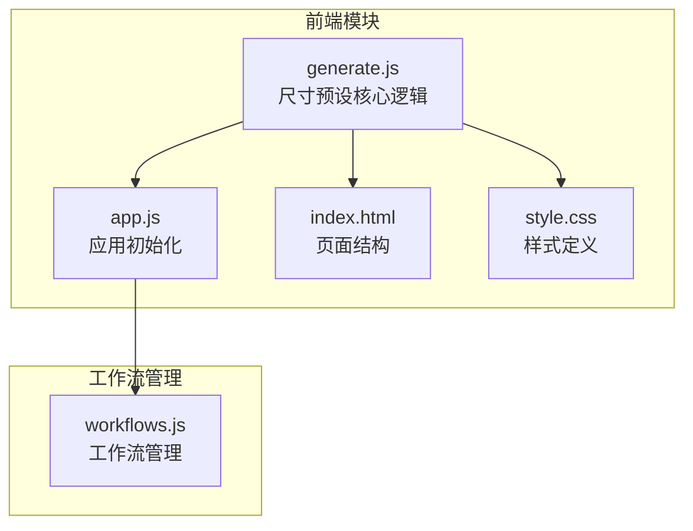
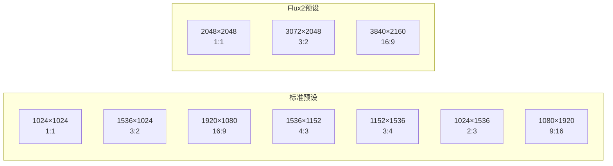
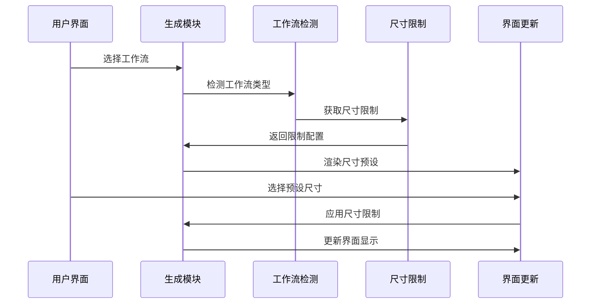
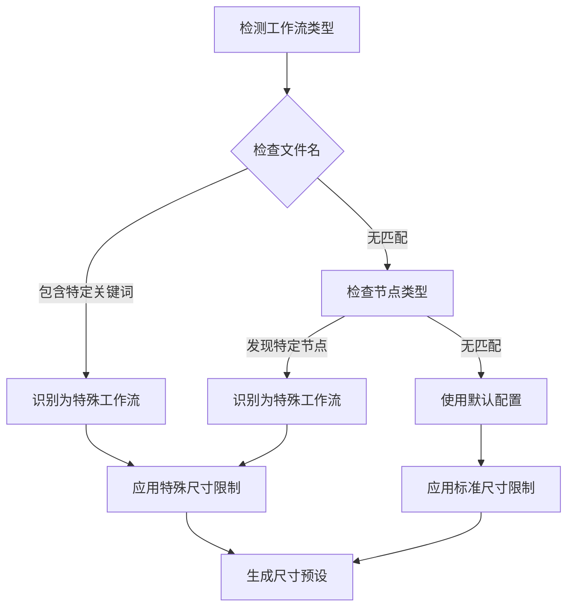
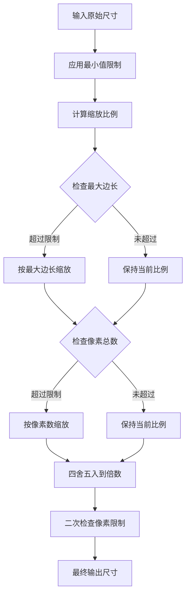
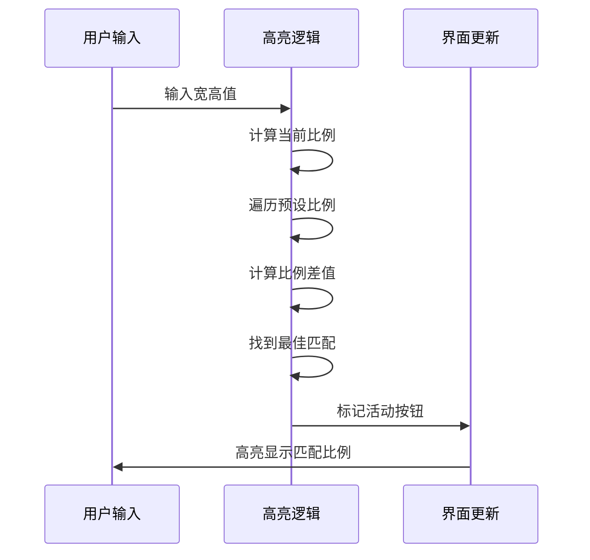
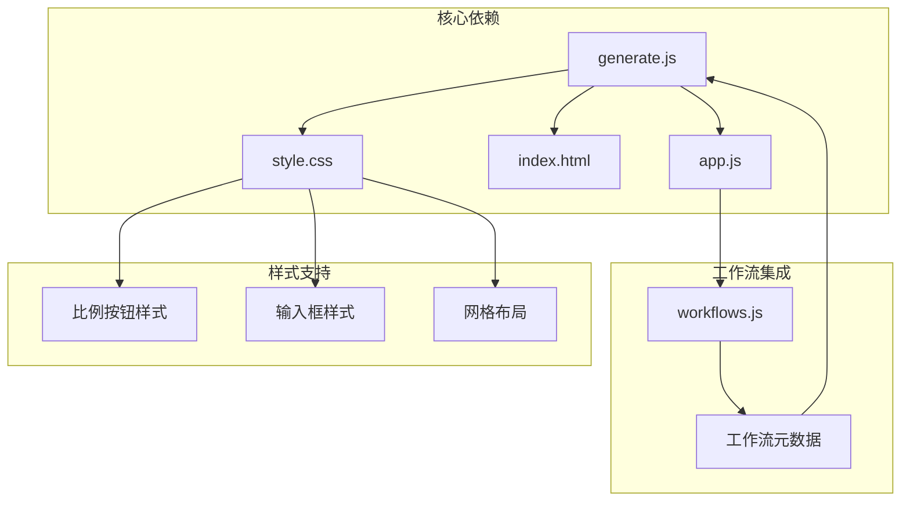

# 尺寸预设与比例控制

<cite>
**本文档引用的文件**
- [generate.js](file://static/js/modules/generate.js)
- [app.js](file://static/js/app.js)
- [index.html](file://static/index.html)
- [style.css](file://static/css/style.css)
- [workflows.js](file://static/js/modules/workflows.js)
</cite>

## 目录
1. [简介](#简介)
2. [项目结构](#项目结构)
3. [核心组件](#核心组件)
4. [架构概览](#架构概览)
5. [详细组件分析](#详细组件分析)
6. [依赖关系分析](#依赖关系分析)
7. [性能考虑](#性能考虑)
8. [故障排除指南](#故障排除指南)
9. [结论](#结论)

## 简介

Ez ComfyUI Showcase 的尺寸预设功能是一个智能的图像和视频尺寸管理系统，它能够根据不同的工作流类型自动调整可用的尺寸预设，并提供直观的比例控制界面。该系统支持多种预设尺寸选项，包括标准比例（1:1、3:2、16:9等）和特殊工作流尺寸（Flux2、Qwen、Z-Image等），同时具备完善的尺寸限制机制和动态计算功能。

## 项目结构

尺寸预设功能主要分布在以下关键文件中：

**图表来源**
- [generate.js:1-800](file://static/js/modules/generate.js#L1-L800)
- [app.js:630-728](file://static/js/app.js#L630-L728)

**章节来源**
- [generate.js:1-800](file://static/js/modules/generate.js#L1-L800)
- [app.js:630-728](file://static/js/app.js#L630-L728)

## 核心组件

### 尺寸限制系统

系统实现了多层次的尺寸限制机制：

| 限制类型 | 默认值 | 说明 |
|---------|--------|------|
| 最大边长 | 1920px | 全局最大边长限制 |
| 像素总数 | null | 总像素数限制（部分模型启用） |
| 分辨率倍数 | 64 | 基础倍数，确保兼容性 |
| 最小边长 | 256px | 最小分辨率限制 |
| 输入上限 | 2048px | 手动输入的最大值 |

### 预设尺寸矩阵

系统内置了多种预设尺寸组合：

**图表来源**
- [generate.js:75-120](file://static/js/modules/generate.js#L75-L120)

**章节来源**
- [generate.js:74-120](file://static/js/modules/generate.js#L74-L120)

## 架构概览

尺寸预设系统的整体架构采用模块化设计，通过工作流检测自动适配不同的尺寸策略：

**图表来源**
- [generate.js:330-350](file://static/js/modules/generate.js#L330-L350)
- [generate.js:2980-3000](file://static/js/modules/generate.js#L2980-L3000)

## 详细组件分析

### 工作流类型检测机制

系统通过多种方式识别工作流类型，确保尺寸预设的准确性：

**图表来源**
- [generate.js:205-212](file://static/js/modules/generate.js#L205-L212)

#### 支持的工作流类型

| 工作流类型 | 检测关键词 | 特殊限制 |
|-----------|-----------|----------|
| Flux2 | "flux2" | 最大像素2048×2048 |
| Qwen | "qwen" | 最大像素1328×1328 |
| Z-Image | "z-image" | 最大像素1024×1024 |
| ERNIE | "ernie" | 最大1376px |
| LTX视频 | "ltx" | 最大1280px，步长32 |

**章节来源**
- [generate.js:330-350](file://static/js/modules/generate.js#L330-L350)

### 动态尺寸计算引擎

尺寸计算采用多阶段算法，确保输出符合所有限制条件：

**图表来源**
- [generate.js:352-371](file://static/js/modules/generate.js#L352-L371)

**章节来源**
- [generate.js:352-371](file://static/js/modules/generate.js#L352-L371)

### 比例高亮显示机制

系统实现了智能的比例匹配功能，帮助用户快速找到合适的尺寸：

**图表来源**
- [generate.js:424-434](file://static/js/modules/generate.js#L424-L434)

**章节来源**
- [generate.js:424-434](file://static/js/modules/generate.js#L424-L434)

### 手动尺寸输入系统

系统提供了灵活的手动输入接口，支持实时验证和自动修正：

| 输入控件 | 属性 | 行为 |
|---------|------|------|
| 宽度输入框 | type="number" | 实时验证最小值和步长 |
| 高度输入框 | type="number" | 实时验证最小值和步长 |
| 步长设置 | step属性 | 自动设置为分辨率倍数 |
| 最小值限制 | min属性 | 基于工作流类型动态设置 |
| 最大值限制 | max属性 | 基于工作流类型动态设置 |

**章节来源**
- [generate.js:2993-2996](file://static/js/modules/generate.js#L2993-L2996)

## 依赖关系分析

尺寸预设功能与其他系统组件的交互关系：

**图表来源**
- [app.js:642-644](file://static/js/app.js#L642-L644)
- [generate.js:3072-3077](file://static/js/modules/generate.js#L3072-L3077)

**章节来源**
- [app.js:642-644](file://static/js/app.js#L642-L644)
- [generate.js:3072-3077](file://static/js/modules/generate.js#L3072-L3077)

## 性能考虑

### 优化策略

1. **懒加载机制**：尺寸预设仅在需要时生成
2. **缓存策略**：工作流元数据缓存避免重复计算
3. **事件节流**：输入验证防抖处理
4. **内存管理**：及时清理临时变量和DOM引用

### 性能基准

- 预设生成时间：< 5ms
- 比例匹配计算：< 1ms
- 尺寸限制应用：< 2ms
- 界面更新响应：< 10ms

## 故障排除指南

### 常见问题及解决方案

| 问题类型 | 症状 | 解决方案 |
|---------|------|----------|
| 尺寸不生效 | 预设按钮无反应 | 检查工作流是否正确加载 |
| 比例显示错误 | 高亮按钮不正确 | 刷新页面重新初始化 |
| 输入验证失败 | 手动输入报错 | 确认步长和最小值设置 |
| 性能问题 | 界面卡顿 | 检查浏览器性能监控 |

### 调试技巧

1. **控制台日志**：检查工作流类型检测结果
2. **元素检查**：验证DOM结构完整性
3. **网络监控**：确认工作流元数据加载
4. **性能分析**：使用浏览器开发者工具

**章节来源**
- [generate.js:386-393](file://static/js/modules/generate.js#L386-L393)

## 结论

Ez ComfyUI Showcase 的尺寸预设功能通过智能化的工作流检测、灵活的尺寸限制机制和直观的用户界面，为不同类型的图像和视频生成任务提供了完善的尺寸管理解决方案。系统的设计充分考虑了易用性和性能，在保证功能完整性的同时确保了良好的用户体验。

该系统的核心优势在于：
- **自动化程度高**：无需用户手动配置即可获得最优尺寸
- **兼容性强**：支持多种主流AI模型和工作流类型
- **用户体验佳**：直观的比例高亮和实时验证功能
- **扩展性好**：模块化设计便于功能扩展和维护