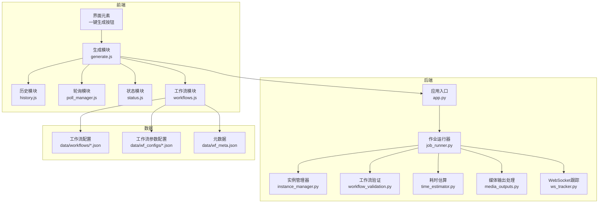
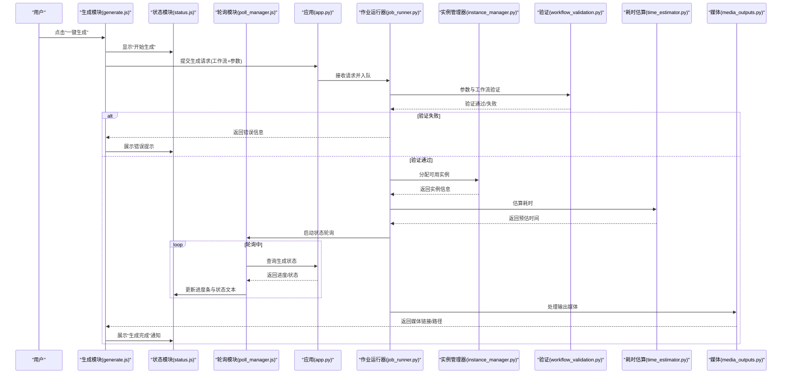
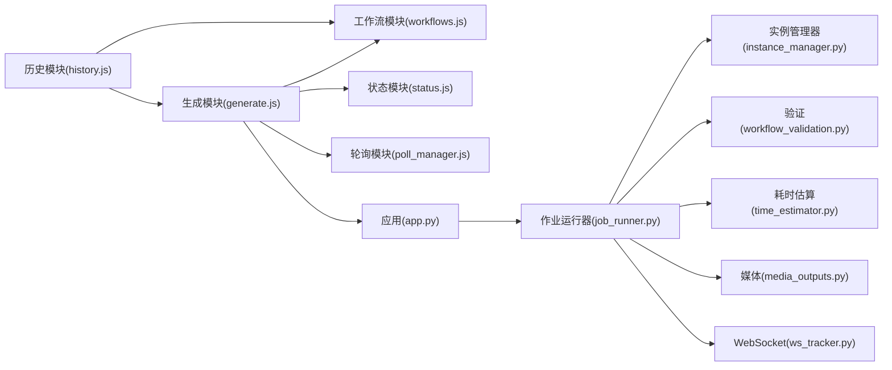

# 快速生成与历史复用

<cite>
**本文引用的文件**
- [generate.js](file://static/js/modules/generate.js)
- [history.js](file://static/js/modules/history.js)
- [job_runner.py](file://modules/job_runner.py)
- [instance_manager.py](file://modules/instance_manager.py)
- [workflow_validation.py](file://modules/workflow_validation.py)
- [time_estimator.py](file://modules/time_estimator.py)
- [poll_manager.js](file://static/js/modules/poll_manager.js)
- [status.js](file://static/js/modules/status.js)
- [workflows.js](file://static/js/modules/workflows.js)
- [media_outputs.py](file://modules/media_outputs.py)
- [ws_tracker.py](file://modules/ws_tracker.py)
- [app.py](file://app.py)
- [index.html](file://static/index.html)
</cite>

## 目录
1. [简介](#简介)
2. [项目结构](#项目结构)
3. [核心组件](#核心组件)
4. [架构总览](#架构总览)
5. [详细组件分析](#详细组件分析)
6. [依赖关系分析](#依赖关系分析)
7. [性能考量](#性能考量)
8. [故障排除指南](#故障排除指南)
9. [结论](#结论)
10. [附录](#附录)

## 简介
本文件聚焦 Ez ComfyUI Showcase 的“快速生成”功能，系统性阐述一键生成按钮的工作原理、参数验证与准备流程、与历史记录的关联与复用机制、生成状态的实时反馈、错误处理与异常应对、生成队列管理（并发控制、优先级与等待估算）、以及生成效率优化建议与最佳实践。目标是帮助用户与开发者高效、稳定地使用快速生成功能。

## 项目结构
围绕“快速生成”的前端模块主要位于 static/js/modules 下，后端逻辑集中在 modules 目录；工作流配置与元数据位于 data/workflows 与 data/wf_configs；历史记录与生成状态通过前端模块与后端服务交互实现。

图表来源
- [generate.js](file://static/js/modules/generate.js)
- [history.js](file://static/js/modules/history.js)
- [job_runner.py](file://modules/job_runner.py)
- [instance_manager.py](file://modules/instance_manager.py)
- [workflow_validation.py](file://modules/workflow_validation.py)
- [time_estimator.py](file://modules/time_estimator.py)
- [poll_manager.js](file://static/js/modules/poll_manager.js)
- [status.js](file://static/js/modules/status.js)
- [workflows.js](file://static/js/modules/workflows.js)
- [media_outputs.py](file://modules/media_outputs.py)
- [ws_tracker.py](file://modules/ws_tracker.py)
- [app.py](file://app.py)
- [index.html](file://static/index.html)

章节来源
- [generate.js](file://static/js/modules/generate.js)
- [history.js](file://static/js/modules/history.js)
- [job_runner.py](file://modules/job_runner.py)
- [instance_manager.py](file://modules/instance_manager.py)
- [workflow_validation.py](file://modules/workflow_validation.py)
- [time_estimator.py](file://modules/time_estimator.py)
- [poll_manager.js](file://static/js/modules/poll_manager.js)
- [status.js](file://static/js/modules/status.js)
- [workflows.js](file://static/js/modules/workflows.js)
- [media_outputs.py](file://modules/media_outputs.py)
- [ws_tracker.py](file://modules/ws_tracker.py)
- [app.py](file://app.py)
- [index.html](file://static/index.html)

## 核心组件
- 生成模块：负责触发一键生成、收集当前工作流与参数、调用后端接口、处理响应与错误。
- 历史模块：负责加载历史记录、解析历史中的工作流与参数、支持一键复用到当前编辑器。
- 作业运行器：接收生成请求，进行参数校验、实例分配、入队、执行与结果回传。
- 实例管理器：维护可用实例列表、健康状态、负载与分配策略。
- 工作流验证：对工作流与参数进行合法性检查，确保生成安全与可执行。
- 轮询模块：持续拉取生成状态，驱动前端进度条与状态提示。
- 状态模块：统一管理生成状态显示、错误提示与成功通知。
- 工作流模块：加载工作流配置与参数配置，支持快速切换与预设。
- 媒体输出处理：生成完成后处理输出媒体文件路径与预览。
- WebSocket 跟踪：在长连接场景下推送状态变更与日志增量。
- 应用入口：路由与服务端接口整合点，协调前后端交互。

章节来源
- [generate.js](file://static/js/modules/generate.js)
- [history.js](file://static/js/modules/history.js)
- [job_runner.py](file://modules/job_runner.py)
- [instance_manager.py](file://modules/instance_manager.py)
- [workflow_validation.py](file://modules/workflow_validation.py)
- [poll_manager.js](file://static/js/modules/poll_manager.js)
- [status.js](file://static/js/modules/status.js)
- [workflows.js](file://static/js/modules/workflows.js)
- [media_outputs.py](file://modules/media_outputs.py)
- [ws_tracker.py](file://modules/ws_tracker.py)
- [app.py](file://app.py)

## 架构总览
“快速生成”从界面点击开始，前端生成模块收集当前工作流与参数，调用后端生成接口；后端作业运行器进行参数验证与实例分配，进入生成队列；前端通过轮询或 WebSocket 获取实时状态；完成后由媒体输出模块处理产物并刷新预览。

图表来源
- [generate.js](file://static/js/modules/generate.js)
- [status.js](file://static/js/modules/status.js)
- [poll_manager.js](file://static/js/modules/poll_manager.js)
- [app.py](file://app.py)
- [job_runner.py](file://modules/job_runner.py)
- [instance_manager.py](file://modules/instance_manager.py)
- [workflow_validation.py](file://modules/workflow_validation.py)
- [time_estimator.py](file://modules/time_estimator.py)
- [media_outputs.py](file://modules/media_outputs.py)

## 详细组件分析

### 一键生成按钮与工作流采集
- 触发方式：界面元素绑定事件，调用生成模块的启动函数。
- 工作流采集：从工作流模块读取当前工作流 JSON 与参数配置，合并用户输入与默认参数。
- 参数准备：对必填字段进行非空校验，对数值范围、枚举值进行约束检查。
- 请求封装：将工作流与参数打包为生成请求，附加用户会话与设备信息。

章节来源
- [generate.js](file://static/js/modules/generate.js)
- [workflows.js](file://static/js/modules/workflows.js)

### 参数验证与准备工作
- 后端验证：作业运行器在接收到请求后，委托工作流验证模块进行合法性检查，包括节点完整性、参数类型与范围、资源占用上限等。
- 前端预检：生成模块在提交前进行轻量校验，避免明显无效请求进入后端。
- 准备工作：根据工作流类型与参数，准备必要的模型权重、临时目录与输出路径。

章节来源
- [job_runner.py](file://modules/job_runner.py)
- [workflow_validation.py](file://modules/workflow_validation.py)
- [generate.js](file://static/js/modules/generate.js)

### 与历史记录的关联与复用
- 历史加载：历史模块从后端 API 拉取历史记录，解析工作流名称、参数快照、生成时间与状态。
- 快速复用：点击历史项后，历史模块将对应工作流与参数注入当前工作流编辑器，无需手动填写。
- 关联机制：历史记录与工作流配置通过唯一标识符关联，确保复用的准确性与一致性。

章节来源
- [history.js](file://static/js/modules/history.js)
- [workflows.js](file://static/js/modules/workflows.js)

### 生成状态的实时反馈
- 开始生成：生成模块设置初始状态，清空上次结果，显示“开始生成”提示。
- 进度更新：轮询模块定时查询后端状态，状态模块根据返回值更新进度条与状态文本。
- 完成通知：生成完成后，媒体输出模块处理产物，状态模块展示“生成完成”通知，并提供下载或预览入口。

章节来源
- [generate.js](file://static/js/modules/generate.js)
- [poll_manager.js](file://static/js/modules/poll_manager.js)
- [status.js](file://static/js/modules/status.js)
- [media_outputs.py](file://modules/media_outputs.py)

### 错误处理与异常情况
- 参数错误：工作流验证失败时，后端返回具体错误原因，前端状态模块展示错误提示并高亮问题参数。
- 实例不可用：实例管理器检测到实例离线或过载时，作业运行器回退至备用实例或排队等待。
- 网络异常：轮询模块在超时或断连时自动重试，避免界面卡死；WebSocket 断开时切换为轮询模式。
- 生成中断：若生成过程中断，前端保留当前进度与参数，允许用户继续或重新开始。

章节来源
- [job_runner.py](file://modules/job_runner.py)
- [instance_manager.py](file://modules/instance_manager.py)
- [workflow_validation.py](file://modules/workflow_validation.py)
- [poll_manager.js](file://static/js/modules/poll_manager.js)
- [status.js](file://static/js/modules/status.js)
- [ws_tracker.py](file://modules/ws_tracker.py)

### 生成队列管理
- 并发控制：作业运行器限制同时运行的任务数量，避免实例过载。
- 优先级设置：支持按用户等级、付费状态或紧急程度设置优先级，高优先级任务优先分配实例。
- 等待时间估算：基于历史耗时与当前队列长度，使用耗时估算模块计算等待时间并反馈给用户。
- 动态调度：实例管理器根据负载动态调整分配策略，保障整体吞吐。

章节来源
- [job_runner.py](file://modules/job_runner.py)
- [instance_manager.py](file://modules/instance_manager.py)
- [time_estimator.py](file://modules/time_estimator.py)

### 实际操作示例与最佳实践
- 快速生成步骤
  - 在工作流编辑器中选择目标工作流，调整必要参数。
  - 点击“一键生成”，观察状态面板的进度与提示。
  - 生成完成后，点击预览或下载产物。
- 历史复用步骤
  - 打开历史面板，找到目标记录。
  - 点击“复用到编辑器”，工作流与参数自动填充。
  - 根据需要微调参数后再次生成。
- 最佳实践
  - 合理设置采样步数与分辨率，平衡质量与耗时。
  - 优先选择与工作流匹配的实例类型，避免频繁切换。
  - 使用历史记录保存常用参数组合，提升复用效率。
  - 在高峰期避开高峰时段，或提高优先级以缩短等待。

章节来源
- [generate.js](file://static/js/modules/generate.js)
- [history.js](file://static/js/modules/history.js)
- [status.js](file://static/js/modules/status.js)
- [workflows.js](file://static/js/modules/workflows.js)

## 依赖关系分析
生成模块与历史模块共同依赖工作流模块提供的配置加载能力；状态模块与轮询模块共同消费后端状态；作业运行器串联验证、实例管理与耗时估算；媒体输出模块在完成后接入产物处理链路。

图表来源
- [generate.js](file://static/js/modules/generate.js)
- [history.js](file://static/js/modules/history.js)
- [workflows.js](file://static/js/modules/workflows.js)
- [status.js](file://static/js/modules/status.js)
- [poll_manager.js](file://static/js/modules/poll_manager.js)
- [app.py](file://app.py)
- [job_runner.py](file://modules/job_runner.py)
- [instance_manager.py](file://modules/instance_manager.py)
- [workflow_validation.py](file://modules/workflow_validation.py)
- [time_estimator.py](file://modules/time_estimator.py)
- [media_outputs.py](file://modules/media_outputs.py)
- [ws_tracker.py](file://modules/ws_tracker.py)

章节来源
- [generate.js](file://static/js/modules/generate.js)
- [history.js](file://static/js/modules/history.js)
- [workflows.js](file://static/js/modules/workflows.js)
- [status.js](file://static/js/modules/status.js)
- [poll_manager.js](file://static/js/modules/poll_manager.js)
- [job_runner.py](file://modules/job_runner.py)
- [instance_manager.py](file://modules/instance_manager.py)
- [workflow_validation.py](file://modules/workflow_validation.py)
- [time_estimator.py](file://modules/time_estimator.py)
- [media_outputs.py](file://modules/media_outputs.py)
- [ws_tracker.py](file://modules/ws_tracker.py)
- [app.py](file://app.py)

## 性能考量
- 参数优化
  - 降低分辨率与步数可显著缩短耗时，适合快速预览。
  - 合理设置采样器与 CFG 值，在质量与稳定性间取得平衡。
- 实例选择
  - 优先选择 GPU 类型与显存充足的实例，减少失败与重试概率。
  - 对于长视频或高分辨率任务，预留充足实例资源。
- 队列策略
  - 合理设置优先级，避免低优先级任务长时间排队。
  - 将批量任务集中安排在低峰时段，提升整体吞吐。
- 前端体验
  - 使用轮询与 WebSocket 双通道，保证在网络波动时仍能获取状态。
  - 缓存常用工作流与参数，减少重复加载与解析时间。

## 故障排除指南
- 生成无响应
  - 检查网络连接与后端服务状态；查看轮询模块是否正常工作。
  - 若 WebSocket 断开，确认是否已切换为轮询模式。
- 参数报错
  - 根据后端返回的错误信息逐项修正；必要时回退到历史记录中的正确参数。
- 实例不可用
  - 查看实例管理器的状态列表，等待实例恢复或更换实例类型。
- 产物无法预览
  - 检查媒体输出模块是否成功写入路径；确认静态资源访问权限。

章节来源
- [poll_manager.js](file://static/js/modules/poll_manager.js)
- [status.js](file://static/js/modules/status.js)
- [job_runner.py](file://modules/job_runner.py)
- [instance_manager.py](file://modules/instance_manager.py)
- [media_outputs.py](file://modules/media_outputs.py)

## 结论
“快速生成”通过前端模块与后端服务的协同，实现了从参数采集、验证、实例分配到状态反馈与产物处理的完整闭环。结合历史记录的复用机制与队列管理策略，用户可以高效、稳定地完成各类生成任务。建议在日常使用中遵循参数优化、实例选择与队列策略的最佳实践，以获得更优的生成体验。

## 附录
- 快速生成界面入口位于首页，一键生成按钮位于工作流编辑器区域。
- 历史记录面板位于侧边栏，支持分页加载与搜索过滤。
- 如需进一步调试，可在浏览器开发者工具中查看网络请求与状态模块的日志输出。

章节来源
- [index.html](file://static/index.html)
- [generate.js](file://static/js/modules/generate.js)
- [history.js](file://static/js/modules/history.js)
- [status.js](file://static/js/modules/status.js)