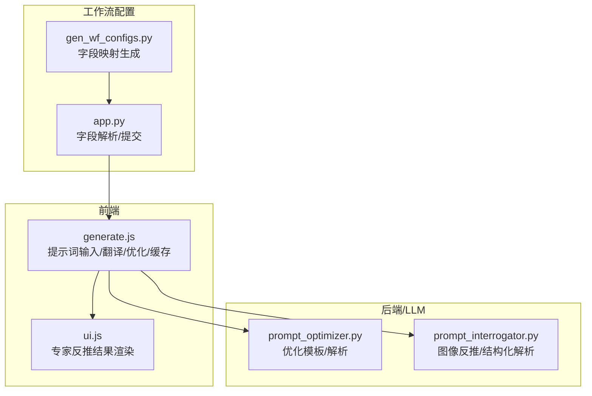
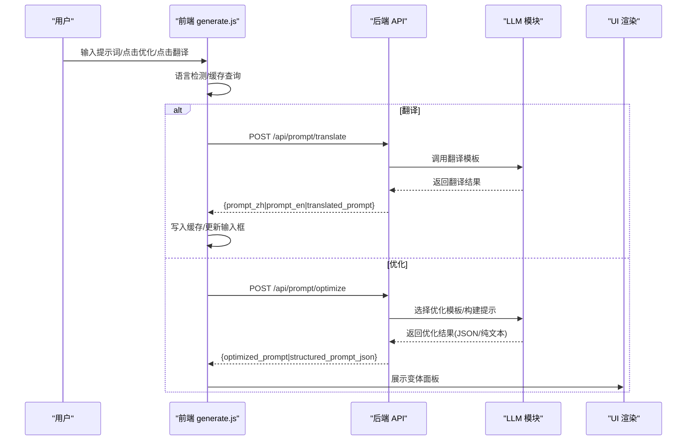
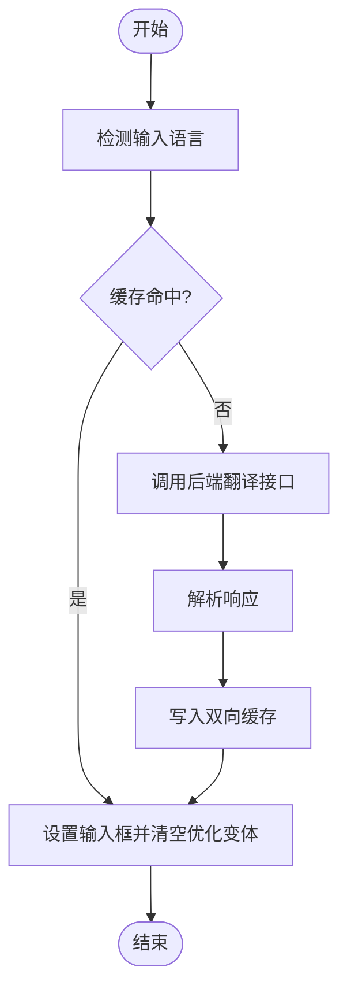
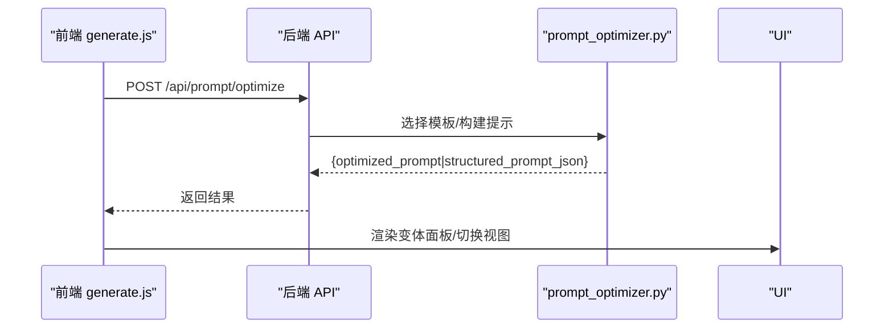
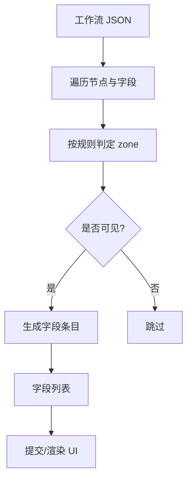
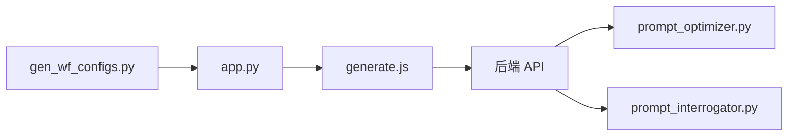

# 提示词输入与管理

<cite>
**本文引用的文件**
- [generate.js](file://static/js/modules/generate.js)
- [prompt_optimizer.py](file://modules/prompt_optimizer.py)
- [prompt_interrogator.py](file://modules/prompt_interrogator.py)
- [gen_wf_configs.py](file://scripts/gen_wf_configs.py)
- [app.py](file://app.py)
- [ui.js](file://static/js/modules/ui.js)
- [test_prompt_optimizer.py](file://tests/test_prompt_optimizer.py)
</cite>

## 目录
1. [简介](#简介)
2. [项目结构](#项目结构)
3. [核心组件](#核心组件)
4. [架构总览](#架构总览)
5. [详细组件分析](#详细组件分析)
6. [依赖关系分析](#依赖关系分析)
7. [性能考量](#性能考量)
8. [故障排查指南](#故障排查指南)
9. [结论](#结论)
10. [附录](#附录)

## 简介
本文件面向 Ez ComfyUI Showcase 的提示词输入与管理功能，围绕以下目标展开：
- 提示词输入框的基础使用：文本输入、清空、自动提示联动
- 多语言支持：中英文提示词的自动翻译、缓存与切换
- 提示词优化：一键优化、优化级别、结果获取与展示
- 模板与快捷输入：预设提示词与工作流字段映射
- 实际使用示例与最佳实践

## 项目结构
提示词相关能力由前端交互模块与后端/LLM 模块协同完成：
- 前端 generate.js：提供提示词输入、翻译、优化、缓存与 UI 展示
- 后端/LLM 模块 prompt_optimizer.py：定义优化模板、解析与结构化解析
- 后端/LLM 模块 prompt_interrogator.py：图像反推与结构化解析
- 工作流字段映射 gen_wf_configs.py：将 ComfyUI 节点字段映射为 UI 可编辑字段
- 后端 app.py：工作流字段元数据解析与提交
- UI 渲染 ui.js：专家反推结果的 UI 展示

图表来源
- [generate.js:1-200](file://static/js/modules/generate.js#L1-L200)
- [prompt_optimizer.py:1-120](file://modules/prompt_optimizer.py#L1-L120)
- [prompt_interrogator.py:1-120](file://modules/prompt_interrogator.py#L1-L120)
- [gen_wf_configs.py:46-93](file://scripts/gen_wf_configs.py#L46-L93)
- [app.py:5003-5041](file://app.py#L5003-L5041)
- [ui.js:255-279](file://static/js/modules/ui.js#L255-L279)

章节来源
- [generate.js:1-200](file://static/js/modules/generate.js#L1-L200)
- [prompt_optimizer.py:1-120](file://modules/prompt_optimizer.py#L1-L120)
- [prompt_interrogator.py:1-120](file://modules/prompt_interrogator.py#L1-L120)
- [gen_wf_configs.py:46-93](file://scripts/gen_wf_configs.py#L46-L93)
- [app.py:5003-5041](file://app.py#L5003-L5041)
- [ui.js:255-279](file://static/js/modules/ui.js#L255-L279)

## 核心组件
- 提示词输入与翻译
  - 前端检测输入语言，命中缓存则直接切换，否则调用后端翻译接口，成功后写入缓存并更新输入框
  - 缓存键由目标语言与标准化后的提示词组成，容量上限 160 条，超出则淘汰最旧条目
- 提示词优化
  - 前端触发优化请求，后端根据模式（图像/视频脚本）选择模板，返回优化后的纯文本与结构化 JSON
  - UI 展示“纯词汇/JSON”两种变体面板，支持一键复制
- 工作流字段映射
  - 自动识别节点类型与字段名，将“用户输入”类字段映射为 UI 可编辑区域
  - 支持种子类字段识别与类型标注
- 专家反推结果
  - UI 展示专家反推标题、合并结果与评分汇总

章节来源
- [generate.js:16-72](file://static/js/modules/generate.js#L16-L72)
- [generate.js:1164-1692](file://static/js/modules/generate.js#L1164-L1692)
- [generate.js:1695-1745](file://static/js/modules/generate.js#L1695-L1745)
- [prompt_optimizer.py:120-170](file://modules/prompt_optimizer.py#L120-L170)
- [prompt_optimizer.py:513-571](file://modules/prompt_optimizer.py#L513-L571)
- [gen_wf_configs.py:46-93](file://scripts/gen_wf_configs.py#L46-L93)
- [app.py:5003-5041](file://app.py#L5003-L5041)
- [ui.js:255-279](file://static/js/modules/ui.js#L255-L279)

## 架构总览
提示词处理的端到端流程如下：

图表来源
- [generate.js:1695-1745](file://static/js/modules/generate.js#L1695-L1745)
- [generate.js:1645-1692](file://static/js/modules/generate.js#L1645-L1692)
- [prompt_optimizer.py:120-170](file://modules/prompt_optimizer.py#L120-L170)

## 详细组件分析

### 提示词输入与清空
- 文本输入
  - 通过输入框 ID 获取 DOM，读取当前值并 trim
  - 优化/翻译按钮在请求期间禁用并显示加载态
- 清空操作
  - 前端提供清除提示词的 UI 行为（具体实现可在前端模块中查找）
  - 清空后同步清空优化变体面板与缓存提示词
- 自动提示联动
  - 优化完成后会清理优化变体面板，确保 UI 一致性

章节来源
- [generate.js:1645-1692](file://static/js/modules/generate.js#L1645-L1692)
- [generate.js:1164-1180](file://static/js/modules/generate.js#L1164-L1180)

### 多语言支持与缓存
- 语言检测
  - 基于 Unicode 区间判断是否包含中文字符，决定目标语言为 en 或 zh
- 翻译流程
  - 若缓存命中，直接设置输入框并清空优化变体
  - 未命中则调用后端翻译接口，成功后双向注册缓存（中/英互译键）
- 缓存策略
  - sessionStorage 存储，键格式为“目标语言 + 标准化提示词”
  - 最多保存 160 条，超过则淘汰最旧条目

图表来源
- [generate.js:16-72](file://static/js/modules/generate.js#L16-L72)
- [generate.js:1695-1745](file://static/js/modules/generate.js#L1695-L1745)

章节来源
- [generate.js:16-72](file://static/js/modules/generate.js#L16-L72)
- [generate.js:1695-1745](file://static/js/modules/generate.js#L1695-L1745)

### 提示词优化
- 触发与参数
  - 前端读取输入框值，构造请求体（包含模式、最大新 token、上下文等）
  - 模式为视频脚本时使用更大 token 上限
- 后端模板与解析
  - 根据模式选择图像或视频脚本优化模板
  - 返回优化后的纯文本与结构化 JSON；前端解析并展示
- 结果展示
  - UI 提供“纯词汇/JSON”两种变体切换按钮
  - 成功后通过 toast 提示并清空优化变体面板

图表来源
- [generate.js:1645-1692](file://static/js/modules/generate.js#L1645-L1692)
- [prompt_optimizer.py:120-170](file://modules/prompt_optimizer.py#L120-L170)

章节来源
- [generate.js:1645-1692](file://static/js/modules/generate.js#L1645-L1692)
- [prompt_optimizer.py:120-170](file://modules/prompt_optimizer.py#L120-L170)
- [test_prompt_optimizer.py:542-561](file://tests/test_prompt_optimizer.py#L542-L561)

### 专家反推结果展示
- UI 渲染
  - 根据结果类型显示标题与合并结果
  - 支持专家模式/单专家模式标题差异
- 数据来源
  - 专家反推结果经结构化解析后，前端 UI 展示

章节来源
- [ui.js:255-279](file://static/js/modules/ui.js#L255-L279)
- [prompt_interrogator.py:2901-2928](file://modules/prompt_interrogator.py#L2901-L2928)

### 工作流字段映射与提示词关联
- 字段识别规则
  - 通过节点 class_type 与字段名判断是否为“用户输入”字段
  - 支持 CLIPTextEncode 的 text 字段识别
- 种子字段识别
  - 对特定节点类型的字段进行“种子”类型标注
- 后端解析
  - 将工作流节点映射为 UI 字段列表，包含节点 ID、字段名、类型与值

图表来源
- [gen_wf_configs.py:46-93](file://scripts/gen_wf_configs.py#L46-L93)
- [gen_wf_configs.py:139-174](file://scripts/gen_wf_configs.py#L139-L174)
- [app.py:5003-5041](file://app.py#L5003-L5041)

章节来源
- [gen_wf_configs.py:46-93](file://scripts/gen_wf_configs.py#L46-L93)
- [gen_wf_configs.py:139-174](file://scripts/gen_wf_configs.py#L139-L174)
- [app.py:5003-5041](file://app.py#L5003-L5041)

## 依赖关系分析
- 前端 generate.js 依赖：
  - API 接口：/api/prompt/translate、/api/prompt/optimize
  - 本地缓存：sessionStorage
  - UI 工具：toast、图标、按钮状态切换
- 后端/LLM 模块：
  - prompt_optimizer.py：提供优化模板、结构化解析与字段规范化
  - prompt_interrogator.py：提供图像反推与结构化解析
- 工作流配置：
  - gen_wf_configs.py：将 ComfyUI 节点字段映射为 UI 字段
  - app.py：解析字段元数据并参与提交

图表来源
- [generate.js:1695-1745](file://static/js/modules/generate.js#L1695-L1745)
- [prompt_optimizer.py:120-170](file://modules/prompt_optimizer.py#L120-L170)
- [prompt_interrogator.py:1-120](file://modules/prompt_interrogator.py#L1-L120)
- [gen_wf_configs.py:46-93](file://scripts/gen_wf_configs.py#L46-L93)
- [app.py:5003-5041](file://app.py#L5003-L5041)

章节来源
- [generate.js:1695-1745](file://static/js/modules/generate.js#L1695-L1745)
- [prompt_optimizer.py:120-170](file://modules/prompt_optimizer.py#L120-L170)
- [prompt_interrogator.py:1-120](file://modules/prompt_interrogator.py#L1-L120)
- [gen_wf_configs.py:46-93](file://scripts/gen_wf_configs.py#L46-L93)
- [app.py:5003-5041](file://app.py#L5003-L5041)

## 性能考量
- 前端缓存
  - sessionStorage 读写，容量上限 160 条，避免频繁网络请求
- 令牌限制
  - 优化请求根据模式调整 max_new_tokens，视频脚本模式使用更高上限
- UI 响应
  - 请求期间禁用按钮并显示加载态，减少无效交互

## 故障排查指南
- 翻译失败
  - 检查输入是否为空、网络是否可达、后端接口返回是否包含错误详情
  - 查看前端 toast 提示与控制台错误
- 优化结果为空
  - 确认后端返回的优化结果字段是否为空，必要时重试或调整输入
- 字段映射异常
  - 检查工作流节点 class_type 与字段名是否符合识别规则
  - 确认后端解析字段元数据是否成功

章节来源
- [generate.js:1695-1745](file://static/js/modules/generate.js#L1695-L1745)
- [generate.js:1645-1692](file://static/js/modules/generate.js#L1645-L1692)
- [app.py:5003-5041](file://app.py#L5003-L5041)

## 结论
本功能通过前端交互与后端/LLM 模块的协作，实现了提示词的智能输入、多语言切换与缓存、一键优化与结构化解析、以及工作流字段的自动映射。配合专家反推结果展示，能够显著提升提示词质量与生成效果。

## 附录

### 使用示例与最佳实践
- 基础使用
  - 在提示词输入框中输入中文或英文，点击“中英切换”按钮自动检测语言并切换
  - 输入为空时点击优化/翻译会提示警告并聚焦输入框
- 多语言切换
  - 首次翻译后会缓存结果，再次切换相同语言将直接命中缓存
  - 缓存容量上限为 160 条，避免内存膨胀
- 优化与变体
  - 视频脚本模式使用更大 token 上限，适合长序列提示
  - 优化完成后可切换“纯词汇/JSON”视图，便于复制到工作流字段
- 工作流字段映射
  - 用户输入类字段会出现在 UI 中，可直接编辑
  - 种子字段会标注为“seed”类型，便于随机化控制

章节来源
- [generate.js:16-72](file://static/js/modules/generate.js#L16-L72)
- [generate.js:1645-1692](file://static/js/modules/generate.js#L1645-L1692)
- [gen_wf_configs.py:46-93](file://scripts/gen_wf_configs.py#L46-L93)
- [app.py:5003-5041](file://app.py#L5003-L5041)