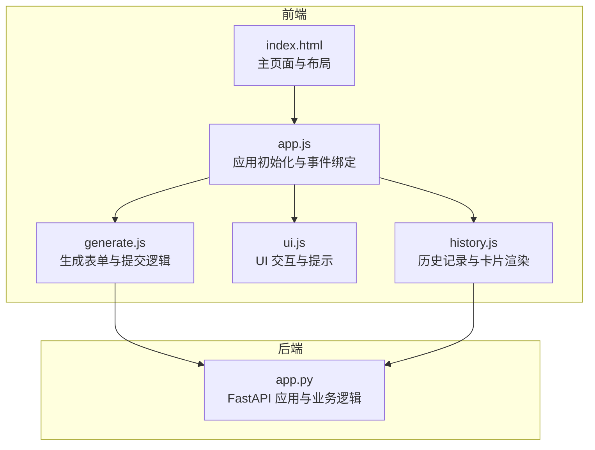
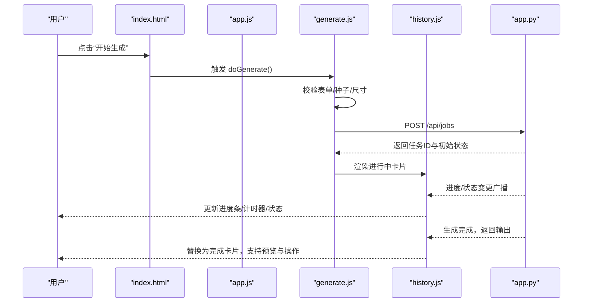
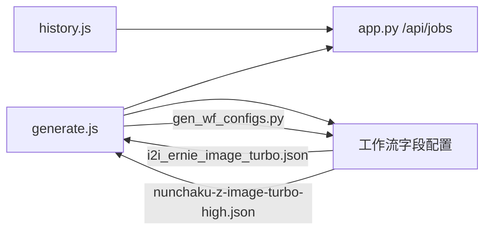

# 生成界面操作

<cite>
**本文引用的文件**
- [index.html](file://static/index.html)
- [app.js](file://static/js/app.js)
- [generate.js](file://static/js/modules/generate.js)
- [ui.js](file://static/js/modules/ui.js)
- [history.js](file://static/js/modules/history.js)
- [app.py](file://app.py)
- [i2i_ernie_image_turbo.json](file://data/wf_configs/i2i_ernie_image_turbo.json)
- [nunchaku-z-image-turbo-high.json](file://data/wf_configs/nunchaku-z-image-turbo-high.json)
- [i2i_ernie_image.json](file://data/wf_configs/i2i_ernie_image.json)
- [gen_wf_configs.py](file://scripts/gen_wf_configs.py)
</cite>

## 目录
1. [简介](#简介)
2. [项目结构](#项目结构)
3. [核心组件](#核心组件)
4. [架构总览](#架构总览)
5. [详细组件分析](#详细组件分析)
6. [依赖关系分析](#依赖关系分析)
7. [性能考虑](#性能考虑)
8. [故障排除指南](#故障排除指南)
9. [结论](#结论)
10. [附录](#附录)

## 简介
本操作指南面向 Ez ComfyUI Showcase 的“生成界面”，帮助用户高效完成图像/视频生成任务。内容涵盖：
- 生成控制面板：Prompt 输入、尺寸预设、采样器与调度器选择、步数设置等
- 种子值使用：固定种子与随机种子的区别及适用场景
- 详细参数面板：CFG Scale、Denoising Strength、Batch Count 等高级参数
- 快速出图：一键复用历史配置重新生成
- 生成状态与进度：按钮状态、排队/生成/保存阶段、实时反馈
- 失败排查：常见错误与处理建议
- 实操示例与最佳实践

## 项目结构
生成界面由前端 HTML 与模块化 JS 组成，并通过后端 API 提供工作流、状态与作业管理能力。

图表来源
- [index.html:292-346](file://static/index.html#L292-L346)
- [app.js:630-728](file://static/js/app.js#L630-L728)
- [generate.js:1455-3570](file://static/js/modules/generate.js#L1455-L3570)
- [history.js:460-728](file://static/js/modules/history.js#L460-L728)
- [app.py:18-60](file://app.py#L18-L60)

章节来源
- [index.html:292-346](file://static/index.html#L292-L346)
- [app.js:630-728](file://static/js/app.js#L630-L728)

## 核心组件
- 生成控制面板
  - Prompt 输入区：支持多语言提示词，可结合风格预设
  - 尺寸与比例：预设比例按钮与宽高输入联动
  - 采样器与调度器：根据工作流动态渲染
  - 步数设置：步数范围随工作流而定
- 种子值
  - 固定种子：便于复现与一致性
  - 随机种子：每次生成不同结果
- 详细参数面板
  - CFG Scale：控制提示词与模型一致性
  - Denoising Strength：图像生成去噪强度
  - Batch Count：批量生成数量
- 快速出图
  - 展示历史配置，一键复用
- 生成按钮与状态
  - 开始生成、暂停、取消
  - 队列中、生成中、保存中、完成/失败
- 历史与预览
  - 出图历史瀑布流，支持搜索、筛选、收藏、导出

章节来源
- [generate.js:2958-3570](file://static/js/modules/generate.js#L2958-L3570)
- [history.js:514-728](file://static/js/modules/history.js#L514-L728)

## 架构总览
生成流程从前端表单收集参数，经后端 API 提交至 ComfyUI 实例执行，期间通过 WebSocket 与轮询获取进度，完成后在历史区呈现。

图表来源
- [index.html:312-315](file://static/index.html#L312-L315)
- [app.js:647-651](file://static/js/app.js#L647-L651)
- [generate.js:1455-1470](file://static/js/modules/generate.js#L1455-L1470)
- [history.js:514-728](file://static/js/modules/history.js#L514-L728)
- [app.py:18-60](file://app.py#L18-L60)

## 详细组件分析

### 生成控制面板
- Prompt 输入
  - 支持多语言提示词，可叠加风格预设
  - 可通过“清除”按钮清空输入
- 尺寸与比例
  - 预设比例按钮（如 1:1、16:9 等），点击自动填充宽高
  - 宽高输入联动：输入变化时高亮匹配比例
  - 尺寸限制按工作流自动约束（像素上限、边长最小值、倍数）
- 采样器与调度器
  - 根据工作流字段类型动态渲染为下拉选择
  - 常见采样器：euler、dpmpp_2m、ddim 等
  - 常见调度器：karras、simple、sgm_uniform 等
- 步数设置
  - 步数范围因工作流而异（如 1–16 或 1–60）
  - 步数影响生成质量与耗时

章节来源
- [generate.js:395-438](file://static/js/modules/generate.js#L395-L438)
- [generate.js:3179-3196](file://static/js/modules/generate.js#L3179-L3196)
- [i2i_ernie_image_turbo.json:61-116](file://data/wf_configs/i2i_ernie_image_turbo.json#L61-L116)
- [i2i_ernie_image.json:63-116](file://data/wf_configs/i2i_ernie_image.json#L63-L116)
- [gen_wf_configs.py:117-137](file://scripts/gen_wf_configs.py#L117-L137)

### 种子值使用
- 固定种子
  - 在种子输入框中填入整数，确保相同参数与种子得到一致结果
  - 适合需要复现实验、对比或批处理
- 随机种子
  - 点击“🎲”按钮启用随机种子，每次生成自动分配新种子
  - 适合探索多样性与创意产出
- 行为差异
  - 若未启用随机种子，请求体中会显式携带固定种子
  - 启用随机种子时，后端将忽略显式种子字段

章节来源
- [generate.js:465-478](file://static/js/modules/generate.js#L465-L478)
- [generate.js:3186-3188](file://static/js/modules/generate.js#L3186-L3188)
- [ui.js:729-732](file://static/js/modules/ui.js#L729-L732)

### 详细参数面板
- CFG Scale（Classifier-Free Guidance）
  - 控制提示词与图像一致性，过高可能过拟合提示，过低可能导致漂移
  - 典型范围：0–8（具体取决于工作流）
- Denoising Strength（去噪强度）
  - 图生图类工作流常用，控制去噪程度
  - 典型范围：0–1，步进 0.05
- Batch Count（批量数量）
  - 一次生成多张图片，注意显存占用与队列等待
- 其他高级参数
  - 不同工作流还可能包含分辨率、帧率、帧数、位移等参数，按字段类型渲染

章节来源
- [i2i_ernie_image_turbo.json:72-82](file://data/wf_configs/i2i_ernie_image_turbo.json#L72-L82)
- [nunchaku-z-image-turbo-high.json:134-144](file://data/wf_configs/nunchaku-z-image-turbo-high.json#L134-L144)

### 快速出图与历史复用
- 快速出图区域
  - 展示“快速出图”折叠面板，包含常用字段与“详细参数”开关
- 历史复用
  - 在历史区点击任意卡片，触发“恢复任务”动作，自动填充表单字段
  - 支持一键复用历史配置重新生成

章节来源
- [index.html:305-315](file://static/index.html#L305-L315)
- [history.js:672-728](file://static/js/modules/history.js#L672-L728)

### 生成按钮状态与进度
- 按钮状态
  - “开始生成”：提交任务，进入排队
  - “取消”：仅在排队/生成阶段有效
- 阶段状态
  - 队列中（queued）、准备中（preparing）、提交中（submitting）、生成中（generating）、保存中（downloading）、完成（done）、失败（error）
- 实时反馈
  - 进度条百分比、当前节点、采样步数、计时器
  - 生成完成时，卡片从“进行中”过渡为“完成”，支持预览与导出

章节来源
- [history.js:514-728](file://static/js/modules/history.js#L514-L728)
- [app.js:536-586](file://static/js/app.js#L536-L586)

### 生成过程中的实时反馈
- 卡片内状态文本与图标
- 进度条与未知进度提示
- 计时器显示已用时与预估剩余
- 下载阶段隐藏进度条，显示“保存结果”状态

章节来源
- [history.js:486-513](file://static/js/modules/history.js#L486-L513)
- [history.js:591-655](file://static/js/modules/history.js#L591-L655)

## 依赖关系分析
- 前端模块耦合
  - app.js 初始化并挂载模块，绑定生成按钮事件
  - generate.js 负责表单渲染、参数校验与提交
  - history.js 负责历史卡片渲染与状态更新
  - ui.js 提供通用 UI 交互与提示
- 后端接口
  - /api/jobs：提交任务、取消、重试、销毁
  - /api/workflows/{name}/fields：获取工作流字段定义
  - /api/status、/api/comfyui/status：实例与 GPU 状态
- 数据与配置
  - 工作流字段配置决定表单控件类型与取值范围
  - 生成配置脚本自动生成字段类型与选项

图表来源
- [generate.js:1455-3570](file://static/js/modules/generate.js#L1455-L3570)
- [history.js:460-728](file://static/js/modules/history.js#L460-L728)
- [i2i_ernie_image_turbo.json:61-116](file://data/wf_configs/i2i_ernie_image_turbo.json#L61-L116)
- [nunchaku-z-image-turbo-high.json:134-144](file://data/wf_configs/nunchaku-z-image-turbo-high.json#L134-L144)
- [gen_wf_configs.py:117-137](file://scripts/gen_wf_configs.py#L117-L137)

章节来源
- [generate.js:1455-3570](file://static/js/modules/generate.js#L1455-L3570)
- [history.js:460-728](file://static/js/modules/history.js#L460-L728)
- [gen_wf_configs.py:117-137](file://scripts/gen_wf_configs.py#L117-L137)

## 性能考虑
- 显存与实例负载
  - GPU 状态栏实时显示显存使用与温度，避免在高负载时段提交大批量任务
- 步数与分辨率权衡
  - 步数越高、分辨率越大，耗时与显存占用越高
- 批量生成
  - 合理设置 Batch Count，避免超出实例显存导致失败
- 采样器与调度器
  - 不同采样器/调度器组合对速度与质量影响显著，建议先用较慢但稳定的组合验证参数

## 故障排除指南
- 常见失败原因
  - 参数设置不当：步数过低、CFG 过大、分辨率超限
  - 实例资源不足：显存占用过高、实例离线或卡死
  - 网络/超时：提交阶段或生成阶段超时
- 处理建议
  - 降低分辨率或步数，减小 CFG
  - 切换采样器/调度器，尝试更稳健的组合
  - 查看 GPU 状态栏与实例弹窗，必要时重启实例
  - 使用“重试”按钮重新提交失败任务
- 错误提示与日志
  - 前端 Toast 与历史卡片状态文本提示当前阶段
  - 后端日志记录阶段与错误详情，便于定位问题

章节来源
- [app.py:296-303](file://app.py#L296-L303)
- [history.js:730-734](file://static/js/modules/history.js#L730-L734)

## 结论
通过合理配置生成控制面板与详细参数、正确使用种子策略、利用历史复用与实时进度反馈，用户可在 Ez ComfyUI Showcase 中高效完成高质量的图像/视频生成任务。遇到问题时，优先检查参数合理性与实例状态，结合重试与日志定位根因。

## 附录

### 实操示例与最佳实践
- 文生图
  - 使用“16:9”或“3:2”比例，步数 20–30，CFG 5–7，随机种子探索
- 图生图
  - Denoising Strength 0.4–0.6，步数 12–20，固定种子对比效果
- 批量生成
  - Batch Count 1–4，逐步提升以观察显存占用
- 参数微调
  - 先用“草稿”采样器/调度器快速验证，再切换到“高质量”组合

### 字段与参数参考
- 采样器与调度器选项
  - 采样器：euler、dpmpp_2m、ddim 等
  - 调度器：karras、simple、sgm_uniform 等
- 典型参数范围
  - 步数：1–60（依工作流而定）
  - CFG：0–8（依工作流而定）
  - Denoising：0–1（步进 0.05）

章节来源
- [gen_wf_configs.py:117-137](file://scripts/gen_wf_configs.py#L117-L137)
- [i2i_ernie_image_turbo.json:61-116](file://data/wf_configs/i2i_ernie_image_turbo.json#L61-L116)
- [nunchaku-z-image-turbo-high.json:134-144](file://data/wf_configs/nunchaku-z-image-turbo-high.json#L134-L144)