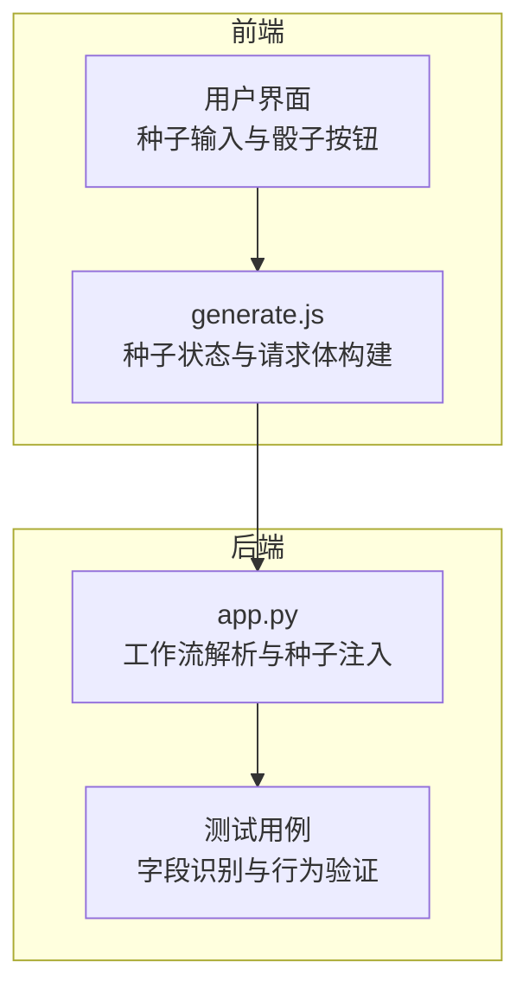
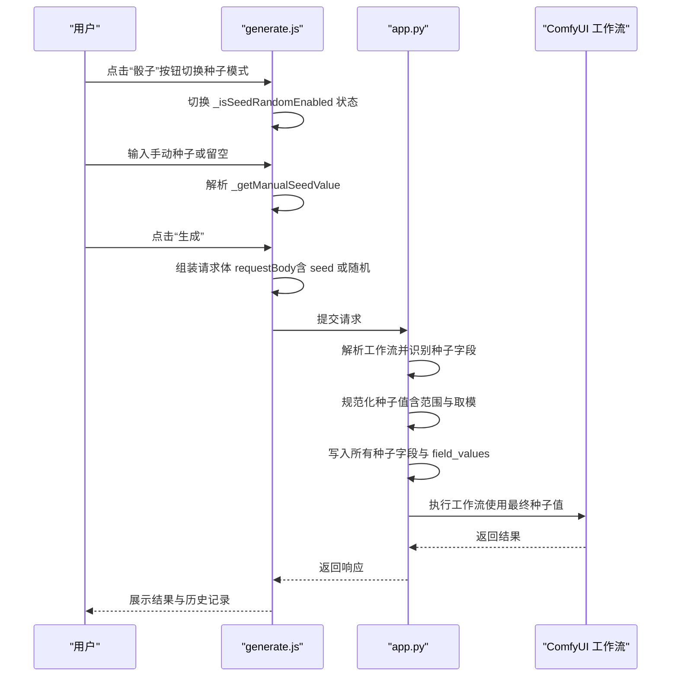
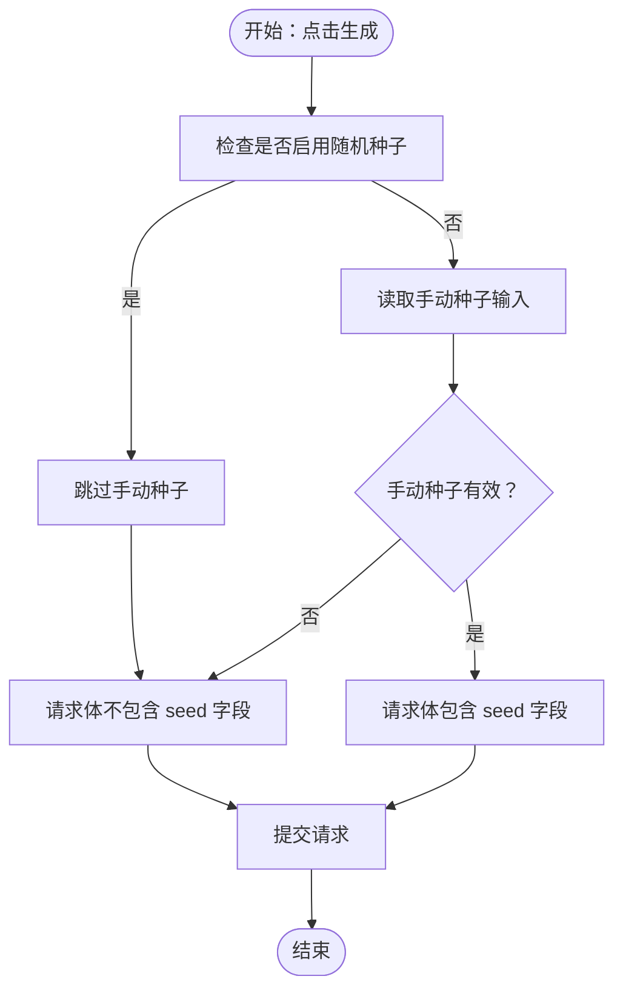
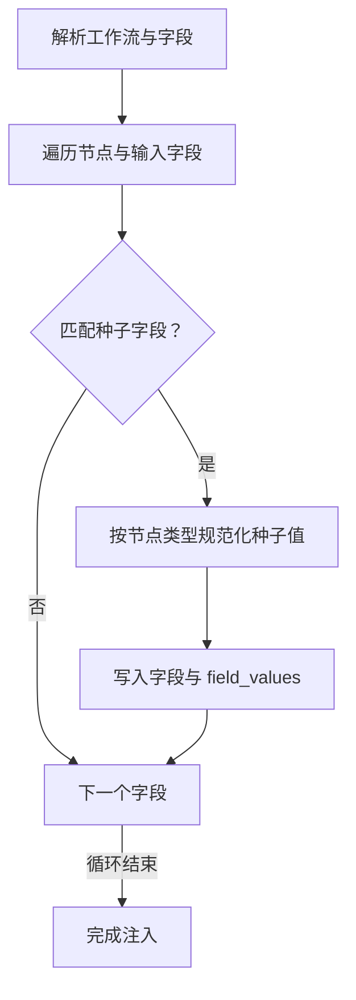
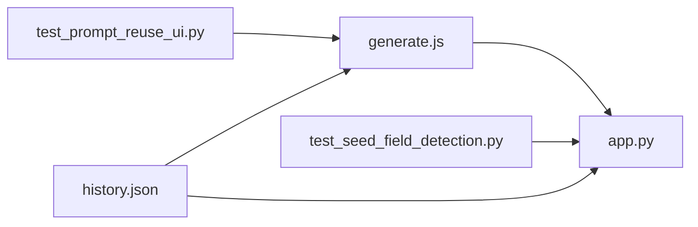

# 种子值管理

<cite>
**本文引用的文件**
- [app.py](file://app.py)
- [generate.js](file://static/js/modules/generate.js)
- [style.css](file://static/css/style.css)
- [test_seed_field_detection.py](file://tests/test_seed_field_detection.py)
- [test_prompt_reuse_ui.py](file://tests/test_prompt_reuse_ui.py)
- [history.json](file://data/history/history.json)
</cite>

## 目录
1. [简介](#简介)
2. [项目结构](#项目结构)
3. [核心组件](#核心组件)
4. [架构总览](#架构总览)
5. [详细组件分析](#详细组件分析)
6. [依赖分析](#依赖分析)
7. [性能考量](#性能考量)
8. [故障排查指南](#故障排查指南)
9. [结论](#结论)
10. [附录](#附录)

## 简介
本章节面向 Ez ComfyUI Showcase 的“种子值管理”功能，系统阐述种子值的概念、作用与实现机制，覆盖以下主题：
- 种子值对生成结果可重复性与随机性的控制原理
- 固定种子与随机种子两种模式的差异与适用场景
- 骰子按钮切换种子模式的交互流程
- 手动种子输入的校验、范围与格式要求
- 在不同工作流（图像生成、图像编辑、重绘、视频相关）中的种子管理策略
- 最佳实践：保存与复用特定种子值、实验与对比方法
- 种子值与工作流参数的交互关系与注意事项

## 项目结构
围绕种子值管理的关键代码分布在前端与后端两部分：
- 前端负责用户交互与请求体构建（generate.js）
- 后端负责工作流解析、字段识别、种子规范化与注入（app.py）
- 测试用例验证种子字段识别、随机种子覆盖、历史记录中的种子恢复等行为（tests）

图表来源
- [generate.js:448-472](file://static/js/modules/generate.js#L448-L472)
- [app.py:4302-4355](file://app.py#L4302-L4355)
- [test_seed_field_detection.py:124-198](file://tests/test_seed_field_detection.py#L124-L198)

章节来源
- [generate.js:448-472](file://static/js/modules/generate.js#L448-L472)
- [app.py:4302-4355](file://app.py#L4302-L4355)
- [test_seed_field_detection.py:124-198](file://tests/test_seed_field_detection.py#L124-L198)

## 核心组件
- 前端种子状态管理与交互
  - 骰子按钮用于切换“随机种子”模式，激活时表示本次生成使用随机种子；关闭时使用手动输入的种子
  - 手动种子输入框支持数值校验，非数字将被忽略
  - 当存在可恢复的种子字段值时，从历史记录恢复种子值
- 后端种子字段识别与规范化
  - 自动识别工作流中所有“种子字段”，包括显式名为 seed/noise_seed 的字段，以及带有“seed”关键词的字段
  - 对特定节点（如 SeedVR2VideoUpscaler）进行 32 位无符号整数范围限制与取模归一化
  - 将生成的随机种子统一写入所有识别到的种子字段，并同步到 field_values，确保提交时一致性

章节来源
- [generate.js:448-472](file://static/js/modules/generate.js#L448-L472)
- [generate.js:1164-1168](file://static/js/modules/generate.js#L1164-L1168)
- [app.py:4302-4355](file://app.py#L4302-L4355)
- [app.py:4313-4333](file://app.py#L4313-L4333)

## 架构总览
下图展示了从用户点击骰子按钮到后端完成种子注入的整体流程。

图表来源
- [generate.js:448-472](file://static/js/modules/generate.js#L448-L472)
- [generate.js:1164-1168](file://static/js/modules/generate.js#L1164-L1168)
- [app.py:4302-4355](file://app.py#L4302-L4355)

## 详细组件分析

### 前端种子交互与请求体构建
- 骰子按钮状态
  - 通过类名与 aria-pressed 属性表达“随机种子”模式是否启用
  - 切换逻辑由 toggleSeedRandom 调用内部函数更新状态
- 手动种子输入
  - 从 .seed-group input[type="number"] 获取值
  - 使用 parseInt 进行数值校验，非法值返回 null
- 请求体构建
  - 若“随机种子”未启用，则将手动种子写入 requestBody.seed
  - 若启用，则不传入显式 seed，由后端生成随机种子并注入工作流

图表来源
- [generate.js:448-472](file://static/js/modules/generate.js#L448-L472)
- [generate.js:1164-1168](file://static/js/modules/generate.js#L1164-L1168)

章节来源
- [generate.js:448-472](file://static/js/modules/generate.js#L448-L472)
- [generate.js:1164-1168](file://static/js/modules/generate.js#L1164-L1168)
- [style.css:2310-2323](file://static/css/style.css#L2310-L2323)

### 后端种子字段识别与规范化
- 字段识别规则
  - 显式字段名 seed/noise_seed
  - 字段名为 value 且节点标题或 class_type 包含“seed”
- 规范化策略
  - 对 SeedVR2VideoUpscaler 的 seed 字段进行 32 位无符号整数范围限制（0 到 4294967295）
  - 超出范围时按模运算归一化，保证落在合法区间内
- 注入与同步
  - 将生成的随机种子写入所有识别到的种子字段
  - 同步更新 field_values，确保后续提交一致

图表来源
- [app.py:4302-4355](file://app.py#L4302-L4355)
- [app.py:4313-4333](file://app.py#L4313-L4333)

章节来源
- [app.py:4302-4355](file://app.py#L4302-L4355)
- [app.py:4313-4333](file://app.py#L4313-L4333)

### 历史记录中的种子恢复
- 当历史项包含 seed 字段且其 field_values 中存在可恢复的种子字段时，会优先使用历史种子值
- 这保证了相同工作流与参数下的可重复性，便于复现实验结果

章节来源
- [test_prompt_reuse_ui.py:54-71](file://tests/test_prompt_reuse_ui.py#L54-L71)
- [history.json:8-1150](file://data/history/history.json#L8-L1150)

## 依赖分析
- 前端 generate.js 依赖后端 app.py 的种子字段识别与规范化能力
- 测试用例 test_seed_field_detection.py 与 test_prompt_reuse_ui.py 验证前端与后端的行为一致性
- 历史记录 history.json 存储种子值，支撑种子恢复与复现

图表来源
- [generate.js:448-472](file://static/js/modules/generate.js#L448-L472)
- [app.py:4302-4355](file://app.py#L4302-L4355)
- [test_seed_field_detection.py:124-198](file://tests/test_seed_field_detection.py#L124-L198)
- [test_prompt_reuse_ui.py:54-71](file://tests/test_prompt_reuse_ui.py#L54-L71)
- [history.json:8-1150](file://data/history/history.json#L8-L1150)

章节来源
- [generate.js:448-472](file://static/js/modules/generate.js#L448-L472)
- [app.py:4302-4355](file://app.py#L4302-L4355)
- [test_seed_field_detection.py:124-198](file://tests/test_seed_field_detection.py#L124-L198)
- [test_prompt_reuse_ui.py:54-71](file://tests/test_prompt_reuse_ui.py#L54-L71)
- [history.json:8-1150](file://data/history/history.json#L8-L1150)

## 性能考量
- 种子值计算与注入发生在请求提交前，对整体生成性能影响极小
- 字段扫描与规范化为 O(N) 复杂度，其中 N 为工作流节点数量
- 建议在批量生成时保持“固定种子”以减少不必要的随机性开销，仅在需要探索多样性时启用“随机种子”

## 故障排查指南
- 手动种子无效
  - 检查输入框是否为合法整数；非数字会被忽略
  - 确认“随机种子”按钮未处于启用状态（若启用则不会使用手动种子）
- 种子值范围错误
  - 对于 SeedVR2VideoUpscaler 的 seed 字段，超出 0~4294967295 范围会被自动归一化
- 历史记录无法恢复种子
  - 确认历史项包含 seed 字段，且 field_values 中存在可恢复的种子字段键
- 视频相关工作流分辨率联动
  - 某些视频超分工作流会根据参考视频尺寸动态调整分辨率字段，注意与种子值的组合使用

章节来源
- [generate.js:448-472](file://static/js/modules/generate.js#L448-L472)
- [generate.js:1164-1168](file://static/js/modules/generate.js#L1164-L1168)
- [app.py:4313-4333](file://app.py#L4313-L4333)
- [test_prompt_reuse_ui.py:54-71](file://tests/test_prompt_reuse_ui.py#L54-L71)
- [history.json:8-1150](file://data/history/history.json#L8-L1150)

## 结论
Ez ComfyUI Showcase 的种子值管理通过前后端协同实现了：
- 清晰的用户交互（骰子按钮与手动输入）
- 可靠的种子字段识别与规范化
- 一致的种子注入与历史恢复
在图像生成、编辑与视频相关工作流中，该机制既保证了可重复性，又提供了灵活的随机探索能力，适合实验与对比研究。

## 附录

### 种子值概念与作用
- 种子值决定随机数生成器的初始状态，相同种子与相同参数可得到几乎完全一致的结果
- 随机种子模式用于探索不同随机性下的创意效果
- 固定种子模式用于复现实验、对比与质量评估

### 固定种子 vs 随机种子
- 固定种子：手动输入或从历史恢复，适合复现与对比
- 随机种子：每次生成使用新随机值，适合探索多样性

### 骰子按钮切换流程
- 点击“骰子”按钮切换“随机种子”模式
- 激活时使用随机种子；关闭时使用手动种子或默认值

### 手动种子输入规范
- 类型：整数
- 格式：十进制数字字符串
- 校验：非数字将被忽略
- 有效范围：通用为任意整数；特定节点（如 SeedVR2VideoUpscaler）受 0~4294967295 限制并自动归一化

### 工作流中的种子管理策略
- 图像生成：建议固定种子以复现实验；批量生成时可开启随机种子探索
- 图像编辑/重绘：固定种子有助于对比编辑前后的差异；若需多版本探索，启用随机种子并记录历史
- 视频相关：结合参考视频尺寸与分辨率字段，统一管理种子与参数

### 最佳实践
- 保存与复用：在历史记录中标注种子值，便于后续复现
- 实验与对比：固定种子进行对照组，随机种子进行探索组
- 参数联动：关注工作流中与尺寸、分辨率相关的字段，避免因尺寸变化导致的视觉差异掩盖种子差异

### 示例与技巧
- 保存种子：在历史记录中查看并复制 seed 字段值
- 复现结果：在“随机种子”关闭状态下输入相同种子值并生成
- 探索多样性：开启“随机种子”多次生成，比较不同版本

章节来源
- [generate.js:448-472](file://static/js/modules/generate.js#L448-L472)
- [generate.js:1164-1168](file://static/js/modules/generate.js#L1164-L1168)
- [app.py:4302-4355](file://app.py#L4302-L4355)
- [app.py:4313-4333](file://app.py#L4313-L4333)
- [test_seed_field_detection.py:124-198](file://tests/test_seed_field_detection.py#L124-L198)
- [test_prompt_reuse_ui.py:54-71](file://tests/test_prompt_reuse_ui.py#L54-L71)
- [history.json:8-1150](file://data/history/history.json#L8-L1150)