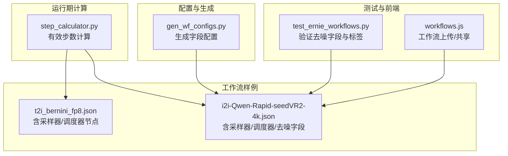
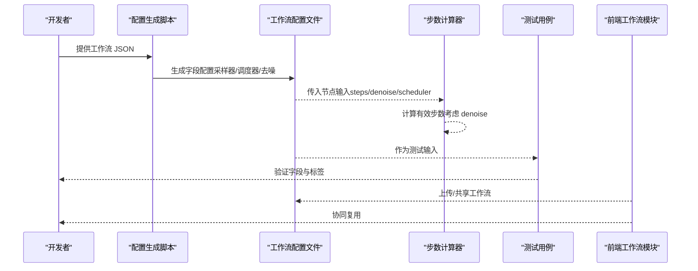
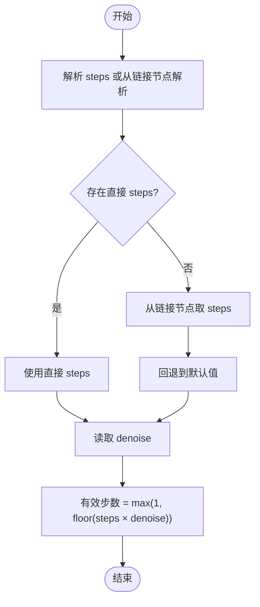
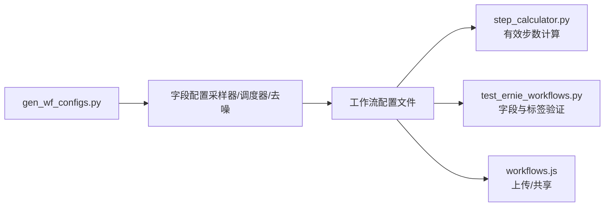

# 采样器与参数配置

<cite>
**本文引用的文件**
- [scripts/gen_wf_configs.py](file://scripts/gen_wf_configs.py)
- [modules/step_calculator.py](file://modules/step_calculator.py)
- [docs/v4.0-refactor-pipeline.md](file://docs/v4.0-refactor-pipeline.md)
- [data/wf_configs/i2i-Qwen-Rapid-seedVR2-4k.json](file://data/wf_configs/i2i-Qwen-Rapid-seedVR2-4k.json)
- [data/workflows/DGX Spark/t2i_bernini_fp8.json](file://data/workflows/DGX Spark/t2i_bernini_fp8.json)
- [tests/test_ernie_workflows.py](file://tests/test_ernie_workflows.py)
- [static/js/modules/workflows.js](file://static/js/modules/workflows.js)
</cite>

## 目录
1. [简介](#简介)
2. [项目结构](#项目结构)
3. [核心组件](#核心组件)
4. [架构总览](#架构总览)
5. [详细组件分析](#详细组件分析)
6. [依赖关系分析](#依赖关系分析)
7. [性能考量](#性能考量)
8. [故障排查指南](#故障排查指南)
9. [结论](#结论)
10. [附录](#附录)

## 简介
本章节面向 Ez ComfyUI Showcase 中“采样器与参数配置”的使用与优化，系统讲解以下主题：
- 采样器类型与选择：Euler、DPM++、DDIM 等主流采样器的特点与适用场景
- 步数设置：步数对质量与速度的影响，以及不同工作流类型的推荐范围
- CFG Scale：提示词遵循度与多样性的平衡技巧
- Denoising Strength（去噪强度）：在图像编辑类工作流中控制与原图相似度
- Batch Count（批量数量）：批量生成策略与内存考虑
- 参数调优最佳实践：结合仓库中的配置与测试用例给出可落地的建议与示例路径

## 项目结构
围绕采样器与参数配置，本项目的关键位置如下：
- 配置生成脚本：自动生成工作流字段配置，包含采样器、调度器、去噪强度等参数的 UI 映射
- 步数计算器：根据工作流节点解析有效步数，考虑 denoise 对实际步数的影响
- 工作流样例：包含采样器与调度器节点的实际配置示例
- 测试用例：验证 denoise 字段与 UI 标签的一致性
- 前端工作流模块：提供工作流上传与共享能力，便于复用与协作

图表来源
- [scripts/gen_wf_configs.py:117-137](file://scripts/gen_wf_configs.py#L117-L137)
- [modules/step_calculator.py:224-258](file://modules/step_calculator.py#L224-L258)
- [data/workflows/DGX Spark/t2i_bernini_fp8.json:73-176](file://data/workflows/DGX Spark/t2i_bernini_fp8.json#L73-L176)
- [data/wf_configs/i2i-Qwen-Rapid-seedVR2-4k.json:348-413](file://data/wf_configs/i2i-Qwen-Rapid-seedVR2-4k.json#L348-L413)
- [tests/test_ernie_workflows.py:98-112](file://tests/test_ernie_workflows.py#L98-L112)
- [static/js/modules/workflows.js:718-757](file://static/js/modules/workflows.js#L718-L757)

章节来源
- [scripts/gen_wf_configs.py:117-137](file://scripts/gen_wf_configs.py#L117-L137)
- [modules/step_calculator.py:224-258](file://modules/step_calculator.py#L224-L258)
- [data/workflows/DGX Spark/t2i_bernini_fp8.json:73-176](file://data/workflows/DGX Spark/t2i_bernini_fp8.json#L73-L176)
- [data/wf_configs/i2i-Qwen-Rapid-seedVR2-4k.json:348-413](file://data/wf_configs/i2i-Qwen-Rapid-seedVR2-4k.json#L348-L413)
- [tests/test_ernie_workflows.py:98-112](file://tests/test_ernie_workflows.py#L98-L112)
- [static/js/modules/workflows.js:718-757](file://static/js/modules/workflows.js#L718-L757)

## 核心组件
- 采样器与调度器字段生成：脚本自动识别包含特定关键词的节点，生成下拉选择字段，并提供完整的采样器与调度器选项集合
- 有效步数计算：综合 steps 与 denoise，计算实际生效步数，确保进度估算与实际执行一致
- 工作流配置与 UI 字段：通过配置文件暴露采样器、调度器、去噪强度等参数，支持可视化调整
- 测试验证：针对去噪字段进行单元测试，确保字段存在与标签正确
- 前端工作流管理：提供工作流上传与共享接口，便于团队协作与版本管理

章节来源
- [scripts/gen_wf_configs.py:117-137](file://scripts/gen_wf_configs.py#L117-L137)
- [modules/step_calculator.py:224-258](file://modules/step_calculator.py#L224-L258)
- [data/wf_configs/i2i-Qwen-Rapid-seedVR2-4k.json:348-413](file://data/wf_configs/i2i-Qwen-Rapid-seedVR2-4k.json#L348-L413)
- [tests/test_ernie_workflows.py:98-112](file://tests/test_ernie_workflows.py#L98-L112)
- [static/js/modules/workflows.js:718-757](file://static/js/modules/workflows.js#L718-L757)

## 架构总览
从“配置生成—运行期计算—工作流执行—测试验证—前端协作”的全链路看，采样器与参数配置的实现要点如下：
- 配置生成：基于节点命名规则，自动映射采样器与调度器字段，保证 UI 一致性
- 进度与步数：运行期按有效步数计算进度，避免因 denoise 导致的进度偏差
- 工作流样例：通过具体节点配置展示采样器与调度器的实际使用
- 测试保障：通过测试用例校验关键字段与标签，降低回归风险
- 协作与复用：前端提供上传与共享能力，便于团队复用高质量工作流

图表来源
- [scripts/gen_wf_configs.py:117-137](file://scripts/gen_wf_configs.py#L117-L137)
- [modules/step_calculator.py:224-258](file://modules/step_calculator.py#L224-L258)
- [data/wf_configs/i2i-Qwen-Rapid-seedVR2-4k.json:348-413](file://data/wf_configs/i2i-Qwen-Rapid-seedVR2-4k.json#L348-L413)
- [tests/test_ernie_workflows.py:98-112](file://tests/test_ernie_workflows.py#L98-L112)
- [static/js/modules/workflows.js:718-757](file://static/js/modules/workflows.js#L718-L757)

## 详细组件分析

### 采样器类型与选择
- 支持的采样器选项来自配置生成逻辑，覆盖 euler、euler_ancestral、heun、dpm_2、dpm_2_ancestral、lms、dpm_fast、dpm_adaptive、dpmpp_2s_ancestral、dpmpp_sde、dpmpp_2m、dpmpp_2m_sde、ddim、uni_pc、uni_pc_bh2、res_multistep 等
- 不同采样器在稳定性、速度与视觉质量方面各有侧重：例如 DDIM 通常更快但可能在某些模型上需要更高的步数；DPM++ 类采样器在高步数下常获得更细腻的细节；Euler 系列适合快速探索与草稿阶段

章节来源
- [scripts/gen_wf_configs.py:117-137](file://scripts/gen_wf_configs.py#L117-L137)

### 调度器类型与选择
- 支持的调度器选项包括 normal、karras、exponential、sgm_uniform、simple、ddim_uniform、beta 等
- 调度器影响噪声曲线分布，进而影响生成过程的平滑度与细节保留。例如 karras 与 sgm_uniform 在扩散训练的理论基础上常带来更稳定的收敛与更好的细节表现

章节来源
- [scripts/gen_wf_configs.py:125-130](file://scripts/gen_wf_configs.py#L125-L130)

### 步数设置与有效步数
- 有效步数计算会将 steps 与 denoise 相乘，得到实际执行步数，确保进度事件与实际步数一致
- 若 steps 由其他节点连接而来，脚本会尝试解析链路节点的值，否则回退到默认值

图表来源
- [modules/step_calculator.py:224-258](file://modules/step_calculator.py#L224-L258)
- [docs/v4.0-refactor-pipeline.md:617-651](file://docs/v4.0-refactor-pipeline.md#L617-L651)

章节来源
- [modules/step_calculator.py:224-258](file://modules/step_calculator.py#L224-L258)
- [docs/v4.0-refactor-pipeline.md:606-651](file://docs/v4.0-refactor-pipeline.md#L606-L651)

### CFG Scale 参数
- CFG（Classifier-Free Guidance Scale）用于平衡提示词遵循度与多样性
- 较高的 CFG 使输出更贴合提示词，但可能降低多样性并引入伪影；较低的 CFG 更易产生多样化但可能偏离提示词
- 建议从中等值起步，结合具体模型与任务微调

章节来源
- [data/wf_configs/i2i-Qwen-Rapid-seedVR2-4k.json:354-364](file://data/wf_configs/i2i-Qwen-Rapid-seedVR2-4k.json#L354-L364)

### Denoising Strength（去噪强度）
- 在图像编辑类工作流中，去噪强度（denoise）控制与原图的相似度
- 较低的 denoise 更接近原图，适合局部修改；较高的 denoise 更易引入新内容，适合风格迁移或大幅改写
- 测试用例验证了该字段的存在与标签显示为“重绘强度”，确保 UI 与后端一致

章节来源
- [data/wf_configs/i2i-Qwen-Rapid-seedVR2-4k.json:408-413](file://data/wf_configs/i2i-Qwen-Rapid-seedVR2-4k.json#L408-L413)
- [tests/test_ernie_workflows.py:98-112](file://tests/test_ernie_workflows.py#L98-L112)

### Batch Count（批量生成）
- 批量数量直接影响生成吞吐与显存占用
- 建议根据显存容量与目标分辨率逐步提升批量，同时关注生成时间与资源峰值
- 在工作流中可通过 batch_size 控制每批次样本数量

章节来源
- [data/workflows/DGX Spark/t2i_bernini_fp8.json:177-198](file://data/workflows/DGX Spark/t2i_bernini_fp8.json#L177-L198)

### 实际配置示例与参数组合建议
- 采样器与调度器示例：参考工作流样例中的采样器选择与调度器配置，结合模型特性选择合适的组合
- 去噪强度示例：在图像编辑工作流中，先以中等 denoise 尝试，再根据相似度需求微调
- 步数与 CFG 组合：先固定步数，调整 CFG 观察变化；若质量不足再适当增加步数

章节来源
- [data/workflows/DGX Spark/t2i_bernini_fp8.json:73-176](file://data/workflows/DGX Spark/t2i_bernini_fp8.json#L73-L176)
- [data/wf_configs/i2i-Qwen-Rapid-seedVR2-4k.json:348-413](file://data/wf_configs/i2i-Qwen-Rapid-seedVR2-4k.json#L348-L413)

## 依赖关系分析
- 配置生成依赖于节点命名规则与字段关键词匹配，确保 UI 与后端参数一致
- 运行期步数计算依赖于工作流节点输入，考虑 denoise 对实际步数的影响
- 测试用例依赖于配置文件与节点结构，验证字段存在与标签正确性
- 前端模块依赖于后端接口，实现工作流上传与共享

图表来源
- [scripts/gen_wf_configs.py:117-137](file://scripts/gen_wf_configs.py#L117-L137)
- [modules/step_calculator.py:224-258](file://modules/step_calculator.py#L224-L258)
- [tests/test_ernie_workflows.py:98-112](file://tests/test_ernie_workflows.py#L98-L112)
- [static/js/modules/workflows.js:718-757](file://static/js/modules/workflows.js#L718-L757)

章节来源
- [scripts/gen_wf_configs.py:117-137](file://scripts/gen_wf_configs.py#L117-L137)
- [modules/step_calculator.py:224-258](file://modules/step_calculator.py#L224-L258)
- [tests/test_ernie_workflows.py:98-112](file://tests/test_ernie_workflows.py#L98-L112)
- [static/js/modules/workflows.js:718-757](file://static/js/modules/workflows.js#L718-L757)

## 性能考量
- 步数与速度：步数越高，质量通常越好但耗时越长；在草稿阶段可使用较低步数快速迭代
- 采样器选择：某些采样器在特定模型上更快，可在追求速度时优先尝试
- 批量与显存：批量越大吞吐越高，但显存占用也越高；应根据硬件能力动态调整
- denoise 与步数协同：在图像编辑中，降低 denoise 可减少无效步数，提高效率

## 故障排查指南
- 进度异常或超过 100%：检查是否正确考虑了 denoise 对有效步数的影响
- 步数解析不准确：确认 steps 是否直接连接或通过链路节点传递，必要时回退到默认值
- 去噪字段缺失或标签错误：通过测试用例定位配置文件中的字段定义与标签

章节来源
- [docs/v4.0-refactor-pipeline.md:606-651](file://docs/v4.0-refactor-pipeline.md#L606-L651)
- [tests/test_ernie_workflows.py:98-112](file://tests/test_ernie_workflows.py#L98-L112)

## 结论
通过对采样器与参数配置的系统化梳理，可以形成一套可复用、可验证的优化流程：以配置生成为入口，以有效步数计算为保障，以测试用例为质量基线，配合前端协作工具实现高效迭代。建议在实际使用中结合模型特性与任务目标，采用“步数—采样器—调度器—CFG—去噪—批量”的组合策略，逐步微调达到最佳效果。

## 附录
- 采样器与调度器选项清单：参见配置生成脚本中的枚举列表
- 工作流样例路径：
  - [t2i_bernini_fp8.json](file://data/workflows/DGX Spark/t2i_bernini_fp8.json)
  - [i2i-Qwen-Rapid-seedVR2-4k.json](file://data/wf_configs/i2i-Qwen-Rapid-seedVR2-4k.json)
- 相关实现与测试：
  - [gen_wf_configs.py](file://scripts/gen_wf_configs.py)
  - [step_calculator.py](file://modules/step_calculator.py)
  - [test_ernie_workflows.py](file://tests/test_ernie_workflows.py)
  - [workflows.js](file://static/js/modules/workflows.js)