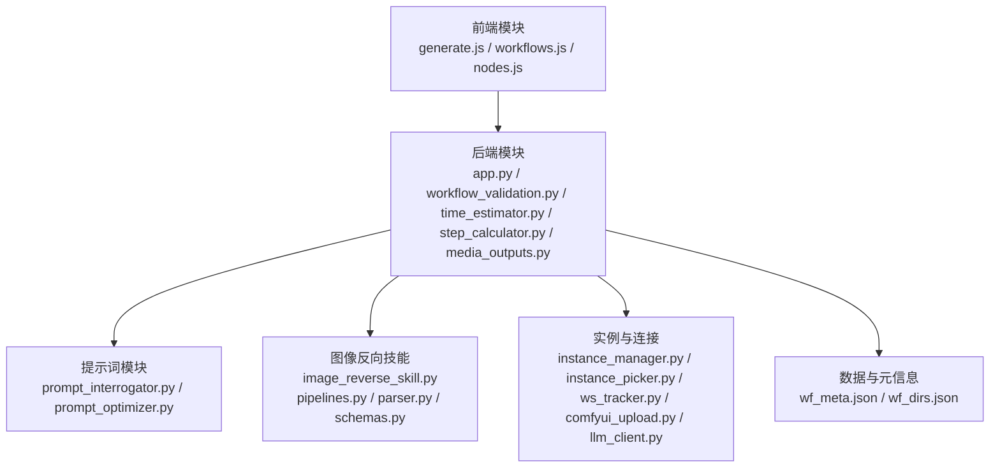
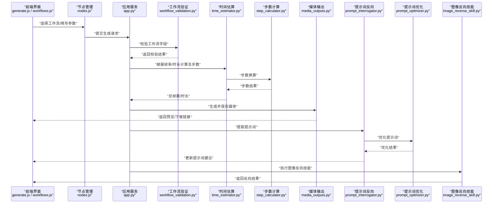
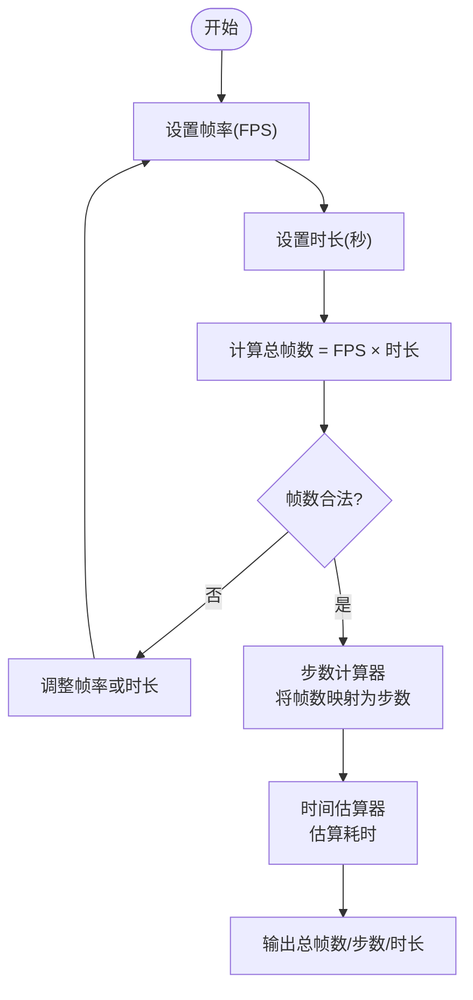
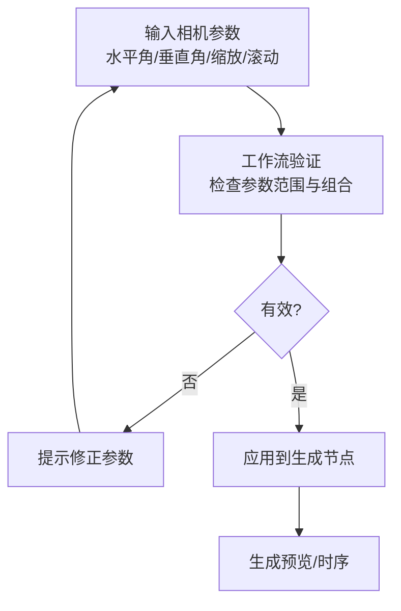
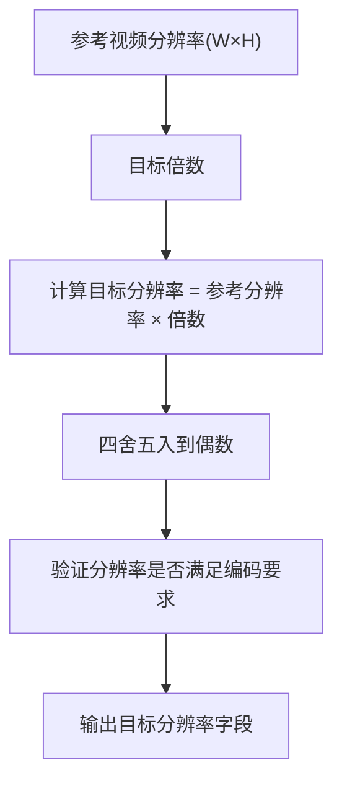
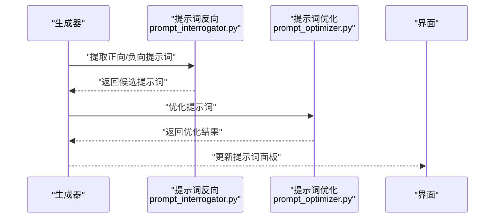
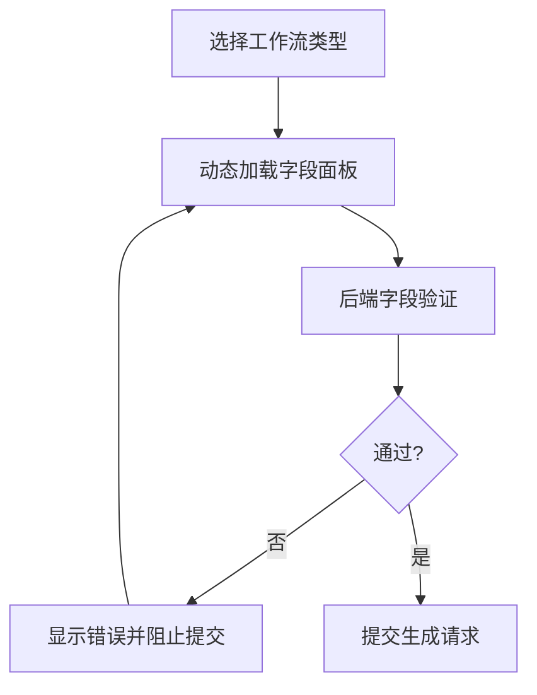
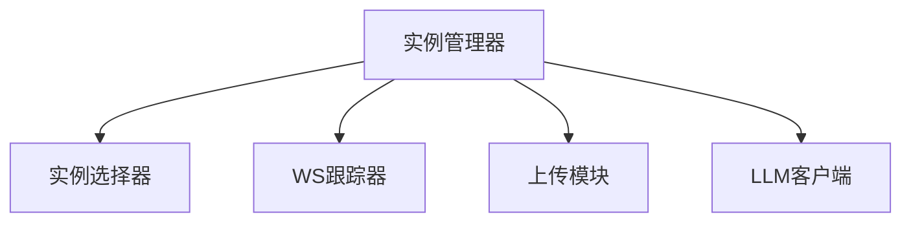
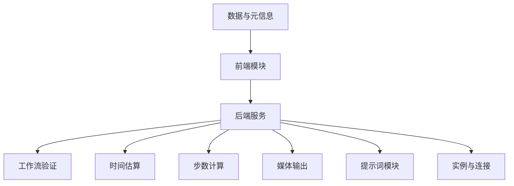

# 高级控制与特殊功能

<cite>
**本文引用的文件**
- [app.py](file://app.py)
- [modules/prompt_optimizer.py](file://modules/prompt_optimizer.py)
- [modules/prompt_interrogator.py](file://modules/prompt_interrogator.py)
- [modules/time_estimator.py](file://modules/time_estimator.py)
- [modules/step_calculator.py](file://modules/step_calculator.py)
- [modules/workflow_validation.py](file://modules/workflow_validation.py)
- [modules/media_outputs.py](file://modules/media_outputs.py)
- [modules/instance_manager.py](file://modules/instance_manager.py)
- [modules/instance_picker.py](file://modules/instance_picker.py)
- [modules/ws_tracker.py](file://modules/ws_tracker.py)
- [modules/comfyui_upload.py](file://modules/comfyui_upload.py)
- [modules/llm_client.py](file://modules/llm_client.py)
- [modules/image_reverse_skill.py](file://modules/image_reverse_skill.py)
- [modules/image_reverse/pipelines.py](file://modules/image_reverse/pipelines.py)
- [modules/image_reverse/parser.py](file://modules/image_reverse/parser.py)
- [modules/image_reverse/schemas.py](file://modules/image_reverse/schemas.py)
- [static/js/modules/generate.js](file://static/js/modules/generate.js)
- [static/js/modules/workflows.js](file://static/js/modules/workflows.js)
- [static/js/modules/nodes.js](file://static/js/modules/nodes.js)
- [data/wf_meta.json](file://data/wf_meta.json)
- [data/wf_dirs.json](file://data/wf_dirs.json)
- [tests/test_qwen_multiangle.py](file://tests/test_qwen_multiangle.py)
- [tests/test_seedvr2_video_upscale_workflows.py](file://tests/test_seedvr2_video_upscale_workflows.py)
- [tests/test_prompt_optimizer.py](file://tests/test_prompt_optimizer.py)
- [tests/test_prompt_interrogator.py](file://tests/test_prompt_interrogator.py)
- [tests/test_workflow_validation.py](file://tests/test_workflow_validation.py)
- [tests/test_video_preview_ui.py](file://tests/test_video_preview_ui.py)
- [tests/test_video_editor_ui.py](file://tests/test_video_editor_ui.py)
- [README.md](file://README.md)
</cite>

## 目录
1. [简介](#简介)
2. [项目结构](#项目结构)
3. [核心组件](#核心组件)
4. [架构总览](#架构总览)
5. [详细组件分析](#详细组件分析)
6. [依赖关系分析](#依赖关系分析)
7. [性能考虑](#性能考虑)
8. [故障排除指南](#故障排除指南)
9. [结论](#结论)
10. [附录](#附录)

## 简介
本文件面向 Ez ComfyUI Showcase 的高级控制与特殊功能，围绕以下主题展开：  
- 视频工作流的特殊参数：帧率、总帧数与时长计算  
- Qwen 多角度相机控制：水平角、垂直角、缩放与镜头滚动  
- 视频放大工作流的分辨率计算与参考视频自适应  
- 提示词反向（Prompt Reverse）功能：从生成结果中提取与优化提示词  
- 工作流字段的动态加载与验证机制  
- 高级功能使用技巧、注意事项与实际应用示例  

本指南兼顾技术深度与可读性，既适合开发者深入理解实现细节，也适合普通用户掌握高级特性。

## 项目结构
Ez ComfyUI Showcase 将前端交互与后端处理模块化组织，核心模块包括：  
- 生成与工作流管理：generate.js、workflows.js、nodes.js  
- 后端服务与工具：app.py、workflow_validation.py、time_estimator.py、step_calculator.py、media_outputs.py  
- 提示词相关：prompt_interrogator.py、prompt_optimizer.py  
- 图像反向技能：image_reverse_skill.py 及其子模块 pipelines.py、parser.py、schemas.py  
- 实例与连接：instance_manager.py、instance_picker.py、ws_tracker.py、comfyui_upload.py、llm_client.py  
- 数据与元信息：wf_meta.json、wf_dirs.json  
- 测试用例：覆盖多角度相机、视频放大、提示词反向、工作流验证等场景

**图表来源**
- [app.py](file://app.py)
- [modules/workflow_validation.py](file://modules/workflow_validation.py)
- [modules/time_estimator.py](file://modules/time_estimator.py)
- [modules/step_calculator.py](file://modules/step_calculator.py)
- [modules/media_outputs.py](file://modules/media_outputs.py)
- [modules/prompt_interrogator.py](file://modules/prompt_interrogator.py)
- [modules/prompt_optimizer.py](file://modules/prompt_optimizer.py)
- [modules/image_reverse_skill.py](file://modules/image_reverse_skill.py)
- [modules/image_reverse/pipelines.py](file://modules/image_reverse/pipelines.py)
- [modules/image_reverse/parser.py](file://modules/image_reverse/parser.py)
- [modules/image_reverse/schemas.py](file://modules/image_reverse/schemas.py)
- [modules/instance_manager.py](file://modules/instance_manager.py)
- [modules/instance_picker.py](file://modules/instance_picker.py)
- [modules/ws_tracker.py](file://modules/ws_tracker.py)
- [modules/comfyui_upload.py](file://modules/comfyui_upload.py)
- [modules/llm_client.py](file://modules/llm_client.py)
- [data/wf_meta.json](file://data/wf_meta.json)
- [data/wf_dirs.json](file://data/wf_dirs.json)

**章节来源**
- [README.md](file://README.md)
- [data/wf_meta.json](file://data/wf_meta.json)
- [data/wf_dirs.json](file://data/wf_dirs.json)

## 核心组件
- 视频工作流参数与计算：通过时间估算器与步数计算器实现帧率、总帧数与时长的联动计算，确保生成时序稳定可控。  
- Qwen 多角度相机：在工作流节点中暴露水平角、垂直角、缩放与镜头滚动参数，支持预设与动态调整，结合工作流验证确保参数合法性。  
- 视频放大分辨率计算：基于参考视频的分辨率与目标倍数，自动推导输出分辨率，避免手动配置误差。  
- 提示词反向：从生成结果中解析提示词，结合提示词优化器进行迭代优化，提升生成质量与一致性。  
- 动态工作流字段加载与验证：根据当前工作流类型动态渲染参数面板，并在提交前执行字段校验与约束检查。  
- 实例与连接：通过实例管理器与连接跟踪器保障生成任务的稳定性与可观测性；上传与 LLM 客户端提供外部集成能力。

**章节来源**
- [modules/time_estimator.py](file://modules/time_estimator.py)
- [modules/step_calculator.py](file://modules/step_calculator.py)
- [modules/workflow_validation.py](file://modules/workflow_validation.py)
- [modules/media_outputs.py](file://modules/media_outputs.py)
- [modules/prompt_interrogator.py](file://modules/prompt_interrogator.py)
- [modules/prompt_optimizer.py](file://modules/prompt_optimizer.py)
- [modules/instance_manager.py](file://modules/instance_manager.py)
- [modules/ws_tracker.py](file://modules/ws_tracker.py)
- [modules/comfyui_upload.py](file://modules/comfyui_upload.py)
- [modules/llm_client.py](file://modules/llm_client.py)

## 架构总览
下图展示了从前端到后端的关键交互路径，以及与提示词与图像反向技能的协作关系。

**图表来源**
- [static/js/modules/generate.js](file://static/js/modules/generate.js)
- [static/js/modules/workflows.js](file://static/js/modules/workflows.js)
- [static/js/modules/nodes.js](file://static/js/modules/nodes.js)
- [app.py](file://app.py)
- [modules/workflow_validation.py](file://modules/workflow_validation.py)
- [modules/time_estimator.py](file://modules/time_estimator.py)
- [modules/step_calculator.py](file://modules/step_calculator.py)
- [modules/media_outputs.py](file://modules/media_outputs.py)
- [modules/prompt_interrogator.py](file://modules/prompt_interrogator.py)
- [modules/prompt_optimizer.py](file://modules/prompt_optimizer.py)
- [modules/image_reverse_skill.py](file://modules/image_reverse_skill.py)

## 详细组件分析

### 视频工作流特殊参数与计算
- 帧率设置：用于控制每秒播放的帧数量，影响时长与总帧数的换算。  
- 总帧数控制：根据时长与帧率计算得出，确保生成时序稳定。  
- 时长计算：支持以秒为单位输入时长，内部转换为总帧数，再映射到采样步数。  
- 步数与帧率联动：通过步数计算器将时长与帧率转化为模型可执行的步数，保证生成质量与效率平衡。

**图表来源**
- [modules/time_estimator.py](file://modules/time_estimator.py)
- [modules/step_calculator.py](file://modules/step_calculator.py)

**章节来源**
- [modules/time_estimator.py](file://modules/time_estimator.py)
- [modules/step_calculator.py](file://modules/step_calculator.py)
- [tests/test_video_preview_ui.py](file://tests/test_video_preview_ui.py)
- [tests/test_video_editor_ui.py](file://tests/test_video_editor_ui.py)

### Qwen 多角度相机控制
- 参数维度：水平角度、垂直角度、缩放、镜头滚动（如适用）。  
- 控制方式：在工作流节点中提供滑块/输入框，支持预设与实时调整。  
- 参数验证：通过工作流验证模块确保参数范围与组合合法，避免无效配置导致生成失败。  
- 应用场景：适用于需要多角度视角的视频/图像生成任务，如角色全身像、特写切换、镜头推进等。

**图表来源**
- [modules/workflow_validation.py](file://modules/workflow_validation.py)
- [tests/test_qwen_multiangle.py](file://tests/test_qwen_multiangle.py)

**章节来源**
- [modules/workflow_validation.py](file://modules/workflow_validation.py)
- [tests/test_qwen_multiangle.py](file://tests/test_qwen_multiangle.py)

### 视频放大工作流的分辨率计算
- 输入：参考视频的分辨率（宽×高）与目标倍数（如 2x）。  
- 计算：目标分辨率 = 参考分辨率 × 目标倍数，四舍五入到最近的偶数，确保编码兼容性。  
- 自动适配：在工作流中根据参考视频自动填充目标分辨率字段，减少人工配置错误。  
- 输出：生成符合目标分辨率的放大视频，保持画质与比例一致。

**图表来源**
- [modules/media_outputs.py](file://modules/media_outputs.py)
- [tests/test_seedvr2_video_upscale_workflows.py](file://tests/test_seedvr2_video_upscale_workflows.py)

**章节来源**
- [modules/media_outputs.py](file://modules/media_outputs.py)
- [tests/test_seedvr2_video_upscale_workflows.py](file://tests/test_seedvr2_video_upscale_workflows.py)

### 提示词反向功能
- 提示词提取：从生成结果中解析正向与负向提示词，形成候选集合。  
- 提示词优化：利用提示词优化器对候选进行去冗余、增强语义、提升一致性等处理。  
- 结果回填：将优化后的提示词回填至工作流参数面板，便于复用与迭代。  
- 典型流程：生成 → 解析 → 优化 → 回填 → 再生成对比。

**图表来源**
- [modules/prompt_interrogator.py](file://modules/prompt_interrogator.py)
- [modules/prompt_optimizer.py](file://modules/prompt_optimizer.py)
- [tests/test_prompt_interrogator.py](file://tests/test_prompt_interrogator.py)
- [tests/test_prompt_optimizer.py](file://tests/test_prompt_optimizer.py)

**章节来源**
- [modules/prompt_interrogator.py](file://modules/prompt_interrogator.py)
- [modules/prompt_optimizer.py](file://modules/prompt_optimizer.py)
- [tests/test_prompt_interrogator.py](file://tests/test_prompt_interrogator.py)
- [tests/test_prompt_optimizer.py](file://tests/test_prompt_optimizer.py)

### 工作流字段的动态加载与验证
- 动态加载：根据当前工作流类型，前端动态渲染对应参数面板，仅显示与之相关的字段。  
- 字段验证：后端工作流验证模块对必填项、数值范围、格式等进行校验，防止非法参数进入生成流程。  
- 错误反馈：校验失败时返回明确的错误信息，指导用户修正参数。  
- 一致性保障：通过统一的验证规则与前端联动，确保不同工作流的一致体验。

**图表来源**
- [static/js/modules/workflows.js](file://static/js/modules/workflows.js)
- [modules/workflow_validation.py](file://modules/workflow_validation.py)
- [tests/test_workflow_validation.py](file://tests/test_workflow_validation.py)

**章节来源**
- [static/js/modules/workflows.js](file://static/js/modules/workflows.js)
- [modules/workflow_validation.py](file://modules/workflow_validation.py)
- [tests/test_workflow_validation.py](file://tests/test_workflow_validation.py)

### 实例管理与连接跟踪
- 实例管理：通过实例管理器与实例选择器，维护生成实例的状态与生命周期，支持并发与隔离。  
- 连接跟踪：WebSocket 跟踪器监控连接状态，确保生成进度与日志的实时传输。  
- 上传与 LLM 集成：上传模块负责媒体文件的上传与归档；LLM 客户端提供外部智能辅助能力。  
- 稳定性保障：结合超时、重试与错误恢复策略，提升整体可用性。

**图表来源**
- [modules/instance_manager.py](file://modules/instance_manager.py)
- [modules/instance_picker.py](file://modules/instance_picker.py)
- [modules/ws_tracker.py](file://modules/ws_tracker.py)
- [modules/comfyui_upload.py](file://modules/comfyui_upload.py)
- [modules/llm_client.py](file://modules/llm_client.py)

**章节来源**
- [modules/instance_manager.py](file://modules/instance_manager.py)
- [modules/instance_picker.py](file://modules/instance_picker.py)
- [modules/ws_tracker.py](file://modules/ws_tracker.py)
- [modules/comfyui_upload.py](file://modules/comfyui_upload.py)
- [modules/llm_client.py](file://modules/llm_client.py)

## 依赖关系分析
- 前端与后端：前端通过工作流与节点模块与后端交互，后端提供统一的服务接口与验证逻辑。  
- 模块内聚：提示词相关模块、媒体输出模块、工作流验证模块相对独立，耦合度低，便于扩展与维护。  
- 外部依赖：上传与 LLM 客户端作为外部集成点，需注意网络与权限配置。  
- 数据依赖：工作流元信息与目录配置文件为前端动态加载提供基础数据支撑。

**图表来源**
- [static/js/modules/workflows.js](file://static/js/modules/workflows.js)
- [app.py](file://app.py)
- [modules/workflow_validation.py](file://modules/workflow_validation.py)
- [modules/time_estimator.py](file://modules/time_estimator.py)
- [modules/step_calculator.py](file://modules/step_calculator.py)
- [modules/media_outputs.py](file://modules/media_outputs.py)
- [modules/prompt_interrogator.py](file://modules/prompt_interrogator.py)
- [modules/prompt_optimizer.py](file://modules/prompt_optimizer.py)
- [modules/instance_manager.py](file://modules/instance_manager.py)
- [modules/ws_tracker.py](file://modules/ws_tracker.py)
- [data/wf_meta.json](file://data/wf_meta.json)
- [data/wf_dirs.json](file://data/wf_dirs.json)

**章节来源**
- [data/wf_meta.json](file://data/wf_meta.json)
- [data/wf_dirs.json](file://data/wf_dirs.json)

## 性能考虑
- 帧率与时长权衡：较高的帧率会增加总帧数与步数，显著提升生成时间；建议根据设备性能与质量需求合理选择。  
- 分辨率放大：视频放大会带来更高的像素量，注意显存与存储压力，必要时降低分辨率或分段处理。  
- 步数与采样：步数过多可能延长等待时间且不一定显著提升质量，建议先以较低步数快速验证，再逐步调优。  
- 并发与实例：合理配置实例数量与资源分配，避免过度并发导致系统抖动。  
- 网络与上传：上传大文件时关注带宽与稳定性，必要时启用断点续传或压缩策略。

## 故障排除指南
- 工作流参数错误：检查参数范围与组合是否符合验证规则，修正后重新提交。  
- 生成卡顿或失败：降低帧率、时长或步数，确认显存与存储空间充足；查看日志面板定位问题。  
- 分辨率异常：确认参考视频分辨率与目标倍数输入正确，检查四舍五入与编码兼容性。  
- 提示词无效：尝试使用提示词反向提取更准确的提示词，再通过优化器进行精炼。  
- 连接中断：检查 WebSocket 连接状态与网络环境，必要时刷新页面或重启实例。  
- 上传失败：确认上传模块权限与路径配置，检查文件大小限制与格式支持。

**章节来源**
- [modules/workflow_validation.py](file://modules/workflow_validation.py)
- [modules/ws_tracker.py](file://modules/ws_tracker.py)
- [modules/comfyui_upload.py](file://modules/comfyui_upload.py)
- [modules/prompt_interrogator.py](file://modules/prompt_interrogator.py)
- [modules/prompt_optimizer.py](file://modules/prompt_optimizer.py)

## 结论
Ez ComfyUI Showcase 在视频工作流的参数控制、Qwen 多角度相机、视频放大分辨率计算、提示词反向与工作流动态验证等方面提供了完善的高级功能。通过前后端协同与模块化设计，系统在保证易用性的同时，也为用户提供了强大的可定制能力。建议在实际使用中遵循性能与稳定性原则，结合测试用例与日志面板进行问题排查，持续优化生成效果。

## 附录
- 实际使用示例（步骤概述）：  
  - 视频工作流：设置帧率与期望时长 → 查看自动计算的总帧数 → 调整步数后生成 → 预览与导出。  
  - Qwen 多角度相机：在工作流中打开相机参数面板 → 设置水平/垂直角与缩放 → 预览多角度效果 → 导出序列帧。  
  - 视频放大：选择参考视频 → 自动填充目标分辨率 → 设置放大倍数 → 生成高质量放大视频。  
  - 提示词反向：生成完成后点击“提取提示词” → 使用优化器精炼 → 回填参数并再次生成对比。  
- 高级技巧：  
  - 使用较低帧率与步数快速验证创意，再逐步提高参数以逼近理想效果。  
  - 对于复杂场景，优先使用提示词反向与优化，提升生成一致性与细节表现。  
  - 在多实例环境下，合理分配资源并监控进度，避免资源争用导致延迟。  
  - 利用测试用例验证关键功能（如多角度相机、视频放大、提示词反向），确保配置正确。