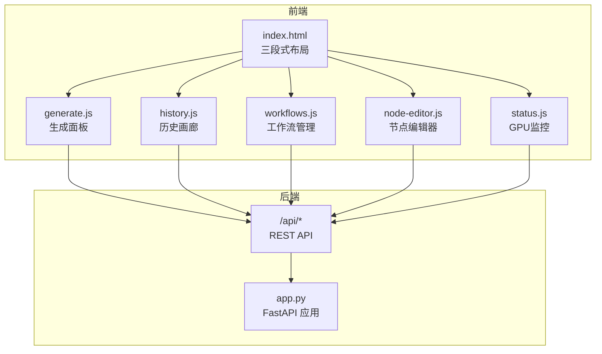
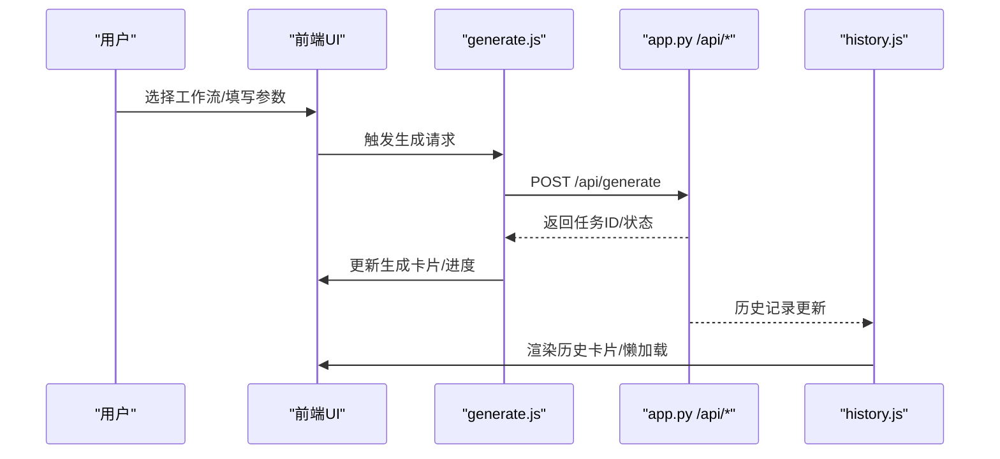
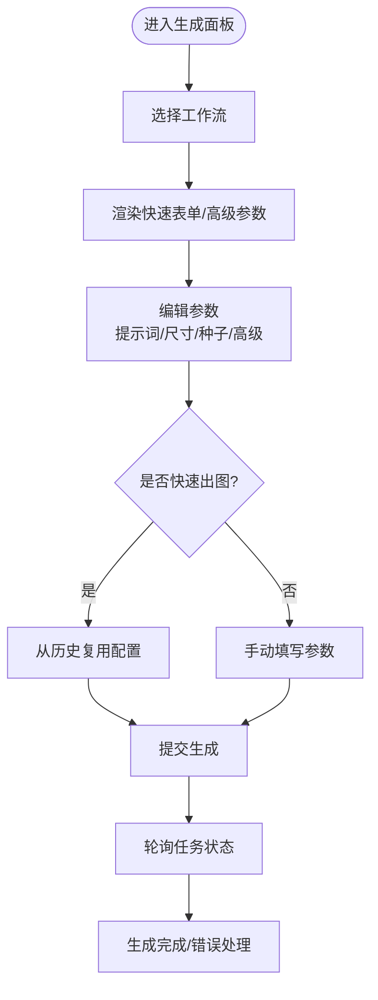
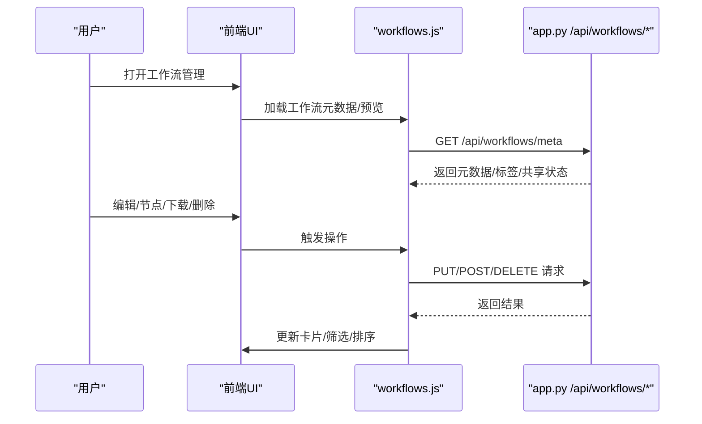
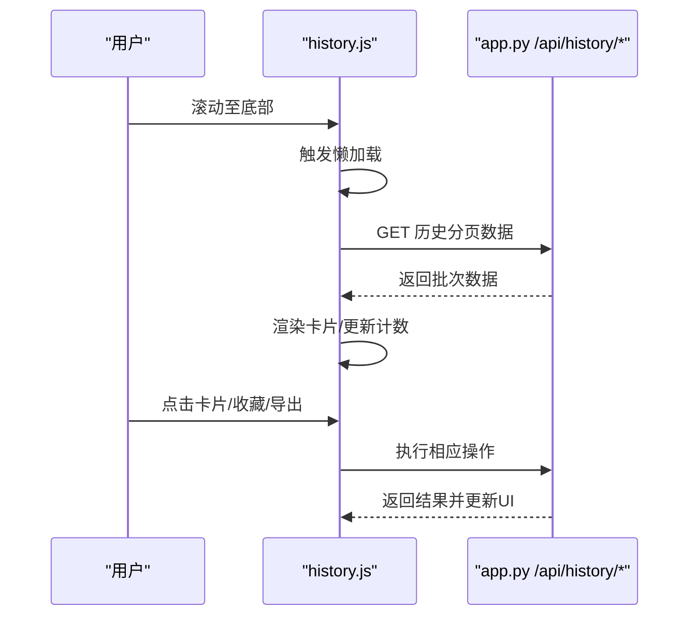
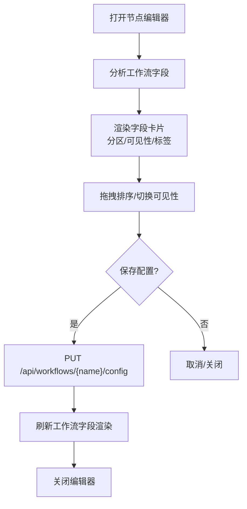
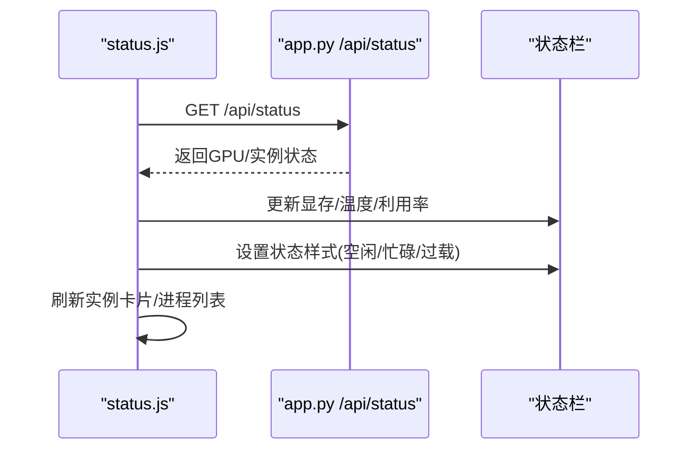
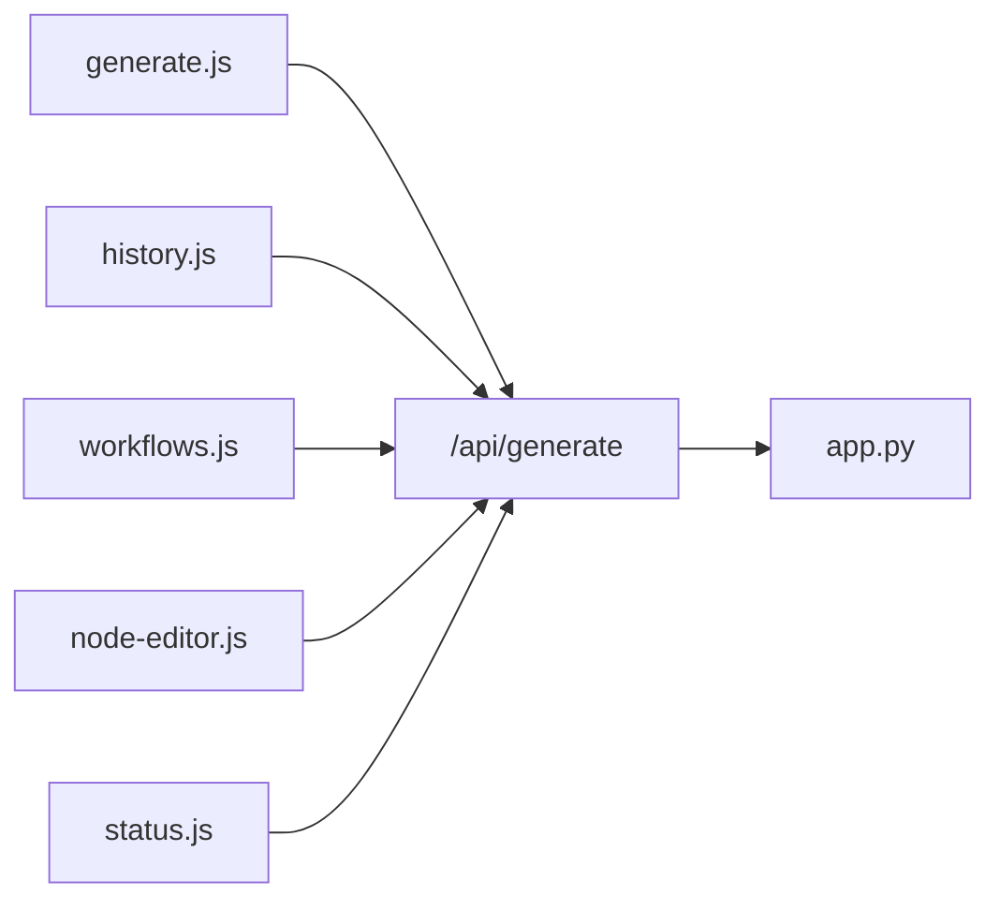

# 用户使用手册

<cite>
**本文档引用的文件**
- [README.md](file://README.md)
- [index.html](file://static/index.html)
- [generate.js](file://static/js/modules/generate.js)
- [history.js](file://static/js/modules/history.js)
- [workflows.js](file://static/js/modules/workflows.js)
- [node-editor.js](file://static/js/modules/node-editor.js)
- [status.js](file://static/js/modules/status.js)
- [app.py](file://app.py)
</cite>

## 目录
1. [简介](#简介)
2. [项目结构](#项目结构)
3. [核心组件](#核心组件)
4. [架构总览](#架构总览)
5. [详细组件分析](#详细组件分析)
6. [依赖关系分析](#依赖关系分析)
7. [性能考虑](#性能考虑)
8. [故障排除指南](#故障排除指南)
9. [结论](#结论)
10. [附录](#附录)

## 简介
Ez ComfyUI Showcase 是一个基于浏览器的三段式界面平台，集成了工作流管理、生成控制面板与历史画廊，支持节点可视化编辑、GPU 实时监控、服务管理与快速出图。用户可在同一界面中完成从工作流选择、参数配置、生成执行到结果浏览与复用的完整流程。

## 项目结构
- 前端采用单页应用（SPA）结构，入口为静态页面与模块化 JavaScript 模块。
- 后端基于 FastAPI，提供工作流、历史、状态、节点编辑等 API。
- 数据与资源分布于 data、config、static 等目录，包含工作流配置、历史记录、缩略图与系统设置等。

**图表来源**
- [index.html:292-346](file://static/index.html#L292-L346)
- [generate.js:1-800](file://static/js/modules/generate.js#L1-L800)
- [history.js:1-800](file://static/js/modules/history.js#L1-L800)
- [workflows.js:1-800](file://static/js/modules/workflows.js#L1-L800)
- [node-editor.js:1-574](file://static/js/modules/node-editor.js#L1-L574)
- [status.js:1-659](file://static/js/modules/status.js#L1-L659)
- [app.py:1-800](file://app.py#L1-L800)

**章节来源**
- [README.md:40-59](file://README.md#L40-L59)
- [index.html:1-659](file://static/index.html#L1-L659)

## 核心组件
- 三段式 UI：左侧工作流选择与生成控制、中间历史画廊、右侧节点编辑器与日志面板。
- 工作流管理：工作流增删改查、标签分类、拖拽排序、节点编辑、版本管理。
- 生成面板：提示词输入、尺寸预设、种子值调节、高级参数展开、快速出图。
- 历史画廊：按标签/类型/归属筛选、无限滚动懒加载、收藏/分享/导出/删除。
- 节点编辑器：可视化字段分区（用户输入/高级/输出/隐藏）、拖拽排序、显示名称自定义。
- GPU 监控：显存使用率、温度、利用率仪表盘与实例状态汇总。

**章节来源**
- [README.md:11-21](file://README.md#L11-L21)
- [index.html:292-346](file://static/index.html#L292-L346)

## 架构总览
前端通过模块化 JS 与后端 API 交互，生成面板负责参数收集与提交，历史模块负责渲染与筛选，工作流模块负责工作流生命周期管理，节点编辑器负责参数可视化配置，状态模块负责 GPU 与实例监控。

**图表来源**
- [generate.js:1-800](file://static/js/modules/generate.js#L1-L800)
- [history.js:1-800](file://static/js/modules/history.js#L1-L800)
- [app.py:1-800](file://app.py#L1-L800)

## 详细组件分析

### 生成面板（左侧工作流选择与参数配置）
- 工作流选择：在左侧工作区选择工作流，自动渲染快速表单与高级参数区。
- 参数配置：
  - 提示词输入：支持中英文提示词，内置缓存与优化模式识别。
  - 尺寸预设：根据工作流类型动态限制最大像素、边长与倍数，提供常用比例按钮。
  - 种子值：支持随机与手动种子，提供种子随机化按钮。
  - 高级参数：按需展开，显示/隐藏字段，支持视频工作流的时间上下文计算。
- 快速出图：一键复用历史配置，自动填充参数并提交生成。

**图表来源**
- [generate.js:119-182](file://static/js/modules/generate.js#L119-L182)
- [generate.js:229-261](file://static/js/modules/generate.js#L229-L261)
- [generate.js:306-317](file://static/js/modules/generate.js#L306-L317)

**章节来源**
- [generate.js:1-800](file://static/js/modules/generate.js#L1-L800)

### 工作流管理（工作流选择与配置）
- 管理界面：支持搜索、标签筛选、排序、拖拽排序、批量操作。
- 编辑功能：名称/标签/缩略图、版本上传与回滚、共享状态切换。
- 节点编辑：打开节点编辑器，对字段进行分区、显示/隐藏、顺序调整与显示名称自定义。
- 同步与设备：支持手动同步工作流至远端设备，选择设备进行批量管理。

**图表来源**
- [workflows.js:581-590](file://static/js/modules/workflows.js#L581-L590)
- [workflows.js:718-735](file://static/js/modules/workflows.js#L718-L735)
- [workflows.js:737-757](file://static/js/modules/workflows.js#L737-L757)

**章节来源**
- [workflows.js:1-800](file://static/js/modules/workflows.js#L1-L800)

### 历史画廊（中间出图历史与筛选）
- 筛选机制：按归属（所有/我的/收藏/他人）、类型（全部/图片/视频）、关键词搜索。
- 懒加载：触底自动加载下一批，支持删除标记与乐观更新。
- 详情与操作：收藏/分享/导出/删除、图片对比、视频编辑入口、下载原图。
- 无限滚动：基于 IntersectionObserver 的哨兵元素实现。

**图表来源**
- [history.js:440-458](file://static/js/modules/history.js#L440-L458)
- [history.js:236-255](file://static/js/modules/history.js#L236-L255)

**章节来源**
- [history.js:1-800](file://static/js/modules/history.js#L1-L800)

### 节点编辑器（可视化参数修改）
- 字段分区：用户输入、高级参数、输出、隐藏四个区域，支持拖拽移动与显示/隐藏切换。
- 字段属性：显示名称自定义、类型/范围/步长继承，保存后刷新工作流字段渲染。
- 保存与重置：保存当前布局与标签为工作流配置，重置为自动分类。

**图表来源**
- [node-editor.js:332-366](file://static/js/modules/node-editor.js#L332-L366)
- [node-editor.js:278-331](file://static/js/modules/node-editor.js#L278-L331)

**章节来源**
- [node-editor.js:1-574](file://static/js/modules/node-editor.js#L1-L574)

### GPU 监控界面（状态栏与实例管理）
- 实时监控：显存使用率、温度、利用率，状态栏根据压力级别着色（空闲/忙碌/过载）。
- 实例状态：显示各实例运行/排队/待机状态，支持实例启停与进程终止。
- 仪表盘解读：
  - 显存使用率：超过 80% 或温度/利用率过高视为过载。
  - 温度与功耗：结合利用率综合判断设备压力。
  - 实例状态：运行中/排队中/待机/关闭，辅助判断生成延迟与资源占用。

**图表来源**
- [status.js:330-343](file://static/js/modules/status.js#L330-L343)
- [status.js:389-427](file://static/js/modules/status.js#L389-L427)

**章节来源**
- [status.js:1-659](file://static/js/modules/status.js#L1-L659)

## 依赖关系分析
- 前端模块间耦合：生成面板依赖工作流元数据与字段分析；历史模块依赖生成面板的任务状态；节点编辑器依赖工作流字段分析与配置；状态模块为全局监控提供数据源。
- 后端 API：统一通过 /api/* 提供工作流、历史、状态、节点编辑等能力，前后端通过 JSON 交互。
- 外部依赖：ComfyUI 实例（A/B 串行调度）、NVIDIA GPU、本地 LLM API（提示词优化/反向提示）。

**图表来源**
- [generate.js:1-800](file://static/js/modules/generate.js#L1-L800)
- [history.js:1-800](file://static/js/modules/history.js#L1-L800)
- [workflows.js:1-800](file://static/js/modules/workflows.js#L1-L800)
- [node-editor.js:1-574](file://static/js/modules/node-editor.js#L1-L574)
- [status.js:1-659](file://static/js/modules/status.js#L1-L659)
- [app.py:1-800](file://app.py#L1-L800)

**章节来源**
- [README.md:30-59](file://README.md#L30-L59)

## 性能考虑
- 历史画廊懒加载：基于 IntersectionObserver 的哨兵元素，降低初始渲染压力。
- 字段缓存：生成面板对工作流字段元数据进行缓存，减少重复请求。
- 尺寸限制：根据工作流类型自动限制最大像素与边长，避免超大分辨率导致内存压力。
- GPU 监控：状态栏按需刷新，避免频繁轮询造成前端卡顿。

## 故障排除指南
- 生成失败：检查 ComfyUI 实例状态，确认实例处于运行中且无过载；查看日志面板定位错误原因。
- 历史加载异常：确认网络连接正常，尝试清除缓存或刷新页面；若为筛选条件导致为空，调整筛选器。
- 节点编辑保存失败：确保字段类型与范围有效，检查后端返回的错误信息并修正。
- GPU 监控异常：确认 GPU 驱动与监控接口可用，查看状态栏提示信息。

**章节来源**
- [status.js:282-288](file://static/js/modules/status.js#L282-L288)
- [history.js:206-215](file://static/js/modules/history.js#L206-L215)

## 结论
Ez ComfyUI Showcase 通过三段式 UI 将工作流管理、生成控制与历史浏览整合为一体，配合节点编辑器与 GPU 监控，显著提升了生成效率与用户体验。建议用户优先掌握工作流选择与参数配置，再利用历史画廊进行快速复用与管理。

## 附录
- 快速出图操作步骤
  1) 在左侧工作区选择目标工作流。
  2) 在快速表单中填写提示词与尺寸，必要时展开高级参数。
  3) 点击“开始生成”提交任务。
  4) 在历史画廊中找到对应记录，点击卡片进行复用或导出。
- GPU 监控解读要点
  - 显存使用率、温度、利用率同时升高表示设备过载，建议暂停非必要任务。
  - 实例状态显示“排队中/运行中”时，生成延迟可能增加，可考虑切换实例或降低分辨率。